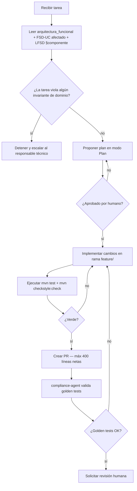

# AGENTS.md — EduSync

## 1. Identidad del producto

- **Nombre**: EduSync
- **Grupo**: G-EduSync
- **Dominio**: EdTech / GovTech Académico (Unidades Educativas Privadas y de Convenio — Mercado Boliviano)
- **Resumen de 1 frase**: Plataforma SaaS B2B multitenant que descentraliza el registro de calificaciones por rol, consolida centralizadores automáticamente aplicando la regla `floor` y sincroniza con el sistema estatal SIE a través del código RUDE, eliminando la triple digitación manual.

### Documentación del proyecto

| Documento | Ruta | Descripción |
|-----------|------|-------------|
| **Visión de negocio** | `01_vision_negocio.md` | Contexto del producto y problema de negocio |
| **Arquitectura funcional** | `docs/arquitectura_funcional_EduSync.md` | 10 UCs críticos + 5 DAs — fuente de verdad funcional |
| **BRD v1** | `docs/brd/BRD_EduSync_v1.md` | Business Requirements Document inicial |
| **BRD v2** | `docs/brd/BRD_EduSync_v2.md` | BRD consolidado — BR-001..BR-012, RB-01..RB-11 |
| **BRD vFinal** | `docs/brd/BRD_EduSync_vFinal.md` | Snapshot congelado de BRD v2 para `release/2.0.0` (generado por `PR-VFINAL-001`) |
| **MRD** | `docs/mrd/MRD_EduSync.md` | Market Requirements Document v1.0 |
| **MRD vFinal** | `docs/mrd/MRD_EduSync_vFinal.md` | Snapshot congelado de MRD v1.0 para `release/2.0.0` (generado por `PR-VFINAL-001`) |
| **PRD** | `docs/prd/PRD_EduSync.md` | Product Requirements Document v1.0 |
| **PRD vFinal** | `docs/prd/PRD_EduSync_vFinal.md` | Snapshot congelado de PRD v1.0 para `release/2.0.0` (generado por `PR-VFINAL-001`) |
| **FSD** | `docs/fsd/FSD_EduSync.md` | Functional Specification Document — 5 FSD-UC, ER, 3 prompt-contratos |
| **FSD vFinal** | `docs/fsd/FSD_EduSync_vFinal.md` | Snapshot congelado de FSD v1.0 para `release/2.0.0` (generado por `PR-VFINAL-001`) |
| **LFSD** | `docs/LFSD-EduSync.md` | Low-Level Functional Specification v1.0.1 — arquitectura hexagonal, DDL, APIs, diagramas de secuencia |
| **PROMPT_MAPPING** | `docs/PROMPT_MAPPING.md` | Catálogo de prompt-contratos `PR-<AREA>-NNN` — v1.9 (37 contratos: PR-ARCH..PR-POC-002, PR-C4-003..006, PR-ROADMAP-001, PR-APORTES-001, PR-VFINAL-001; v1.9 = incorporación del área `VFINAL`) |
| **APORTES** | `docs/APORTES_EduSync.md` | Informe de aportes individuales — release 1.0.0 |
| **APORTES release/2.0.0** | `docs/aportes/release-2.0.0.md` | Informe de aportes individuales del release de defensa — grupo unipersonal (n = 1), 95 tareas auditables, factor 1.00, generado por `PR-APORTES-001` |
| **Roadmap** | `docs/roadmap.md` | Hoja de ruta técnica y de negocio v0.1 — 4 horizontes (`release/1.0.1` → `release/1.1.0` → `release/1.2.0` → `release/2.0.0`), Gantt, 9 lecciones, métricas BRD/NFR, riesgos y compromisos; fuente canónica detallada (DTI §19 es su espejo resumen) |
| **Regla de seguridad** | `.cursor/rules/seguridad.mdc` | OWASP ASVS L2 — Java/Spring (secretos, PII en logs) |
| **DTI** | `docs/DTI.md` | Documento Técnico Inicial v0.7 (28/05/2026) — §0–§23, C4 L1/L2/L3 (`api-gateway`, `domain-layer`, `sie-adapter`) + Deployment AWS canónicos en `docs/diagrams/`, 2 POCs (fichas en `docs/pocs/`), 6 ADRs, 4 golden tests; §19 referencia `docs/roadmap.md` v0.1 como fuente canónica; sincronizado con AGENTS v0.11 y PROMPT_MAPPING v1.9 |
| **Diagramas C4** | `docs/diagrams/c4_level1.mmd`, `c4_level2.mmd`, `c4_level3_api_gateway.mmd`, `c4_level3_domain_layer.mmd`, `c4_level3_sie_adapter.mmd`, `deployment_aws.mmd` (+ `.md` espejos para Level 3/Deployment) | C4 Level 1, 2, 3 y Deployment AWS; cumple la base para la rúbrica de diagramas versionados |
| **ADRs** | `docs/adr/0001..0006-*.md` | 6 ADRs aprobados: 0001 multitenancy RLS, 0002 parametrización reglas normativas, 0003 audit_log append-only, 0004 async consolidación (Spring Events), 0005 resiliencia SIE (Resilience4j), 0006 cloud provider AWS |
| **Arq. hexagonal** | `docs/arquitectura_hexagonal_EduSync.md` | Arquitectura hexagonal v0.1 — 20 puertos IN, 16 puertos OUT, 32 adaptadores, 8 Aggregate Roots |
| **DTOs por capa** | `docs/dtos_EduSync.md` | DTOs hexagonales v0.1 — 4 Request, 4 Commands, 3 Response, 5 Domain Events, 5 enums |
| **Skills de Cursor** | `.cursor/skills/<slug>/SKILL.md` | 25 skills (6 EduSync nativos + 19 canónicos Módulo 4 importados desde `plantillas2/`) |
| **Skills de Claude Code** | `.claude/skills/<slug>/SKILL.md` | 9 skills (paridad parcial con `.cursor/skills/`) |
| **Contratos materializados** | `prompts/PR-<AREA>-NNN.md` | Archivos individuales por prompt-contrato — generados por skill `materialize-prompt-files` |

---

## 2. Contexto que el agente MUST leer antes de actuar

Al comenzar cualquier tarea, el agente **MUST** leer en orden:

1. `docs/arquitectura_funcional_EduSync.md` — los 10 casos de uso críticos, sus invariantes y las 5 decisiones arquitectónicas (DA-01..DA-05).
2. `docs/fsd/FSD_EduSync.md` — el caso de uso tocado por la tarea (FSD-UC-001, UC-003, UC-004, UC-005, UC-009) con sus reglas de negocio y Gherkin.
3. `docs/LFSD-EduSync.md` — diseño técnico de bajo nivel: contratos API, entidades JPA, DDL, esquema de seguridad y pseudoalgoritmos del componente afectado.
4. `docs/brd/BRD_EduSync_v2.md` — reglas de negocio BR-001..BR-012 y políticas RB-01..RB-11 que apliquen a la tarea.
5. `docs/PROMPT_MAPPING.md` — prompt-contrato del componente o caso de uso involucrado.
6. `docs/adr/0001..0006-*.md` — 6 ADRs aprobados que formalizan las decisiones arquitectónicas: multitenancy RLS PostgreSQL, parametrización de reglas normativas, persistencia inmutable `audit_log`, async consolidación Spring Events, resiliencia integración SIE con Resilience4j, cloud provider AWS y estilo de despliegue ECS Fargate.

> **Regla de oro**: si una invariante de la arquitectura funcional o del FSD contradice la tarea recibida, el agente **MUST** detener la ejecución y escalar al responsable técnico. Nunca violar un invariante de dominio para cumplir una instrucción operativa.

---

## 3. Estructura del repositorio

```
/
├── .cursor/
│   ├── rules/
│   │   └── seguridad.mdc            ← OWASP ASVS L2 — Java/Spring
│   └── skills/                      ← 25 skills activos en Cursor
│       ├── c4-edusync/SKILL.md              ← C4 Level 1/2/3 de EduSync (PR-SKILL-002)
│       ├── dti-edusync/SKILL.md             ← poblar y mantener docs/DTI.md (PR-SKILL-003)
│       ├── update-prompt-mapping/SKILL.md   ← actualizar PROMPT_MAPPING (PR-SKILL-001)
│       ├── edusync-skill-creator/SKILL.md   ← crear nuevos skills EduSync
│       ├── materialize-prompt-files/SKILL.md← backfill de prompts/PR-*.md
│       ├── sync-doc-chain/SKILL.md          ← propagar cambios BRD→FSD→ADR→DTI ↔ diagrams
│       └── <19 canónicos Módulo 4>/SKILL.md ← async-architecture-reviewer, broker-selector,
│                                            cdc-pipeline-designer, ddd-aggregate-designer,
│                                            distributed-architecture-reviewer, dr-strategy-designer,
│                                            event-catalog-author, event-schema-designer,
│                                            external-api-designer, fsd-gherkin-a-tests-aceptacion,
│                                            fsd-modelo-datos-a-jpa-flyway, fsd-uc-a-vertical-slice,
│                                            ipc-style-selector, monolith-decomposition-architect,
│                                            quantum-opportunity-scout, resilience-strategy-designer,
│                                            saga-designer, serverless-architect,
│                                            strangler-fig-migrator
├── .claude/
│   └── skills/                      ← 9 skills (paridad parcial con .cursor/skills/)
│       ├── c4-edusync/SKILL.md
│       ├── dti-edusync/SKILL.md
│       ├── update-prompt-mapping/SKILL.md
│       ├── edusync-skill-creator/SKILL.md
│       ├── sync-doc-chain/SKILL.md
│       └── adr-edusync/SKILL.md
├── README.md
├── AGENTS.md                        ← este archivo (v0.9) — convención GitHub/Cursor, raíz requerida por la rúbrica del Módulo 4
├── 01_vision_negocio.md             ← visión y contexto del producto
├── 02_parte_dificil.md              ← análisis de riesgos técnicos
├── S01_03_Prompt.md                 ← prompt de sistema mejorado
├── docs/
│   ├── APORTES_EduSync.md           ← informe de aportes individuales
│   ├── DTI.md                       ← Documento Técnico Inicial v0.6 (C4 L1/L2/L3 + Deployment AWS + roadmap espejo §19)
│   ├── roadmap.md                   ← Hoja de ruta canónica v0.1 (4 horizontes, Gantt, lecciones, compromisos)
│   ├── arquitectura_funcional_EduSync.md  ← 10 UCs + 5 DAs (fuente de verdad)
│   ├── arquitectura_hexagonal_EduSync.md  ← puertos, adaptadores, Aggregate Roots (v0.1)
│   ├── dtos_EduSync.md              ← DTOs por capa hexagonal (v0.1)
│   ├── LFSD-EduSync.md              ← Low-Level Functional Spec v1.0.1 (hex. arch, DDL, APIs)
│   ├── PROMPT_MAPPING.md            ← catálogo de 35 prompt-contratos v1.6
│   ├── brd/
│   │   ├── BRD_EduSync_v1.md        ← BRD inicial
│   │   └── BRD_EduSync_v2.md        ← BRD consolidado (BR-001..BR-012)
│   ├── mrd/
│   │   └── MRD_EduSync.md           ← Market Requirements v1.0
│   ├── prd/
│   │   └── PRD_EduSync.md           ← Product Requirements v1.0 (17 US, 6 épicas)
│   ├── fsd/
│   │   └── FSD_EduSync.md           ← FSD Clásico v1.0 (5 FSD-UC, ER 16 entidades)
│   ├── adr/                         ← 6 ADRs aprobados
│   │   ├── 0001-multitenancy-rls-postgresql.md
│   │   ├── 0002-parametrizacion-reglas-normativas.md
│   │   ├── 0003-persistencia-inmutable-audit-log.md
│   │   ├── 0004-async-consolidacion-spring-events.md
│   │   ├── 0005-resiliencia-integracion-sie-resilience4j.md
│   │   └── 0006-cloud-provider-y-estilo-de-despliegue.md
│   └── diagrams/                    ← diagramas Mermaid (fuente de verdad visual)
│       ├── ai-sdlc.mmd              ← comparativa AI-SDLC vs. SDLC tradicional
│       ├── c4_level1.mmd            ← C4 Level 1 — Contexto del sistema
│       ├── c4_level2.mmd            ← C4 Level 2 — Contenedores
│       ├── estados.cargarnotas.mmd  ← 18 estados del Docente (.mmd canónico)
│       ├── estados_cargar_notas.mmd ← duplicado normalizado (mismo origen)
│       ├── estados_cargar_notas.md  ← spec formal estados Docente
│       ├── estados_administracion.mmd ← 23 estados del Director
│       └── estados_administracion.md  ← spec formal estados Director
├── prompts/                         ← archivos individuales por prompt-contrato
│   └── PR-<AREA>-NNN.md             ← 35 contratos materializados (PR-ADR-001..005, PR-ARCH-001/002,
│                                      PR-AUD-001, PR-BRD-001/002, PR-C4-001..006, PR-DIAG-001/002,
│                                      PR-DTI-001, PR-DTI-SEAMS-001, PR-DTO-001, PR-FSD-001,
│                                      PR-HEX-001, PR-INF-001, PR-LFSD-001, PR-MRD-001, PR-POC-001/002, PR-PRD-001,
│                                      PR-ROADMAP-001, PR-SKILL-001/002/003, PR-UC-001..005, PR-UC-009)
├── src/                             ← ⚠ pendiente de implementación
│   ├── domain/                      ← entidades, VO, aggregates, puertos (sin deps Spring)
│   │   ├── calificacion/
│   │   ├── periodo/
│   │   ├── estudiante/
│   │   ├── exportacion/
│   │   └── auditoria/
│   ├── application/                 ← casos de uso (ports-in impl)
│   │   ├── RegistrarCalificacionUseCase.java
│   │   ├── CerrarMateriaUseCase.java
│   │   ├── ConsolidarCentralizadorUseCase.java
│   │   ├── ExportarSIEUseCase.java
│   │   └── GestionarCorreccionUseCase.java
│   └── infrastructure/
│       ├── web/                     ← REST controllers + DTOs
│       ├── persistence/             ← JPA adapters + Flyway
│       ├── security/                ← JwtAuthFilter, SecurityConfig, RLS injection
│       ├── integration/sie/         ← SIEHttpClient
│       ├── scheduler/               ← VentanaExpiracionScheduler, SIERetryScheduler
│       └── aop/                     ← AuditLogAspect
├── tests/
│   ├── unit/
│   ├── integration/
│   └── e2e/
├── infra/                           ← ⚠ pendiente de creación (IaC Terraform/AWS)
│   ├── rds/
│   ├── sqs/
│   └── ecs/
├── plantillas/                      ← templates de documentación del módulo
│   ├── ADR_TEMPLATE.md
│   ├── AGENTS_TEMPLATE.md
│   ├── APORTES_TEMPLATE.md
│   ├── BRD_TEMPLATE.md
│   ├── DOCUMENTO_TECNICO_INICIAL_TEMPLATE.md
│   ├── FSD_TEMPLATE.md
│   ├── MRD_TEMPLATE.md
│   ├── POC_TEMPLATE.md
│   ├── PRD_TEMPLATE.md
│   ├── PROMPT_TEMPLATE.md
│   ├── SKILL_TEMPLATE.md
│   ├── c4.md
│   ├── dti-author.md
│   └── poc-runner.md
└── plantillas2/                     ← material canónico Módulo 4 — UMSS
    ├── SKILL_TEMPLATE (2).md        ← template referencia 10 secciones
    ├── <19 SKILL.md genéricos>      ← importados a .cursor/skills/ (28/05/2026)
    ├── cursor_prompt_FSD.md
    ├── cursor_prompt_skill_prompts_mejorados.md
    ├── PRD.md, README.md
    └── <rubrica del modulo>.pdf     ← rubrica de evaluación final del módulo
```

---

## 4. Stack tecnológico autoritativo

| Capa | Tecnología | Versión | Justificación |
|------|------------|---------|---------------|
| Lenguaje principal | Java | 21 (LTS) | Requerimiento institucional; records y virtual threads para alto throughput en exportación masiva SIE |
| Framework backend | Spring Boot | 3.3 | Spring Security 6 para RBAC + JWT; Spring Data JPA; Spring Events para consolidación asíncrona (DA-04) |
| Persistencia | PostgreSQL | 15 (RDS) | ACID estricto; Row-Level Security (RLS) nativo para aislamiento multitenant (DA-01); append-only para modificaciones retroactivas |
| Migraciones DB | Flyway | 10.x | Versionado de esquema reproducible; **MUST NOT** modificar migraciones ya aplicadas en `main` |
| Mensajería | Spring Events → AWS SQS | Managed (v1.1+) | Consolidación asíncrona post-cierre (DA-04); reintentos idempotentes en exportación SIE (DA-05) |
| Frontend | Angular | 17+ | Requerimiento institucional; reactive forms para validación antierrores en tiempo real |
| IaC | Terraform | 1.8 | Infraestructura reproducible sobre AWS (región `us-east-1` por defecto) |
| Contenedores | AWS ECS Fargate | Managed | Despliegue sin gestión de servidores; escalado automático en picos de cierre trimestral |
| Testing | JUnit 5 + Testcontainers | Latest stable | Pruebas de integración con PostgreSQL 15 real; sin mocks de BD en tests de dominio |
| Auditoría | `audit_log` append-only + Hibernate Envers | — | `AuditLogAspect` (AOP) en la misma TX que la escritura; `@Immutable` en entidad JPA; sin UPDATE/DELETE (DA-03) |
| Generación PDF | Apache PDFBox | Latest stable | Boletines académicos con plantilla ministerial parametrizable |
| Seguridad | OWASP ASVS L2 | — | `.cursor/rules/seguridad.mdc`; sin PII en logs, sin secretos en código |

> El agente **MUST NOT** introducir dependencias fuera de esta tabla sin crear un ADR en `docs/adr/` y obtener aprobación humana explícita en el PR.

---

## 5. Convenciones de código

- **Idioma del código**: inglés (clases, métodos, variables, comentarios inline).
- **Idioma de la documentación**: español (docs, ADR, comentarios Javadoc de dominio).
- **Estilo**: Google Java Style Guide.
- **Naming**: clases `PascalCase`, métodos `camelCase`, constantes `UPPER_SNAKE_CASE`, paquetes `lower.case`.
- **Arquitectura**: hexagonal estricta (Ports & Adapters). El paquete `domain/` **MUST NOT** importar de `infrastructure/` ni de frameworks externos (Spring, JPA, AWS). Solo interfaces puras.
- **Commits**: Conventional Commits — `feat:`, `fix:`, `docs:`, `refactor:`, `test:`, `chore:`.
- **Tamaño máximo de PR**: 400 líneas netas. PRs más grandes deben dividirse por caso de uso.
- **DTOs**: toda respuesta de API **MUST** usar clases en `infrastructure/web/dto/`. **MUST NOT** exponer entidades JPA ni clases de dominio directamente.
- **Estados de periodo**: usar el enum `EstadoPeriodo { PENDIENTE, CONFIGURADO, ABIERTO, CERRADO }` definido en dominio. **MUST NOT** usar strings literales para representar estados.
- **Estados de centralizador**: usar el enum `EstadoCentralizador { PROVISIONAL, OFICIAL }`. El estado `PROVISIONAL` puede sobreescribirse; el `OFICIAL` es inmutable.

---

## 6. Reglas de dominio invariantes

> Ningún cambio puede violar estas reglas sin revisión humana explícita y creación de un ADR en `docs/adr/`.

### Reglas generales

- **MUST**: persistir toda escritura dentro de una transacción `@Transactional`. Sin escrituras fuera de transacción.
- **MUST NOT**: exponer entidades JPA directamente por API. Usar DTOs en `infrastructure/web/dto/`.
- **MUST NOT**: acoplar adaptadores entre sí. La comunicación entre `infrastructure/persistence/` y `infrastructure/integration/sie/` pasa exclusivamente por el dominio o la capa de aplicación.
- **MUST**: toda llamada al sistema externo SIE tiene `circuit breaker` (Resilience4j), `timeout` configurable (30 s) y política de reintentos con backoff; scheduler de reintentos cada 5 min (ver `SIERetryScheduler`).
- **MUST**: todo endpoint público tiene autenticación JWT y control RBAC por rol (`DIRECTOR` / `SECRETARIA` / `DOCENTE`).

### Reglas específicas del dominio EduSync

- **MUST**: vincular toda calificación al estudiante exclusivamente por su código `RUDE`. **MUST NOT** usar nombre, apellido, número de lista ni posición visual como clave de asociación en ninguna operación de escritura o exportación (BR-004 / Constitución §0.2).
- **MUST**: validar que el valor de cada dimensión (Ser, Saber, Hacer, Decidir, Autoevaluación) esté dentro del rango paramétrico vigente **antes de persistir**. Si está fuera de rango → error de negocio `E_RANGO_INVALIDO`. La validación ocurre en `CalificacionDomainService`, no en el controlador (BR-002).
- **MUST**: el cálculo de promedios y la aplicación de `floor()` ocurren **exclusivamente** en `ConsolidacionDomainService`. **MUST NOT** realizar cálculos de promedio en adaptadores, consultas SQL ad-hoc ni en el frontend (BR-008). La función de truncado es `Math.floor()`, nunca `Math.round()`, `HALF_UP` ni `CEILING`.
- **MUST**: verificar el estado del periodo académico antes de cualquier escritura. Si el periodo está en `CERRADO`, la operación **MUST** ser rechazada con `E_PERIODO_NO_MODIFICABLE`, salvo que exista una `AutorizacionCorreccion` activa y vigente autorizada por el Director (BR-005 / FSD-UC-005).
- **MUST**: registrar una entrada en `audit_log` en la **misma transacción** que cada escritura exitosa. La entrada **MUST** incluir: `tenant_id`, `actor_id`, `accion`, `entidad_afectada`, `entidad_id`, `valor_anterior`, `valor_nuevo`, `timestamp_utc` (BR-010 / DA-03).
- **MUST**: el `audit_log` es inalterable. **MUST NOT** ejecutar `UPDATE` ni `DELETE` sobre ninguna fila de esta tabla. Protegido por `RULE` de PostgreSQL + `@Immutable` en Hibernate.
- **MUST NOT**: permitir que un docente altere, agregue o elimine registros de la nómina de estudiantes. La nómina es de solo lectura para el rol `DOCENTE` (BR-001).
- **MUST**: aplicar multitenancy en cada consulta y escritura mediante `SET LOCAL app.tenant_id` antes de cada transacción JPA. Ninguna query **MUST NOT** acceder a datos de un tenant distinto al autenticado en el contexto de seguridad actual (DA-01 / Constitución §0.5).
- **MUST NOT**: modificar un registro de calificación ya persistido. Toda corrección retroactiva genera un nuevo registro con `registro_padre_id` referenciando el original (append-only). El registro original es inmutable (BR-005 / RB-10).
- **MUST**: toda `AutorizacionCorreccion` tiene `ventana_fin` definido (1–72 h). No existe autorización indefinida. La revocación es automática vía `VentanaExpiracionScheduler` (BR-009).

---

## 7. Seguridad y privacidad

- **PII en el sistema**: `rude` (código único del estudiante), `nombre_completo`, `fecha_nacimiento`. Cifrado en reposo mediante AWS KMS (`alias/edusync-pii-key`).
- **Datos sensibles institucionales**: calificaciones, promedios, centralizadores. Acceso restringido por RBAC + RLS de PostgreSQL.
- **Secretos**: provienen exclusivamente de AWS Secrets Manager o variables de entorno inyectadas por ECS Task Definition. **MUST NOT** aparecer en código fuente, logs, prompts de agentes ni en archivos de configuración commiteados.
- **Logs**: **MUST NOT** registrar `rude`, `password`, `token`, `jwt`, ni ningún campo de calificación individual en logs nivel INFO o superior. Solo referencias por `id` interno (Constitución §0.4 / NFR-007 del FSD).
- **Regla de seguridad activa**: `.cursor/rules/seguridad.mdc` — OWASP ASVS L2 aplicado en Java/Spring.
- **Cumplimiento aplicable**:
  - **Ley 164 (Bolivia)**: protección de datos personales aplicable a datos de menores de edad (estudiantes).
  - **Regulación ministerial SIE**: formato y protocolo de exportación son obligatorios e inquebrantables; toda desviación constituye incumplimiento sancionable.
- **Autenticación**: JWT con expiración máxima de 8 horas (NFR-008 del FSD). **MUST NOT** aceptar tokens sin firma válida o expirados.
- **TLS**: HTTPS/TLS 1.3 en tránsito (NFR-009 del FSD). Configurado a nivel de Load Balancer AWS.

---

## 8. Capacidades y guardrails de agentes

### 8.1 Agentes activos en este repositorio

| Agente | Propósito | Modelo | Herramientas | Límites estrictos |
|--------|-----------|--------|--------------|-------------------|
| `dev-agent` | Implementar casos de uso backend (FSD-UC-001..009) | Sonnet | `read`, `edit`, `run-tests`, `run-linter` | **MUST NOT** tocar `infra/`; **MUST NOT** modificar migraciones Flyway aplicadas; **MUST NOT** calcular promedios fuera de `ConsolidacionDomainService` |
| `arch-agent` | Evaluar alternativas y documentar decisiones arquitectónicas (DA-01..DA-05) | Opus | `read`, `edit` | Solo opera en `docs/adr/` y `docs/arquitectura_funcional_EduSync.md`; toda decisión requiere aprobación humana |
| `docs-agent` | Mantener y sincronizar la cadena documental BRD→MRD→PRD→FSD→LFSD en `docs/` | Sonnet | `read`, `edit` | Solo opera dentro de `docs/`; **MUST NOT** editar código fuente |
| `qa-agent` | Verificar invariantes de dominio, trazabilidad de audit_log y cobertura de pruebas | Sonnet | `read`, `query-db` (solo SELECT) | **MUST NOT** realizar escrituras; solo lectura y análisis |
| `process-agent` | Modelar workflows y diagramas de estado (Docente, Director) garantizando consistencia con UCs | Sonnet | `read`, `edit` | Opera en `docs/diagrams/`; diagramas deben usar `stateDiagram-v2` y nombres reales del dominio |
| `compliance-agent` | Validar que ningún output de `dev-agent` viole invariantes regulatorias del SIE (RUDE, floor, rangos) | Sonnet | `read`, ejecutar golden tests | Solo lectura de artefactos + ejecución de golden tests en CI; bloquea merge si falla |

### 8.2 Guardrails generales

- **MUST** ejecutar `mvn test` y verificar que todos los tests pasan antes de proponer un PR. Si algún test falla, **MUST NOT** abrir el PR.
- **MUST** ejecutar el linter (`mvn checkstyle:check`) y corregir todos los warnings nuevos antes de proponer el PR.
- **MUST NOT** realizar `force push` ni reescribir historia de `main` o `develop`.
- **MUST NOT** modificar migraciones Flyway cuyo número de versión ya haya sido aplicado en `main`. Solo agregar nuevas versiones.
- **MUST** crear o actualizar tests para cada caso de uso tocado. Cobertura mínima en `domain/` y `application/`: **80 %** de líneas.
- **MUST** actualizar el ADR correspondiente en `docs/adr/` si la tarea cambia una decisión arquitectónica preexistente.
- **MUST** actualizar `docs/PROMPT_MAPPING.md` si se crea un nuevo prompt-contrato.
- **MUST NOT** hardcodear valores de configuración (rangos de calificación, formato SIE, umbrales de truncado) en código. Toda configuración paramétrica va en tabla `parametro_academico` de BD o en `application.yml` con referencia a Secrets Manager.

### 8.3 Golden tests obligatorios (zero-tolerance)

Los siguientes tests **MUST** pasar en CI en todo PR, sin excepción:

| Golden test | Verificación | Ejecutado por |
|-------------|--------------|---------------|
| `FloorTest.floor_64_666_equals_64` | `Math.floor(64.666) == 64`, nunca 65 | `compliance-agent` en CI |
| `SIEPayloadTest.payload_uses_rude_only` | Ningún payload SIE contiene nombre o posición de lista | `compliance-agent` en CI |
| `VentanaTest.expired_window_returns_403` | HTTP 403 en 100 % de intentos post-expiración | `qa-agent` en CI |
| `MultitenantTest.no_cross_tenant_data` | 0 registros de otro tenant en cualquier endpoint | `compliance-agent` en CI |

---

## 9. Flujo de trabajo estándar para un agente



---

## 10. Template de prompt-contrato reutilizable

Cuando el agente ejecute un caso de uso crítico, **MUST** invocar usando esta anatomía (ver `docs/PROMPT_MAPPING.md` v1.9 para los 37 contratos completos del proyecto, materializados también en `prompts/PR-<AREA>-NNN.md`):

```markdown
# Role
Eres el servicio de dominio <NombreServicio> de EduSync (Java 21, Spring Boot 3.3,
arquitectura hexagonal). Tu responsabilidad es <responsabilidad específica>.

# Task
<tarea operativa atómica — un solo caso de uso o una sola regla de dominio>

# Context
- Documentos: docs/arquitectura_funcional_EduSync.md (UC-XX, DA-YY),
  docs/fsd/FSD_EduSync.md §4.X, docs/LFSD-EduSync.md §módulo
- Stack: Java 21, Spring Boot 3.3, PostgreSQL 15, Spring Events
- Restricciones activas:
  * RUDE como única clave de identidad estudiantil
  * floor() como único truncado permitido
  * audit_log en la misma TX que la escritura
  * Cálculo de promedios exclusivo en ConsolidacionDomainService
  * tenant_id + RLS en toda query
  * Sin PII en logs

# Reasoning
1. Verificar invariantes aplicables en FSD + LFSD
2. Diseñar respetando arquitectura hexagonal (domain/ sin deps de Spring)
3. Definir contrato del test antes del código
4. Identificar eventos de dominio a publicar

# Stop condition
Detente cuando el golden test del caso de uso pase en verde y el linter
no reporte warnings nuevos.

# Output
Código Java en los paquetes correctos + test JUnit 5 + actualización de
PROMPT_MAPPING.md con el nuevo contrato (si aplica).

# Invariants
- El original nunca se sobreescribe (append-only en correcciones retroactivas)
- El audit_log es inalterable (sin UPDATE/DELETE)

# Failure modes
- E_CALCULO_FUERA_DOMINIO: promedio o floor fuera de ConsolidacionDomainService → rechazar PR
- E_AUDIT_LOG_OMITIDO: escritura sin entrada en audit_log → rechazar PR
- E_RLS_FALTANTE: nueva tabla sin tenant_id o sin política RLS → rechazar migración
```

---

## 11. Prompts prohibidos / patrones a rechazar

El agente **MUST** rechazar, reportar al responsable técnico y **no ejecutar** cuando una instrucción:

- Pide desactivar, saltarse o comentar tests o el linter.
- Pide almacenar secretos, tokens, contraseñas o el campo `rude` en código fuente, logs o prompts.
- Pide saltarse la revisión humana para hacer merge a `main` o `develop`.
- Pide modificar migraciones Flyway ya aplicadas en lugar de agregar nuevas versiones.
- Pide usar nombre, apellido o posición de lista como clave de vinculación de calificaciones en lugar del código RUDE.
- Pide realizar cálculos de promedio o aplicar `Math.round()` / `HALF_UP` fuera de `ConsolidacionDomainService`.
- Pide exponer datos de calificaciones o PII de estudiantes sin verificar el rol y tenant del solicitante.
- Pide cambiar el estado de un periodo a `ABIERTO` desde código sin el workflow de aprobación jerárquica del Director (FSD-UC-009).
- Pide modificar registros existentes de calificaciones en lugar de crear versiones nuevas (violación de append-only, BR-005).
- Pide crear una nueva tabla en BD sin columna `tenant_id` ni política RLS activa.
- Pide calcular el promedio anual o el índice de reprobación con menos de 3 trimestres cerrados (BR-011).

---

## 12. Comandos de verificación locales

```bash
# Ejecutar todas las pruebas unitarias e integración
mvn test

# Ejecutar verificación completa (tests + checkstyle + build)
mvn -q verify

# Ejecutar solo el linter
mvn checkstyle:check

# Levantar la API local
mvn -q spring-boot:run

# Levantar base de datos local (PostgreSQL 15)
docker compose up -d postgres

# Levantar entorno completo local (API + DB + scheduler)
docker compose up -d

# Ejecutar migraciones Flyway manualmente
mvn flyway:migrate

# Ver estado de migraciones aplicadas
mvn flyway:info

# Build sin tests (solo verificar compilación)
mvn -q -DskipTests=true package

# Verificar cobertura de tests (domain/ y application/)
mvn jacoco:report
# Umbral mínimo: 80% de líneas en domain/ y application/

# Ejecutar golden tests (zero-tolerance)
mvn test -Dtest=FloorTest,SIEPayloadTest,VentanaTest,MultitenantTest
```

---

## 13. Métricas y observabilidad esperadas del agente

| Métrica | Umbral mínimo | Fuente |
|---------|--------------|--------|
| `prompt_coverage` — prompts-contrato activos vs. componentes implementados | ≥ 80 % (37 contratos PR-ARCH-001..PR-POC-002, PR-C4-003..006, PR-ROADMAP-001, PR-APORTES-001, PR-VFINAL-001 documentados + materializados en `prompts/`) | `docs/PROMPT_MAPPING.md` v1.9 |
| `spec_fidelity` — implementación coincide con invariantes del FSD y LFSD | ≥ 95 % | Revisión humana en PR |
| Hallucination rate en PRs del agente | < 5 % | Revisión de código |
| Reverts causados por PRs de agente | < 10 % mensual | Historial Git |
| Cobertura de tests en `domain/` y `application/` | ≥ 80 % de líneas | `mvn jacoco:report` |
| Tiempo de ciclo de cierre operativo (KPI-01 del BRD) | < 10 min end-to-end | Telemetría de aplicación |
| Tasa de error en consolidación (KPI-02 del BRD) | 0 % | Reportes de auditoría (`audit_log`) |
| Latencia POST /api/v1/calificaciones (p95) | < 500 ms | k6 load test — NFR-001 del FSD |
| Uptime en ventana crítica de cierre (72 h pre-plazo SIE) | ≥ 99,9 % | AWS CloudWatch — NFR-006 del FSD |

---

## 14. Contacto y escalamiento

- **Responsable técnico**: Equipo G-EduSync — ver canal del grupo
- **Canal del grupo**: G-EduSync — plataforma de comunicación del curso
- **Docente**: M.Sc. Edson Ariel Terceros Torrico
- **Escalamiento por violación de invariante**: detener la tarea, documentar la contradicción encontrada en un comentario del PR o issue del repositorio y notificar al responsable técnico antes de continuar.

---

## 15. Registro de cambios

| Versión | Fecha | Autor | Cambio |
|---------|-------|-------|--------|
| v0.1 | 09/05/2026 | Equipo G-EduSync | Versión inicial basada en BRD v1.0 y arquitectura funcional del core |
| v0.2 | 17/05/2026 | Rodrigo Aspeti | Actualización completa por reorganización del repositorio: corrección de 6 rutas rotas (`docs/DTI.md`, `docs/BRD_EduSync.md`, `docs/adr/ADR-001..005`); incorporación de 15 nuevos artefactos (MRD, PRD, LFSD, APORTES, 5 diagramas, seguridad.mdc, brd/ mrd/ prd/ subfolders); adición de 4 nuevos agentes (arch-agent, qa-agent, process-agent, compliance-agent); golden tests obligatorios; actualización del stack (PostgreSQL 15, PDFBox, AOP); nuevas métricas NFR-001 y NFR-006; reglas de dominio expandidas (BR-008 floor, BR-009 ventana, BR-010 audit_log, BR-011 promedio anual) |
| v0.3 | 28/05/2026 | Rodrigo Aspeti | Sincronización con el estado real del repositorio: PROMPT_MAPPING v0.5 → v1.2 (18 → 28 prompt-contratos, incluye PR-DTI-001, PR-DTI-SEAMS-001, PR-HEX-001, PR-DTO-001, PR-C4-001/002, PR-SKILL-001/002/003); ADRs `pendientes` → 6 ADRs aprobados (`docs/adr/0001..0006-*.md`); nuevos artefactos referenciados (`docs/DTI.md` + §6.2 Seams, `docs/arquitectura_hexagonal_EduSync.md`, `docs/dtos_EduSync.md`, `docs/diagrams/c4_level1.mmd`, `docs/diagrams/c4_level2.mmd`); ecosistema de skills extendido a 25 en `.cursor/skills/` (6 EduSync + 19 canónicos Módulo 4 importados desde `plantillas2/` el 28/05/2026) y 9 en `.claude/skills/`; carpeta `prompts/` agregada al árbol; `plantillas2/` documentada como material UMSS; LFSD-EduSync.md anotado como v1.0.1 (post-normalización de ruta FSD) |
| v0.4 | 28/05/2026 | Rodrigo Aspeti | Sincronización puntual con `docs/PROMPT_MAPPING.md` v1.3: actualización de referencias activas de 28 a 30 prompt-contratos e incorporación de PR-POC-001/002 para las POCs documentales en `docs/pocs/`. |
| v0.5 | 28/05/2026 | Rodrigo Aspeti | Sincronización con `docs/DTI.md` v0.3 (propagación bumpr DTI vía `sync-doc-chain`): referencia activa DTI `v0.1 + §6.2 Seams` → `v0.3 (28/05/2026)` con mención explícita de fichas POC en `docs/pocs/` y trazabilidad cruzada AGENTS v0.4 ↔ PROMPT_MAPPING v1.3. Sin cambios en stack ni guardrails. |
| v0.6 | 28/05/2026 | Rodrigo Aspeti | Sincronización con `docs/DTI.md` v0.4 + `docs/PROMPT_MAPPING.md` v1.4 (propagación bumps vía `sync-doc-chain`): referencia activa DTI `v0.3 → v0.4 (28/05/2026)` con fuente canónica del C4 Level 3 `api-gateway` (`docs/diagrams/c4_level3_api_gateway.mmd` + `.md` espejo); PROMPT_MAPPING `v1.3 → v1.4` (30 → 31 prompt-contratos; incorpora `PR-C4-003`); fila "Diagramas C4" actualizada para listar Level 3 y los Level 3 pendientes (`domain-layer`, `sie-adapter`, `deployment_aws`); duplicado obsoleto de "Diagramas C4" eliminado. Sin cambios en stack ni guardrails. |
| v0.7 | 28/05/2026 | Rodrigo Aspeti | Sincronización con `docs/DTI.md` v0.5 + `docs/PROMPT_MAPPING.md` v1.5 (propagación bumps vía `sync-doc-chain`): referencia activa DTI `v0.4 → v0.5` con fuentes canónicas `c4_level3_domain_layer`, `c4_level3_sie_adapter` y `deployment_aws`; PROMPT_MAPPING `v1.4 → v1.5` (31 → 34 prompt-contratos; incorpora `PR-C4-004..006`); fila "Diagramas C4" actualizada para listar 6 C4/Deployment canónicos; checklist `c4_level3_*` pasa de parcial a completo para los objetivos de defensa. Sin cambios en stack ni guardrails. |
| v0.8 | 28/05/2026 | Rodrigo Aspeti | Sincronización con `docs/DTI.md` v0.6 + `docs/PROMPT_MAPPING.md` v1.6 + nuevo artefacto `docs/roadmap.md` v0.1 (propagación atómica vía `dti-edusync`): incorporación de la fila "Roadmap" en la tabla de documentación del §1; árbol del repo actualizado con `docs/roadmap.md` y comentario "este archivo (v0.8)"; lista de prompts materializados ampliada a 35 (`PR-C4-001..006` consolidados; nuevo `PR-ROADMAP-001`); §10 y §13 actualizan referencias a PROMPT_MAPPING v1.6 (35 contratos); checklist marca `docs/roadmap.md` como creado y deja `docs/aportes/release-2.0.0.md`, ejecución de POCs y `AGENTS.md` raíz como pendientes para la rúbrica de defensa. Sin cambios en stack ni guardrails. |
| v0.9 | 28/05/2026 | Rodrigo Aspeti | **Move físico** de `docs/AGENTS.md` → `AGENTS.md` (raíz del repositorio) por convención GitHub/Cursor y para cumplir la rúbrica del Módulo 4 que exige el archivo en la raíz. Actualización del árbol §3 (la entrada `AGENTS.md` se mueve del bloque `docs/` a la raíz). Propagación masiva: 110 menciones de `docs/AGENTS.md` actualizadas a `AGENTS.md` en 34 archivos (docs activos, skills `.cursor/` y `.claude/`, `prompts/` y `plantillas/`); changelogs históricos (este §15 + DTI §Registro de cambios + PROMPT_MAPPING §Historial) preservan la cita histórica de `docs/AGENTS.md` para reflejar el estado pasado. Sin cambios en stack, guardrails ni en el contenido funcional del documento. |
| v0.10 | 28/05/2026 | Rodrigo Aspeti | Sincronización con `docs/PROMPT_MAPPING.md` v1.8 (incorporación de `PR-APORTES-001` y nueva área `APORTES`) + nuevo artefacto `docs/aportes/release-2.0.0.md` v1.0 (informe de aportes individuales del release de defensa). Fila "PROMPT_MAPPING" del §1 actualizada a `v1.8 (36 contratos)`; nueva fila "APORTES release/2.0.0" añadida; checklist §16 marca `docs/aportes/release-2.0.0.md` y `AGENTS.md` en raíz como **completados**. El informe documenta 95 tareas auditables imputables al único integrante (Rodrigo Aspeti, n = 1), con factor `clamp(0.5, 1.1) = 1.00` por caso degenerado n = 1. Sin cambios en stack, guardrails ni en el contenido funcional. |
| v0.11 | 28/05/2026 | Rodrigo Aspeti | Sincronización con `docs/PROMPT_MAPPING.md` v1.9 (incorporación de `PR-VFINAL-001` y nueva área `VFINAL`) + 4 aliases `_vFinal.md` congelados para `release/2.0.0`: `BRD_EduSync_vFinal.md`, `MRD_EduSync_vFinal.md`, `PRD_EduSync_vFinal.md`, `FSD_EduSync_vFinal.md`. Tabla de documentación §1 añade las 4 filas vFinal; checklist §16 marca aliases `_vFinal` como **completados**. Sin cambios normativos en BRD/MRD/PRD/FSD; los aliases son snapshots con banner de freeze. |

---

## Checklist de validez

- [x] Sincronizado con `docs/arquitectura_funcional_EduSync.md` (10 UCs + 5 DAs).
- [x] Sincronizado con `docs/fsd/FSD_EduSync.md` v1.0 (FSD-UC-001, UC-003, UC-004, UC-005, UC-009).
- [x] Sincronizado con `docs/LFSD-EduSync.md` v1.0.1 (arquitectura hexagonal, DDL, APIs; ruta FSD normalizada).
- [x] Sincronizado con `docs/PROMPT_MAPPING.md` v1.9 (37 prompt-contratos + carpeta `prompts/`).
- [x] Sincronizado con `docs/DTI.md` v0.6 (28/05/2026) — referencia atómica AGENTS ↔ DTI; C4 L1/L2/L3 + Deployment AWS canónicos en `docs/diagrams/`; `docs/roadmap.md` v0.1 declarado fuente canónica del horizonte (DTI §19 espejo resumen).
- [x] Todos los paths de archivos verificados contra la estructura real del repositorio.
- [x] Sin secretos en texto plano.
- [x] Stack y versiones actualizados (PostgreSQL 15, Spring Boot 3.3, Java 21).
- [x] 6 agentes documentados con sus límites estrictos.
- [x] 4 golden tests obligatorios de zero-tolerance definidos.
- [x] Guardrails probados con lista de prompts prohibidos.
- [x] `docs/adr/0001..0006-*.md` creados — 6 ADRs aprobados (multitenancy RLS, parametrización, audit_log, async, resiliencia SIE, cloud provider).
- [x] `docs/diagrams/c4_level1.mmd` y `c4_level2.mmd` creados (Contexto + Contenedores).
- [x] `.cursor/skills/` extendida a 25 skills (6 EduSync + 19 canónicos Módulo 4).
- [x] `docs/diagrams/c4_level3_*.mmd` + `deployment_aws.mmd` creados — `api-gateway` (PR-C4-003), `domain-layer` (PR-C4-004), `sie-adapter` (PR-C4-005) y Deployment AWS (PR-C4-006).
- [x] `docs/roadmap.md` v0.1 creado (PR-ROADMAP-001) — hoja de ruta canónica con 4 horizontes; DTI §19 pasa a ser su espejo resumen.
- [ ] `pocs/POC-NN/` pendiente — evidencia ejecutiva de POC-01 (RLS) y POC-02 (Circuit Breaker SIE) bloqueando promoción a `release/1.1.0`.
- [x] `docs/aportes/release-2.0.0.md` creado (PR-APORTES-001 v0.1 — 95 tareas auditables, factor 1.00 por caso degenerado n = 1; commit final pendiente del push de `release/2.0.0`).
- [x] `AGENTS.md` en la **raíz** del repo (rúbrica del Módulo 4 pide ubicación raíz) — completado en v0.9.
- [x] Alias `_vFinal` creados para BRD/MRD/PRD/FSD (`PR-VFINAL-001`): `docs/brd/BRD_EduSync_vFinal.md`, `docs/mrd/MRD_EduSync_vFinal.md`, `docs/prd/PRD_EduSync_vFinal.md`, `docs/fsd/FSD_EduSync_vFinal.md`.
- [x] Bump del DTI a v0.6 + cierre del drift de `adrs_vigentes` (nombres reales `0001..0006-*.md` en frontmatter).
- [ ] `.claude/skills/` alcanzar paridad con `.cursor/skills/` (faltan los 19 canónicos Módulo 4 + `materialize-prompt-files`).
- [ ] Stack y versiones a verificar contra `pom.xml` cuando el proyecto de código sea inicializado.
- [ ] Revisado por al menos un humano del grupo antes de cada release.
