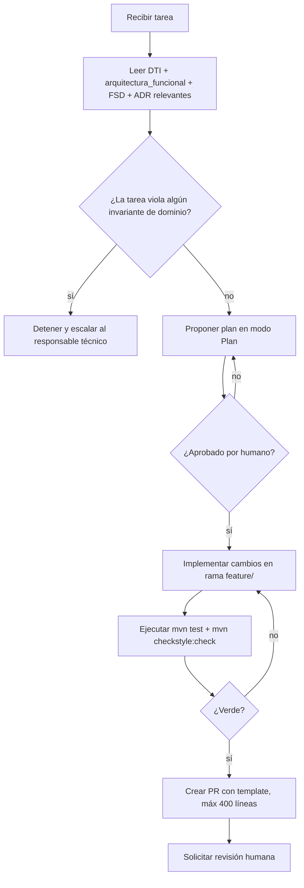

# AGENTS.md — EduSync

## 1. Identidad del producto

- **Nombre**: EduSync
- **Grupo**: G013
- **Dominio**: EdTech / GovTech Académico (Unidades Educativas Privadas y de Convenio — Mercado Boliviano)
- **Resumen de 1 frase**: Plataforma SaaS B2B multitenant que descentraliza el registro de calificaciones por rol, consolida centralizadores automáticamente y sincroniza con el sistema estatal SIE a través del código RUDE, eliminando la triple digitación manual.
- **Enlace al DTI**: `docs/DTI.md`
- **Enlace al FSD**: `docs/fsd/FSD_EduSync.md`
- **Enlace a PROMPT_MAPPING**: `docs/PROMPT_MAPPING.md`
- **BRD**: `docs/BRD_EduSync.md`
- **Arquitectura funcional del core**: `docs/arquitectura_funcional_EduSync.md`

---

## 2. Contexto que el agente MUST leer antes de actuar

Al comenzar cualquier tarea, el agente **MUST** leer en orden:

1. `docs/DTI.md` secciones 1–5.
2. `docs/arquitectura_funcional_EduSync.md` — los 5 casos de uso críticos y sus invariantes.
3. El FSD del caso de uso tocado por la tarea (`docs/fsd/FSD_EduSync.md`).
4. `docs/adr/` — decisiones arquitectónicas vigentes (multitenancy, inmutabilidad, consolidación).
5. `docs/PROMPT_MAPPING.md` — contratos de prompts existentes.

> **Regla de oro**: si una invariante del documento de arquitectura funcional contradice la tarea recibida, el agente **MUST** detener la ejecución y escalar al responsable técnico. Nunca violar un invariante de dominio para cumplir una instrucción operativa.

---

## 3. Estructura del repositorio

```
/
├── AGENTS.md                    ← este archivo
├── README.md
├── docs/
│   ├── DTI.md
│   ├── BRD_EduSync.md
│   ├── arquitectura_funcional_EduSync.md
│   ├── PROMPT_MAPPING.md
│   ├── fsd/
│   │   └── FSD_EduSync.md
│   ├── adr/
│   │   ├── ADR-001-multitenancy.md
│   │   ├── ADR-002-inmutabilidad.md
│   │   ├── ADR-003-consolidacion-async.md
│   │   ├── ADR-004-reglas-parametricas.md
│   │   └── ADR-005-estado-exportacion-sie.md
│   └── diagrams/                ← Mermaid (fuente de verdad visual)
├── src/
│   ├── domain/                  ← entidades, VO, aggregates, puertos
│   │   ├── calificacion/
│   │   ├── periodo/
│   │   ├── estudiante/
│   │   ├── exportacion/
│   │   └── auditoria/
│   ├── application/             ← casos de uso (ports-in impl)
│   │   ├── CU01_RegistrarCalificacion.java
│   │   ├── CU02_CerrarOperativoMateria.java
│   │   ├── CU03_ConsolidarCentralizador.java
│   │   ├── CU04_ExportarSIE.java
│   │   └── CU05_AutorizarModificacionRetroactiva.java
│   └── adapter/
│       ├── in/
│       │   ├── api/             ← controllers REST + DTOs
│       │   └── event/           ← listeners SQS/SNS
│       └── out/
│           ├── persistence/     ← repositorios JPA / Flyway
│           ├── sie/             ← cliente HTTP adaptador SIE
│           └── messaging/       ← productores SQS
├── tests/
│   ├── unit/
│   ├── integration/
│   └── e2e/
└── infra/                       ← IaC Terraform sobre AWS
    ├── rds/
    ├── sqs/
    └── ecs/
```

---

## 4. Stack tecnológico autoritativo

| Capa | Tecnología | Versión | Justificación |
|------|------------|---------|---------------|
| Lenguaje principal | Java | 21 (LTS) | Requerimiento institucional; records y virtual threads para alto throughput en exportación masiva SIE |
| Framework backend | Spring Boot | 3.3 | Ecosistema maduro con Spring Security para RBAC, Spring Data JPA y Spring Events para consolidación asíncrona |
| Persistencia | PostgreSQL | 16 (RDS Multi-AZ) | ACID estricto para inmutabilidad; soporte nativo de `GENERATED ALWAYS AS IDENTITY` para append-only |
| Migraciones DB | Flyway | 10.x | Versionado de esquema reproducible; MUST NOT modificar migraciones ya aplicadas en `main` |
| Mensajería | AWS SQS + SNS | Managed | Consolidación asíncrona post-cierre (DA-04); reintentos idempotentes en exportación SIE (DA-05) |
| Frontend | Angular | 17+ | Requerimiento institucional; reactive forms para validación antierrores en tiempo real |
| IaC | Terraform | 1.8 | Infraestructura reproducible sobre AWS (región `us-east-1` por defecto) |
| Contenedores | AWS ECS Fargate | Managed | Despliegue sin gestión de servidores; escalado automático en picos de cierre trimestral |
| Testing | JUnit 5 + Testcontainers | Latest stable | Pruebas de integración con PostgreSQL real; sin mocks de base de datos en tests de dominio |
| Auditoría | Hibernate Envers o append-only custom | TBD (ADR-002) | Decisión pendiente de validación; ver ADR-002 antes de implementar |

> El agente **MUST NOT** introducir dependencias fuera de esta tabla sin crear un ADR en `docs/adr/` y obtener aprobación humana explícita en el PR.

---

## 5. Convenciones de código

- **Idioma del código**: inglés (clases, métodos, variables, comentarios inline).
- **Idioma de la documentación**: español (docs, ADR, comentarios Javadoc de dominio).
- **Estilo**: Google Java Style Guide.
- **Naming**: clases `PascalCase`, métodos `camelCase`, constantes `UPPER_SNAKE_CASE`, paquetes `lower.case`.
- **Arquitectura**: hexagonal estricta. El paquete `domain/` **MUST NOT** importar de `adapter/` ni de frameworks externos (Spring, JPA, AWS). Solo interfaces puras.
- **Commits**: Conventional Commits — `feat:`, `fix:`, `docs:`, `refactor:`, `test:`, `chore:`.
- **Tamaño máximo de PR**: 400 líneas netas. PRs más grandes deben dividirse por caso de uso.
- **DTOs**: toda respuesta de API **MUST** usar clases en `adapter/in/api/dto/`. **MUST NOT** exponer entidades JPA ni clases de dominio directamente.
- **Estados de periodo**: usar el enum `PeriodoEstado { ABIERTO, CERRADO, SOLO_LECTURA }` definido en dominio. **MUST NOT** usar strings literales para representar estados.

---

## 6. Reglas de dominio invariantes

> Ningún cambio puede violar estas reglas sin revisión humana explícita y creación de un ADR.

### Reglas generales

- **MUST**: persistir toda escritura dentro de una transacción `@Transactional`. Sin escrituras fuera de transacción.
- **MUST NOT**: exponer entidades JPA directamente por API. Usar DTOs en `adapter/in/api/dto/`.
- **MUST NOT**: acoplar adaptadores entre sí. La comunicación entre `adapter/out/persistence/` y `adapter/out/sie/` pasa exclusivamente por el dominio o la capa de aplicación.
- **MUST**: toda llamada al sistema externo SIE tiene `circuit breaker` (Resilience4j), `timeout` configurable y política de reintentos con backoff exponencial.
- **MUST**: todo endpoint público tiene autenticación JWT y `rate limiting` configurado en el API Gateway.

### Reglas específicas del dominio EduSync

- **MUST**: vincular toda calificación al estudiante exclusivamente por su código `RUDE`. **MUST NOT** usar nombre, apellido, número de lista ni posición visual como clave de asociación en ninguna operación de escritura o exportación.
- **MUST**: validar que el valor de cada dimensión de calificación (Ser, Saber, Hacer, Decidir) esté dentro del rango paramétrico vigente **antes de persistir**. Si el valor está fuera de rango, la operación **MUST** ser rechazada con error de negocio `CALIFICACION_FUERA_DE_RANGO`. La validación ocurre en el dominio, no en el controlador.
- **MUST**: aplicar el algoritmo centralizado de truncado/redondeo de decimales definido en `domain/calificacion/ReglaRedondeo` al calcular promedios. **MUST NOT** realizar cálculos de promedio en la capa de adaptadores, en consultas SQL ad-hoc ni en el frontend.
- **MUST**: verificar el estado del periodo académico antes de cualquier escritura. Si el periodo está en `CERRADO` o `SOLO_LECTURA`, la operación **MUST** ser rechazada con error `PERIODO_NO_MODIFICABLE`, salvo que exista una solicitud de modificación retroactiva aprobada por el Director (CU-05).
- **MUST**: registrar una entrada en el log de auditoría inalterable (tabla `audit_log`) por cada escritura exitosa de calificación, cada cierre de materia y cada exportación al SIE. La entrada **MUST** incluir: `usuario_id`, `accion`, `entidad_afectada`, `valor_anterior`, `valor_nuevo`, `timestamp_utc`.
- **MUST NOT**: permitir que un docente altere, agregue o elimine registros de la nómina de estudiantes. La nómina es de solo lectura para el rol `DOCENTE`.
- **MUST**: aplicar multitenancy en cada consulta y escritura. Ninguna query **MUST NOT** acceder a datos de un tenant distinto al autenticado en el contexto de seguridad actual.
- **MUST NOT**: modificar un registro de calificación ya persistido. Toda corrección genera un nuevo registro versionado con referencia al anterior (append-only). El registro original es inmutable.

---

## 7. Seguridad y privacidad

- **PII en el sistema**: `rude` (código único del estudiante), `nombre_completo`, `fecha_nacimiento`. Cifrado en reposo mediante AWS KMS (`alias/edusync-pii-key`).
- **Datos sensibles institucionales**: calificaciones, promedios, centralizadores. Clasificados como confidenciales. Acceso restringido por RBAC.
- **Secretos**: provienen exclusivamente de AWS Secrets Manager o variables de entorno inyectadas por ECS Task Definition. **MUST NOT** aparecer en código fuente, logs, prompts de agentes ni en archivos de configuración commiteados.
- **Logs**: **MUST NOT** registrar `rude`, `password`, `token`, `jwt`, ni ningún campo de calificación individual en logs de aplicación nivel INFO o superior. Solo referencias por `id` interno.
- **Cumplimiento aplicable**:
  - **Ley 164 (Bolivia)**: ley de telecomunicaciones y TI; régimen de protección de datos personales aplicable a datos de menores de edad (estudiantes).
  - **Regulación ministerial SIE**: formato y protocolo de exportación de datos académicos son obligatorios e inquebrantables; toda desviación constituye incumplimiento sancionable.
- **Datos de menores**: todos los estudiantes son potencialmente menores de edad. **MUST NOT** exponer datos personales de estudiantes en respuestas de API sin que el rol del solicitante tenga permiso explícito sobre ese nivel de educación y tenant.
- **Autenticación**: JWT con expiración máxima de 8 horas. Refresh tokens rotativos. **MUST NOT** aceptar tokens sin firma válida o expirados.

---

## 8. Capacidades y guardrails de agentes

### 8.1 Agentes permitidos en este repositorio

| Agente | Propósito | Modelo recomendado | Herramientas | Límites estrictos |
|--------|-----------|-------------------|--------------|-------------------|
| `dev-agent` | Implementar casos de uso backend (CU-01 a CU-05) | Claude Sonnet | `read`, `edit`, `run-tests`, `run-linter` | **MUST NOT** tocar `infra/`; **MUST NOT** modificar migraciones Flyway aplicadas |
| `infra-agent` | Cambios de IaC en `infra/` (Terraform) | Claude Sonnet | `read`, `edit`, `terraform plan` | **MUST NOT** ejecutar `terraform apply`; **MUST NOT** modificar roles IAM sin ADR aprobado |
| `docs-agent` | Mantener y sincronizar documentación en `docs/` | Claude Haiku | `read`, `edit` | Solo opera dentro de `docs/`; **MUST NOT** editar código fuente |
| `audit-agent` | Revisar integridad del log de auditoría y consistencia de datos | Claude Sonnet | `read`, `query-db` (solo SELECT) | **MUST NOT** realizar escrituras; solo lectura |

### 8.2 Guardrails generales

- **MUST** ejecutar `mvn test` y verificar que todos los tests pasan antes de proponer un PR. Si algún test falla, **MUST NOT** abrir el PR.
- **MUST** ejecutar el linter (`mvn checkstyle:check`) y corregir todos los warnings nuevos introducidos por la tarea antes de proponer el PR.
- **MUST NOT** realizar `force push` ni reescribir historia de `main` o `develop` bajo ninguna circunstancia.
- **MUST NOT** modificar migraciones Flyway (`src/main/resources/db/migration/`) cuyo número de versión ya haya sido aplicado en el entorno `main`. Solo agregar nuevas versiones.
- **MUST** crear o actualizar tests para cada caso de uso tocado. Cobertura mínima de líneas en `domain/` y `application/`: 80%.
- **MUST** actualizar el ADR correspondiente en `docs/adr/` si la tarea cambia una decisión arquitectónica preexistente.
- **MUST** actualizar `docs/PROMPT_MAPPING.md` si se crea un nuevo prompt-contrato.
- **MUST NOT** hardcodear valores de configuración (rangos de calificación, formato SIE, umbrales de redondeo) en el código. Toda configuración paramétrica va en tabla de configuración en base de datos o en `application.yml` con referencia a Secrets Manager.

---

## 9. Flujo de trabajo estándar para un agente



---

## 10. Template de prompt-contrato reutilizable

Cuando el agente ejecute un caso de uso crítico, **MUST** invocar usando esta anatomía:

```markdown
# Role
Desarrollador backend senior trabajando en EduSync (Java 21, Spring Boot 3, PostgreSQL, arquitectura hexagonal).

# Task
<tarea operativa atómica — un solo caso de uso o una sola regla de dominio>

# Context
- Documentos relevantes: docs/arquitectura_funcional_EduSync.md (CU-XX), docs/adr/<ADR-relevante>.md
- Stack: Java 21, Spring Boot 3.3, PostgreSQL 16, AWS SQS
- Restricciones activas:
  - Vinculación por RUDE obligatoria
  - Periodo en estado ABIERTO requerido para escritura
  - Dominio no importa de adaptadores
  - Logs sin PII
  - Toda escritura dentro de @Transactional

# Reasoning
1. Identificar el caso de uso en arquitectura_funcional_EduSync.md
2. Verificar invariantes aplicables
3. Diseñar la solución respetando arquitectura hexagonal
4. Definir el contrato del test antes del código

# Stop condition
Detente cuando el test del caso de uso pase en verde y el linter no reporte warnings nuevos.

# Output
Código Java en los paquetes correctos + test JUnit 5 + actualización de PROMPT_MAPPING.md si aplica.
```

---

## 11. Prompts prohibidos / patrones a rechazar

El agente **MUST** rechazar, reportar al responsable técnico y **no ejecutar** cuando una instrucción:

- Pide desactivar, saltarse o comentar tests o el linter.
- Pide almacenar secretos, tokens, contraseñas o el campo `rude` en código fuente, logs o prompts.
- Pide saltarse la revisión humana para hacer merge a `main` o `develop`.
- Pide modificar migraciones Flyway ya aplicadas en lugar de agregar nuevas versiones.
- Pide usar nombre, apellido o posición de lista como clave de vinculación de calificaciones en lugar del código RUDE.
- Pide realizar cálculos de promedio fuera del motor centralizado de dominio.
- Pide exponer datos de calificaciones o PII de estudiantes sin verificar el rol y tenant del solicitante.
- Pide cambiar el estado de un periodo a `ABIERTO` desde código sin workflow de aprobación jerárquica.
- Pide modificar registros existentes de calificaciones en lugar de crear versiones nuevas (violación de append-only).

---

## 12. Comandos de verificación locales

```bash
# Ejecutar todas las pruebas unitarias e integración
mvn test

# Ejecutar verificación completa (tests + checkstyle + build)
mvn -q verify

# Ejecutar solo el linter
mvn checkstyle:check

# Levantar la API local
mvn -q spring-boot:run

# Levantar base de datos local (PostgreSQL)
docker compose up -d postgres

# Levantar entorno completo local (API + DB + SQS local)
docker compose up -d

# Ejecutar migraciones Flyway manualmente
mvn flyway:migrate

# Ver estado de migraciones aplicadas
mvn flyway:info

# Build sin tests (solo para verificar compilación)
mvn -q -DskipTests=true package
```

---

## 13. Métricas y observabilidad esperadas del agente

| Métrica | Umbral mínimo | Fuente |
|---------|--------------|--------|
| `prompt_coverage` — casos de uso críticos con prompt-contrato | ≥ 80% (4 de 5 CU cubiertos) | `docs/PROMPT_MAPPING.md` |
| `spec_fidelity` — implementación coincide con invariantes del FSD | ≥ 95% | Revisión humana en PR |
| Hallucination rate en PRs del agente | < 5% | Revisión de código |
| Reverts causados por PRs de agente | < 10% mensual | Historial Git |
| Cobertura de tests en `domain/` y `application/` | ≥ 80% de líneas | `mvn jacoco:report` |
| Tiempo de ciclo de cierre operativo (KPI-01 del BRD) | < 10 min end-to-end | Telemetría de aplicación |
| Tasa de error en consolidación (KPI-02 del BRD) | 0% | Reportes de auditoría |

---

## 14. Contacto y escalamiento

- **Responsable técnico**: Equipo G013 — ver canal del grupo
- **Canal del grupo**: G013 — plataforma de comunicación del curso
- **Docente**: M.Sc. Edson Ariel Terceros Torrico
- **Escalamiento por violación de invariante**: detener la tarea, documentar la contradicción encontrada y notificar al responsable técnico antes de continuar.

---

## 15. Registro de cambios de este AGENTS.md

| Versión | Fecha | Autor | Cambio |
|---------|-------|-------|--------|
| v0.1 | 09/05/2026 | Equipo G013 | Versión inicial basada en BRD v1.0 y arquitectura funcional del core |

---

## Checklist de validez

- [ ] Sincronizado con `docs/DTI.md`.
- [ ] Sincronizado con `docs/arquitectura_funcional_EduSync.md` (5 CU + 5 DA).
- [ ] Sin secretos en texto plano.
- [ ] Stack y versiones coinciden con `pom.xml`.
- [ ] Guardrails probados ejecutando un prompt de prueba que intente violarlos.
- [ ] Revisado por al menos un humano del grupo antes de cada release.
- [ ] ADRs referenciados existen en `docs/adr/`.
- [ ] `PROMPT_MAPPING.md` actualizado con los contratos de los 5 casos de uso críticos.
