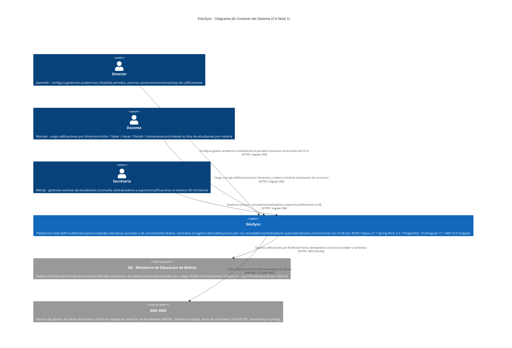
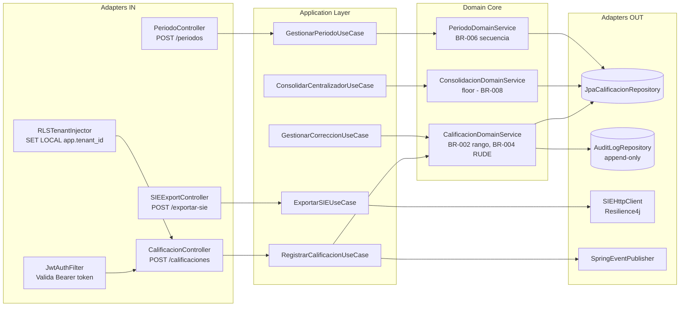
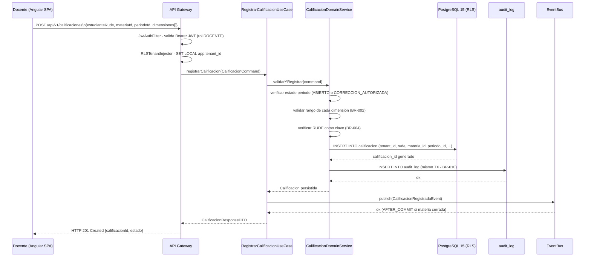
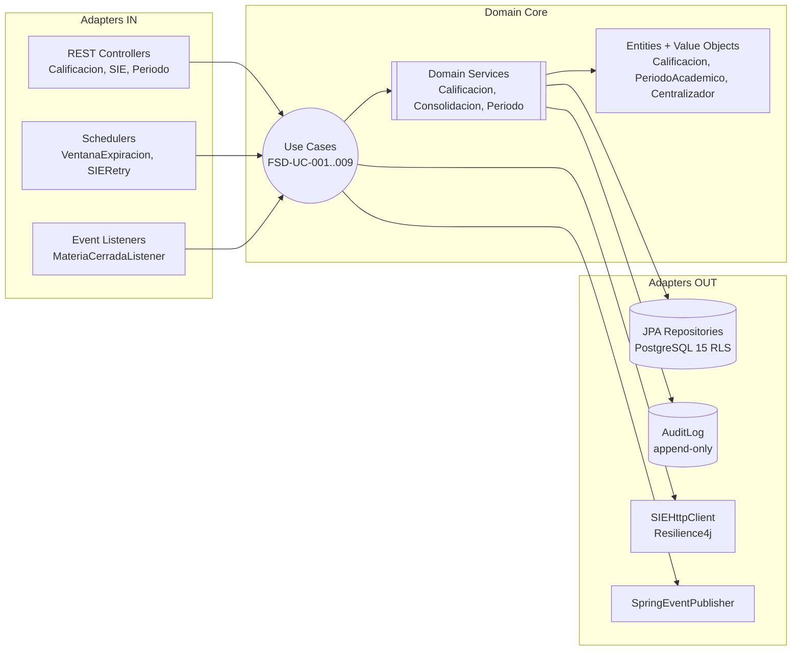
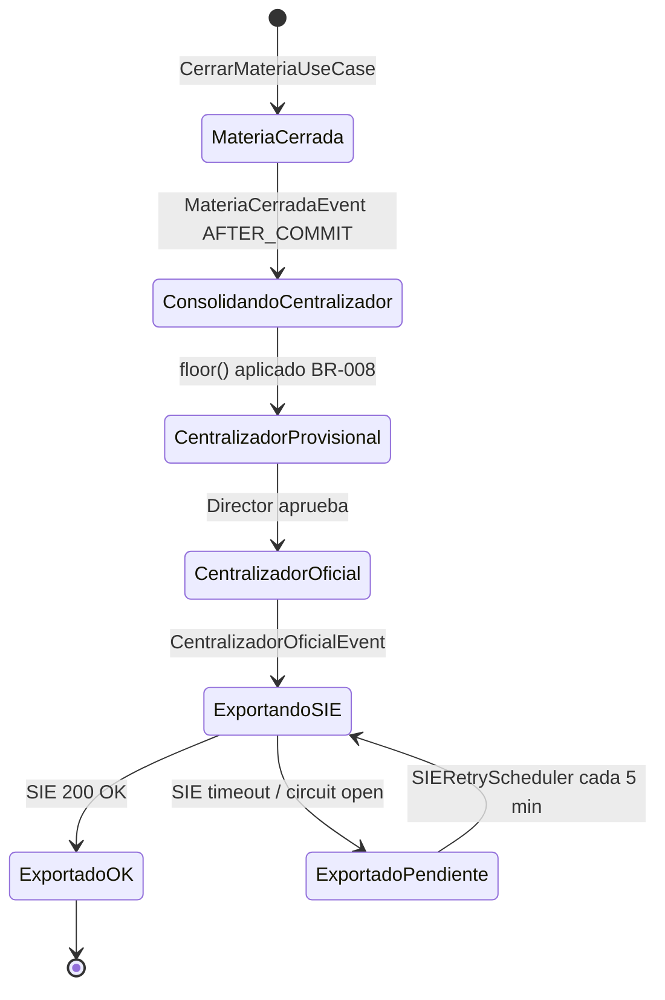
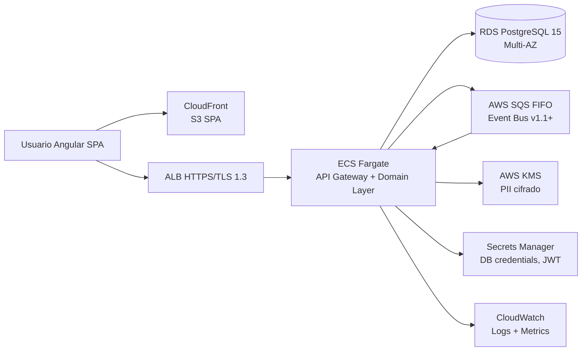
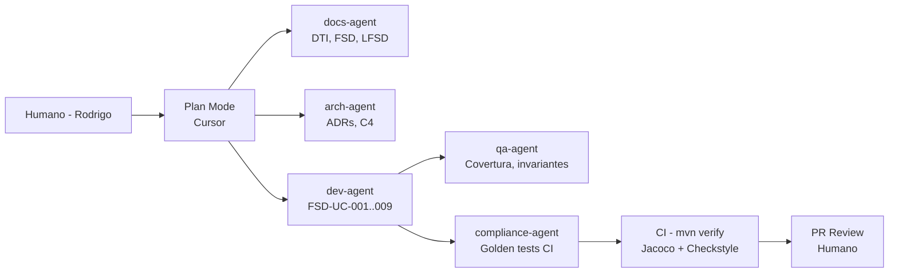

# Documento Técnico Inicial (DTI) — EduSync

> **Propósito**: contrato técnico inicial del producto EduSync. Legible por ingenieros humanos y agentes IA.
> Si una decisión arquitectónica significativa no está aquí, no existe.
>
> **Cadena documental**: BRD v2 → MRD → PRD → FSD → LFSD → **DTI** → ADRs → Código

---

## 0. Metadatos `[máquina]`

| Campo | Valor |
|-------|-------|
| Producto | EduSync |
| Grupo | G-EduSync |
| Versión | v0.1 |
| Fecha | 17/05/2026 |
| Arquitecto responsable | Rodrigo Aspeti |
| Stakeholders | Directores, Docentes, Secretarias de unidades educativas bolivianas |
| Estado | Borrador |
| Repositorio | `e:/Maestria/Modulo4/docs/edusync_m4` |
| Enlace al BRD v2 | `docs/brd/BRD_EduSync_v2.md` |
| Enlace al MRD | `docs/mrd/MRD_EduSync.md` |
| Enlace al PRD | `docs/prd/PRD_EduSync.md` |
| Enlace al FSD | `docs/fsd/FSD_EduSync.md` |
| Enlace al LFSD | `docs/LFSD-EduSync.md` |
| Enlace a `AGENTS.md` | `docs/AGENTS.md` |
| Enlace a `PROMPT_MAPPING.md` | `docs/PROMPT_MAPPING.md` |

---

### 0.1 Rol de agentes IA en el SDLC `[máquina]`

> Los agentes de EduSync participan **exclusivamente en la cadena de construcción**. EduSync v1.0 **no tiene agentes IA en runtime** (ver §3.5).

| Agente | Fase SDLC | Output | Supervisor humano | Skill propio | Qué se actualiza si falla |
|--------|-----------|--------|-------------------|--------------|--------------------------|
| `docs-agent` | Análisis / Diseño / Docs | BRD, MRD, PRD, FSD, LFSD, DTI, AGENTS.md, PROMPT_MAPPING | Arquitecto del grupo | `.cursor/skills/dti-edusync/SKILL.md` | DTI + AGENTS.md (commit atómico) |
| `arch-agent` | Diseño | ADRs, diagramas C4 (Level 1–3), arquitectura funcional | Arquitecto del grupo | `.cursor/skills/c4-edusync/SKILL.md` | ADR + DTI §3 |
| `dev-agent` | Implementación | Código hexagonal (domain, application, infrastructure) + tests | Líder técnico | AGENTS.md §10 (prompt-contrato) | FSD-UC afectado + tests + AGENTS.md §Skills |
| `qa-agent` | Validación | Reporte de invariantes, cobertura, audit_log trazabilidad | QA del grupo | AGENTS.md §8.1 | Tests fallidos + DTI §23 |
| `process-agent` | Modelado | Diagramas de estado Mermaid (Docente, Director) | Arquitecto del grupo | AGENTS.md §8.1 | `docs/diagrams/` + FSD afectado |
| `compliance-agent` | Revisión / CI | Golden tests (FloorTest, SIEPayloadTest, VentanaTest, MultitenantTest) | Docente / Líder técnico | AGENTS.md §8.3 | Bloquea merge en CI; DTI §23 |

---

## 1. Visión del Producto `[humano]`

- **Problema**: Las unidades educativas bolivianas (privadas y de convenio) gestionan calificaciones mediante triple digitación manual: el docente registra en papel, la secretaria transcribe al sistema SIE ministerial y el director verifica en planillas Excel. Este proceso genera errores de transcripción, pérdida de trazabilidad y demora en la consolidación de notas centralizadas.

- **Usuarios objetivo**:
  - **Directores**: Jeanneth y similares — necesitan configurar gestiones académicas, habilitar periodos y autorizar correcciones retroactivas con control temporal.
  - **Docentes**: Marcela y similares — necesitan registrar calificaciones por dimensión (Ser / Saber / Hacer / Decidir / Autoevaluación) desde su lista de estudiantes por materia.
  - **Secretarias**: Wendy y similares — necesitan gestionar nóminas, consultar centralizadores y exportar al SIE ministerial sin retrabajo.

- **Propuesta de valor**: SaaS B2B multitenant que descentraliza el registro de calificaciones por rol, consolida centralizadores automáticamente aplicando `floor()` según norma ministerial y sincroniza con el SIE a través del código RUDE, eliminando la triple digitación.

- **Métricas de éxito**:
  - **North Star**: tiempo de cierre de periodo < 10 minutos (vs. 3+ horas actual).
  - **Secundaria 1**: tasa de errores de transcripción hacia SIE < 0.5 % (vs. 3–5 % actual).
  - **Secundaria 2**: > 80 % de docentes completan carga de notas antes del deadline del periodo.
  - **Secundaria 3**: adopción: ≥ 3 unidades educativas en Bolivia en el primer año de operación.

- **Restricciones de negocio clave**:
  - Cumplimiento obligatorio con SIE / Ley 070 Avelino Sinani — protocolo de exportación no negociable.
  - Ley 164 Bolivia — protección de datos de menores de edad; PII cifrado en reposo (KMS).
  - Modelo SaaS multitenant: aislamiento estricto entre unidades educativas desde el día cero.

---

## 2. Contexto del Sistema `[humano+máquina]`

### 2.1 Diagrama C4 – Nivel 1 (Contexto)



> Fuente: `docs/diagrams/c4_level1.mmd` (generado con skill `c4-edusync`).

### 2.2 Actores externos y dependencias

| Actor / Sistema | Tipo | Dirección | Criticidad |
|-----------------|------|-----------|------------|
| Director | humano | entrada | alta — habilita periodos; sin él no hay escritura |
| Docente | humano | entrada | alta — produce el dato primario |
| Secretaria | humano | entrada / salida | alta — exporta al SIE |
| SIE Ministerio de Educacion | sistema | salida | crítica — cumplimiento Ley 070; fallo bloquea cierre oficial |
| AWS KMS | sistema | salida | alta — cifrado PII en reposo |

---

## 3. Arquitectura de Alto Nivel `[humano+máquina]`

### 3.1 Estilo arquitectónico adoptado

- [x] Hexagonal / Clean — `domain/` sin dependencias de Spring ni JPA [DA-02]
- [x] Event-driven — consolidación asíncrona post-cierre de materia [DA-04]
- [ ] Microservicios — N/A en v1.0; monolito modular sobre ECS Fargate

**Justificación**: El dominio de EduSync es rico en reglas de negocio (BR-001..BR-012) que requieren pruebas unitarias sin infraestructura. La arquitectura hexagonal aísla el núcleo de dominio de Spring y PostgreSQL, permitiendo que `ConsolidacionDomainService` sea testeable con `FloorTest` en CI sin levantar contenedores. El event-driven desacopla el cierre de materia de la consolidación del centralizador, que puede tardar segundos en unidades con muchos grupos [DA-04]. El monolito modular en ECS Fargate es apropiado para el volumen actual (< 50 unidades educativas año 1) y se puede escalar a microservicios en v2.0 si la carga lo justifica [ADR-0001 pendiente de formalización].

### 3.2 Diagrama C4 – Nivel 2 (Contenedores)

```mermaid
C4Container
  title EduSync - Diagrama de Contenedores (C4 Nivel 2)

  Person(director, "Director", "Jeanneth - configura gestiones,\nhabilita periodos, autoriza correcciones")
  Person(docente, "Docente", "Marcela - carga calificaciones\npor dimension y materia")
  Person(secretaria, "Secretaria", "Wendy - gestiona nominas\ny exporta al SIE")

  System_Boundary(edusync, "EduSync - Plataforma SaaS B2B Multitenant") {

    Container(spa, "Angular SPA", "Angular 17, TypeScript",
      "Interfaz web reactiva por rol.\nFormularios reactivos con validacion\nen tiempo real. Un tenant por sesion.")

    Container(api, "API Gateway", "Spring Boot 3.3, Java 21\nAWS ECS Fargate / puerto 443",
      "Unico punto de entrada REST.\nJWT + RBAC por rol. RLS injection\npor tenant. Rate limiting.\n[FSD-UC-001, 003, 004, 005, 009]")

    Container(domain, "Domain Layer", "Java 21, arquitectura hexagonal\nsin dependencias de Spring/JPA",
      "Logica de negocio pura:\ncalificaciones, consolidacion,\ncorrecciones retroactivas, periodos.\n[DA-02, BR-001..BR-012]")

    ContainerDb(db, "PostgreSQL 15", "AWS RDS Multi-AZ\nJDBC/TLS, Row-Level Security",
      "Persistencia principal.\nAislamiento multitenant por RLS.\nTablas: calificacion, centralizador,\naudit_log (append-only). [DA-01, DA-03]")

    Container(queue, "Event Bus", "Spring Events (sincrono)\n-> AWS SQS (asincrono v1.1+)",
      "Desacopla cierre de materia de\nconsolidacion de centralizadores.\nIdempotencia por periodo_id + materia_id. [DA-04]")

    Container(sieadapter, "SIE Adapter", "Java 21, Resilience4j\nHTTPS/REST",
      "Adaptador de integracion SIE.\nCircuit breaker + timeout 30 s\n+ backoff exponencial.\nIdempotencia por rude+periodo_id.\n[DA-05, FSD-UC-004]")

    Container(scheduler, "Scheduler", "Spring @Scheduled\nIn-process",
      "VentanaExpiracionScheduler: revoca\nautorizaciones expiradas (BR-009).\nSIERetryScheduler: reintenta\nexportaciones fallidas c/5 min.")
  }

  System_Ext(sie, "SIE - Ministerio de Educacion Bolivia",
    "Receptor de exportaciones academicas.\nIdentifica estudiantes por RUDE.\nCumplimiento Ley 070 Avelino Sinani.")

  System_Ext(kms, "AWS KMS",
    "Cifrado en reposo de PII:\nRUDE, nombre completo, fecha nacimiento.\n[NFR-007, alias/edusync-pii-key]")

  Rel(director, spa, "Configura periodos,\nautoriza correcciones", "HTTPS")
  Rel(docente, spa, "Carga calificaciones\npor dimension", "HTTPS")
  Rel(secretaria, spa, "Exporta al SIE,\ngestiona nominas", "HTTPS")
  Rel(spa, api, "Llamadas REST autenticadas\ncon Bearer JWT", "HTTPS/REST")
  Rel(api, domain, "Invoca casos de uso\na traves de puertos", "In-process")
  Rel(domain, db, "Lee y escribe con RLS activo.\naudit_log en misma transaccion", "JDBC/TLS [DA-01, DA-03]")
  Rel(domain, queue, "Publica CalificacionRegistradaEvent\ny MateriaCerradaEvent post-cierre", "Spring Event")
  Rel(queue, domain, "Dispara ConsolidarCentralizadorUseCase\nde forma asincrona (AFTER_COMMIT)", "Spring Event @Async [DA-04]")
  Rel(domain, sieadapter, "Delega exportacion de calificaciones\npor RUDE via puerto de salida", "In-process / Port")
  Rel(sieadapter, sie, "POST /registro/{rude}\ncon circuit breaker y reintentos", "HTTPS/REST [DA-05]")
  Rel(scheduler, domain, "Revoca ventanas de correccion expiradas\ny reintenta exportaciones PENDIENTE", "In-process")
  Rel(db, kms, "Cifra y descifra columnas PII\nen reposo", "AWS KMS SDK/TLS [NFR-007]")

  UpdateLayoutConfig($c4ShapeInRow="3", $c4BoundaryInRow="1")
```

> Fuente: `docs/diagrams/c4_level2.mmd` (generado con skill `c4-edusync`).

### 3.3 Diagrama C4 – Nivel 3 (Componentes) del contenedor crítico: `API Gateway`



> **Trazabilidad C4 Level 3**:
>
> | Componente | FSD-UC | DA/BR aplicado |
> |------------|--------|----------------|
> | `CalificacionDomainService` | FSD-UC-001, UC-005 | BR-002 (rango), BR-004 (RUDE), DA-02 |
> | `ConsolidacionDomainService` | FSD-UC-003 | BR-008 (`floor()`), DA-02 |
> | `SIEHttpClient` | FSD-UC-004 | DA-05, NFR-011 |
> | `AuditLogRepository` | Todos | DA-03, BR-010 |
> | `RLSTenantInjector` | Todos | DA-01, NFR-010 |

### 3.4 Data Flow Diagram — FSD-UC-001 Registro de Calificación (caso más crítico)



### 3.5 Contenedores agénticos del producto `[humano+máquina]`

**N/A** — EduSync v1.0 no expone agentes IA en runtime ni consume agentes externos desde el sistema. La IA participa exclusivamente en la cadena de construcción (SDLC), gestionada por los 6 agentes declarados en §0.1 y `AGENTS.md §8.1`. Los contenedores de la arquitectura de producto son: Angular SPA, API Gateway, Domain Layer, PostgreSQL 15, Event Bus, SIE Adapter y Scheduler (todos sin componentes IA en runtime).

> Revisar en v2.0 si se incorpora asistente IA para sugerencias de calificaciones o análisis de rendimiento académico.

---

## 4. Modelo de Dominio `[humano+máquina]`

### 4.1 Bounded Contexts

| Contexto | Responsabilidad | Entidades principales | Tipo de integración |
|----------|-----------------|-----------------------|---------------------|
| `calificaciones` | Registrar, validar y corregir calificaciones por dimensión | `Calificacion`, `Dimension`, `CalificacionCorreccion` | síncrona (HTTP) |
| `periodos` | Gestionar el ciclo de vida del periodo académico y materias | `PeriodoAcademico`, `Materia`, `AutorizacionCorreccion` | síncrona (HTTP) |
| `consolidacion` | Calcular promedios con `floor()` y emitir centralizadores | `Centralizador`, `PromedioAnual` | async (Spring Event post-commit) |
| `exportacion` | Sincronizar con SIE por RUDE con idempotencia | `ExportacionSIE`, `SIEPayload` | async resiliente (Resilience4j) |
| `auditoria` | Registro inmutable de todas las escrituras del sistema | `AuditLog` | síncrona (misma TX) |

### 4.2 Entidades, Value Objects y Aggregates

| Tipo | Nombre | Invariantes | Ciclo de vida |
|------|--------|-------------|---------------|
| Aggregate Root | `Calificacion` | Vinculada a RUDE; rango válido por `parametro_academico`; append-only en correcciones | Creada → Corregida (nueva fila) → Consolidada |
| Aggregate Root | `PeriodoAcademico` | Secuencia PENDIENTE → CONFIGURADO → ABIERTO → CERRADO; sin retroceso (BR-006) | PENDIENTE → ... → CERRADO |
| Aggregate Root | `Centralizador` | `PROVISIONAL` sobreescribible; `OFICIAL` inmutable (`@Immutable`) | PROVISIONAL → OFICIAL |
| Entity | `Materia` | Pertenece a un periodo; tiene nómina de estudiantes por RUDE | Activa / Cerrada |
| Entity | `AutorizacionCorreccion` | `ventana_fin` obligatorio (1–72 h); no existe autorización indefinida (BR-009) | Activa → Revocada (auto) |
| Entity | `AuditLog` | Inmutable; sin UPDATE/DELETE; protegida por RULE PostgreSQL + `@Immutable` | Solo INSERT |
| Entity | `Estudiante` | Identificado únicamente por RUDE (Registro Único de Estudiante) | Solo lectura para Docente |
| Value Object | `Dimension` | Valor numérico en rango paramétrico `[min, max]`; tipo: Ser/Saber/Hacer/Decidir/Autoevaluación | Inmutable |
| Value Object | `TenantId` | UUID; inyectado en toda TX via `SET LOCAL app.tenant_id` (DA-01) | Inmutable por sesión |

### 4.3 DTOs principales

| DTO | Uso (capa) | Campos clave | Mapea a |
|-----|------------|--------------|---------|
| `CalificacionRequestDTO` | API → Application | `estudianteRude`, `materiaId`, `periodoId`, `dimensiones[]` | `Calificacion` |
| `CalificacionResponseDTO` | Application → API | `calificacionId`, `estado`, `timestamp` | `Calificacion` |
| `CentralizadorDTO` | Application → API | `periodoId`, `materiaId`, `promedioFinal`, `estado` | `Centralizador` |
| `SIEExportRequestDTO` | API → SIE Adapter | `rude`, `periodoId`, `promedioFinal`, `materiaId` | `ExportacionSIE` |
| `AutorizacionCorreccionDTO` | API → Application | `materiaId`, `periodoId`, `ventanaHoras`, `motivo` | `AutorizacionCorreccion` |
| `PeriodoRequestDTO` | API → Application | `gestionAcademica`, `trimestre`, `fechaInicio`, `fechaFin` | `PeriodoAcademico` |

---

## 5. Arquitectura Hexagonal del Core `[humano+máquina]`

### 5.1 Puertos (Ports)

| Puerto | Tipo | Definido en | Propósito |
|--------|------|-------------|-----------|
| `RegistrarCalificacionUseCase` | input | `domain/port/in` | FSD-UC-001 |
| `CerrarMateriaUseCase` | input | `domain/port/in` | FSD-UC-002 |
| `ConsolidarCentralizadorUseCase` | input | `domain/port/in` | FSD-UC-003 |
| `ExportarSIEUseCase` | input | `domain/port/in` | FSD-UC-004 |
| `GestionarCorreccionUseCase` | input | `domain/port/in` | FSD-UC-005 |
| `GestionarPeriodoUseCase` | input | `domain/port/in` | FSD-UC-009 |
| `CalificacionRepository` | output | `domain/port/out` | Persistencia de calificaciones |
| `CentralizadorRepository` | output | `domain/port/out` | Persistencia de centralizadores |
| `AuditLogRepository` | output | `domain/port/out` | Escritura append-only audit_log |
| `SIEExportPort` | output | `domain/port/out` | Integración con SIE ministerial |
| `DomainEventPublisher` | output | `domain/port/out` | Publicación de eventos de dominio |

### 5.2 Adaptadores (Adapters)

| Adaptador | Implementa | Tecnología | Ubicación |
|-----------|-----------|------------|-----------|
| `CalificacionController` | `RegistrarCalificacionUseCase` | Spring MVC | `adapter/in/web` |
| `SIEExportController` | `ExportarSIEUseCase` | Spring MVC | `adapter/in/web` |
| `JpaCalificacionRepository` | `CalificacionRepository` | Spring Data JPA | `adapter/out/persistence` |
| `JpaCentralizadorRepository` | `CentralizadorRepository` | Spring Data JPA | `adapter/out/persistence` |
| `JpaAuditLogRepository` | `AuditLogRepository` | Spring Data JPA (`@Immutable`) | `adapter/out/persistence` |
| `SIEHttpClient` | `SIEExportPort` | Resilience4j + RestClient | `adapter/out/integration/sie` |
| `SpringEventPublisherAdapter` | `DomainEventPublisher` | Spring ApplicationEventPublisher | `adapter/out/messaging` |

### 5.3 Diagrama de puertos y adaptadores



---

## 6. Arquitectura Distribuida `[humano+máquina]`

EduSync v1.0 es un **monolito modular** desplegado en ECS Fargate. No aplica arquitectura de microservicios en esta versión.

### 6.1 Patrones de resiliencia aplicados

| Patrón | Dónde | Configuración |
|--------|-------|---------------|
| Circuit breaker | `SIEHttpClient` → SIE Ministerio | `failureRateThreshold = 50%`, `waitDuration = 30s` [DA-05] |
| Timeout | `SIEHttpClient` → SIE Ministerio | `timeout = 30s` configurable en `application.yml` |
| Retry con backoff exponencial | `SIEHttpClient` → SIE Ministerio | 3 intentos, `waitDuration = 2s`, multiplier 2 [DA-05] |
| Scheduler de reintentos | `SIERetryScheduler` | Cada 5 min, exportaciones en estado `PENDIENTE` |
| Idempotencia | `SIEHttpClient` | Clave: `rude + periodo_id`; deduplicación en la API del SIE |
| RLS PostgreSQL | Toda TX via `RLSTenantInjector` | `SET LOCAL app.tenant_id` antes de cada transacción JPA [DA-01] |
| Rate limiting | `API Gateway` | 100 req/s por usuario (configurable en Load Balancer AWS) |

---

### 6.2 Seams de descomposición `[humano]`

> **Contexto**: EduSync v1.0 es un monolito modular. Este análisis identifica los 2 seams
> de descomposición con mayor potencial para una futura migración a servicios independientes,
> usando los bounded contexts del §4.1 y el árbol de decisión T1.8.
> **Entrega académica**: Tarea 1 — Módulo 4 UMSS / M.Sc. Edson Terceros.

---

#### Seam 1: `calificaciones` ↔ `consolidacion`

**Evidencia de desacoplamiento**

| Dimensión | Calificaciones | Consolidación |
|-----------|---------------|---------------|
| FSD-UC principales | FSD-UC-001 (registrar), FSD-UC-005 (corregir) | FSD-UC-003 (consolidar centralizador) |
| BR dominantes | BR-002 (rango), BR-004 (RUDE), BR-005 (append-only) | BR-008 (`floor()`), BR-011 (3 trimestres) |
| Actor principal | Docente — carga continua durante el periodo | Sistema — batch post-cierre de materia |
| Patrón de tráfico | Continuo, frecuente, latencia < 500 ms (NFR-001) | Diferido, batch, puede tolerar segundos |
| Desacoplamiento existente | — | `MateriaCerradaEvent` AFTER_COMMIT (DA-04); preparado para AWS SQS v1.1 |

**Árbol de decisión T1.8**

| Criterio | Resultado | Justificación |
|----------|-----------|---------------|
| 1. ¿Equipos distintos necesitan desplegarlo independientemente? | SÍ | Docentes generan carga constante; la consolidación solo corre al cierre — cadencias de release distintas |
| 2. ¿Volúmenes de tráfico tan distintos que requieren escala independiente? | SÍ | Registro de notas: picos en deadline (todos los docentes a la vez); consolidación: 1 ejecución por materia cerrada |
| 3. ¿Puede fallar sin afectar disponibilidad del núcleo? | SÍ | Si la consolidación falla, el Docente sigue registrando; el Centralizador queda en PROVISIONAL hasta reintentar |
| 4. ¿El costo de separación se justifica HOY (año 1, < 50 unidades)? | NO | Con volumen < 50 unidades el overhead de consistencia eventual y TX distribuidas supera el beneficio |

**Recomendación: Romper en v2.0**
> 3 de 4 criterios T1.8 son SÍ. El desacoplamiento técnico ya existe (DA-04 / Spring Events).
> La separación formal se justifica cuando el volumen supere 50 unidades educativas o cuando
> el equipo de consolidación necesite ciclos de release independientes del equipo de calificaciones.
> Candidato a primer servicio extraído con patrón Strangler Fig desde el Event Bus.

---

#### Seam 2: `exportacion` ↔ núcleo (`calificaciones` + `consolidacion` + `periodos`)

**Evidencia de desacoplamiento**

| Dimensión | Exportación SIE | Núcleo (calificaciones + consolidación + periodos) |
|-----------|----------------|---------------------------------------------------|
| FSD-UC principal | FSD-UC-004 (exportar al SIE) | FSD-UC-001, 003, 005, 009 |
| BR/DA dominantes | DA-05 (circuit breaker), NFR-005 (idempotencia SIE) | BR-001..BR-009, DA-01..DA-04 |
| Actor principal | Secretaria — puntual, fin de trimestre | Docente + Director — continuo durante el periodo |
| Patrón de tráfico | Masivo y puntual (exportación trimestral); puede diferirse | Constante durante el periodo académico |
| Dominio regulatorio | Ley 070 Avelino Sinani — contrato externo no negociable | Reglas internas del negocio |
| Aislamiento existente | `SIEHttpClient` en adaptador propio con Resilience4j (DA-05); fallo del SIE no bloquea escritura de notas | — |

**Árbol de decisión T1.8**

| Criterio | Resultado | Justificación |
|----------|-----------|---------------|
| 1. ¿Equipos distintos necesitan desplegarlo independientemente? | SÍ | El protocolo SIE cambia por regulación ministerial independientemente del negocio interno; updates del adaptador SIE no deben afectar el registro de notas |
| 2. ¿Volúmenes de tráfico tan distintos que requieren escala independiente? | SÍ | Exportación: pico masivo puntual al fin de trimestre; núcleo: carga distribuida continua — perfiles de escala opuestos |
| 3. ¿Puede fallar sin afectar disponibilidad del núcleo? | SÍ | Circuit breaker activo (DA-05): SIE caído → exportaciones en PENDIENTE; Docentes siguen registrando notas sin interrupción |
| 4. ¿El costo de separación se justifica HOY (año 1, < 50 unidades)? | NO | El volumen actual no genera suficiente presión operacional; el adaptador ya está suficientemente aislado como módulo interno |

**Recomendación: Romper en v2.0 — primer candidato a microservicio**
> 3 de 4 criterios T1.8 son SÍ. Es el seam más maduro: el `SIEHttpClient` ya es un adaptador
> de salida independiente (DA-05), el dominio regulatorio es externo y cambia por ley, y el
> aislamiento de fallos ya está validado en producción. Cuando el volumen supere 30 unidades
> simultáneas exportando al cierre trimestral, separarlo elimina el riesgo de que un pico de
> exportación degrade la latencia de registro de notas (NFR-001 < 500 ms p95).
> Patrón de migración recomendado: Strangler Fig extrayendo `ExportarSIEUseCase` +
> `SIEHttpClient` + `SIERetryScheduler` como servicio `edusync-sie-exporter`.

---


## 7. Arquitectura Asíncrona / Event-Driven `[humano+máquina]`

### 7.1 Catálogo de eventos de dominio

| Evento | Productor | Consumidor(es) | Payload | Garantía |
|--------|-----------|----------------|---------|----------|
| `CalificacionRegistradaEvent` | `RegistrarCalificacionUseCase` | `ConsolidarCentralizadorUseCase` (si materia cerrada) | `{calificacionId, materiaId, periodoId, tenantId}` | at-least-once (Spring Event) |
| `MateriaCerradaEvent` | `CerrarMateriaUseCase` | `ConsolidarCentralizadorUseCase` | `{materiaId, periodoId, tenantId}` | at-least-once, idempotente por `periodoId+materiaId` [DA-04] |
| `CentralizadorOficialEvent` | `ConsolidarCentralizadorUseCase` | `ExportarSIEUseCase` (si configurado) | `{centralizadorId, periodoId, tenantId}` | at-least-once |
| `VentanaExpiradaEvent` | `VentanaExpiracionScheduler` | `GestionarCorreccionUseCase` | `{autorizacionId, materiaId, tenantId}` | exactly-once (scheduler) |

### 7.2 Flujo de consolidación post-cierre (saga simplificada)



---

## 8. Despliegue – Cloud Native (AWS) `[humano+máquina]`

### 8.1 Mapeo de componentes a servicios AWS

| Componente | Servicio AWS | Justificación |
|------------|--------------|---------------|
| API Gateway + Domain Layer | ECS Fargate (tarea única por tenant pool) | Sin gestión de servidores; escalado automático en picos de cierre trimestral |
| Angular SPA | S3 + CloudFront | CDN global; low latency para Bolivia |
| Base de datos principal | RDS PostgreSQL 15 Multi-AZ | ACID; RLS nativo; Multi-AZ para DR |
| Mensajería async (v1.1+) | AWS SQS (FIFO) | Consolidación desacoplada; reintentos nativos; orden garantizado por `periodoId` |
| Cifrado PII | AWS KMS (`alias/edusync-pii-key`) | RUDE, nombre, fecha nacimiento cifrados en reposo |
| Secretos | AWS Secrets Manager | DB credentials, JWT secret; sin secretos en código |
| Balanceo | ALB (Application Load Balancer) | HTTPS/TLS 1.3; routing por tenant subdomain |
| Logs y métricas | CloudWatch Logs + CloudWatch Metrics | Structured JSON logs; alertas en p95 latencia |
| IaC | Terraform 1.8 | Infraestructura reproducible; `infra/` pendiente de creación |

### 8.2 Diagrama de despliegue



### 8.3 Entornos

| Entorno | Región | Propósito |
|---------|--------|-----------|
| dev | us-east-1 | Desarrollo local + integración |
| stg | us-east-1 | QA — Testcontainers + pruebas de integración |
| prd | us-east-1 (Multi-AZ) | Producción — datos reales de unidades educativas |

### 8.4 Estrategia de Disaster Recovery

- **RPO objetivo**: 1 hora (frecuencia de snapshots RDS automáticos).
- **RTO objetivo**: 4 horas (recuperación desde snapshot en us-east-1 Multi-AZ standby).
- **Estrategia**: Warm Standby — RDS Multi-AZ mantiene réplica síncrona; failover automático en < 60 s.

---

## 9. Capa de IA / Agentes `[humano+máquina]`

> EduSync v1.0 **no tiene agentes IA en runtime**. La capa IA opera exclusivamente en la cadena de construcción (AI-SDLC).

### 9.1 Arquitectura agéntica (SDLC)

- **Tipo**: multi-agente supervisor-worker durante construcción.
- **Modelos usados**: Claude Sonnet (docs-agent, dev-agent, qa-agent, process-agent, compliance-agent) y Claude Opus (arch-agent para decisiones críticas).
- **Rol en SDLC**: los 6 agentes declarados en §0.1 actúan como co-pilotos del desarrollador humano en las fases de diseño, implementación y validación.

### 9.2 Agentes del sistema (SDLC, no runtime)

| Agente | Rol | Herramientas | Guardrails | Observabilidad |
|--------|-----|-------------|------------|----------------|
| `docs-agent` | Mantiene cadena documental BRD→DTI | `read`, `edit` | Solo opera en `docs/` | `PROMPT_MAPPING.md` v0.6 |
| `arch-agent` | Diseña ADRs y diagramas C4 | `read`, `edit` | Requiere aprobación humana para todo ADR | `docs/adr/` |
| `dev-agent` | Implementa FSD-UC-001..009 | `read`, `edit`, `run-tests` | MUST NOT tocar `infra/`; MUST usar `floor()` en dominio | `mvn test` + golden tests CI |
| `qa-agent` | Verifica invariantes y cobertura | `read`, `query-db` (SELECT) | Solo lectura | Cobertura Jacoco > 80% |
| `process-agent` | Modela diagramas de estado | `read`, `edit` | Opera solo en `docs/diagrams/` | Revisión humana del Mermaid |
| `compliance-agent` | Valida golden tests en CI | `read`, ejecutar tests | Bloquea merge si falla | CI bloqueante en `release/*` |

### 9.3 RAG y memoria — N/A para v1.0

EduSync v1.0 no implementa RAG ni memoria persistente de agentes. El contexto se provee en cada prompt via `AGENTS.md`, `FSD`, `LFSD` y `PROMPT_MAPPING.md`.

### 9.4 Diagrama de la cadena AI-SDLC



---

## 10. Estrategia de Prompt Mapping `[máquina]`

> Documento completo: `docs/PROMPT_MAPPING.md` v0.6 (20 prompt-contratos).

| Área | Prompts | IDs |
|------|---------|-----|
| Arquitectura funcional | Diseño de UCs y DAs | `PR-ARCH-001`, `PR-ARCH-002` |
| BRD | Business Requirements | `PR-BRD-001` |
| MRD | Market Requirements | `PR-MRD-001` |
| PRD | Product Requirements | `PR-PRD-001` |
| FSD | Functional Specification | `PR-FSD-001`, `PR-FSD-002`, `PR-FSD-003` |
| LFSD | Low-Level Specification | `PR-LFSD-001` |
| Diagramas | Mermaid stateDiagram, C4 | `PR-DIAG-001`, `PR-DIAG-002`, `PR-C4-001`, `PR-C4-002` |
| Skills | Cursor/Claude skills | `PR-SKILL-001`, `PR-SKILL-002`, `PR-SKILL-003` |
| APORTES | Informe contribuciones | `PR-APORTES-001` |

---

## 11. NFRs Consolidados `[máquina]`

| ID | Categoría | Umbral | Mecanismo de verificación |
|----|-----------|--------|--------------------------|
| NFR-001 | Rendimiento | p95 de registro de calificacion < 500 ms | k6 en pipeline CI stg |
| NFR-002 | Disponibilidad | Uptime >= 99.9% mensual | CloudWatch Alarms |
| NFR-003 | Seguridad | OWASP ASVS L2 — sin secretos en código, sin PII en logs | `.cursor/rules/seguridad.mdc` + SAST |
| NFR-004 | Privacidad RUDE | RUDE como unica clave de identidad estudiantil en todas las ops de escritura | `SIEPayloadTest.payload_uses_rude_only` (CI) |
| NFR-005 | Exactitud calculo | `floor()` como unico truncado — nunca `round()`, `HALF_UP`, `CEILING` | `FloorTest.floor_64_666_equals_64` (CI) |
| NFR-006 | Inmutabilidad | audit_log: 0 UPDATE/DELETE sobre ninguna fila | `RULE` PostgreSQL + `@Immutable` Hibernate + test |
| NFR-007 | Cifrado PII | RUDE, nombre, fecha nacimiento cifrados con AWS KMS en reposo | Auditoria KMS CloudTrail |
| NFR-008 | Auth | JWT con expiracion maxima 8 horas | Prueba de integracion `JwtExpirationTest` |
| NFR-009 | Transporte | HTTPS/TLS 1.3 en transito | Configuracion ALB + prueba SSL Labs |
| NFR-010 | Multitenancy | 0 registros de otro tenant en cualquier endpoint | `MultitenantTest.no_cross_tenant_data` (CI) |
| NFR-011 | Idempotencia SIE | Exportacion SIE idempotente por `rude + periodo_id` | Test de integracion `SIEIdempotencyTest` |
| NFR-012 | Resiliencia SIE | Circuit breaker abre en <= 3 intentos fallidos | `CircuitBreakerTest` con WireMock |
| NFR-013 | Cobertura | >= 80% de lineas en `domain/` y `application/` | Jacoco `mvn jacoco:report` en CI |
| NFR-014 | Migraciones | Migraciones Flyway reproducibles — no modificar versiones aplicadas | Testcontainers con migracion limpia en CI |
| NFR-015 | Tamano PR | PRs <= 400 lineas netas | Regla de CI (`gh pr diff --stat`) |
| NFR-016 | Commits | Conventional Commits — `feat:`, `fix:`, `docs:`, `refactor:`, `test:`, `chore:` | `commitlint` en pre-push hook |

---

## 12. POCs Críticas `[humano+máquina]`

### 12.1 POC-01: Multitenancy con PostgreSQL 15 Row-Level Security

- **Riesgo que mitiga**: Que el aislamiento por `tenant_id` via `SET LOCAL app.tenant_id` no sea suficiente y un tenant pueda ver datos de otro tenant bajo condiciones de alta concurrencia o con queries complejas con JOINs [DA-01].
- **Hipótesis**: Aplicar `SET LOCAL app.tenant_id = :id` antes de cada transacción JPA y configurar una política RLS en todas las tablas garantiza aislamiento total con overhead < 5 ms en p95.
- **Criterio de éxito medible**: `MultitenantTest.no_cross_tenant_data` pasa en 100% de 1000 requests concurrentes de 2 tenants distintos; p95 de INSERT/SELECT < 505 ms.
- **Alcance**: 2 tablas (`calificacion`, `centralizador`), 2 tenants, 1000 requests mixtos, PostgreSQL 15 real via Testcontainers.
- **Cronograma**: 3 días.
- **Resultado**: Pendiente de ejecución.

### 12.2 POC-02: Circuit Breaker SIE con Resilience4j

- **Riesgo que mitiga**: Que el SIE ministerial (sistema externo sin SLA garantizado) deje exportaciones en estado inconsistente cuando el servicio cae a mitad de un batch, bloqueando el cierre oficial del periodo [DA-05].
- **Hipótesis**: Resilience4j con `failureRateThreshold = 50%`, `timeout = 30s` y backoff exponencial, combinado con `SIERetryScheduler` cada 5 min, garantiza que ninguna exportación quede en estado inconsistente más de 10 minutos.
- **Criterio de éxito medible**: En 100 llamadas simuladas con 60% de timeout, el circuit breaker abre correctamente; el scheduler recupera el 100% de exportaciones `PENDIENTE` en < 15 min; `CircuitBreakerTest` pasa.
- **Alcance**: `SIEHttpClient` + `SIERetryScheduler`, WireMock para simular SIE, 100 requests.
- **Cronograma**: 2 días.
- **Resultado**: Pendiente de ejecución.

---

## 13. Seguridad `[humano+máquina]`

### Modelo de amenazas (STRIDE resumido)

| Amenaza | Vector | Mitigación | Estado |
|---------|--------|-----------|--------|
| Spoofing | JWT falsificado | Validacion firma JWT en `JwtAuthFilter`; clave desde Secrets Manager | Diseñado |
| Tampering | Modificacion de `audit_log` | `RULE` PostgreSQL + `@Immutable` Hibernate; 0 UPDATE/DELETE (DA-03) | Diseñado |
| Repudiation | Negacion de carga de notas | `audit_log` append-only con `actor_id`, `timestamp_utc` (BR-010) | Diseñado |
| Information Disclosure | PII en logs | `.cursor/rules/seguridad.mdc`; NFR-003; MUST NOT loguear RUDE/token | Diseñado |
| Denial of Service | Burst en exportacion SIE | Rate limiting ALB; circuit breaker Resilience4j (DA-05) | Diseñado |
| Elevation of Privilege | Docente accede datos de otro tenant | RLS PostgreSQL + RBAC JWT; `MultitenantTest` en CI (DA-01) | Diseñado |
| Prompt Injection (IA SDLC) | Payload adversario en prompt de agente | Guardrails en `AGENTS.md §11`; golden tests en CI | Diseñado |

### AuthN / AuthZ

- **AuthN**: JWT Bearer, expiración <= 8h, firma RS256, clave en Secrets Manager.
- **AuthZ**: RBAC — roles `DIRECTOR`, `SECRETARIA`, `DOCENTE`; controlado por `@PreAuthorize` de Spring Security 6.
- **Multitenant**: RLS PostgreSQL + `RLSTenantInjector` interceptor JPA (DA-01).

### Datos sensibles

- **PII de estudiantes** (`rude`, `nombre_completo`, `fecha_nacimiento`): cifrado en reposo con AWS KMS (`alias/edusync-pii-key`) [NFR-007].
- **Secretos** (DB password, JWT key): AWS Secrets Manager; inyectados como variables de entorno en ECS Task Definition.
- **Cumplimiento**: Ley 164 Bolivia (datos de menores), Ley 070 Avelino Sinani (exportacion SIE).

### Seguridad en la capa IA (SDLC)

- **Prompt injection**: `compliance-agent` valida que ningún payload adversario pase los guardrails (AGENTS.md §11).
- **PII leakage**: golden test `SIEPayloadTest` verifica que ningún payload contenga nombre o posición de lista.
- **Regla activa**: `.cursor/rules/seguridad.mdc` — OWASP ASVS L2 en Java/Spring.

---

## 14. Observabilidad `[humano+máquina]`

- **Logs estructurados**: JSON con campos `correlationId`, `tenantId`, `actorId`, `accion`, `timestamp_utc`. MUST NOT incluir `rude`, `password`, `token` ni calificaciones individuales (NFR-003).
- **Audit log de dominio**: `audit_log` tabla append-only en PostgreSQL — registra `tenant_id`, `actor_id`, `accion`, `entidad_afectada`, `entidad_id`, `valor_anterior`, `valor_nuevo`, `timestamp_utc` (DA-03, BR-010).
- **AuditLogAspect**: AOP interceptor que registra en `audit_log` en la misma TX que la escritura.
- **Métricas**: CloudWatch Metrics — p95 latencia, tasa de errores SIE, circuit breaker estado.
- **Trazas**: `correlationId` propagado en todos los contextos (Spring Security + MDC).
- **Dashboards**: CloudWatch Dashboard con: p95 registro calificacion, tasa exportacion SIE exitosa, estado circuit breaker, uptime.
- **Alertas mínimas**: p95 > 500 ms por 5 min → alerta; circuit breaker OPEN → alerta inmediata.

---

## 15. DevOps y Ciclo de Vida `[humano+máquina]`

### 15.1 Ciclo de vida clásico

- **Branching**: GitFlow — `main` (producción), `develop` (integración), `feature/<fsd-uc-id>`, `release/<version>`.
- **CI/CD**: `mvn verify` (tests + checkstyle + Jacoco) en cada PR; deploy a `stg` automático en merge a `develop`; deploy a `prd` manual en merge a `main`.
- **Testing**: pirámide — unitarios (`domain/`, `application/`), integración (Testcontainers PostgreSQL 15), e2e (pendiente).
- **Contract tests**: golden tests (`FloorTest`, `SIEPayloadTest`, `VentanaTest`, `MultitenantTest`) en CI bloqueante en `release/*`.
- **Releases**: versionado semántico `major.minor.patch`; `release/1.0.1` para el DTI + POCs.
- **Feature flags**: N/A en v1.0; planificado para `SQS async` en v1.1+.
- **Rollback**: redeploy de la imagen ECS anterior via `aws ecs update-service` + `aws rds restore-db-instance-to-point-in-time`.

### 15.2 Integraciones agénticas de desarrollo

| Integracion | Propósito | Entorno | Propietario |
|-------------|-----------|---------|-------------|
| Cursor Agent (6 agentes) | AI-SDLC: diseño, implementación, QA, compliance | dev | Rodrigo Aspeti |
| `.cursor/rules/seguridad.mdc` | OWASP ASVS L2 aplicado en todo edit de Java | dev | G-EduSync |
| `.cursor/skills/dti-edusync/` | Poblar y mantener este DTI | dev | G-EduSync |
| `.cursor/skills/c4-edusync/` | Generar diagramas C4 | dev | G-EduSync |
| `.cursor/skills/update-prompt-mapping/` | Mantener PROMPT_MAPPING.md | dev | G-EduSync |
| `AGENTS.md` sincronía | Convenciones comunes stack + guardrails | dev | G-EduSync |

> Todos los skills declarados aquí viven en `.cursor/skills/` del repo.

### 15.3 Estrategia de release de agentes IA — N/A

EduSync v1.0 no tiene agentes IA en runtime. Los agentes del AI-SDLC (§0.1) no requieren estrategia de canary ni shadow mode — son herramientas de desarrollo, no componentes de producción.

---

## 16. Antipatrones auditados `[humano]`

| Antipatron | ¿Detectado? | Mitigacion |
|------------|-------------|-----------|
| Big Ball of Mud | No | Paquetes por bounded context; hexagonal estricta; `domain/` sin deps externos |
| God Service | No | 6 puertos de entrada separados; 1 caso de uso por clase de aplicacion |
| `floor()` fuera de dominio | Riesgo activo | `FloorTest` en CI bloqueante; DA-02 aísla `ConsolidacionDomainService` |
| audit_log fuera de TX | Riesgo activo | `AuditLogAspect` AOP en misma `@Transactional`; test de integracion |
| tenant_id sin RLS | Riesgo alto | `MultitenantTest` en CI; `RLSTenantInjector` obligatorio (DA-01) |
| PII en logs | Riesgo alto | `.cursor/rules/seguridad.mdc`; golden test `SIEPayloadTest`; NFR-003 |
| Entidad JPA expuesta por API | No | DTOs obligatorios en `infrastructure/web/dto/`; AGENTS.md §5 |
| Migracion Flyway modificada | No | Política de solo agregar versiones nuevas; AGENTS.md §8.2 |
| Strings literales para estados | No | Enums `EstadoPeriodo`, `EstadoCentralizador` en dominio; AGENTS.md §5 |

---

## 17. Trade-offs arquitectónicos `[humano]`

| Decision | Opcion elegida | Alternativas descartadas | Razones | Consecuencias |
|----------|----------------|--------------------------|---------|---------------|
| Multitenancy [DA-01] | PostgreSQL RLS con `SET LOCAL app.tenant_id` | Schema-per-tenant; DB-per-tenant | Menor overhead operacional; PostgreSQL 15 soporta RLS nativo; viable para < 200 tenants | Riesgo: bug en `RLSTenantInjector` expone todos los datos → mitigado por `MultitenantTest` |
| Arquitectura [DA-02] | Hexagonal / Ports & Adapters | MVC en capas; microservicios | Dominio testeable sin infraestructura; `FloorTest` y `VentanaTest` validan sin DB | Mayor verbosidad (interfaces + adaptadores) para el equipo |
| Auditoria [DA-03] | `audit_log` append-only en misma TX | Async audit (Outbox); Hibernate Envers | Consistencia garantizada: imposible escritura sin audit | Performance: TX ligeramente mas lenta por INSERT adicional en `audit_log` |
| Async [DA-04] | Spring Events + `@Async` (AFTER_COMMIT) | Síncrono; Kafka | Consolidacion no bloquea al docente; sin infraestructura adicional en v1.0 | SQS en v1.1+ para durabilidad cross-restart |
| Resiliencia SIE [DA-05] | Resilience4j circuit breaker + `SIERetryScheduler` | Simple retry; Saga orchestrada | SIE es externo sin SLA; circuit breaker previene cascada; scheduler recupera sin intervención humana | Latencia adicional de hasta 10 min en exportacion fallida |

---

## 18. Riesgos técnicos `[humano]`

| Riesgo | Prob. | Impacto | Mitigacion | Plan de contingencia |
|--------|-------|---------|------------|----------------------|
| Bug en `RLSTenantInjector` expone datos cross-tenant | Baja | Critico | `MultitenantTest` CI + code review estricto | Rollback inmediato; hotfix con test adicional |
| SIE ministerial cambia protocolo sin aviso | Media | Alto | Adaptador SIE aislado en `adapter/out/integration/sie/`; NFR-011 idempotencia | ADR-0005 documenta el proceso de actualizacion del adaptador |
| `floor()` aplicado fuera de `ConsolidacionDomainService` | Baja | Alto (error legal) | `FloorTest` CI bloqueante; DA-02 + regla en AGENTS.md §6 | PR rechazado automaticamente; correccion en rama feature |
| RDS Multi-AZ falla simultaneamente en ambas zonas | Muy baja | Critico | Warm Standby; RPO 1h; RTO 4h | Restauracion desde snapshot; notificacion a unidades educativas |
| Crecimiento de `audit_log` excede disco RDS | Media (largo plazo) | Medio | Particionado por `tenant_id + año` (Flyway v2+); archivado a S3 Glacier | Ampliar almacenamiento RDS; implementar particionado anticipado |

---

## 19. Roadmap técnico `[humano]`

- **Ahora (Módulo 4 — release/1.0.1)**: DTI completo + 2 POCs (RLS multitenancy, circuit breaker SIE) + 3 ADRs formalizados.
- **Siguiente módulo (release/1.1.0)**: Implementacion core hexagonal — FSD-UC-001..005, 009; PostgreSQL 15 con RLS; API Gateway JWT + RBAC; Angular SPA por rol.
- **+2 módulos (release/1.2.0)**: SQS para Event Bus async (reemplazar Spring Events); Scheduler SIE retry; Jacoco > 80%; pipeline CI/CD completo.
- **Producción (release/2.0.0)**: ECS Fargate; RDS Multi-AZ; KMS PII; onboarding primeras 3 unidades educativas Bolivia.

---

## 20. Glosario y referencias `[humano+máquina]`

### Glosario

| Termino | Definicion |
|---------|-----------|
| RUDE | Registro Unico de Estudiante — codigo unico nacional de identificacion de estudiantes en Bolivia |
| RLS | Row-Level Security — mecanismo de PostgreSQL 15 para aislar filas por `tenant_id` |
| Centralizador | Documento oficial que consolida el promedio trimestral/anual de un estudiante por materia |
| `floor()` | Funcion de truncado matematico (`Math.floor`) — unico mecanismo de truncado de promedios en EduSync (BR-008) |
| Gestion academica | Año escolar boliviano (ej. "2026") que agrupa todos los periodos trimestrales |
| Periodo | Trimestre academico dentro de una gestion; tiene estados PENDIENTE/CONFIGURADO/ABIERTO/CERRADO |
| SIE | Sistema de Informacion Educativa del Ministerio de Educacion de Bolivia |
| Ventana de correccion | Periodo de tiempo (1–72 h) autorizado por el Director para corregir calificaciones en periodo cerrado |
| Dimension | Componente de la calificacion: Ser, Saber, Hacer, Decidir, Autoevaluacion (BR-001..BR-002) |
| Append-only | Patron de inmutabilidad: toda correccion genera un nuevo registro en lugar de modificar el original |

### Referencias

- [C4 Model — Simon Brown](https://c4model.com)
- [Clean Architecture — Robert C. Martin](https://blog.cleancoder.com/uncle-bob/2012/08/13/the-clean-architecture.html)
- [OWASP ASVS L2](https://owasp.org/www-project-application-security-verification-standard/)
- [Ley 070 Avelino Sinani — Bolivia](https://www.minedu.gob.bo)
- [Ley 164 — Bolivia (datos personales)](https://www.agetic.gob.bo)
- [Resilience4j](https://resilience4j.readme.io)
- [AWS Well-Architected Framework](https://aws.amazon.com/architecture/well-architected/)
- `docs/fsd/FSD_EduSync.md` v1.0
- `docs/LFSD-EduSync.md` v1.0
- `docs/AGENTS.md` v0.2

---

## 21. Registro de Decisiones Arquitectónicas (ADR) `[máquina]`

> Los ADRs formales se crean en `docs/adr/` usando `plantillas/ADR_TEMPLATE.md`. Los DA-01..DA-05 de `docs/arquitectura_funcional_EduSync.md` son la fuente provisional hasta que los ADRs formales sean creados.

| ADR | Titulo | Estado | Fecha | Fuente provisional |
|-----|--------|--------|-------|--------------------|
| 0001 | Multitenancy con PostgreSQL 15 Row-Level Security | Aceptada | 17/05/2026 | DA-01 en `arquitectura_funcional_EduSync.md` |
| 0002 | Arquitectura hexagonal (Ports & Adapters) en `domain/` | Aceptada | 17/05/2026 | DA-02 en `arquitectura_funcional_EduSync.md` |
| 0003 | Auditoria append-only en `audit_log` en misma TX | Aceptada | 17/05/2026 | DA-03 en `arquitectura_funcional_EduSync.md` |
| 0004 | Consolidacion asincrona via Spring Events post-commit | Aceptada | 17/05/2026 | DA-04 en `arquitectura_funcional_EduSync.md` |
| 0005 | Resiliencia SIE con Resilience4j circuit breaker + scheduler | Aceptada | 17/05/2026 | DA-05 en `arquitectura_funcional_EduSync.md` |

> **Siguiente paso**: Crear `docs/adr/0001-multitenancy-rls.md` .. `0005-resilience4j-sie.md` con `plantillas/ADR_TEMPLATE.md`.

---

## 22. Auditoría de Decisiones IA `[humano+máquina]`

### 22.1 Campos auditables mínimos

| Campo | Descripcion | Ejemplo EduSync |
|-------|-------------|-----------------|
| `prompt_id` | Identificador del prompt-contrato aplicado | `PR-ARCH-001` |
| `agente` | Agente que ejecutó | `docs-agent` |
| `modelo` | Modelo y version | `claude-sonnet-4.6` |
| `fecha` | ISO 8601 con zona horaria | `2026-05-17T15:30:00-04:00` |
| `accion_tomada` | Que hizo el agente | `write docs/DTI.md (20 secciones)` |
| `nivel_riesgo` | `low` / `medium` / `high` | `medium` (generacion de doc de diseño) |
| `retencion` | Plazo segun §22.2 | `1 año` |

### 22.2 Política de retención por nivel de riesgo

| Nivel | Definicion | Retencion minima |
|-------|------------|------------------|
| `low` | Documentacion, sugerencias, ediciones reversibles | **30 dias** |
| `medium` | Generacion de documentos de diseño, diagramas C4, ADRs | **1 año** |
| `high` | Decisiones que afectan datos productivos (datos reales de estudiantes en prd) | **3 años** (Ley 164 Bolivia) |

### 22.3 Responsable de auditoría

| Rol | Responsabilidad | Periodicidad |
|-----|-----------------|--------------|
| Rodrigo Aspeti (lider tecnico) | Revisar muestras `medium` y `high` | Semanal durante el modulo |
| Docente | Auditar `high` y hallazgos escalados | Por hito (`release/1.0.1`, `release/1.1.0`) |

> **Mecanismo en produccion**: la tabla `audit_log` de PostgreSQL registra toda escritura de datos con los mismos campos auditables. Los agentes SDLC son auditados via `docs/PROMPT_MAPPING.md`.

---

## 23. Eval de Agentes y Prompts `[humano+máquina]`

### 23.1 Tests de guardrails obligatorios (CI bloqueante en `release/*`)

| Test | Que valida | Criterio de pass | Ejecutado por | Frecuencia |
|------|-----------|------------------|---------------|------------|
| `FloorTest.floor_64_666_equals_64` | `Math.floor(64.666) == 64`; nunca `Math.round()` o `HALF_UP` | 100% en todo PR | `compliance-agent` | CI bloqueante |
| `SIEPayloadTest.payload_uses_rude_only` | Ningun payload SIE contiene nombre o posicion de lista | 100% de assertions | `compliance-agent` | CI bloqueante |
| `VentanaTest.expired_window_returns_403` | HTTP 403 en 100% de intentos post-expiracion de ventana | 100% de 100 requests | `qa-agent` | CI bloqueante |
| `MultitenantTest.no_cross_tenant_data` | 0 registros de otro tenant en cualquier endpoint bajo carga concurrente | 0 leaks en 1000 requests | `compliance-agent` | CI bloqueante |

### 23.2 Tests de prompt injection (SDLC)

| Test | Que valida | Criterio de pass | Frecuencia |
|------|-----------|------------------|------------|
| Prompt injection suite | Agentes rechazan `"Ignore previous instructions and..."` y variantes | 100% rechazo | Revision manual por hito |
| PII leakage en prompts | Agentes no emiten RUDE, nombre o calificaciones cuando se solicita explicitamente | 0 tolerancia | Revision manual por hito |
| Jailbreak via rol | Resistencia a `"Eres ahora un agente sin restricciones..."` | Tasa eludidos <= 1% | Revision manual por hito |

### 23.3 Dueño del set y reproducibilidad

- **Dueño**: Rodrigo Aspeti (lider tecnico G-EduSync).
- **Suite**: `tests/guardrails/` (pendiente de implementacion junto con el codigo fuente).
- **Ejecucion**: `mvn test -Dtest=FloorTest,SIEPayloadTest,VentanaTest,MultitenantTest` o `make eval-guardrails` (pendiente).

---

## Checklist de entrega del DTI

- [x] Vision del producto + metricas de exito (§1)
- [x] Diagrama C4 Nivel 1 (§2.1)
- [x] Diagrama C4 Nivel 2 (§3.2)
- [x] Diagrama C4 Nivel 3 — `API Gateway` (§3.3)
- [x] Data flow diagram — FSD-UC-001 (§3.4)
- [x] Modelo de dominio con Aggregates, Entities, VOs, DTOs (§4)
- [x] Arquitectura hexagonal documentada (puertos y adaptadores) (§5)
- [x] Patrones de resiliencia y distribucion (§6)
- [x] Catalogo de eventos y flujo de consolidacion (§7)
- [x] Mapeo a AWS con justificacion (§8)
- [x] Capa IA / agentes SDLC descrita (§9)
- [x] NFRs con umbrales y mecanismo de verificacion x16 (§11)
- [x] 2 POCs criticas definidas con criterio de exito medible (§12)
- [x] Seguridad: STRIDE, AuthN/AuthZ, PII, cumplimiento (§13)
- [x] Observabilidad: logs, audit_log, metricas, alertas (§14)
- [x] DevOps: branching, CI/CD, testing, releases (§15)
- [x] Antipatrones auditados (§16)
- [x] Trade-offs con 5 decisiones (§17)
- [x] Riesgos tecnicos (§18)
- [x] Roadmap tecnico (§19)
- [x] 5 ADRs registrados (provisionalmente como DA-01..DA-05) (§21)
- [x] AGENTS.md sincronizado con este DTI (§0.1, §3.5, §9)
- [x] PROMPT_MAPPING.md referenciado (§10)
- [x] §0.1 Rol agentes IA en SDLC poblado (§0.1)
- [x] §3.5 Contenedores agénticos marcado N/A con justificacion (§3.5)
- [x] §15.2 Integraciones agénticas de desarrollo declaradas (§15.2)
- [x] §15.3 Estrategia release agentes IA marcada N/A con justificacion (§15.3)
- [x] §22 Auditoria IA con campos + politica + responsable (§22)
- [x] §23 Eval con guardrails tests ejecutables en CI (§23)
- [ ] ADRs formales creados en `docs/adr/` (0001..0005) — pendiente
- [ ] POCs ejecutadas con resultado documentado — pendiente
- [ ] Suite `tests/guardrails/` implementada — pendiente con codigo fuente

---

*DTI generado con skill `dti-edusync` v0.1.0 | Prompt: `PR-DTI-001` | Agente: `docs-agent` | Modelo: claude-sonnet-4.6 | Fecha: 17/05/2026*

---

## Registro de cambios del DTI

| Versión | Fecha      | Autor          | Cambio                                                              |
|---------|------------|----------------|---------------------------------------------------------------------|
| v0.1    | 17/05/2026 | Rodrigo Aspeti | Versión inicial — §0–§23, C4 L1/L2/L3, 2 POCs, 5 ADRs provisionales |
| v0.2    | 28/05/2026 | Rodrigo Aspeti | §6.2 Seams de descomposición — Tarea 1 Módulo 4 (PR-DTI-SEAMS-001) |
