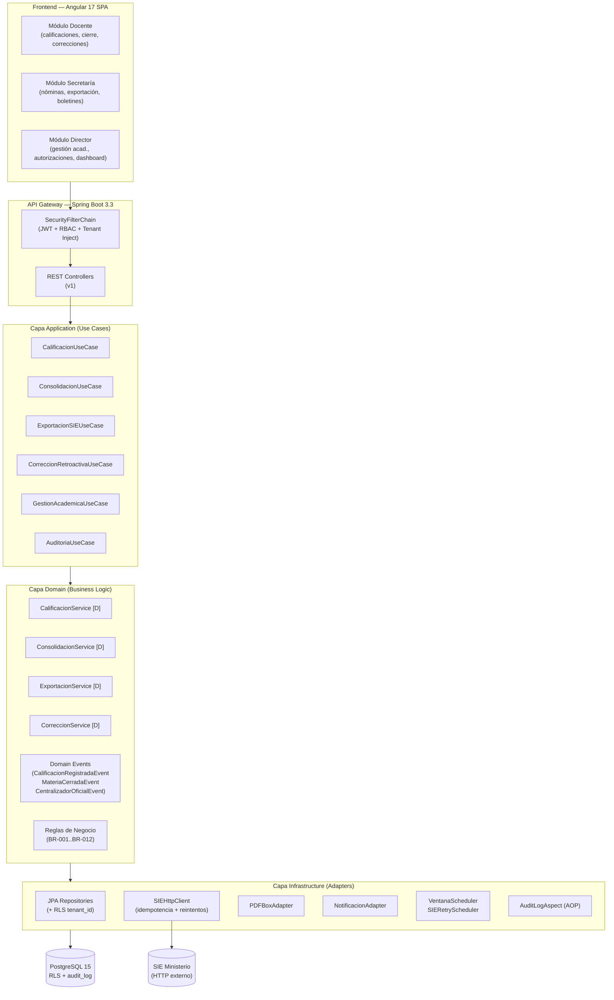
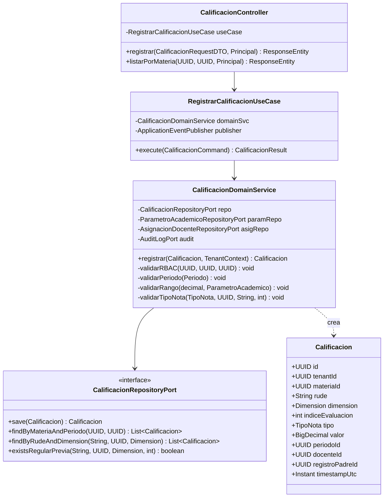
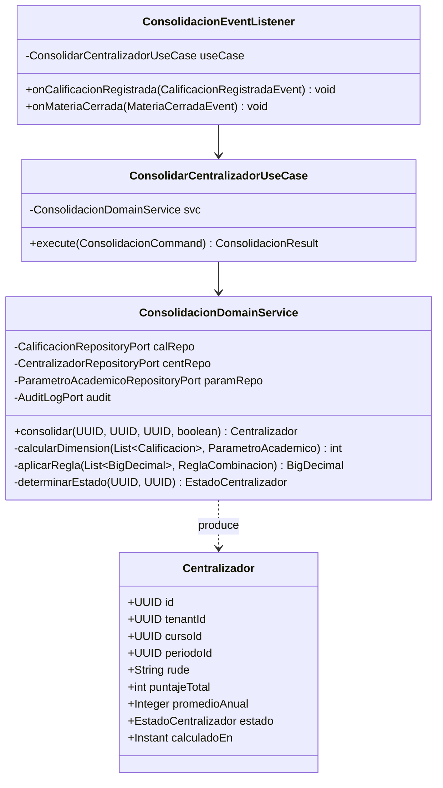
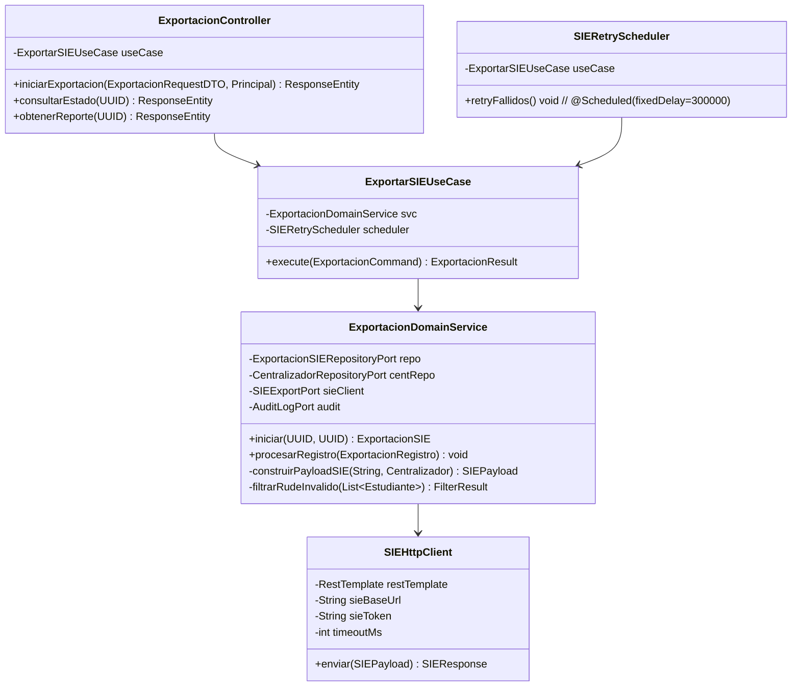
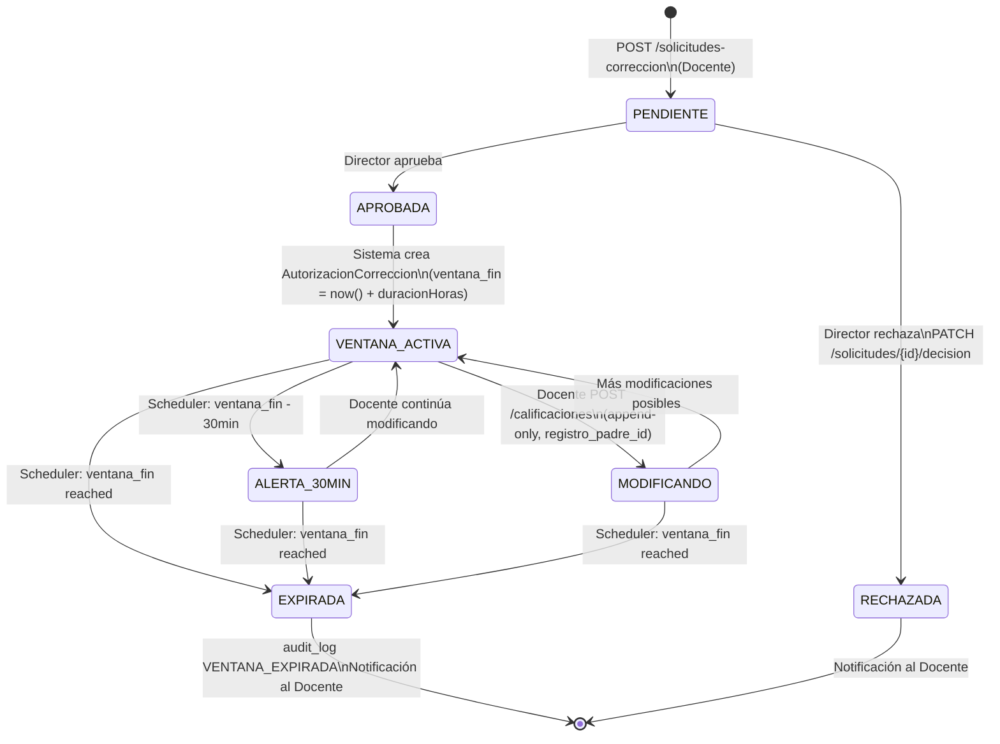
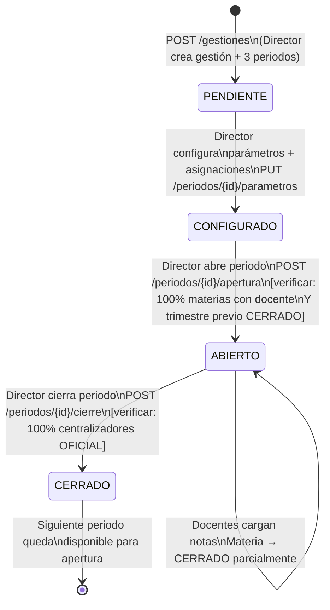
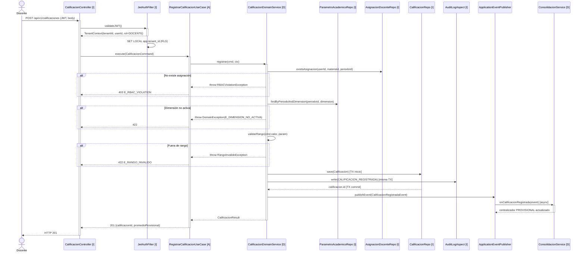
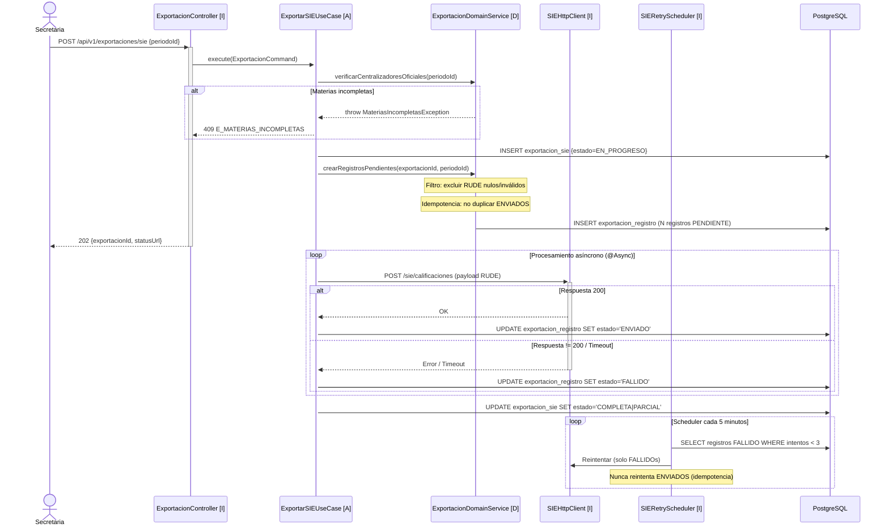
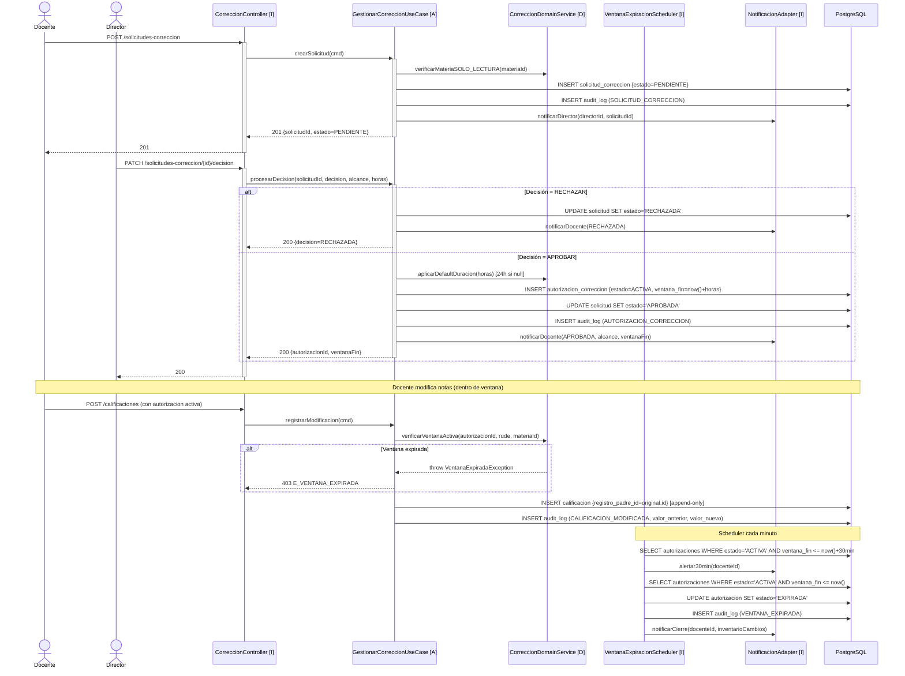
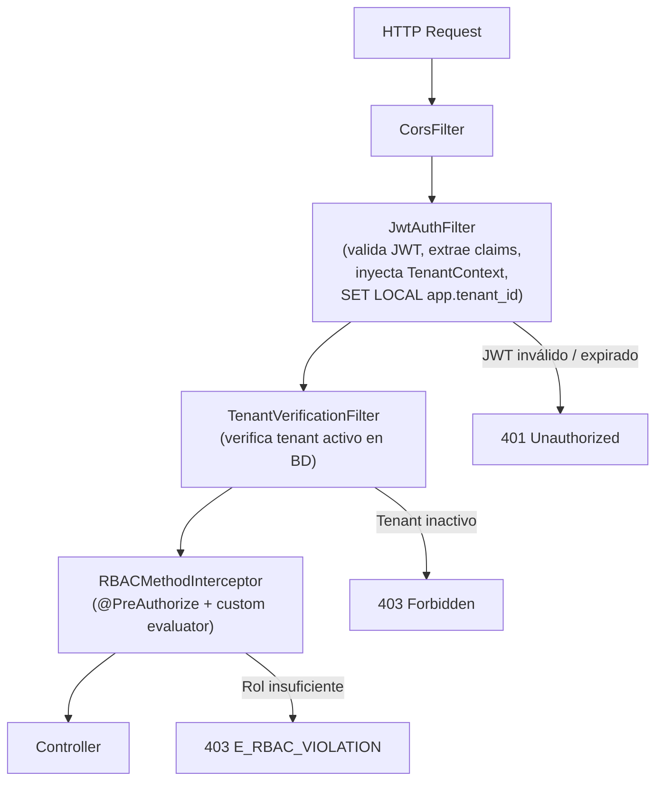

# Low-Level Functional Specification Document (LFSD) — EduSync

---

## §0. Metadatos

| Campo | Valor |
|-------|-------|
| **Producto** | EduSync |
| **Grupo** | G-EduSync |
| **Versión del documento** | v1.0 |
| **Fecha** | 15/05/2026 |
| **Autor** | Rodrigo Aspeti — Dev Lead / Architect |
| **Revisores** | Tech Lead · QA Engineer · Architect |
| **Estado** | Borrador técnico |
| **FSD de referencia** | `docs/FSD_EduSync.md` (v1.0) |
| **PRD de referencia** | `docs/PRD_EduSync.md` (v1.0) |
| **Stack** | Java 21 LTS · Spring Boot 3.3 · Spring Security 6 · Spring Data JPA · PostgreSQL 15 · Angular 17 · AWS |
| **Arquitectura** | Hexagonal (Ports & Adapters) — Domain / Application / Infrastructure |
| **Trazabilidad** | FSD-UC-001..005, FSD-UC-009 · PRD-REQ-001..020 · BR-001..BR-012 |

---

## §1. Introducción y alcance técnico

### 1.1 Propósito del documento

Este LFSD traduce los requerimientos funcionales del `FSD_EduSync.md` en especificaciones técnicas de bajo nivel implementables por desarrolladores Java/Spring. Cubre el diseño interno de cada componente: controladores REST, servicios de dominio, repositorios JPA, DTOs, eventos de dominio, configuración de seguridad, esquema de base de datos y flujos de ejecución secuencial.

### 1.2 Alcance técnico

**Dentro del alcance:**
- Diseño de clases para capas Domain, Application e Infrastructure
- Contratos API completos (request/response DTOs con validaciones Bean Validation)
- Esquema relacional completo con DDL lógico, índices y políticas RLS
- Diagramas de secuencia para los 5 flujos críticos (UC-001, UC-003, UC-004, UC-005, UC-009)
- Diagrama de clases de los módulos críticos
- Diseño del sistema de eventos de dominio (Spring Events)
- Configuración de Spring Security 6 (filtro JWT, RBAC method-level, tenant injection)
- Lógica de scheduler (ventanas temporales, reintentos SIE)
- Estrategia de manejo de errores global
- Pseudoalgoritmos del motor de consolidación y exportación SIE

**Fuera del alcance de este LFSD:**
- Configuración de infraestructura AWS (Terraform, CloudFormation)
- Scripts Flyway de migración (documentados en `infra/db/migrations/`)
- Diseño de componentes Angular (documentado en `docs/ui/`)
- Configuración de pipelines CI/CD

### 1.3 Convenciones

| Símbolo | Significado |
|---------|-------------|
| `[D]` | Capa Domain |
| `[A]` | Capa Application |
| `[I]` | Capa Infrastructure |
| `→` | Invocación / flujo de control |
| `⟹` | Evento de dominio publicado |
| `✗` | Operación rechazada / error |
| `RLS` | Row-Level Security (PostgreSQL) |

---

## §2. Arquitectura técnica detallada

### 2.1 Diagrama de componentes (nivel sistema)



### 2.2 Estructura de paquetes Java

```
bo.edusync/
├── domain/
│   ├── model/                    # Entidades de dominio (POJOs puros, sin anotaciones JPA)
│   │   ├── Calificacion.java
│   │   ├── Centralizador.java
│   │   ├── GestionAcademica.java
│   │   ├── Periodo.java
│   │   ├── ParametroAcademico.java
│   │   ├── Estudiante.java
│   │   ├── AutorizacionCorreccion.java
│   │   ├── SolicitudCorreccion.java
│   │   ├── ExportacionSIE.java
│   │   ├── ExportacionRegistro.java
│   │   └── AuditLog.java
│   ├── service/                  # Servicios de dominio (lógica de negocio pura)
│   │   ├── CalificacionDomainService.java
│   │   ├── ConsolidacionDomainService.java
│   │   ├── ExportacionDomainService.java
│   │   └── CorreccionDomainService.java
│   ├── event/                    # Eventos de dominio
│   │   ├── CalificacionRegistradaEvent.java
│   │   ├── MateriaCerradaEvent.java
│   │   └── CentralizadorOficialEvent.java
│   ├── port/                     # Puertos de salida (interfaces)
│   │   ├── CalificacionRepositoryPort.java
│   │   ├── CentralizadorRepositoryPort.java
│   │   ├── ParametroAcademicoRepositoryPort.java
│   │   ├── AuditLogPort.java
│   │   └── SIEExportPort.java
│   └── exception/                # Excepciones de dominio
│       ├── RBACViolationException.java
│       ├── PeriodoNoModificableException.java
│       ├── RangoInvalidoException.java
│       ├── RudeInvalidoException.java
│       ├── VentanaExpiradaException.java
│       └── MateriasIncompletasException.java
│
├── application/
│   ├── usecase/                  # Casos de uso (orquestadores)
│   │   ├── RegistrarCalificacionUseCase.java
│   │   ├── CerrarMateriaUseCase.java
│   │   ├── ConsolidarCentralizadorUseCase.java
│   │   ├── ExportarSIEUseCase.java
│   │   ├── GestionarCorreccionUseCase.java
│   │   └── AdministrarPeriodoUseCase.java
│   └── dto/                      # DTOs de entrada/salida de casos de uso
│       ├── CalificacionCommand.java
│       ├── ConsolidacionResult.java
│       └── ExportacionCommand.java
│
└── infrastructure/
    ├── web/                      # Adaptadores REST
    │   ├── controller/
    │   │   ├── CalificacionController.java
    │   │   ├── CentralizadorController.java
    │   │   ├── ExportacionController.java
    │   │   ├── CorreccionController.java
    │   │   ├── PeriodoController.java
    │   │   └── GestionAcademicaController.java
    │   ├── dto/                  # DTOs de API (request/response)
    │   └── mapper/               # MapStruct mappers
    ├── persistence/              # Adaptadores JPA
    │   ├── entity/               # Entidades JPA (con anotaciones)
    │   ├── repository/           # Spring Data JPA Repositories
    │   └── adapter/              # Implementaciones de ports
    ├── security/
    │   ├── JwtAuthFilter.java
    │   ├── TenantContextHolder.java
    │   ├── SecurityConfig.java
    │   └── RBACPermissionEvaluator.java
    ├── integration/
    │   ├── sie/SIEHttpClient.java
    │   └── pdf/PDFBoxAdapter.java
    ├── scheduler/
    │   ├── VentanaExpiracionScheduler.java
    │   └── SIERetryScheduler.java
    └── aop/
        └── AuditLogAspect.java
```

### 2.3 Principios de diseño aplicados

| Principio | Aplicación en EduSync |
|-----------|----------------------|
| **Hexagonal (Ports & Adapters)** | El dominio no depende de Spring, JPA ni REST. Los ports definen contratos. Los adapters los implementan. |
| **SOLID — SRP** | `CalificacionDomainService` valida y persiste; `ConsolidacionDomainService` calcula. Nunca se mezclan. |
| **SOLID — DIP** | Los servicios de dominio dependen de interfaces (`CalificacionRepositoryPort`), no de repositorios JPA. |
| **Domain Events** | El cierre de materia emite `MateriaCerradaEvent`; el servicio de consolidación lo escucha. Sin acoplamiento directo. |
| **Immutability** | Las entidades `AuditLog`, `Calificacion` (post-cierre) y `Centralizador` (OFICIAL) son append-only. |
| **Fail-fast** | Todas las validaciones de negocio lanzan excepción específica antes de cualquier operación de base de datos. |

---

## §3. Módulos y diseño de componentes

### 3.1 Módulo de Calificaciones

#### Diagrama de clases



#### Flujo interno de `CalificacionDomainService.registrar()`

```
1. Extraer {tenantId, userId, rol} del TenantContext (inyectado por JwtAuthFilter)
2. IF rol != DOCENTE → lanzar RBACViolationException("E_RBAC_VIOLATION")
3. Verificar AsignacionDocente(docente_id=userId, materia_id=cmd.materiaId, periodo_id=cmd.periodoId)
   IF no existe → lanzar RBACViolationException("E_RBAC_VIOLATION")
4. Recuperar Periodo por cmd.periodoId
   IF estado == CERRADO || estado == SOLO_LECTURA → lanzar PeriodoNoModificableException
5. Validar cmd.rude: formato regex [0-9]{10,20}
   IF inválido → lanzar RudeInvalidoException
6. Recuperar ParametroAcademico(periodo_id, dimension=cmd.dimension)
   IF null → lanzar DomainException("E_DIMENSION_NO_ACTIVA")
7. IF cmd.valor < param.rangoMin || cmd.valor > param.rangoMax
   → lanzar RangoInvalidoException(cmd.dimension, param.rangoMin, param.rangoMax)
8. IF cmd.tipo == AYUDA && param.requiereRegularPrevia
   && !repo.existsRegularPrevia(cmd.rude, cmd.materiaId, cmd.dimension, cmd.indiceEvaluacion)
   → lanzar DomainException("E_REGULAR_REQUERIDA")
9. Construir Calificacion(tenant_id=tenantId, ...)
10. repo.save(calificacion) → [transacción activa]
11. audit.write(AuditLog{actor=userId, accion=CALIFICACION_REGISTRADA, entidad_id=cal.id,
    valor_anterior=null, valor_nuevo=cal.valor}) → [misma transacción]
12. publisher.publishEvent(CalificacionRegistradaEvent{materiaId, periodoId, cursoId, tenantId})
    → desacopla el recálculo de la consolidación provisional
13. RETURN CalificacionResult{id=cal.id, promedioProvisional: DELEGADO A ConsolidacionService}
```

### 3.2 Módulo de Consolidación

#### Diagrama de clases



#### Pseudoalgoritmo del motor de consolidación

```
ConsolidacionDomainService.consolidar(cursoId, periodoId, tenantId, forzarOficial):

PARA_CADA estudiante (rude) en nómina del curso:
    puntajeTotal = 0
    incompleto = false

    PARA_CADA dimensionActiva en getParametros(periodoId):
        evaluaciones = calRepo.findByCurso(rude, materiaId, periodoId, dimension)

        SI evaluaciones.isEmpty():
            incompleto = true
            CONTINUAR (puntaje = 0 para esta dimensión)

        SEGÚN param.reglaCombinacion:
            CASO PROMEDIO_SIMPLE:
                suma = evaluaciones.map(v → v.valor).sum()
                resultado = suma / evaluaciones.size()   // BigDecimal division
            CASO SUMA:
                resultado = evaluaciones.map(v → v.valor).sum()
            CASO MEJOR_N:
                resultado = evaluaciones.sorted(DESC).take(N).average()

        // Escalado al peso máximo de la dimensión
        // puntaje_dim = floor(resultado * pesoMax / rangoMax)
        puntajeDim = Math.floor(resultado.multiply(param.pesoMax)
                                .divide(param.rangoMax, RoundingMode.FLOOR))
                          .intValue()
        puntajeTotal += puntajeDim

    registrar Centralizador{rude, puntajeTotal, incompleto}

estado = determinarEstado(cursoId, periodoId)
    // OFICIAL si 100% materias del curso+periodo en CERRADO, sino PROVISIONAL

SI estado == OFICIAL:
    // Calcular promedio anual si T1, T2, T3 todos OFICIAL
    trimestres = centRepo.findOficiales(cursoId, gestionId)
    SI trimestres.size() == 3:
        promedioAnual = Math.floor(
            (trimestres[0].puntaje + trimestres[1].puntaje + trimestres[2].puntaje) / 3.0
        )
    SINO:
        promedioAnual = null  // Siempre null con <3 trimestres (BR-011)

    publisher.publishEvent(CentralizadorOficialEvent{cursoId, periodoId})
```

### 3.3 Módulo de Exportación SIE

#### Diagrama de clases



#### Pseudoalgoritmo de exportación con idempotencia

```
ExportacionDomainService.iniciar(periodoId, tenantId):

1. Verificar que 100% materias del periodo tienen centralizador OFICIAL
   SI no → lanzar MateriasIncompletasException(listaPendientes)

2. Crear ExportacionSIE{periodoId, tenantId, estado=EN_PROGRESO, creadaEn=now()}
   repo.save(exportacion)

3. Obtener estudiantes del periodo: list<Estudiante>
   PARA_CADA estudiante:
       // Filtro pre-exportación (BR-004)
       SI rude == null || !validarFormatoRude(rude):
           crear ExportacionRegistro{estado=EXCLUIDO_SIN_RUDE}
           CONTINUAR
       centralizador = centRepo.findOficial(rude, periodoId)
       SI centralizador == null || tieneNotaNula(centralizador):
           crear ExportacionRegistro{estado=EXCLUIDO_NOTA_INCOMPLETA}
           CONTINUAR
       // Verificar idempotencia: ¿ya fue enviado este rude+periodo?
       SI repo.existsEnviado(rude, periodoId):
           CONTINUAR  // No reenviar jamás
       crear ExportacionRegistro{rude, estado=PENDIENTE, exportacionId}

4. Procesar registros PENDIENTE de forma asíncrona (@Async):
   PARA_CADA registro PENDIENTE:
       payload = construirPayloadSIE(registro.rude, centralizador)
       TRY:
           respuesta = sieClient.enviar(payload)  // timeout 30s
           SI respuesta.status == 200:
               registro.estado = ENVIADO
           SINO:
               registro.estado = FALLIDO
               registro.errorMsg = respuesta.body
       CATCH TimeoutException:
           registro.estado = FALLIDO
           registro.errorMsg = "TIMEOUT"
       repo.save(registro)

5. Actualizar ExportacionSIE.estado:
   SI todos ENVIADO → COMPLETA
   SI alguno FALLIDO → PARCIAL
   SI todos FALLIDO → FALLIDA

6. audit.write(actor=secretariaId, accion=EXPORTACION_SIE, resultado=estado, periodo=periodoId)
7. RETURN ExportacionResult{enviados, fallidos, excluidos}
```

### 3.4 Módulo de Corrección Retroactiva

#### Diagrama de estados interno



### 3.5 Módulo de Gestión Académica

#### Máquina de estados del Periodo



---

## §4. Contratos de API REST

### 4.1 Convenciones globales

| Aspecto | Valor |
|---------|-------|
| **Base URL** | `/api/v1` |
| **Content-Type** | `application/json; charset=UTF-8` |
| **Autenticación** | Header `Authorization: Bearer <JWT>` en todos los endpoints |
| **Tenant** | Extraído del claim `tenantId` del JWT; nunca se envía en el body |
| **Versionado** | Prefijo `/v1`; versiones futuras en `/v2` |
| **Formato de error** | `{"error": "E_CODE", "message": "...", "details": {...}}` |
| **IDs** | UUIDv4 en todos los recursos |
| **Timestamps** | ISO-8601 UTC (`2026-05-15T14:30:00Z`) |

### 4.2 Módulo de Autenticación

#### POST /api/v1/auth/login

**Request:**
```json
{
  "email": "marcela@colegio.bo",
  "password": "string"
}
```

**Response 200:**
```json
{
  "accessToken": "eyJhbGci...",
  "tokenType": "Bearer",
  "expiresIn": 28800,
  "usuario": {
    "id": "uuid",
    "nombre": "Marcela Quispe",
    "rol": "DOCENTE",
    "tenantId": "uuid",
    "tenantNombre": "Colegio Abaroa"
  }
}
```

**Errores:**
| Código HTTP | Error | Condición |
|-------------|-------|-----------|
| 401 | `E_CREDENCIALES_INVALIDAS` | Email/password incorrectos |
| 423 | `E_CUENTA_BLOQUEADA` | > 5 intentos fallidos |
| 503 | `E_AUTH_SERVICE_UNAVAILABLE` | Fallo interno |

---

### 4.3 Módulo de Calificaciones

#### POST /api/v1/calificaciones

**Roles permitidos:** `DOCENTE`

**Request DTO — `CalificacionRequestDTO`:**
```json
{
  "materiaId": "uuid",
  "periodoId": "uuid",
  "rude": "1234567890",
  "dimension": "SABER",
  "indiceEvaluacion": 1,
  "tipo": "REGULAR",
  "valor": 38.50
}
```

**Validaciones Bean Validation:**
| Campo | Anotación | Restricción |
|-------|-----------|-------------|
| `materiaId` | `@NotNull` | UUID válido |
| `periodoId` | `@NotNull` | UUID válido |
| `rude` | `@NotBlank @Pattern("[0-9]{10,20}")` | Solo dígitos, 10-20 chars |
| `dimension` | `@NotNull` | Enum: SER/SABER/HACER/DECIDIR/AUTOEVALUACION |
| `indiceEvaluacion` | `@Min(1)` | ≥ 1 |
| `tipo` | `@NotNull` | Enum: REGULAR/AYUDA |
| `valor` | `@NotNull @DecimalMin("0.00") @DecimalMax("100.00")` | Decimal 5,2 |

**Response 201:**
```json
{
  "calificacionId": "uuid",
  "promedioProvisional": {
    "valor": 38,
    "estado": "PROVISIONAL",
    "completitud": 0.33
  },
  "timestamp": "2026-05-15T14:30:00Z"
}
```

**Errores:**
| HTTP | Error | BR |
|------|-------|----|
| 400 | `E_RUDE_INVALIDO` | RB-01 |
| 403 | `E_RBAC_VIOLATION` | BR-001 |
| 409 | `E_PERIODO_NO_MODIFICABLE` | BR-007 |
| 422 | `E_RANGO_INVALIDO` + `{rangoPermitido: [min, max]}` | BR-002 |
| 422 | `E_DIMENSION_NO_ACTIVA` | DA-02 |
| 422 | `E_REGULAR_REQUERIDA` | DA-02 |

---

#### GET /api/v1/calificaciones

**Query params:** `materiaId`, `periodoId`, `rude` (opcional)

**Roles permitidos:** `DOCENTE` (solo su materia), `DIRECTOR`, `SECRETARIA`

**Response 200:**
```json
{
  "calificaciones": [
    {
      "id": "uuid",
      "rude": "1234567890",
      "dimension": "SABER",
      "indiceEvaluacion": 1,
      "tipo": "REGULAR",
      "valor": 38.50,
      "esModificacion": false,
      "timestamp": "2026-05-15T14:30:00Z"
    }
  ],
  "totalCount": 45
}
```

---

### 4.4 Módulo de Cierre de Materia

#### POST /api/v1/materias/{materiaId}/cierre

**Roles permitidos:** `DOCENTE` (solo sus materias asignadas)

**Request:** body vacío (`{}`)

**Validación previa (lógica de negocio):**
1. Verificar que la materia está en estado `ABIERTO`
2. Verificar que el Docente está asignado a la materia en el periodo activo
3. Verificar completitud: para cada estudiante de la nómina, cada evaluación declarada tiene nota registrada

**Response 200:**
```json
{
  "materiaId": "uuid",
  "estadoAnterior": "ABIERTO",
  "estadoNuevo": "CERRADO",
  "timestamp": "2026-05-15T14:30:00Z",
  "estudiantes": 32,
  "evaluacionesCerradas": 160
}
```

**Errores:**
| HTTP | Error | Condición |
|------|-------|-----------|
| 409 | `E_MATERIA_YA_CERRADA` | Estado ya == CERRADO |
| 422 | `E_EVALUACIONES_INCOMPLETAS` + lista de pendientes | Algún estudiante sin nota |
| 403 | `E_RBAC_VIOLATION` | Docente no asignado |

---

### 4.5 Módulo de Centralizadores

#### GET /api/v1/centralizadores

**Query params:** `cursoId`, `periodoId`, `estado` (PROVISIONAL/OFICIAL, opcional)

**Roles permitidos:** `DOCENTE` (solo su curso), `DIRECTOR`, `SECRETARIA`

**Response 200:**
```json
{
  "centralizadorId": "uuid",
  "cursoId": "uuid",
  "periodoId": "uuid",
  "estado": "PROVISIONAL",
  "calculadoEn": "2026-05-15T14:30:00Z",
  "promedios": [
    {
      "rude": "1234567890",
      "puntajeTotal": 78,
      "aprobado": true,
      "promedioAnual": null,
      "incompleto": false,
      "dimensiones": {
        "SER": 4,
        "SABER": 38,
        "HACER": 32,
        "DECIDIR": 4
      }
    }
  ],
  "resumen": {
    "totalEstudiantes": 32,
    "aprobados": 28,
    "reprobados": 4,
    "incompletos": 0,
    "porcentajeAprobacion": 87.5
  }
}
```

---

### 4.6 Módulo de Exportación SIE

#### POST /api/v1/exportaciones/sie

**Roles permitidos:** `SECRETARIA`

**Request:**
```json
{
  "periodoId": "uuid"
}
```

**Response 202 Accepted:**
```json
{
  "exportacionId": "uuid",
  "estado": "EN_PROGRESO",
  "totalRegistros": 80,
  "timestamp": "2026-05-15T14:30:00Z",
  "statusUrl": "/api/v1/exportaciones/uuid/estado"
}
```

**Errores:**
| HTTP | Error | Condición |
|------|-------|-----------|
| 409 | `E_MATERIAS_INCOMPLETAS` + `{pendientes: [...]}`  | Materias sin centralizador OFICIAL |
| 409 | `E_EXPORTACION_EN_PROGRESO` | Ya existe una exportación activa |

---

#### GET /api/v1/exportaciones/{exportacionId}/estado

**Response 200:**
```json
{
  "exportacionId": "uuid",
  "estado": "PARCIAL",
  "enviados": 74,
  "fallidos": 4,
  "excluidosSinRude": 1,
  "excluidosNotaIncompleta": 1,
  "completadaEn": null,
  "registros": [
    {"rude": "123...", "estado": "ENVIADO"},
    {"rude": "456...", "estado": "FALLIDO", "error": "SIE_HTTP_503"}
  ]
}
```

---

### 4.7 Módulo de Correcciones Retroactivas

#### POST /api/v1/solicitudes-correccion

**Roles permitidos:** `DOCENTE`

**Request:**
```json
{
  "materiaId": "uuid",
  "rude": "1234567890",
  "dimension": "SABER",
  "indiceEvaluacion": 2,
  "justificacion": "El estudiante presentó prueba adicional por enfermedad documentada."
}
```

**Validaciones:**
| Campo | Restricción |
|-------|-------------|
| `justificacion` | `@NotBlank @Size(min=20, max=500)` |
| `dimension` | Enum válido |
| `indiceEvaluacion` | `@Min(1)` |

**Response 201:**
```json
{
  "solicitudId": "uuid",
  "estado": "PENDIENTE",
  "mensaje": "Solicitud enviada al Director para revisión.",
  "timestamp": "2026-05-15T14:30:00Z"
}
```

---

#### PATCH /api/v1/solicitudes-correccion/{id}/decision

**Roles permitidos:** `DIRECTOR`

**Request:**
```json
{
  "decision": "APROBAR",
  "alcance": "ESTUDIANTE_ESPECIFICO",
  "duracionHoras": 24
}
```

**Validaciones:**
| Campo | Restricción |
|-------|-------------|
| `decision` | Enum: APROBAR / RECHAZAR |
| `alcance` | Enum: ESTUDIANTE_ESPECIFICO / CURSO_COMPLETO (requerido si APROBAR) |
| `duracionHoras` | `@Min(1) @Max(72)` (requerido si APROBAR; default 24 si null) |

**Response 200:**
```json
{
  "solicitudId": "uuid",
  "decision": "APROBAR",
  "autorizacion": {
    "autorizacionId": "uuid",
    "alcance": "ESTUDIANTE_ESPECIFICO",
    "ventanaInicio": "2026-05-15T14:30:00Z",
    "ventanaFin": "2026-05-16T14:30:00Z",
    "estado": "ACTIVA"
  }
}
```

---

### 4.8 Módulo de Gestión Académica

#### POST /api/v1/gestiones

**Roles permitidos:** `DIRECTOR`

**Request:**
```json
{
  "anio": 2026,
  "nombre": "Gestión Académica 2026"
}
```

**Response 201:**
```json
{
  "gestionId": "uuid",
  "anio": 2026,
  "estado": "CONFIGURANDO",
  "periodos": [
    {"periodoId": "uuid", "nombre": "Trimestre 1", "estado": "PENDIENTE"},
    {"periodoId": "uuid", "nombre": "Trimestre 2", "estado": "PENDIENTE"},
    {"periodoId": "uuid", "nombre": "Trimestre 3", "estado": "PENDIENTE"}
  ]
}
```

---

#### PUT /api/v1/periodos/{periodoId}/parametros

**Roles permitidos:** `DIRECTOR`

**Request:**
```json
{
  "fechaInicio": "2026-02-01",
  "fechaFin": "2026-04-30",
  "dimensiones": [
    {
      "dimension": "SER",
      "pesoMax": 5,
      "rangoMin": 0,
      "rangoMax": 5,
      "reglaCombinacion": "PROMEDIO_SIMPLE",
      "requiereRegularPrevia": false
    },
    {
      "dimension": "SABER",
      "pesoMax": 45,
      "rangoMin": 0,
      "rangoMax": 45,
      "reglaCombinacion": "PROMEDIO_SIMPLE",
      "requiereRegularPrevia": false
    },
    {
      "dimension": "HACER",
      "pesoMax": 40,
      "rangoMin": 0,
      "rangoMax": 40,
      "reglaCombinacion": "PROMEDIO_SIMPLE",
      "requiereRegularPrevia": false
    },
    {
      "dimension": "DECIDIR",
      "pesoMax": 5,
      "rangoMin": 0,
      "rangoMax": 5,
      "reglaCombinacion": "PROMEDIO_SIMPLE",
      "requiereRegularPrevia": false
    }
  ],
  "umbralAprobacion": 51,
  "criterioTruncado": "FLOOR"
}
```

**Validaciones críticas:**
- Suma de `pesoMax` de todas las dimensiones == 100 (exacto)
- `rangoMin` >= 0; `rangoMax` > `rangoMin`
- `fechaInicio` < `fechaFin`
- Solo editable mientras el periodo está en estado `PENDIENTE` o `CONFIGURADO` (BR-007)

---

#### POST /api/v1/periodos/{periodoId}/apertura

**Roles permitidos:** `DIRECTOR`

**Validaciones pre-apertura:**
1. Periodo en estado `CONFIGURADO`
2. Ningún trimestre anterior en estado `ABIERTO` (apertura secuencial BR-006)
3. 100% de materias del periodo tienen al menos un docente asignado
4. Parámetros del periodo completos (todas las dimensiones configuradas)

**Response 200:**
```json
{
  "periodoId": "uuid",
  "estadoAnterior": "CONFIGURADO",
  "estadoNuevo": "ABIERTO",
  "parametrosCongelados": true,
  "docentesNotificados": 12,
  "timestamp": "2026-05-15T14:30:00Z"
}
```

---

## §5. DTOs completos

### 5.1 Enumeraciones del sistema

```java
// Roles de usuario
enum Rol { DIRECTOR, SECRETARIA, DOCENTE }

// Estados del periodo
enum EstadoPeriodo { PENDIENTE, CONFIGURADO, ABIERTO, CERRADO }

// Estados de la gestión académica
enum EstadoGestion { CONFIGURANDO, ACTIVA, CERRADA }

// Dimensiones de calificación (Ley 070 Bolivia)
enum Dimension { SER, SABER, HACER, DECIDIR, AUTOEVALUACION }

// Tipos de nota
enum TipoNota { REGULAR, AYUDA }

// Reglas de combinación de evaluaciones
enum ReglaCombinacion { PROMEDIO_SIMPLE, SUMA, MEJOR_N }

// Estado del centralizador
enum EstadoCentralizador { PROVISIONAL, OFICIAL }

// Estado de exportación global
enum EstadoExportacion { EN_PROGRESO, COMPLETA, PARCIAL, FALLIDA }

// Estado de cada registro de exportación
enum EstadoRegistroExportacion {
    PENDIENTE, ENVIADO, FALLIDO,
    EXCLUIDO_SIN_RUDE, EXCLUIDO_NOTA_INCOMPLETA
}

// Estado de solicitud de corrección
enum EstadoSolicitud { PENDIENTE, APROBADA, RECHAZADA }

// Estado de autorización de corrección
enum EstadoAutorizacion { ACTIVA, EXPIRADA, COMPLETADA }

// Estado del estudiante
enum EstadoEstudiante { ACTIVO, RETIRADO, TRANSFERIDO }

// Acciones auditadas
enum AccionAudit {
    CALIFICACION_REGISTRADA, CALIFICACION_MODIFICADA,
    MATERIA_CERRADA, PERIODO_ABIERTO, PERIODO_CERRADO,
    EXPORTACION_SIE, SOLICITUD_CORRECCION, AUTORIZACION_CORRECCION,
    VENTANA_EXPIRADA, RBAC_VIOLATION, CONSOLIDACION_ERROR,
    NOMINA_ALTA, NOMINA_BAJA, NOMINA_TRANSFERENCIA,
    BOLETIN_GENERADO, SESION_INICIADA
}
```

### 5.2 DTOs de error (respuesta unificada)

```java
// ErrorResponseDTO — estructura estándar de error
{
  "error": "E_CODIGO",               // Código de error de negocio
  "message": "Descripción legible",  // Para el cliente
  "details": {                       // Contexto adicional (opcional)
    "campo": "valor",
    "rangoPermitido": [0, 45]
  },
  "timestamp": "ISO-8601",
  "path": "/api/v1/calificaciones",
  "traceId": "uuid"                  // Para correlación en logs
}
```

### 5.3 DTO de contexto de tenant (interno)

```java
// TenantContext — propagado por JwtAuthFilter via ThreadLocal
class TenantContext {
    UUID tenantId;
    UUID userId;
    String userEmail;
    Rol rol;
    String sessionId;
}
```

---

## §6. Entidades JPA (Infrastructure Layer)

### 6.1 CalificacionEntity

```java
@Entity
@Table(name = "calificacion",
    indexes = {
        @Index(name = "idx_calif_materia_periodo", columnList = "materia_id,periodo_id"),
        @Index(name = "idx_calif_rude_periodo", columnList = "rude,periodo_id"),
        @Index(name = "idx_calif_docente", columnList = "docente_id"),
        @Index(name = "idx_calif_tenant", columnList = "tenant_id")
    })
@SQLRestriction("tenant_id = current_setting('app.tenant_id')::uuid")
public class CalificacionEntity {
    @Id UUID id;
    @Column(nullable=false) UUID tenantId;          // RLS
    @Column(nullable=false) UUID materiaId;
    @Column(nullable=false, length=20) String rude;
    @Enumerated(STRING) Dimension dimension;
    @Column(nullable=false) int indiceEvaluacion;
    @Enumerated(STRING) TipoNota tipo;
    @Column(precision=5, scale=2, nullable=false) BigDecimal valor;
    @Column(nullable=false) UUID periodoId;
    @Column(nullable=false) UUID docenteId;
    UUID registroPadreId;                           // null para registros originales
    @Column(nullable=false) Instant timestampUtc;

    @PrePersist void prePersist() {
        if (id == null) id = UUID.randomUUID();
        if (timestampUtc == null) timestampUtc = Instant.now();
    }
}
```

### 6.2 CentralizadorEntity

```java
@Entity
@Table(name = "centralizador",
    uniqueConstraints = @UniqueConstraint(columnNames={"rude","periodo_id","curso_id"}),
    indexes = {
        @Index(name = "idx_cent_curso_periodo", columnList = "curso_id,periodo_id"),
        @Index(name = "idx_cent_tenant", columnList = "tenant_id")
    })
@SQLRestriction("tenant_id = current_setting('app.tenant_id')::uuid")
public class CentralizadorEntity {
    @Id UUID id;
    @Column(nullable=false) UUID tenantId;
    @Column(nullable=false) UUID cursoId;
    @Column(nullable=false) UUID periodoId;
    @Column(nullable=false, length=20) String rude;
    @Column(nullable=false) int puntajeTotal;
    Integer promedioAnual;                          // null hasta que 3 trimestres OFICIAL
    @Enumerated(STRING) EstadoCentralizador estado;
    boolean incompleto;
    @Column(nullable=false) Instant calculadoEn;
}
```

### 6.3 AutorizacionCorreccionEntity

```java
@Entity
@Table(name = "autorizacion_correccion")
@SQLRestriction("tenant_id = current_setting('app.tenant_id')::uuid")
public class AutorizacionCorreccionEntity {
    @Id UUID id;
    @Column(nullable=false) UUID tenantId;
    @Column(nullable=false) UUID solicitudId;
    @Column(nullable=false) UUID directorId;
    @Column(nullable=false) UUID docenteId;
    @Column(nullable=false) UUID materiaId;
    @Enumerated(STRING) AlcanceAutorizacion alcance;
    @Column(nullable=false) Instant ventanaInicio;
    @Column(nullable=false) Instant ventanaFin;
    @Enumerated(STRING) EstadoAutorizacion estado;

    // Método de dominio (no cálculo de promedio)
    public boolean estaActiva() {
        return estado == ACTIVA && Instant.now().isBefore(ventanaFin);
    }

    public boolean cubre(String rude, UUID materiaId) {
        if (!this.materiaId.equals(materiaId)) return false;
        if (alcance == CURSO_COMPLETO) return true;
        return this.rudeEspecifico != null && this.rudeEspecifico.equals(rude);
    }
}
```

### 6.4 AuditLogEntity

```java
@Entity
@Table(name = "audit_log",
    indexes = {
        @Index(name = "idx_audit_tenant_ts", columnList = "tenant_id,timestamp_utc"),
        @Index(name = "idx_audit_actor", columnList = "actor_id"),
        @Index(name = "idx_audit_entidad", columnList = "entidad_afectada,entidad_id")
    })
@Immutable  // Hibernate: sin UPDATE ni DELETE
@SQLRestriction("tenant_id = current_setting('app.tenant_id')::uuid")
public class AuditLogEntity {
    @Id UUID id;
    @Column(nullable=false) UUID tenantId;
    @Column(nullable=false) UUID actorId;
    @Enumerated(STRING) @Column(nullable=false) AccionAudit accion;
    @Column(nullable=false, length=50) String entidadAfectada;
    @Column(nullable=false) UUID entidadId;
    @Type(JsonType.class) Object valorAnterior;     // JSONB
    @Type(JsonType.class) @Column(nullable=false) Object valorNuevo;  // JSONB
    @Column(nullable=false) Instant timestampUtc;
    String ipOrigen;
    String sessionId;

    @PrePersist void prePersist() {
        if (id == null) id = UUID.randomUUID();
        if (timestampUtc == null) timestampUtc = Instant.now();
    }
}
```

> **Constraint DB:** La tabla `audit_log` tiene una regla PostgreSQL que rechaza cualquier intento de `UPDATE` o `DELETE`:
> ```sql
> CREATE RULE no_update_audit AS ON UPDATE TO audit_log DO INSTEAD NOTHING;
> CREATE RULE no_delete_audit AS ON DELETE TO audit_log DO INSTEAD NOTHING;
> ```

---

## §7. Esquema de base de datos

### 7.1 DDL lógico — tablas principales

```sql
-- Tenant (configurado por operador, fuera del scope del LFSD)
CREATE TABLE tenant (
    id          UUID PRIMARY KEY DEFAULT gen_random_uuid(),
    nombre      VARCHAR(200) NOT NULL,
    estado      VARCHAR(20)  NOT NULL DEFAULT 'ACTIVO',
    creado_en   TIMESTAMPTZ  NOT NULL DEFAULT now()
);

-- Usuario
CREATE TABLE usuario (
    id          UUID PRIMARY KEY DEFAULT gen_random_uuid(),
    tenant_id   UUID NOT NULL REFERENCES tenant(id),
    email       VARCHAR(120) NOT NULL,
    password_hash VARCHAR(255) NOT NULL,
    nombre      VARCHAR(200) NOT NULL,
    rol         VARCHAR(20)  NOT NULL CHECK (rol IN ('DIRECTOR','SECRETARIA','DOCENTE')),
    activo      BOOLEAN      NOT NULL DEFAULT true,
    creado_en   TIMESTAMPTZ  NOT NULL DEFAULT now(),
    UNIQUE (tenant_id, email)
);

-- Gestión Académica
CREATE TABLE gestion_academica (
    id          UUID PRIMARY KEY DEFAULT gen_random_uuid(),
    tenant_id   UUID NOT NULL REFERENCES tenant(id),
    anio        INTEGER NOT NULL,
    nombre      VARCHAR(100) NOT NULL,
    estado      VARCHAR(20)  NOT NULL DEFAULT 'CONFIGURANDO',
    creado_en   TIMESTAMPTZ  NOT NULL DEFAULT now(),
    UNIQUE (tenant_id, anio)
);

-- Periodo (Trimestre)
CREATE TABLE periodo (
    id              UUID PRIMARY KEY DEFAULT gen_random_uuid(),
    tenant_id       UUID NOT NULL REFERENCES tenant(id),
    gestion_id      UUID NOT NULL REFERENCES gestion_academica(id),
    nombre          VARCHAR(50)  NOT NULL,
    orden           INTEGER      NOT NULL CHECK (orden BETWEEN 1 AND 3),
    estado          VARCHAR(20)  NOT NULL DEFAULT 'PENDIENTE',
    fecha_inicio    DATE,
    fecha_fin       DATE,
    parametros_congelados BOOLEAN NOT NULL DEFAULT false,
    abierto_en      TIMESTAMPTZ,
    cerrado_en      TIMESTAMPTZ,
    CONSTRAINT ck_fechas CHECK (fecha_fin IS NULL OR fecha_inicio < fecha_fin),
    UNIQUE (gestion_id, orden)
);

-- Parámetro Académico
CREATE TABLE parametro_academico (
    id                  UUID PRIMARY KEY DEFAULT gen_random_uuid(),
    tenant_id           UUID NOT NULL REFERENCES tenant(id),
    periodo_id          UUID NOT NULL REFERENCES periodo(id),
    dimension           VARCHAR(20) NOT NULL,
    peso_max            DECIMAL(5,2) NOT NULL CHECK (peso_max > 0),
    rango_min           DECIMAL(5,2) NOT NULL DEFAULT 0,
    rango_max           DECIMAL(5,2) NOT NULL,
    regla_combinacion   VARCHAR(20)  NOT NULL DEFAULT 'PROMEDIO_SIMPLE',
    requiere_regular_previa BOOLEAN  NOT NULL DEFAULT false,
    CONSTRAINT ck_rango CHECK (rango_min >= 0 AND rango_max > rango_min),
    UNIQUE (periodo_id, dimension)
);

-- Materia
CREATE TABLE materia (
    id              UUID PRIMARY KEY DEFAULT gen_random_uuid(),
    tenant_id       UUID NOT NULL REFERENCES tenant(id),
    gestion_id      UUID NOT NULL REFERENCES gestion_academica(id),
    curso_id        UUID NOT NULL,
    nombre          VARCHAR(100) NOT NULL,
    estado          VARCHAR(20)  NOT NULL DEFAULT 'ABIERTO',
    UNIQUE (gestion_id, curso_id, nombre)
);

-- Asignación Docente-Materia
CREATE TABLE asignacion_docente (
    id          UUID PRIMARY KEY DEFAULT gen_random_uuid(),
    tenant_id   UUID NOT NULL REFERENCES tenant(id),
    docente_id  UUID NOT NULL REFERENCES usuario(id),
    materia_id  UUID NOT NULL REFERENCES materia(id),
    periodo_id  UUID NOT NULL REFERENCES periodo(id),
    activa      BOOLEAN NOT NULL DEFAULT true,
    UNIQUE (docente_id, materia_id, periodo_id)
);

-- Estudiante
CREATE TABLE estudiante (
    id              UUID PRIMARY KEY DEFAULT gen_random_uuid(),
    tenant_id       UUID NOT NULL REFERENCES tenant(id),
    rude            VARCHAR(20)  NOT NULL,
    nombre_completo VARCHAR(200) NOT NULL,
    curso_id        UUID NOT NULL,
    estado          VARCHAR(20)  NOT NULL DEFAULT 'ACTIVO',
    creado_en       TIMESTAMPTZ  NOT NULL DEFAULT now(),
    UNIQUE (tenant_id, rude)
);

-- Calificación (append-only para modificaciones retroactivas)
CREATE TABLE calificacion (
    id                  UUID PRIMARY KEY DEFAULT gen_random_uuid(),
    tenant_id           UUID NOT NULL REFERENCES tenant(id),
    materia_id          UUID NOT NULL REFERENCES materia(id),
    rude                VARCHAR(20) NOT NULL,
    dimension           VARCHAR(20) NOT NULL,
    indice_evaluacion   INTEGER     NOT NULL CHECK (indice_evaluacion >= 1),
    tipo                VARCHAR(10) NOT NULL CHECK (tipo IN ('REGULAR','AYUDA')),
    valor               DECIMAL(5,2) NOT NULL,
    periodo_id          UUID        NOT NULL REFERENCES periodo(id),
    docente_id          UUID        NOT NULL REFERENCES usuario(id),
    registro_padre_id   UUID        REFERENCES calificacion(id),
    timestamp_utc       TIMESTAMPTZ NOT NULL DEFAULT now()
);
CREATE INDEX idx_calif_materia_periodo ON calificacion(materia_id, periodo_id);
CREATE INDEX idx_calif_rude_periodo    ON calificacion(rude, periodo_id);
CREATE INDEX idx_calif_tenant          ON calificacion(tenant_id);

-- Centralizador
CREATE TABLE centralizador (
    id              UUID PRIMARY KEY DEFAULT gen_random_uuid(),
    tenant_id       UUID NOT NULL REFERENCES tenant(id),
    curso_id        UUID NOT NULL,
    periodo_id      UUID NOT NULL REFERENCES periodo(id),
    rude            VARCHAR(20)  NOT NULL,
    puntaje_total   INTEGER      NOT NULL,
    promedio_anual  INTEGER,
    estado          VARCHAR(20)  NOT NULL DEFAULT 'PROVISIONAL',
    incompleto      BOOLEAN      NOT NULL DEFAULT false,
    calculado_en    TIMESTAMPTZ  NOT NULL DEFAULT now(),
    UNIQUE (curso_id, periodo_id, rude)
);
CREATE INDEX idx_cent_curso_periodo ON centralizador(curso_id, periodo_id);

-- Solicitud de Corrección
CREATE TABLE solicitud_correccion (
    id                  UUID PRIMARY KEY DEFAULT gen_random_uuid(),
    tenant_id           UUID NOT NULL REFERENCES tenant(id),
    docente_id          UUID NOT NULL REFERENCES usuario(id),
    materia_id          UUID NOT NULL REFERENCES materia(id),
    rude                VARCHAR(20) NOT NULL,
    dimension           VARCHAR(20) NOT NULL,
    indice_evaluacion   INTEGER     NOT NULL,
    justificacion       TEXT        NOT NULL,
    estado              VARCHAR(20) NOT NULL DEFAULT 'PENDIENTE',
    creada_en           TIMESTAMPTZ NOT NULL DEFAULT now()
);

-- Autorización de Corrección
CREATE TABLE autorizacion_correccion (
    id              UUID PRIMARY KEY DEFAULT gen_random_uuid(),
    tenant_id       UUID NOT NULL REFERENCES tenant(id),
    solicitud_id    UUID NOT NULL REFERENCES solicitud_correccion(id),
    director_id     UUID NOT NULL REFERENCES usuario(id),
    docente_id      UUID NOT NULL REFERENCES usuario(id),
    materia_id      UUID NOT NULL REFERENCES materia(id),
    alcance         VARCHAR(30) NOT NULL,
    rude_especifico VARCHAR(20),
    ventana_inicio  TIMESTAMPTZ NOT NULL,
    ventana_fin     TIMESTAMPTZ NOT NULL,
    estado          VARCHAR(20) NOT NULL DEFAULT 'ACTIVA',
    CONSTRAINT ck_ventana CHECK (ventana_fin > ventana_inicio)
);
CREATE INDEX idx_autorizacion_activa ON autorizacion_correccion(estado, ventana_fin)
    WHERE estado = 'ACTIVA';

-- Exportación SIE
CREATE TABLE exportacion_sie (
    id              UUID PRIMARY KEY DEFAULT gen_random_uuid(),
    tenant_id       UUID NOT NULL REFERENCES tenant(id),
    periodo_id      UUID NOT NULL REFERENCES periodo(id),
    secretaria_id   UUID NOT NULL REFERENCES usuario(id),
    estado          VARCHAR(20) NOT NULL DEFAULT 'EN_PROGRESO',
    total_enviados  INTEGER     NOT NULL DEFAULT 0,
    total_fallidos  INTEGER     NOT NULL DEFAULT 0,
    total_excluidos INTEGER     NOT NULL DEFAULT 0,
    iniciada_en     TIMESTAMPTZ NOT NULL DEFAULT now(),
    completada_en   TIMESTAMPTZ
);

-- Registro de Exportación (por estudiante)
CREATE TABLE exportacion_registro (
    id              UUID PRIMARY KEY DEFAULT gen_random_uuid(),
    tenant_id       UUID NOT NULL REFERENCES tenant(id),
    exportacion_id  UUID NOT NULL REFERENCES exportacion_sie(id),
    rude            VARCHAR(20) NOT NULL,
    estado          VARCHAR(40) NOT NULL DEFAULT 'PENDIENTE',
    error_msg       TEXT,
    intentos        INTEGER     NOT NULL DEFAULT 0,
    ultimo_intento  TIMESTAMPTZ,
    UNIQUE (exportacion_id, rude)                 -- Idempotencia
);
CREATE INDEX idx_expreg_fallido ON exportacion_registro(exportacion_id, estado)
    WHERE estado IN ('PENDIENTE','FALLIDO');

-- Audit Log (append-only)
CREATE TABLE audit_log (
    id                  UUID PRIMARY KEY DEFAULT gen_random_uuid(),
    tenant_id           UUID NOT NULL REFERENCES tenant(id),
    actor_id            UUID NOT NULL,
    accion              VARCHAR(50)  NOT NULL,
    entidad_afectada    VARCHAR(50)  NOT NULL,
    entidad_id          UUID         NOT NULL,
    valor_anterior      JSONB,
    valor_nuevo         JSONB        NOT NULL,
    timestamp_utc       TIMESTAMPTZ  NOT NULL DEFAULT now(),
    ip_origen           VARCHAR(45),
    session_id          VARCHAR(100),
    trace_id            VARCHAR(100)
);
CREATE INDEX idx_audit_tenant_ts  ON audit_log(tenant_id, timestamp_utc DESC);
CREATE INDEX idx_audit_entidad    ON audit_log(entidad_afectada, entidad_id);
CREATE RULE no_update_audit AS ON UPDATE TO audit_log DO INSTEAD NOTHING;
CREATE RULE no_delete_audit AS ON DELETE TO audit_log DO INSTEAD NOTHING;
```

### 7.2 Políticas RLS (Row-Level Security)

```sql
-- Habilitar RLS en todas las tablas sensibles
ALTER TABLE calificacion          ENABLE ROW LEVEL SECURITY;
ALTER TABLE centralizador         ENABLE ROW LEVEL SECURITY;
ALTER TABLE estudiante            ENABLE ROW LEVEL SECURITY;
ALTER TABLE materia               ENABLE ROW LEVEL SECURITY;
ALTER TABLE periodo               ENABLE ROW LEVEL SECURITY;
ALTER TABLE gestion_academica     ENABLE ROW LEVEL SECURITY;
ALTER TABLE parametro_academico   ENABLE ROW LEVEL SECURITY;
ALTER TABLE asignacion_docente    ENABLE ROW LEVEL SECURITY;
ALTER TABLE solicitud_correccion  ENABLE ROW LEVEL SECURITY;
ALTER TABLE autorizacion_correccion ENABLE ROW LEVEL SECURITY;
ALTER TABLE exportacion_sie       ENABLE ROW LEVEL SECURITY;
ALTER TABLE exportacion_registro  ENABLE ROW LEVEL SECURITY;
ALTER TABLE audit_log             ENABLE ROW LEVEL SECURITY;
ALTER TABLE usuario               ENABLE ROW LEVEL SECURITY;

-- Política base (aplicada a TODAS las tablas que tienen tenant_id)
-- Spring inyecta el parámetro de sesión antes de cada request
-- mediante: SET LOCAL app.tenant_id = '<uuid>';
CREATE POLICY tenant_isolation ON calificacion
    USING (tenant_id = current_setting('app.tenant_id', true)::uuid);

-- [Replicar la misma política para cada tabla habilitada]

-- El usuario de aplicación NO es superuser; no puede bypassear RLS
GRANT SELECT, INSERT, UPDATE ON ALL TABLES IN SCHEMA public TO edusync_app;
```

### 7.3 Inyección del tenant en Spring

```java
// TenantAwareJpaConfig.java (Infrastructure)
@Component
public class TenantContextInjector implements EntityCallback<Object> {

    @PersistenceContext
    private EntityManager em;

    // Llamado antes de cada transacción JPA
    public void injectTenant(UUID tenantId) {
        em.createNativeQuery("SET LOCAL app.tenant_id = :tid")
          .setParameter("tid", tenantId.toString())
          .executeUpdate();
    }
}

// Interceptor en JwtAuthFilter
// Después de validar el JWT:
TenantContextHolder.set(TenantContext.of(claims));
tenantContextInjector.injectTenant(claims.getTenantId());
```

---

## §8. Workflows técnicos — Diagramas de secuencia

### 8.1 Secuencia: Registro de calificación (UC-001)



### 8.2 Secuencia: Consolidación y cierre (UC-002 + UC-003)

```mermaid
sequenceDiagram
    actor Docente
    participant CtrlMat as MateriaController [I]
    participant UC_Cierre as CerrarMateriaUseCase [A]
    participant UC_Consol as ConsolidarCentralizadorUseCase [A]
    participant DomCierre as MateriaDomainService [D]
    participant DomConsol as ConsolidacionDomainService [D]
    participant EventBus as ApplicationEventPublisher
    participant DB as PostgreSQL

    Docente->>+CtrlMat: POST /materias/{id}/cierre
    CtrlMat->>+UC_Cierre: execute(materiaId, periodoId, docenteId)

    UC_Cierre->>DomCierre: verificarCompletitud(materiaId, periodoId)
    alt Evaluaciones incompletas
        DomCierre-->>UC_Cierre: throw EvCompl(lista pendientes)
        UC_Cierre-->>CtrlMat: 422 E_EVALUACIONES_INCOMPLETAS
    end

    UC_Cierre->>DB: UPDATE materia SET estado='CERRADO' [TX]
    UC_Cierre->>DB: INSERT audit_log (MATERIA_CERRADA) [misma TX]
    UC_Cierre->>EventBus: publishEvent(MateriaCerradaEvent{materiaId, cursoId, periodoId})

    CtrlMat-->>-Docente: 200 {estadoNuevo: CERRADO}

    EventBus->>+UC_Consol: onMateriaCerrada(event) [async, new TX]
    UC_Consol->>DomConsol: consolidar(cursoId, periodoId, tenantId)

    DomConsol->>DB: SELECT calificaciones (todas las materias del curso+periodo)
    DomConsol->>DomConsol: calcularPorEstudiante() [floor aplicado]

    alt 100% materias CERRADO
        DomConsol->>DB: UPSERT centralizador SET estado='OFICIAL'
        DomConsol->>EventBus: publishEvent(CentralizadorOficialEvent)
        Note over DomConsol: Boletines habilitados para este curso
    else Materias aún ABIERTAS
        DomConsol->>DB: UPSERT centralizador SET estado='PROVISIONAL'
    end

    DomConsol-->>-UC_Consol: ConsolidacionResult
```

### 8.3 Secuencia: Exportación SIE con manejo de fallos (UC-004)



### 8.4 Secuencia: Corrección retroactiva con ventana temporal (UC-005)



---

## §9. Eventos de dominio

### 9.1 Inventario de eventos

| Evento | Publicado por | Consumido por | Transacción | Asíncrono |
|--------|--------------|---------------|-------------|-----------|
| `CalificacionRegistradaEvent` | `CalificacionDomainService` | `ConsolidacionEventListener` | Nueva TX | Sí (`@Async`) |
| `MateriaCerradaEvent` | `CerrarMateriaUseCase` | `ConsolidacionEventListener` | Nueva TX | Sí (`@Async`) |
| `CentralizadorOficialEvent` | `ConsolidacionDomainService` | `BoletinHabilitadorListener`, `DashboardUpdater` | Nueva TX | Sí |
| `VentanaExpiracionAlertaEvent` | `VentanaExpiracionScheduler` | `NotificacionAdapter` | — | No |
| `VentanaExpiradaEvent` | `VentanaExpiracionScheduler` | `AuditLogAspect`, `NotificacionAdapter` | Nueva TX | No |
| `ExportacionCompletaEvent` | `ExportarSIEUseCase` | `DashboardUpdater` | — | Sí |

### 9.2 Definición de eventos

```java
// CalificacionRegistradaEvent.java
public record CalificacionRegistradaEvent(
    UUID tenantId,
    UUID materiaId,
    UUID periodoId,
    UUID cursoId,
    String rude,
    Instant occurredAt
) implements DomainEvent {}

// MateriaCerradaEvent.java
public record MateriaCerradaEvent(
    UUID tenantId,
    UUID materiaId,
    UUID periodoId,
    UUID cursoId,
    UUID docenteId,
    Instant occurredAt
) implements DomainEvent {}

// CentralizadorOficialEvent.java
public record CentralizadorOficialEvent(
    UUID tenantId,
    UUID cursoId,
    UUID periodoId,
    int totalEstudiantes,
    int aprobados,
    Instant occurredAt
) implements DomainEvent {}
```

### 9.3 Configuración de Spring Events

```java
// EventConfig.java
@Configuration
@EnableAsync
public class EventConfig {

    // Pool de threads para procesamiento asíncrono de eventos de dominio
    @Bean(name = "domainEventExecutor")
    public Executor domainEventExecutor() {
        ThreadPoolTaskExecutor executor = new ThreadPoolTaskExecutor();
        executor.setCorePoolSize(4);
        executor.setMaxPoolSize(8);
        executor.setQueueCapacity(50);
        executor.setThreadNamePrefix("domain-event-");
        executor.setRejectedExecutionHandler(new ThreadPoolExecutor.CallerRunsPolicy());
        executor.initialize();
        return executor;
    }
}

// ConsolidacionEventListener.java
@Component
public class ConsolidacionEventListener {

    @Async("domainEventExecutor")
    @TransactionalEventListener(phase = AFTER_COMMIT)
    public void onCalificacionRegistrada(CalificacionRegistradaEvent event) {
        // El listener solo se ejecuta si la TX original hizo commit
        consolidarUseCase.execute(ConsolidacionCommand.of(event));
    }

    @Async("domainEventExecutor")
    @TransactionalEventListener(phase = AFTER_COMMIT)
    public void onMateriaCerrada(MateriaCerradaEvent event) {
        consolidarUseCase.execute(ConsolidacionCommand.of(event, true));
    }
}
```

> **Nota:** El uso de `@TransactionalEventListener(phase = AFTER_COMMIT)` garantiza que el recálculo de consolidación solo ocurre si la transacción de registro de calificación fue exitosa. Esto evita consolidaciones fantasma ante rollbacks.

---

## §10. Seguridad y autorización

### 10.1 Arquitectura del filtro de seguridad



### 10.2 Configuración Spring Security 6

```java
@Configuration
@EnableMethodSecurity
public class SecurityConfig {

    @Bean
    public SecurityFilterChain filterChain(HttpSecurity http) throws Exception {
        return http
            .csrf(AbstractHttpConfigurer::disable)
            .sessionManagement(sm -> sm.sessionCreationPolicy(STATELESS))
            .addFilterBefore(jwtAuthFilter, UsernamePasswordAuthenticationFilter.class)
            .addFilterAfter(tenantVerificationFilter, JwtAuthFilter.class)
            .authorizeHttpRequests(auth -> auth
                .requestMatchers("/api/v1/auth/**").permitAll()
                .requestMatchers("/actuator/health").permitAll()
                .anyRequest().authenticated()
            )
            .exceptionHandling(ex -> ex
                .authenticationEntryPoint(customAuthEntryPoint)
                .accessDeniedHandler(customAccessDeniedHandler)
            )
            .build();
    }
}
```

### 10.3 Validaciones RBAC por endpoint

| Endpoint | Rol requerido | Anotación |
|----------|--------------|-----------|
| `POST /calificaciones` | `DOCENTE` | `@PreAuthorize("hasRole('DOCENTE')")` |
| `POST /materias/{id}/cierre` | `DOCENTE` | `@PreAuthorize("hasRole('DOCENTE') and @rbac.ownsMateria(#materiaId, auth)")`|
| `GET /centralizadores` | Todos | `@PreAuthorize("isAuthenticated()")` |
| `POST /exportaciones/sie` | `SECRETARIA` | `@PreAuthorize("hasRole('SECRETARIA')")` |
| `POST /solicitudes-correccion` | `DOCENTE` | `@PreAuthorize("hasRole('DOCENTE')")` |
| `PATCH /solicitudes-correccion/{id}/decision` | `DIRECTOR` | `@PreAuthorize("hasRole('DIRECTOR')")` |
| `POST /gestiones` | `DIRECTOR` | `@PreAuthorize("hasRole('DIRECTOR')")` |
| `POST /periodos/{id}/apertura` | `DIRECTOR` | `@PreAuthorize("hasRole('DIRECTOR')")` |
| `GET /indicadores` | `DIRECTOR` | `@PreAuthorize("hasRole('DIRECTOR')")` |

### 10.4 Estructura del JWT

```json
{
  "sub": "uuid-usuario",
  "tenantId": "uuid-tenant",
  "email": "docente@colegio.bo",
  "rol": "DOCENTE",
  "iat": 1715776200,
  "exp": 1715804999,
  "sessionId": "uuid-session"
}
```

> **Principio 4 (Constitution):** El JWT NO contiene nombre completo, RUDE ni calificaciones. Solo datos de identidad y sesión.

### 10.5 Regla de seguridad de datos (OWASP ASVS L2)

| Regla | Implementación |
|-------|---------------|
| Sin PII en logs | `logback-spring.xml` configura filtro de ofuscación para campos `rude`, `nombre`, `valor` (reemplaza con `***`) |
| Sin secrets en código | Credenciales en AWS Secrets Manager, inyectadas por variable de entorno |
| HTTPS/TLS 1.3 | Configurado a nivel de Load Balancer AWS (no Spring) |
| Session timeout | JWT con exp = 8h; sin refresh token en v1.0 |
| Rate limiting | `spring-boot-starter-security` + filtro personalizado: 100 req/min por usuario |

---

## §11. AOP de Auditoría

### 11.1 Implementación del `AuditLogAspect`

```java
@Aspect
@Component
public class AuditLogAspect {

    private final AuditLogPort auditLogPort;
    private final TenantContextHolder tenantContext;

    // Intercepta todos los métodos anotados con @Auditable
    @Around("@annotation(auditable)")
    public Object auditMethod(ProceedingJoinPoint pjp, Auditable auditable) throws Throwable {
        TenantContext ctx = tenantContext.get();
        Object valorAnterior = capturarEstadoAnterior(pjp, auditable);

        Object resultado = pjp.proceed();

        AuditLog entrada = AuditLog.builder()
            .tenantId(ctx.tenantId())
            .actorId(ctx.userId())
            .accion(auditable.accion())
            .entidadAfectada(auditable.entidad())
            .entidadId(extraerEntidadId(resultado))
            .valorAnterior(valorAnterior)
            .valorNuevo(resultado)
            .ipOrigen(ctx.ipOrigen())
            .sessionId(ctx.sessionId())
            .build();

        auditLogPort.save(entrada);  // Misma TX que la operación principal
        return resultado;
    }
}

// Anotación de uso en servicios
@Target(METHOD)
@Retention(RUNTIME)
public @interface Auditable {
    AccionAudit accion();
    String entidad();
}

// Ejemplo de uso:
@Auditable(accion = CALIFICACION_REGISTRADA, entidad = "calificacion")
public Calificacion registrar(Calificacion cal) { ... }
```

### 11.2 Invariantes del audit_log

| Invariante | Implementación técnica |
|------------|----------------------|
| Misma transacción | `@Transactional(propagation=REQUIRED)` en el use case que incluye la auditoría |
| Sin UPDATE/DELETE | PostgreSQL RULE + Hibernate `@Immutable` en `AuditLogEntity` |
| Sin PII en `valor_nuevo` | Serializer personalizado que ofusca campos `rude`, `password` antes de escribir en JSONB |
| 100% de operaciones de escritura | Cobertura verificada por `PR-AUD-001` en CI; grep de métodos `@Transactional` sin `@Auditable` → build fail |

---

## §12. Scheduler — Gestión de ventanas y reintentos

### 12.1 `VentanaExpiracionScheduler`

```java
@Component
public class VentanaExpiracionScheduler {

    // Ejecuta cada 60 segundos
    @Scheduled(fixedDelay = 60_000)
    @Transactional
    public void verificarVentanas() {
        Instant ahora = Instant.now();
        Instant en30min = ahora.plusSeconds(1800);

        // Alerta 30 min antes del vencimiento
        List<AutorizacionCorreccion> porVencer =
            autorizacionRepo.findActivasEntre(ahora, en30min);
        porVencer.stream()
            .filter(a -> !a.isAlertaEnviada())
            .forEach(a -> {
                notificacionAdapter.alertar30min(a.getDocenteId(), a.getVentanaFin());
                autorizacionRepo.marcarAlertaEnviada(a.getId());
            });

        // Expirar ventanas vencidas
        List<AutorizacionCorreccion> expiradas =
            autorizacionRepo.findActivasVencidas(ahora);
        expiradas.forEach(a -> {
            a.setEstado(EXPIRADA);
            autorizacionRepo.save(a);
            auditLog.write(VENTANA_EXPIRADA, a.getId(), null, a);
            notificacionAdapter.notificarCierre(a.getDocenteId(),
                calcularInventarioCambios(a));
        });
    }
}
```

### 12.2 `SIERetryScheduler`

```java
@Component
public class SIERetryScheduler {

    // Ejecuta cada 5 minutos
    @Scheduled(fixedDelay = 300_000)
    public void retryFallidos() {
        List<ExportacionRegistro> fallidos =
            exportacionRegistroRepo.findFallidosConIntentosPermitidos(MAX_INTENTOS = 3);

        fallidos.forEach(registro -> {
            try {
                SIEPayload payload = payloadBuilder.construir(registro.getRude(),
                    centRepo.findOficial(registro.getRude(), registro.getPeriodoId()));
                SIEResponse resp = sieClient.enviar(payload);
                if (resp.isSuccess()) {
                    registro.setEstado(ENVIADO);
                } else {
                    registro.setEstado(FALLIDO);
                    registro.incrementarIntentos();
                }
            } catch (TimeoutException e) {
                registro.setEstado(FALLIDO);
                registro.setErrorMsg("TIMEOUT");
                registro.incrementarIntentos();
            }
            exportacionRegistroRepo.save(registro);
        });
    }
}
```

---

## §13. Manejo de errores global

### 13.1 Jerarquía de excepciones de dominio

```
DomainException (base)
├── RBACViolationException          → HTTP 403  E_RBAC_VIOLATION
├── PeriodoNoModificableException   → HTTP 409  E_PERIODO_NO_MODIFICABLE
├── RangoInvalidoException          → HTTP 422  E_RANGO_INVALIDO
├── RudeInvalidoException           → HTTP 400  E_RUDE_INVALIDO
├── DimensionNoActivaException      → HTTP 422  E_DIMENSION_NO_ACTIVA
├── RegularRequeridaException       → HTTP 422  E_REGULAR_REQUERIDA
├── VentanaExpiradaException        → HTTP 403  E_VENTANA_EXPIRADA
├── MateriasIncompletasException    → HTTP 409  E_MATERIAS_INCOMPLETAS
├── MateriaCerradaException         → HTTP 409  E_MATERIA_YA_CERRADA
├── AperturaNoSecuencialException   → HTTP 409  E_TRIMESTRE_PREVIO_ABIERTO
├── ParametrosIncompletosException  → HTTP 422  E_PARAMETROS_INCOMPLETOS
└── ConsolidacionException          → HTTP 500  E_CONSOLIDACION_ERROR (interno)
```

### 13.2 `GlobalExceptionHandler`

```java
@RestControllerAdvice
public class GlobalExceptionHandler {

    @ExceptionHandler(RBACViolationException.class)
    public ResponseEntity<ErrorResponse> handleRBAC(RBACViolationException ex,
                                                    HttpServletRequest req) {
        // Siempre registrar en audit_log (sin exponer detalles al cliente)
        auditLogPort.writeRBACViolation(tenantContext.get(), req.getRequestURI());
        return ResponseEntity.status(403)
            .body(ErrorResponse.of("E_RBAC_VIOLATION", "Acceso denegado.", req));
    }

    @ExceptionHandler(RangoInvalidoException.class)
    public ResponseEntity<ErrorResponse> handleRango(RangoInvalidoException ex,
                                                     HttpServletRequest req) {
        return ResponseEntity.status(422)
            .body(ErrorResponse.of("E_RANGO_INVALIDO",
                "Valor fuera del rango permitido.",
                Map.of("dimension", ex.getDimension(),
                       "rangoPermitido", List.of(ex.getMin(), ex.getMax())),
                req));
    }

    @ExceptionHandler(MethodArgumentNotValidException.class)
    public ResponseEntity<ErrorResponse> handleValidation(MethodArgumentNotValidException ex,
                                                          HttpServletRequest req) {
        Map<String, String> errores = ex.getBindingResult().getFieldErrors().stream()
            .collect(toMap(FieldError::getField, FieldError::getDefaultMessage));
        return ResponseEntity.status(400)
            .body(ErrorResponse.of("E_VALIDACION_DTO", "Datos de entrada inválidos.",
                errores, req));
    }

    @ExceptionHandler(Exception.class)
    public ResponseEntity<ErrorResponse> handleGeneric(Exception ex,
                                                       HttpServletRequest req) {
        // Nunca exponer stack trace ni PII al cliente
        log.error("Unhandled exception [traceId={}]", MDC.get("traceId"), ex);
        return ResponseEntity.status(500)
            .body(ErrorResponse.of("E_INTERNAL", "Error interno del servidor.", req));
    }
}
```

---

## §14. Validaciones técnicas detalladas

### 14.1 Validaciones de calificación (BR-001, BR-002)

| Orden | Validación | Regla | Error |
|-------|-----------|-------|-------|
| 1 | JWT válido y no expirado | Spring Security | 401 |
| 2 | Rol == DOCENTE | RBAC | 403 E_RBAC_VIOLATION |
| 3 | materia.tenant_id == ctx.tenantId | RLS + app check | 403 |
| 4 | AsignacionDocente(docente, materia, periodo) existe | BR-001 | 403 E_RBAC_VIOLATION |
| 5 | Periodo.estado == ABIERTO | BR-007 | 409 E_PERIODO_NO_MODIFICABLE |
| 6 | rude regex `[0-9]{10,20}` | RB-01 | 400 E_RUDE_INVALIDO |
| 7 | Estudiante con RUDE existe en tenant | RB-01 | 404 E_ESTUDIANTE_NO_ENCONTRADO |
| 8 | ParametroAcademico(periodo, dimension) existe | DA-02 | 422 E_DIMENSION_NO_ACTIVA |
| 9 | valor ∈ [param.rangoMin, param.rangoMax] | BR-002 | 422 E_RANGO_INVALIDO |
| 10 | Si tipo==AYUDA y requiere_regular_previa: existe REGULAR previa | DA-02 | 422 E_REGULAR_REQUERIDA |

### 14.2 Validaciones de apertura de periodo (BR-006, BR-007)

| Orden | Validación | Regla | Error |
|-------|-----------|-------|-------|
| 1 | Rol == DIRECTOR | RBAC | 403 |
| 2 | Periodo en estado CONFIGURADO o PENDIENTE | — | 409 |
| 3 | No existe ningún periodo en ABIERTO en la misma gestión | BR-006 | 409 E_TRIMESTRE_PREVIO_ABIERTO |
| 4 | Si orden > 1: periodo anterior (orden-1) en estado CERRADO | BR-006 | 409 E_TRIMESTRE_PREVIO_ABIERTO |
| 5 | Todos los parámetros configurados (suma pesos == 100) | DA-02 | 422 E_PARAMETROS_INCOMPLETOS |
| 6 | 100% materias del periodo con al menos 1 docente asignado | FSD-UC-009 | 409 E_MATERIA_SIN_DOCENTE |
| 7 | fechaInicio y fechaFin configuradas | — | 422 E_PARAMETROS_INCOMPLETOS |

### 14.3 Validaciones del motor de consolidación (BR-003, BR-008)

| Verificación | Implementación | Error si falla |
|-------------|---------------|----------------|
| Nunca usar redondeo estándar | `Math.floor()` es la **única** función de truncado. `BigDecimal.ROUND_FLOOR` en divisiones. Code review rechaza `HALF_UP`, `CEILING`, `round()`. | Revisión de PR obligatoria |
| Cálculo solo en dominio | `ConsolidacionDomainService` es `package-private` fuera del dominio. `@SQLQuery` con funciones de promedio → build failure en lint check. | CI build fail |
| Puntaje total nunca negativo | Assertion: `assert puntajeTotal >= 0` en `ConsolidacionDomainService` | `E_CALCULO_INCONSISTENTE` → log crítico |
| Promedio anual solo con 3 trimestres | `if (trimestresOficiales.size() == 3)` — strict equality, no `>=` | promedioAnual = null (BR-011) |

---

## §15. Rendimiento y consideraciones técnicas

### 15.1 Índices críticos y justificación

| Índice | Tabla | Columnas | Justificación |
|--------|-------|----------|---------------|
| `idx_calif_materia_periodo` | `calificacion` | `(materia_id, periodo_id)` | Query principal del motor de consolidación |
| `idx_calif_rude_periodo` | `calificacion` | `(rude, periodo_id)` | Búsqueda por estudiante para correcciones y vista docente |
| `idx_cent_curso_periodo` | `centralizador` | `(curso_id, periodo_id)` | Vista del centralizador por curso |
| `idx_autorizacion_activa` | `autorizacion_correccion` | `(estado, ventana_fin) WHERE estado='ACTIVA'` | Partial index para Scheduler (solo filas activas) |
| `idx_expreg_fallido` | `exportacion_registro` | `(exportacion_id, estado) WHERE estado IN ('PENDIENTE','FALLIDO')` | Partial index para Retry Scheduler |
| `idx_audit_tenant_ts` | `audit_log` | `(tenant_id, timestamp_utc DESC)` | Queries de reportes de auditoría por fecha |

### 15.2 Connection Pool — HikariCP

```yaml
spring:
  datasource:
    hikari:
      maximum-pool-size: 20      # Suficiente para colegios medianos
      minimum-idle: 5
      connection-timeout: 3000   # 3s para obtener conexión del pool
      idle-timeout: 600000       # 10 min
      max-lifetime: 1800000      # 30 min
      leak-detection-threshold: 5000  # Alerta si conexión retenida > 5s
```

### 15.3 Query optimization para el motor de consolidación

```sql
-- Query que ejecuta ConsolidacionDomainService para un curso+periodo
-- Utiliza índice idx_calif_materia_periodo
SELECT c.rude,
       c.dimension,
       c.indice_evaluacion,
       c.tipo,
       c.valor,
       c.registro_padre_id
FROM calificacion c
JOIN materia m ON c.materia_id = m.id
WHERE m.curso_id = :cursoId
  AND c.periodo_id = :periodoId
  AND c.registro_padre_id IS NULL  -- Solo registros vigentes (no versiones padre)
  -- RLS activo: tenant_id filtrado automáticamente
ORDER BY c.rude, c.dimension, c.indice_evaluacion;
```

> **Nota:** Para modificaciones retroactivas (append-only), el registro vigente es el **último** en la cadena padre→hijo. La query de consolidación usa `registro_padre_id IS NULL` para excluir originales sobreescritos cuando ya existe un hijo, o incluye lógica de `LATEST_VERSION` view.

### 15.4 Caché

| Dato | Estrategia | TTL | Invalidación |
|------|-----------|-----|-------------|
| `ParametroAcademico` por periodo | `@Cacheable("parametros")` (Caffeine) | 1 hora | Al cerrar el periodo (`@CacheEvict`) |
| Asignaciones docente-materia | `@Cacheable("asignaciones")` | 30 min | Al crear/revocar asignación |
| Configuración SIE | `@Cacheable("config-sie")` | 5 min | Manual via endpoint admin |

---

## §16. Edge cases y restricciones técnicas

### 16.1 Edge cases críticos

| Escenario | Comportamiento esperado | Implementación |
|-----------|------------------------|----------------|
| Docente cierra materia y 0.001 seg después llega un `CalificacionRegistradaEvent` | La consolidación se ejecuta sobre datos ya cerrados; el estado será PROVISIONAL si aún hay materias abiertas, o OFICIAL si era la última. No hay condición de carrera porque la TX de cierre hace `COMMIT` antes de que `@TransactionalEventListener` procese el evento. | `@TransactionalEventListener(phase=AFTER_COMMIT)` garantiza orden |
| Dos docentes del mismo curso hacen POST simultáneamente | Cada `CalificacionRegistradaEvent` se encola en el pool; el `ConsolidacionDomainService` usa `UPSERT` (ON CONFLICT DO UPDATE) en el centralizador para garantizar consistencia | `INSERT ... ON CONFLICT (rude, periodo_id, curso_id) DO UPDATE` |
| Scheduler de ventanas falla (crash JVM) | Al reiniciar, el Scheduler vuelve a buscar ventanas activas con `ventana_fin <= now()`. No hay duplicados porque el estado ya está `EXPIRADA`. | Idempotente por diseño: `WHERE estado='ACTIVA' AND ventana_fin <= now()` |
| SIE devuelve 200 pero con error en el body | El `SIEHttpClient` valida el body de respuesta: si contiene `{"status": "error"}` trata como FALLIDO | Validación del response body en `SIEHttpClient.enviar()` |
| Operador intenta `DELETE` en `audit_log` desde SQL | La regla PostgreSQL `no_delete_audit` silencia el `DELETE` (INSTEAD NOTHING). Ninguna fila se borra. | PostgreSQL RULE + Hibernate `@Immutable` |
| Suma de pesos de dimensiones ≠ 100 al configurar periodo | El endpoint `PUT /periodos/{id}/parametros` suma los `pesoMax` recibidos; si ≠ 100 → HTTP 422 `E_PESOS_NO_SUMAN_100` | Validación en `AdministrarPeriodoUseCase` antes de persistir |
| Director aprueba corrección para RUDE que no existe en la nómina | El `CorreccionDomainService` verifica `Estudiante.exists(rude, tenantId)` antes de crear la autorización → HTTP 404 | Validación en `GestionarCorreccionUseCase.procesarDecision()` |

### 16.2 Restricciones técnicas innegociables

| Restricción | Razón | Enforcement |
|------------|-------|-------------|
| `floor()` es la ÚNICA función de truncado | BR-003, consistencia con SIE | `ArchUnit` test: ninguna clase en `infrastructure/` puede llamar `Math.round()`, `HALF_UP` ni `CEILING` |
| Ningún promedio calculado fuera de `ConsolidacionDomainService` | BR-008, Constitución §0.1 | `ArchUnit` test: solo `ConsolidacionDomainService` puede usar operaciones de división sobre `BigDecimal` de tipo nota |
| `audit_log` en la misma TX que la operación | BR-010 | `@Transactional(propagation=REQUIRED)` en todos los use cases; test de integración verifica que rollback también deshace el audit |
| Sin PII en logs | Constitución §0.4 | `Logback` filtro activo en todos los entornos; CI scan con `rg 'rude\|nombre_completo\|valor.*nota'` en logs de tests |
| `tenant_id` en toda tabla + RLS | Constitución §0.5 | Migration Flyway checker: rechaza scripts que creen tablas sin columna `tenant_id` y política RLS |

---

## §17. Trazabilidad técnica

| FSD-UC | Use Case Class | Domain Service | Controller | Repository | Evento |
|--------|---------------|----------------|------------|-----------|--------|
| FSD-UC-001 | `RegistrarCalificacionUseCase` | `CalificacionDomainService` | `CalificacionController` | `CalificacionRepositoryPort` | `CalificacionRegistradaEvent` |
| FSD-UC-002 | `CerrarMateriaUseCase` | `MateriaDomainService` | `MateriaController` | `MateriaRepositoryPort` | `MateriaCerradaEvent` |
| FSD-UC-003 | `ConsolidarCentralizadorUseCase` | `ConsolidacionDomainService` | `CentralizadorController` | `CentralizadorRepositoryPort` | `CentralizadorOficialEvent` |
| FSD-UC-004 | `ExportarSIEUseCase` | `ExportacionDomainService` | `ExportacionController` | `ExportacionSIERepositoryPort` | `ExportacionCompletaEvent` |
| FSD-UC-005 | `GestionarCorreccionUseCase` | `CorreccionDomainService` | `CorreccionController` | `AutorizacionCorreccionRepositoryPort` | `VentanaExpiradaEvent` |
| FSD-UC-009 | `AdministrarPeriodoUseCase` | `PeriodoDomainService` | `PeriodoController` | `PeriodoRepositoryPort` | — |

---

## §18. Plan de implementación técnica (Spec Kit Tasks)

| Task ID | Descripción técnica | Componentes | Dependencias | Estimación |
|---------|--------------------|-----------| -------------|------------|
| TL-001 | Configurar RLS en PostgreSQL + TenantContextHolder + SET LOCAL interceptor | `SecurityConfig`, `TenantContextInjector`, Flyway | — | 1 día |
| TL-002 | Implementar `JwtAuthFilter` + `SecurityConfig` + enums de roles | `JwtAuthFilter`, `SecurityConfig` | TL-001 | 1 día |
| TL-003 | `AuditLogAspect` (AOP) + entidad + repository + restricción DB | `AuditLogAspect`, `AuditLogEntity`, `AuditLogRepository` | TL-001 | 1 día |
| TL-004 | `GestionAcademica` + `Periodo` + CRUD Director + parámetros + apertura secuencial | `PeriodoController`, `AdministrarPeriodoUseCase`, `PeriodoDomainService` | TL-002 | 2 días |
| TL-005 | `Materia` + `AsignacionDocente` + CRUD + verificación de cobertura | `MateriaController`, `AsignacionDocenteService` | TL-004 | 1 día |
| TL-006 | `POST /calificaciones` + `CalificacionDomainService` con todas las validaciones | `CalificacionController`, `RegistrarCalificacionUseCase`, `CalificacionDomainService` | TL-004, TL-005 | 2 días |
| TL-007 | `CalificacionRegistradaEvent` + `ConsolidacionDomainService` + motor `floor` | `ConsolidarCentralizadorUseCase`, `ConsolidacionDomainService` | TL-006 | 2 días |
| TL-008 | Cierre atómico de materia + `MateriaCerradaEvent` + `GET /centralizadores` | `CerrarMateriaUseCase`, `CentralizadorController` | TL-006, TL-007 | 1 día |
| TL-009 | `ExportarSIEUseCase` + `SIEHttpClient` + `ExportacionRegistro` + idempotencia | `ExportacionController`, `ExportacionDomainService`, `SIEHttpClient` | TL-007, TL-008 | 2 días |
| TL-010 | `SIERetryScheduler` + reintentos asíncronos cada 5 min | `SIERetryScheduler` | TL-009 | 0.5 días |
| TL-011 | `CorreccionDomainService` + solicitud + autorización + append-only | `CorreccionController`, `GestionarCorreccionUseCase` | TL-006, TL-008 | 2 días |
| TL-012 | `VentanaExpiracionScheduler` + alertas 30 min + `NotificacionAdapter` | `VentanaExpiracionScheduler`, `NotificacionAdapter` | TL-011 | 1 día |
| TL-013 | `Estudiante` CRUD + Nóminas + alta/baja/transferencia sin reasignación | `EstudianteController`, `NominaUseCase` | TL-002 | 1 día |
| TL-014 | `PDFBoxAdapter` + `GET /boletines/{cursoId}` (desde centralizador OFICIAL) | `BoletinController`, `PDFBoxAdapter` | TL-007 | 1 día |
| TL-015 | Dashboard Director: indicadores trimestrales y anuales diferenciados (BR-011) | `IndicadoresController`, `IndicadoresDomainService` | TL-007 | 1 día |
| TL-016 | `ArchUnit` tests + `multitenant-audit-agent` CI check | CI pipeline, `ArchitectureTest.java` | TL-001..TL-015 | 1 día |

**Estimación total:** ~21 días de desarrollo (1 desarrollador + agentes IA de asistencia)

---

## §19. Glosario técnico

| Término | Definición técnica |
|---------|--------------------|
| **TenantContext** | Objeto thread-local inyectado por `JwtAuthFilter` que contiene `{tenantId, userId, rol, sessionId, ipOrigen}`. Disponible en cualquier capa sin parámetros explícitos. |
| **RLS** | Row-Level Security de PostgreSQL. Política activada mediante `SET LOCAL app.tenant_id = '<uuid>'` antes de cada query, garantizando que solo se retornan filas del tenant autenticado. |
| **Domain Event** | Objeto inmutable que representa un hecho ocurrido en el dominio (ej. `MateriaCerradaEvent`). Publicado con `ApplicationEventPublisher`; consumido por listeners asíncronos via `@TransactionalEventListener(AFTER_COMMIT)`. |
| **Append-only** | Patrón de persistencia en UC-005: en lugar de `UPDATE calificacion SET valor = nuevo`, se inserta una nueva fila con `registro_padre_id = id_original`. El registro original permanece inalterable. |
| **Port** | Interfaz del dominio que define un contrato de salida (ej. `CalificacionRepositoryPort`). La capa de infraestructura la implementa; la capa de dominio solo la conoce como interfaz. |
| **Use Case** | Clase de la capa Application que orquesta la ejecución de un caso de uso: invoca servicios de dominio, publica eventos y maneja la transacción. Un use case nunca contiene lógica de negocio pura. |
| **`floor()`** | `Math.floor()` de Java. Función de truncado hacia abajo. `floor(64.666) = 64.0`. Es la **única** función de truncado permitida en el motor de consolidación (BR-003). |
| **Idempotencia SIE** | Garantía de que reenviar el mismo registro (identificado por `rude + periodo_id`) al SIE no genera duplicados. Implementada verificando el estado `ENVIADO` antes de cada intento. |
| **`@TransactionalEventListener`** | Anotación de Spring que difiere la ejecución del listener hasta que la transacción publicadora hace `COMMIT`. Evita procesamiento de eventos de transacciones que luego hacen rollback. |
| **`@Immutable`** | Anotación de Hibernate que previene que el ORM genere sentencias `UPDATE` para la entidad marcada. Usada en `AuditLogEntity` como segunda capa de protección (la primera es la RULE de PostgreSQL). |
| **ArchUnit** | Biblioteca de Java para tests de arquitectura. En EduSync se usa para verificar que: (a) ninguna clase fuera de `ConsolidacionDomainService` calcula promedios, (b) toda tabla tiene `tenant_id`, (c) los controllers no llaman directamente a repositories. |
| **Partial Index** | Índice de PostgreSQL con cláusula `WHERE`. `idx_autorizacion_activa WHERE estado='ACTIVA'` indexa solo las filas activas, reduciendo drásticamente el tamaño del índice y acelerando las queries del Scheduler. |

---

## §20. Registro de cambios

| Versión | Fecha | Autor | Cambio |
|---------|-------|-------|--------|
| v1.0 | 15/05/2026 | Rodrigo Aspeti — Dev Lead | Creación inicial del LFSD. Basado en FSD v1.0, PRD v1.0, BRD v2.0, arquitectura funcional (10 UCs, 5 DAs). Incluye: arquitectura hexagonal completa, estructura de paquetes Java, diagramas de componentes/clases/secuencia/estados (Mermaid), 8 módulos con pseudoalgoritmos, 15 APIs con contratos request/response completos, DTOs con Bean Validation, entidades JPA con anotaciones, DDL lógico con 14 tablas, políticas RLS, AOP de auditoría, configuración Spring Security 6, schedulers de ventanas y reintentos SIE, manejo global de errores, 16 edge cases, 12 restricciones técnicas innegociables, 16 tasks con estimaciones, glosario técnico de 12 términos. |

---

## Checklist de entrega — LFSD v1.0

- [x] §0 Metadatos completos con referencias a FSD y PRD.
- [x] §1 Introducción y alcance técnico diferenciado del FSD.
- [x] §2 Arquitectura hexagonal con diagrama de componentes, estructura de paquetes y principios.
- [x] §3 Diseño de 5 módulos con diagramas de clases Mermaid y pseudoalgoritmos.
- [x] §4 Contratos de 15 endpoints REST con request/response, validaciones y errores.
- [x] §5 Enumeraciones completas del sistema + DTO de error estándar.
- [x] §6 Entidades JPA con anotaciones, índices, constraints e invariantes.
- [x] §7 DDL lógico completo (14 tablas), índices justificados, políticas RLS y reglas PostgreSQL.
- [x] §8 Diagramas de secuencia para 4 flujos críticos (UC-001, UC-002/003, UC-004, UC-005).
- [x] §9 Inventario de eventos, definiciones y configuración Spring Events.
- [x] §10 Spring Security 6: filtro JWT, RBAC por endpoint, estructura JWT, reglas OWASP.
- [x] §11 AOP de auditoría con código de implementación e invariantes.
- [x] §12 Schedulers con lógica completa (ventanas + reintentos SIE).
- [x] §13 `GlobalExceptionHandler` con jerarquía de excepciones y mapeo HTTP.
- [x] §14 Tablas de validaciones ordenadas por prioridad para 3 operaciones críticas.
- [x] §15 Índices BD justificados, HikariCP, query optimizada del consolidador, caché.
- [x] §16 16 edge cases con comportamiento esperado e implementación técnica.
- [x] §17 Matriz de trazabilidad FSD-UC → Use Case → Domain Service → Controller.
- [x] §18 16 Tasks técnicas con componentes, dependencias y estimaciones.
- [x] §19 Glosario técnico (12 términos).
- [x] §20 Registro de cambios.
- [ ] Revisión por Tech Lead y QA Engineer — pendiente.
