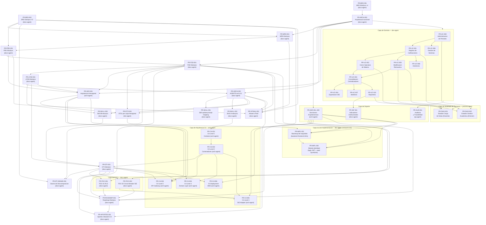

# PROMPT_MAPPING — EduSync

> Catálogo de prompts usados para producir cada artefacto del proyecto EduSync (formato `PR-<AREA>-NNN`).
> IDs: `ARCH` / `BRD` / `MRD` / `PRD` / `FSD` / `LFSD` / `UC` / `ADR` / `AUD` / `INF` / `DIAG` / `SKILL` / `C4` / `DTI` / `HEX` / `DTO` / `POC` / `ROADMAP` / `APORTES` / `VFINAL` / `IMPL`. Versión activa: `v2.3`.
> Cada prompt sigue la estructura de `plantillas/plantillas1/PROMPT_TEMPLATE.md`.
> Archivos individuales en `prompts/PR-*.md`.
> Este documento es la fuente de verdad del ecosistema de prompts del proyecto.
> **Área `IMPL`** (desde `v2.0`): prompts de implementación de la capa viva (`release/3.0.0` en adelante), archivo `docs/prompts/impl/PR-IMPL-NNN.md` (única área que se desvía del directorio raíz `prompts/`, siguiendo `plantillas/plantillas3/FEATURE_DESIGN_DOC_TEMPLATE.md`/`MODELO_DOCUMENTAL_IMPLEMENTACION.md`), trazados a un `FSD-UC` y opcionalmente a un `DD-UC-NNN` en `docs/design/`. Ver `plantillas/plantillas3/MODELO_DOCUMENTAL_IMPLEMENTACION.md` y los skills `feature-design-doc` / `dtp-sync`. Primera entrada desde `v2.1`: `PR-IMPL-001` (bootstrap del esqueleto de código, `DD-UC-001`, `ADR-0011`). Segunda entrada desde `v2.3`: `PR-IMPL-002` (módulo `identidad` — login/JWT, `DD-UC-002`, `ADR-0001`/`ADR-0010`).

---

## Índice de prompts

| ID | Artefacto producido | Tipo | Agente | Modelo | Fecha | Estado | Archivo | Métricas |
|----|---------------------|------|--------|--------|-------|--------|---------|----------|
| PR-ARCH-001 | `docs/arquitectura_funcional_EduSync.md` | generación | `docs-agent` | Sonnet | 14/05/2026 | Aprobado | `prompts/PR-ARCH-001.md` | ~2 500 tk in / ~12 000 tk out \| antes: sin arquitectura funcional formal \| después: `docs/arquitectura_funcional_EduSync.md` (10 UCs, 5 DAs) |
| PR-BRD-001 | `docs/BRD_EduSync.md` | generación | `docs-agent` | Sonnet | 14/05/2026 | Aprobado | `prompts/PR-BRD-001.md` | ~2 000 tk in / ~10 000 tk out \| antes: BRD inexistente \| después: `docs/BRD_EduSync.md` v1.0 |
| PR-UC-001 | Contrato UC-01 · Registro de calificaciones | transformación | `dev-agent` | Sonnet | 14/05/2026 | Aprobado | `prompts/PR-UC-001.md` | ~1 200 tk in / ~3 500 tk out \| antes: UC-01 sin contrato formal \| después: contrato técnico POST /api/v1/calificaciones |
| PR-UC-002 | Contrato UC-02 · Cierre operativo de materia | transformación | `dev-agent` | Sonnet | 14/05/2026 | Aprobado | `prompts/PR-UC-002.md` | ~1 000 tk in / ~3 000 tk out \| antes: UC-02 sin contrato formal \| después: contrato técnico cierre de materia + evento `MateriaCerradaEvent` |
| PR-UC-003 | Contrato UC-03 · Consolidación de centralizadores | transformación | `dev-agent` | Opus | 14/05/2026 | Aprobado | `prompts/PR-UC-003.md` | ~1 500 tk in / ~4 500 tk out \| antes: UC-03 sin contrato formal \| después: contrato motor de consolidación con regla `floor()` |
| PR-UC-004 | Contrato UC-04 · Exportación SIE | transformación | `dev-agent` | Sonnet | 14/05/2026 | Aprobado | `prompts/PR-UC-004.md` | ~1 200 tk in / ~3 800 tk out \| antes: UC-04 sin contrato formal \| después: contrato exportación SIE con idempotencia `rude+periodo_id` |
| PR-UC-005 | Contrato UC-05 · Modificación retroactiva | transformación | `dev-agent` | Opus | 14/05/2026 | Aprobado | `prompts/PR-UC-005.md` | ~1 400 tk in / ~4 200 tk out \| antes: UC-05 sin contrato formal \| después: contrato ventana temporal + modelo append-only |
| PR-UC-009 | Contrato UC-09 · Administración de periodos | transformación | `dev-agent` | Sonnet | 14/05/2026 | Aprobado | `prompts/PR-UC-009.md` | ~1 000 tk in / ~3 200 tk out \| antes: UC-09 sin contrato formal \| después: contrato apertura/cierre de periodo + congelamiento de parámetros |
| PR-ADR-001..005 | `docs/arquitectura_funcional_EduSync.md §DA-01..DA-05` | generación | `arch-agent` | Opus | 14/05/2026 | Aprobado | `prompts/PR-ADR-001.md` … `PR-ADR-005.md` | ~2 000 tk in / ~4 000 tk out c/u \| antes: DAs solo en arquitectura funcional \| después: 5 ADRs formales en `docs/adr/` |
| PR-AUD-001 | Auditoría de trazabilidad y logs (`audit_log`) | auditoría | `qa-agent` | Sonnet | 14/05/2026 | Borrador | `prompts/PR-AUD-001.md` | ~800 tk in / ~2 500 tk out \| antes: auditoría sin prompt formal \| después: contrato de auditoría `audit_log` (borrador) |
| PR-INF-001 | Informe estadístico de indicadores institucionales (UC-10) | extracción | `docs-agent` | Haiku | 14/05/2026 | Borrador | `prompts/PR-INF-001.md` | ~600 tk in / ~2 000 tk out \| antes: UC-10 sin prompt de reportería \| después: contrato de extracción de indicadores (borrador) |
| PR-DIAG-001 | `docs/diagramas/estados.cargarnotas.mmd` + `estados_cargar_notas.md` (flujo del Docente) | generación | `process-agent` | Sonnet | 14/05/2026 | Aprobado | `prompts/PR-DIAG-001.md` | ~900 tk in / ~3 000 tk out \| antes: flujo Docente sin diagrama de estados \| después: `.mmd` + especificación `.md` sincronizados |
| PR-DIAG-002 | `docs/diagramas/estados_administracion.mmd` + `estados_administracion.md` (flujo del Director) | generación | `process-agent` | Sonnet | 14/05/2026 | Aprobado | `prompts/PR-DIAG-002.md` | ~900 tk in / ~3 000 tk out \| antes: flujo Director sin diagrama de estados \| después: `.mmd` + especificación `.md` sincronizados |
| PR-BRD-002 | `docs/BRD_EduSync_V2.md` (BRD consolidado v2.0 — BR-001..BR-012, RB-01..RB-11) | consolidación | `docs-agent` | Sonnet | 14/05/2026 | Aprobado | `prompts/PR-BRD-002.md` | ~2 500 tk in / ~12 000 tk out \| antes: BRD v1 disperso \| después: `docs/BRD_EduSync_v2.md` (BR-001..BR-012) |
| PR-MRD-001 | `docs/MRD-EduSync.md` (MRD v1.0 — 10 MRD-N-*, 3 personas, JTBD, go-to-market) | generación | `docs-agent` | Sonnet | 15/05/2026 | Aprobado | `prompts/PR-MRD-001.md` | ~2 000 tk in / ~10 000 tk out \| antes: MRD inexistente \| después: `docs/mrd/MRD_EduSync.md` (10 necesidades, 3 personas) |
| PR-PRD-001 | `docs/PRD_EduSync.md` (PRD v1.0 — 17 US, 6 épicas, RICE, NFRs, journeys) | generación | `docs-agent` | Sonnet | 15/05/2026 | Aprobado | `prompts/PR-PRD-001.md` | ~2 500 tk in / ~12 000 tk out \| antes: PRD inexistente \| después: `docs/prd/PRD_EduSync.md` (17 US, 6 épicas) |
| PR-FSD-001 | `docs/fsd/FSD_EduSync.md` (FSD Clásico v1.0 — 5 FSD-UC, ER, 3 contratos, 14 tasks) | generación | `docs-agent` | Sonnet | 15/05/2026 | Aprobado | `prompts/PR-FSD-001.md` | ~4 000 tk in / ~18 000 tk out \| antes: FSD inexistente \| después: `docs/fsd/FSD_EduSync.md` (5 FSD-UC, ER, 14 tasks) |
| PR-LFSD-001 | `docs/LFSD-EduSync.md` (LFSD v1.0 — 20 §§, 15 APIs, 14 tablas DDL, 4 diagramas secuencia, 16 tasks) | generación | `docs-agent` | Sonnet | 15/05/2026 | Aprobado | `prompts/PR-LFSD-001.md` | ~5 000 tk in / ~22 000 tk out \| antes: LFSD inexistente \| después: `docs/LFSD-EduSync.md` (20 §§, 14 tablas DDL) |
| PR-ARCH-002 | `docs/AGENTS.md` v0.2 — corrección de 6 rutas rotas, 15 nuevos artefactos, 6 agentes, 4 golden tests | consolidación | `docs-agent` | Sonnet | 17/05/2026 | Aprobado | `prompts/PR-ARCH-002.md` | ~2 000 tk in / ~8 000 tk out \| antes: AGENTS.md v0.1 con rutas rotas \| después: `docs/AGENTS.md` v0.2 (6 agentes, 4 golden tests) |
| PR-SKILL-001 | `.cursor/skills/update-prompt-mapping/SKILL.md` + `.claude/skills/update-prompt-mapping/SKILL.md` — skill para actualizar PROMPT_MAPPING | generación | `docs-agent` | Sonnet | 17/05/2026 | Aprobado | `prompts/PR-SKILL-001.md` | ~800 tk in / ~3 000 tk out \| antes: actualización manual de PROMPT_MAPPING \| después: skill `update-prompt-mapping` (Cursor + Claude) |
| PR-SKILL-002 | `.cursor/skills/c4-edusync/SKILL.md` + `.claude/skills/c4-edusync/SKILL.md` - skill para generar diagramas C4 de EduSync | generacion | `docs-agent` | Sonnet | 17/05/2026 | Aprobado | `prompts/PR-SKILL-002.md` | ~700 tk in / ~2 500 tk out \| antes: diagramas C4 sin skill reutilizable \| después: skill `c4-edusync` (Cursor + Claude) |
| PR-C4-001 | `docs/diagrams/c4_level1.mmd` - C4 Level 1 (Contexto del Sistema) | generacion | `arch-agent` | Sonnet | 17/05/2026 | Aprobado | `prompts/PR-C4-001.md` | ~2 000 tk in / ~4 000 tk out \| antes: sin diagrama C4 L1 \| después: `docs/diagrams/c4_level1.mmd` |
| PR-C4-002 | `docs/diagrams/c4_level2.mmd` - C4 Level 2 (Contenedores) | generacion | `arch-agent` | Sonnet | 17/05/2026 | Aprobado | `prompts/PR-C4-002.md` | ~2 500 tk in / ~5 000 tk out \| antes: sin diagrama C4 L2 \| después: `docs/diagrams/c4_level2.mmd` |
| PR-SKILL-003 | `.cursor/skills/dti-edusync/SKILL.md` + `.claude/skills/dti-edusync/SKILL.md` - skill para poblar y mantener el DTI de EduSync | generacion | `docs-agent` | Sonnet | 17/05/2026 | Aprobado | `prompts/PR-SKILL-003.md` | ~800 tk in / ~3 000 tk out \| antes: DTI sin skill de mantenimiento \| después: skill `dti-edusync` (Cursor + Claude) |
| PR-DTI-001 | `docs/DTI.md` v0.1 - DTI completo (§0-§23, 883 lineas, C4 L1/L2/L3, 2 POCs, 5 ADRs, 16 NFRs, 4 golden tests) | generacion | `docs-agent` | Sonnet | 17/05/2026 | Aprobado | `prompts/PR-DTI-001.md` | ~5 000 tk in / ~20 000 tk out \| antes: DTI inexistente \| después: `docs/DTI.md` v0.1 (883 líneas, §0–§23) |
| PR-HEX-001 | `docs/arquitectura_hexagonal_EduSync.md` v0.1 — Arquitectura hexagonal del core: 20 puertos IN, 16 puertos OUT, 32 adaptadores, 8 Aggregate Roots | generacion | `arch-agent` | Sonnet | 24/05/2026 | Aprobado | `prompts/PR-HEX-001.md` | ~3 500 tk in / ~12 000 tk out \| antes: arquitectura hexagonal sin documentar \| después: `docs/arquitectura_hexagonal_EduSync.md` v0.1 |
| PR-DTO-001 | `docs/dtos_EduSync.md` v0.1 — DTOs por capa hexagonal para FSD-UC-001/003/005: 4 Request DTOs, 4 Commands, 3 Response DTOs, 5 Domain Events, 5 enums, 3 tablas DTO ↔ Entidad | generacion | `dev-agent` | Sonnet | 24/05/2026 | Aprobado | `prompts/PR-DTO-001.md` | ~2 500 tk in / ~8 000 tk out \| antes: DTOs sin diseño formal \| después: `docs/dtos_EduSync.md` v0.1 (445 líneas) |
| PR-DTI-SEAMS-001 | `docs/DTI.md §6.2` — Seams de descomposición para EduSync (calificaciones ↔ consolidacion; exportacion ↔ nucleo) | generacion | `docs-agent` | Sonnet | 28/05/2026 | Aprobado | `prompts/PR-DTI-SEAMS-001.md` | ~2 800 tk in / ~4 500 tk out \| antes: DTI sin analisis T1.8 de seams \| después: `docs/DTI.md` §6.2 + registro de cambios v0.2 |
| PR-POC-001 | `docs/pocs/POC-01-rls-multitenancy/` — estructura documental inicial para POC-01 RLS multitenancy (README, runbook, evidencia) | generacion | `docs-agent` | Sonnet | 28/05/2026 | Aprobado | `prompts/PR-POC-001.md` | ~2 000 tk in / ~5 500 tk out \| antes: POC-01 solo definida en DTI §12.1 \| después: carpeta `docs/pocs/POC-01-rls-multitenancy/` lista para ejecucion |
| PR-POC-002 | `docs/pocs/POC-02-circuit-breaker-sie/` — estructura documental inicial para POC-02 Circuit Breaker SIE (README, runbook, evidencia) | generacion | `docs-agent` | Sonnet | 28/05/2026 | Aprobado | `prompts/PR-POC-002.md` | ~2 000 tk in / ~5 500 tk out \| antes: POC-02 solo definida en DTI §12.2 \| después: carpeta `docs/pocs/POC-02-circuit-breaker-sie/` lista para ejecucion |
| PR-C4-003 | `docs/diagrams/c4_level3_api_gateway.mmd` + `.md` espejo — C4 Level 3 (Componentes) del contenedor `api-gateway`: 10 componentes (filtros, controllers, AOP, DTOs) cubriendo FSD-UC-001/003/004/005/009 | generacion | `arch-agent` | Sonnet | 28/05/2026 | Aprobado | `prompts/PR-C4-003.md` | ~3 200 tk in / ~6 500 tk out \| antes: api-gateway sin Level 3 (skill c4-edusync lo marcaba como Pendiente) \| después: `c4_level3_api_gateway.mmd` (81 lineas) + espejo `.md` con tabla de trazabilidad |
| PR-C4-004 | `docs/diagrams/c4_level3_domain_layer.mmd` + `.md` espejo — C4 Level 3 (Componentes) del contenedor `domain-layer`: puertos IN/OUT, servicios de dominio, aggregates, VOs y eventos; dominio puro sin Spring/JPA | generacion | `arch-agent` | Sonnet | 28/05/2026 | Aprobado | `prompts/PR-C4-004.md` | ~3 000 tk in / ~6 000 tk out \| antes: domain-layer sin Level 3 canónico \| después: `c4_level3_domain_layer.mmd` + espejo `.md` con trazabilidad FSD-UC-001/002/003/004/005/009 |
| PR-C4-005 | `docs/diagrams/c4_level3_sie_adapter.mmd` + `.md` espejo — C4 Level 3 (Componentes) del contenedor `sie-adapter`: SIEHttpClientAdapter, payload RUDE-only, idempotencia, estado por registro, circuit breaker, métricas y WireMock | generacion | `arch-agent` | Sonnet | 28/05/2026 | Aprobado | `prompts/PR-C4-005.md` | ~2 800 tk in / ~5 500 tk out \| antes: sie-adapter sin Level 3 canónico \| después: `c4_level3_sie_adapter.mmd` + espejo `.md` trazado a ADR-0005 y POC-02 |
| PR-C4-006 | `docs/diagrams/deployment_aws.mmd` + `.md` espejo — C4 Deployment AWS: CloudFront/S3, ALB/WAF, ECS Fargate, RDS Multi-AZ, SQS FIFO/DLQ, KMS, Secrets Manager, CloudWatch, CloudTrail y Terraform | generacion | `arch-agent` | Sonnet | 28/05/2026 | Aprobado | `prompts/PR-C4-006.md` | ~2 800 tk in / ~5 000 tk out \| antes: mapeo AWS sólo embebido en DTI §8 \| después: `deployment_aws.mmd` + espejo `.md` para criterio 2 de defensa |
| PR-ROADMAP-001 | `docs/roadmap.md` v0.1 — hoja de ruta técnica y de negocio hacia `release/2.0.0` y siguiente módulo: 4 horizontes, Gantt, lecciones, métricas BRD/NFR, riesgos y compromisos | generacion | `docs-agent` | Sonnet | 28/05/2026 | Aprobado | `prompts/PR-ROADMAP-001.md` | ~3 500 tk in / ~7 500 tk out \| antes: roadmap sólo embebido en DTI §19 \| después: `docs/roadmap.md` (200 líneas) como fuente canónica detallada |
| PR-APORTES-001 | `docs/aportes/release-2.0.0.md` v1.0 — informe de aportes individuales del release de defensa para grupo unipersonal (n = 1): 95 tareas auditables, 11 categorías cubiertas, fórmula `clamp(0.5, 1.1)` con caso degenerado documentado | generacion | `docs-agent` | Sonnet | 28/05/2026 | Aprobado | `prompts/PR-APORTES-001.md` | ~2 800 tk in / ~9 500 tk out \| antes: sin informe de aportes para `release/2.0.0` (bloqueante de rúbrica) \| después: `docs/aportes/release-2.0.0.md` con 95 filas auditables y checklist 5/6 |
| PR-VFINAL-001 | `docs/brd/BRD_EduSync_vFinal.md`, `docs/mrd/MRD_EduSync_vFinal.md`, `docs/prd/PRD_EduSync_vFinal.md`, `docs/fsd/FSD_EduSync_vFinal.md` — aliases congelados para `release/2.0.0` | transformación | `docs-agent` | Sonnet | 28/05/2026 | Aprobado | `prompts/PR-VFINAL-001.md` | ~1 500 tk in / ~5 000 tk out \| antes: BRD/MRD/PRD/FSD sólo como canónicos editables \| después: 4 snapshots `_vFinal.md` con banner de freeze |
| PR-IMPL-001 | `backend/`, `frontend/`, `infra/docker-compose.yml` — esqueleto de código de `release/3.0.0` (monolito modular Spring Modulith, paquete `com.edusync`, Angular 21) | generación | `dev-agent` | Sonnet | 14/07/2026 | Aprobado (prompt) | `docs/prompts/impl/PR-IMPL-001.md` | ~2 200 tk in / ~6 000 tk out (estimado) \| antes: `src/` vacío, sin esqueleto de código \| después: primera fila del área `IMPL`; ejecución del prompt (generación real de código) pendiente |
| PR-IMPL-002 | `backend/src/main/java/com/edusync/identidad/**` — módulo `identidad` (login JWT, seed `SYSADMIN`, `TenantContextProvider` real) | generación | `dev-agent` | Sonnet | 14/07/2026 | Aprobado (prompt) | `docs/prompts/impl/PR-IMPL-002.md` | ~2 400 tk in / ~6 500 tk out (estimado) \| antes: módulo `identidad` vacío (solo `package-info.java`) \| después: segunda fila del área `IMPL`; ejecución del prompt (generación real de código) pendiente |

---

## Flujo general de información entre prompts



---

## Matriz de responsabilidades por agente

| Agente | Prompts asignados | Responsabilidad principal | Artefactos generados |
|--------|-------------------|--------------------------|----------------------|
| `docs-agent` | PR-ARCH-001, PR-ARCH-002, PR-BRD-001, PR-BRD-002, PR-MRD-001, PR-PRD-001, PR-FSD-001, PR-LFSD-001, PR-SKILL-001, PR-SKILL-002, PR-SKILL-003, PR-DTI-001, PR-DTI-SEAMS-001, PR-POC-001, PR-POC-002, PR-ROADMAP-001, PR-APORTES-001, PR-VFINAL-001, PR-INF-001 | Producir y mantener toda la cadena documental del proyecto (BRD → MRD → PRD → FSD → LFSD → AGENTS.md → Skills → POCs → roadmap → aportes → aliases vFinal); versionar y consolidar ante nuevos artefactos funcionales, de bajo nivel, configuración de agentes, evidencia de pruebas de concepto, hoja de ruta de release, informe de aportes individuales y snapshots congelados de entrega | `.md` en `docs/`, `docs/fsd/`; LFSD en `docs/LFSD-EduSync.md`; Skills en `.cursor/skills/` y `.claude/skills/`; DTI y analisis de seams en `docs/DTI.md`; POCs en `docs/pocs/`; roadmap canónico en `docs/roadmap.md`; aportes por release en `docs/aportes/release-<x.y.z>.md`; aliases `_vFinal.md` en `docs/brd/`, `docs/mrd/`, `docs/prd/`, `docs/fsd/` |
| `dev-agent` | PR-UC-001..UC-010, PR-DTO-001, PR-IMPL-001, PR-IMPL-002 | Generar contratos de UC, DTOs por capa hexagonal, código de dominio y pruebas unitarias; desde `release/3.0.0`, materializar los `DD-UC-NNN` de `docs/design/` como código real (esqueleto de proyecto, features) vía prompts `PR-IMPL-NNN` | Código en `backend/`, `frontend/`, `infra/`; contratos en `docs/prompts/impl/` (área `IMPL`) y `prompts/` (resto de áreas); DTOs en `docs/dtos_EduSync.md` |
| `arch-agent` | PR-ADR-001..005, PR-C4-001, PR-C4-002, PR-C4-003, PR-C4-004, PR-C4-005, PR-C4-006, PR-HEX-001 | Evaluar alternativas, diseñar arquitectura hexagonal y documentar decisiones arquitectónicas | ADRs en `docs/adr/`; diagramas C4 (Levels 1/2/3 + Deployment AWS) en `docs/diagrams/` con `.md` espejo (IG-09); arquitectura hexagonal en `docs/arquitectura_hexagonal_EduSync.md` |
| `qa-agent` | PR-AUD-001 | Verificar invariantes, trazabilidad y cobertura de pruebas | Reportes en `docs/qa/` |
| `process-agent` | PR-DIAG-001, PR-DIAG-002 | Modelar workflows y diagramas de estado de actores institucionales (Docente, Director) garantizando consistencia con UCs | Diagramas `.mmd` y especificaciones `.md` en `docs/diagramas/` |

---

## Prompts

---

### PR-ARCH-001 — Generación de arquitectura funcional del core EduSync

```markdown
# Role
Eres un Senior Solution Architect especializado en plataformas SaaS multitenant
para el sector educativo latinoamericano, con dominio de Java 21, Spring Boot 3,
PostgreSQL y normativa del Ministerio de Educacion de Bolivia (SIE).

# Task
Diseña la arquitectura funcional del core de EduSync cubriendo los 10 procesos
criticos de registro de calificaciones y gestion academica centralizada,
asegurando escalabilidad para multiples unidades educativas (tenants).

# Context
- Producto: EduSync — plataforma SaaS B2B multitenant para Bolivia.
- Problema central: triple digitacion manual (Excel → Excel → SIE) que obliga
  al personal a trabajar de madrugada bajo riesgo de sanciones ministeriales.
- Stack autoritativo: Java 21, Spring Boot 3.3, PostgreSQL 15, Angular 17, AWS.
- Restricciones: aislamiento multitenant (tenant_id + RLS), RBAC estricto por rol
  (DIRECTOR / SECRETARIA / DOCENTE), identificacion de estudiantes solo por RUDE.
- Stakeholders UX: Marcela (Docente), Wendy (Secretaria), Jeanneth (Directora).
- Entradas esperadas: vision de negocio (01_vision_negocio.md), BRD_EduSync.md.

# Reasoning
1. Mapear los flujos principales a 10 UCs criticos (UC-01..UC-10).
2. Por cada UC: definir Actores, Entradas, Invariantes de negocio, Salidas.
3. Identificar 5 decisiones arquitectonicas (DA-01..DA-05).
4. Establecer trazabilidad entre necesidades UX y componentes del sistema.
5. Verificar que ningun UC proponga implementacion, codigo o esquema de tablas.

# Stop condition
Detente al cubrir los 10 UCs y listar las 5 DAs con justificacion tecnica.
No propongas codigo, esquemas de tablas ni mapeos a servidores AWS.

# Output
Markdown con tres secciones:
1. "Encuadre del Core EduSync" (1 parrafo).
2. "Diez casos de uso criticos" (tablas Actores/Entradas/Invariantes/Salidas).
3. "Cinco decisiones arquitectonicas" (justificacion DA-01..DA-05).

# Invariants
- Ningun UC puede proponer codigo de implementacion.
- El RUDE es la unica clave de identificacion de estudiantes.
- Toda invariante de negocio debe ser verificable sin acceder al codigo.

# Failure modes
- E_MISSING_CONTEXT: falta vision_negocio.md o BRD — STOP, solicitar el artefacto.
- E_CODE_PROPOSED: el output contiene fragmentos de codigo — rechazar y regenerar.
- E_UC_INCOMPLETO: algun UC no tiene los 4 campos — STOP, completar antes de entregar.
```

---

### PR-BRD-001 — Generación del BRD EduSync

```markdown
# Role
Eres un Product Strategist Senior con experiencia en EdTech GovTech para
mercados emergentes latinoamericanos y conocimiento de normativa educativa
boliviana (Ley 070 Avelino Siñani).

# Task
Genera docs/BRD_EduSync.md siguiendo plantillas/BRD_TEMPLATE.md documentando
el problema de la triple digitacion manual, el modelo de negocio SaaS B2B
multitenancy y los requerimientos de negocio priorizados con MoSCoW.

# Context
- Insumo primario: 01_vision_negocio.md (problema, oportunidad, stakeholders).
- Entrevistas UX realizadas con: Marcela (Docente), Wendy (Secretaria),
  Jeanneth (Directora). Sus dolores son la fuente de los BR-NNN.
- Mercado objetivo: unidades educativas de Bolivia (privadas y de convenio).
- Modelo de ingresos: SaaS B2B por unidad educativa (tenant).
- Restriccion legal: cumplimiento con formato de exportacion al SIE del
  Ministerio de Educacion de Bolivia.

# Reasoning
1. Redactar el problema central con evidencia cuantitativa (horas perdidas,
   riesgo de multas, errores de digitacion detectados en los Excel reales).
2. Definir >=6 BR-NNN priorizados MoSCoW con criterio de aceptacion.
3. Documentar el modelo de negocio (BMC: segmentos, propuesta de valor, canales).
4. Declarar KPIs del producto: tiempo de cierre administrativo, tasa de error SIE.
5. Establecer RACI con Director, Secretaria, Docente, Dev (Rodrigo Aspeti).

# Stop condition
Detente cuando el BRD tenga: >=6 BR-NNN, BMC de 9 bloques, KPIs, RACI y
seccion de trazabilidad BR → UC completada.

# Output
Markdown completo segun BRD_TEMPLATE.md con encabezado de metadatos,
todas las secciones completadas y tabla de trazabilidad BR → UC al final.

# Invariants
- Todo BR-NNN debe tener criterio de aceptacion verificable.
- El RUDE debe aparecer como restriccion critica en al menos un BR.
- No proponer arquitectura tecnica en el BRD (pertenece al FSD/DTI).

# Failure modes
- E_MISSING_UX: si falta contexto de al menos 2 stakeholders — STOP.
- E_BR_SIN_CRITERIO: BR-NNN sin criterio de aceptacion — rechazar output.
- E_ARQUITECTURA_EN_BRD: si el output propone stack tecnico — rechazar y limpiar.
```

---

### PR-BRD-002 — Generación del BRD EduSync V2 (consolidado)

```markdown
# Role
Eres un Senior Business Analyst (BA), Product Owner y Enterprise Solution Architect
con experiencia en levantamiento de requerimientos, analisis funcional y documentacion
corporativa para sistemas SaaS B2B en el sector educativo latinoamericano.

# Task
Genera docs/BRD_EduSync_V2.md siguiendo plantillas/BRD_TEMPLATE.md, consolidando
los requerimientos del v1 (BR-001..BR-005) con los requerimientos derivados de la
arquitectura funcional (10 UCs, 5 DAs), los diagramas de estado del Docente
(estados_cargar_notas.md, 18 estados) y del Director (estados_administracion.md, 23 estados).

# Context
- Insumos primarios:
  * docs/BRD_EduSync_V1.md (BR-001..BR-005 a conservar y enriquecer).
  * docs/arquitectura_funcional_EduSync.md (UC-01..UC-10, DA-01..DA-05).
  * 01_vision_negocio.md (problema, stakeholders, evidencia UX de campo).
  * docs/diagramas/estados_cargar_notas.md (18 estados del Docente).
  * docs/diagramas/estados_administracion.md (23 estados del Director).
- Requerimientos nuevos a derivar del analisis funcional:
  * Apertura secuencial de periodos trimestrales (UC-09 invariante, RB-05).
  * Parametros academicos inmutables post-apertura (DA-02, RB-06).
  * Habilitacion de accesos docente-materia como prerequisito de apertura (UC-09, BR-008).
  * Ventana temporal de modificacion retroactiva 1-72h (UC-05, RB-07).
  * Dashboard con separacion estricta de indicadores trimestral/anual (UC-10, RB-11).
  * Log de auditoria inalterable para toda operacion de escritura (DA-03, BR-011).
  * Generacion de boletines PDF desde centralizador en estado CERRADO (UC-07, BR-012).
- Evidencia de Discovery: entrevistas con Marcela (Docente), Wendy (Secretaria),
  Jeanneth (Directora); analisis de Excel reales (Centralizador2A_ColegioAbaroa.xlsx,
  REGISTRO SECUNDARIA 2026.xlsx): desfase de listas, decimales inconsistentes (floor).
- Restriccion de formato: BRD_TEMPLATE.md obligatorio; >=3 elementos por bloque BMC;
  >=12 BR-NNN con MoSCoW y criterio de aceptacion; >=11 RB-NNN con tipo y origen;
  >=5 KPIs con linea base y meta; >=5 BO-NNN SMART; RACI de 6 stakeholders;
  trazabilidad BR -> UC/DA/artefacto; PR-FAQ Amazon-style en seccion 21.

# Reasoning
1. Leer y relacionar todos los artefactos fuente antes de escribir cualquier seccion.
2. Identificar requerimientos explicitos e implicitos de los diagramas de estado
   (estados sin equivalente en v1 del BRD revelan invariantes de negocio nuevas).
3. Detectar inconsistencias entre documentos fuente (ej. parametros de UC-09 ausentes
   en BR-NNN del v1; apertura secuencial de periodos sin BR correspondiente).
4. Conservar y enriquecer BR-001..BR-005 del v1; agregar BR-006..BR-012 derivados.
5. Documentar 11 reglas de negocio RB-01..RB-11 con tipo (politica/normativa) y origen.
6. Construir 3 personas completas: Docente/Marcela, Secretaria/Wendy, Director/Jeanneth.
7. Generar BMC de 9 bloques con >=3 elementos concretos cada uno.
8. Generar tabla de trazabilidad BR -> UC/DA/artefacto para cada BR-NNN.
9. Incluir PR-FAQ con Press Release en futuro fingido, External FAQ e Internal FAQ.

# Stop condition
Detente cuando el BRD tenga: metadatos con version v2.0, 12 BR-NNN con MoSCoW y
criterio de aceptacion verificable, 11 RB-NNN con tipo y origen, BMC de 9 bloques
(>=3 elementos cada uno), 5 KPIs con linea base y meta, 5 BO-NNN SMART, RACI de
6 stakeholders, trazabilidad BR -> UC completa, 6 riesgos con mitigacion y
PR-FAQ en seccion 21. No proponer arquitectura tecnica ni codigo de implementacion.

# Output
Markdown completo segun BRD_TEMPLATE.md (secciones 0-21) guardado en
docs/BRD_EduSync_V2.md, listo para revision por stakeholders tecnicos y de negocio.

# Invariants
- Todo BR-NNN debe tener criterio de aceptacion verificable y metrica asociada.
- El RUDE debe aparecer como restriccion critica en BR-004 y en RB-01.
- El criterio floor debe documentarse en BR-003 y RB-08.
- La ventana temporal 1-72h de UC-05 debe aparecer en BR-009 y RB-07.
- Los indicadores anuales con 3 trimestres cerrados deben referirse en BR-010 y RB-11.
- Los BR del v1 (BR-001..BR-005) deben conservarse y enriquecerse, nunca eliminarse.
- Ningun BR puede proponer implementacion tecnica (pertenece al FSD/DTI).
- El log de auditoria inalterable debe estar documentado en BR-011 y RB-10.

# Failure modes
- E_MISSING_SOURCE: falta algun artefacto fuente (v1, arq.funcional, estados) -- STOP,
  no generar output parcial; solicitar el artefacto faltante.
- E_BR_SIN_METRICA: BR-NNN sin criterio de aceptacion verificable -- completar antes
  de entregar; no emitir output incompleto.
- E_ARQUITECTURA_EN_SPECS: el output contiene codigo o esquemas de tablas -- rechazar
  y regenerar eliminando todo contenido tecnico de implementacion.
- E_INCONSISTENCIA_V1: algun BR del v1 fue eliminado en lugar de enriquecido --
  restaurar y re-emitir output completo.
- E_BMC_INCOMPLETO: algun bloque del BMC tiene menos de 3 elementos -- completar
  antes de considerar el output valido para entrega.
```

---

### PR-MRD-001 — Generación del MRD EduSync

```markdown
# Role
Eres un experto en Product Management, Business Analysis y documentación de
productos digitales con experiencia en Product Discovery, Lean Product, Agile
y documentación técnica empresarial para mercados latinoamericanos.

# Task
Genera docs/MRD-EduSync.md siguiendo plantillas/MRD_TEMPLATE.md, describiendo
el mercado, usuarios y oportunidad comercial que justifican EduSync.
El documento debe responder: "¿qué pide el mercado boliviano de gestión académica
y por qué EduSync ganará?"

# Context
- Insumos: docs/BRD_EduSync_V2.md (BR-001..BR-012), docs/arquitectura_funcional_EduSync.md,
  01_vision_negocio.md, entrevistas UX con Marcela (Docente), Wendy (Secretaría),
  Jeanneth (Directora); análisis de Excel reales (desfase de listas, decimales).
- Mercado objetivo: unidades educativas privadas y de convenio de Bolivia (~4 000).
- Competidores identificados: Excel+SIE manual, Academium, Colegio360,
  Google Sheets, sistema SIE gubernamental.
- Modelo de negocio: SaaS B2B con Setup Fee Bs 200 + suscripción anual por estudiante.
- Restricción: respetar exactamente la estructura de MRD_TEMPLATE.md.

# Reasoning
1. Calcular TAM/SAM/SOM con fuentes y notas de asunción explícitas.
2. Construir 3 personas completas (Wendy/Marcela/Jeanneth) con JTBD y dolores.
3. Documentar >=8 JTBD alineados a los 10 UCs de la arquitectura funcional.
4. Generar tabla competitiva con >=5 alternativas y criterios de comparación.
5. Construir Positioning Statement: "Para X que Y, nuestro Z es...".
6. Diseñar pricing en tiers (Setup + Básico/Estándar/Premium) con benchmarks.
7. Definir go-to-market: 5 canales, 3 fases de lanzamiento, funnel AARRR.
8. Documentar 10 MRD-N-* priorizados con MoSCoW y justificación de mercado.
9. Declarar >=8 hipótesis con método de validación y criterio de éxito.
10. Completar tabla de trazabilidad MRD-N -> BR -> UC/DA.

# Stop condition
Detente cuando el MRD tenga: TAM/SAM/SOM, 3 personas, 8 JTBD, 5 competidores,
positioning statement, pricing con tiers, go-to-market, 10 MRD-N-*, 8 hipótesis,
trazabilidad completa y checklist verificado. Sin placeholders vacíos.

# Output
Markdown completo según MRD_TEMPLATE.md (secciones 0-16 + checklist) guardado en
docs/MRD-EduSync.md, listo para revisión por stakeholders de negocio y producto.

# Invariants
- Todo MRD-N-* debe tener prioridad MoSCoW y justificación de mercado verificable.
- El TAM/SAM/SOM debe tener fuente o nota de asunción explícita.
- Los supuestos de precio y competencia deben marcarse con "(assumption)".
- El positioning statement debe referir a un competidor concreto, no genérico.

# Failure modes
- E_TEMPLATE_VIOLADO: estructura distinta a MRD_TEMPLATE.md — rechazar y regenerar.
- E_PLACEHOLDER_VACIO: sección con marcadores sin completar — completar.
- E_TAM_SIN_FUENTE: TAM/SAM/SOM sin fuente ni nota de asunción — agregar.
- E_COMPETIDOR_GENERICO: positioning sin competidor concreto — especificar.
```

---

### PR-PRD-001 — Generación del PRD EduSync

```markdown
# Role
Eres un experto en Product Management, Product Discovery, Business Analysis y
definición de requerimientos funcionales para productos SaaS empresariales.
Tienes experiencia creando PRDs con Agile, Lean Product e INVEST.

# Task
Genera docs/PRD_EduSync.md siguiendo plantillas/PRD_TEMPLATE.md, describiendo
QUE debe hacer EduSync para cumplir los requerimientos del MRD v1.0 y BRD v2.0.
El documento debe ser accionable para desarrollo, diseño y QA.

# Context
- Insumos: docs/MRD-EduSync.md (10 MRD-N-*), docs/BRD_EduSync_V2.md (12 BR-NNN),
  docs/arquitectura_funcional_EduSync.md (10 UCs, 5 DAs),
  docs/diagramas/estados_cargar_notas.md (18 estados Docente),
  docs/diagramas/estados_administracion.md (23 estados Director).
- Constitution del producto (5 principios no negociables): Zero-Training, RUDE
  como única clave de identidad, inmutabilidad post-cierre, sin PII en logs, RLS multitenant.
- Personas: Wendy (Secretaría), Marcela (Docente), Jeanneth (Director).
- Restriccion: >=15 US INVEST con Gherkin, RICE top-10, >=2 journeys Mermaid.

# Reasoning
1. Derivar 6 épicas de los 10 UCs de la arquitectura funcional.
2. Generar >=17 user stories con formato INVEST.
3. Documentar criterios de aceptación Gherkin (Given/When/Then) por US.
4. Construir tabla RICE: Reach, Impact, Confidence, Effort para top-10 historias.
5. Generar 3 user journeys Mermaid (Wendy/Marcela/Jeanneth).
6. Documentar 20 PRD-REQ-* funcionales y 15 PRD-NFR-* con umbrales.
7. Definir roadmap de versiones v1.0->v2.0 y Discovery track con 6 hipótesis.
8. Completar trazabilidad PRD-REQ -> BR -> MRD-N -> UC/DA -> FSD.

# Stop condition
Detente cuando el PRD tenga: constitution, 17 US con Gherkin, RICE top-10, 3 journeys,
20 PRD-REQ-*, 15 NFRs, roadmap, Discovery track, trazabilidad y checklist completos.

# Output
Markdown completo según PRD_TEMPLATE.md (secciones 0-16 + checklist) guardado en
docs/PRD_EduSync.md, listo para planificación Agile y estimación técnica.

# Invariants
- Toda US debe cumplir INVEST: Independent, Negotiable, Valuable, Estimable, Small, Testable.
- Cada criterio Gherkin debe ser verificable sin ambigüedad.
- RICE Score: (Reach x Impact x Confidence) / Effort.
- Las invariantes del BRD (RUDE, floor, ventana temporal) deben aparecer en Gherkin.

# Failure modes
- E_US_NO_INVEST: historia sin criterio de aceptación o ambigua — rechazar.
- E_GHERKIN_AMBIGUO: criterio no verificable por QA — reescribir con datos concretos.
- E_RICE_INCOMPLETO: tabla RICE con menos de 10 historias — completar.
- E_TRAZABILIDAD_ROTA: PRD-REQ sin BR ni MRD-N correspondiente — agregar enlace.
```

---

### PR-FSD-001 — Generación del FSD EduSync (modo FSD Clásico)

```markdown
# Role
Eres un experto en Functional Analysis, Software Architecture y System Design.
Generas documentos FSD técnicamente precisos, implementables y verificables
para sistemas Java 21 / Spring Boot 3 con arquitectura hexagonal.

# Task
Genera docs/fsd/FSD_EduSync.md siguiendo plantillas/FSD_TEMPLATE.md en modo
FSD Clásico, especificando QUE hace EduSync con nivel técnico suficiente para
que desarrollo, QA y arquitectura puedan implementar y verificar.

# Context
- Insumos: docs/PRD_EduSync.md (20 PRD-REQ-*, 15 NFRs), docs/BRD_EduSync_V2.md,
  docs/MRD-EduSync.md, docs/arquitectura_funcional_EduSync.md (10 UCs, 5 DAs).
- Stack: Java 21, Spring Boot 3.3, Spring Security 6 (JWT+RBAC), Spring Data JPA,
  PostgreSQL 15 (RLS), Angular 17, AWS.
- Arquitectura: hexagonal (Domain / Application / Infrastructure).
- Entidades críticas: Calificacion, Centralizador, ExportacionSIE, AuditLog,
  AutorizacionCorreccion, ParametroAcademico, GestionAcademica, Periodo.
- Invariantes absolutas: floor() único truncado, RUDE única clave de identidad,
  audit_log inalterable (sin UPDATE/DELETE), RLS activo en todas las tablas.

# Reasoning
1. Documentar 5 FSD-UC críticos (UC-001, UC-003, UC-004, UC-005, UC-009) con:
   flujo principal, flujos alternativos, precondiciones, postcondiciones,
   datos de entrada/salida, reglas de negocio y criterios Gherkin.
2. Documentar 12 reglas de negocio BR-001..BR-012 con tipo y origen.
3. Generar diagrama ER Mermaid con 16 entidades y relaciones completas.
4. Completar diccionario de datos con tipo, validaciones y origen por atributo.
5. Generar 3 prompt-contratos (UC-001, UC-003, UC-005) con 6 elementos.
6. Descomponer en 14 Tasks ejecutables (Spec Kit) con dependencias.
7. Documentar 16 NFRs con métrica, umbral y método de verificación.
8. Completar trazabilidad MRD->PRD->FSD->NFR->prueba de aceptación.

# Stop condition
Detente cuando el FSD tenga: 5 FSD-UC con Gherkin, 12 BR-NNN, ER con 16 entidades,
diccionario completo, 3 prompt-contratos, 14 tasks, 16 NFRs, trazabilidad completa,
plan de pruebas, glosario y checklist FSD Clásico verificado. Sin placeholders.

# Output
Markdown completo según FSD_TEMPLATE.md en modo FSD Clásico (secciones 0-15 + checklist)
guardado en docs/fsd/FSD_EduSync.md, listo para implementación y QA testing.

# Invariants
- El cálculo de floor() y la conversión SIE solo ocurren en la capa de dominio.
- El audit_log se escribe en la misma transacción que el INSERT/UPDATE de la entidad.
- Toda tabla nueva debe tener tenant_id y política RLS antes de llegar a main.
- El modelo append-only en UC-005 es innegociable: el original NUNCA se sobreescribe.

# Failure modes
- E_CALCULO_FUERA_DOMINIO: promedio o floor en adaptador/SQL/frontend — rechazar PR.
- E_AUDIT_LOG_OMITIDO: operación de escritura sin entrada en audit_log — rechazar PR.
- E_RLS_FALTANTE: nueva tabla sin tenant_id o sin política RLS — rechazar migración.
- E_APPEND_ONLY_VIOLADO: modificación que sobreescribe registro original — rechazar.
- E_PLACEHOLDER_VACIO: sección del FSD con marcadores sin completar — completar.
```

---

### PR-LFSD-001 — Generación del LFSD EduSync (Low-Level Functional Specification)

```markdown
# Role
Eres un experto en Software Engineering, Solution Design, Low-Level Design y
documentación técnica detallada para sistemas empresariales Java/Spring Boot.
Tienes experiencia creando LFSD que trasladan especificaciones funcionales a
diseño de bajo nivel implementable, con arquitectura hexagonal, DDD y SOLID.

# Task
Genera docs/LFSD-EduSync.md traduciendo los requerimientos del FSD v1.0
a especificaciones técnicas de bajo nivel listas para implementación y QA.
El documento debe cubrir: arquitectura de componentes, diseño de módulos,
contratos API, DTOs, entidades JPA, DDL, workflows (secuencia), eventos,
seguridad, auditoría, schedulers, manejo de errores y edge cases.

# Context
- Insumo principal: docs/fsd/FSD_EduSync.md (5 FSD-UC, 12 BR, 16 entidades, 16 NFRs).
- Insumo funcional: docs/PRD_EduSync.md (20 PRD-REQ-*, 15 NFRs).
- Contexto de negocio: docs/BRD_EduSync_V2.md, docs/MRD_EduSync.md.
- Arquitectura base: hexagonal (Domain / Application / Infrastructure).
- Stack: Java 21 LTS, Spring Boot 3.3, Spring Security 6 (JWT+RBAC),
  Spring Data JPA, PostgreSQL 15 (RLS), Angular 17, AWS.
- Invariantes absolutas del código:
    * floor() es la UNICA función de truncado (BR-003).
    * audit_log inalterable: sin UPDATE ni DELETE.
    * tenant_id en toda tabla + política RLS activa.
    * Cálculos de promedio SOLO en ConsolidacionDomainService (BR-008).
    * Modelo append-only en UC-005: original NUNCA sobreescrito.
- Ruta de salida: docs/LFSD-EduSync.md.

# Reasoning
1. Mapear la arquitectura hexagonal en estructura de paquetes Java
   (domain/, application/, infrastructure/) con responsabilidades por capa.
2. Diseñar clases para 5 módulos críticos (Calificaciones, Consolidación,
   Exportación SIE, Corrección Retroactiva, Gestión Académica) con
   diagramas de clases Mermaid y pseudoalgoritmos línea a línea.
3. Definir 15+ contratos API REST con request/response JSON completos,
   validaciones Bean Validation y tabla de errores por endpoint.
4. Documentar entidades JPA con anotaciones, índices y constraints.
5. Generar DDL lógico completo (14 tablas) con políticas RLS e inyección de tenant.
6. Crear 4 diagramas de secuencia Mermaid (UC-001, UC-002/003, UC-004, UC-005)
   con todos los participantes y transacciones.
7. Definir el sistema de eventos de dominio (Spring Events) con
   @TransactionalEventListener(AFTER_COMMIT) y pool de threads.
8. Diseñar Spring Security 6: JwtAuthFilter, RBAC por endpoint, TenantContext.
9. Documentar AuditLogAspect (AOP) con invariantes de misma transacción.
10. Definir schedulers: VentanaExpiracionScheduler (60s) + SIERetryScheduler (5min).
11. Diseñar GlobalExceptionHandler con jerarquía de excepciones de dominio.
12. Documentar 7+ edge cases con comportamiento esperado e implementación.
13. Listar restricciones técnicas innegociables con enforcement en CI/ArchUnit.
14. Generar 16 tasks técnicas con componentes, dependencias y estimaciones.

# Stop condition
Detente cuando el LFSD tenga: estructura de paquetes Java, 5 diagramas de clases,
15+ APIs con contratos completos, 4 diagramas de secuencia, entidades JPA,
DDL con 14 tablas y RLS, eventos de dominio, seguridad Spring Security 6,
AOP de auditoría, 2 schedulers, GlobalExceptionHandler, 7 edge cases,
16 tasks, glosario técnico y checklist verificado. Sin placeholders vacíos.

# Output
Markdown completo (20 secciones §0–§20 + checklist) guardado en
docs/LFSD-EduSync.md, listo para implementación, code review y QA técnico.

# Invariants
- Ningún cálculo de promedio puede aparecer fuera de ConsolidacionDomainService.
- Todo endpoint DOCENTE debe tener verificación de asignación antes de persistir.
- El audit_log se escribe en la misma transacción que la operación principal.
- Toda tabla del DDL debe tener tenant_id + política RLS declarada.
- Los diagramas Mermaid deben usar nombres reales del dominio (no genéricos).

# Failure modes
- E_DOMINIO_SIN_PSEUDOCODIGO: módulo crítico sin pseudoalgoritmo detallado — completar.
- E_API_SIN_ERRORES: endpoint sin tabla de códigos HTTP y error codes — agregar.
- E_DDL_SIN_RLS: tabla en DDL sin política RLS — agregar antes de entregar.
- E_DIAGRAMA_GENERICO: diagrama con nombres ficticios o genéricos — reemplazar con dominio real.
- E_PLACEHOLDER_VACIO: sección con marcadores sin completar — completar.
```

---

### PR-UC-001 — Contrato de UC-01: Registro de calificaciones

```markdown
# Role
Eres un Senior Backend Engineer especializado en Java 21, Spring Boot 3 y
sistemas academicos con RBAC estricto para entornos multitenant.

# Task
Genera el contrato tecnico del endpoint POST /api/v1/calificaciones para
el caso de uso UC-01 (Registro descentralizado de calificaciones por dimension),
incluyendo schema de request/response, validaciones, invariantes y pruebas.

# Context
- Fuente: arquitectura_funcional_EduSync.md §UC-01.
- Actores: Docente (JWT con rol DOCENTE).
- Dimensiones activas: Ser / Saber / Hacer / Decidir (+ Autoevaluacion parametrica).
- Tipo de nota: REGULAR o AYUDA (regla de combinacion parametrica por tenant+periodo).
- Escala de ingreso: 0–100 (cruda). La conversion a escala SIE es exclusiva de UC-03.
- Restricciones:
  * BR-RUDE: identificacion de estudiante solo por codigo RUDE.
  * BR-RBAC: el docente solo escribe en sus materias asignadas.
  * BR-PERIODO: solo se acepta si el periodo esta en estado ABIERTO.
  * BR-RANGO: el valor debe estar dentro del rango parametrico de la dimension.
- Stack: Java 21, Spring Boot 3.3, Spring Security (JWT), Spring Data JPA.

# Reasoning
1. Definir el schema JSON del request (RUDE, materia_id, periodo_id, dimension,
   tipo_nota, valor, indice_evaluacion).
2. Especificar las validaciones en orden: autenticacion JWT → RBAC → estado
   del periodo → rango parametrico → persistencia.
3. Definir el schema de response exitoso (201) y de errores (400, 403, 409).
4. Declarar las entradas en el audit_log generadas por cada llamada exitosa.
5. Verificar que la conversion de escala NO ocurre en este endpoint.

# Stop condition
Detente cuando el contrato tenga: schema request, schema response, 3 codigos
de error con descripcion, invariantes verificables y 3 casos de prueba.

# Output
Markdown con: schema OpenAPI simplificado, tabla de validaciones en orden,
tabla de codigos de respuesta y 3 casos de prueba (feliz, borde, adversarial).

# Invariants
- El campo valor debe rechazarse si excede el rango parametrico del periodo.
- El campo RUDE es obligatorio; no se acepta nombre ni numero de lista.
- El response exitoso debe incluir el promedio provisional recalculado del estudiante.
- Toda llamada exitosa genera una entrada en audit_log (inmutable).
- La conversion de escala SIE no ocurre en este endpoint.

# Failure modes
- E_PERIODO_NO_MODIFICABLE: periodo CERRADO o SOLO_LECTURA — HTTP 409.
- E_RBAC_VIOLATION: docente sin asignacion en la materia — HTTP 403.
- E_NOTA_FUERA_DE_RANGO: valor fuera del rango parametrico — HTTP 400.
- E_RUDE_INVALIDO: RUDE nulo, vacio o con formato incorrecto — HTTP 400.
- E_MISSING_CONTEXT: falta periodo_id o materia_id en el request — HTTP 400.
```

---

### PR-UC-002 — Contrato de UC-02: Cierre operativo de materia

```markdown
# Role
Eres un Senior Backend Engineer especializado en transacciones atomicas,
consistencia eventual y gestion de estados en Spring Boot 3 con PostgreSQL.

# Task
Genera el contrato tecnico del endpoint POST /api/v1/materias/{id}/cierre
para UC-02 (Cierre operativo de materia), incluyendo la logica de verificacion
de completitud, la transicion de estado a SOLO_LECTURA y el disparo del evento
de consolidacion (UC-03).

# Context
- Fuente: arquitectura_funcional_EduSync.md §UC-02.
- El cierre es ATOMICO: no existe cierre parcial.
- Completitud se verifica contra el conjunto de evaluaciones declaradas por el
  propio docente (no contra un numero fijo).
- Post-cierre: la materia transiciona a SOLO_LECTURA de forma irreversible.
- El docente no puede agregar evaluaciones nuevas despues de solicitar el cierre.
- Al cerrar la ultima materia del curso: se dispara MateriaCarradaEvent (UC-03).
- Stack: Java 21, Spring Boot 3, Spring Events, Spring Data JPA.

# Reasoning
1. Definir el schema de request (materia_id, periodo_id, confirmacion_docente).
2. Especificar la secuencia de verificacion: RBAC → estado periodo → completitud
   (todos los estudiantes con todas sus evaluaciones declaradas completadas).
3. Definir la transicion de estado: ABIERTO → CERRADO → SOLO_LECTURA.
4. Declarar el evento de dominio MateriaCarradaEvent y sus consumidores.
5. Definir los schemas de response (200 OK, errores 400/403/409).

# Stop condition
Detente cuando el contrato cubra: verificacion de completitud, transicion de
estado, disparo del evento de dominio y 3 casos de prueba.

# Output
Markdown con schema de request/response, diagrama de secuencia simplificado
(texto), tabla de estados de la materia y 3 casos de prueba.

# Invariants
- No se puede cerrar si existe un estudiante con evaluacion declarada sin nota.
- El cierre es irreversible sin intervencion del Director (UC-05).
- El evento MateriaCarradaEvent solo se dispara si el cierre fue exitoso.
- El docente que cierra no puede ser diferente del docente asignado (RBAC).

# Failure modes
- E_COMPLETITUD_FALLIDA: al menos 1 evaluacion sin nota — HTTP 409 con lista
  de estudiantes y dimensiones faltantes.
- E_MATERIA_YA_CERRADA: la materia ya esta en SOLO_LECTURA — HTTP 409.
- E_RBAC_VIOLATION: docente no asignado a esta materia — HTTP 403.
```

---

### PR-UC-003 — Contrato de UC-03: Consolidación algorítmica de centralizadores

```markdown
# Role
Eres un Senior Data Engineer especializado en motores de calculo academico,
algoritmos de truncado y arquitecturas de calculo en tiempo real con
Spring Boot 3, Spring Events y PostgreSQL.

# Task
Genera el contrato tecnico del motor de consolidacion de centralizadores
(UC-03), diferenciando el modo PROVISIONAL (tiempo real) del modo OFICIAL
(post-cierre total), incluyendo el algoritmo de truncado floor y la regla
de combinacion de N evaluaciones por dimension.

# Context
- Fuente: arquitectura_funcional_EduSync.md §UC-03, DA-02.
- Modo PROVISIONAL: calcula con materias ABIERTAS. Marcado como PROVISIONAL.
  No valido para boletines (UC-07) ni exportacion SIE (UC-04).
- Modo OFICIAL: solo cuando 100% materias del curso estan CERRADAS.
- Algoritmo de truncado: floor (piso), no redondeo estandar.
  Ejemplo: 64.666... → 64 (no 65). Elimina descuadres de escala.
- Combinacion de N evaluaciones por dimension: parametrica por tenant+periodo.
  Reglas soportadas: PROMEDIO_SIMPLE, SUMA, MEJOR_N.
- Conversion a escala SIE: floor(nota/3) → escala 0-33.
- Indicadores anuales: solo cuando los 3 trimestres estan CERRADOS.
- Restriccion: ningun calculo ocurre en SQL ad-hoc, adaptadores ni frontend.
- Stack: Java 21, Spring Boot 3, Spring Events, PostgreSQL 15.

# Reasoning
1. Definir la interfaz del motor (input: curso_id, periodo_id, modo).
2. Especificar el algoritmo de combinacion de evaluaciones por dimension
   (aplicar regla parametrica → truncar con floor → escalar al peso de la dimension).
3. Definir las dos salidas: PROVISIONAL (con marca de agua) y OFICIAL (inmutable).
4. Especificar cuando se activa cada modo (evento MateriaCarradaEvent).
5. Definir el comportamiento del indicador anual con trimestres parciales.

# Stop condition
Detente cuando el contrato cubra: algoritmo de calculo con floor, diferencia
PROVISIONAL/OFICIAL, calculo de escala SIE, indicadores anuales y 3 pruebas.

# Output
Markdown con: pseudocodigo del algoritmo de consolidacion, tabla de parametros
configurables (DA-02), especificacion de los 2 modos de salida, ejemplos
numericos con floor y 3 casos de prueba.

# Invariants
- El algoritmo floor es UNICO y centralizado en el dominio; no se replica.
- El centralizador PROVISIONAL no puede usarse para generar boletines ni exportar.
- El promedio anual solo se calcula y muestra con los 3 trimestres cerrados.
- La regla de combinacion de evaluaciones es parametrica, no hardcodeada.
- floor(64.666) = 64; floor(nota/3) para la escala SIE.

# Failure modes
- E_MATERIAS_ABIERTAS_MODO_OFICIAL: se solicita modo OFICIAL con materias ABIERTAS
  — rechazar calculo oficial, retornar PROVISIONAL.
- E_PARAMETRO_FALTANTE: regla de combinacion no configurada para tenant+periodo
  — STOP, lanzar excepcion de configuracion.
- E_TRIMESTRE_INCOMPLETO: se solicita promedio anual sin los 3 trimestres cerrados
  — retornar null con etiqueta EN_CURSO, no calcular.
```

---

### PR-UC-004 — Contrato de UC-04: Exportación y sincronización al SIE

```markdown
# Role
Eres un Senior Integration Engineer especializado en integraciones con sistemas
gubernamentales bolivianos, patrones de resiliencia (circuit breaker, idempotencia)
y Spring Boot 3 con AWS SQS para procesamiento asincrono tolerante a fallos.

# Task
Genera el contrato tecnico del proceso de exportacion masiva al SIE (UC-04),
incluyendo el filtro pre-exportacion obligatorio, el esquema de idempotencia
por RUDE+periodo_id, el manejo de fallos parciales y el reporte de resultado.

# Context
- Fuente: arquitectura_funcional_EduSync.md §UC-04, DA-05.
- Actor: Secretaria/Administrativo.
- Prerequisito: todos los centralizadores del periodo en estado CERRADO.
- Vinculacion al SIE: exclusivamente por RUDE. Nunca por nombre ni posicion.
- Filtro pre-exportacion OBLIGATORIO: descartar filas con RUDE nulo/invalido
  y filas con nota nula en cualquier dimension requerida. Reportar como
  EXCLUIDAS_SIN_RUDE o EXCLUIDAS_NOTA_INCOMPLETA (nunca enviar valor 0).
- Idempotencia: clave compuesta RUDE + periodo_id. Evita duplicados en reintentos.
- Resiliencia: estado de exportacion persistido registro a registro (DA-05).
  Al fallar el SIE, el proceso reanuda desde el ultimo exitoso.
- Stack: Java 21, Spring Boot 3, resilience4j (circuit breaker), AWS SQS.

# Reasoning
1. Definir el flujo completo: validar prerequisitos → filtrar → construir payload
   → enviar por RUDE → persistir estado → reportar resultado.
2. Especificar el schema del payload SIE (parametrico, actualizable sin redespliegue).
3. Definir los 3 estados de exportacion por estudiante: PENDIENTE / ENVIADO / FALLIDO.
4. Especificar el proceso de reintento: solo registros FALLIDO o PENDIENTE.
5. Definir el reporte de resultado (enviados, fallidos, excluidos con razon).

# Stop condition
Detente cuando el contrato cubra: filtro pre-exportacion, idempotencia,
estados de exportacion, manejo de fallo parcial SIE y reporte de resultado.

# Output
Markdown con: diagrama de flujo (texto), schema del payload SIE, tabla de
estados por registro, logica de reintento y 3 casos de prueba.

# Invariants
- No se puede exportar si alguna materia del periodo esta en estado ABIERTO.
- El RUDE nulo o invalido NUNCA se envia al SIE con valor 0.
- La clave de idempotencia RUDE + periodo_id previene duplicados en reintentos.
- El fallo parcial del SIE no reinicia el proceso desde cero.
- El formato de exportacion es parametrico (sin redespliegue ante cambios del SIE).

# Failure modes
- E_PERIODO_NO_CERRADO: existen materias ABIERTAS en el periodo — HTTP 409.
- E_SIE_TIMEOUT: el servidor SIE no responde — persistir FALLIDO, activar
  circuit breaker, programar reintento asincrono.
- E_RUDE_INVALIDO_PAYLOAD: RUDE invalido en el payload construido — excluir
  registro, reportar en EXCLUIDAS_SIN_RUDE, continuar con el siguiente.
- E_PAYLOAD_INVALIDO: el formato SIE cambio sin actualizacion del parametro
  — STOP, alertar a Secretaria y Administrador tecnico.
```

---

### PR-UC-005 — Contrato de UC-05: Modificación retroactiva con ventana temporal

```markdown
# Role
Eres un Senior Backend Engineer especializado en sistemas de autorizacion
jerarquica, modelos append-only, ventanas temporales con revocacion automatica
y auditoria inmutable en Spring Boot 3 con PostgreSQL.

# Task
Genera el contrato tecnico del flujo completo de UC-05 (Autorizacion jerarquica
de modificacion retroactiva con ventana temporal), desde la solicitud del docente
hasta la revocacion automatica al expirar la ventana.

# Context
- Fuente: arquitectura_funcional_EduSync.md §UC-05.
- Actores: Docente (solicitante), Director (autorizador).
- Alcance de la autorizacion: estudiante especifico (RUDE) o curso completo.
  El Director puede restringir el alcance. El docente no puede ampliarlo.
- Ventana temporal OBLIGATORIA: rango 1h–72h. Default: 24h.
  No existe autorizacion indefinida. Sistema rechaza aprobacion sin ventana.
- Al expirar: revocacion automatica sin intervencion manual.
  Alerta al docente cuando faltan 30 minutos.
- Modelo de persistencia: append-only. El registro original NUNCA se sobreescribe.
  Cada correccion genera un nuevo registro versionado con referencia al anterior.
- El centralizador provisional (UC-03) se recalcula en cada cambio de la ventana.
- Triple entrada en audit_log: (1) solicitud docente, (2) decision director,
  (3) cierre de ventana con inventario de cambios.

# Reasoning
1. Definir los estados de la solicitud: PENDIENTE → APROBADA/RECHAZADA → EXPIRADA.
2. Especificar el schema de la solicitud del docente
   (materia, justificacion, alcance: RUDE o CURSO, dimension, indice_evaluacion).
3. Definir la respuesta del Director (alcance_efectivo, duracion_horas).
4. Especificar el modelo append-only de registro de correcciones.
5. Definir el job de revocacion automatica (scheduler) y las alertas.

# Stop condition
Detente cuando el contrato cubra: estados de la solicitud, schema de autorizacion,
modelo append-only, revocacion automatica, triple audit_log y 3 casos de prueba.

# Output
Markdown con: diagrama de estados de la solicitud (texto), schema de request
del docente, schema de decision del Director, modelo de registro append-only
y 3 casos de prueba (aprobacion, rechazo, ventana expirada).

# Invariants
- No existe autorizacion sin ventana temporal definida.
- El Director no puede aprobar con duracion fuera del rango 1h–72h.
- El docente no puede ampliar el alcance recibido del Director.
- El registro original es inmutable. Solo se crea un nuevo registro versionado.
- La revocacion al expirar es automatica; no requiere accion del Director.
- Las validaciones de rango de UC-01 permanecen activas durante la ventana.

# Failure modes
- E_VENTANA_NO_DEFINIDA: Director intenta aprobar sin duracion — HTTP 400.
- E_ALCANCE_EXCEDIDO: Docente intenta modificar fuera del alcance autorizado
  — HTTP 403, registrar intento en audit_log.
- E_VENTANA_EXPIRADA: la ventana vencio — HTTP 409, redirigir a nueva solicitud.
- E_REGISTRO_INMUTABLE: intento de UPDATE sobre registro original — rechazar,
  forzar modelo append-only.
```

---

### PR-UC-009 — Contrato de UC-09: Administración de periodos académicos

```markdown
# Role
Eres un Senior Backend Engineer especializado en gestion del ciclo de vida de
periodos academicos, parametrizacion de reglas de negocio y multitenant con
aislamiento por tenant_id + PostgreSQL RLS.

# Task
Genera el contrato tecnico del conjunto de endpoints de UC-09 (Administracion
de periodos academicos institucionales), cubriendo la apertura, parametrizacion
y cierre de periodos trimestrales para una unidad educativa (tenant).

# Context
- Fuente: arquitectura_funcional_EduSync.md §UC-09, DA-01, DA-02.
- Actor: Director (apertura y cierre), Secretaria (monitoreo).
- Solo el Director puede abrir o cerrar un periodo institucional.
- No se puede abrir un trimestre si el anterior no esta completamente cerrado.
- Los parametros se fijan al abrir el periodo y son INMUTABLES durante su vigencia:
  * Conjunto de dimensiones activas (Ser/Saber/Hacer/Decidir ± Autoevaluacion).
  * Peso maximo de cada dimension (en puntos).
  * Regla de combinacion de evaluaciones (PROMEDIO_SIMPLE, SUMA, MEJOR_N).
  * Criterio de truncado (floor).
  * Umbral de reprobacion trimestral (< 51 pts / 100).
  * Formato de exportacion SIE (floor(nota/3) → escala 0-33).
- El cierre institucional requiere que todos los centralizadores del periodo
  esten en estado CERRADO.
- Aislamiento: alcance de todos los parametros es tenant + periodo.

# Reasoning
1. Definir los endpoints: POST /periodos (crear), PUT /periodos/{id}/apertura,
   PUT /periodos/{id}/cierre, GET /periodos/{id}/parametros.
2. Especificar el schema de parametros academicos (inmutables post-apertura).
3. Definir la validacion de apertura secuencial (T2 no abre sin T1 cerrado).
4. Especificar la validacion de cierre (100% centralizadores CERRADOS).
5. Declarar las notificaciones generadas: apertura → docentes, cierre → secretaria.

# Stop condition
Detente cuando el contrato cubra: schema de parametros, apertura secuencial,
cierre con prerequisito de centralizadores y 3 casos de prueba.

# Output
Markdown con: tabla de endpoints, schema JSON de parametros, regla de apertura
secuencial, regla de cierre y 3 casos de prueba.

# Invariants
- Los parametros academicos son inmutables una vez que el periodo esta ABIERTO.
- No se puede abrir un trimestre si el anterior no esta en estado CERRADO.
- El cierre solo es posible si todos los centralizadores del periodo estan CERRADOS.
- El alcance de toda consulta esta restringido al tenant autenticado (RLS).
- Solo el rol DIRECTOR puede ejecutar apertura o cierre de periodo.

# Failure modes
- E_PERIODO_PREVIO_ABIERTO: el trimestre anterior no esta cerrado — HTTP 409.
- E_PARAMETROS_INCOMPLETOS: faltan campos requeridos en la configuracion — HTTP 400.
- E_CENTRALIZADORES_PENDIENTES: existen cursos sin centralizar al intentar cerrar
  — HTTP 409 con lista de cursos pendientes.
- E_PARAMETRO_INMUTABLE: intento de modificar parametros de un periodo ABIERTO
  — HTTP 403.
```

---

### PR-ADR-001..005 — Decisiones arquitectónicas EduSync (DA-01 a DA-05)

```markdown
# Role
Eres un Senior Software Architect con experiencia en sistemas SaaS multitenant,
arquitecturas hexagonales, integraciones gubernamentales y toma de decisiones
arquitectonicas documentadas con criterio de trade-off explicito.

# Task
Genera los 5 ADRs (DA-01..DA-05) de EduSync documentando las decisiones
arquitectonicas criticas: aislamiento multitenant, parametrizacion de reglas,
modelo de persistencia inmutable, estrategia de consolidacion y resiliencia SIE.

# Context
- Fuente: arquitectura_funcional_EduSync.md §"Cinco Decisiones Arquitectonicas".
- Stack: Java 21, Spring Boot 3.3, PostgreSQL 15, Angular 17, AWS.
- DA-01: Aislamiento multitenant (tenant_id + RLS vs. schema separado).
- DA-02: Parametrizacion de reglas normativas sin redespliegue (BD vs. YAML).
- DA-03: Modelo de persistencia inmutable (audit_log + Hibernate Envers + append-only).
- DA-04: Consolidacion post-cierre sincrona vs. asincrona (Spring Events vs. SQS).
- DA-05: Resiliencia en integracion SIE (idempotencia RUDE+periodo_id, circuit breaker).
- Contexto boliviano: equipo de 1 desarrollador, mercado de colegios <=1000 alumnos,
  servidor SIE gubernamental con alta tasa de fallos en horario pico.

# Reasoning
1. Por cada DA: documentar el contexto, >=3 alternativas con trade-offs.
2. Declarar la decision recomendada con justificacion tecnica y de negocio.
3. Documentar el impacto (que UCs afecta cada decision).
4. Especificar cuando revisar la decision (trigger de reevaluacion).

# Stop condition
Detente cuando los 5 ADRs tengan: contexto, >=3 alternativas, decision
recomendada con justificacion, impacto en UCs y trigger de reevaluacion.

# Output
5 secciones Markdown (DA-01..DA-05), cada una con: contexto, tabla de
alternativas con trade-offs, decision recomendada, justificacion y tabla
de impacto en los UCs.

# Invariants
- Cada DA debe evaluar >=3 alternativas reales.
- La decision recomendada debe ser justificable con el contexto boliviano actual.
- El impacto debe referenciar IDs de UCs reales (UC-01..UC-10).
- Ninguna DA puede proponer herramientas sin considerar la capacidad del equipo de 1 dev.

# Failure modes
- E_ALTERNATIVA_INSUFICIENTE: DA con menos de 3 alternativas — ampliar.
- E_DECISION_SIN_JUSTIFICACION: DA sin justificacion tecnica — rechazar output.
- E_IMPACTO_NO_TRAZABLE: impacto no referencia UCs por ID — completar.
```

---

### PR-AUD-001 — Auditoría de trazabilidad y modelo de audit_log

```markdown
# Role
Eres un Senior QA Architect especializado en auditoria de sistemas criticos,
modelos de datos inmutables y verificacion de trazabilidad en aplicaciones
Java/Spring con requisitos legales de Bolivia.

# Task
Genera el esquema del modelo de auditoria de EduSync (audit_log), verificando
que toda operacion critica (registro, cierre, modificacion retroactiva, exportacion
SIE) genera una entrada completa, inmutable y trazable al actor, artefacto y
timestamp correspondiente.

# Context
- Fuente: arquitectura_funcional_EduSync.md §DA-03, UC-01, UC-02, UC-04, UC-05.
- Operaciones que generan audit_log:
  * UC-01: cada nota registrada (actor, dimension, tipo, valor_nuevo).
  * UC-02: cierre de materia (actor, materia_id, periodo_id, timestamp).
  * UC-04: exportacion SIE completa (actor, periodo_id, registros_enviados/fallidos).
  * UC-05: triple entrada (solicitud docente, decision director, cierre ventana).
- Modelo de persistencia: Hibernate Envers + tabla audit_log explicita.
- Campos minimos de audit_log: usuario_id, tenant_id, accion, entidad_afectada,
  valor_anterior, valor_nuevo, timestamp_utc, ip_origen, prompt_id (si aplica).
- Restriccion legal Bolivia: los registros de auditoria son inmutables.
  No se permite UPDATE ni DELETE sobre audit_log.

# Reasoning
1. Definir el schema completo de la tabla audit_log.
2. Especificar que operaciones son auditadas y con que campos en cada UC.
3. Verificar la cobertura: ningun UC critico puede quedar sin entrada de auditoria.
4. Definir las politicas de retencion y acceso al audit_log (solo lectura para todos).
5. Generar 3 casos de prueba que validen la inmutabilidad.

# Stop condition
Detente cuando el contrato cubra: schema de audit_log, cobertura por UC,
politica de inmutabilidad y 3 casos de prueba de auditoria.

# Output
Markdown con: schema de audit_log (tabla de campos), matriz de cobertura
UC → entradas audit_log, politica de acceso y 3 casos de prueba.

# Invariants
- Todo registro en audit_log es inmutable: no UPDATE, no DELETE.
- El campo tenant_id es obligatorio en cada entrada (aislamiento multitenant).
- El campo timestamp_utc es generado por el servidor, no por el cliente.
- La cobertura de auditoria debe ser del 100% de las operaciones de escritura.

# Failure modes
- E_AUDIT_FALTANTE: operacion critica sin entrada en audit_log — fallo de cobertura.
- E_AUDIT_MUTABLE: intento de UPDATE/DELETE sobre audit_log — rechazar con
  excepcion de dominio AuditImmutabilityViolation.
- E_TIMESTAMP_CLIENTE: timestamp proviene del cliente — rechazar, usar servidor.
```

---

### PR-INF-001 — Informe de indicadores institucionales (UC-10)

```markdown
# Role
Eres un Senior Data Analyst especializado en indicadores academicos, dashboards
educativos y reporteria estadistica para directivos de unidades educativas
bolivianas.

# Task
Genera el contrato del modulo de reporteria estadistica (UC-10), diferenciando
los indicadores trimestrales de los anuales y garantizando que los indicadores
anuales solo se calculan y muestran cuando los 3 trimestres estan cerrados.

# Context
- Fuente: arquitectura_funcional_EduSync.md §UC-10.
- Actor: Director (acceso exclusivo a indicadores globales de la institucion).
- Dos vistas diferenciadas:
  * Vista "Por trimestre": disponible al cerrar cada trimestre.
    Muestra % aprobados/reprobados por materia y curso en ese trimestre.
  * Vista "Anual final": disponible SOLO al cerrar los 3 trimestres.
    Muestra promedio anual, ranking y tendencia comparativa entre trimestres.
- Regla critica: NO calcular ni mostrar el indice de reprobacion anual con
  datos parciales. Evita el "100% reprobados falso" de los Excel actuales.
- Indicador de cumplimiento: % de materias cerradas vs. pendientes por curso
  (visible en tiempo real).
- Restriccion: toda consulta acotada al tenant autenticado (RLS). Sin PII
  expuesta sin autorizacion de rol.
- Stack: Java 21, Spring Boot 3, PostgreSQL 15 (queries de agregacion), Angular 17.

# Reasoning
1. Definir los endpoints del dashboard: GET /reportes/trimestre/{id},
   GET /reportes/anual, GET /reportes/avance-docente.
2. Especificar las agregaciones SQL (% aprobados, promedio por materia, ranking).
3. Definir la logica de guarda: indicadores anuales bloqueados hasta T3 cerrado.
4. Especificar la exportacion PDF del reporte estadistico.
5. Verificar el aislamiento por tenant_id en todas las consultas.

# Stop condition
Detente cuando el contrato cubra: endpoints, logica de guarda anual,
exportacion PDF, aislamiento por tenant y 3 casos de prueba.

# Output
Markdown con: tabla de endpoints, logica de guarda para indicadores anuales,
ejemplo de estructura JSON del dashboard y 3 casos de prueba.

# Invariants
- Los indicadores anuales son NULL hasta que los 3 trimestres esten CERRADOS.
- Toda consulta filtra por tenant_id del Director autenticado.
- El % de reprobacion solo se calcula sobre centralizadores en estado CERRADO.
- La exportacion PDF solo esta disponible para el rol DIRECTOR.

# Failure modes
- E_TRIMESTRE_NO_CERRADO: se solicita indicador anual sin T1, T2 o T3 cerrado
  — retornar NULL con etiqueta EN_CURSO, no calcular.
- E_ACCESO_NO_AUTORIZADO: rol distinto de DIRECTOR consulta indicadores globales
  — HTTP 403.
- E_TENANT_VIOLATION: consulta intenta acceder a datos de otro tenant — HTTP 403,
  registrar intento en audit_log.
```

---

### PR-DIAG-001 — Diagrama de estados del flujo de carga de notas (Docente)

```markdown
# Role
Eres un Senior Business Process Analyst y Solution Architect especializado en
sistemas academicos, workflows administrativos y modelado de procesos educativos
para unidades educativas bolivianas.

# Task
Analiza y disenia el flujo de estados del Docente durante el proceso de carga
de notas en EduSync. Genera dos artefactos sincronizados:
(1) docs/diagramas/estados.cargarnotas.mmd con un stateDiagram-v2 de Mermaid,
(2) docs/diagramas/estados_cargar_notas.md con la especificacion completa del
workflow (catalogo de estados, tabla de transiciones, invariantes por estado,
errores manejados, relacion con UCs y consideraciones de escalabilidad).

# Context
- Fuente: arquitectura_funcional_EduSync.md §UC-01, UC-02, UC-03, UC-05, UC-09.
- Actor principal: Docente. Actores secundarios: Director (UC-05), Sistema.
- Decisiones arquitectonicas asumidas y verificadas contra la fuente:
  * D1 — "Borrador" equivale a notas auto-guardadas con periodo ABIERTO; UC-01
    persiste inmediatamente, no existe estado "draft no guardado".
  * D2 — No existe revision previa de Secretaria/Director en el flujo normal;
    el Docente cierra directamente (UC-02). La aprobacion aplica solo al flujo
    retroactivo (UC-05).
  * D3 — La publicacion del centralizador es automatica cuando el 100% de
    materias del curso estan CERRADAS (UC-03), sin actor que publique a mano.
- Escenarios obligatorios a cubrir: inicio, habilitacion RBAC, periodo abierto/cerrado,
  carga parcial, validaciones en tiempo real, cierre operativo, ventana
  retroactiva (1h–72h, default 24h), revocacion automatica, periodo cerrado
  inesperadamente durante la sesion.
- Requisito tecnico: el .mmd debe ser compatible con parsers Mermaid estandar
  (mermaid.live, GitHub, Obsidian); las descripciones largas de estado deben
  expresarse con bloques `note right of` y no con caracteres Unicode decorativos.

# Reasoning
1. Identificar todos los estados posibles del Docente durante el proceso,
   diferenciando flujo normal, flujo retroactivo y caso excepcional.
2. Verificar contra UC-01..UC-05 que cada estado tenga al menos una invariante
   referenciada en la arquitectura funcional.
3. Construir el grafo evitando estados redundantes y respetando la atomicidad
   del cierre (UC-02): no debe existir "cierre parcial".
4. Modelar la ventana UC-05 con sus 4 subestados: solicitud, decision, ventana
   activa, expiracion automatica.
5. Generar el catalogo de estados con ID estable (E-NN) y la tabla de
   transiciones T-NN para permitir trazabilidad bidireccional codigo ↔ diagrama.
6. Detectar ambigüedades antes de modelar; si una regla critica del negocio no
   esta clara en la fuente, emitir E_AMBIGUOUS_INPUT y detenerse.

# Stop condition
Detente cuando el diagrama y la especificacion cubran: estados iniciales,
flujo normal completo (borrador → completas → cierre → SOLO_LECTURA), flujo
retroactivo UC-05 con ventana temporal, caso excepcional de periodo cerrado
inesperadamente, catalogo de estados, tabla de transiciones, invariantes por
estado y al menos 1 consideracion de escalabilidad.

# Output
Dos archivos sincronizados:
(1) Mermaid stateDiagram-v2 limpio, correctamente indentado, listo para
    renderizar, sin caracteres Unicode decorativos en labels.
(2) Markdown con metadatos, decisiones de disenio asumidas, catalogo de
    estados con ID, tabla de transiciones con evento/actor/destino, invariantes
    por estado, errores manejados, relacion con UCs, escalabilidad e historial
    de versiones.

# Invariants
- Cada estado del .mmd debe estar referenciado en la especificacion .md y
  viceversa (consistencia 1:1).
- Toda transicion debe tener evento disparador y actor responsable explicitos.
- La transicion MateriaCerrada → SOLO_LECTURA debe modelarse como irreversible
  sin pasar por SolicitudRetroactivaEnviada (UC-05).
- La ventana retroactiva debe modelar siempre una expiracion automatica;
  no se admite estado "permanente" o "indefinido".
- El diagrama no puede contener estados huerfanos (sin transiciones de entrada
  o salida documentadas).
- Las descripciones largas se expresan con `note right of`, nunca con
  separadores Unicode dentro del label del estado.

# Failure modes
- E_AMBIGUOUS_INPUT: regla de negocio no documentada explicitamente en la
  arquitectura funcional — STOP, solicitar confirmacion antes de modelar.
- E_HUERFANO_DETECTADO: estado sin transiciones de entrada o salida — rechazar
  output, completar grafo.
- E_INCONSISTENCIA_MD_MMD: estado presente en uno de los dos archivos pero
  ausente en el otro — rechazar entrega.
- E_PARSER_INCOMPATIBLE: el .mmd no renderiza en parsers estandar por uso de
  caracteres especiales — regenerar con sintaxis ASCII y notas explicitas.
```

---

### PR-DIAG-002 — Diagrama de estados de administración de gestión académica (Director)

```markdown
# Role
Eres un Senior Business Process Analyst y Solution Architect especializado en
sistemas academicos, workflows administrativos y modelado de procesos educativos
para directores de unidades educativas bolivianas, con dominio del ciclo
trimestral oficial del Ministerio de Educacion.

# Task
Analiza y disenia el flujo de estados del Director durante el ciclo completo
de administracion academica en EduSync: creacion de una nueva gestion,
configuracion del calendario (T1, T2, T3), fijacion de parametros academicos,
habilitacion de accesos del personal, gestion de los 3 trimestres y cierre
oficial anual. Genera dos artefactos sincronizados:
(1) docs/diagramas/estados_administracion.mmd con un stateDiagram-v2 de Mermaid,
(2) docs/diagramas/estados_administracion.md con la especificacion completa
del workflow.

# Context
- Fuente: arquitectura_funcional_EduSync.md §UC-05, UC-07, UC-09, UC-10,
  DA-01, DA-02.
- Actor principal: Director. Actores secundarios: Sistema, Docente (UC-05).
- Decisiones arquitectonicas asumidas y verificadas contra la fuente:
  * D1 — "Habilitacion de permisos" cubre dos sub-acciones: asignacion de
    roles al personal (DOCENTE/SECRETARIA/DIRECTOR) y mapeo docente→materia/curso;
    ambas son prerequisito de UC-01.
  * D2 — Las fechas de los 3 trimestres se pueden definir al inicio de la
    gestion, pero la APERTURA de cada trimestre es secuencial: T2 no puede
    abrirse sin T1 cerrado (UC-09 invariante).
  * D3 — Los parametros academicos tienen alcance tenant+periodo (DA-02); cada
    trimestre puede tener dimensiones y pesos propios e inmutables post-apertura.
  * D4 — El Director puede autorizar modificaciones retroactivas UC-05 en
    cualquier trimestre cerrado, incluso mientras otro esta activo (flujo
    paralelo).
- Aislamiento multitenant: el Director opera exclusivamente sobre su propio
  tenant; toda accion respeta tenant_id (DA-01).
- Caso excepcional obligatorio: reasignacion de docente durante un trimestre
  activo (baja, sustitucion); las notas previas del docente saliente quedan
  en audit_log y el docente entrante hereda la nomina en solo lectura.
- Requisito tecnico: .mmd compatible con parsers Mermaid estandar; sin caracteres
  Unicode decorativos en labels; usar `note right of` para descripciones largas.

# Reasoning
1. Identificar todos los estados del Director a lo largo de las 8 fases del
   ciclo: verificacion de contexto, creacion, calendario, parametros, accesos,
   3 trimestres (uno por uno) y cierre anual.
2. Verificar la regla de apertura secuencial contra UC-09 (T2 requiere T1
   cerrado; T3 requiere T2 cerrado).
3. Modelar la inmutabilidad de parametros post-apertura (DA-02) como una
   transicion irreversible sin nuevo periodo.
4. Disenar el patron de "GestionandoTx" replicable para los 3 trimestres con
   subestados consistentes: PeriodoAbierto, Monitoreando, AutorizandoModif,
   DecisionDirector, SolicitandoCierre, VerificandoCentraliz, CursosPendientes,
   CerradoOK.
5. Modelar el cierre anual exigiendo que los 3 trimestres esten CERRADOS antes
   de habilitar el calculo del promedio anual (consistente con UC-03 e IG-07).
6. Detectar ambigüedades antes de modelar; si una regla critica no esta clara
   en la fuente, emitir E_AMBIGUOUS_INPUT y detenerse.

# Stop condition
Detente cuando el diagrama y la especificacion cubran: las 8 fases (verificacion,
creacion, calendario, parametros, accesos, T1, T2, T3, cierre anual), el caso
excepcional de reasignacion docente, el catalogo de estados, la tabla de
transiciones, las invariantes por fase, los errores y bloqueos manejados y la
relacion con UCs.

# Output
Dos archivos sincronizados:
(1) Mermaid stateDiagram-v2 con estados compuestos para cada trimestre,
    correctamente indentado, listo para renderizar en parsers estandar.
(2) Markdown con metadatos, decisiones de disenio asumidas, secuencia anual
    del Director (resumen ejecutivo), catalogo de estados por fase, tabla de
    transiciones, invariantes por fase, errores manejados, relacion con UCs
    e historial de versiones.

# Invariants
- La apertura de los trimestres es estrictamente secuencial: T2 nunca antes
  de cerrar T1; T3 nunca antes de cerrar T2 (UC-09).
- Los parametros academicos son inmutables una vez que el periodo esta ABIERTO
  (DA-02); el diagrama debe reflejar esta irreversibilidad.
- El cierre institucional de un trimestre requiere el 100% de centralizadores
  CERRADOS para todos los cursos del periodo (UC-09).
- El promedio anual solo se calcula con los 3 trimestres CERRADOS (IG-07).
- El Director es el unico actor con permiso para abrir/cerrar periodos
  institucionales; ningun otro rol puede transicionar estos estados (UC-09).
- Toda transicion de cierre genera entrada en audit_log (IG-02).
- El alcance de todas las operaciones del Director esta acotado a su tenant
  (IG-05).

# Failure modes
- E_AMBIGUOUS_INPUT: regla de negocio no documentada explicitamente — STOP,
  solicitar confirmacion antes de modelar.
- E_APERTURA_NO_SECUENCIAL: el diagrama permite abrir Tx sin cerrar Tx-1 —
  rechazar output, ajustar transiciones.
- E_PARAMETROS_MUTABLES_POST_APERTURA: el diagrama permite editar parametros
  con periodo ABIERTO — rechazar y corregir.
- E_INCONSISTENCIA_MD_MMD: estado presente en un archivo y ausente en el otro
  — rechazar entrega.
- E_PARSER_INCOMPATIBLE: el .mmd no renderiza por caracteres especiales —
  regenerar con sintaxis ASCII y notas explicitas.
```

---

### PR-ARCH-002 — Actualización de AGENTS.md v0.2

```markdown
# Role
Eres un Documentation Architect con experiencia en sistemas multiagente y AI-SDLC.
Tu responsabilidad es mantener docs/AGENTS.md sincronizado con la estructura real
del repositorio del proyecto EduSync (Java 21, Spring Boot 3.3, PostgreSQL 15).

# Task
Actualiza docs/AGENTS.md v0.1 corrigiendo las 6 rutas rotas y añadiendo referencias
a los 15 artefactos nuevos generados en la release 1.0.0 (MRD, PRD, FSD, LFSD,
APORTES, 5 diagramas, seguridad.mdc, reorganizacion de brd/ mrd/ prd/ fsd/).

# Context
- Documento a actualizar: docs/AGENTS.md v0.1 (15 secciones, 326 lineas)
- Nuevos artefactos: docs/brd/BRD_EduSync_v2.md, docs/mrd/MRD_EduSync.md,
  docs/prd/PRD_EduSync.md, docs/fsd/FSD_EduSync.md, docs/LFSD-EduSync.md,
  docs/APORTES_EduSync.md, docs/diagrams/*.mmd/*.md, .cursor/rules/seguridad.mdc
- Rutas rotas: docs/DTI.md (no existe), docs/BRD_EduSync.md (movido a docs/brd/),
  docs/adr/ADR-001..005 (pendiente de creacion)
- Stack autoritativo: Java 21, Spring Boot 3.3, PostgreSQL 15, Angular 17, AWS

# Reasoning
1. Listar todos los archivos del repo (excluyendo .git) y comparar con AGENTS.md.
2. Identificar 6 rutas rotas y 15 archivos nuevos no referenciados.
3. Corregir §1 (identidad con tabla de documentos), §2 (orden de lectura),
   §3 (arbol de estructura real del repositorio).
4. Añadir 4 nuevos agentes: arch-agent, qa-agent, process-agent, compliance-agent.
5. Definir 4 golden tests de zero-tolerance; actualizar metricas y registro de cambios.

# Stop condition
Detente cuando todos los paths esten verificados contra la estructura real del
repositorio, las 6 rutas rotas corregidas, los 15 archivos nuevos referenciados
y el registro de cambios incluya la entrada v0.2.

# Output
docs/AGENTS.md v0.2 (417 lineas) con: tabla de documentos actualizada, arbol de
estructura real del repositorio, 6 agentes documentados con guardrails, 4 golden
tests de zero-tolerance, checklist con 10 items completados y 4 pendientes.

# Invariants
- Todos los paths referenciados deben existir en el repositorio real (IG-08).
- Archivos pendientes (docs/adr/, docs/DTI.md) marcados como pendiente de creacion.
- Sin secretos en texto plano.

# Failure modes
- E_RUTA_ROTA: path referenciado no existe en el repo — corregir o marcar pendiente.
- E_ARCHIVO_NUEVO_OMITIDO: nuevo artefacto sin referencia — añadir a §1 y §3.
- E_VERSION_NO_BUMPED: registro de cambios no actualizado — añadir fila v0.2.
```

---

### PR-SKILL-001 — Creación del skill update-prompt-mapping (Cursor + Claude)

```markdown
# Role
Eres un Senior AI Solutions Architect y Prompt Engineer especializado en
documentacion de proyectos de IA y sistemas de gestion del conocimiento para
equipos que usan Cursor IDE y Claude Code / Claude Desktop.

# Task
Crea un Agent Skill para Cursor y Claude Code que guie al agente en la
actualizacion correcta de docs/PROMPT_MAPPING.md del proyecto EduSync,
cubriendo los 7 pasos obligatorios del protocolo de registro de prompts.

# Context
- Documento objetivo del skill: docs/PROMPT_MAPPING.md v0.5 (1375 lineas, 18 prompts)
- Destinos: .cursor/skills/update-prompt-mapping/ y .claude/skills/update-prompt-mapping/
- Plantilla del proyecto: plantillas/SKILL_TEMPLATE.md
- Guia de creacion: .cursor/skills-cursor/create-skill/SKILL.md
- Protocolo a encapsular: 7 secciones de PROMPT_MAPPING a modificar en orden
  (cabecera, indice, Mermaid, matriz agentes, contrato, trazabilidad, historial)

# Reasoning
1. Analizar PROMPT_MAPPING.md completo para identificar las 7 secciones modificables.
2. Definir entradas obligatorias del skill (ID, artefacto, tipo, agente, modelo, fecha).
3. Redactar el procedimiento paso a paso con plantillas exactas del proyecto real.
4. Crear SKILL.md principal (< 500 lineas) y reference.md con plantillas copy-paste.
5. Copiar ambos archivos a .cursor/skills/ y .claude/skills/.

# Stop condition
Detente cuando SKILL.md y reference.md existan en ambas rutas de destino,
SKILL.md tenga < 500 lineas, y el checklist de validacion este completo.

# Output
.cursor/skills/update-prompt-mapping/SKILL.md (185 lineas) + reference.md (168 lineas)
.claude/skills/update-prompt-mapping/SKILL.md + reference.md (identicos)
con: frontmatter valido, 7 pasos de procedimiento, plantillas exactas del proyecto,
tabla de areas/agentes validos, tabla de proximos IDs disponibles.

# Invariants
- SKILL.md < 500 lineas (regla del skill creation guide).
- Plantillas en reference.md usan datos reales del proyecto EduSync, no genericos (IG-08).
- El skill debe ser activable sin modificacion en Cursor y en Claude Code.

# Failure modes
- E_SKILL_DEMASIADO_LARGO: SKILL.md supera 500 lineas — mover contenido a reference.md.
- E_PLANTILLA_GENERICA: plantillas con datos ficticios — reemplazar con ejemplos reales.
- E_RUTA_INCORRECTA: skill fuera de .cursor/skills/ o .claude/skills/ — verificar y mover.
```

---

### PR-SKILL-002 -- Creacion del skill c4-edusync (Cursor + Claude)

```markdown
# Role
Eres un Senior AI Solutions Architect y Prompt Engineer especializado en
arquitectura de software C4 y en la creacion de skills para Cursor IDE y
Claude Code, con dominio del stack EduSync (Java 21, Spring Boot 3.3,
PostgreSQL 15, Angular 17, AWS ECS Fargate).

# Task
Crea un Agent Skill para Cursor y Claude Code que guie al agente en la
generacion de diagramas C4 (Nivel 1, 2 y 3) para el proyecto EduSync,
usando Mermaid y la arquitectura real del sistema.

# Context
- Producto objetivo: EduSync (SaaS B2B multitenant, Bolivia)
- Destinos: .cursor/skills/c4-edusync/ y .claude/skills/c4-edusync/
- Plantilla base: plantillas/c4.md (skill generico del modulo)
- Stack real: Java 21, Spring Boot 3.3, PostgreSQL 15, Angular 17, AWS ECS Fargate
- Actores: Director (Jeanneth), Docente (Marcela), Secretaria (Wendy), SIE, AWS KMS
- Contenedores: Angular SPA, API Gateway, Domain Layer, PostgreSQL 15,
  Event Bus, SIE Adapter, Scheduler

# Reasoning
1. Leer plantillas/c4.md para entender la estructura del skill generico.
2. Identificar actores, sistemas externos y contenedores del proyecto EduSync
   desde docs/fsd/FSD_EduSync.md y docs/LFSD-EduSync.md.
3. Crear SKILL.md con procedimiento de 4 pasos y mapa de trazabilidad FSD-UC <-> C4.
4. Crear reference.md con bloques Mermaid copy-paste para Level 1, 2 y 3.
5. Copiar a .cursor/skills/ y .claude/skills/.

# Stop condition
Detente cuando SKILL.md y reference.md existan en ambas rutas, SKILL.md sea
< 500 lineas, y los anti-patrones EduSync esten documentados.

# Output
.cursor/skills/c4-edusync/SKILL.md (< 500 lineas) + reference.md con bloques
Mermaid para Level 1 (C4Context), Level 2 (C4Container), Level 3 (flowchart).
.claude/skills/c4-edusync/ (copia identica).

# Invariants
- Sin caracteres Unicode decorativos en labels Mermaid (IG-10).
- Cada contenedor cita al menos un FSD-UC o DA/BR que lo justifica (IG-08).
- SKILL.md < 500 lineas; contenido extenso va en reference.md.

# Failure modes
- E_UNICODE_EN_LABELS: caracteres especiales en labels Mermaid -- reemplazar con ASCII.
- E_CONTENEDOR_SIN_UC: contenedor sin FSD-UC asignado -- rechazar hasta completar trazabilidad.
- E_SKILL_DEMASIADO_LARGO: SKILL.md supera 500 lineas -- mover ejemplos a reference.md.
```

---

### PR-C4-001 -- Generacion del diagrama C4 Level 1 (Contexto del Sistema)

```markdown
# Role
Eres un Senior Solution Architect especializado en el modelo C4 (Simon Brown)
y en la arquitectura de EduSync (SaaS B2B multitenant Bolivia, Java 21,
Spring Boot 3.3, PostgreSQL 15, Angular 17, AWS ECS Fargate).

# Task
Genera el diagrama C4 Level 1 (System Context) de EduSync en Mermaid,
mostrando los 3 actores humanos, el sistema principal y los 2 sistemas externos.

# Context
- Skill de referencia: .cursor/skills/c4-edusync/SKILL.md
- Actores: Director (Jeanneth), Docente (Marcela), Secretaria (Wendy)
- Sistema principal: EduSync (plataforma SaaS B2B multitenant Bolivia)
- Sistemas externos: SIE Ministerio de Educacion (DA-05), AWS KMS (NFR-007)
- Archivo destino: docs/diagrams/c4_level1.mmd
- Restricciones: sin Unicode decorativo en labels (IG-10); relaciones con protocolo

# Reasoning
1. Identificar todos los actores externos del sistema desde FSD + AGENTS.md.
2. Modelar solo lo visible desde fuera: actores, sistema, sistemas externos.
3. Escribir el bloque C4Context con Person(), System(), System_Ext() y Rel().
4. Verificar: sin caracteres Unicode raros, relaciones con protocolo en el 4to param.

# Stop condition
Detente cuando el archivo docs/diagrams/c4_level1.mmd exista y pase la
validacion del checklist del skill c4-edusync (23/23 checks OK).

# Output
docs/diagrams/c4_level1.mmd con bloque C4Context (< 35 lineas),
tabla de trazabilidad actores <-> DA/NFR, checklist de validacion.

# Invariants
- Sin caracteres Unicode decorativos en labels (IG-10).
- Cada relacion incluye protocolo en el 4to parametro de Rel() (IG-08).
- SIE referenciado como System_Ext con nota de cumplimiento Ley 070 (DA-05).

# Failure modes
- E_UNICODE_EN_LABELS: em-dash u otros Unicode en labels -- reemplazar con ASCII.
- E_PROTOCOLO_FALTANTE: Rel() sin 4to parametro -- anadir protocolo.
- E_ACTOR_OMITIDO: actor del FSD no aparece en el diagrama -- anadir.
```

---

### PR-C4-002 -- Generacion del diagrama C4 Level 2 (Contenedores)

```markdown
# Role
Eres un Senior Solution Architect especializado en el modelo C4 y en la
arquitectura hexagonal de EduSync (7 contenedores, DA-01..DA-05).

# Task
Genera el diagrama C4 Level 2 (Containers) de EduSync en Mermaid,
mostrando los 7 contenedores internos con sus tecnologias y las
relaciones con sistemas externos.

# Context
- Skill de referencia: .cursor/skills/c4-edusync/SKILL.md
- Contenedores: Angular SPA, API Gateway, Domain Layer, PostgreSQL 15,
  Event Bus, SIE Adapter, Scheduler
- Sistemas externos: SIE Ministerio, AWS KMS
- Archivo destino: docs/diagrams/c4_level2.mmd
- Stack: Java 21 / Spring Boot 3.3 / Angular 17 / PostgreSQL 15 / AWS ECS Fargate
- Restricciones: sin Unicode en labels (IG-10); FSD-UC + DA en descripciones

# Reasoning
1. Mapear cada FSD-UC a su contenedor principal (UC-001->API+Domain, UC-003->EventBus...).
2. Construir el bloque C4Container con System_Boundary, Container(), ContainerDb().
3. Definir todas las relaciones con protocolo y DA/BR citados.
4. Validar: 7 contenedores, trazabilidad FSD-UC completa, sin Unicode.

# Stop condition
Detente cuando docs/diagrams/c4_level2.mmd exista, pase 23/23 checks del
skill c4-edusync, y la tabla de trazabilidad FSD-UC <-> contenedor este completa.

# Output
docs/diagrams/c4_level2.mmd con bloque C4Container (< 80 lineas),
tabla de trazabilidad FSD-UC <-> contenedor con DA/BR aplicados.

# Invariants
- Sin caracteres Unicode decorativos en labels (IG-10).
- Cada contenedor cita al menos un FSD-UC o DA que lo justifica (IG-08).
- Domain Layer sin dependencias de Spring/JPA declaradas en la descripcion (DA-02).

# Failure modes
- E_CONTENEDOR_SIN_UC: contenedor sin FSD-UC asignado -- rechazar hasta completar.
- E_RLS_NO_DECLARADO: PostgreSQL sin mencion de RLS -- anadir [DA-01] en descripcion.
- E_UNICODE_EN_LABELS: caracteres especiales -- reemplazar con ASCII.
```

---

### PR-SKILL-003 -- Creacion del skill dti-edusync (Cursor + Claude)

```markdown
# Role
Eres un Senior AI Solutions Architect y Prompt Engineer especializado en
documentacion tecnica de productos de software y en la creacion de skills
para Cursor IDE y Claude Code, con dominio del stack y la cadena documental
de EduSync (BRD -> MRD -> PRD -> FSD -> LFSD -> DTI).

# Task
Crea un Agent Skill para Cursor y Claude Code que guie al agente en la
creacion y mantenimiento del Documento Tecnico Inicial (DTI) de EduSync,
adaptando la plantilla generica plantillas/dti-author.md al proyecto real.

# Context
- Plantilla base: plantillas/dti-author.md (skill generico del modulo)
- Plantilla DTI: plantillas/DOCUMENTO_TECNICO_INICIAL_TEMPLATE (1).md (620 lineas, 23 secciones)
- Destinos: .cursor/skills/dti-edusync/ y .claude/skills/dti-edusync/
- Stack EduSync: Java 21, Spring Boot 3.3, PostgreSQL 15, Angular 17, AWS ECS Fargate
- Fuentes de verdad disponibles: FSD v1.0, LFSD v1.0, AGENTS.md v0.2,
  arquitectura_funcional_EduSync.md (DA-01..DA-05), PROMPT_MAPPING.md v0.6
- Diagramas C4 ya generados: docs/diagrams/c4_level1.mmd, c4_level2.mmd

# Reasoning
1. Leer plantillas/dti-author.md para entender estructura del skill generico.
2. Leer DOCUMENTO_TECNICO_INICIAL_TEMPLATE para mapear las 23 secciones.
3. Crear tabla de mapeo: cada seccion DTI -> datos reales de EduSync (stack, UCs, DAs...).
4. Redactar SKILL.md con procedimiento de 5 pasos, checklist y anti-patrones EduSync.
5. Copiar a .cursor/skills/ y .claude/skills/.

# Stop condition
Detente cuando SKILL.md exista en ambas rutas, tenga < 500 lineas, y la tabla
de mapeo de las 25 secciones este completa con datos reales de EduSync.

# Output
.cursor/skills/dti-edusync/SKILL.md (159 lineas) con: frontmatter valido,
tabla de mapeo de 25 secciones con datos reales, procedimiento de 5 pasos,
checklist de 12 items y anti-patrones EduSync.
.claude/skills/dti-edusync/ (copia identica).

# Invariants
- Tabla de mapeo usa datos reales del proyecto, no placeholders (IG-08).
- §3.5 siempre marcado N/A para EduSync v1.0 (sin agentes IA en runtime).
- SKILL.md < 500 lineas (regla del skill creation guide).

# Failure modes
- E_SECCION_SIN_DATOS: seccion del DTI mapeada a placeholder generico -- reemplazar con datos EduSync.
- E_SKILL_DEMASIADO_LARGO: SKILL.md supera 500 lineas -- condensar tabla de mapeo.
- E_AGENTES_RUNTIME: §3.5 con contenedores agénticos que no existen -- marcar N/A.
```

---

### PR-DTI-001 -- Generacion del DTI completo de EduSync (§0-§23)

```markdown
# Role
Eres un Senior Solution Architect y Technical Writer especializado en
documentacion tecnica de productos SaaS B2B, con dominio profundo de
EduSync: stack Java 21 / Spring Boot 3.3 / PostgreSQL 15 / Angular 17 /
AWS ECS Fargate, arquitectura hexagonal, multitenancy RLS y cumplimiento
regulatorio boliviano (SIE, Ley 070, Ley 164).

# Task
Genera el Documento Tecnico Inicial (DTI) completo de EduSync cubriendo las
23 secciones obligatorias (§0-§23) segun la plantilla del modulo, con
audiencia dual (humanos + agentes IA).

# Context
- Skill guia: .cursor/skills/dti-edusync/SKILL.md
- Plantilla: plantillas/DOCUMENTO_TECNICO_INICIAL_TEMPLATE (1).md (620 lineas)
- FSD: docs/fsd/FSD_EduSync.md (FSD-UC-001..009, BR-001..BR-012, 16 NFRs)
- LFSD: docs/LFSD-EduSync.md (puertos, adaptadores, DDL, secuencias, APIs)
- AGENTS.md v0.2: 6 agentes, golden tests, stack autoritativo
- Diagramas C4: docs/diagrams/c4_level1.mmd, c4_level2.mmd
- Decisiones: DA-01 (RLS), DA-02 (hexagonal), DA-03 (audit_log),
  DA-04 (async), DA-05 (Resilience4j SIE)
- BRD v2: docs/brd/BRD_EduSync_v2.md (vision, metricas, restricciones)

# Reasoning
1. Leer el skill dti-edusync para identificar los datos reales de cada seccion.
2. Generar el frontmatter YAML con producto, version, stack, audiencia.
3. Poblar §0-§3: metadatos, tabla de agentes SDLC, vision, C4 L1/L2 embebidos,
   C4 L3 flowchart del contenedor critico (API Gateway), sequence diagram FSD-UC-001.
4. Poblar §4-§9: modelo de dominio, hexagonal, distribuida, async, AWS, IA SDLC.
5. Poblar §10-§19: prompt mapping, NFRs x16, 2 POCs, seguridad STRIDE,
   observabilidad, DevOps, antipatrones, trade-offs, riesgos, roadmap.
6. Poblar §20-§23: glosario, ADRs (DA-01..DA-05 provisionales),
   auditoria IA y eval de guardrails (4 golden tests).
7. Cerrar con checklist de entrega y pie de firma.

# Stop condition
Detente cuando docs/DTI.md exista, tenga >= 800 lineas, todas las 23 secciones
esten pobladas (sin placeholders), y el checklist marque >= 24/27 items completados.

# Output
docs/DTI.md v0.1 (883 lineas) con: frontmatter YAML valido, 23 secciones
completas, C4 L1/L2/L3 embebidos, sequence diagram FSD-UC-001, 5 bounded
contexts, 16 NFRs, 2 POCs con criterio medible, 5 ADRs provisionales,
4 golden tests, checklist 24/27 completado.
Actualizacion de docs/AGENTS.md: DTI marcado como creado.

# Invariants
- §3.5 marcado N/A -- EduSync v1.0 no tiene agentes IA en runtime (DA-02).
- Diagramas Mermaid sin Unicode decorativo en labels (IG-10).
- Cada decision cita su DA-NN o ADR provisional (IG-08).
- Cero secretos ni PII en el documento.

# Failure modes
- E_SECCION_PLACEHOLDER: seccion con texto de plantilla sin reemplazar -- completar con datos EduSync.
- E_DA_SIN_CITA: decision arquitectonica sin referencia a DA-NN -- anadir cita.
- E_NFR_SIN_UMBRAL: NFR sin threshold numerico -- completar con valor medible.
- E_AGENTS_NO_ACTUALIZADO: AGENTS.md sigue con DTI como pendiente -- actualizar.
```

---

### PR-HEX-001 -- Diseno de la arquitectura hexagonal del core EduSync

```markdown
# Role
Arquitecto Senior con experiencia profunda en arquitectura hexagonal
(Ports & Adapters), Domain-Driven Design y plataformas SaaS multitenant
en el stack EduSync (Java 21, Spring Boot 3.3, Spring Security 6,
Spring Data JPA, PostgreSQL 15, Angular 17).

# Task
Diseña la arquitectura hexagonal del core de EduSync identificando
puertos de entrada (casos de uso), puertos de salida (persistencia,
mensajeria, terceros), adaptadores correspondientes y Aggregate Roots
con sus invariantes verificables.

# Context
- Casos de uso criticos: FSD-UC-001..010 en docs/fsd/FSD_EduSync.md
- Entidades candidatas: modelo ER de 16 entidades en FSD §6.1
- Decisiones arquitectonicas: DA-01..DA-05 en docs/arquitectura_funcional_EduSync.md
- Reglas de negocio: BR-001..BR-012 en docs/fsd/FSD_EduSync.md §5
- Constitucion: 5 principios no negociables en docs/prd/PRD_EduSync.md
- Diseno previo: docs/LFSD-EduSync.md §2-§3 (estructura de paquetes)
- Stack autoritativo: Spring Boot 3.3, Spring Security 6, Spring Data JPA,
  Angular 17, PostgreSQL 15

# Reasoning
1. Identificar puertos de entrada (casos de uso) -- uno por FSD-UC y
   por scheduler/listener; agrupar workflows complejos en sub-puertos.
2. Identificar puertos de salida (persistencia, mensajeria, terceros) --
   un puerto por agregado + DomainEventPublisher + SIEExportPort +
   KmsCipherPort + BoletinPdfPort + NotificacionPort + TenantContextProvider
   + ClockPort.
3. Asignar un adaptador concreto por cada puerto OUT (Spring Data JPA,
   Resilience4j, AWS SDK, PDFBox, Spring Events). Adaptadores IN incluyen
   REST Controllers + Schedulers + Listeners + Security Filters.
4. Determinar Aggregate Roots (8): GestionAcademica, PeriodoAcademico,
   Estudiante, Calificacion (append-only), Centralizador, ExportacionSIE,
   CorreccionRetroactiva, AuditLogEntry. Por cada AR: listar invariantes
   citando BR-NNN y DA-NN que justifican.

# Stop condition
Detente al entregar las 4 tablas requeridas (puertos IN, puertos OUT,
adaptadores in/out, Aggregate Roots con invariantes) y el archivo
docs/arquitectura_hexagonal_EduSync.md v0.1 persistido.

# Output
docs/arquitectura_hexagonal_EduSync.md v0.1 (283 lineas) con:
- Mapa hexagonal Mermaid + estructura de paquetes Java
- Tabla 1: 20 puertos IN (UC + scheduler + listener)
- Tabla 2: 16 puertos OUT (persistencia + mensajeria + terceros)
- Tabla 3: 32 adaptadores (15 IN + 17 OUT) con tecnologia y ubicacion
- Tabla 4: 8 Aggregate Roots con invariantes BR-001..BR-012 verificables
- Materializacion DA-01..DA-05 en hexagonal
- Catalogo de 4 eventos de dominio
- Checklist de implementacion para dev-agent

# Invariants
- domain/ no importa Spring/JPA/AWS (IG-08 + DA-02).
- Cada AR tiene al menos una invariante que cita un BR-NNN especifico (IG-08).
- Cada puerto IN se mapea a un FSD-UC vigente; cero puertos huerfanos.
- Mermaid sin Unicode decorativo en labels (IG-10).
- Sin secretos ni PII en el documento.

# Failure modes
- E_PUERTO_SIN_UC: puerto IN sin FSD-UC asignado -- rechazar y completar trazabilidad.
- E_AR_SIN_INVARIANTE: Aggregate Root sin invariante BR-NNN -- rechazar.
- E_DOMINIO_CON_SPRING: domain/ con imports de Spring/JPA -- rechazar (DA-02).
- E_ADAPTER_SIN_PUERTO: adaptador sin puerto que implementa -- rechazar.
```

---

### PR-DTO-001 -- Generacion de DTOs por capa hexagonal para FSD-UC-001/003/005

```markdown
# Role
Senior Backend Engineer especializado en arquitectura hexagonal (Ports & Adapters)
y Domain-Driven Design sobre Java 21 + Spring Boot 3.3. Conoce en profundidad
el modelo de dominio de EduSync (SaaS B2B multitenant Bolivia, PostgreSQL 15
RLS, RBAC con roles DIRECTOR / SECRETARIA / DOCENTE).

# Task
Generar los DTOs de entrada (Command/Request) y salida (Response) para los 3
casos de uso criticos de EduSync, diferenciando estrictamente las capas
hexagonales: infrastructure/web (API), application (comando de caso de uso)
y domain (eventos de dominio publicados). Por cada UC producir:
  1. Request DTO  -- infrastructure/adapter/in/web/dto/  (Java Record, Spring)
  2. Command      -- application/<uc>/                    (Java Record puro, sin Spring)
  3. Response DTO -- infrastructure/adapter/in/web/dto/  (Java Record, Spring)
  4. Domain Event -- domain/model/<contexto>/event/      (Java Record puro)
  5. Tabla de mapeo DTO <-> Entidad de dominio con la BR que valida cada campo

# Context
- UCs objetivo: FSD-UC-001 (registro calificacion), FSD-UC-003 (consolidacion),
  FSD-UC-005 (autorizacion correccion retroactiva). Fuente: docs/fsd/FSD_EduSync.md.
- Estructura de paquetes hexagonal: docs/arquitectura_hexagonal_EduSync.md §1.1.
- Convenciones de codigo: AGENTS.md §5 (Java 21, Records, ingles, Bean Validation).
- BRs activas: BR-001 (RBAC), BR-002 (rango), BR-003 (floor), BR-004 (RUDE),
  BR-005 (append-only), BR-007 (parametros inmutables), BR-008 (calculo en dominio),
  BR-009 (ventana 1-72h), BR-010 (audit en TX), BR-011 (anual con 3 cerrados).
- DAs aplicables: DA-01 (RLS), DA-02 (aislamiento dominio), DA-03 (audit_log).

# Reasoning
1. Por cada UC, derivar el Request DTO del "Datos de entrada" del FSD,
   anadiendo anotaciones Jakarta que reflejen la BR correspondiente.
2. Derivar el Command del Request DTO, eliminando dependencia Spring/Jakarta
   y anadiendo tenantId (SecurityContext) y actorId (JWT claim).
3. Derivar el Response DTO del "Datos de salida" del FSD, con camelCase
   ingles y tipos Java precisos (UUID, BigDecimal, Instant).
4. Definir el Domain Event como Record inmutable con campos minimos que
   consumen los listeners (sin PII innecesaria).
5. Construir la tabla DTO <-> Entidad con: campo DTO, campo entidad, BR
   que lo valida, capa de validacion (Jakarta vs Domain Service).

# Stop condition
Detente cuando esten completos para los 3 UCs:
- 4 Request DTOs (Java Records con Bean Validation)
- 4 Commands (Java Records sin Spring)
- 3 Response DTOs (Java Records)
- 5 Domain Events (CalificacionRegistradaEvent, MateriaCerradaEvent,
  CentralizadorOficialEvent, AutorizacionEmitidaEvent, VentanaExpiradaEvent)
- 3 tablas de mapeo DTO <-> Entidad

# Output
docs/dtos_EduSync.md v0.1 con: frontmatter, §0 proposito, §1-§3 codigo Java
por UC, §4 verificacion contra invariantes hexagonales, §5 inventario
consolidado, §6 checklist dev-agent, §7 trazabilidad, §8 registro de cambios.
Cada Record con package declaration completo. Tablas Markdown DTO <-> Entidad
con columnas: Campo DTO | Tipo Java | Campo Entidad | BR | Capa de validacion.

# Invariants
- domain/ Records (Commands y Events) sin imports de org.springframework.*
  ni jakarta.* (DA-02).
- El campo `rude` NUNCA aparece en @PathVariable ni @RequestParam; solo en
  el body (BR-004 + NFR-007 PII).
- `valor` en CalificacionRequestDTO lleva @DecimalMin("0") y @Digits;
  rango_max dinamico se valida en VO ValorCalificacion del dominio.
- Los Response DTOs NO exponen tenant_id ni actor_id al cliente.
- `promedioAnual` en CentralizadorResponseDTO es Integer nullable
  (null = "EN CURSO"), no String.

# Failure modes
- E_DTO_CON_ENTIDAD_JPA: Record extiende o referencia una @Entity -- rechazar.
- E_RUDE_EN_PATH: rude en @PathVariable o @RequestParam -- mover al body.
- E_CALCULO_EN_DTO: el DTO realiza floor/promedio -- mover al Domain Service.
- E_CAMPO_SIN_BR: campo de negocio sin anotacion ni BR documentada -- completar.
```

---

### PR-DTI-SEAMS-001 — Seams de descomposición de EduSync

```markdown
# Role
Eres el arquitecto de software del equipo G-EduSync, experto en descomposicion
de monolitos y patrones de microservicios (Strangler Fig, seams de
descomposicion). Conoces a fondo EduSync: monolito modular Java 21 / Spring
Boot 3.3 / PostgreSQL 15 RLS desplegado en AWS ECS Fargate, con bounded
contexts definidos en docs/DTI.md §4.1 y arquitectura hexagonal en §5.

# Task
Agregar la subseccion `### 6.2 Seams de descomposición` a `docs/DTI.md`
inmediatamente despues de `### 6.1 Patrones de resiliencia aplicados`, con un
analisis tecnico riguroso de los 2 mejores seams de descomposicion para
EduSync y una fila en el registro de cambios del DTI.

# Context
- Documentos fuente: `docs/DTI.md`, `docs/brd/BRD_EduSync_v2.md`,
  `docs/fsd/FSD_EduSync.md`.
- Bounded contexts: `calificaciones`, `periodos`, `consolidacion`,
  `exportacion`, `auditoria`.
- Evidencia arquitectonica: DA-04 (`MateriaCerradaEvent` AFTER_COMMIT,
  preparado para AWS SQS v1.1) y DA-05 (`SIEHttpClient` con Resilience4j,
  timeout 30 s y `SIERetryScheduler` cada 5 min).
- Reglas y NFRs a citar: BR-002, BR-004, BR-005, BR-008, BR-011, NFR-001,
  NFR-005/NFR-011 segun aplique.
- Criterios T1.8: equipos independientes, escala diferenciada, aislamiento de
  fallos, costo de separacion vs beneficio operacional para año 1 (< 50
  unidades educativas).

# Reasoning
1. Leer `docs/DTI.md` completo y confirmar que `### 6.1 Patrones de resiliencia aplicados` existe antes de insertar.
2. Leer `docs/brd/BRD_EduSync_v2.md` para identificar BR-NNN que cruzan bounded contexts y evidencian acoplamiento.
3. Leer `docs/fsd/FSD_EduSync.md` para confirmar FSD-UC por bounded context y fronteras cruzadas.
4. Construir el Seam 1 `calificaciones` ↔ `consolidacion` con evidencia FSD-UC/BR/DA/NFR, tabla T1.8 y recomendacion.
5. Construir el Seam 2 `exportacion` ↔ nucleo (`calificaciones` + `consolidacion` + `periodos`) con evidencia FSD-UC/BR/DA/NFR, tabla T1.8 y recomendacion.
6. Insertar solo el bloque `### 6.2` despues del cierre de §6.1 y antes de `## 7`.
7. Agregar una fila al registro de cambios del DTI con version, fecha, Rodrigo Aspeti y el cambio de Tarea 1 Modulo 4.

# Stop condition
Detente cuando `docs/DTI.md` contenga `### 6.2 Seams de descomposición` con
los 2 seams completos; cada seam tenga nombre, tabla de evidencia, tabla T1.8
con 4 criterios y recomendacion; `### 6.1` permanezca intacta; y el registro
de cambios refleje la actualizacion.

# Output
Markdown insertado en `docs/DTI.md` con esta estructura: contexto academico,
separador, `#### Seam 1: calificaciones ↔ consolidacion`, tabla de evidencia,
tabla T1.8, recomendacion, separador, `#### Seam 2: exportacion ↔ nucleo`,
tabla de evidencia, tabla T1.8, recomendacion, separador final.

# Invariants
- No modificar ninguna seccion del DTI fuera de §6 y el registro de cambios.
- No borrar ni renumerar `### 6.1 Patrones de resiliencia aplicados`.
- Cada seam referencia al menos 2 FSD-UC, 2 BR/DA y 1 NFR.
- Las recomendaciones citan explicitamente el numero de criterios T1.8 que las fundamentan.
- Los nombres de bounded contexts coinciden exactamente con `docs/DTI.md §4.1`.

# Failure modes
- E_SECTION_NOT_FOUND: no existe `### 6.1` en el DTI -- STOP, verificar version del DTI.
- E_BC_MISMATCH: nombre de bounded context no coincide con §4.1 -- corregir antes de guardar.
- E_MISSING_TRACEABILITY: un seam no referencia FSD-UC, BR o DA -- completar la evidencia.
- E_RECOMMENDATION_UNSUPPORTED: recomendacion sin conteo T1.8 -- agregar SÍ/NO y justificacion.
```

---

### PR-POC-001 — Estructura documental para POC-01 RLS multitenancy

```markdown
# Role
Actua como docs-agent de EduSync, responsable de documentacion tecnica y
trazabilidad de POCs criticas para la defensa final.

# Task
Crear la estructura documental inicial para ejecutar la POC-01 de multitenancy
con PostgreSQL 15 Row-Level Security, sin inventar metricas ni marcar la POC
como ejecutada.

# Context
- Documentos fuente: `plantillas/POC_TEMPLATE.md`, `docs/DTI.md §12.1`,
  `docs/adr/0001-multitenancy-rls-postgresql.md`, `AGENTS.md`.
- Artefactos a producir: `docs/pocs/POC-01-rls-multitenancy/README.md`,
  `docs/pocs/POC-01-rls-multitenancy/runbook.md`,
  `docs/pocs/POC-01-rls-multitenancy/evidencia/README.md`.
- Restricciones de dominio: DA-01, ADR-0001, NFR-010, IG-05.
- Stack: Java 21, Spring Boot 3.3, PostgreSQL 15, Testcontainers.

# Reasoning
1. Leer el template de POC y conservar sus secciones 0-14.
2. Extraer de DTI §12.1 el riesgo, hipotesis, criterio de exito y alcance.
3. Cruzar la decision con ADR-0001 y AGENTS para no violar RLS ni PII.
4. Crear README, runbook y evidencia/README con resultados en estado
   "Pendiente de ejecucion".

# Stop condition
Detente cuando existan los 3 archivos de POC-01, todos referencien
`docs/DTI.md §12.1` y ADR-0001, y ninguna seccion contenga metricas ejecutadas.

# Output
Markdown en `docs/pocs/POC-01-rls-multitenancy/` listo para ejecutar la POC.

# Invariants
- No inventar resultados numericos ni veredictos.
- Mantener `Resultado: Pendiente de ejecucion`.
- No exponer PII ni RUDE real; solo datos sinteticos.
- Criterio de exito: 0 leaks cross-tenant y p95 INSERT/SELECT < 505 ms.

# Failure modes
- E_MISSING_TEMPLATE: falta `plantillas/POC_TEMPLATE.md` -- STOP, solicitar.
- E_MISSING_DTI_SECTION: falta `docs/DTI.md §12.1` -- STOP, no crear POC.
- E_METRICS_INVENTED: aparece una metrica real sin evidencia -- remover y dejar pendiente.
```

---

### PR-POC-002 — Estructura documental para POC-02 Circuit Breaker SIE

```markdown
# Role
Actua como docs-agent de EduSync, responsable de documentacion tecnica y
trazabilidad de POCs criticas para la defensa final.

# Task
Crear la estructura documental inicial para ejecutar la POC-02 de Circuit
Breaker SIE con Resilience4j y WireMock, sin inventar metricas ni marcar la POC
como ejecutada.

# Context
- Documentos fuente: `plantillas/POC_TEMPLATE.md`, `docs/DTI.md §12.2`,
  `docs/adr/0005-resiliencia-integracion-sie-resilience4j.md`,
  `AGENTS.md`.
- Artefactos a producir: `docs/pocs/POC-02-circuit-breaker-sie/README.md`,
  `docs/pocs/POC-02-circuit-breaker-sie/runbook.md`,
  `docs/pocs/POC-02-circuit-breaker-sie/evidencia/README.md`.
- Restricciones de dominio: DA-05, ADR-0005, NFR-011, NFR-012, IG-01.
- Stack: Java 21, Spring Boot 3.3, Resilience4j, WireMock, PostgreSQL 15.

# Reasoning
1. Leer el template de POC y conservar sus secciones 0-14.
2. Extraer de DTI §12.2 el riesgo, hipotesis, criterio de exito y alcance.
3. Cruzar la decision con ADR-0005 para mantener idempotencia y retry seguro.
4. Crear README, runbook y evidencia/README con resultados en estado
   "Pendiente de ejecucion".

# Stop condition
Detente cuando existan los 3 archivos de POC-02, todos referencien
`docs/DTI.md §12.2` y ADR-0005, y ninguna seccion contenga metricas ejecutadas.

# Output
Markdown en `docs/pocs/POC-02-circuit-breaker-sie/` listo para ejecutar la POC.

# Invariants
- No inventar resultados numericos ni veredictos.
- Mantener `Resultado: Pendiente de ejecucion`.
- No exponer RUDE real ni payloads SIE con PII.
- Criterio de exito: CB abre con 60 % de timeout/falla, recovery < 15 min y 0 duplicados.

# Failure modes
- E_MISSING_TEMPLATE: falta `plantillas/POC_TEMPLATE.md` -- STOP, solicitar.
- E_MISSING_DTI_SECTION: falta `docs/DTI.md §12.2` -- STOP, no crear POC.
- E_METRICS_INVENTED: aparece una metrica real sin evidencia -- remover y dejar pendiente.
```

---

### PR-C4-003 -- Generacion del diagrama C4 Level 3 (Componentes) del contenedor api-gateway

```markdown
# Role
Eres un Senior Solution Architect especializado en el modelo C4, en la
arquitectura hexagonal de EduSync (DA-01..DA-05) y en Spring Boot 3.3 /
Spring Security 6 / Spring AOP / Jakarta Bean Validation 3.0.

# Task
Genera el diagrama C4 Level 3 (Components) del contenedor `api-gateway`
de EduSync en Mermaid, con su `.md` espejo (IG-09), descomponiendolo en
los componentes de seguridad, controllers REST por FSD-UC, AOP de
auditoria, manejo global de errores y DTOs web; sin invadir el dominio.

# Context
- Skill de referencia: `.cursor/skills/c4-edusync/SKILL.md` v0.3.0
- Fuentes (precedencia descendente): `docs/fsd/FSD_EduSync.md` v1.0 (FSD-UC-001/003/004/005/009),
  `docs/arquitectura_hexagonal_EduSync.md` v0.1 (puertos IN/OUT del nucleo),
  `docs/dtos_EduSync.md` v0.1 (DTOs por capa), `docs/DTI.md` v0.3 §3.3
  (bloque Mermaid existente; verificar drift), ADRs 0001/0003/0004.
- Contenedor objetivo: `api-gateway` (Spring Boot 3.3 / Java 21 / ECS Fargate).
- Archivos destino: `docs/diagrams/c4_level3_api_gateway.mmd` + `docs/diagrams/c4_level3_api_gateway.md` (espejo IG-09).
- Restricciones: cabecera Mermaid `C4Component`; sin Unicode decorativo (IG-10);
  `Math.floor()` MUST NOT aparecer en componentes de api-gateway (vive en
  `ConsolidacionDomainService` dentro de domain-layer -- BR-008);
  `audit_log` solo desde `AuditLogAspect` (DA-03);
  RLS modelado como cross-cutting via `RLSTenantInjector` (DA-01 / NFR-010).

# Reasoning
1. Mapear cada FSD-UC critico (001, 003, 004, 005, 009) a su Controller principal en api-gateway.
2. Identificar componentes cross-cutting (filtros JWT, RLS injector, AuditLogAspect, GlobalExceptionHandler) y justificarlos contra NFR/DA.
3. Construir bloque `C4Component` con `Container_Boundary(api, ...)` que envuelve los 10 componentes; modelar `domain-layer`, `postgres-rls`, `event-bus`, KMS y Secrets Manager como externos al boundary.
4. Cada `Rel` declara protocolo explicito y cita FSD-UC, DA o NFR aplicable.
5. Generar `.md` espejo con tabla de trazabilidad obligatoria (FSD-UC <-> Componente <-> DA/BR/NFR) + reporte del paso `validate`.
6. Validar contra §6 del skill c4-edusync (8 checks duros) antes de cerrar.

# Stop condition
Detente cuando `docs/diagrams/c4_level3_api_gateway.mmd` exista con cabecera `C4Component`, su `.md` espejo cumpla IG-09, la tabla de trazabilidad cubra los 5 FSD-UC criticos y los 4 componentes cross-cutting, y el reporte de `validate` muestre 8/8 checks duros en verde.

# Output
- `docs/diagrams/c4_level3_api_gateway.mmd` (Mermaid `C4Component`, 10 componentes dentro del boundary `api`, 6 elementos externos, ~25 relaciones con protocolo).
- `docs/diagrams/c4_level3_api_gateway.md` (espejo narrativo con frontmatter YAML, alcance/frontera, tabla de trazabilidad obligatoria, reporte de validate, gaps resueltos).

# Invariants
- Cabecera Mermaid coincide con el nivel (`C4Component`); cero mezcla de niveles (IG-08).
- `Math.floor()` no aparece en api-gateway; queda documentado explicitamente en la frontera (BR-008).
- `audit_log` se escribe solo desde `AuditLogAspect` en la misma `@Transactional` (DA-03 / BR-010).
- `tenant_id` y RLS modelados como cross-cutting via `RLSTenantInjector` + `postgres-rls` (DA-01 / NFR-010).
- Sin caracteres Unicode decorativos en labels (IG-10).
- DTOs son Records sin entidades JPA expuestas (AGENTS.md sec.5).
- `.mmd` y `.md` versionados en el mismo commit (IG-09).

# Failure modes
- E_MISSING_FSD: falta `docs/fsd/FSD_EduSync.md` -- STOP, abortar generacion.
- E_FLOOR_LEAK: `floor()` aparece en un componente del api-gateway -- STOP, mover a domain-layer (BR-008).
- E_AUDIT_DIRECT: un controller escribe en `audit_log` sin pasar por `AuditLogAspect` -- STOP, refactorizar al aspecto.
- E_RLS_BYPASS: existe un Rel hacia `postgres-rls` que omite `RLSTenantInjector` -- STOP, agregar el filtro.
- E_UNICODE_LABELS: caracteres Unicode decorativos en labels del `.mmd` -- STOP, reemplazar por ASCII (IG-10).
- E_MIRROR_MISSING: falta el `.md` espejo o no se actualizo en el mismo commit -- STOP, generar antes de cerrar (IG-09).
- E_POC_FAIL_CONFLICT: un componente cuya POC asociada (POC-01 RLS) cerro con veredicto `fail` no debe dibujarse como operativo -- STOP, reportar y escalar.
```

---

### PR-C4-004 -- Generacion del diagrama C4 Level 3 (Componentes) del contenedor domain-layer

```markdown
# Role
Eres un Senior Software Architect especializado en C4, DDD tactico y arquitectura hexagonal Java 21.

# Task
Genera `docs/diagrams/c4_level3_domain_layer.mmd` y su espejo `.md`, descomponiendo el nucleo hexagonal de EduSync en puertos IN/OUT, servicios de dominio, Aggregate Roots, Value Objects y Domain Events.

# Context
- Fuentes: `docs/arquitectura_hexagonal_EduSync.md` v0.1, `docs/fsd/FSD_EduSync.md` v1.0, `docs/DTI.md` v0.4 §5, ADR-0002 y ADR-0004.
- Contenedor objetivo: `domain-layer` (Java 21, sin Spring/JPA/AWS).
- Archivos destino: `docs/diagrams/c4_level3_domain_layer.mmd` + `.md`.

# Reasoning
1. Mapear FSD-UC-001/002/003/004/005/009 a puertos IN y servicios de dominio.
2. Separar puertos OUT de adaptadores externos (DB, event-bus, SIE, KMS).
3. Verificar que `Math.floor()` solo vive en `ConsolidacionDomainService`.
4. Emitir tabla FSD-UC <-> componente <-> DA/BR/NFR.

# Stop condition
Detente cuando el `.mmd` use `C4Component`, el `.md` espejo exista, y el reporte de validate confirme dominio puro sin dependencias Spring/JPA.

# Output
`docs/diagrams/c4_level3_domain_layer.mmd` + `docs/diagrams/c4_level3_domain_layer.md`.

# Invariants
- Domain layer sin Spring/JPA/AWS SDK.
- `Math.floor()` solo en `ConsolidacionDomainService`.
- `audit_log` se expresa como puerto/intencion; escritura fisica fuera del dominio.
- Sin Unicode decorativo en labels (IG-10).

# Failure modes
- E_DOMAIN_SPRING_DEP: dependencia Spring/JPA aparece dentro del domain-layer -- STOP.
- E_FLOOR_LEAK: `floor()` aparece fuera de `ConsolidacionDomainService` -- STOP.
- E_MIRROR_MISSING: falta `.md` espejo -- STOP.
```

---

### PR-C4-005 -- Generacion del diagrama C4 Level 3 (Componentes) del contenedor sie-adapter

```markdown
# Role
Eres un Senior Integration Architect especializado en resiliencia Resilience4j, sistemas externos sin SLA y diagramas C4.

# Task
Genera `docs/diagrams/c4_level3_sie_adapter.mmd` y su espejo `.md`, modelando el adaptador SIE con payload RUDE-only, idempotencia, estado por registro, circuit breaker, metricas y WireMock.

# Context
- Fuentes: ADR-0005, `docs/fsd/FSD_EduSync.md` §FSD-UC-004, `docs/DTI.md` §6.1, `docs/pocs/POC-02-circuit-breaker-sie/README.md`.
- Contenedor objetivo: `sie-adapter` (Spring RestClient + Resilience4j).
- Archivos destino: `docs/diagrams/c4_level3_sie_adapter.mmd` + `.md`.

# Reasoning
1. Mapear FSD-UC-004 a SIEHttpClientAdapter, payload mapper, idempotency guard y state writer.
2. Modelar circuit breaker, timeout, retry y scheduler segun ADR-0005.
3. Asegurar que el payload SIE usa RUDE como unica clave y no expone PII en logs.
4. Documentar POC-02 como validacion pendiente, sin inventar metricas.

# Stop condition
Detente cuando el `.mmd` use `C4Component`, el `.md` espejo exista, y el reporte de validate confirme RUDE-only, idempotencia y Resilience4j.

# Output
`docs/diagrams/c4_level3_sie_adapter.mmd` + `docs/diagrams/c4_level3_sie_adapter.md`.

# Invariants
- Payload SIE sin nombre, apellido, fecha de nacimiento ni posicion de lista.
- Idempotencia por `(rude, periodo_id)` antes del envio.
- Circuit breaker y retry trazados a ADR-0005.
- Sin Unicode decorativo en labels (IG-10).

# Failure modes
- E_PII_IN_PAYLOAD: payload incluye PII distinta de RUDE -- STOP.
- E_IDEMPOTENCY_MISSING: no aparece guard de `(rude, periodo_id)` -- STOP.
- E_METRICS_INVENTED: se declaran metricas POC-02 reales sin evidencia -- STOP.
```

---

### PR-C4-006 -- Generacion del diagrama C4 Deployment AWS

```markdown
# Role
Eres un Senior Cloud Architect especializado en AWS, C4 Deployment y sistemas SaaS multitenant Java/Spring.

# Task
Genera `docs/diagrams/deployment_aws.mmd` y su espejo `.md`, modelando el despliegue objetivo AWS de EduSync con ECS Fargate, RDS Multi-AZ, CloudFront/S3, ALB/WAF, KMS, Secrets Manager, SQS FIFO/DLQ, CloudWatch, CloudTrail y Terraform.

# Context
- Fuentes: ADR-0006, `docs/DTI.md` §8, ADR-0001, ADR-0004 y ADR-0005.
- Archivo destino: `docs/diagrams/deployment_aws.mmd` + `.md`.
- Objetivo de defensa: criterio 2 (mapeo AWS justificado por capa) y criterio 7 (diagrama versionado `.mmd`).

# Reasoning
1. Mapear cada componente EduSync a servicio AWS con justificacion.
2. Mantener monolito modular v1.0 sobre ECS Fargate; SQS como evolucion v1.1+.
3. Modelar seguridad: TLS, WAF, KMS, Secrets Manager y CloudTrail.
4. Modelar observabilidad: CloudWatch Logs/Metrics/Synthetics.

# Stop condition
Detente cuando el `.mmd` use `C4Deployment`, el `.md` espejo exista, y la tabla AWS -> responsabilidad cubra todos los servicios de ADR-0006.

# Output
`docs/diagrams/deployment_aws.mmd` + `docs/diagrams/deployment_aws.md`.

# Invariants
- No afirmar que `infra/` ya existe; Terraform es objetivo pendiente.
- No convertir EduSync v1.0 en microservicios productivos.
- RDS PostgreSQL 15 mantiene RLS.
- Sin Unicode decorativo en labels (IG-10).

# Failure modes
- E_INFRA_INVENTED: se afirma que Terraform/infra ya existe sin evidencia -- STOP.
- E_MICROSERVICE_DRIFT: el deployment muestra microservicios productivos v1.0 -- STOP.
- E_AWS_MAPPING_GAP: servicio AWS de ADR-0006 sin nodo/justificacion -- STOP.
```

---

### PR-ROADMAP-001 -- Generacion de la hoja de ruta tecnica de EduSync

```markdown
# Role
Eres un Senior Technical Program Manager + Solution Architect del equipo G-EduSync, con dominio de Java 21, Spring Boot 3.3, PostgreSQL 15 RLS, Angular 17, AWS ECS Fargate, arquitectura hexagonal, multitenancy, Resilience4j y AI-SDLC.

# Task
Genera `docs/roadmap.md` como hoja de ruta tecnica y de negocio de EduSync hacia `release/2.0.0` y el siguiente modulo, con hitos trazados a FSD-UC, BR, NFR, ADR, POC y KPI.

# Context
- Fuentes: `docs/DTI.md` §12/§16/§17/§18/§19, ADR-0001..0006, POC-01, POC-02, FSD v1.0, BRD v2, AGENTS.md v0.7, PROMPT_MAPPING.md v1.5 y rúbrica del Módulo 4.
- Archivo destino: `docs/roadmap.md`.
- Restriccion: `docs/roadmap.md` es fuente canonica detallada; `docs/DTI.md §19` queda como espejo resumen.

# Reasoning
1. Leer DTI §19 para extraer los 4 horizontes y tags de release.
2. Cruzar ADRs, POCs, FSD-UC, BR, NFR y KPIs para definir hitos medibles.
3. Marcar POCs no ejecutadas como pendientes y no inventar metricas.
4. Ubicar ADR-0007 Strangler Fig como decision futura gated por POCs verdes.
5. Generar tablas de horizontes, lecciones, metricas, riesgos y compromisos.

# Stop condition
Detente cuando `docs/roadmap.md` exista con >= 200 lineas, 4 horizontes, >= 9 FSD-UC, >= 6 ADRs, >= 2 POCs, >= 5 NFRs, >= 3 BR, ADR-0007 futuro gated, y sin metricas POC fabricadas.

# Output
`docs/roadmap.md` v0.1 con metadatos, Gantt Mermaid, estado actual, 4 horizontes, lecciones del ciclo, Definition of Done, metricas de salud, riesgos, compromisos, trazabilidad cruzada y changelog.

# Invariants
- No inventar metricas de POC-01 ni POC-02 si no hay evidencia en `docs/pocs/POC-NN/evidencia/`.
- Los release tags son `release/1.0.1`, `release/1.1.0`, `release/1.2.0`, `release/2.0.0`.
- El roadmap cita al menos 9 FSD-UC, 6 ADRs, 2 POCs, 5 NFRs y 3 BR.
- ADR-0007 aparece como futuro con gate explicito.
- Cero secretos, cero PII, cero RUDE reales.

# Failure modes
- E_MISSING_DTI_SECTION_19: falta DTI §19 -- STOP.
- E_RELEASE_TAG_MISMATCH: tags no coinciden con DTI §19 -- corregir.
- E_POC_METRIC_FABRICATED: metricas POC sin evidencia -- reemplazar por pendiente.
- E_MISSING_TRACEABILITY: hito sin ID real -- completar con FSD-UC/BR/NFR/ADR/POC/KPI.
- E_CRITERIA_NOT_MEASURABLE: criterio sin valor numerico -- reemplazar por KPI o NFR.
```

---

### PR-APORTES-001 -- Generacion del informe de aportes individuales (grupo unipersonal n = 1)

```markdown
# Role
Eres un Documentation Auditor + Project Manager academico del grupo unipersonal G-EduSync (n = 1, integrante: Rodrigo Aspeti). Tienes acceso de solo lectura al repositorio EduSync (Java 21, Spring Boot 3.3, PostgreSQL 15 RLS, Angular 17, AWS ECS Fargate) y conoces el catalogo de 39 prompts materializados, los 6 ADRs aprobados, los 10 diagramas Mermaid versionados, las 2 POCs documentadas, los 9 skills propios EduSync, la rule `seguridad.mdc` y los documentos canonicos BRD/MRD/PRD/FSD/LFSD/DTI/AGENTS/roadmap. Conoces la granularidad estandar de `plantillas/APORTES_TEMPLATE.md §4` y la formula del modulo `factor = clamp(tareas_i / aporte_promedio, 0.5, 1.1)`. Sabes que con n = 1 el factor es trivialmente 1.0 y el archivo es un inventario auditable, no un ajuste relativo.

# Task
Genera `docs/aportes/release-2.0.0.md` siguiendo exactamente la estructura de `plantillas/APORTES_TEMPLATE.md` (6 secciones): §0 Metadatos, §1 Tabla de tareas atribuidas al unico integrante (>= 50 filas, todas verificables), §2 Resumen, §3 Calculo del factor (caso degenerado n = 1), §4 Reglas de granularidad (copia literal), §5 Auditoria del docente (placeholder), §6 Checklist. No modificar ningun otro archivo del repo.

# Context
- Plantilla fuente: `plantillas/APORTES_TEMPLATE.md` (no modificar; copiar estructura 1:1).
- Documentos auditables: `AGENTS.md` v0.9 (raiz), `docs/DTI.md` v0.7, `docs/PROMPT_MAPPING.md` v1.7, `docs/roadmap.md` v0.1, `docs/brd/BRD_EduSync_v1.md`, `docs/brd/BRD_EduSync_v2.md`, `docs/mrd/MRD_EduSync.md`, `docs/prd/PRD_EduSync.md`, `docs/fsd/FSD_EduSync.md`, `docs/LFSD-EduSync.md`, `docs/arquitectura_funcional_EduSync.md`, `docs/arquitectura_hexagonal_EduSync.md`, `docs/dtos_EduSync.md`, `docs/APORTES_EduSync.md`, `docs/adr/0001..0006-*.md`, `docs/pocs/POC-01-*`, `docs/pocs/POC-02-*`, `docs/diagrams/*.mmd`, `prompts/PR-*.md`, skills propios bajo `.cursor/skills/<slug>/SKILL.md` (c4-edusync, dti-edusync, adr-edusync, poc-runner-edusync, sync-doc-chain, edusync-skill-creator, materialize-prompt-files, update-prompt-mapping, distributed-architecture-reviewer), `.cursor/rules/seguridad.mdc`.
- Categorias admitidas (lista cerrada): `BRD` · `MRD` · `PRD` · `FSD` · `UC` · `NFR` · `Gherkin` · `Diagrama` · `ADR` · `AGENTS` · `Skill` · `Rule` · `POC` · `Codigo` · `Test` · `Presentacion` · `Bitacora` · `Prompt` · `Otro`.
- Granularidad: literal de `APORTES_TEMPLATE.md §4`.
- Privacidad: solo nombre del unico integrante. Cero correos, telefonos, IDs academicos.
- INPUTS (bloque YAML del invocador):
  release: "release/2.0.0"
  sesion: "S12"
  fecha_cierre: "<dd/mm/aaaa>"
  branch: "release/2.0.0"
  commit_head: "<hash | null>"
  integrantes: [{nombre: "Rodrigo Aspeti", seudonimo: null}]
  n_integrantes: 1
  nota_grupal: null

# Reasoning
1. Validar INPUTS: si n_integrantes != 1 o lista integrantes != 1 entrada, abortar con E_N_INTEGRANTES_NO_VALIDO; si release != release/2.0.0, abortar con E_RELEASE_TAG_MISMATCH.
2. Construir inventario exhaustivo: cada prompt PR-* (Categoria Prompt), cada ADR (Categoria ADR), cada diagrama .mmd (Categoria Diagrama), cada POC README y runbook (Categoria POC), cada skill propio (Categoria Skill), cada rule (Categoria Rule), cada documento canonico (Categoria correspondiente), cada bump documental sustantivo (Categoria Bitacora). NO contar los 19 skills canonicos importados de plantillas2/.
3. Imputar todas las filas a Rodrigo Aspeti (no mapping de atribuciones porque n = 1).
4. Construir §1 ordenado cronologicamente con columnas exactas: # | Integrante | Tarea concreta | Categoria | Referencia | Fecha.
5. Construir §2 con una fila para Rodrigo + total grupo identico.
6. Construir §3: aporte_promedio = T/1 = T; factor_raw = T/T = 1.00; factor = clamp(1.00, 0.5, 1.1) = 1.00; agregar nota explicita del caso degenerado n = 1. Si nota_grupal != null, columna nota_individual = nota_grupal x 1.00; si es null, omitir la columna.
7. Copiar §4 literalmente desde APORTES_TEMPLATE.md §4.
8. Insertar §5 vacio con tabla cabecera + nota placeholder.
9. §6 Checklist con [x] en §0..§4 y [ ] en el item del commit final.
10. No tocar ningun otro archivo.

# Stop condition
Detente cuando docs/aportes/release-2.0.0.md exista con las 6 secciones de la plantilla, §1 tenga >= 50 filas, §2 cuadre con §1, §3 declare factor = 1.00 con nota del caso degenerado, §4 sea copia literal, §6 tenga 5 [x] y 1 [ ], no se modifico ningun otro archivo, y cero PII fuera del nombre del integrante.

# Output
docs/aportes/release-2.0.0.md v1.0 con: §0 metadatos (Rodrigo Aspeti n = 1), §1 tabla con >= 50 filas auditables, §2 resumen, §3 calculo (factor = 1.00 + nota n = 1), §4 literal de APORTES_TEMPLATE.md §4, §5 placeholder, §6 checklist 5/6.

# Invariants
- 6 secciones de APORTES_TEMPLATE.md en orden y con titulos identicos.
- n_integrantes == 1 SIEMPRE; cualquier otra cardinalidad aborta.
- Toda fila de §1 tiene Integrante = "Rodrigo Aspeti" y Categoria de la lista cerrada.
- Sigma tareas §2 == count(§1).
- factor == 1.00 SIEMPRE (consecuencia matematica de n = 1).
- §3 incluye la nota explicita del caso degenerado n = 1.
- §4 copia literal byte-a-byte de APORTES_TEMPLATE.md §4.
- Si nota_grupal es null, la columna nota_individual de §3 esta ausente.
- Cero PII fuera del nombre del integrante.
- No modificar ningun otro archivo del repo.
- No contar los 19 skills canonicos importados de plantillas2/.

# Failure modes
- E_N_INTEGRANTES_NO_VALIDO: n_integrantes != 1 o lista integrantes no tiene 1 entrada -- STOP.
- E_RELEASE_TAG_MISMATCH: release != release/2.0.0 -- corregir tag o cambiar destino.
- E_CATEGORIA_INVALIDA: una fila usa Categoria fuera de la lista cerrada -- reemplazar.
- E_REFERENCIA_NO_VERIFICABLE: una fila apunta a archivo/seccion inexistente -- corregir.
- E_GRANULARIDAD_INFLADA: una fila no cumple §4 (cambio cosmetico, typo, copy-paste) -- eliminar.
- E_TOTAL_DESCUADRADO: Sigma §2 != count(§1) -- recontar.
- E_FACTOR_NO_UNITARIO_N1: con n = 1, factor != 1.00 -- forzar 1.00 y registrar incidente.
- E_INVENTARIO_INCOMPLETO: §1 tiene menos de 50 filas -- recorrer nuevamente el repo.
- E_PII_FILTRADA: archivo contiene PII mas alla del nombre -- revertir y sanear.
- E_OUT_OF_SCOPE_EDIT: se modifico otro archivo del repo -- revertir.
```

---

### PR-VFINAL-001 -- Freeze documental de BRD/MRD/PRD/FSD para release/2.0.0

```markdown
# Role
Eres un Documentation Curator + Release Manager del grupo G-EduSync. Tu unica funcion es congelar documentos canonicos a snapshots inmutables `_vFinal.md` para que la rubrica del Modulo 4 pueda auditar la entrega `release/2.0.0` sin depender de ediciones posteriores. Operas sobre `docs/brd/`, `docs/mrd/`, `docs/prd/` y `docs/fsd/`. No tomas decisiones de contenido; eres un transformador deterministico.

# Task
Genera 4 archivos `_vFinal.md` (uno por documento canonico) siguiendo la convencion `<doc>_vFinal.md`. Cada destino es la copia literal del documento canonico fuente, precedida por un banner uniforme de freeze. No se modifica ningun otro archivo del repo en esta tarea.

# Context
- Sources: `docs/brd/BRD_EduSync_v2.md`, `docs/mrd/MRD_EduSync.md`, `docs/prd/PRD_EduSync.md`, `docs/fsd/FSD_EduSync.md`.
- Targets: `docs/brd/BRD_EduSync_vFinal.md`, `docs/mrd/MRD_EduSync_vFinal.md`, `docs/prd/PRD_EduSync_vFinal.md`, `docs/fsd/FSD_EduSync_vFinal.md`.
- Release: `release/2.0.0`.
- Fecha de freeze: 28/05/2026.
- Autor: Rodrigo Aspeti.
- Overwrite: false.
- Banner uniforme: fuente canonica, version congelada, fecha, release, prompt origen y agente.

# Reasoning
1. Validar que existen exactamente 4 pares source-target.
2. Validar que cada source existe y que el target no existe si overwrite=false.
3. Leer cada source completo sin modificarlo.
4. Escribir cada target con banner uniforme + separador `---` + contenido literal del source.
5. Verificar conteos normativos por prefijo: BR/RB/KPI para BRD, MRD-N para MRD, PRD-REQ para PRD, FSD-UC para FSD.
6. Confirmar que los sources no fueron modificados y reportar tabla de resultado.

# Stop condition
Detente cuando existan los 4 `_vFinal.md`, todos empiecen con banner de freeze, los conteos normativos target >= source y no se haya modificado ningun documento fuente.

# Output
4 aliases: `docs/brd/BRD_EduSync_vFinal.md`, `docs/mrd/MRD_EduSync_vFinal.md`, `docs/prd/PRD_EduSync_vFinal.md`, `docs/fsd/FSD_EduSync_vFinal.md` + reporte source -> target con lineas y conteos normativos.

# Invariants
- Cada target comienza con banner uniforme de freeze.
- Cada target reside en la misma carpeta que su source.
- Ningun source se modifica.
- No se toca ningun archivo fuera de los 4 targets durante el freeze.
- Los conteos normativos de cada target son iguales o mayores que los del source; la diferencia esperada solo puede venir del banner.
- Cero PII introducida por el banner.

# Failure modes
- E_INVENTARIO_INCOMPLETO: no hay exactamente 4 pares source-target -- STOP.
- E_MISSING_SOURCE: algun source no existe -- STOP.
- E_TARGET_EXISTS: target existe con overwrite=false -- STOP.
- E_PATH_MISMATCH: target no esta en la misma carpeta del source -- STOP.
- E_NORMATIVE_DRIFT: target pierde IDs normativos del source -- revertir.
- E_BANNER_MISSING: target no inicia con banner de freeze -- revertir.
- E_CANONICO_MUTADO: source modificado durante el freeze -- revertir lote.
- E_OUT_OF_SCOPE_EDIT: se toco archivo fuera de los 4 targets -- revertir.
```

---

### PR-IMPL-001 — Bootstrap del esqueleto de código (backend Java 25 + frontend Angular 21 + infra)

```markdown
# Role
Eres un Senior Software Engineer con experiencia en arquitectura hexagonal,
monolitos modulares con Spring Modulith, Spring Boot 4.x sobre Java 25 LTS,
y bootstrapping de proyectos Angular 21 con standalone components.

# Task
Genera el esqueleto de código fuente de EduSync para release/3.0.0: estructura
de carpetas backend/frontend/infra, pom.xml del backend con Spring Modulith,
los 5 modulos vacios bajo el paquete com.edusync, el test ModularityTests,
el esqueleto Angular 21 del frontend y el docker-compose.yml de desarrollo,
exactamente como se describe en docs/design/DD-UC-001.md §2.

# Context
- Documento fuente: docs/design/DD-UC-001.md (§1 objetivo, §2 diseño con arbol de carpetas completo).
- ADRs aplicables: ADR-0008 (Java 25 LTS / Spring Boot 4.1.0 / Angular 21 LTS),
  ADR-0011 (monolito modular Spring Modulith, module-first, paquete base com.edusync).
- Modulos backend a crear (vacios, solo estructura + package-info.java):
  com.edusync.plataforma, com.edusync.identidad, com.edusync.academico,
  com.edusync.notassie, com.edusync.shared.
- Restricciones de dominio: ningun modulo debe contener logica de negocio en
  este prompt (eso corresponde a DD-UC-002 en adelante); solo estructura,
  configuracion y el test de arquitectura.
- Restricciones tecnicas: Java 25 (LTS), Spring Boot 4.1.0 (Spring Framework 7.0.8),
  Spring Modulith (starter-test), PostgreSQL 15 (driver + Flyway), Angular 21 (LTS,
  standalone components), sin Nx.

# Reasoning
1. Crear la estructura de carpetas backend/, frontend/, infra/ en la raiz del repo.
2. Generar backend/pom.xml (parent Spring Boot 4.1.0, Java 25, dependencias:
   spring-boot-starter-web, spring-boot-starter-data-jpa, spring-boot-starter-security,
   spring-modulith-starter-core + spring-modulith-starter-test, postgresql, flyway-core).
3. Crear com.edusync.EduSyncApplication y los 5 paquetes de modulo (domain/application/
   infrastructure vacios) segun el arbol de DD-UC-001 §2.
4. Crear backend/src/test/java/com/edusync/ModularityTests.java con
   ApplicationModules.of(EduSyncApplication.class).verify().
5. Crear application.yml/application-dev.yml/application-test.yml y
   db/migration/V1__init.sql (Flyway baseline vacio).
6. Generar frontend/ con Angular 21 (standalone), carpetas core/shared/features vacias.
7. Crear infra/docker-compose.yml con PostgreSQL 15 para desarrollo local.
8. Verificar que mvn -q -DskipTests=false test y ng build no fallan (smoke test).

# Stop condition
Detente cuando: (a) el arbol de carpetas coincide exactamente con DD-UC-001 §2,
(b) ModularityTests compila y pasa en verde, (c) ng build del frontend no falla,
(d) ningun archivo generado contiene logica de dominio (solo estructura/config).
No continues implementando entidades, endpoints ni pantallas -- eso es DD-UC-002+.

# Output
Codigo fuente real en backend/, frontend/, infra/ (no markdown). Extracto esperado:
backend/src/main/java/com/edusync/EduSyncApplication.java,
backend/src/main/java/com/edusync/plataforma/package-info.java,
backend/src/test/java/com/edusync/ModularityTests.java,
frontend/src/app/app.config.ts, infra/docker-compose.yml.

# Invariants
- El paquete base de todo el codigo Java debe ser com.edusync (ADR-0011), nunca bo.edusync.
- Ningun modulo debe importar clases internas de otro modulo salvo shared.
- ModularityTests debe existir y pasar antes de cerrar el prompt.
- El frontend debe ser una unica aplicacion Angular 21 (sin Nx).

# Failure modes
- E_PAQUETE_INCORRECTO: codigo generado bajo bo.edusync u otro paquete -- rechazar y regenerar.
- E_ACOPLAMIENTO_ENTRE_MODULOS: import directo entre modulos distintos fuera de shared -- ModularityTests debe fallar el build.
- E_LOGICA_PREMATURA: se genero logica de negocio en este prompt -- revertir, corresponde a DD-UC-002+.
```

---

### PR-IMPL-002 — Modulo identidad: Usuario/UsuarioRol y autenticacion (login, JWT, seed SysAdmin)

```markdown
# Role
Eres un Senior Software Engineer con experiencia en arquitectura hexagonal,
monolitos modulares con Spring Modulith, Spring Security 7 sobre Spring Boot 4.1.0 /
Java 25 LTS, autenticacion JWT stateless y PostgreSQL 15 con Row-Level Security.

# Task
Implementa el modulo com.edusync.identidad sobre el esqueleto de DD-UC-001: el
dominio Usuario/UsuarioRol con su invariante de exclusion mutua SYSADMIN/tenant,
el flujo de login con JWT, el seed del primer SYSADMIN, la implementacion real
de TenantContextProvider (shared/tenant) y el puerto publico UsuarioCreacionPort,
exactamente como se describe en docs/design/DD-UC-002.md §2.

# Context
- Documento fuente: docs/design/DD-UC-002.md (§1 objetivo, §2 diseno, §3 alternativas
  elegidas: JWT HS256, politica RLS "OR tenant_id IS NULL" con filtro explicito
  adicional en UsuarioRepositoryPort).
- ADRs aplicables: ADR-0001 (RLS multitenancy), ADR-0008 (stack), ADR-0010
  (invariante tenant_id IS NULL <=> roles = {SYSADMIN}), ADR-0011 (modulo
  identidad, puerto publico UsuarioCreacionPort como Open Host Service).
- Prerequisito: DD-UC-001 / PR-IMPL-001 ya ejecutado.
- Restricciones de dominio: NO implementar el CRUD administrativo completo de
  usuarios (DD-UC-004) ni la gestion de Tenant (DD-UC-003) en este prompt.
- Restricciones tecnicas: JWT HS256 (secreto en variable de entorno JWT_SECRET),
  expiracion 8h (PRD-NFR-007), BCrypt, Flyway V2__identidad_usuario.sql con
  politica RLS "OR tenant_id IS NULL".

# Reasoning
1. Crear com.edusync.identidad.domain: Usuario (invariante en factory), UsuarioRol, Rol.
2. Crear com.edusync.identidad.application: puertos in/out y servicios.
3. Crear AuthController (POST /api/v1/auth/login) y UsuarioCreacionPortImpl.
4. Crear adaptador JPA con el filtro explicito de tenant_id sobre la politica RLS.
5. Crear JwtTokenProvider, JwtAuthenticationFilter, SecurityConfig (BCrypt).
6. Implementar com.edusync.shared.tenant.TenantContextProvider real (SET app.current_tenant).
7. Crear V2__identidad_usuario.sql (tablas + politica RLS "OR tenant_id IS NULL").
8. Crear el seed del primer SYSADMIN (password desde variable de entorno).
9. Verificar ModularityTests en verde y ausencia de acoplamiento entre modulos.

# Stop condition
Detente cuando: (a) el login devuelve JWT valido para el SYSADMIN seed y 401 para
credenciales invalidas, (b) la invariante tenant_id/roles esta validada en dominio,
(c) TenantContextProvider fija app.current_tenant en un test de integracion,
(d) ModularityTests pasa en verde, (e) UsuarioCreacionPort esta listo para DD-UC-003.
No implementes el CRUD administrativo completo ni la gestion de Tenant.

# Output
Codigo fuente real en backend/ (no markdown). Extracto esperado:
backend/src/main/java/com/edusync/identidad/domain/Usuario.java,
backend/src/main/java/com/edusync/identidad/infrastructure/adapter/in/rest/AuthController.java,
backend/src/main/java/com/edusync/identidad/infrastructure/security/JwtAuthenticationFilter.java,
backend/src/main/java/com/edusync/shared/tenant/TenantContextProvider.java,
backend/src/main/resources/db/migration/V2__identidad_usuario.sql.

# Invariants
- tenant_id IS NULL debe ser equivalente exactamente a roles = {SYSADMIN} (ADR-0010),
  validado en el dominio, no solo en REST.
- Ningun otro modulo debe importar clases de identidad.domain/application (ADR-0011).
- El secreto JWT no debe estar hardcodeado.
- UsuarioRepositoryPort debe filtrar explicitamente por tenant_id (mitigacion de la
  politica RLS "OR tenant_id IS NULL").
- ModularityTests debe seguir en verde.

# Failure modes
- E_INVARIANTE_ROL_VIOLADA: se permite persistir SYSADMIN combinado con rol de tenant -- corregir la factory de Usuario.
- E_ACOPLAMIENTO_ENTRE_MODULOS: import directo de identidad.domain/application desde otro modulo -- ModularityTests debe fallar.
- E_ALCANCE_EXCEDIDO: se implemento el CRUD completo de usuarios o la gestion de Tenant -- revertir, corresponde a DD-UC-003/004.
- E_FILTRO_TENANT_AUSENTE: UsuarioRepositoryPort no aplica el filtro explicito de tenant_id -- corregir el adaptador de persistencia.
```

---

## Invariantes globales del ecosistema de prompts

| # | Invariante | Aplica a |
|---|---|---|
| IG-01 | El RUDE es la unica clave de identificacion de estudiantes. Ningun prompt puede usar nombre, apellido ni posicion de lista. | PR-UC-001, PR-UC-004, PR-UC-005 |
| IG-02 | Toda operacion de escritura genera una entrada inmutable en audit_log. | PR-UC-001, PR-UC-002, PR-UC-004, PR-UC-005 |
| IG-03 | La conversion de escala SIE (floor(nota/3)) es exclusiva del motor UC-03. Ningun otro prompt puede implementarla. | PR-UC-001, PR-UC-003, PR-UC-004 |
| IG-04 | Los parametros academicos (dimensiones, pesos, reglas) son inmutables una vez que el periodo esta ABIERTO. | PR-UC-001, PR-UC-003, PR-UC-009 |
| IG-05 | Toda consulta esta acotada al tenant_id del usuario autenticado (RLS). Sin excepciones. | Todos los PR-UC-NNN |
| IG-06 | Ningun prompt puede proponer arquitectura de implementacion, codigo o esquema de tablas en un artefacto de especificacion (BRD, FSD). | PR-ARCH-001, PR-BRD-001 |
| IG-07 | Los indicadores de reprobacion anual solo se calculan con los 3 trimestres cerrados. | PR-UC-003, PR-INF-001, PR-DIAG-002 |
| IG-08 | Todo prompt produce una entrada de trazabilidad con el ID del prompt que lo genero. | Todos |
| IG-09 | Todo diagrama de estados debe tener su especificacion Markdown sincronizada 1:1 (mismo conjunto de estados y transiciones). | PR-DIAG-001, PR-DIAG-002 |
| IG-10 | Los artefactos `.mmd` deben renderizar en parsers Mermaid estandar (sin caracteres Unicode decorativos en labels). | PR-DIAG-001, PR-DIAG-002 |

---

## Failure modes globales

| Codigo | Descripcion | Accion del consumidor | Prompts afectados |
|--------|-------------|----------------------|-------------------|
| `E_MISSING_CONTEXT` | Falta el artefacto fuente o un campo requerido | Abortar, no usar output parcial | Todos |
| `E_RUDE_INVALIDO` | RUDE nulo, vacio o con formato incorrecto | Rechazar operacion, HTTP 400 | PR-UC-001, PR-UC-004, PR-UC-005 |
| `E_PERIODO_NO_MODIFICABLE` | Periodo CERRADO o SOLO_LECTURA | HTTP 409, informar al usuario | PR-UC-001, PR-UC-002 |
| `E_RBAC_VIOLATION` | El actor no tiene permiso para la operacion | HTTP 403, registrar en audit_log | Todos los PR-UC-NNN |
| `E_TENANT_VIOLATION` | Acceso a datos de otro tenant | HTTP 403, registrar en audit_log | Todos |
| `E_ARQUITECTURA_EN_SPECS` | El output de especificacion contiene codigo | Rechazar y regenerar sin codigo | PR-ARCH-001, PR-BRD-001 |
| `E_CALCULO_FUERA_DOMINIO` | Calculo de promedio o escala SIE fuera del motor UC-03 | Rechazar output, centralizar en UC-03 | PR-UC-001, PR-UC-004 |

---

## Guardrails del ecosistema

- **MUST**: todo prompt debe registrar `prompt_id`, `version`, `modelo`, `tokens`, `latencia_ms` en telemetria.
- **MUST**: toda salida debe incluir campo `trazabilidad` con referencia al artefacto origen.
- **MUST NOT**: ningun prompt puede exponer PII (nombre de estudiante, RUDE en logs).
- **MUST NOT**: ningun prompt puede generar codigo de implementacion en artefactos de especificacion.
- **MUST**: invocar revision humana si la confianza del modelo es < 0.70.
- **MUST**: validar el schema de output antes de entregar al consumidor.
- **MUST NOT**: almacenar secretos ni credenciales en el campo Context de ningun prompt.

---

## Trazabilidad completa

| Artefacto origen | ID | Prompt | Agente | Artefacto generado | Ruta |
|---|---|---|---|---|---|
| Vision de negocio | `01_vision_negocio.md` | PR-BRD-001 | `docs-agent` | BRD_EduSync.md | `docs/BRD_EduSync.md` |
| BRD | `BR-001..BR-008` | PR-ARCH-001 | `docs-agent` | arquitectura_funcional_EduSync.md | `docs/arquitectura_funcional_EduSync.md` |
| FSD UC-01 | `UC-01` | PR-UC-001 | `dev-agent` | Contrato endpoint POST /calificaciones | `docs/prompts/PR-UC-001.md` |
| FSD UC-02 | `UC-02` | PR-UC-002 | `dev-agent` | Contrato endpoint POST /materias/{id}/cierre | `docs/prompts/PR-UC-002.md` |
| FSD UC-03 | `UC-03` | PR-UC-003 | `dev-agent` | Contrato motor de consolidacion | `docs/prompts/PR-UC-003.md` |
| FSD UC-04 | `UC-04` | PR-UC-004 | `dev-agent` | Contrato proceso exportacion SIE | `docs/prompts/PR-UC-004.md` |
| FSD UC-05 | `UC-05` | PR-UC-005 | `dev-agent` | Contrato flujo modificacion retroactiva | `docs/prompts/PR-UC-005.md` |
| FSD UC-09 | `UC-09` | PR-UC-009 | `dev-agent` | Contrato endpoints de periodos | `docs/prompts/PR-UC-009.md` |
| Arq. funcional | `DA-01..DA-05` | PR-ADR-001..005 | `arch-agent` | ADRs de decisiones arquitectonicas | `docs/adr/` |
| FSD UC-01..UC-05 | `DA-03` | PR-AUD-001 | `qa-agent` | Schema audit_log + cobertura | `docs/qa/auditoria.md` |
| FSD UC-10 | `UC-10` | PR-INF-001 | `docs-agent` | Contrato dashboard de reporteria | `docs/prompts/PR-INF-001.md` |
| Arq. funcional | `UC-01, UC-02, UC-03, UC-05, UC-09` | PR-DIAG-001 | `process-agent` | Diagrama + spec de estados del Docente | `docs/diagramas/estados.cargarnotas.mmd` + `docs/diagramas/estados_cargar_notas.md` |
| Arq. funcional | `UC-05, UC-07, UC-09, UC-10, DA-01, DA-02` | PR-DIAG-002 | `process-agent` | Diagrama + spec de estados del Director | `docs/diagramas/estados_administracion.mmd` + `docs/diagramas/estados_administracion.md` |
| BRD v1 + Arq. funcional + Diagramas de estado | `BR-001..BR-012, UC-01..UC-10, DA-01..DA-05, estados_cargar_notas.md, estados_administracion.md` | PR-BRD-002 | `docs-agent` | BRD EduSync V2 consolidado | `docs/BRD_EduSync_V2.md` |
| BRD v2 + Arq. funcional + Entrevistas UX + Excel reales | `BR-001..BR-012, MRD-N-01..10, DA-01..DA-05` | PR-MRD-001 | `docs-agent` | MRD EduSync v1.0 | `docs/MRD-EduSync.md` |
| MRD v1.0 + BRD v2.0 + Arquitectura funcional + Diagramas de estado | `MRD-N-01..10, BR-001..BR-012, UC-01..UC-10` | PR-PRD-001 | `docs-agent` | PRD EduSync v1.0 (17 US, 6 épicas) | `docs/PRD_EduSync.md` |
| PRD v1.0 + BRD v2.0 + MRD v1.0 + Arquitectura funcional | `PRD-REQ-001..020, UC-01..UC-10, DA-01..DA-05` | PR-FSD-001 | `docs-agent` | FSD EduSync v1.0 (FSD Clásico, 5 FSD-UC) | `docs/fsd/FSD_EduSync.md` |
| FSD v1.0 + PRD v1.0 + BRD v2.0 + MRD v1.0 + Arquitectura funcional | `FSD-UC-001..005, PRD-REQ-001..020, BR-001..BR-012, DA-01..DA-05` | PR-LFSD-001 | `docs-agent` | LFSD EduSync v1.0 (hex. architecture, 14 tablas DDL, 16 tasks) | `docs/LFSD-EduSync.md` |
| docs/AGENTS.md v0.1 + repositorio EduSync real (brd/, mrd/, prd/, fsd/, LFSD, diagramas, .cursor/rules) | `BR-001..BR-012, DA-01..DA-05, NFR-001..016` | PR-ARCH-002 | `docs-agent` | AGENTS.md v0.2 (417 lineas, 6 agentes, 6 rutas corregidas, 15 artefactos nuevos) | `docs/AGENTS.md` |
| docs/PROMPT_MAPPING.md v0.5 + plantillas/SKILL_TEMPLATE.md + .cursor/skills-cursor/create-skill/SKILL.md | `18 prompt-contratos PR-ARCH-001..PR-LFSD-001` | PR-SKILL-001 | `docs-agent` | Skill update-prompt-mapping (SKILL.md + reference.md) | `.cursor/skills/update-prompt-mapping/` + `.claude/skills/update-prompt-mapping/` |
| docs/PROMPT_MAPPING.md v0.6 + plantillas/c4.md + .cursor/skills-cursor/create-skill/SKILL.md + FSD_EduSync.md + LFSD-EduSync.md | `20 prompt-contratos + stack EduSync real` | PR-SKILL-002 | `docs-agent` | Skill c4-edusync (SKILL.md + reference.md) | `.cursor/skills/c4-edusync/` + `.claude/skills/c4-edusync/` |
| .cursor/skills/c4-edusync/SKILL.md + docs/AGENTS.md + docs/fsd/FSD_EduSync.md | `DA-01..DA-05, FSD-UC-001..009, actores EduSync` | PR-C4-001 | `arch-agent` | C4 Level 1 - Diagrama de Contexto del Sistema | `docs/diagrams/c4_level1.mmd` |
| docs/diagrams/c4_level1.mmd + .cursor/skills/c4-edusync/SKILL.md + docs/LFSD-EduSync.md | `DA-01..DA-05, FSD-UC-001..009, 7 contenedores` | PR-C4-002 | `arch-agent` | C4 Level 2 - Diagrama de Contenedores | `docs/diagrams/c4_level2.mmd` |
| plantillas/dti-author.md + plantillas/DOCUMENTO_TECNICO_INICIAL_TEMPLATE.md + docs/LFSD-EduSync.md + docs/AGENTS.md | `DA-01..DA-05, FSD-UC-001..009, 23 secciones DTI` | PR-SKILL-003 | `docs-agent` | Skill dti-edusync (SKILL.md) | `.cursor/skills/dti-edusync/` + `.claude/skills/dti-edusync/` |
| docs/fsd/FSD_EduSync.md + docs/LFSD-EduSync.md + docs/AGENTS.md + docs/diagrams/c4_level1.mmd + c4_level2.mmd + docs/brd/BRD_EduSync_v2.md | `FSD-UC-001..009, DA-01..DA-05, BR-001..BR-012, NFR-001..016` | PR-DTI-001 | `docs-agent` | DTI EduSync v0.1 (23 secciones, 883 lineas) | `docs/DTI.md` |
| docs/fsd/FSD_EduSync.md + docs/prd/PRD_EduSync.md + docs/LFSD-EduSync.md + docs/arquitectura_funcional_EduSync.md | `FSD-UC-001..010, BR-001..BR-012, DA-01..DA-05, NFR-001..016` | PR-HEX-001 | `arch-agent` | Arquitectura hexagonal del core EduSync v0.1 (20 puertos IN, 16 puertos OUT, 32 adaptadores, 8 Aggregate Roots) | `docs/arquitectura_hexagonal_EduSync.md` |
| docs/fsd/FSD_EduSync.md + docs/arquitectura_hexagonal_EduSync.md + docs/AGENTS.md | `FSD-UC-001, FSD-UC-003, FSD-UC-005, BR-001..BR-011, DA-01..DA-03` | PR-DTO-001 | `dev-agent` | DTOs por capa hexagonal EduSync v0.1 (4 Request DTOs, 4 Commands, 3 Response DTOs, 5 Domain Events, 5 enums, 3 tablas DTO ↔ Entidad) | `docs/dtos_EduSync.md` |
| DTI §4.1/§5/§6 + BRD v2 + FSD EduSync | `FSD-UC-001, FSD-UC-003, FSD-UC-004, FSD-UC-005, FSD-UC-009, BR-002, BR-004, BR-005, BR-008, BR-011, DA-04, DA-05, NFR-001` | PR-DTI-SEAMS-001 | `docs-agent` | Seams de descomposicion EduSync §6.2 + registro de cambios DTI v0.2 | `docs/DTI.md` |
| plantillas/POC_TEMPLATE.md + DTI §12.1 + ADR-0001 + AGENTS.md | `POC-01, DA-01, ADR-0001, NFR-010` | PR-POC-001 | `docs-agent` | Estructura documental POC-01 RLS multitenancy | `docs/pocs/POC-01-rls-multitenancy/` |
| plantillas/POC_TEMPLATE.md + DTI §12.2 + ADR-0005 + AGENTS.md | `POC-02, DA-05, ADR-0005, NFR-011, NFR-012` | PR-POC-002 | `docs-agent` | Estructura documental POC-02 Circuit Breaker SIE | `docs/pocs/POC-02-circuit-breaker-sie/` |
| docs/fsd/FSD_EduSync.md + docs/arquitectura_hexagonal_EduSync.md + docs/dtos_EduSync.md + docs/DTI.md §3.3 + ADRs 0001/0003/0004 | `FSD-UC-001/003/004/005/009, DA-01, DA-03, DA-04, BR-001, BR-002, BR-004, BR-005, BR-006, BR-007, BR-008, BR-009, BR-010, NFR-003, NFR-006, NFR-008, NFR-010` | PR-C4-003 | `arch-agent` | C4 Level 3 (Componentes) del contenedor api-gateway: 10 componentes (`JwtAuthFilter`, `RLSTenantInjector`, 5 Controllers, `AuditLogAspect`, `GlobalExceptionHandler`, Web DTOs) | `docs/diagrams/c4_level3_api_gateway.mmd` + `docs/diagrams/c4_level3_api_gateway.md` |
| docs/arquitectura_hexagonal_EduSync.md + docs/fsd/FSD_EduSync.md + docs/DTI.md §5 + ADR-0002 + ADR-0004 | `FSD-UC-001/002/003/004/005/009, BR-001..BR-011, DA-02, DA-04` | PR-C4-004 | `arch-agent` | C4 Level 3 (Componentes) del contenedor domain-layer: puertos IN/OUT, servicios de dominio, aggregates, VOs y eventos | `docs/diagrams/c4_level3_domain_layer.mmd` + `docs/diagrams/c4_level3_domain_layer.md` |
| ADR-0005 + docs/fsd/FSD_EduSync.md §FSD-UC-004 + docs/DTI.md §6.1 + docs/pocs/POC-02-circuit-breaker-sie/README.md | `FSD-UC-004, DA-05, BR-004, NFR-003, NFR-004, NFR-011, NFR-012, POC-02` | PR-C4-005 | `arch-agent` | C4 Level 3 (Componentes) del contenedor sie-adapter: SIEHttpClientAdapter, payload RUDE-only, idempotencia, estado por registro, circuit breaker, metricas y WireMock | `docs/diagrams/c4_level3_sie_adapter.mmd` + `docs/diagrams/c4_level3_sie_adapter.md` |
| ADR-0006 + docs/DTI.md §8 + ADR-0001 + ADR-0004 + ADR-0005 | `ADR-0006, NFR-001, NFR-002, NFR-003, NFR-007, NFR-009, DA-01, DA-04, DA-05` | PR-C4-006 | `arch-agent` | C4 Deployment AWS: CloudFront/S3, ALB/WAF, ECS Fargate, RDS Multi-AZ, SQS FIFO/DLQ, KMS, Secrets Manager, CloudWatch, CloudTrail y Terraform | `docs/diagrams/deployment_aws.mmd` + `docs/diagrams/deployment_aws.md` |
| DTI §19 + ADRs + POCs + BRD v2 + FSD + rúbrica del Módulo 4 | `DTI §19, ADR-0001..0006, POC-01, POC-02, FSD-UC-001..010, BR-001..BR-012, NFR-001..016, KPI-01..05` | PR-ROADMAP-001 | `docs-agent` | Roadmap tecnico y de negocio v0.1 con 4 horizontes, Gantt, lecciones, metricas, riesgos y compromisos hacia `release/2.0.0` y siguiente modulo | `docs/roadmap.md` |
| `plantillas/APORTES_TEMPLATE.md` + auditoría exhaustiva del repo (39 prompts + 6 ADRs + 10 diagramas + 2 POCs + 9 skills propios + 1 rule + documentos canónicos) + AGENTS.md §16 L489 + roadmap §5 L-09 | `APORTES, INPUT.n_integrantes=1, integrantes=[Rodrigo Aspeti], release/2.0.0` | PR-APORTES-001 | `docs-agent` | Informe de aportes individuales `release/2.0.0` con 95 tareas auditables, 11 categorías cubiertas, factor 1.00 (caso degenerado n = 1) y checklist 5/6 (commit final pendiente) | `docs/aportes/release-2.0.0.md` |
| BRD v2 + MRD v1.0 + PRD v1.0 + FSD v1.0 + AGENTS.md §16 alias `_vFinal` | `BRD v2, MRD v1.0, PRD v1.0, FSD v1.0, release/2.0.0` | PR-VFINAL-001 | `docs-agent` | Freeze documental de BRD/MRD/PRD/FSD como snapshots inmutables `_vFinal.md` con banner uniforme para auditoría de release | `docs/brd/BRD_EduSync_vFinal.md` + `docs/mrd/MRD_EduSync_vFinal.md` + `docs/prd/PRD_EduSync_vFinal.md` + `docs/fsd/FSD_EduSync_vFinal.md` |
| Design Doc `DD-UC-001` + `ADR-0011` + `ADR-0008` + `docs/product/FSD.md` (`FSD-UC-011`, `FSD-UC-021`) | `DD-UC-001, ADR-0011, FSD-UC-011, FSD-UC-021` | PR-IMPL-001 | `dev-agent` | Esqueleto de código de `release/3.0.0` (monolito modular Spring Modulith, paquete `com.edusync`, Angular 21) — ejecución pendiente | `backend/`, `frontend/`, `infra/docker-compose.yml`; prompt en `docs/prompts/impl/PR-IMPL-001.md` |
| Design Doc `DD-UC-002` + `ADR-0001` + `ADR-0010` + `ADR-0011` + `docs/product/FSD.md` (`FSD-UC-021`) | `DD-UC-002, ADR-0001, ADR-0010, ADR-0011, FSD-UC-021` | PR-IMPL-002 | `dev-agent` | Módulo `identidad` (login JWT, seed `SYSADMIN`, `TenantContextProvider` real, política RLS `OR tenant_id IS NULL`) — ejecución pendiente | `backend/src/main/java/com/edusync/identidad/**`, `shared/tenant/TenantContextProvider.java`; prompt en `docs/prompts/impl/PR-IMPL-002.md` |

---

## Historial de versiones

| Version | Fecha | Autor | Cambios |
|---------|-------|-------|---------|
| v0.1 | 14/05/2026 | Equipo G013 | Creacion inicial — 11 prompts, 10 UCs cubiertos, 8 invariantes globales |
| v0.2 | 14/05/2026 | Equipo G013 | Incorporacion de PR-DIAG-001 (estados Docente) y PR-DIAG-002 (estados Director); nuevo agente `process-agent`; capa "Modelado de Procesos" en el flujo general; 2 invariantes adicionales IG-09 e IG-10 sobre sincronizacion `.mmd`↔`.md` y compatibilidad de parsers; trazabilidad ampliada a 13 prompts |
| v0.3 | 14/05/2026 | Equipo G013 | Incorporación de PR-BRD-002 (BRD EduSync V2 consolidado); actualización del índice, flowchart (nodo BRD2 con conexiones desde BRD, ARCH, DIAG1 y DIAG2), matriz de responsabilidades del docs-agent y trazabilidad ampliada a 14 prompts |
| v0.4 | 15/05/2026 | Equipo G013 | Incorporación de PR-MRD-001 (MRD EduSync v1.0), PR-PRD-001 (PRD EduSync v1.0) y PR-FSD-001 (FSD EduSync v1.0 — FSD Clásico); actualización del índice (3 nuevos prompts), áreas de IDs (MRD/PRD/FSD), flowchart (cadena MRD→PRD→FSD), matriz del docs-agent y trazabilidad ampliada a 17 prompts |
| v0.5 | 15/05/2026 | Equipo G013 | Incorporación de PR-LFSD-001 (LFSD EduSync v1.0 — Low-Level Functional Specification, arquitectura hexagonal, 20 secciones, 14 tablas DDL, 15+ APIs, 4 diagramas de secuencia, 16 tasks); actualización del índice (18 prompts), áreas de IDs (LFSD), flowchart (cadena FSD→LFSD), matriz del docs-agent y trazabilidad ampliada a 18 prompts |
| v0.6 | 17/05/2026 | Rodrigo Aspeti | Incorporación de PR-ARCH-002 (AGENTS.md v0.2 — 6 rutas corregidas, 15 artefactos nuevos, 6 agentes, 4 golden tests) y PR-SKILL-001 (skill update-prompt-mapping para Cursor y Claude); área SKILL añadida al header; nodos AGENTS + SKILL en flowchart; matriz docs-agent actualizada; trazabilidad ampliada a 20 prompts |
|| v0.7 | 17/05/2026 | Rodrigo Aspeti | Incorporacion de PR-SKILL-002 (skill c4-edusync), PR-C4-001 (C4 Level 1), PR-C4-002 (C4 Level 2), PR-SKILL-003 (skill dti-edusync) y PR-DTI-001 (DTI EduSync v0.1 -- 23 secciones, 883 lineas, 5 ADRs, 16 NFRs, 4 golden tests); areas C4 y DTI anadidas al header; subgraph ARQUITECTURA en flowchart; matriz arch-agent y docs-agent actualizadas; trazabilidad ampliada a 25 prompts |
| v0.8 | 24/05/2026 | Rodrigo Aspeti | Incorporacion de PR-HEX-001 (arquitectura hexagonal del core EduSync v0.1 -- 20 puertos IN, 16 puertos OUT, 32 adaptadores, 8 Aggregate Roots con invariantes BR-001..BR-012); area HEX anadida al header; nodo HEX en flowchart con aristas desde FSD, LFSD, ARCH y PRD; matriz arch-agent actualizada con PR-HEX-001; trazabilidad ampliada a 26 prompts |
| v0.9 | 24/05/2026 | Rodrigo Aspeti | Incorporacion de PR-DTO-001 (DTOs por capa hexagonal para FSD-UC-001/003/005 -- 4 Request DTOs con Bean Validation, 4 Commands puros, 3 Response DTOs, 5 Domain Events, 5 enums de dominio, 3 tablas de mapeo DTO ↔ Entidad con BR y capa de validacion); area DTO anadida al header; nodo DTO en flowchart con aristas desde FSD, HEX y AGENTS; matriz dev-agent actualizada (responsabilidad ampliada a generacion de DTOs hexagonales); trazabilidad ampliada a 27 prompts |
| v1.0 | 28/05/2026 | Rodrigo Aspeti | Materializacion de 31 archivos individuales en `prompts/PR-*.md` (9 secciones cada uno); columnas "Archivo" y "Metricas" anadidas al indice de prompts; trazabilidad simbolo → archivo → metricas antes/despues completa |
| v1.1 | 28/05/2026 | Rodrigo Aspeti | Incorporacion de PR-DTI-SEAMS-001 (seams de descomposicion EduSync §6.2); version activa actualizada; indice, flowchart, matriz docs-agent, contrato inline, trazabilidad y archivo individual `prompts/PR-DTI-SEAMS-001.md` agregados |
| v1.2 | 28/05/2026 | Rodrigo Aspeti | Normalizacion de rutas canonicas en todo el catalogo: `docs/fsd/FSD-EduSync.md` -> `docs/fsd/FSD_EduSync.md` (5 ocurrencias en indice, contratos PR-FSD-001 y trazabilidad); `docs/lfsd/LFSD-EduSync.md` -> `docs/LFSD-EduSync.md` (6 ocurrencias en indice, contratos PR-LFSD-001 y trazabilidad); `docs/FSD_EduSync.md` -> `docs/fsd/FSD_EduSync.md` (PR-LFSD-001 insumo). Matriz docs-agent actualizada. Sin cambios en numero de prompts ni en contratos |
| v1.3 | 28/05/2026 | Rodrigo Aspeti | Incorporacion de PR-POC-001 y PR-POC-002 (estructura documental inicial de POC-01 RLS y POC-02 Circuit Breaker SIE); area POC añadida al header; indice, flowchart, matriz docs-agent, contratos inline, trazabilidad y archivos individuales `prompts/PR-POC-001.md` y `prompts/PR-POC-002.md` agregados |
| v1.3.1 | 28/05/2026 | Rodrigo Aspeti | Sincronizacion cruzada (aplicada via `sync-doc-chain`) tras bump `docs/DTI.md` v0.2 → v0.3: §10 del DTI actualizado a v1.3 (30 prompt-contratos), tabla de areas del DTI ampliada para reflejar UC/ADR/AUD/INF/HEX/DTO/DTI/POC. Sin cambios en numero de prompts ni en contratos; solo trazabilidad reciproca |
| v1.4 | 28/05/2026 | Rodrigo Aspeti | Incorporacion de PR-C4-003 (C4 Level 3 Componentes del contenedor `api-gateway`); cabecera `Versión activa: v1.3 → v1.4`; indice ampliado (fila PR-C4-003 con metricas antes/despues); flowchart Mermaid extendido con nodo `C4L3API` en el subgraph ARQUITECTURA y aristas C4L2/DTI/HEX/DTO -> C4L3API; matriz `arch-agent` incluye PR-C4-003 + nota sobre `.md` espejo (IG-09); bloque del contrato inline (Role/Task/Context/Reasoning/Stop/Output/Invariants/Failure modes) con 7 codigos `E_` especificos para C4 Level 3; trazabilidad nueva fila para `docs/diagrams/c4_level3_api_gateway.mmd` + `.md` espejo. Artefactos generados: `docs/diagrams/c4_level3_api_gateway.mmd` (81 lineas) y `docs/diagrams/c4_level3_api_gateway.md` (espejo narrativo). Total prompt-contratos: 30 → 31 |
| v1.5 | 28/05/2026 | Rodrigo Aspeti | Incorporacion en tanda de PR-C4-004, PR-C4-005 y PR-C4-006: C4 Level 3 `domain-layer`, C4 Level 3 `sie-adapter` y C4 Deployment AWS. Cabecera `v1.4 → v1.5`; indice ampliado con 3 filas nuevas; flowchart Mermaid extendido con nodos `C4L3DOMAIN`, `C4L3SIE`, `C4DEPLOY` y aristas desde C4L2/HEX/DTI/ADR/POC2; matriz `arch-agent` incluye PR-C4-004..006; contratos inline agregados; trazabilidad ampliada con 3 filas; archivos individuales `prompts/PR-C4-004.md`, `PR-C4-005.md`, `PR-C4-006.md` materializados. Artefactos generados: `docs/diagrams/c4_level3_domain_layer.*`, `c4_level3_sie_adapter.*`, `deployment_aws.*`. Total prompt-contratos: 31 → 34 |
| v1.6 | 28/05/2026 | Rodrigo Aspeti | Incorporacion de PR-ROADMAP-001 (roadmap tecnico y de negocio de EduSync). Cabecera `v1.5 → v1.6` y area `ROADMAP` agregada; indice ampliado con fila PR-ROADMAP-001; flowchart Mermaid extendido con nodo `ROADMAP` y aristas desde DTI/BRD2/FSD/POC1/POC2/ADR; matriz `docs-agent` incluye PR-ROADMAP-001 y `docs/roadmap.md`; contrato inline agregado; trazabilidad ampliada con la fila de `docs/roadmap.md`. Archivo individual `prompts/PR-ROADMAP-001.md` materializado. Artefacto generado: `docs/roadmap.md` (200 lineas). Total prompt-contratos: 34 → 35 |
| v1.7 | 28/05/2026 | Rodrigo Aspeti | **Move físico de `AGENTS.md` a la raíz** (rúbrica del Módulo 4 + convención GitHub/Cursor). Cabecera `v1.6 → v1.7`. Sin cambios en número de prompts (35) ni en contratos. Actualizaciones quirúrgicas: contratos inline de `PR-DTO-001`, `PR-POC-001` y `PR-POC-002` ajustan `docs/AGENTS.md → AGENTS.md` en sus `# Context` (referencia activa reutilizable), coincidiendo con los archivos espejo en `prompts/`. Se conservan **intencionalmente** las menciones históricas de `docs/AGENTS.md` en: índice de prompts (fila PR-ARCH-002), contrato inline de PR-ARCH-002, `# Output` de PR-DTI-001 y tabla `Trazabilidad completa` (filas PR-ARCH-002, PR-C4-001, PR-SKILL-003, PR-DTI-001, PR-DTO-001), porque reflejan el estado del repo al ejecutarse cada prompt. Total prompt-contratos: 35 (sin cambio) |
| v1.8 | 28/05/2026 | Rodrigo Aspeti | Incorporación de `PR-APORTES-001` (informe de aportes individuales para `release/2.0.0` con caso degenerado **n = 1**). Cabecera `v1.7 → v1.8` y nueva área `APORTES` agregada al header de IDs. Índice ampliado con fila `PR-APORTES-001`. Flowchart Mermaid extendido con nodo `APORTES` y aristas desde `ROADMAP`, `AGENTS` y `DTI`. Matriz `docs-agent` incluye `PR-APORTES-001` y `docs/aportes/release-<x.y.z>.md`. Contrato inline agregado con 10 failure modes (incluye `E_N_INTEGRANTES_NO_VALIDO`, `E_FACTOR_NO_UNITARIO_N1`, `E_INVENTARIO_INCOMPLETO`). Trazabilidad ampliada con la fila de `docs/aportes/release-2.0.0.md`. Archivo individual `prompts/PR-APORTES-001.md` materializado. Artefacto generado: `docs/aportes/release-2.0.0.md` v1.0 con 95 tareas auditables (39 Prompt + 12 Bitácora + 10 Diagrama + 9 Skill + 6 ADR + 5 FSD + 4 POC + 3 AGENTS + 2 BRD + 1 MRD + 1 PRD + 1 Rule + 2 categorías agregadas) y checklist 5/6 (commit final pendiente del push). Total prompt-contratos: 35 → 36 |
| v1.9 | 28/05/2026 | Rodrigo Aspeti | Incorporación de `PR-VFINAL-001` (freeze documental de BRD/MRD/PRD/FSD hacia aliases `_vFinal.md`). Cabecera `v1.8 → v1.9` y nueva área `VFINAL` agregada al header de IDs. Índice ampliado con fila `PR-VFINAL-001`. Flowchart Mermaid extendido con nodo `VFINAL` y aristas desde `BRD2`, `MRD`, `PRD`, `FSD` y `AGENTS`. Matriz `docs-agent` incluye `PR-VFINAL-001` y aliases `_vFinal.md`. Contrato inline agregado con failure modes de freeze (`E_TARGET_EXISTS`, `E_NORMATIVE_DRIFT`, `E_CANONICO_MUTADO`). Trazabilidad ampliada con la fila de los 4 aliases. Archivo individual `prompts/PR-VFINAL-001.md` materializado. Artefactos generados: `docs/brd/BRD_EduSync_vFinal.md`, `docs/mrd/MRD_EduSync_vFinal.md`, `docs/prd/PRD_EduSync_vFinal.md`, `docs/fsd/FSD_EduSync_vFinal.md`. Total prompt-contratos: 36 → 37 |
| v2.0 | 28/05/2026 | Rodrigo Aspeti | Apertura de la capa viva de implementación (`plantillas/plantillas3/MODELO_DOCUMENTAL_IMPLEMENTACION.md`, `release/3.0.0`). Cabecera `v1.9 → v2.0` y nueva área `IMPL` reservada al header de IDs (prompts de implementación `prompts/PR-IMPL-NNN.md`, sin filas todavía — 0 prompts hasta el primer `DD-UC-NNN`). Nuevo `ADR-0008` (Java 25 LTS + Spring Boot 4.1.0 + Angular 21 LTS para la capa viva) creado directamente en `docs/adr/`, sin prompt-contrato dedicado, siguiendo el mismo precedente que `ADR-0006`. Nuevos artefactos fuera del ciclo de prompts: `docs/product/DTP.md` v1.0 (punto de partida), `docs/baseline/` marcado `status: congelado` en sus 5 archivos, banners de `docs/product/{BRD,PRD,FSD}.md` corregidos de "COPIA CONGELADA" a "COPIA VIVA", skills `feature-design-doc` y `dtp-sync` materializados en `.cursor/skills/` + `.claude/skills/`, `CODEOWNERS` y `.cursor/rules/baseline-congelado.mdc` creados para proteger `docs/baseline/**`. Total prompt-contratos activos: 37 (sin cambio; `IMPL` queda reservado para la próxima materialización) |
| v2.1 | 14/07/2026 | Rodrigo Aspeti | Primera materialización del área `IMPL`: `PR-IMPL-001` (bootstrap del esqueleto de código de `release/3.0.0` — `backend/`, `frontend/`, `infra/docker-compose.yml`), derivado de `docs/design/DD-UC-001.md` y `ADR-0011` (monolito modular Spring Modulith module-first + paquete base `com.edusync`, que reemplaza a `bo.edusync`). Cabecera `v2.0 → v2.1`; corrección de la referencia de plantilla a `plantillas/plantillas1/PROMPT_TEMPLATE.md` (ruta real tras la reorganización de `plantillas/`). Índice ampliado con fila `PR-IMPL-001` (estado "Aprobado (prompt)"; ejecución de generación de código real pendiente). Flowchart Mermaid extendido con subgraph `IMPLEMENTACION` y nodo `IMPL001`, con aristas desde `FSD`, `HEX` y `ADR`. Matriz `dev-agent` ampliada con `PR-IMPL-001` y la responsabilidad de materializar `DD-UC-NNN` en código. Contrato inline agregado (Role/Task/Context/Reasoning/Stop/Output/Invariants/Failure modes) con 3 failure modes específicos de bootstrap (`E_PAQUETE_INCORRECTO`, `E_ACOPLAMIENTO_ENTRE_MODULOS`, `E_LOGICA_PREMATURA`). Trazabilidad ampliada con la fila de `DD-UC-001`/`ADR-0011`. Archivo individual `prompts/PR-IMPL-001.md` materializado (9 secciones, con nota de desviación de ruta respecto a `FEATURE_DESIGN_DOC_TEMPLATE.md`). Total prompt-contratos activos: 37 → 38 |
| v2.2 | 14/07/2026 | Rodrigo Aspeti | **Corrección de ubicación del área `IMPL`**: `PR-IMPL-001` se mueve de `prompts/PR-IMPL-001.md` a `docs/prompts/impl/PR-IMPL-001.md` (v0.1 → v0.2, sin cambios de contenido), siguiendo exactamente `plantillas/plantillas3/FEATURE_DESIGN_DOC_TEMPLATE.md` §5 / `MODELO_DOCUMENTAL_IMPLEMENTACION.md`, en lugar de la convención plana de M4 usada por las demás áreas. Se elimina la "nota de desviación" del prompt (ya no aplica). Cabecera (§ línea 8) actualizada para declarar `docs/prompts/impl/PR-IMPL-NNN.md` como la única excepción de ruta del catálogo. Índice y trazabilidad completa actualizan la columna "Archivo"/"Artefacto generado" a la nueva ruta. Sin cambios en el número de prompts (38) ni en el contrato inline (Role/Task/Context/Reasoning/Stop/Output/Invariants/Failure modes idénticos). Propagado también a `docs/design/DD-UC-001.md`, `docs/product/DTP.md`, `AGENTS.md` y los skills `feature-design-doc` (`.cursor/`+`.claude/`). |
| v2.3 | 14/07/2026 | Rodrigo Aspeti | Segunda materialización del área `IMPL`: `PR-IMPL-002` (módulo `identidad` — dominio `Usuario`/`UsuarioRol`, login JWT, seed del primer `SYSADMIN`, implementación real de `TenantContextProvider`, puerto público `UsuarioCreacionPort`), derivado de `docs/design/DD-UC-002.md` y de `ADR-0001`/`ADR-0010`/`ADR-0011`. Decisión explícita del usuario (14/07/2026): orden `identidad`/login antes de `plataforma`/tenants (invierte el comentario original de `DD-UC-001` §2), y estrategia RLS para tablas plataforma-scoped resuelta con la política `OR tenant_id IS NULL` (sin `ADR-0012` dedicado). Índice ampliado con fila `PR-IMPL-002`. Flowchart Mermaid extendido con nodo `IMPL002` (aristas desde `IMPL001`, `ADR`, `FSD`). Matriz `dev-agent` ampliada. Contrato inline agregado con 4 failure modes específicos (`E_INVARIANTE_ROL_VIOLADA`, `E_ACOPLAMIENTO_ENTRE_MODULOS`, `E_ALCANCE_EXCEDIDO`, `E_FILTRO_TENANT_AUSENTE`). Trazabilidad ampliada. Archivo individual `docs/prompts/impl/PR-IMPL-002.md` materializado desde el inicio en la ruta correcta (sin desviación, a diferencia de `PR-IMPL-001` v0.1). Total prompt-contratos activos: 38 → 39. |
