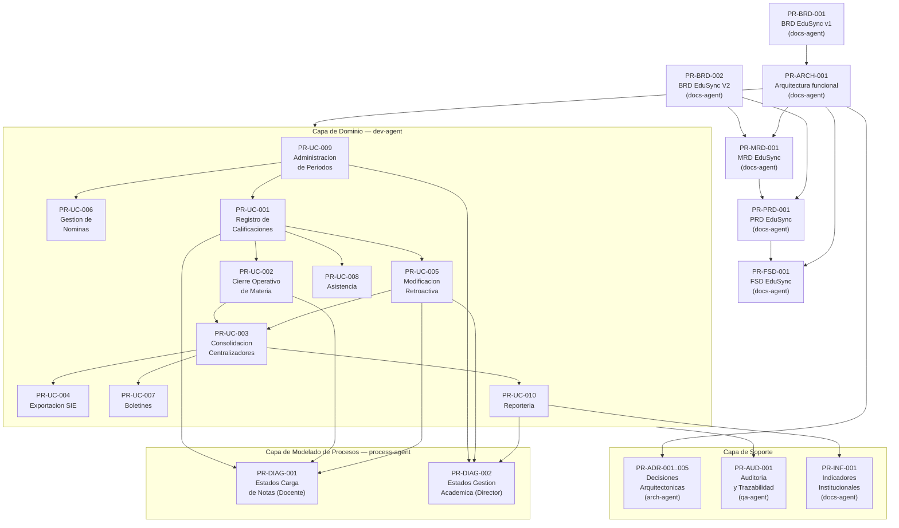

# PROMPT_MAPPING — EduSync

> Catálogo de prompts usados para producir cada artefacto del proyecto EduSync (formato `PR-<AREA>-NNN`).
> IDs: `ARCH` / `BRD` / `UC` / `ADR` / `AUD` / `INF` / `DIAG`. Versión activa: `v0.4`.
> Cada prompt sigue la estructura de `plantillas/PROMPT_TEMPLATE.md`.
> Este documento es la fuente de verdad del ecosistema de prompts del proyecto.

---

## Índice de prompts

| ID | Artefacto producido | Tipo | Agente | Modelo | Fecha | Estado |
|----|---------------------|------|--------|--------|-------|--------|
| PR-ARCH-001 | `docs/arquitectura_funcional_EduSync.md` | generación | `docs-agent` | Sonnet | 14/05/2026 | Aprobado |
| PR-BRD-001 | `docs/BRD_EduSync.md` | generación | `docs-agent` | Sonnet | 14/05/2026 | Aprobado |
| PR-UC-001 | Contrato UC-01 · Registro de calificaciones | transformación | `dev-agent` | Sonnet | 14/05/2026 | Aprobado |
| PR-UC-002 | Contrato UC-02 · Cierre operativo de materia | transformación | `dev-agent` | Sonnet | 14/05/2026 | Aprobado |
| PR-UC-003 | Contrato UC-03 · Consolidación de centralizadores | transformación | `dev-agent` | Opus | 14/05/2026 | Aprobado |
| PR-UC-004 | Contrato UC-04 · Exportación SIE | transformación | `dev-agent` | Sonnet | 14/05/2026 | Aprobado |
| PR-UC-005 | Contrato UC-05 · Modificación retroactiva | transformación | `dev-agent` | Opus | 14/05/2026 | Aprobado |
| PR-UC-009 | Contrato UC-09 · Administración de periodos | transformación | `dev-agent` | Sonnet | 14/05/2026 | Aprobado |
| PR-ADR-001..005 | `docs/arquitectura_funcional_EduSync.md §DA-01..DA-05` | generación | `arch-agent` | Opus | 14/05/2026 | Aprobado |
| PR-AUD-001 | Auditoría de trazabilidad y logs (`audit_log`) | auditoría | `qa-agent` | Sonnet | 14/05/2026 | Borrador |
| PR-INF-001 | Informe estadístico de indicadores institucionales (UC-10) | extracción | `docs-agent` | Haiku | 14/05/2026 | Borrador |
| PR-DIAG-001 | `docs/diagramas/estados.cargarnotas.mmd` + `estados_cargar_notas.md` (flujo del Docente) | generación | `process-agent` | Sonnet | 14/05/2026 | Aprobado |
| PR-DIAG-002 | `docs/diagramas/estados_administracion.mmd` + `estados_administracion.md` (flujo del Director) | generación | `process-agent` | Sonnet | 14/05/2026 | Aprobado |
| PR-BRD-002 | `docs/BRD_EduSync_V2.md` (BRD consolidado v2.0 — BR-001..BR-012, RB-01..RB-11) | consolidación | `docs-agent` | Sonnet | 14/05/2026 | Aprobado |
| PR-MRD-001 | `docs/MRD-EduSync.md` (MRD v1.0 — 10 MRD-N-*, 3 personas, JTBD, go-to-market) | generación | `docs-agent` | Sonnet | 15/05/2026 | Aprobado |
| PR-PRD-001 | `docs/PRD_EduSync.md` (PRD v1.0 — 17 US, 6 épicas, RICE, NFRs, journeys) | generación | `docs-agent` | Sonnet | 15/05/2026 | Aprobado |
| PR-FSD-001 | `docs/fsd/FSD-EduSync.md` (FSD Clásico v1.0 — 5 FSD-UC, ER, 3 contratos, 14 tasks) | generación | `docs-agent` | Sonnet | 15/05/2026 | Aprobado |

---

## Flujo general de información entre prompts



---

## Matriz de responsabilidades por agente

| Agente | Prompts asignados | Responsabilidad principal | Artefactos generados |
|--------|-------------------|--------------------------|----------------------|
| `docs-agent` | PR-ARCH-001, PR-BRD-001, PR-BRD-002, PR-MRD-001, PR-PRD-001, PR-FSD-001, PR-INF-001 | Producir y mantener toda la cadena documental del proyecto (BRD → MRD → PRD → FSD); versionar y consolidar ante nuevos artefactos funcionales | `.md` en `docs/` y `docs/fsd/` |
| `dev-agent` | PR-UC-001..UC-010 | Generar contratos de UC, código de dominio y pruebas unitarias | Código en `src/`, contratos en `docs/prompts/` |
| `arch-agent` | PR-ADR-001..005 | Evaluar alternativas y documentar decisiones arquitectónicas | ADRs en `docs/adr/` |
| `qa-agent` | PR-AUD-001 | Verificar invariantes, trazabilidad y cobertura de pruebas | Reportes en `docs/qa/` |
| `process-agent` | PR-DIAG-001, PR-DIAG-002 | Modelar workflows y diagramas de estado de actores institucionales (Docente, Director) garantizando consistencia con UCs | Diagramas `.mmd` y especificaciones `.md` en `docs/diagramas/` |

---

## Prompts

---

### PR-ARCH-001 — Generación de arquitectura funcional del core EduSync

```markdown
# Role
Eres un Senior Solution Architect especializado en plataformas SaaS multitenant
para el sector educativo latinoamericano, con dominio de Java 21, Spring Boot 3,
PostgreSQL y normativa del Ministerio de Educacion de Bolivia (SIE).

# Task
Diseña la arquitectura funcional del core de EduSync cubriendo los 10 procesos
criticos de registro de calificaciones y gestion academica centralizada,
asegurando escalabilidad para multiples unidades educativas (tenants).

# Context
- Producto: EduSync — plataforma SaaS B2B multitenant para Bolivia.
- Problema central: triple digitacion manual (Excel → Excel → SIE) que obliga
  al personal a trabajar de madrugada bajo riesgo de sanciones ministeriales.
- Stack autoritativo: Java 21, Spring Boot 3.3, PostgreSQL 15, Angular 17, AWS.
- Restricciones: aislamiento multitenant (tenant_id + RLS), RBAC estricto por rol
  (DIRECTOR / SECRETARIA / DOCENTE), identificacion de estudiantes solo por RUDE.
- Stakeholders UX: Marcela (Docente), Wendy (Secretaria), Jeanneth (Directora).
- Entradas esperadas: vision de negocio (01_vision_negocio.md), BRD_EduSync.md.

# Reasoning
1. Mapear los flujos principales a 10 UCs criticos (UC-01..UC-10).
2. Por cada UC: definir Actores, Entradas, Invariantes de negocio, Salidas.
3. Identificar 5 decisiones arquitectonicas (DA-01..DA-05).
4. Establecer trazabilidad entre necesidades UX y componentes del sistema.
5. Verificar que ningun UC proponga implementacion, codigo o esquema de tablas.

# Stop condition
Detente al cubrir los 10 UCs y listar las 5 DAs con justificacion tecnica.
No propongas codigo, esquemas de tablas ni mapeos a servidores AWS.

# Output
Markdown con tres secciones:
1. "Encuadre del Core EduSync" (1 parrafo).
2. "Diez casos de uso criticos" (tablas Actores/Entradas/Invariantes/Salidas).
3. "Cinco decisiones arquitectonicas" (justificacion DA-01..DA-05).

# Invariants
- Ningun UC puede proponer codigo de implementacion.
- El RUDE es la unica clave de identificacion de estudiantes.
- Toda invariante de negocio debe ser verificable sin acceder al codigo.

# Failure modes
- E_MISSING_CONTEXT: falta vision_negocio.md o BRD — STOP, solicitar el artefacto.
- E_CODE_PROPOSED: el output contiene fragmentos de codigo — rechazar y regenerar.
- E_UC_INCOMPLETO: algun UC no tiene los 4 campos — STOP, completar antes de entregar.
```

---

### PR-BRD-001 — Generación del BRD EduSync

```markdown
# Role
Eres un Product Strategist Senior con experiencia en EdTech GovTech para
mercados emergentes latinoamericanos y conocimiento de normativa educativa
boliviana (Ley 070 Avelino Siñani).

# Task
Genera docs/BRD_EduSync.md siguiendo plantillas/BRD_TEMPLATE.md documentando
el problema de la triple digitacion manual, el modelo de negocio SaaS B2B
multitenancy y los requerimientos de negocio priorizados con MoSCoW.

# Context
- Insumo primario: 01_vision_negocio.md (problema, oportunidad, stakeholders).
- Entrevistas UX realizadas con: Marcela (Docente), Wendy (Secretaria),
  Jeanneth (Directora). Sus dolores son la fuente de los BR-NNN.
- Mercado objetivo: unidades educativas de Bolivia (privadas y de convenio).
- Modelo de ingresos: SaaS B2B por unidad educativa (tenant).
- Restriccion legal: cumplimiento con formato de exportacion al SIE del
  Ministerio de Educacion de Bolivia.

# Reasoning
1. Redactar el problema central con evidencia cuantitativa (horas perdidas,
   riesgo de multas, errores de digitacion detectados en los Excel reales).
2. Definir >=6 BR-NNN priorizados MoSCoW con criterio de aceptacion.
3. Documentar el modelo de negocio (BMC: segmentos, propuesta de valor, canales).
4. Declarar KPIs del producto: tiempo de cierre administrativo, tasa de error SIE.
5. Establecer RACI con Director, Secretaria, Docente, Dev (Rodrigo Aspeti).

# Stop condition
Detente cuando el BRD tenga: >=6 BR-NNN, BMC de 9 bloques, KPIs, RACI y
seccion de trazabilidad BR → UC completada.

# Output
Markdown completo segun BRD_TEMPLATE.md con encabezado de metadatos,
todas las secciones completadas y tabla de trazabilidad BR → UC al final.

# Invariants
- Todo BR-NNN debe tener criterio de aceptacion verificable.
- El RUDE debe aparecer como restriccion critica en al menos un BR.
- No proponer arquitectura tecnica en el BRD (pertenece al FSD/DTI).

# Failure modes
- E_MISSING_UX: si falta contexto de al menos 2 stakeholders — STOP.
- E_BR_SIN_CRITERIO: BR-NNN sin criterio de aceptacion — rechazar output.
- E_ARQUITECTURA_EN_BRD: si el output propone stack tecnico — rechazar y limpiar.
```

---

### PR-BRD-002 — Generación del BRD EduSync V2 (consolidado)

```markdown
# Role
Eres un Senior Business Analyst (BA), Product Owner y Enterprise Solution Architect
con experiencia en levantamiento de requerimientos, analisis funcional y documentacion
corporativa para sistemas SaaS B2B en el sector educativo latinoamericano.

# Task
Genera docs/BRD_EduSync_V2.md siguiendo plantillas/BRD_TEMPLATE.md, consolidando
los requerimientos del v1 (BR-001..BR-005) con los requerimientos derivados de la
arquitectura funcional (10 UCs, 5 DAs), los diagramas de estado del Docente
(estados_cargar_notas.md, 18 estados) y del Director (estados_administracion.md, 23 estados).

# Context
- Insumos primarios:
  * docs/BRD_EduSync_V1.md (BR-001..BR-005 a conservar y enriquecer).
  * docs/arquitectura_funcional_EduSync.md (UC-01..UC-10, DA-01..DA-05).
  * 01_vision_negocio.md (problema, stakeholders, evidencia UX de campo).
  * docs/diagramas/estados_cargar_notas.md (18 estados del Docente).
  * docs/diagramas/estados_administracion.md (23 estados del Director).
- Requerimientos nuevos a derivar del analisis funcional:
  * Apertura secuencial de periodos trimestrales (UC-09 invariante, RB-05).
  * Parametros academicos inmutables post-apertura (DA-02, RB-06).
  * Habilitacion de accesos docente-materia como prerequisito de apertura (UC-09, BR-008).
  * Ventana temporal de modificacion retroactiva 1-72h (UC-05, RB-07).
  * Dashboard con separacion estricta de indicadores trimestral/anual (UC-10, RB-11).
  * Log de auditoria inalterable para toda operacion de escritura (DA-03, BR-011).
  * Generacion de boletines PDF desde centralizador en estado CERRADO (UC-07, BR-012).
- Evidencia de Discovery: entrevistas con Marcela (Docente), Wendy (Secretaria),
  Jeanneth (Directora); analisis de Excel reales (Centralizador2A_ColegioAbaroa.xlsx,
  REGISTRO SECUNDARIA 2026.xlsx): desfase de listas, decimales inconsistentes (floor).
- Restriccion de formato: BRD_TEMPLATE.md obligatorio; >=3 elementos por bloque BMC;
  >=12 BR-NNN con MoSCoW y criterio de aceptacion; >=11 RB-NNN con tipo y origen;
  >=5 KPIs con linea base y meta; >=5 BO-NNN SMART; RACI de 6 stakeholders;
  trazabilidad BR -> UC/DA/artefacto; PR-FAQ Amazon-style en seccion 21.

# Reasoning
1. Leer y relacionar todos los artefactos fuente antes de escribir cualquier seccion.
2. Identificar requerimientos explicitos e implicitos de los diagramas de estado
   (estados sin equivalente en v1 del BRD revelan invariantes de negocio nuevas).
3. Detectar inconsistencias entre documentos fuente (ej. parametros de UC-09 ausentes
   en BR-NNN del v1; apertura secuencial de periodos sin BR correspondiente).
4. Conservar y enriquecer BR-001..BR-005 del v1; agregar BR-006..BR-012 derivados.
5. Documentar 11 reglas de negocio RB-01..RB-11 con tipo (politica/normativa) y origen.
6. Construir 3 personas completas: Docente/Marcela, Secretaria/Wendy, Director/Jeanneth.
7. Generar BMC de 9 bloques con >=3 elementos concretos cada uno.
8. Generar tabla de trazabilidad BR -> UC/DA/artefacto para cada BR-NNN.
9. Incluir PR-FAQ con Press Release en futuro fingido, External FAQ e Internal FAQ.

# Stop condition
Detente cuando el BRD tenga: metadatos con version v2.0, 12 BR-NNN con MoSCoW y
criterio de aceptacion verificable, 11 RB-NNN con tipo y origen, BMC de 9 bloques
(>=3 elementos cada uno), 5 KPIs con linea base y meta, 5 BO-NNN SMART, RACI de
6 stakeholders, trazabilidad BR -> UC completa, 6 riesgos con mitigacion y
PR-FAQ en seccion 21. No proponer arquitectura tecnica ni codigo de implementacion.

# Output
Markdown completo segun BRD_TEMPLATE.md (secciones 0-21) guardado en
docs/BRD_EduSync_V2.md, listo para revision por stakeholders tecnicos y de negocio.

# Invariants
- Todo BR-NNN debe tener criterio de aceptacion verificable y metrica asociada.
- El RUDE debe aparecer como restriccion critica en BR-004 y en RB-01.
- El criterio floor debe documentarse en BR-003 y RB-08.
- La ventana temporal 1-72h de UC-05 debe aparecer en BR-009 y RB-07.
- Los indicadores anuales con 3 trimestres cerrados deben referirse en BR-010 y RB-11.
- Los BR del v1 (BR-001..BR-005) deben conservarse y enriquecerse, nunca eliminarse.
- Ningun BR puede proponer implementacion tecnica (pertenece al FSD/DTI).
- El log de auditoria inalterable debe estar documentado en BR-011 y RB-10.

# Failure modes
- E_MISSING_SOURCE: falta algun artefacto fuente (v1, arq.funcional, estados) -- STOP,
  no generar output parcial; solicitar el artefacto faltante.
- E_BR_SIN_METRICA: BR-NNN sin criterio de aceptacion verificable -- completar antes
  de entregar; no emitir output incompleto.
- E_ARQUITECTURA_EN_SPECS: el output contiene codigo o esquemas de tablas -- rechazar
  y regenerar eliminando todo contenido tecnico de implementacion.
- E_INCONSISTENCIA_V1: algun BR del v1 fue eliminado en lugar de enriquecido --
  restaurar y re-emitir output completo.
- E_BMC_INCOMPLETO: algun bloque del BMC tiene menos de 3 elementos -- completar
  antes de considerar el output valido para entrega.
```

---

### PR-MRD-001 — Generación del MRD EduSync

```markdown
# Role
Eres un experto en Product Management, Business Analysis y documentación de
productos digitales con experiencia en Product Discovery, Lean Product, Agile
y documentación técnica empresarial para mercados latinoamericanos.

# Task
Genera docs/MRD-EduSync.md siguiendo plantillas/MRD_TEMPLATE.md, describiendo
el mercado, usuarios y oportunidad comercial que justifican EduSync.
El documento debe responder: "¿qué pide el mercado boliviano de gestión académica
y por qué EduSync ganará?"

# Context
- Insumos: docs/BRD_EduSync_V2.md (BR-001..BR-012), docs/arquitectura_funcional_EduSync.md,
  01_vision_negocio.md, entrevistas UX con Marcela (Docente), Wendy (Secretaría),
  Jeanneth (Directora); análisis de Excel reales (desfase de listas, decimales).
- Mercado objetivo: unidades educativas privadas y de convenio de Bolivia (~4 000).
- Competidores identificados: Excel+SIE manual, Academium, Colegio360,
  Google Sheets, sistema SIE gubernamental.
- Modelo de negocio: SaaS B2B con Setup Fee Bs 200 + suscripción anual por estudiante.
- Restricción: respetar exactamente la estructura de MRD_TEMPLATE.md.

# Reasoning
1. Calcular TAM/SAM/SOM con fuentes y notas de asunción explícitas.
2. Construir 3 personas completas (Wendy/Marcela/Jeanneth) con JTBD y dolores.
3. Documentar >=8 JTBD alineados a los 10 UCs de la arquitectura funcional.
4. Generar tabla competitiva con >=5 alternativas y criterios de comparación.
5. Construir Positioning Statement: "Para X que Y, nuestro Z es...".
6. Diseñar pricing en tiers (Setup + Básico/Estándar/Premium) con benchmarks.
7. Definir go-to-market: 5 canales, 3 fases de lanzamiento, funnel AARRR.
8. Documentar 10 MRD-N-* priorizados con MoSCoW y justificación de mercado.
9. Declarar >=8 hipótesis con método de validación y criterio de éxito.
10. Completar tabla de trazabilidad MRD-N -> BR -> UC/DA.

# Stop condition
Detente cuando el MRD tenga: TAM/SAM/SOM, 3 personas, 8 JTBD, 5 competidores,
positioning statement, pricing con tiers, go-to-market, 10 MRD-N-*, 8 hipótesis,
trazabilidad completa y checklist verificado. Sin placeholders vacíos.

# Output
Markdown completo según MRD_TEMPLATE.md (secciones 0-16 + checklist) guardado en
docs/MRD-EduSync.md, listo para revisión por stakeholders de negocio y producto.

# Invariants
- Todo MRD-N-* debe tener prioridad MoSCoW y justificación de mercado verificable.
- El TAM/SAM/SOM debe tener fuente o nota de asunción explícita.
- Los supuestos de precio y competencia deben marcarse con "(assumption)".
- El positioning statement debe referir a un competidor concreto, no genérico.

# Failure modes
- E_TEMPLATE_VIOLADO: estructura distinta a MRD_TEMPLATE.md — rechazar y regenerar.
- E_PLACEHOLDER_VACIO: sección con marcadores sin completar — completar.
- E_TAM_SIN_FUENTE: TAM/SAM/SOM sin fuente ni nota de asunción — agregar.
- E_COMPETIDOR_GENERICO: positioning sin competidor concreto — especificar.
```

---

### PR-PRD-001 — Generación del PRD EduSync

```markdown
# Role
Eres un experto en Product Management, Product Discovery, Business Analysis y
definición de requerimientos funcionales para productos SaaS empresariales.
Tienes experiencia creando PRDs con Agile, Lean Product e INVEST.

# Task
Genera docs/PRD_EduSync.md siguiendo plantillas/PRD_TEMPLATE.md, describiendo
QUE debe hacer EduSync para cumplir los requerimientos del MRD v1.0 y BRD v2.0.
El documento debe ser accionable para desarrollo, diseño y QA.

# Context
- Insumos: docs/MRD-EduSync.md (10 MRD-N-*), docs/BRD_EduSync_V2.md (12 BR-NNN),
  docs/arquitectura_funcional_EduSync.md (10 UCs, 5 DAs),
  docs/diagramas/estados_cargar_notas.md (18 estados Docente),
  docs/diagramas/estados_administracion.md (23 estados Director).
- Constitution del producto (5 principios no negociables): Zero-Training, RUDE
  como única clave de identidad, inmutabilidad post-cierre, sin PII en logs, RLS multitenant.
- Personas: Wendy (Secretaría), Marcela (Docente), Jeanneth (Director).
- Restriccion: >=15 US INVEST con Gherkin, RICE top-10, >=2 journeys Mermaid.

# Reasoning
1. Derivar 6 épicas de los 10 UCs de la arquitectura funcional.
2. Generar >=17 user stories con formato INVEST.
3. Documentar criterios de aceptación Gherkin (Given/When/Then) por US.
4. Construir tabla RICE: Reach, Impact, Confidence, Effort para top-10 historias.
5. Generar 3 user journeys Mermaid (Wendy/Marcela/Jeanneth).
6. Documentar 20 PRD-REQ-* funcionales y 15 PRD-NFR-* con umbrales.
7. Definir roadmap de versiones v1.0->v2.0 y Discovery track con 6 hipótesis.
8. Completar trazabilidad PRD-REQ -> BR -> MRD-N -> UC/DA -> FSD.

# Stop condition
Detente cuando el PRD tenga: constitution, 17 US con Gherkin, RICE top-10, 3 journeys,
20 PRD-REQ-*, 15 NFRs, roadmap, Discovery track, trazabilidad y checklist completos.

# Output
Markdown completo según PRD_TEMPLATE.md (secciones 0-16 + checklist) guardado en
docs/PRD_EduSync.md, listo para planificación Agile y estimación técnica.

# Invariants
- Toda US debe cumplir INVEST: Independent, Negotiable, Valuable, Estimable, Small, Testable.
- Cada criterio Gherkin debe ser verificable sin ambigüedad.
- RICE Score: (Reach x Impact x Confidence) / Effort.
- Las invariantes del BRD (RUDE, floor, ventana temporal) deben aparecer en Gherkin.

# Failure modes
- E_US_NO_INVEST: historia sin criterio de aceptación o ambigua — rechazar.
- E_GHERKIN_AMBIGUO: criterio no verificable por QA — reescribir con datos concretos.
- E_RICE_INCOMPLETO: tabla RICE con menos de 10 historias — completar.
- E_TRAZABILIDAD_ROTA: PRD-REQ sin BR ni MRD-N correspondiente — agregar enlace.
```

---

### PR-FSD-001 — Generación del FSD EduSync (modo FSD Clásico)

```markdown
# Role
Eres un experto en Functional Analysis, Software Architecture y System Design.
Generas documentos FSD técnicamente precisos, implementables y verificables
para sistemas Java 21 / Spring Boot 3 con arquitectura hexagonal.

# Task
Genera docs/fsd/FSD-EduSync.md siguiendo plantillas/FSD_TEMPLATE.md en modo
FSD Clásico, especificando QUE hace EduSync con nivel técnico suficiente para
que desarrollo, QA y arquitectura puedan implementar y verificar.

# Context
- Insumos: docs/PRD_EduSync.md (20 PRD-REQ-*, 15 NFRs), docs/BRD_EduSync_V2.md,
  docs/MRD-EduSync.md, docs/arquitectura_funcional_EduSync.md (10 UCs, 5 DAs).
- Stack: Java 21, Spring Boot 3.3, Spring Security 6 (JWT+RBAC), Spring Data JPA,
  PostgreSQL 15 (RLS), Angular 17, AWS.
- Arquitectura: hexagonal (Domain / Application / Infrastructure).
- Entidades críticas: Calificacion, Centralizador, ExportacionSIE, AuditLog,
  AutorizacionCorreccion, ParametroAcademico, GestionAcademica, Periodo.
- Invariantes absolutas: floor() único truncado, RUDE única clave de identidad,
  audit_log inalterable (sin UPDATE/DELETE), RLS activo en todas las tablas.

# Reasoning
1. Documentar 5 FSD-UC críticos (UC-001, UC-003, UC-004, UC-005, UC-009) con:
   flujo principal, flujos alternativos, precondiciones, postcondiciones,
   datos de entrada/salida, reglas de negocio y criterios Gherkin.
2. Documentar 12 reglas de negocio BR-001..BR-012 con tipo y origen.
3. Generar diagrama ER Mermaid con 16 entidades y relaciones completas.
4. Completar diccionario de datos con tipo, validaciones y origen por atributo.
5. Generar 3 prompt-contratos (UC-001, UC-003, UC-005) con 6 elementos.
6. Descomponer en 14 Tasks ejecutables (Spec Kit) con dependencias.
7. Documentar 16 NFRs con métrica, umbral y método de verificación.
8. Completar trazabilidad MRD->PRD->FSD->NFR->prueba de aceptación.

# Stop condition
Detente cuando el FSD tenga: 5 FSD-UC con Gherkin, 12 BR-NNN, ER con 16 entidades,
diccionario completo, 3 prompt-contratos, 14 tasks, 16 NFRs, trazabilidad completa,
plan de pruebas, glosario y checklist FSD Clásico verificado. Sin placeholders.

# Output
Markdown completo según FSD_TEMPLATE.md en modo FSD Clásico (secciones 0-15 + checklist)
guardado en docs/fsd/FSD-EduSync.md, listo para implementación y QA testing.

# Invariants
- El cálculo de floor() y la conversión SIE solo ocurren en la capa de dominio.
- El audit_log se escribe en la misma transacción que el INSERT/UPDATE de la entidad.
- Toda tabla nueva debe tener tenant_id y política RLS antes de llegar a main.
- El modelo append-only en UC-005 es innegociable: el original NUNCA se sobreescribe.

# Failure modes
- E_CALCULO_FUERA_DOMINIO: promedio o floor en adaptador/SQL/frontend — rechazar PR.
- E_AUDIT_LOG_OMITIDO: operación de escritura sin entrada en audit_log — rechazar PR.
- E_RLS_FALTANTE: nueva tabla sin tenant_id o sin política RLS — rechazar migración.
- E_APPEND_ONLY_VIOLADO: modificación que sobreescribe registro original — rechazar.
- E_PLACEHOLDER_VACIO: sección del FSD con marcadores sin completar — completar.
```

---

### PR-UC-001 — Contrato de UC-01: Registro de calificaciones

```markdown
# Role
Eres un Senior Backend Engineer especializado en Java 21, Spring Boot 3 y
sistemas academicos con RBAC estricto para entornos multitenant.

# Task
Genera el contrato tecnico del endpoint POST /api/v1/calificaciones para
el caso de uso UC-01 (Registro descentralizado de calificaciones por dimension),
incluyendo schema de request/response, validaciones, invariantes y pruebas.

# Context
- Fuente: arquitectura_funcional_EduSync.md §UC-01.
- Actores: Docente (JWT con rol DOCENTE).
- Dimensiones activas: Ser / Saber / Hacer / Decidir (+ Autoevaluacion parametrica).
- Tipo de nota: REGULAR o AYUDA (regla de combinacion parametrica por tenant+periodo).
- Escala de ingreso: 0–100 (cruda). La conversion a escala SIE es exclusiva de UC-03.
- Restricciones:
  * BR-RUDE: identificacion de estudiante solo por codigo RUDE.
  * BR-RBAC: el docente solo escribe en sus materias asignadas.
  * BR-PERIODO: solo se acepta si el periodo esta en estado ABIERTO.
  * BR-RANGO: el valor debe estar dentro del rango parametrico de la dimension.
- Stack: Java 21, Spring Boot 3.3, Spring Security (JWT), Spring Data JPA.

# Reasoning
1. Definir el schema JSON del request (RUDE, materia_id, periodo_id, dimension,
   tipo_nota, valor, indice_evaluacion).
2. Especificar las validaciones en orden: autenticacion JWT → RBAC → estado
   del periodo → rango parametrico → persistencia.
3. Definir el schema de response exitoso (201) y de errores (400, 403, 409).
4. Declarar las entradas en el audit_log generadas por cada llamada exitosa.
5. Verificar que la conversion de escala NO ocurre en este endpoint.

# Stop condition
Detente cuando el contrato tenga: schema request, schema response, 3 codigos
de error con descripcion, invariantes verificables y 3 casos de prueba.

# Output
Markdown con: schema OpenAPI simplificado, tabla de validaciones en orden,
tabla de codigos de respuesta y 3 casos de prueba (feliz, borde, adversarial).

# Invariants
- El campo valor debe rechazarse si excede el rango parametrico del periodo.
- El campo RUDE es obligatorio; no se acepta nombre ni numero de lista.
- El response exitoso debe incluir el promedio provisional recalculado del estudiante.
- Toda llamada exitosa genera una entrada en audit_log (inmutable).
- La conversion de escala SIE no ocurre en este endpoint.

# Failure modes
- E_PERIODO_NO_MODIFICABLE: periodo CERRADO o SOLO_LECTURA — HTTP 409.
- E_RBAC_VIOLATION: docente sin asignacion en la materia — HTTP 403.
- E_NOTA_FUERA_DE_RANGO: valor fuera del rango parametrico — HTTP 400.
- E_RUDE_INVALIDO: RUDE nulo, vacio o con formato incorrecto — HTTP 400.
- E_MISSING_CONTEXT: falta periodo_id o materia_id en el request — HTTP 400.
```

---

### PR-UC-002 — Contrato de UC-02: Cierre operativo de materia

```markdown
# Role
Eres un Senior Backend Engineer especializado en transacciones atomicas,
consistencia eventual y gestion de estados en Spring Boot 3 con PostgreSQL.

# Task
Genera el contrato tecnico del endpoint POST /api/v1/materias/{id}/cierre
para UC-02 (Cierre operativo de materia), incluyendo la logica de verificacion
de completitud, la transicion de estado a SOLO_LECTURA y el disparo del evento
de consolidacion (UC-03).

# Context
- Fuente: arquitectura_funcional_EduSync.md §UC-02.
- El cierre es ATOMICO: no existe cierre parcial.
- Completitud se verifica contra el conjunto de evaluaciones declaradas por el
  propio docente (no contra un numero fijo).
- Post-cierre: la materia transiciona a SOLO_LECTURA de forma irreversible.
- El docente no puede agregar evaluaciones nuevas despues de solicitar el cierre.
- Al cerrar la ultima materia del curso: se dispara MateriaCarradaEvent (UC-03).
- Stack: Java 21, Spring Boot 3, Spring Events, Spring Data JPA.

# Reasoning
1. Definir el schema de request (materia_id, periodo_id, confirmacion_docente).
2. Especificar la secuencia de verificacion: RBAC → estado periodo → completitud
   (todos los estudiantes con todas sus evaluaciones declaradas completadas).
3. Definir la transicion de estado: ABIERTO → CERRADO → SOLO_LECTURA.
4. Declarar el evento de dominio MateriaCarradaEvent y sus consumidores.
5. Definir los schemas de response (200 OK, errores 400/403/409).

# Stop condition
Detente cuando el contrato cubra: verificacion de completitud, transicion de
estado, disparo del evento de dominio y 3 casos de prueba.

# Output
Markdown con schema de request/response, diagrama de secuencia simplificado
(texto), tabla de estados de la materia y 3 casos de prueba.

# Invariants
- No se puede cerrar si existe un estudiante con evaluacion declarada sin nota.
- El cierre es irreversible sin intervencion del Director (UC-05).
- El evento MateriaCarradaEvent solo se dispara si el cierre fue exitoso.
- El docente que cierra no puede ser diferente del docente asignado (RBAC).

# Failure modes
- E_COMPLETITUD_FALLIDA: al menos 1 evaluacion sin nota — HTTP 409 con lista
  de estudiantes y dimensiones faltantes.
- E_MATERIA_YA_CERRADA: la materia ya esta en SOLO_LECTURA — HTTP 409.
- E_RBAC_VIOLATION: docente no asignado a esta materia — HTTP 403.
```

---

### PR-UC-003 — Contrato de UC-03: Consolidación algorítmica de centralizadores

```markdown
# Role
Eres un Senior Data Engineer especializado en motores de calculo academico,
algoritmos de truncado y arquitecturas de calculo en tiempo real con
Spring Boot 3, Spring Events y PostgreSQL.

# Task
Genera el contrato tecnico del motor de consolidacion de centralizadores
(UC-03), diferenciando el modo PROVISIONAL (tiempo real) del modo OFICIAL
(post-cierre total), incluyendo el algoritmo de truncado floor y la regla
de combinacion de N evaluaciones por dimension.

# Context
- Fuente: arquitectura_funcional_EduSync.md §UC-03, DA-02.
- Modo PROVISIONAL: calcula con materias ABIERTAS. Marcado como PROVISIONAL.
  No valido para boletines (UC-07) ni exportacion SIE (UC-04).
- Modo OFICIAL: solo cuando 100% materias del curso estan CERRADAS.
- Algoritmo de truncado: floor (piso), no redondeo estandar.
  Ejemplo: 64.666... → 64 (no 65). Elimina descuadres de escala.
- Combinacion de N evaluaciones por dimension: parametrica por tenant+periodo.
  Reglas soportadas: PROMEDIO_SIMPLE, SUMA, MEJOR_N.
- Conversion a escala SIE: floor(nota/3) → escala 0-33.
- Indicadores anuales: solo cuando los 3 trimestres estan CERRADOS.
- Restriccion: ningun calculo ocurre en SQL ad-hoc, adaptadores ni frontend.
- Stack: Java 21, Spring Boot 3, Spring Events, PostgreSQL 15.

# Reasoning
1. Definir la interfaz del motor (input: curso_id, periodo_id, modo).
2. Especificar el algoritmo de combinacion de evaluaciones por dimension
   (aplicar regla parametrica → truncar con floor → escalar al peso de la dimension).
3. Definir las dos salidas: PROVISIONAL (con marca de agua) y OFICIAL (inmutable).
4. Especificar cuando se activa cada modo (evento MateriaCarradaEvent).
5. Definir el comportamiento del indicador anual con trimestres parciales.

# Stop condition
Detente cuando el contrato cubra: algoritmo de calculo con floor, diferencia
PROVISIONAL/OFICIAL, calculo de escala SIE, indicadores anuales y 3 pruebas.

# Output
Markdown con: pseudocodigo del algoritmo de consolidacion, tabla de parametros
configurables (DA-02), especificacion de los 2 modos de salida, ejemplos
numericos con floor y 3 casos de prueba.

# Invariants
- El algoritmo floor es UNICO y centralizado en el dominio; no se replica.
- El centralizador PROVISIONAL no puede usarse para generar boletines ni exportar.
- El promedio anual solo se calcula y muestra con los 3 trimestres cerrados.
- La regla de combinacion de evaluaciones es parametrica, no hardcodeada.
- floor(64.666) = 64; floor(nota/3) para la escala SIE.

# Failure modes
- E_MATERIAS_ABIERTAS_MODO_OFICIAL: se solicita modo OFICIAL con materias ABIERTAS
  — rechazar calculo oficial, retornar PROVISIONAL.
- E_PARAMETRO_FALTANTE: regla de combinacion no configurada para tenant+periodo
  — STOP, lanzar excepcion de configuracion.
- E_TRIMESTRE_INCOMPLETO: se solicita promedio anual sin los 3 trimestres cerrados
  — retornar null con etiqueta EN_CURSO, no calcular.
```

---

### PR-UC-004 — Contrato de UC-04: Exportación y sincronización al SIE

```markdown
# Role
Eres un Senior Integration Engineer especializado en integraciones con sistemas
gubernamentales bolivianos, patrones de resiliencia (circuit breaker, idempotencia)
y Spring Boot 3 con AWS SQS para procesamiento asincrono tolerante a fallos.

# Task
Genera el contrato tecnico del proceso de exportacion masiva al SIE (UC-04),
incluyendo el filtro pre-exportacion obligatorio, el esquema de idempotencia
por RUDE+periodo_id, el manejo de fallos parciales y el reporte de resultado.

# Context
- Fuente: arquitectura_funcional_EduSync.md §UC-04, DA-05.
- Actor: Secretaria/Administrativo.
- Prerequisito: todos los centralizadores del periodo en estado CERRADO.
- Vinculacion al SIE: exclusivamente por RUDE. Nunca por nombre ni posicion.
- Filtro pre-exportacion OBLIGATORIO: descartar filas con RUDE nulo/invalido
  y filas con nota nula en cualquier dimension requerida. Reportar como
  EXCLUIDAS_SIN_RUDE o EXCLUIDAS_NOTA_INCOMPLETA (nunca enviar valor 0).
- Idempotencia: clave compuesta RUDE + periodo_id. Evita duplicados en reintentos.
- Resiliencia: estado de exportacion persistido registro a registro (DA-05).
  Al fallar el SIE, el proceso reanuda desde el ultimo exitoso.
- Stack: Java 21, Spring Boot 3, resilience4j (circuit breaker), AWS SQS.

# Reasoning
1. Definir el flujo completo: validar prerequisitos → filtrar → construir payload
   → enviar por RUDE → persistir estado → reportar resultado.
2. Especificar el schema del payload SIE (parametrico, actualizable sin redespliegue).
3. Definir los 3 estados de exportacion por estudiante: PENDIENTE / ENVIADO / FALLIDO.
4. Especificar el proceso de reintento: solo registros FALLIDO o PENDIENTE.
5. Definir el reporte de resultado (enviados, fallidos, excluidos con razon).

# Stop condition
Detente cuando el contrato cubra: filtro pre-exportacion, idempotencia,
estados de exportacion, manejo de fallo parcial SIE y reporte de resultado.

# Output
Markdown con: diagrama de flujo (texto), schema del payload SIE, tabla de
estados por registro, logica de reintento y 3 casos de prueba.

# Invariants
- No se puede exportar si alguna materia del periodo esta en estado ABIERTO.
- El RUDE nulo o invalido NUNCA se envia al SIE con valor 0.
- La clave de idempotencia RUDE + periodo_id previene duplicados en reintentos.
- El fallo parcial del SIE no reinicia el proceso desde cero.
- El formato de exportacion es parametrico (sin redespliegue ante cambios del SIE).

# Failure modes
- E_PERIODO_NO_CERRADO: existen materias ABIERTAS en el periodo — HTTP 409.
- E_SIE_TIMEOUT: el servidor SIE no responde — persistir FALLIDO, activar
  circuit breaker, programar reintento asincrono.
- E_RUDE_INVALIDO_PAYLOAD: RUDE invalido en el payload construido — excluir
  registro, reportar en EXCLUIDAS_SIN_RUDE, continuar con el siguiente.
- E_PAYLOAD_INVALIDO: el formato SIE cambio sin actualizacion del parametro
  — STOP, alertar a Secretaria y Administrador tecnico.
```

---

### PR-UC-005 — Contrato de UC-05: Modificación retroactiva con ventana temporal

```markdown
# Role
Eres un Senior Backend Engineer especializado en sistemas de autorizacion
jerarquica, modelos append-only, ventanas temporales con revocacion automatica
y auditoria inmutable en Spring Boot 3 con PostgreSQL.

# Task
Genera el contrato tecnico del flujo completo de UC-05 (Autorizacion jerarquica
de modificacion retroactiva con ventana temporal), desde la solicitud del docente
hasta la revocacion automatica al expirar la ventana.

# Context
- Fuente: arquitectura_funcional_EduSync.md §UC-05.
- Actores: Docente (solicitante), Director (autorizador).
- Alcance de la autorizacion: estudiante especifico (RUDE) o curso completo.
  El Director puede restringir el alcance. El docente no puede ampliarlo.
- Ventana temporal OBLIGATORIA: rango 1h–72h. Default: 24h.
  No existe autorizacion indefinida. Sistema rechaza aprobacion sin ventana.
- Al expirar: revocacion automatica sin intervencion manual.
  Alerta al docente cuando faltan 30 minutos.
- Modelo de persistencia: append-only. El registro original NUNCA se sobreescribe.
  Cada correccion genera un nuevo registro versionado con referencia al anterior.
- El centralizador provisional (UC-03) se recalcula en cada cambio de la ventana.
- Triple entrada en audit_log: (1) solicitud docente, (2) decision director,
  (3) cierre de ventana con inventario de cambios.

# Reasoning
1. Definir los estados de la solicitud: PENDIENTE → APROBADA/RECHAZADA → EXPIRADA.
2. Especificar el schema de la solicitud del docente
   (materia, justificacion, alcance: RUDE o CURSO, dimension, indice_evaluacion).
3. Definir la respuesta del Director (alcance_efectivo, duracion_horas).
4. Especificar el modelo append-only de registro de correcciones.
5. Definir el job de revocacion automatica (scheduler) y las alertas.

# Stop condition
Detente cuando el contrato cubra: estados de la solicitud, schema de autorizacion,
modelo append-only, revocacion automatica, triple audit_log y 3 casos de prueba.

# Output
Markdown con: diagrama de estados de la solicitud (texto), schema de request
del docente, schema de decision del Director, modelo de registro append-only
y 3 casos de prueba (aprobacion, rechazo, ventana expirada).

# Invariants
- No existe autorizacion sin ventana temporal definida.
- El Director no puede aprobar con duracion fuera del rango 1h–72h.
- El docente no puede ampliar el alcance recibido del Director.
- El registro original es inmutable. Solo se crea un nuevo registro versionado.
- La revocacion al expirar es automatica; no requiere accion del Director.
- Las validaciones de rango de UC-01 permanecen activas durante la ventana.

# Failure modes
- E_VENTANA_NO_DEFINIDA: Director intenta aprobar sin duracion — HTTP 400.
- E_ALCANCE_EXCEDIDO: Docente intenta modificar fuera del alcance autorizado
  — HTTP 403, registrar intento en audit_log.
- E_VENTANA_EXPIRADA: la ventana vencio — HTTP 409, redirigir a nueva solicitud.
- E_REGISTRO_INMUTABLE: intento de UPDATE sobre registro original — rechazar,
  forzar modelo append-only.
```

---

### PR-UC-009 — Contrato de UC-09: Administración de periodos académicos

```markdown
# Role
Eres un Senior Backend Engineer especializado en gestion del ciclo de vida de
periodos academicos, parametrizacion de reglas de negocio y multitenant con
aislamiento por tenant_id + PostgreSQL RLS.

# Task
Genera el contrato tecnico del conjunto de endpoints de UC-09 (Administracion
de periodos academicos institucionales), cubriendo la apertura, parametrizacion
y cierre de periodos trimestrales para una unidad educativa (tenant).

# Context
- Fuente: arquitectura_funcional_EduSync.md §UC-09, DA-01, DA-02.
- Actor: Director (apertura y cierre), Secretaria (monitoreo).
- Solo el Director puede abrir o cerrar un periodo institucional.
- No se puede abrir un trimestre si el anterior no esta completamente cerrado.
- Los parametros se fijan al abrir el periodo y son INMUTABLES durante su vigencia:
  * Conjunto de dimensiones activas (Ser/Saber/Hacer/Decidir ± Autoevaluacion).
  * Peso maximo de cada dimension (en puntos).
  * Regla de combinacion de evaluaciones (PROMEDIO_SIMPLE, SUMA, MEJOR_N).
  * Criterio de truncado (floor).
  * Umbral de reprobacion trimestral (< 51 pts / 100).
  * Formato de exportacion SIE (floor(nota/3) → escala 0-33).
- El cierre institucional requiere que todos los centralizadores del periodo
  esten en estado CERRADO.
- Aislamiento: alcance de todos los parametros es tenant + periodo.

# Reasoning
1. Definir los endpoints: POST /periodos (crear), PUT /periodos/{id}/apertura,
   PUT /periodos/{id}/cierre, GET /periodos/{id}/parametros.
2. Especificar el schema de parametros academicos (inmutables post-apertura).
3. Definir la validacion de apertura secuencial (T2 no abre sin T1 cerrado).
4. Especificar la validacion de cierre (100% centralizadores CERRADOS).
5. Declarar las notificaciones generadas: apertura → docentes, cierre → secretaria.

# Stop condition
Detente cuando el contrato cubra: schema de parametros, apertura secuencial,
cierre con prerequisito de centralizadores y 3 casos de prueba.

# Output
Markdown con: tabla de endpoints, schema JSON de parametros, regla de apertura
secuencial, regla de cierre y 3 casos de prueba.

# Invariants
- Los parametros academicos son inmutables una vez que el periodo esta ABIERTO.
- No se puede abrir un trimestre si el anterior no esta en estado CERRADO.
- El cierre solo es posible si todos los centralizadores del periodo estan CERRADOS.
- El alcance de toda consulta esta restringido al tenant autenticado (RLS).
- Solo el rol DIRECTOR puede ejecutar apertura o cierre de periodo.

# Failure modes
- E_PERIODO_PREVIO_ABIERTO: el trimestre anterior no esta cerrado — HTTP 409.
- E_PARAMETROS_INCOMPLETOS: faltan campos requeridos en la configuracion — HTTP 400.
- E_CENTRALIZADORES_PENDIENTES: existen cursos sin centralizar al intentar cerrar
  — HTTP 409 con lista de cursos pendientes.
- E_PARAMETRO_INMUTABLE: intento de modificar parametros de un periodo ABIERTO
  — HTTP 403.
```

---

### PR-ADR-001..005 — Decisiones arquitectónicas EduSync (DA-01 a DA-05)

```markdown
# Role
Eres un Senior Software Architect con experiencia en sistemas SaaS multitenant,
arquitecturas hexagonales, integraciones gubernamentales y toma de decisiones
arquitectonicas documentadas con criterio de trade-off explicito.

# Task
Genera los 5 ADRs (DA-01..DA-05) de EduSync documentando las decisiones
arquitectonicas criticas: aislamiento multitenant, parametrizacion de reglas,
modelo de persistencia inmutable, estrategia de consolidacion y resiliencia SIE.

# Context
- Fuente: arquitectura_funcional_EduSync.md §"Cinco Decisiones Arquitectonicas".
- Stack: Java 21, Spring Boot 3.3, PostgreSQL 15, Angular 17, AWS.
- DA-01: Aislamiento multitenant (tenant_id + RLS vs. schema separado).
- DA-02: Parametrizacion de reglas normativas sin redespliegue (BD vs. YAML).
- DA-03: Modelo de persistencia inmutable (audit_log + Hibernate Envers + append-only).
- DA-04: Consolidacion post-cierre sincrona vs. asincrona (Spring Events vs. SQS).
- DA-05: Resiliencia en integracion SIE (idempotencia RUDE+periodo_id, circuit breaker).
- Contexto boliviano: equipo de 1 desarrollador, mercado de colegios <=1000 alumnos,
  servidor SIE gubernamental con alta tasa de fallos en horario pico.

# Reasoning
1. Por cada DA: documentar el contexto, >=3 alternativas con trade-offs.
2. Declarar la decision recomendada con justificacion tecnica y de negocio.
3. Documentar el impacto (que UCs afecta cada decision).
4. Especificar cuando revisar la decision (trigger de reevaluacion).

# Stop condition
Detente cuando los 5 ADRs tengan: contexto, >=3 alternativas, decision
recomendada con justificacion, impacto en UCs y trigger de reevaluacion.

# Output
5 secciones Markdown (DA-01..DA-05), cada una con: contexto, tabla de
alternativas con trade-offs, decision recomendada, justificacion y tabla
de impacto en los UCs.

# Invariants
- Cada DA debe evaluar >=3 alternativas reales.
- La decision recomendada debe ser justificable con el contexto boliviano actual.
- El impacto debe referenciar IDs de UCs reales (UC-01..UC-10).
- Ninguna DA puede proponer herramientas sin considerar la capacidad del equipo de 1 dev.

# Failure modes
- E_ALTERNATIVA_INSUFICIENTE: DA con menos de 3 alternativas — ampliar.
- E_DECISION_SIN_JUSTIFICACION: DA sin justificacion tecnica — rechazar output.
- E_IMPACTO_NO_TRAZABLE: impacto no referencia UCs por ID — completar.
```

---

### PR-AUD-001 — Auditoría de trazabilidad y modelo de audit_log

```markdown
# Role
Eres un Senior QA Architect especializado en auditoria de sistemas criticos,
modelos de datos inmutables y verificacion de trazabilidad en aplicaciones
Java/Spring con requisitos legales de Bolivia.

# Task
Genera el esquema del modelo de auditoria de EduSync (audit_log), verificando
que toda operacion critica (registro, cierre, modificacion retroactiva, exportacion
SIE) genera una entrada completa, inmutable y trazable al actor, artefacto y
timestamp correspondiente.

# Context
- Fuente: arquitectura_funcional_EduSync.md §DA-03, UC-01, UC-02, UC-04, UC-05.
- Operaciones que generan audit_log:
  * UC-01: cada nota registrada (actor, dimension, tipo, valor_nuevo).
  * UC-02: cierre de materia (actor, materia_id, periodo_id, timestamp).
  * UC-04: exportacion SIE completa (actor, periodo_id, registros_enviados/fallidos).
  * UC-05: triple entrada (solicitud docente, decision director, cierre ventana).
- Modelo de persistencia: Hibernate Envers + tabla audit_log explicita.
- Campos minimos de audit_log: usuario_id, tenant_id, accion, entidad_afectada,
  valor_anterior, valor_nuevo, timestamp_utc, ip_origen, prompt_id (si aplica).
- Restriccion legal Bolivia: los registros de auditoria son inmutables.
  No se permite UPDATE ni DELETE sobre audit_log.

# Reasoning
1. Definir el schema completo de la tabla audit_log.
2. Especificar que operaciones son auditadas y con que campos en cada UC.
3. Verificar la cobertura: ningun UC critico puede quedar sin entrada de auditoria.
4. Definir las politicas de retencion y acceso al audit_log (solo lectura para todos).
5. Generar 3 casos de prueba que validen la inmutabilidad.

# Stop condition
Detente cuando el contrato cubra: schema de audit_log, cobertura por UC,
politica de inmutabilidad y 3 casos de prueba de auditoria.

# Output
Markdown con: schema de audit_log (tabla de campos), matriz de cobertura
UC → entradas audit_log, politica de acceso y 3 casos de prueba.

# Invariants
- Todo registro en audit_log es inmutable: no UPDATE, no DELETE.
- El campo tenant_id es obligatorio en cada entrada (aislamiento multitenant).
- El campo timestamp_utc es generado por el servidor, no por el cliente.
- La cobertura de auditoria debe ser del 100% de las operaciones de escritura.

# Failure modes
- E_AUDIT_FALTANTE: operacion critica sin entrada en audit_log — fallo de cobertura.
- E_AUDIT_MUTABLE: intento de UPDATE/DELETE sobre audit_log — rechazar con
  excepcion de dominio AuditImmutabilityViolation.
- E_TIMESTAMP_CLIENTE: timestamp proviene del cliente — rechazar, usar servidor.
```

---

### PR-INF-001 — Informe de indicadores institucionales (UC-10)

```markdown
# Role
Eres un Senior Data Analyst especializado en indicadores academicos, dashboards
educativos y reporteria estadistica para directivos de unidades educativas
bolivianas.

# Task
Genera el contrato del modulo de reporteria estadistica (UC-10), diferenciando
los indicadores trimestrales de los anuales y garantizando que los indicadores
anuales solo se calculan y muestran cuando los 3 trimestres estan cerrados.

# Context
- Fuente: arquitectura_funcional_EduSync.md §UC-10.
- Actor: Director (acceso exclusivo a indicadores globales de la institucion).
- Dos vistas diferenciadas:
  * Vista "Por trimestre": disponible al cerrar cada trimestre.
    Muestra % aprobados/reprobados por materia y curso en ese trimestre.
  * Vista "Anual final": disponible SOLO al cerrar los 3 trimestres.
    Muestra promedio anual, ranking y tendencia comparativa entre trimestres.
- Regla critica: NO calcular ni mostrar el indice de reprobacion anual con
  datos parciales. Evita el "100% reprobados falso" de los Excel actuales.
- Indicador de cumplimiento: % de materias cerradas vs. pendientes por curso
  (visible en tiempo real).
- Restriccion: toda consulta acotada al tenant autenticado (RLS). Sin PII
  expuesta sin autorizacion de rol.
- Stack: Java 21, Spring Boot 3, PostgreSQL 15 (queries de agregacion), Angular 17.

# Reasoning
1. Definir los endpoints del dashboard: GET /reportes/trimestre/{id},
   GET /reportes/anual, GET /reportes/avance-docente.
2. Especificar las agregaciones SQL (% aprobados, promedio por materia, ranking).
3. Definir la logica de guarda: indicadores anuales bloqueados hasta T3 cerrado.
4. Especificar la exportacion PDF del reporte estadistico.
5. Verificar el aislamiento por tenant_id en todas las consultas.

# Stop condition
Detente cuando el contrato cubra: endpoints, logica de guarda anual,
exportacion PDF, aislamiento por tenant y 3 casos de prueba.

# Output
Markdown con: tabla de endpoints, logica de guarda para indicadores anuales,
ejemplo de estructura JSON del dashboard y 3 casos de prueba.

# Invariants
- Los indicadores anuales son NULL hasta que los 3 trimestres esten CERRADOS.
- Toda consulta filtra por tenant_id del Director autenticado.
- El % de reprobacion solo se calcula sobre centralizadores en estado CERRADO.
- La exportacion PDF solo esta disponible para el rol DIRECTOR.

# Failure modes
- E_TRIMESTRE_NO_CERRADO: se solicita indicador anual sin T1, T2 o T3 cerrado
  — retornar NULL con etiqueta EN_CURSO, no calcular.
- E_ACCESO_NO_AUTORIZADO: rol distinto de DIRECTOR consulta indicadores globales
  — HTTP 403.
- E_TENANT_VIOLATION: consulta intenta acceder a datos de otro tenant — HTTP 403,
  registrar intento en audit_log.
```

---

### PR-DIAG-001 — Diagrama de estados del flujo de carga de notas (Docente)

```markdown
# Role
Eres un Senior Business Process Analyst y Solution Architect especializado en
sistemas academicos, workflows administrativos y modelado de procesos educativos
para unidades educativas bolivianas.

# Task
Analiza y disenia el flujo de estados del Docente durante el proceso de carga
de notas en EduSync. Genera dos artefactos sincronizados:
(1) docs/diagramas/estados.cargarnotas.mmd con un stateDiagram-v2 de Mermaid,
(2) docs/diagramas/estados_cargar_notas.md con la especificacion completa del
workflow (catalogo de estados, tabla de transiciones, invariantes por estado,
errores manejados, relacion con UCs y consideraciones de escalabilidad).

# Context
- Fuente: arquitectura_funcional_EduSync.md §UC-01, UC-02, UC-03, UC-05, UC-09.
- Actor principal: Docente. Actores secundarios: Director (UC-05), Sistema.
- Decisiones arquitectonicas asumidas y verificadas contra la fuente:
  * D1 — "Borrador" equivale a notas auto-guardadas con periodo ABIERTO; UC-01
    persiste inmediatamente, no existe estado "draft no guardado".
  * D2 — No existe revision previa de Secretaria/Director en el flujo normal;
    el Docente cierra directamente (UC-02). La aprobacion aplica solo al flujo
    retroactivo (UC-05).
  * D3 — La publicacion del centralizador es automatica cuando el 100% de
    materias del curso estan CERRADAS (UC-03), sin actor que publique a mano.
- Escenarios obligatorios a cubrir: inicio, habilitacion RBAC, periodo abierto/cerrado,
  carga parcial, validaciones en tiempo real, cierre operativo, ventana
  retroactiva (1h–72h, default 24h), revocacion automatica, periodo cerrado
  inesperadamente durante la sesion.
- Requisito tecnico: el .mmd debe ser compatible con parsers Mermaid estandar
  (mermaid.live, GitHub, Obsidian); las descripciones largas de estado deben
  expresarse con bloques `note right of` y no con caracteres Unicode decorativos.

# Reasoning
1. Identificar todos los estados posibles del Docente durante el proceso,
   diferenciando flujo normal, flujo retroactivo y caso excepcional.
2. Verificar contra UC-01..UC-05 que cada estado tenga al menos una invariante
   referenciada en la arquitectura funcional.
3. Construir el grafo evitando estados redundantes y respetando la atomicidad
   del cierre (UC-02): no debe existir "cierre parcial".
4. Modelar la ventana UC-05 con sus 4 subestados: solicitud, decision, ventana
   activa, expiracion automatica.
5. Generar el catalogo de estados con ID estable (E-NN) y la tabla de
   transiciones T-NN para permitir trazabilidad bidireccional codigo ↔ diagrama.
6. Detectar ambigüedades antes de modelar; si una regla critica del negocio no
   esta clara en la fuente, emitir E_AMBIGUOUS_INPUT y detenerse.

# Stop condition
Detente cuando el diagrama y la especificacion cubran: estados iniciales,
flujo normal completo (borrador → completas → cierre → SOLO_LECTURA), flujo
retroactivo UC-05 con ventana temporal, caso excepcional de periodo cerrado
inesperadamente, catalogo de estados, tabla de transiciones, invariantes por
estado y al menos 1 consideracion de escalabilidad.

# Output
Dos archivos sincronizados:
(1) Mermaid stateDiagram-v2 limpio, correctamente indentado, listo para
    renderizar, sin caracteres Unicode decorativos en labels.
(2) Markdown con metadatos, decisiones de disenio asumidas, catalogo de
    estados con ID, tabla de transiciones con evento/actor/destino, invariantes
    por estado, errores manejados, relacion con UCs, escalabilidad e historial
    de versiones.

# Invariants
- Cada estado del .mmd debe estar referenciado en la especificacion .md y
  viceversa (consistencia 1:1).
- Toda transicion debe tener evento disparador y actor responsable explicitos.
- La transicion MateriaCerrada → SOLO_LECTURA debe modelarse como irreversible
  sin pasar por SolicitudRetroactivaEnviada (UC-05).
- La ventana retroactiva debe modelar siempre una expiracion automatica;
  no se admite estado "permanente" o "indefinido".
- El diagrama no puede contener estados huerfanos (sin transiciones de entrada
  o salida documentadas).
- Las descripciones largas se expresan con `note right of`, nunca con
  separadores Unicode dentro del label del estado.

# Failure modes
- E_AMBIGUOUS_INPUT: regla de negocio no documentada explicitamente en la
  arquitectura funcional — STOP, solicitar confirmacion antes de modelar.
- E_HUERFANO_DETECTADO: estado sin transiciones de entrada o salida — rechazar
  output, completar grafo.
- E_INCONSISTENCIA_MD_MMD: estado presente en uno de los dos archivos pero
  ausente en el otro — rechazar entrega.
- E_PARSER_INCOMPATIBLE: el .mmd no renderiza en parsers estandar por uso de
  caracteres especiales — regenerar con sintaxis ASCII y notas explicitas.
```

---

### PR-DIAG-002 — Diagrama de estados de administración de gestión académica (Director)

```markdown
# Role
Eres un Senior Business Process Analyst y Solution Architect especializado en
sistemas academicos, workflows administrativos y modelado de procesos educativos
para directores de unidades educativas bolivianas, con dominio del ciclo
trimestral oficial del Ministerio de Educacion.

# Task
Analiza y disenia el flujo de estados del Director durante el ciclo completo
de administracion academica en EduSync: creacion de una nueva gestion,
configuracion del calendario (T1, T2, T3), fijacion de parametros academicos,
habilitacion de accesos del personal, gestion de los 3 trimestres y cierre
oficial anual. Genera dos artefactos sincronizados:
(1) docs/diagramas/estados_administracion.mmd con un stateDiagram-v2 de Mermaid,
(2) docs/diagramas/estados_administracion.md con la especificacion completa
del workflow.

# Context
- Fuente: arquitectura_funcional_EduSync.md §UC-05, UC-07, UC-09, UC-10,
  DA-01, DA-02.
- Actor principal: Director. Actores secundarios: Sistema, Docente (UC-05).
- Decisiones arquitectonicas asumidas y verificadas contra la fuente:
  * D1 — "Habilitacion de permisos" cubre dos sub-acciones: asignacion de
    roles al personal (DOCENTE/SECRETARIA/DIRECTOR) y mapeo docente→materia/curso;
    ambas son prerequisito de UC-01.
  * D2 — Las fechas de los 3 trimestres se pueden definir al inicio de la
    gestion, pero la APERTURA de cada trimestre es secuencial: T2 no puede
    abrirse sin T1 cerrado (UC-09 invariante).
  * D3 — Los parametros academicos tienen alcance tenant+periodo (DA-02); cada
    trimestre puede tener dimensiones y pesos propios e inmutables post-apertura.
  * D4 — El Director puede autorizar modificaciones retroactivas UC-05 en
    cualquier trimestre cerrado, incluso mientras otro esta activo (flujo
    paralelo).
- Aislamiento multitenant: el Director opera exclusivamente sobre su propio
  tenant; toda accion respeta tenant_id (DA-01).
- Caso excepcional obligatorio: reasignacion de docente durante un trimestre
  activo (baja, sustitucion); las notas previas del docente saliente quedan
  en audit_log y el docente entrante hereda la nomina en solo lectura.
- Requisito tecnico: .mmd compatible con parsers Mermaid estandar; sin caracteres
  Unicode decorativos en labels; usar `note right of` para descripciones largas.

# Reasoning
1. Identificar todos los estados del Director a lo largo de las 8 fases del
   ciclo: verificacion de contexto, creacion, calendario, parametros, accesos,
   3 trimestres (uno por uno) y cierre anual.
2. Verificar la regla de apertura secuencial contra UC-09 (T2 requiere T1
   cerrado; T3 requiere T2 cerrado).
3. Modelar la inmutabilidad de parametros post-apertura (DA-02) como una
   transicion irreversible sin nuevo periodo.
4. Disenar el patron de "GestionandoTx" replicable para los 3 trimestres con
   subestados consistentes: PeriodoAbierto, Monitoreando, AutorizandoModif,
   DecisionDirector, SolicitandoCierre, VerificandoCentraliz, CursosPendientes,
   CerradoOK.
5. Modelar el cierre anual exigiendo que los 3 trimestres esten CERRADOS antes
   de habilitar el calculo del promedio anual (consistente con UC-03 e IG-07).
6. Detectar ambigüedades antes de modelar; si una regla critica no esta clara
   en la fuente, emitir E_AMBIGUOUS_INPUT y detenerse.

# Stop condition
Detente cuando el diagrama y la especificacion cubran: las 8 fases (verificacion,
creacion, calendario, parametros, accesos, T1, T2, T3, cierre anual), el caso
excepcional de reasignacion docente, el catalogo de estados, la tabla de
transiciones, las invariantes por fase, los errores y bloqueos manejados y la
relacion con UCs.

# Output
Dos archivos sincronizados:
(1) Mermaid stateDiagram-v2 con estados compuestos para cada trimestre,
    correctamente indentado, listo para renderizar en parsers estandar.
(2) Markdown con metadatos, decisiones de disenio asumidas, secuencia anual
    del Director (resumen ejecutivo), catalogo de estados por fase, tabla de
    transiciones, invariantes por fase, errores manejados, relacion con UCs
    e historial de versiones.

# Invariants
- La apertura de los trimestres es estrictamente secuencial: T2 nunca antes
  de cerrar T1; T3 nunca antes de cerrar T2 (UC-09).
- Los parametros academicos son inmutables una vez que el periodo esta ABIERTO
  (DA-02); el diagrama debe reflejar esta irreversibilidad.
- El cierre institucional de un trimestre requiere el 100% de centralizadores
  CERRADOS para todos los cursos del periodo (UC-09).
- El promedio anual solo se calcula con los 3 trimestres CERRADOS (IG-07).
- El Director es el unico actor con permiso para abrir/cerrar periodos
  institucionales; ningun otro rol puede transicionar estos estados (UC-09).
- Toda transicion de cierre genera entrada en audit_log (IG-02).
- El alcance de todas las operaciones del Director esta acotado a su tenant
  (IG-05).

# Failure modes
- E_AMBIGUOUS_INPUT: regla de negocio no documentada explicitamente — STOP,
  solicitar confirmacion antes de modelar.
- E_APERTURA_NO_SECUENCIAL: el diagrama permite abrir Tx sin cerrar Tx-1 —
  rechazar output, ajustar transiciones.
- E_PARAMETROS_MUTABLES_POST_APERTURA: el diagrama permite editar parametros
  con periodo ABIERTO — rechazar y corregir.
- E_INCONSISTENCIA_MD_MMD: estado presente en un archivo y ausente en el otro
  — rechazar entrega.
- E_PARSER_INCOMPATIBLE: el .mmd no renderiza por caracteres especiales —
  regenerar con sintaxis ASCII y notas explicitas.
```

---

## Invariantes globales del ecosistema de prompts

| # | Invariante | Aplica a |
|---|---|---|
| IG-01 | El RUDE es la unica clave de identificacion de estudiantes. Ningun prompt puede usar nombre, apellido ni posicion de lista. | PR-UC-001, PR-UC-004, PR-UC-005 |
| IG-02 | Toda operacion de escritura genera una entrada inmutable en audit_log. | PR-UC-001, PR-UC-002, PR-UC-004, PR-UC-005 |
| IG-03 | La conversion de escala SIE (floor(nota/3)) es exclusiva del motor UC-03. Ningun otro prompt puede implementarla. | PR-UC-001, PR-UC-003, PR-UC-004 |
| IG-04 | Los parametros academicos (dimensiones, pesos, reglas) son inmutables una vez que el periodo esta ABIERTO. | PR-UC-001, PR-UC-003, PR-UC-009 |
| IG-05 | Toda consulta esta acotada al tenant_id del usuario autenticado (RLS). Sin excepciones. | Todos los PR-UC-NNN |
| IG-06 | Ningun prompt puede proponer arquitectura de implementacion, codigo o esquema de tablas en un artefacto de especificacion (BRD, FSD). | PR-ARCH-001, PR-BRD-001 |
| IG-07 | Los indicadores de reprobacion anual solo se calculan con los 3 trimestres cerrados. | PR-UC-003, PR-INF-001, PR-DIAG-002 |
| IG-08 | Todo prompt produce una entrada de trazabilidad con el ID del prompt que lo genero. | Todos |
| IG-09 | Todo diagrama de estados debe tener su especificacion Markdown sincronizada 1:1 (mismo conjunto de estados y transiciones). | PR-DIAG-001, PR-DIAG-002 |
| IG-10 | Los artefactos `.mmd` deben renderizar en parsers Mermaid estandar (sin caracteres Unicode decorativos en labels). | PR-DIAG-001, PR-DIAG-002 |

---

## Failure modes globales

| Codigo | Descripcion | Accion del consumidor | Prompts afectados |
|--------|-------------|----------------------|-------------------|
| `E_MISSING_CONTEXT` | Falta el artefacto fuente o un campo requerido | Abortar, no usar output parcial | Todos |
| `E_RUDE_INVALIDO` | RUDE nulo, vacio o con formato incorrecto | Rechazar operacion, HTTP 400 | PR-UC-001, PR-UC-004, PR-UC-005 |
| `E_PERIODO_NO_MODIFICABLE` | Periodo CERRADO o SOLO_LECTURA | HTTP 409, informar al usuario | PR-UC-001, PR-UC-002 |
| `E_RBAC_VIOLATION` | El actor no tiene permiso para la operacion | HTTP 403, registrar en audit_log | Todos los PR-UC-NNN |
| `E_TENANT_VIOLATION` | Acceso a datos de otro tenant | HTTP 403, registrar en audit_log | Todos |
| `E_ARQUITECTURA_EN_SPECS` | El output de especificacion contiene codigo | Rechazar y regenerar sin codigo | PR-ARCH-001, PR-BRD-001 |
| `E_CALCULO_FUERA_DOMINIO` | Calculo de promedio o escala SIE fuera del motor UC-03 | Rechazar output, centralizar en UC-03 | PR-UC-001, PR-UC-004 |

---

## Guardrails del ecosistema

- **MUST**: todo prompt debe registrar `prompt_id`, `version`, `modelo`, `tokens`, `latencia_ms` en telemetria.
- **MUST**: toda salida debe incluir campo `trazabilidad` con referencia al artefacto origen.
- **MUST NOT**: ningun prompt puede exponer PII (nombre de estudiante, RUDE en logs).
- **MUST NOT**: ningun prompt puede generar codigo de implementacion en artefactos de especificacion.
- **MUST**: invocar revision humana si la confianza del modelo es < 0.70.
- **MUST**: validar el schema de output antes de entregar al consumidor.
- **MUST NOT**: almacenar secretos ni credenciales en el campo Context de ningun prompt.

---

## Trazabilidad completa

| Artefacto origen | ID | Prompt | Agente | Artefacto generado | Ruta |
|---|---|---|---|---|---|
| Vision de negocio | `01_vision_negocio.md` | PR-BRD-001 | `docs-agent` | BRD_EduSync.md | `docs/BRD_EduSync.md` |
| BRD | `BR-001..BR-008` | PR-ARCH-001 | `docs-agent` | arquitectura_funcional_EduSync.md | `docs/arquitectura_funcional_EduSync.md` |
| FSD UC-01 | `UC-01` | PR-UC-001 | `dev-agent` | Contrato endpoint POST /calificaciones | `docs/prompts/PR-UC-001.md` |
| FSD UC-02 | `UC-02` | PR-UC-002 | `dev-agent` | Contrato endpoint POST /materias/{id}/cierre | `docs/prompts/PR-UC-002.md` |
| FSD UC-03 | `UC-03` | PR-UC-003 | `dev-agent` | Contrato motor de consolidacion | `docs/prompts/PR-UC-003.md` |
| FSD UC-04 | `UC-04` | PR-UC-004 | `dev-agent` | Contrato proceso exportacion SIE | `docs/prompts/PR-UC-004.md` |
| FSD UC-05 | `UC-05` | PR-UC-005 | `dev-agent` | Contrato flujo modificacion retroactiva | `docs/prompts/PR-UC-005.md` |
| FSD UC-09 | `UC-09` | PR-UC-009 | `dev-agent` | Contrato endpoints de periodos | `docs/prompts/PR-UC-009.md` |
| Arq. funcional | `DA-01..DA-05` | PR-ADR-001..005 | `arch-agent` | ADRs de decisiones arquitectonicas | `docs/adr/` |
| FSD UC-01..UC-05 | `DA-03` | PR-AUD-001 | `qa-agent` | Schema audit_log + cobertura | `docs/qa/auditoria.md` |
| FSD UC-10 | `UC-10` | PR-INF-001 | `docs-agent` | Contrato dashboard de reporteria | `docs/prompts/PR-INF-001.md` |
| Arq. funcional | `UC-01, UC-02, UC-03, UC-05, UC-09` | PR-DIAG-001 | `process-agent` | Diagrama + spec de estados del Docente | `docs/diagramas/estados.cargarnotas.mmd` + `docs/diagramas/estados_cargar_notas.md` |
| Arq. funcional | `UC-05, UC-07, UC-09, UC-10, DA-01, DA-02` | PR-DIAG-002 | `process-agent` | Diagrama + spec de estados del Director | `docs/diagramas/estados_administracion.mmd` + `docs/diagramas/estados_administracion.md` |
| BRD v1 + Arq. funcional + Diagramas de estado | `BR-001..BR-012, UC-01..UC-10, DA-01..DA-05, estados_cargar_notas.md, estados_administracion.md` | PR-BRD-002 | `docs-agent` | BRD EduSync V2 consolidado | `docs/BRD_EduSync_V2.md` |
| BRD v2 + Arq. funcional + Entrevistas UX + Excel reales | `BR-001..BR-012, MRD-N-01..10, DA-01..DA-05` | PR-MRD-001 | `docs-agent` | MRD EduSync v1.0 | `docs/MRD-EduSync.md` |
| MRD v1.0 + BRD v2.0 + Arquitectura funcional + Diagramas de estado | `MRD-N-01..10, BR-001..BR-012, UC-01..UC-10` | PR-PRD-001 | `docs-agent` | PRD EduSync v1.0 (17 US, 6 épicas) | `docs/PRD_EduSync.md` |
| PRD v1.0 + BRD v2.0 + MRD v1.0 + Arquitectura funcional | `PRD-REQ-001..020, UC-01..UC-10, DA-01..DA-05` | PR-FSD-001 | `docs-agent` | FSD EduSync v1.0 (FSD Clásico, 5 FSD-UC) | `docs/fsd/FSD-EduSync.md` |

---

## Historial de versiones

| Version | Fecha | Autor | Cambios |
|---------|-------|-------|---------|
| v0.1 | 14/05/2026 | Equipo G013 | Creacion inicial — 11 prompts, 10 UCs cubiertos, 8 invariantes globales |
| v0.2 | 14/05/2026 | Equipo G013 | Incorporacion de PR-DIAG-001 (estados Docente) y PR-DIAG-002 (estados Director); nuevo agente `process-agent`; capa "Modelado de Procesos" en el flujo general; 2 invariantes adicionales IG-09 e IG-10 sobre sincronizacion `.mmd`↔`.md` y compatibilidad de parsers; trazabilidad ampliada a 13 prompts |
| v0.3 | 14/05/2026 | Equipo G013 | Incorporación de PR-BRD-002 (BRD EduSync V2 consolidado); actualización del índice, flowchart (nodo BRD2 con conexiones desde BRD, ARCH, DIAG1 y DIAG2), matriz de responsabilidades del docs-agent y trazabilidad ampliada a 14 prompts |
| v0.4 | 15/05/2026 | Equipo G013 | Incorporación de PR-MRD-001 (MRD EduSync v1.0), PR-PRD-001 (PRD EduSync v1.0) y PR-FSD-001 (FSD EduSync v1.0 — FSD Clásico); actualización del índice (3 nuevos prompts), áreas de IDs (MRD/PRD/FSD), flowchart (cadena MRD→PRD→FSD), matriz del docs-agent y trazabilidad ampliada a 17 prompts |