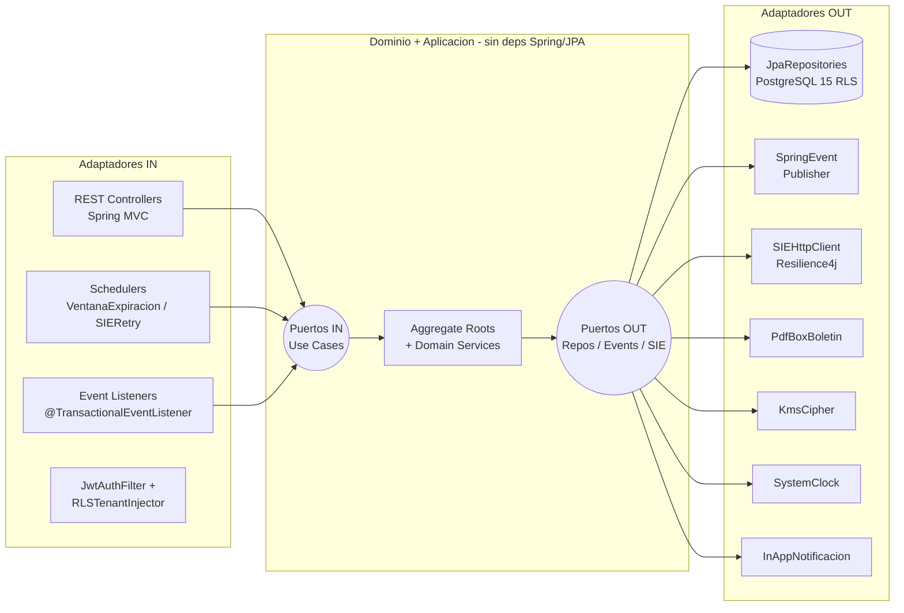

# Arquitectura Hexagonal del Core — EduSync

| Campo | Valor |
|-------|-------|
| **Producto** | EduSync |
| **Grupo** | G-EduSync |
| **Versión del documento** | v0.1 |
| **Fecha** | 24/05/2026 |
| **Autor** | Rodrigo Aspeti — Dev Lead / PM |
| **Estado** | Borrador |
| **Stack** | Java 21 · Spring Boot 3.3 · Spring Security 6 · Spring Data JPA · Angular 17 · PostgreSQL 15 |
| **Insumos** | `docs/fsd/FSD_EduSync.md` v1.0 · `docs/prd/PRD_EduSync.md` v1.0 · `docs/LFSD-EduSync.md` v1.0 · `docs/arquitectura_funcional_EduSync.md` (DA-01..DA-05) |
| **Prompt aplicado** | `PR-HEX-001` (pendiente de registro en `docs/PROMPT_MAPPING.md`) |
| **Trazabilidad** | FSD-UC-001..010 · BR-001..BR-012 · DA-01..DA-05 |

---

## 0. Propósito

Documento de **diseño técnico** que materializa la arquitectura hexagonal (Ports & Adapters) del core de EduSync. Identifica los puertos de entrada (casos de uso), puertos de salida (persistencia, mensajería, terceros), adaptadores asociados y *Aggregate Roots* con sus invariantes verificables.

Este documento es **contrato técnico de bajo nivel** y debe ser leído por `dev-agent`, `arch-agent` y `qa-agent` antes de implementar cualquier `FSD-UC-NNN`.

---

## 1. Mapa hexagonal a alto nivel



### 1.1 Estructura de paquetes Java

```
bo.edusync/
├── domain/
│   ├── model/                ← Aggregate Roots, Entities, Value Objects
│   │   ├── gestion/          ← GestionAcademica, Anio (VO)
│   │   ├── periodo/          ← PeriodoAcademico, ParametroAcademico, RangoCalificacion (VO)
│   │   ├── nomina/           ← Estudiante, Rude (VO), PiiCifrado (VO)
│   │   ├── calificacion/     ← Calificacion (append-only), Dimension (VO), ValorCalificacion (VO)
│   │   ├── consolidacion/    ← Centralizador, PuntajeTotal (VO), EstadoCentralizador (VO)
│   │   ├── exportacion/      ← ExportacionSIE, ClaveIdempotencia (VO)
│   │   ├── correccion/       ← CorreccionRetroactiva, Ventana (VO), Justificacion (VO)
│   │   └── auditoria/        ← AuditLogEntry, Accion (VO), Snapshot (VO)
│   ├── port/
│   │   ├── in/               ← 20 puertos IN (UseCase interfaces)
│   │   └── out/              ← 16 puertos OUT (Repository, EventPublisher, etc.)
│   └── service/              ← Domain Services (CalificacionDomainService, ConsolidacionDomainService...)
├── application/              ← Implementaciones de port.in (UseCaseService)
│   ├── auth/
│   ├── periodo/
│   ├── calificacion/
│   ├── consolidacion/
│   ├── exportacion/
│   └── correccion/
└── infrastructure/
    └── adapter/
        ├── in/
        │   ├── web/          ← REST Controllers (Spring MVC)
        │   ├── scheduler/    ← VentanaExpiracionScheduler, SIERetryScheduler
        │   ├── messaging/    ← MateriaCerradaListener
        │   └── security/     ← JwtAuthFilter, RLSTenantInjector
        └── out/
            ├── persistence/  ← JpaXxxRepository (Spring Data JPA)
            ├── messaging/    ← SpringEventPublisherAdapter
            ├── integration/
            │   ├── sie/      ← SIEHttpClientAdapter (Resilience4j)
            │   ├── pdf/      ← PdfBoxBoletinAdapter
            │   ├── kms/      ← AwsKmsCipherAdapter
            │   └── notif/    ← InAppNotificacionAdapter
            ├── security/     ← SpringSecurityTenantContextAdapter
            ├── time/         ← SystemClockAdapter
            └── audit/        ← AuditLogAspect (AOP)
```

---

## 2. Puertos de entrada (use cases / driving ports)

> Paquete: `bo.edusync.domain.port.in`. Interfaces sin dependencias de Spring/JPA. Implementadas por `application/<UseCase>Service`.

| # | Puerto IN | FSD-UC | Actor invocador | Comando / Respuesta | BR aplicables |
|---|-----------|--------|-----------------|---------------------|---------------|
| 1 | `AutenticarUsuarioUseCase` | FSD-UC-001 (precondición) | Todos | `LoginCommand → AuthTokenResult` | DA-01 (tenant_id en JWT) |
| 2 | `AdministrarGestionAcademicaUseCase` | FSD-UC-009 | Director | `CrearGestionCommand → GestionId` | BR-006 |
| 3 | `ConfigurarParametrosPeriodoUseCase` | FSD-UC-009 | Director | `ConfigurarPeriodoCommand → void` | BR-002, BR-007 |
| 4 | `AsignarDocenteMateriaUseCase` | FSD-UC-009 | Director | `AsignacionCommand → void` | BR-001 |
| 5 | `AbrirPeriodoUseCase` | FSD-UC-009 | Director | `AbrirPeriodoCommand → EstadoPeriodo` | BR-006, BR-007 |
| 6 | `CerrarPeriodoUseCase` | FSD-UC-009 | Director | `CerrarPeriodoCommand → ResultadoCierre` | BR-006 |
| 7 | `GestionarNominaUseCase` | FSD-UC-006 | Secretaría | `AltaEstudianteCommand / BajaCommand / TransferenciaCommand → void` | BR-004, BR-012 |
| 8 | `RegistrarCalificacionUseCase` | FSD-UC-001 | Docente | `RegistrarCalificacionCommand → CalificacionId` | BR-001, BR-002, BR-004, BR-007 |
| 9 | `CerrarMateriaUseCase` | FSD-UC-002 | Docente | `CerrarMateriaCommand → ResultadoCierre` | BR-001, completitud 100 % |
| 10 | `ConsolidarCentralizadorUseCase` | FSD-UC-003 | Sistema (evento) | `ConsolidarCommand → CentralizadorId (PROVISIONAL)` | BR-003, BR-008, BR-011 |
| 11 | `OficializarCentralizadorUseCase` | FSD-UC-003 | Director | `OficializarCommand → EstadoCentralizador` | BR-008, BR-011 |
| 12 | `ExportarSIEUseCase` | FSD-UC-004 | Secretaría | `ExportarCommand → ExportacionId` | BR-004, DA-05 |
| 13 | `ReintentarExportacionSIEUseCase` | FSD-UC-004 | Scheduler | `ReintentarCommand → ResultadoReintento` | DA-05 |
| 14 | `SolicitarCorreccionUseCase` | FSD-UC-005 | Docente | `SolicitudCorreccionCommand → SolicitudId` | BR-005, BR-009 |
| 15 | `AutorizarCorreccionUseCase` | FSD-UC-005 | Director | `AutorizacionCommand (ventanaHoras 1-72) → AutorizacionId` | BR-005, BR-009 |
| 16 | `AplicarCorreccionUseCase` | FSD-UC-005 | Docente | `CorreccionCommand → CalificacionId (nuevo)` | BR-005 (append-only), BR-010 |
| 17 | `RevocarVentanaExpiradaUseCase` | FSD-UC-005 | Scheduler | `RevocarCommand → void` | BR-009 |
| 18 | `GenerarBoletinPdfUseCase` | FSD-UC-007 | Secretaría | `GenerarBoletinCommand → BoletinPdf (bytes)` | BR-008, BR-011 |
| 19 | `RegistrarAsistenciaUseCase` | FSD-UC-008 | Docente | `AsistenciaCommand → void` | BR-001 |
| 20 | `ConsultarIndicadoresUseCase` | FSD-UC-010 | Director / Secretaría | `IndicadoresQuery → IndicadoresDTO` | BR-011 (separación trim./anual) |

---

## 3. Puertos de salida (driven ports)

> Paquete: `bo.edusync.domain.port.out`. Interfaces puras del dominio. Implementadas por adaptadores en `infrastructure/`.

| # | Puerto OUT | Categoría | Responsabilidad | Usado por |
|---|------------|-----------|----------------|-----------|
| 1 | `GestionAcademicaRepository` | Persistencia | Persistir y recuperar gestión + sus periodos hijos | UC-09, UC-10 |
| 2 | `PeriodoRepository` | Persistencia | Persistir periodo + parámetros + asignaciones | UC-09 |
| 3 | `EstudianteRepository` | Persistencia | Buscar por RUDE (clave canónica BR-004) | UC-01, UC-04, UC-05, UC-06 |
| 4 | `MateriaAsignacionRepository` | Persistencia | Verificar asignación docente↔materia BR-001 | UC-01, UC-05 |
| 5 | `CalificacionRepository` | Persistencia | Insert append-only; buscar por RUDE+materia+periodo | UC-01, UC-05, UC-03 |
| 6 | `CentralizadorRepository` | Persistencia | PROVISIONAL sobreescribible; OFICIAL inmutable | UC-03, UC-04, UC-07 |
| 7 | `ExportacionSIERepository` | Persistencia | Persistir cabecera + registros idempotentes por `rude+periodo_id` | UC-04 |
| 8 | `CorreccionRetroactivaRepository` | Persistencia | Solicitud + autorización + ventana | UC-05 |
| 9 | `AuditLogRepository` | Persistencia | INSERT append-only en misma TX BR-010 | Todos |
| 10 | `DomainEventPublisher` | Mensajería | Publicar `CalificacionRegistradaEvent`, `MateriaCerradaEvent`, `CentralizadorOficialEvent`, `VentanaExpiradaEvent` | UC-01, UC-02, UC-03, UC-05 |
| 11 | `SIEExportPort` | Tercero | `POST /registro/{rude}` con circuit breaker + retry DA-05 | UC-04 |
| 12 | `BoletinPdfPort` | Tercero | Renderizar PDF desde `Centralizador OFICIAL` (PDFBox) | UC-07 |
| 13 | `KmsCipherPort` | Tercero (seguridad) | Cifrar/descifrar PII de `Estudiante` (RUDE, nombre, fecha_nacimiento) NFR-007 | UC-06, UC-04 |
| 14 | `NotificacionPort` | Tercero | Alertas in-app (vencimiento ventana, cambios estado periodo) | UC-05, UC-09 |
| 15 | `TenantContextProvider` | Seguridad | Resolver `tenant_id` del SecurityContext (RLS injection) DA-01 | Todos los UC de escritura |
| 16 | `ClockPort` | Tiempo | `now()` controlado para tests determinísticos (golden tests) | UC-05 (ventanas), UC-09 (apertura) |

---

## 4. Adaptadores (in y out) ↔ puerto que implementan

> Paquete: `bo.edusync.infrastructure.adapter.{in|out}.<categoria>`. Aquí viven las dependencias de Spring/JPA/AWS/PDFBox.

### 4.1 Adaptadores IN (driving)

| Adaptador | Tecnología | Implementa puerto(s) IN | Ubicación |
|-----------|-----------|--------------------------|-----------|
| `AuthController` | Spring MVC + Spring Security 6 | `AutenticarUsuarioUseCase` | `infrastructure/adapter/in/web/auth/` |
| `PeriodoController` | Spring MVC | UC-2, 3, 4, 5, 6 (administración periodo) | `infrastructure/adapter/in/web/periodo/` |
| `NominaController` | Spring MVC | UC-7 (`GestionarNominaUseCase`) | `infrastructure/adapter/in/web/nomina/` |
| `CalificacionController` | Spring MVC | UC-8 (`RegistrarCalificacionUseCase`) | `infrastructure/adapter/in/web/calificacion/` |
| `MateriaController` | Spring MVC | UC-9 (`CerrarMateriaUseCase`) | `infrastructure/adapter/in/web/materia/` |
| `CentralizadorController` | Spring MVC | UC-11 (`OficializarCentralizadorUseCase`), UC-20 (`ConsultarIndicadoresUseCase`) | `infrastructure/adapter/in/web/centralizador/` |
| `SIEExportController` | Spring MVC | UC-12 (`ExportarSIEUseCase`) | `infrastructure/adapter/in/web/sie/` |
| `CorreccionController` | Spring MVC | UC-14, 15, 16 (workflow corrección) | `infrastructure/adapter/in/web/correccion/` |
| `BoletinController` | Spring MVC | UC-18 (`GenerarBoletinPdfUseCase`) | `infrastructure/adapter/in/web/boletin/` |
| `AsistenciaController` | Spring MVC | UC-19 (`RegistrarAsistenciaUseCase`) | `infrastructure/adapter/in/web/asistencia/` |
| `MateriaCerradaListener` | `@TransactionalEventListener(AFTER_COMMIT)` | UC-10 (`ConsolidarCentralizadorUseCase`) | `infrastructure/adapter/in/messaging/` |
| `VentanaExpiracionScheduler` | `@Scheduled(fixedDelay=60_000)` | UC-17 (`RevocarVentanaExpiradaUseCase`) | `infrastructure/adapter/in/scheduler/` |
| `SIERetryScheduler` | `@Scheduled(cron="0 */5 * * * *")` | UC-13 (`ReintentarExportacionSIEUseCase`) | `infrastructure/adapter/in/scheduler/` |
| `JwtAuthFilter` | Spring Security 6 | (no implementa UC; alimenta `TenantContextProvider`) | `infrastructure/adapter/in/security/` |
| `RLSTenantInjector` | Hibernate `StatementInspector` | (interceptor que ejecuta `SET LOCAL app.tenant_id` antes de cada TX) | `infrastructure/adapter/in/security/` |

### 4.2 Adaptadores OUT (driven)

| Adaptador | Tecnología | Implementa puerto OUT | Ubicación |
|-----------|-----------|------------------------|-----------|
| `JpaGestionAcademicaRepository` | Spring Data JPA + Hibernate | `GestionAcademicaRepository` | `infrastructure/adapter/out/persistence/` |
| `JpaPeriodoRepository` | Spring Data JPA | `PeriodoRepository` | `infrastructure/adapter/out/persistence/` |
| `JpaEstudianteRepository` | Spring Data JPA + KMS converter | `EstudianteRepository` | `infrastructure/adapter/out/persistence/` |
| `JpaMateriaAsignacionRepository` | Spring Data JPA | `MateriaAsignacionRepository` | `infrastructure/adapter/out/persistence/` |
| `JpaCalificacionRepository` | Spring Data JPA (`@Immutable` en filas históricas) | `CalificacionRepository` | `infrastructure/adapter/out/persistence/` |
| `JpaCentralizadorRepository` | Spring Data JPA (split PROVISIONAL/OFICIAL) | `CentralizadorRepository` | `infrastructure/adapter/out/persistence/` |
| `JpaExportacionSIERepository` | Spring Data JPA + uniqueness `(rude, periodo_id)` | `ExportacionSIERepository` | `infrastructure/adapter/out/persistence/` |
| `JpaCorreccionRetroactivaRepository` | Spring Data JPA | `CorreccionRetroactivaRepository` | `infrastructure/adapter/out/persistence/` |
| `JpaAuditLogRepository` | Spring Data JPA + `@Immutable` + RULE PostgreSQL | `AuditLogRepository` | `infrastructure/adapter/out/persistence/` |
| `SpringEventPublisherAdapter` | `ApplicationEventPublisher` | `DomainEventPublisher` | `infrastructure/adapter/out/messaging/` |
| `SIEHttpClientAdapter` | Spring `RestClient` + Resilience4j (CB 50 % / timeout 30 s / retry 3) | `SIEExportPort` | `infrastructure/adapter/out/integration/sie/` |
| `PdfBoxBoletinAdapter` | Apache PDFBox + plantilla ministerial parametrizable | `BoletinPdfPort` | `infrastructure/adapter/out/integration/pdf/` |
| `AwsKmsCipherAdapter` | AWS SDK v2 (`alias/edusync-pii-key`) | `KmsCipherPort` | `infrastructure/adapter/out/integration/kms/` |
| `InAppNotificacionAdapter` | Spring SimpMessagingTemplate / WebSocket | `NotificacionPort` | `infrastructure/adapter/out/integration/notif/` |
| `SpringSecurityTenantContextAdapter` | Spring SecurityContextHolder | `TenantContextProvider` | `infrastructure/adapter/out/security/` |
| `SystemClockAdapter` | `Clock.systemUTC()` | `ClockPort` | `infrastructure/adapter/out/time/` |
| `AuditLogAspect` | Spring AOP `@Around` sobre `*UseCase` | (cross-cutting; usa `AuditLogRepository`) | `infrastructure/adapter/out/audit/` |

---

## 5. Aggregate Roots e invariantes de dominio

> Paquete: `bo.edusync.domain.model.<contexto>`. Sin anotaciones JPA en el AR (DA-02); el mapeo vive en el adaptador JPA.

| # | Aggregate Root | Bounded Context | Entidades / VOs internos | Invariantes de dominio (verificables en CI) | Estado / ciclo de vida |
|---|----------------|-----------------|--------------------------|-----------------------------------------------|------------------------|
| 1 | **`GestionAcademica`** | `gestion` | `Periodo[3]`, `Anio` (VO) | • Exactamente 3 periodos hijos (T1, T2, T3) ordenados<br/>• Solo 1 `ACTIVA` por tenant<br/>• Estado: `CONFIGURANDO → ACTIVA → CERRADA` sin retroceso<br/>• Cierre requiere los 3 periodos en `CERRADO` | `CONFIGURANDO` / `ACTIVA` / `CERRADA` |
| 2 | **`PeriodoAcademico`** | `periodo` | `ParametroAcademico[5]` (1 por dimensión), `AsignacionDocente[*]`, `RangoCalificacion` (VO), `EstadoPeriodo` (VO) | • **BR-006**: apertura secuencial — T2 requiere T1 = `CERRADO`<br/>• **BR-007**: parámetros inmutables desde `ABIERTO`<br/>• `fecha_fin > fecha_inicio`<br/>• Cierre requiere 100 % materias cerradas + asignación completa<br/>• Solo el Director ejecuta `abrir()` / `cerrar()` (RB-04) | `PENDIENTE → CONFIGURADO → ABIERTO → CERRADO` |
| 3 | **`Estudiante`** | `nomina` | `Rude` (VO inmutable), `PiiCifrado` (VO via `KmsCipherPort`), `EstadoEstudiante` (VO) | • **BR-004**: identidad exclusiva por RUDE; RUDE inmutable<br/>• RUDE único por tenant<br/>• Baja = transición a `RETIRADO`; **nunca DELETE** (BR-012)<br/>• PII cifrado en reposo con KMS (NFR-007)<br/>• Reasignación de RUDE prohibida | `ACTIVO / RETIRADO / TRANSFERIDO` |
| 4 | **`Calificacion`** *(append-only)* | `calificacion` | `Dimension` (VO), `ValorCalificacion` (VO con rango paramétrico), `TipoCalificacion` (VO REGULAR/AYUDA), `RegistroPadreId` (VO opcional) | • **BR-001**: requiere `AsignacionDocente` válida<br/>• **BR-002**: `valor ∈ [rango_min, rango_max]` del `ParametroAcademico`<br/>• **BR-004**: vinculación a `Estudiante` solo por RUDE<br/>• **BR-005**: registro original **nunca** se actualiza; modificación retroactiva crea nuevo registro con `registro_padre_id` (RB-10)<br/>• `timestamp_utc` generado por sistema, inmutable | Append-only — versionado por linaje `registro_padre_id` |
| 5 | **`Centralizador`** | `consolidacion` | `CentralizadorRegistro[*]` (por estudiante), `PuntajeTotal` (VO entero), `EstadoCentralizador` (VO) | • **BR-008**: cálculo de promedios **exclusivo** del dominio (no SQL, no front)<br/>• **BR-003**: único truncado permitido = `Math.floor()` — nunca `round`, `HALF_UP`, `CEILING`<br/>• **BR-011**: `PromedioAnual` solo si los 3 periodos están `CERRADO`<br/>• Estado `OFICIAL` es inmutable (`@Immutable` en adaptador JPA)<br/>• Estado `PROVISIONAL` se sobreescribe ante nueva `CalificacionRegistradaEvent` | `PROVISIONAL → OFICIAL` (sin retroceso) |
| 6 | **`ExportacionSIE`** | `exportacion` | `ExportacionRegistro[*]`, `ClaveIdempotencia` (VO = `Rude + PeriodoId`), `EstadoExportacion` (VO) | • **BR-004**: payload identifica al estudiante solo por RUDE<br/>• **DA-05**: idempotencia por `(rude, periodo_id)` — el adaptador SIE NUNCA reenvía duplicados<br/>• Solo se permite desde `Centralizador.estado = OFICIAL`<br/>• Estado: `EN_PROGRESO → COMPLETA / PARCIAL / FALLIDA`<br/>• Registros excluidos con motivo explícito: `EXCLUIDO_SIN_RUDE`, `EXCLUIDO_NOTA_INCOMPLETA` | `EN_PROGRESO → {COMPLETA, PARCIAL, FALLIDA}` |
| 7 | **`CorreccionRetroactiva`** *(workflow)* | `correccion` | `SolicitudCorreccion`, `AutorizacionCorreccion`, `Ventana` (VO con `inicio`, `fin`, `duracionHoras ∈ [1..72]`), `Justificacion` (VO ≥ 20 chars) | • **BR-005**: sin autorización válida + ventana activa → no se permite escritura en periodo cerrado<br/>• **BR-009**: `1 ≤ duracion_horas ≤ 72`; no existen autorizaciones indefinidas<br/>• Solo el Director autoriza (RB-04)<br/>• Revocación es **automática** post `ventana_fin` (sin intervención)<br/>• Alcance: `ESTUDIANTE_ESPECIFICO` o `CURSO_COMPLETO` | Solicitud: `PENDIENTE → APROBADA / RECHAZADA`<br/>Autorización: `ACTIVA → EXPIRADA / COMPLETADA` |
| 8 | **`AuditLogEntry`** *(append-only)* | `auditoria` | `Accion` (VO enum cerrado), `Snapshot` (VO JSONB anterior/nuevo), `TenantId` (VO), `ActorId` (VO) | • **BR-010**: tabla **inalterable** — sin `UPDATE` ni `DELETE` (protección por `RULE` PostgreSQL + `@Immutable` Hibernate)<br/>• Escritura **siempre** en la misma TX que la entidad afectada (vía `AuditLogAspect`)<br/>• `timestamp_utc` generado por sistema, inmutable<br/>• `actor_id`, `tenant_id`, `accion`, `entidad_afectada`, `entidad_id` obligatorios | Append-only — sin transiciones |

---

## 6. Materialización de las Decisiones Arquitectónicas (DA ↔ hexagonal)

| Decisión | Cómo se materializa en la arquitectura hexagonal |
|----------|---------------------------------------------------|
| **DA-01** Multitenancy RLS | `TenantContextProvider` (puerto OUT) + `RLSTenantInjector` (adapter Hibernate) ejecutan `SET LOCAL app.tenant_id` antes de cada TX. El dominio no conoce RLS. |
| **DA-02** Parametrización en BD | `PeriodoAcademico` agrega `ParametroAcademico` como entidad hija; el rango se evalúa en el dominio antes de persistir (`ValorCalificacion` VO). |
| **DA-03** `audit_log` inmutable | `AuditLogRepository` (puerto OUT) + `AuditLogAspect` (AOP cross-cutting) garantizan BR-010 sin contaminar el dominio. |
| **DA-04** Consolidación async | `MateriaCerradaEvent` publicado vía `DomainEventPublisher`; `MateriaCerradaListener` dispara `ConsolidarCentralizadorUseCase` con `@TransactionalEventListener(AFTER_COMMIT)`. Migrable a SQS sin tocar el dominio. |
| **DA-05** Resiliencia SIE | `SIEExportPort` (puerto OUT) + `SIEHttpClientAdapter` (Resilience4j) + `SIERetryScheduler` (puerto IN scheduler). El dominio solo expone `ExportarSIEUseCase`; la resiliencia es un detalle del adaptador. |

---

## 7. Eventos de dominio publicados

| Evento | Productor (UseCase) | Consumidor (Listener) | Garantía | Idempotencia |
|--------|--------------------|-----------------------|----------|---------------|
| `CalificacionRegistradaEvent` | `RegistrarCalificacionUseCase` | `MateriaCerradaListener` (si materia cerrada) | at-least-once | Por `calificacion_id` |
| `MateriaCerradaEvent` | `CerrarMateriaUseCase` | `MateriaCerradaListener` → `ConsolidarCentralizadorUseCase` | at-least-once, AFTER_COMMIT | Por `(materia_id, periodo_id)` |
| `CentralizadorOficialEvent` | `OficializarCentralizadorUseCase` | `ExportarSIEListener` (opcional) | at-least-once | Por `centralizador_id` |
| `VentanaExpiradaEvent` | `RevocarVentanaExpiradaUseCase` (scheduler) | `NotificacionPort` | exactly-once | Por `autorizacion_id` |

---

## 8. Checklist de implementación (sirve a `dev-agent`)

- [ ] `domain/` no importa nada de `org.springframework.*`, `jakarta.persistence.*`, `com.amazonaws.*`.
- [ ] Cada `*UseCase` del puerto IN tiene un test unitario que stubea los puertos OUT (sin Spring context).
- [ ] Cada Aggregate Root tiene un test de invariantes (al menos un caso por cada `BR-NNN` listada en §5).
- [ ] `AuditLogAspect` está activo en CI; `AuditLogTest` verifica que toda escritura genera entrada en `audit_log` en la misma TX.
- [ ] `FloorTest.floor_64_666_equals_64` (golden test BR-003) está en verde.
- [ ] `MultitenantTest.no_cross_tenant_data` (golden test DA-01) está en verde.
- [ ] `SIEPayloadTest.payload_uses_rude_only` (golden test BR-004) está en verde.
- [ ] `VentanaTest.expired_window_returns_403` (golden test BR-009) está en verde.

---

## 9. Trazabilidad con artefactos previos

| Origen | Sección consumida | Cómo se refleja aquí |
|--------|-------------------|----------------------|
| `FSD_EduSync.md` §4.1–§4.5 | FSD-UC-001..009 | Cada UC tiene un puerto IN en §2 |
| `FSD_EduSync.md` §5 | BR-001..BR-012 | Aparecen como invariantes en §5 |
| `FSD_EduSync.md` §6.1 | Modelo ER (16 entidades) | Mapeadas a 8 Aggregate Roots en §5 |
| `arquitectura_funcional_EduSync.md` | DA-01..DA-05 | Materialización en §6 |
| `LFSD-EduSync.md` §2–§3 | Estructura de paquetes hexagonal | Refinada en §1.1 |
| `PRD_EduSync.md` §Constitution | 5 principios no negociables | Reflejados en invariantes §5 (RUDE, floor, tenant, audit, ventana) |

---

## 10. Registro de cambios

| Versión | Fecha | Autor | Cambios |
|---------|-------|-------|---------|
| v0.1 | 24/05/2026 | Rodrigo Aspeti | Versión inicial — 4 tablas: 20 puertos IN, 16 puertos OUT, 32 adaptadores in/out, 8 Aggregate Roots con invariantes BR-001..BR-012 y DA-01..DA-05. Diagrama de paquetes Java y mapa hexagonal Mermaid. Trazabilidad FSD-UC ↔ puerto IN ↔ aggregate. |
