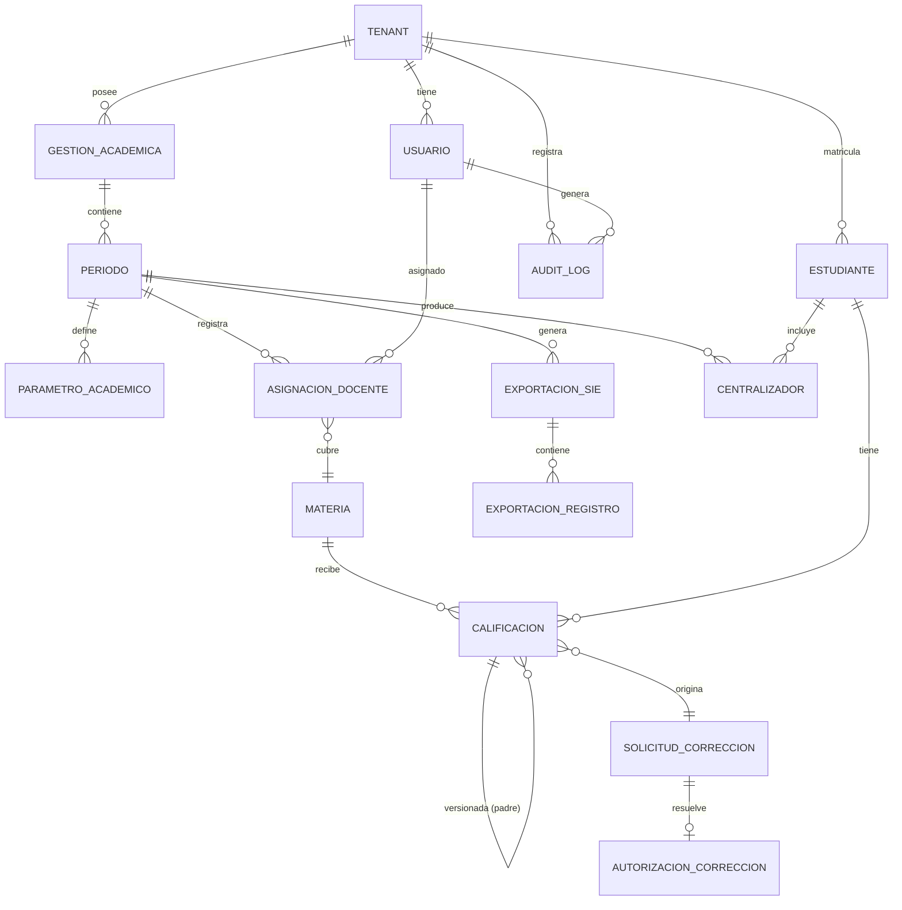

> COPIA CONGELADA - release/2.0.0
>
> Este archivo es un snapshot inmutable de docs/fsd/FSD_EduSync.md (version v1.0) congelado el 28/05/2026 por el contrato prompts/PR-VFINAL-001.md para la entrega del Modulo 4.
>
> **No editar este archivo.** Para cambios normativos:
> 1. Modifica el documento canonico (docs/fsd/FSD_EduSync.md).
> 2. Regenera este alias mediante PR-VFINAL-001 o sync-doc-chain en su pasada de release.
>
> | Campo | Valor |
> |-------|-------|
> | Fuente canonica | docs/fsd/FSD_EduSync.md |
> | Version congelada | v1.0 |
> | Fecha de freeze | 28/05/2026 |
> | Release | release/2.0.0 |
> | Prompt origen | prompts/PR-VFINAL-001.md |
> | Agente | docs-agent |
> | **Status** | **congelado** — baseline inmutable de M4 (`plantillas/plantillas3/MODELO_DOCUMENTAL_IMPLEMENTACION.md`). Continuación viva: `docs/product/FSD.md` (modo LFSD ⚡). |

---
# Functional Specification Document (FSD) — EduSync

---

## 0. Metadatos ⚡🔧

| Campo | Valor |
|-------|-------|
| **Producto** | EduSync |
| **Grupo** | G-EduSync |
| **Versión del documento** | v1.0 |
| **Fecha** | 15/05/2026 |
| **Autores** | Rodrigo Aspeti — Dev Lead / PM |
| **Revisores** | Docente + 1 grupo par |
| **Estado** | En revisión |
| **Modo elegido** | **FSD Clásico 🔧** |
| **Trazabilidad a PRD** | `docs/PRD_EduSync.md` (v1.0) |
| **Insumos M2 (UI/UX)** | Sistema Atomic Design · Design Tokens · Semáforos visuales de reprobación · WCAG 2.2 AA |
| **Fase Spec Kit cubierta** | Specify ✅ / Plan ✅ / Tasks ✅ / Implement ⬜ |
| **Prompts utilizados** | `PR-ARCH-001`, `PR-BRD-002`, `PR-DIAG-001`, `PR-DIAG-002` (ver `docs/PROMPT_MAPPING.md`) |

---

## 1. Resumen ejecutivo ⚡🔧

EduSync es una plataforma SaaS B2B multitenant de gestión académica construida sobre Java 21, Spring Boot 3.3, PostgreSQL 15 y Angular 17, desplegada en AWS. Su misión técnica es eliminar la "triple digitación manual" que obliga al personal de colegios bolivianos a trabajar de madrugada para cumplir con los plazos del Sistema de Información Educativa (SIE) del Ministerio de Educación.

El sistema descentraliza el registro de calificaciones por rol (RBAC estricto): cada Docente ingresa notas únicamente en sus materias asignadas, con validación paramétrica en tiempo real. Un motor de consolidación algorítmico calcula promedios trimestrales aplicando el criterio `floor` como única regla de truncado, garantizando consistencia con la escala del SIE. La Secretaría exporta masivamente al SIE con un clic, con resiliencia ante fallos parciales mediante reintentos idempotentes por `rude + periodo_id`. El Director administra la gestión académica anual, define parámetros configurables por periodo y autoriza correcciones retroactivas con ventanas temporales de 1–72 horas.

Todo el ciclo queda sellado en un `audit_log` append-only inalterable, con aislamiento multitenant mediante Row-Level Security en PostgreSQL. El diseño arquitectónico sigue los principios de arquitectura hexagonal con separación Domain / Application / Infrastructure, garantizando que ningún cálculo de promedios ni conversión de escala SIE ocurra fuera del motor de dominio.

---

## 2. Alcance ⚡🔧

### 2.1 Dentro del alcance

- Autenticación JWT con RBAC (DIRECTOR / SECRETARÍA / DOCENTE) y aislamiento multitenant por `tenant_id`.
- Administración de gestión académica anual: creación, calendario de 3 trimestres, parámetros, asignación docente-materia, apertura/cierre secuencial.
- Registro de calificaciones por dimensión con validación paramétrica en tiempo real (tipo REGULAR / AYUDA).
- Cierre atómico de materia con verificación de completitud al 100 %.
- Motor de consolidación algorítmico: vista provisional continua (`PROVISIONAL`) y centralizador oficial (`CERRADO`) con criterio `floor`.
- Exportación masiva al SIE por RUDE con idempotencia y reintentos asíncronos ante fallos.
- Flujo de modificaciones retroactivas: solicitud, autorización jerárquica, ventana temporal, revocación automática, modelo append-only.
- Gestión de nóminas estudiantiles con identidad exclusiva por RUDE.
- Generación de boletines PDF desde centralizador cerrado.
- Control de asistencia por materia.
- Dashboard de indicadores institucionales con separación trimestral / anual.
- Log de auditoría inalterable para toda operación de escritura.

### 2.2 Fuera del alcance (explícito)

- Módulo de comunicación con padres (previsto en v1.2).
- Gestión de finanzas / cobro de pensiones (v2.0).
- Módulo de matrícula digital — el RUDE llega preregistrado al sistema.
- Aplicación móvil nativa (iOS/Android) — v2.0; el v1.0 es web responsiva.
- Integración con sistemas de nómina de personal docente.
- Módulo de benchmark anónimo entre colegios (v1.2).

### 2.3 Supuestos y dependencias

**Supuestos técnicos:**
- Cada estudiante posee un código RUDE único y válido asignado por el Ministerio antes del onboarding.
- El servidor SIE acepta payloads en el formato ministerial vigente (HTTP/REST); el formato exacto es parametrizable en BD sin redespliegue.
- Los colegios tienen conectividad a internet suficiente para operar la interfaz web (no se requiere modo offline).
- PostgreSQL 15 soporta RLS con `tenant_id` sin degradación de rendimiento a escala de colegios medianos (< 1.000 estudiantes, < 50 materias).

**Dependencias externas:**
- SIE (Ministerio de Educación Bolivia): endpoint HTTP de exportación de calificaciones. Sin garantía de idempotencia; alta tasa de fallos en horario pico.
- AWS (RDS PostgreSQL, EC2, SQS en v1.1): infraestructura de hosting y mensajería.
- Motor de PDF (Apache PDFBox): generación de boletines con plantilla ministerial.
- Proveedor de notificaciones in-app: alertas de vencimiento de ventana y cambios de estado.

### 2.4 Plan técnico 🔧

| Bloque | Contenido |
|--------|-----------|
| **Stack tecnológico** | Java 21 LTS · Spring Boot 3.3 · Spring Security 6 (JWT + RBAC) · Spring Data JPA · PostgreSQL 15 (RLS) · Angular 17 · AWS (RDS db.t3.medium, EC2 t3.small) · Apache PDFBox |
| **Arquitectura prevista** | Hexagonal (Ports & Adapters) con separación en capas: `domain/` (entidades, servicios de dominio, reglas) · `application/` (casos de uso, ports) · `infrastructure/` (JPA adapters, REST controllers, SIE client) · `frontend/` (Angular SPA con Design System Atomic Design) |
| **Project structure** | `backend/src/main/java/bo/edusync/{domain,application,infrastructure}/` · `frontend/src/app/{modules,shared,core}/` · `docs/fsd/`, `docs/adr/`, `docs/diagramas/` · `infra/` (Docker Compose, Flyway migrations) |
| **Decisiones técnicas anticipadas** | DA-01: RLS PostgreSQL con `tenant_id` · DA-02: parámetros académicos en BD sin redespliegue · DA-03: `audit_log` append-only con Hibernate Envers en entidades críticas · DA-04: consolidación asíncrona con Spring Events (migrable a SQS) · DA-05: idempotencia SIE por `rude+periodo_id` |
| **Restricciones técnicas** | Stack Java/Spring obligatorio (sin alternativas). El `audit_log` es inalterable: sin UPDATE ni DELETE. El cálculo de `floor` y la conversión SIE solo ocurren en la capa de dominio. |

### 2.5 Descomposición en Tasks (Spec Kit) ⚡🔧

| Task ID | Descripción | Caso de uso (FSD-UC) | Dependencias | Prompt asociado | Estado |
|---------|-------------|----------------------|--------------|-----------------|--------|
| T-001 | Setup multitenant: configurar RLS en PostgreSQL + inyección de `tenant_id` en SecurityContext de Spring | FSD-UC-001 | — | PR-ARCH-001 | pendiente |
| T-002 | Módulo de Autenticación: JWT issue/validate + RBAC con Spring Security | FSD-UC-001 | T-001 | PR-UC-001 | pendiente |
| T-003 | CRUD Gestión Académica + 3 periodos + validación de apertura secuencial | FSD-UC-009 | T-002 | PR-UC-009 | pendiente |
| T-004 | Motor de parámetros: tabla `parametro_academico` + API de configuración por periodo | FSD-UC-009 | T-003 | PR-UC-009 | pendiente |
| T-005 | Asignación docente-materia + verificación de cobertura antes de apertura | FSD-UC-009 | T-003 | PR-UC-009 | pendiente |
| T-006 | Endpoint POST /calificaciones con validación paramétrica en tiempo real | FSD-UC-001 | T-004, T-005 | PR-UC-001 | pendiente |
| T-007 | Motor de consolidación: PROMEDIO_SIMPLE + floor + estado PROVISIONAL/OFICIAL | FSD-UC-003 | T-006 | PR-UC-003 | pendiente |
| T-008 | Cierre atómico de materia: verificación completitud + transición SOLO_LECTURA | FSD-UC-002 | T-006, T-007 | PR-UC-002 | pendiente |
| T-009 | Exportación masiva SIE: payload RUDE + idempotencia + reintentos asíncronos | FSD-UC-004 | T-007, T-008 | PR-UC-004 | pendiente |
| T-010 | Flujo de modificaciones retroactivas: solicitud + autorización + ventana temporal + revocación automática | FSD-UC-005 | T-006, T-008 | PR-UC-005 | pendiente |
| T-011 | Gestión de nóminas estudiantiles: alta/baja/transferencia por RUDE | FSD-UC-006 | T-002 | PR-UC-001 | pendiente |
| T-012 | Generación de boletines PDF con plantilla ministerial parametrizable | FSD-UC-007 | T-007 | PR-ADR-001 | pendiente |
| T-013 | Dashboard Director: indicadores trimestrales vs. anuales con separación estricta | FSD-UC-010 | T-007 | PR-INF-001 | pendiente |
| T-014 | `audit_log` append-only: AOP interceptor + Hibernate Envers en entidades críticas | Todos los FSD-UC | T-001 | PR-AUD-001 | pendiente |

---

## 3. Actores y roles del sistema ⚡🔧

| Actor | Tipo | Responsabilidad principal | Permisos clave |
|-------|------|---------------------------|----------------|
| **DIRECTOR** | Humano | Administrar la gestión académica anual: crear la gestión, definir parámetros, asignar docentes, abrir/cerrar periodos secuencialmente, autorizar correcciones retroactivas, visualizar indicadores institucionales | Escritura en gestión académica, periodos, parámetros, asignaciones, autorizaciones; lectura de todos los datos del tenant |
| **SECRETARÍA** | Humano | Gestionar nóminas estudiantiles, monitorizar avance de carga docente, exportar al SIE, generar boletines PDF, administrar altas/bajas/transferencias | Escritura en nóminas, exportación SIE, boletines; lectura de centralizadores y asistencia; sin acceso a parámetros ni periodos |
| **DOCENTE** | Humano | Registrar calificaciones y asistencia en sus materias asignadas, cerrar materia, solicitar correcciones retroactivas | Escritura restringida a sus materias+dimensiones; lectura de su materia y nómina en solo lectura; sin acceso a otras materias ni datos del Director |
| **Motor de Consolidación** | Sistema (Spring Event) | Calcular promedios trimestrales y anuales con criterio `floor` al dispararse el cierre de la última materia de un curso | Lectura de calificaciones cerradas; escritura en tabla `centralizador` (solo el motor) |
| **Motor de Exportación SIE** | Sistema (proceso asíncrono) | Construir el payload SIE por RUDE y gestionar reintentos idempotentes ante fallos del servidor ministerial | Lectura de centralizador CERRADO; escritura en tabla `exportacion_registro`; invocación HTTP al SIE |
| **Scheduler de Ventanas** | Sistema (Spring Scheduler) | Revocar automáticamente las ventanas de corrección retroactiva expiradas y enviar alertas a 30 min del vencimiento | Escritura en `autorizacion_correccion` (estado); envío de notificaciones in-app |
| **compliance-agent** | Agente IA | Validar que ningún output de dev-agent viole las invariantes regulatorias del SIE (RUDE, floor, rangos) antes del merge | Solo lectura de artefactos del repositorio + ejecución de golden tests |

---

## 4. Casos de uso funcionales ⚡🔧

---

### 4.1 FSD-UC-001 — Registro descentralizado de calificaciones por dimensión

- **Trazabilidad:** `PRD-REQ-006`, `PRD-REQ-007`, `PRD-US-007`, `PRD-US-008`
- **Actor principal:** Docente
- **Precondiciones:**
  1. El Docente tiene sesión JWT activa con rol DOCENTE y `tenant_id` del colegio.
  2. El periodo está en estado `ABIERTO`.
  3. El Docente está asignado a la materia seleccionada (tabla `asignacion_docente`).
  4. Los parámetros académicos del periodo están configurados (dimensiones, pesos, reglas).
- **Disparador:** El Docente selecciona un estudiante y una dimensión y envía `POST /api/v1/calificaciones`.
- **Flujo principal:**
  1. El sistema valida el JWT y extrae `{tenant_id, user_id, rol}` del SecurityContext.
  2. El sistema verifica que la materia pertenezca al tenant y esté asignada al docente (RBAC).
  3. El sistema verifica que el periodo esté en estado `ABIERTO`.
  4. El sistema recupera el parámetro activo de la dimensión solicitada (`peso_max`, `rango_min`, `rango_max`).
  5. El sistema valida que `valor` ∈ [`rango_min`, `rango_max`].
  6. El sistema persiste el registro `Calificacion` con campos: `{docente_id, materia_id, rude, dimension, indice_evaluacion, tipo (REGULAR|AYUDA), valor, periodo_id, timestamp_utc}`.
  7. El sistema genera entrada en `audit_log`: `{actor: docente_id, accion: CALIFICACION_REGISTRADA, entidad: calificacion.id, valor_anterior: null, valor_nuevo: valor}`.
  8. El motor de consolidación recalcula el promedio provisional del estudiante en esa materia.
  9. El sistema retorna retroalimentación visual: promedio provisional actualizado marcado `PROVISIONAL`.
- **Flujos alternativos / excepciones:**
  - **A1 — Valor fuera de rango:** Si `valor` < `rango_min` o `valor` > `rango_max` → HTTP 422 con `{error: "E_RANGO_INVALIDO", dimension: ..., rango_permitido: [min, max]}`. No se persiste nada.
  - **A2 — Periodo CERRADO o SOLO_LECTURA:** HTTP 409 con `{error: "E_PERIODO_NO_MODIFICABLE"}`.
  - **A3 — RBAC: materia no asignada al docente:** HTTP 403 con `{error: "E_RBAC_VIOLATION"}`. Entrada en `audit_log` tipo `RBAC_VIOLATION`.
  - **A4 — RUDE inválido o nulo:** HTTP 400 con `{error: "E_RUDE_INVALIDO"}`.
  - **A5 — Nota AYUDA sin nota REGULAR previa:** HTTP 422 con `{error: "E_REGULAR_REQUERIDA"}` si la regla del periodo exige nota regular como prerequisito.
- **Postcondiciones:**
  1. Registro `Calificacion` persistido en la base de datos.
  2. Entrada en `audit_log` creada.
  3. Vista provisional del centralizador actualizada.
- **Reglas de negocio aplicables:** BR-001 (RBAC), BR-002 (rangos paramétricos), BR-008 (`floor`), RB-01 (RUDE), RB-02 (límites dimensionales).
- **Datos de entrada:**
  ```json
  {
    "materiaId": "uuid",
    "periodoId": "uuid",
    "rude": "string(10–20)",
    "dimension": "SER|SABER|HACER|DECIDIR|AUTOEVALUACION",
    "indiceEvaluacion": "integer >= 1",
    "tipo": "REGULAR|AYUDA",
    "valor": "decimal(5,2)"
  }
  ```
- **Datos de salida:**
  ```json
  {
    "calificacionId": "uuid",
    "promedioProvisional": { "valor": 67, "estado": "PROVISIONAL" },
    "timestamp": "ISO-8601"
  }
  ```
- **Criterios de aceptación:**

```gherkin
Escenario: Registro válido de nota en dimensión Saber
  Dado un Docente autenticado con materia "Matemáticas 2A" asignada
    Y periodo Trimestre 1 en estado ABIERTO
    Y dimensión Saber configurada con rango [0, 45]
  Cuando envía POST /api/v1/calificaciones con {rude:"1234567", dimension:"SABER", valor:38, tipo:"REGULAR"}
  Entonces el sistema responde HTTP 201
    Y persiste el registro con timestamp UTC
    Y crea entrada en audit_log
    Y retorna promedio provisional actualizado con etiqueta PROVISIONAL

Escenario: Rechazo por valor fuera de rango
  Dado dimensión Ser configurada con rango [0, 5]
  Cuando el Docente envía valor = 7
  Entonces el sistema responde HTTP 422 con error E_RANGO_INVALIDO
    Y no persiste ningún registro
```

---

### 4.2 FSD-UC-003 — Consolidación algorítmica de centralizadores

- **Trazabilidad:** `PRD-REQ-010`, `PRD-REQ-011`, `PRD-US-011`
- **Actor principal:** Sistema (Motor de Consolidación, disparado por evento de dominio)
- **Precondiciones:**
  1. Al menos una materia del curso tiene estado `CERRADO`.
  2. Los parámetros académicos del periodo están configurados (regla de combinación, criterio de truncado).
- **Disparador:** Evento de dominio `MateriaCerradaEvent` publicado por FSD-UC-002 (cierre de materia). En modo previsional, también disparado por cada `CalificacionRegistradaEvent`.
- **Flujo principal (Vista Provisional):**
  1. El motor recibe el evento con `{materia_id, periodo_id, curso_id}`.
  2. El motor recupera todas las calificaciones registradas para el curso en el periodo.
  3. Por cada estudiante y dimensión, aplica la regla de combinación del periodo (`PROMEDIO_SIMPLE`, `SUMA`, o `MEJOR_N`).
  4. Aplica el criterio de truncado `floor(resultado)` al puntaje de cada dimensión.
  5. Suma los puntajes de todas las dimensiones activas para obtener el puntaje total del estudiante.
  6. Escribe el resultado en `centralizador` con estado `PROVISIONAL`.
  7. El resultado se marca visualmente en la UI como `PROVISIONAL — en curso`.
- **Flujo principal (Centralizador Oficial):**
  1. El sistema verifica que el 100 % de las materias del curso en el periodo están en estado `CERRADO`.
  2. Si es así, el motor ejecuta el mismo cálculo sobre las calificaciones cerradas e inmutables.
  3. El centralizador se escribe en `centralizador` con estado `OFICIAL` e inmutable.
  4. Se habilita la generación de boletines para ese curso (FSD-UC-007).
  5. Si el Trimestre 3 también se cierra: el motor calcula el promedio anual = `floor((T1 + T2 + T3) / 3)`.
- **Flujos alternativos / excepciones:**
  - **A1 — Trimestre parcialmente cerrado:** El centralizador permanece en `PROVISIONAL`. La columna de promedio anual muestra `EN CURSO — promedio anual no disponible`.
  - **A2 — Error en el cálculo (división por cero):** El motor registra el error en `audit_log` tipo `CONSOLIDACION_ERROR` y deja el centralizador en estado `ERROR`.
- **Postcondiciones:**
  1. Tabla `centralizador` actualizada con estado `PROVISIONAL` u `OFICIAL`.
  2. Si oficial: boletines habilitados; indicadores del Director actualizados.
- **Reglas de negocio aplicables:** BR-003 (floor), RB-08 (criterio único de truncado), RB-11 (indicadores anuales con 3 trimestres cerrados).
- **Datos de entrada (evento):**
  ```json
  {
    "tipo": "MATERIA_CERRADA",
    "materiaId": "uuid",
    "cursoId": "uuid",
    "periodoId": "uuid",
    "tenantId": "uuid"
  }
  ```
- **Datos de salida:**
  ```json
  {
    "centralizadorId": "uuid",
    "cursoId": "uuid",
    "periodoId": "uuid",
    "estado": "PROVISIONAL|OFICIAL",
    "promedios": [
      { "rude": "1234567", "puntaje": 78, "aprobado": true }
    ],
    "promedioAnual": null
  }
  ```
- **Criterios de aceptación:**

```gherkin
Escenario: Truncado floor correcto
  Dado que un estudiante tiene en Saber evaluación 1 = 40, evaluación 2 = 29, evaluación 3 = 31
    Y la regla de combinación es PROMEDIO_SIMPLE
    Y el peso máximo de Saber es 45
  Cuando el motor consolida
  Entonces promedio_bruto = (40 + 29 + 31) / 3 = 33.333...
    Y el motor aplica floor(33.333) = 33
    Y el puntaje de dimensión Saber = floor(33 * 45 / 100) = floor(14.85) = 14
    Y el resultado almacenado es 14, no 15

Escenario: Promedio anual bloqueado con solo 2 trimestres cerrados
  Dado Trimestre 1 en estado CERRADO y Trimestre 2 en estado CERRADO
    Y Trimestre 3 en estado ABIERTO
  Cuando se consulta el centralizador anual
  Entonces el campo promedioAnual = null
    Y se muestra etiqueta "EN CURSO — promedio anual no disponible"
```

---

### 4.3 FSD-UC-004 — Exportación masiva al SIE por RUDE

- **Trazabilidad:** `PRD-REQ-012`, `PRD-REQ-013`, `PRD-US-012`, `PRD-US-013`
- **Actor principal:** Secretaría
- **Precondiciones:**
  1. Todos los centralizadores del periodo están en estado `OFICIAL` (100 % materias cerradas).
  2. Existe una configuración del formato SIE vigente en la tabla `parametro_sie`.
- **Disparador:** La Secretaría invoca `POST /api/v1/exportaciones/sie` con `{periodoId}`.
- **Flujo principal:**
  1. El sistema valida que todas las materias del periodo y todos los cursos tienen centralizador `OFICIAL`. Si no: HTTP 409 `E_MATERIAS_INCOMPLETAS` con lista de pendientes.
  2. El sistema crea un registro `ExportacionSIE` con estado `EN_PROGRESO` y `exportacion_id`.
  3. Por cada estudiante del periodo (identificado por RUDE):
     a. El sistema aplica el filtro pre-exportación: descarta filas con RUDE nulo/inválido (marca `EXCLUIDO_SIN_RUDE`) y notas nulas en dimensiones requeridas (marca `EXCLUIDO_NOTA_INCOMPLETA`).
     b. Los estudiantes válidos se insertan en `exportacion_registro` con estado `PENDIENTE`.
  4. El motor de exportación procesa los registros `PENDIENTE` de forma asíncrona:
     a. Construye el payload en el formato SIE vigente para cada estudiante.
     b. Invoca el endpoint SIE con el payload del estudiante.
     c. Si respuesta 200: actualiza `exportacion_registro.estado = ENVIADO`.
     d. Si respuesta != 200: actualiza `exportacion_registro.estado = FALLIDO` y registra el error.
  5. Al finalizar todos los registros, el sistema actualiza `ExportacionSIE.estado = COMPLETA` o `PARCIAL` (si hay FALLIDOs).
  6. Genera entrada en `audit_log`: `{actor: secretaria_id, accion: EXPORTACION_SIE, periodo: periodoId, result: COMPLETA|PARCIAL}`.
  7. El sistema retorna el reporte: `{enviados: N, fallidos: M, excluidos: K}`.
- **Flujos alternativos / excepciones:**
  - **A1 — Fallo parcial del SIE:** Los registros en estado `FALLIDO` son reintentados automáticamente cada 5 minutos por el Scheduler. La clave de idempotencia es `rude + periodo_id`: un registro con ese par en estado `ENVIADO` nunca se reenvía.
  - **A2 — Timeout total del SIE:** Si el SIE no responde en 30 s, el registro pasa a `FALLIDO` con `error: "TIMEOUT"`. Se programa reintento.
  - **A3 — RUDE inválido detectado en el filtro:** El registro se marca `EXCLUIDO_SIN_RUDE` y aparece en el reporte de resultado. No genera error HTTP; la exportación continúa.
- **Postcondiciones:**
  1. `ExportacionSIE` y cada `ExportacionRegistro` en estado final (`ENVIADO` / `FALLIDO` / `EXCLUIDO_*`).
  2. Entrada en `audit_log` con resumen de la operación.
  3. Reporte de resultado disponible para descarga en PDF.
- **Reglas de negocio aplicables:** RB-01 (RUDE como clave), BR-004 (exportación por RUDE), DA-05 (idempotencia).
- **Datos de entrada:**
  ```json
  { "periodoId": "uuid", "tenantId": "uuid" }
  ```
- **Datos de salida:**
  ```json
  {
    "exportacionId": "uuid",
    "estado": "COMPLETA|PARCIAL|EN_PROGRESO",
    "enviados": 78,
    "fallidos": 2,
    "excluidosSinRude": 0,
    "excluidosNotaIncompleta": 1,
    "detalleUrl": "/api/v1/exportaciones/{exportacionId}/reporte"
  }
  ```
- **Criterios de aceptación:**

```gherkin
Escenario: Reanudación sin duplicados tras fallo parcial
  Dado que la exportación envió 46 de 80 registros exitosamente
    Y el SIE responde HTTP 503 para el registro 47
  Cuando el Scheduler reintenta los registros FALLIDOS
  Entonces el sistema envía solo registros en estado FALLIDO o PENDIENTE
    Y no reenvía los 46 registros en estado ENVIADO
    Y la clave de idempotencia rude+periodo_id garantiza unicidad en el SIE

Escenario: Bloqueo con materias abiertas
  Dado que la materia "Historia 3A" está en estado ABIERTO
  Cuando la Secretaría intenta iniciar la exportación
  Entonces el sistema responde HTTP 409 con E_MATERIAS_INCOMPLETAS
    Y lista las materias pendientes de cierre
```

---

### 4.4 FSD-UC-005 — Autorización jerárquica de modificación retroactiva

- **Trazabilidad:** `PRD-REQ-014`, `PRD-REQ-015`, `PRD-REQ-017`, `PRD-US-014`, `PRD-US-015`, `PRD-US-017`
- **Actor principal:** Docente (solicitante) + Director (autorizador)
- **Precondiciones:**
  1. La materia está en estado `SOLO_LECTURA` (ya cerrada).
  2. El Docente está autenticado y asignado a la materia.
  3. El Director está autenticado con rol DIRECTOR del mismo tenant.
- **Disparador:** El Docente invoca `POST /api/v1/solicitudes-correccion`.
- **Flujo principal:**
  1. El Docente envía `{materiaId, rude, dimension, indiceEvaluacion, justificacion}`.
  2. El sistema crea `SolicitudCorreccion` con estado `PENDIENTE` sin alterar el registro original.
  3. El sistema notifica al Director (in-app).
  4. El Director revisa la solicitud y decide: APROBAR o RECHAZAR.
  5. Si RECHAZA: `SolicitudCorreccion.estado = RECHAZADA`. Notificación al Docente.
  6. Si APRUEBA:
     a. El Director define `alcance` (ESTUDIANTE_ESPECIFICO | CURSO_COMPLETO) y `duracion_horas` (1–72, default 24).
     b. El sistema crea `AutorizacionCorreccion` con `ventana_inicio = now()` y `ventana_fin = now() + duracion_horas`.
     c. El Docente recibe notificación con alcance y `ventana_fin` exacto.
     d. El Docente puede modificar o crear calificaciones dentro del alcance y la materia durante la ventana activa.
     e. Las validaciones de rango de FSD-UC-001 siguen activas.
     f. Cada modificación genera un nuevo registro versionado con `registro_padre_id` → modelo append-only.
  7. El Scheduler verifica periódicamente las ventanas activas:
     - A 30 min del vencimiento: envía alerta al Docente.
     - Al vencer: actualiza `AutorizacionCorreccion.estado = EXPIRADA`. El Docente pierde el permiso de escritura.
  8. Triple entrada en `audit_log`: (1) solicitud del Docente, (2) resolución del Director, (3) cierre de ventana.
- **Flujos alternativos / excepciones:**
  - **A1 — Ventana expirada al intentar modificar:** HTTP 403 con `{error: "E_VENTANA_EXPIRADA"}`. Sugiere nueva solicitud.
  - **A2 — Director aprueba sin definir duración:** El sistema aplica el default de 24 horas y lo notifica explícitamente.
  - **A3 — Docente intenta modificar fuera del alcance autorizado:** HTTP 403 `E_RBAC_VIOLATION`.
- **Postcondiciones:**
  1. Si aprobada: nuevo registro versionado con `registro_padre_id`. El original inmutable.
  2. Tres entradas en `audit_log`.
  3. Centralizador provisional recalculado automáticamente.
- **Reglas de negocio aplicables:** BR-005 (inmutabilidad post-cierre), BR-009, RB-07 (ventana 1–72 h), RB-10 (append-only).
- **Datos de entrada (solicitud):**
  ```json
  {
    "materiaId": "uuid",
    "rude": "string",
    "dimension": "SABER",
    "indiceEvaluacion": 2,
    "justificacion": "string (min 20 chars)"
  }
  ```
- **Datos de salida (autorización):**
  ```json
  {
    "autorizacionId": "uuid",
    "alcance": "ESTUDIANTE_ESPECIFICO|CURSO_COMPLETO",
    "ventanaFin": "ISO-8601",
    "estado": "ACTIVA"
  }
  ```
- **Criterios de aceptación:**

```gherkin
Escenario: Revocación automática al vencer la ventana
  Dado que existe una AutorizacionCorreccion activa con ventana_fin = ahora + 0 min
  Cuando el Scheduler ejecuta la verificación de ventanas
  Entonces autorizacion.estado = EXPIRADA
    Y el Docente recibe notificación de cierre con inventario de cambios realizados
    Y el sistema registra entrada en audit_log tipo VENTANA_EXPIRADA
    Y cualquier intento posterior del Docente responde HTTP 403 E_VENTANA_EXPIRADA

Escenario: Modelo append-only en la modificación
  Dado que el Docente modifica la nota con rude="1234567" dentro de la ventana activa
  Cuando guarda el nuevo valor
  Entonces se crea un nuevo registro Calificacion con {registro_padre_id: id_original, valor: nuevo_valor}
    Y el registro original permanece inmutable con su valor original
    Y audit_log contiene {accion: CALIFICACION_MODIFICADA, valor_anterior: original, valor_nuevo: nuevo}
```

---

### 4.5 FSD-UC-009 — Administración de periodos académicos institucionales

- **Trazabilidad:** `PRD-REQ-002`, `PRD-REQ-003`, `PRD-REQ-004`, `PRD-REQ-005`, `PRD-US-003..PRD-US-006`
- **Actor principal:** Director
- **Precondiciones:**
  1. El Director tiene sesión JWT activa con rol DIRECTOR.
  2. No existe una gestión académica activa con periodos abiertos (para creación de nueva gestión).
- **Disparador:** El Director accede a la sección "Gestión Académica" y crea o administra una gestión.
- **Flujo principal — Creación de gestión:**
  1. El Director invoca `POST /api/v1/gestiones` con `{anio, nombre}`.
  2. El sistema crea `GestionAcademica` con estado `CONFIGURANDO`.
  3. El sistema crea 3 registros `Periodo` (T1, T2, T3) con estado `PENDIENTE`.
  4. El Director configura fechas de inicio/fin para cada trimestre (pueden configurarse todas, la apertura es secuencial).
  5. El Director configura los parámetros académicos de cada periodo: `POST /api/v1/periodos/{id}/parametros`.
  6. El Director asigna docentes a materias: `POST /api/v1/asignaciones`.
  7. El Director invoca `POST /api/v1/periodos/{id}/apertura` para abrir el Trimestre 1.
  8. El sistema verifica que todas las materias del periodo tienen al menos un docente asignado. Si no: HTTP 409 `E_MATERIA_SIN_DOCENTE`.
  9. El sistema verifica que no existe ningún periodo previo en estado `ABIERTO`. Si aplica: HTTP 409 `E_TRIMESTRE_PREVIO_ABIERTO`.
  10. El sistema transiciona el Periodo T1 a estado `ABIERTO`. Los parámetros se congelan (inmutables).
  11. El sistema notifica a todos los docentes del colegio.
- **Flujo principal — Cierre de periodo:**
  1. El Director verifica en el dashboard que todos los centralizadores del periodo están en estado `CERRADO`.
  2. El Director invoca `POST /api/v1/periodos/{id}/cierre`.
  3. El sistema verifica que el 100 % de los centralizadores del periodo estén en `CERRADO`. Si no: HTTP 409 `E_CENTRALIZADORES_INCOMPLETOS`.
  4. El sistema transiciona el Periodo a estado `CERRADO`.
  5. El siguiente periodo queda disponible para apertura.
- **Flujos alternativos:**
  - **A1 — Apertura no secuencial:** HTTP 409 `E_TRIMESTRE_PREVIO_ABIERTO`.
  - **A2 — Parámetros incompletos al intentar abrir:** HTTP 422 `E_PARAMETROS_INCOMPLETOS`.
- **Postcondiciones:**
  1. Periodo en estado `ABIERTO` con parámetros inmutables.
  2. Docentes notificados.
  3. Entrada en `audit_log`: `{accion: PERIODO_ABIERTO, actor: director_id}`.
- **Reglas de negocio aplicables:** RB-04 (solo el Director abre/cierra), RB-05 (apertura secuencial), RB-06 (parámetros inmutables post-apertura), BR-006, BR-007.
- **Criterios de aceptación:**

```gherkin
Escenario: Apertura secuencial válida
  Dado que el Trimestre 1 está en estado CERRADO
    Y el Trimestre 2 está en estado PENDIENTE con parámetros configurados
    Y todas las materias tienen docente asignado
  Cuando el Director ejecuta POST /api/v1/periodos/{t2_id}/apertura
  Entonces el Trimestre 2 pasa a estado ABIERTO
    Y los parámetros quedan inmutables
    Y los docentes reciben notificación
```

---

## 5. Reglas de negocio ⚡🔧

| ID | Regla | Tipo | Origen | Casos de uso afectados |
|----|-------|------|--------|------------------------|
| BR-001 | El Docente escribe únicamente en las materias que tiene asignadas. Verificación en cada request mediante `asignacion_docente`. | validación / política | `PRD-REQ-001`, DA-01 | FSD-UC-001, FSD-UC-005 |
| BR-002 | Ningún valor fuera del rango paramétrico de la dimensión puede persistirse. La validación ocurre antes del `INSERT`. | validación | `PRD-REQ-006`, DA-02 | FSD-UC-001 |
| BR-003 | El criterio de truncado de decimales es `floor` (piso), no redondeo estándar ni bancario. `floor(64.666) = 64`. | cálculo | `PRD-REQ-010`, DA-02 | FSD-UC-003 |
| BR-004 | La vinculación al SIE es exclusivamente por RUDE. Ningún payload puede usar nombre, apellido ni posición de lista. | política + normativa SIE | `PRD-REQ-012`, Ministerio de Educación Bolivia | FSD-UC-004 |
| BR-005 | Ningún registro cerrado puede modificarse sin autorización explícita del Director con ventana temporal definida. | política | `PRD-REQ-014`, BR-v2 BR-005 | FSD-UC-005 |
| BR-006 | La apertura de periodos trimestrales es estrictamente secuencial: T2 no puede abrirse sin T1 cerrado. | política | `PRD-REQ-005`, RB-05 | FSD-UC-009 |
| BR-007 | Los parámetros académicos del periodo (dimensiones, pesos, reglas) son inmutables desde el momento en que el periodo está en estado `ABIERTO`. | política | `PRD-REQ-003`, DA-02 | FSD-UC-001, FSD-UC-003, FSD-UC-009 |
| BR-008 | El cálculo de promedios y la conversión a escala SIE (`floor(nota/3)`) ocurren exclusivamente en el motor de dominio. Ningún cálculo puede ejecutarse en adaptadores, SQL ad-hoc ni en el frontend. | arquitectura | DA-02, Constitución §0.1 | FSD-UC-003, FSD-UC-004 |
| BR-009 | Toda autorización de modificación retroactiva incluye una ventana de expiración entre 1 y 72 horas (default: 24 h). No existe autorización indefinida. La revocación es automática sin intervención manual. | política | RB-07, `PRD-REQ-015` | FSD-UC-005 |
| BR-010 | El `audit_log` es inalterable: no se permiten `UPDATE` ni `DELETE` sobre ninguna fila de esta tabla. La escritura solo ocurre mediante el servicio de auditoría (AOP interceptor o Hibernate Envers). | política de datos | `PRD-REQ-018`, DA-03 | Todos |
| BR-011 | El promedio anual y el índice de reprobación anual solo se calculan y muestran cuando los 3 trimestres del año académico están en estado `CERRADO`. | cálculo | `PRD-REQ-011`, RB-11 | FSD-UC-003, FSD-UC-010 |
| BR-012 | La nómina de estudiantes no reasigna posiciones numéricas: el alta de un alumno crea un nuevo identificador; la baja marca el registro como `RETIRADO` sin alterar el orden de los demás. | política de integridad | RB-03, BRD BR-004 | FSD-UC-006 |

---

## 6. Modelo de datos funcional ⚡🔧

### 6.1 Diagrama ER (Mermaid)



### 6.2 Diccionario de datos

| Entidad | Atributo | Tipo | Obligatorio | Validaciones | Origen |
|---------|----------|------|-------------|--------------|--------|
| **Tenant** | `id` | UUID | sí | UUIDv4 | sistema |
| **Tenant** | `nombre` | VARCHAR(200) | sí | no nulo | operador |
| **Usuario** | `id` | UUID | sí | UUIDv4 | sistema |
| **Usuario** | `tenant_id` | UUID (FK) | sí | FK a Tenant | sistema |
| **Usuario** | `rol` | ENUM | sí | DIRECTOR / SECRETARIA / DOCENTE | admin |
| **Usuario** | `email` | VARCHAR(120) | sí | regex RFC 5322; único por tenant | usuario |
| **GestionAcademica** | `id` | UUID | sí | — | sistema |
| **GestionAcademica** | `tenant_id` | UUID (FK) | sí | RLS | sistema |
| **GestionAcademica** | `anio` | INTEGER | sí | YYYY, único por tenant | director |
| **GestionAcademica** | `estado` | ENUM | sí | CONFIGURANDO / ACTIVA / CERRADA | sistema |
| **Periodo** | `id` | UUID | sí | — | sistema |
| **Periodo** | `gestion_id` | UUID (FK) | sí | FK a GestionAcademica | sistema |
| **Periodo** | `nombre` | VARCHAR(50) | sí | ej. "Trimestre 1" | director |
| **Periodo** | `estado` | ENUM | sí | PENDIENTE / ABIERTO / CERRADO | sistema |
| **Periodo** | `fecha_inicio` | DATE | sí | < fecha_fin | director |
| **Periodo** | `fecha_fin` | DATE | sí | > fecha_inicio | director |
| **ParametroAcademico** | `id` | UUID | sí | — | sistema |
| **ParametroAcademico** | `periodo_id` | UUID (FK) | sí | — | sistema |
| **ParametroAcademico** | `dimension` | ENUM | sí | SER / SABER / HACER / DECIDIR / AUTOEVALUACION | director |
| **ParametroAcademico** | `peso_max` | DECIMAL(5,2) | sí | > 0; suma de pesos ≤ 100 | director |
| **ParametroAcademico** | `rango_min` | DECIMAL(5,2) | sí | ≥ 0 | director |
| **ParametroAcademico** | `rango_max` | DECIMAL(5,2) | sí | > rango_min | director |
| **ParametroAcademico** | `regla_combinacion` | ENUM | sí | PROMEDIO_SIMPLE / SUMA / MEJOR_N | director |
| **Estudiante** | `id` | UUID | sí | — | sistema |
| **Estudiante** | `tenant_id` | UUID (FK) | sí | RLS | sistema |
| **Estudiante** | `rude` | VARCHAR(20) | sí | único por tenant; no nulo | secretaría |
| **Estudiante** | `nombre_completo` | VARCHAR(200) | sí | — | secretaría |
| **Estudiante** | `estado` | ENUM | sí | ACTIVO / RETIRADO / TRANSFERIDO | secretaría |
| **Calificacion** | `id` | UUID | sí | — | sistema |
| **Calificacion** | `materia_id` | UUID (FK) | sí | — | sistema |
| **Calificacion** | `rude` | VARCHAR(20) | sí | FK a Estudiante.rude | docente |
| **Calificacion** | `dimension` | ENUM | sí | SER/SABER/HACER/DECIDIR/AUTOEVALUACION | docente |
| **Calificacion** | `indice_evaluacion` | INTEGER | sí | ≥ 1 | docente |
| **Calificacion** | `tipo` | ENUM | sí | REGULAR / AYUDA | docente |
| **Calificacion** | `valor` | DECIMAL(5,2) | sí | en [rango_min, rango_max] del parámetro | docente |
| **Calificacion** | `registro_padre_id` | UUID (FK, nullable) | no | si es modificación retroactiva: FK al original | sistema |
| **Calificacion** | `timestamp_utc` | TIMESTAMPTZ | sí | generado por sistema | sistema |
| **Centralizador** | `id` | UUID | sí | — | sistema |
| **Centralizador** | `curso_id` | UUID (FK) | sí | — | sistema |
| **Centralizador** | `periodo_id` | UUID (FK) | sí | — | sistema |
| **Centralizador** | `rude` | VARCHAR(20) | sí | — | sistema |
| **Centralizador** | `puntaje_total` | INTEGER | sí | resultado de `floor(suma de dimensiones)` | motor |
| **Centralizador** | `estado` | ENUM | sí | PROVISIONAL / OFICIAL | motor |
| **ExportacionSIE** | `id` | UUID | sí | — | sistema |
| **ExportacionSIE** | `periodo_id` | UUID (FK) | sí | — | secretaría |
| **ExportacionSIE** | `estado` | ENUM | sí | EN_PROGRESO / COMPLETA / PARCIAL / FALLIDA | motor |
| **ExportacionRegistro** | `id` | UUID | sí | — | sistema |
| **ExportacionRegistro** | `exportacion_id` | UUID (FK) | sí | — | sistema |
| **ExportacionRegistro** | `rude` | VARCHAR(20) | sí | clave de idempotencia con `exportacion.periodo_id` | motor |
| **ExportacionRegistro** | `estado` | ENUM | sí | PENDIENTE / ENVIADO / FALLIDO / EXCLUIDO_SIN_RUDE / EXCLUIDO_NOTA_INCOMPLETA | motor |
| **SolicitudCorreccion** | `id` | UUID | sí | — | sistema |
| **SolicitudCorreccion** | `docente_id` | UUID (FK) | sí | — | docente |
| **SolicitudCorreccion** | `materia_id` | UUID (FK) | sí | — | docente |
| **SolicitudCorreccion** | `rude` | VARCHAR(20) | sí | — | docente |
| **SolicitudCorreccion** | `justificacion` | TEXT | sí | ≥ 20 caracteres | docente |
| **SolicitudCorreccion** | `estado` | ENUM | sí | PENDIENTE / APROBADA / RECHAZADA | director |
| **AutorizacionCorreccion** | `id` | UUID | sí | — | sistema |
| **AutorizacionCorreccion** | `solicitud_id` | UUID (FK) | sí | — | director |
| **AutorizacionCorreccion** | `alcance` | ENUM | sí | ESTUDIANTE_ESPECIFICO / CURSO_COMPLETO | director |
| **AutorizacionCorreccion** | `ventana_inicio` | TIMESTAMPTZ | sí | = now() al aprobar | sistema |
| **AutorizacionCorreccion** | `ventana_fin` | TIMESTAMPTZ | sí | ventana_inicio + duracion_horas (1–72) | director |
| **AutorizacionCorreccion** | `estado` | ENUM | sí | ACTIVA / EXPIRADA / COMPLETADA | sistema |
| **AuditLog** | `id` | UUID | sí | — | sistema |
| **AuditLog** | `tenant_id` | UUID (FK) | sí | RLS | sistema |
| **AuditLog** | `actor_id` | UUID (FK) | sí | — | sistema (AOP) |
| **AuditLog** | `accion` | VARCHAR(50) | sí | enum de acciones predefinidas | sistema (AOP) |
| **AuditLog** | `entidad_afectada` | VARCHAR(50) | sí | nombre de la entidad | sistema (AOP) |
| **AuditLog** | `entidad_id` | UUID | sí | ID del registro afectado | sistema (AOP) |
| **AuditLog** | `valor_anterior` | JSONB | no | snapshot antes del cambio | sistema (AOP) |
| **AuditLog** | `valor_nuevo` | JSONB | sí | snapshot después del cambio | sistema (AOP) |
| **AuditLog** | `timestamp_utc` | TIMESTAMPTZ | sí | generado por sistema (no modificable) | sistema |

---

## 7. Prompt como Contrato Funcional ⚡🔧

### 7.1 Prompt-contrato para FSD-UC-001 (Registro de Calificaciones)

```markdown
# Role
Eres el servicio de dominio CalificacionService de EduSync (Java 21, Spring Boot 3.3).
Tu responsabilidad es persistir calificaciones válidas y rechazar las inválidas
con el error preciso, respetando todas las invariantes de negocio.

# Task
Procesar la solicitud de registro de una calificación: validar RBAC, periodo,
rango paramétrico y tipo de nota; persistir el registro; disparar el evento de
recalculo del centralizador provisional; escribir en audit_log.

# Context
- Entrada: {materiaId, periodoId, rude, dimension, indiceEvaluacion, tipo (REGULAR|AYUDA), valor}
- JWT en SecurityContext: {tenantId, userId, rol=DOCENTE}
- Reglas aplicables: BR-001 (RBAC), BR-002 (rangos), BR-007 (parámetros inmutables),
  RB-01 (RUDE), Constitución P2 (RUDE único)
- Parámetros del periodo: obtenidos de ParametroAcademicoRepository por {periodoId, dimension}

# Reasoning
Pasos obligatorios:
1. Extraer {tenantId, userId} del SecurityContext; verificar rol = DOCENTE.
2. Verificar que materia.tenant_id == tenantId (RLS activo en BD; verificación adicional en app).
3. Verificar que existe AsignacionDocente(docente_id=userId, materia_id=materiaId, periodo_id=periodoId).
4. Verificar Periodo.estado == ABIERTO; si CERRADO o SOLO_LECTURA → E_PERIODO_NO_MODIFICABLE.
5. Recuperar ParametroAcademico(periodo_id, dimension); si no existe → E_DIMENSION_NO_ACTIVA.
6. Validar valor ∈ [rango_min, rango_max]; si no → E_RANGO_INVALIDO.
7. Si tipo == AYUDA y no existe REGULAR previa para {rude, dimension, indiceEvaluacion} y la regla
   exige REGULAR → E_REGULAR_REQUERIDA.
8. Persistir Calificacion con timestamp UTC. Nunca calcular promedio aquí.
9. Escribir AuditLog(actor=userId, accion=CALIFICACION_REGISTRADA, entidad_id=calificacion.id).
10. Publicar CalificacionRegistradaEvent para que ConsolidacionService recalcule PROVISIONAL.
11. Retornar {calificacionId, promedioProvisional (del ConsolidacionService), estado:"PROVISIONAL"}.

# Stop condition
Detente después de paso 11. Si cualquier validación (pasos 1–7) falla, retornar
el error específico sin ejecutar los pasos siguientes. No persistir nada en caso de error.

# Output
HTTP 201 Created:
{
  "calificacionId": "uuid",
  "promedioProvisional": { "valor": integer, "estado": "PROVISIONAL" },
  "timestamp": "ISO-8601"
}

Errores:
- HTTP 403 → E_RBAC_VIOLATION (pasos 2, 3)
- HTTP 409 → E_PERIODO_NO_MODIFICABLE (paso 4)
- HTTP 422 → E_RANGO_INVALIDO, E_DIMENSION_NO_ACTIVA, E_REGULAR_REQUERIDA (pasos 5, 6, 7)
- HTTP 400 → E_RUDE_INVALIDO (formato RUDE inválido)
```

**Invariants:**
- El cálculo de promedio NUNCA ocurre en este servicio; se delega a ConsolidacionService.
- El `audit_log` se escribe en la misma transacción que el INSERT de Calificacion.
- El `valor` persistido es siempre el valor crudo (escala docente), nunca convertido a SIE.

**Failure modes:**
- `E_RBAC_VIOLATION`: actor no autorizado → 403, entrada en audit_log.
- `E_PERIODO_NO_MODIFICABLE`: estado != ABIERTO → 409.
- `E_RANGO_INVALIDO`: valor fuera del rango paramétrico → 422 con rango esperado.
- `E_RUDE_INVALIDO`: RUDE nulo o formato incorrecto → 400.

---

### 7.2 Prompt-contrato para FSD-UC-003 (Motor de Consolidación)

```markdown
# Role
Eres el ConsolidacionService de EduSync (Spring Component).
Tu responsabilidad es el único punto de cálculo de promedios en el sistema.
Ningún otro componente puede calcular promedios o aplicar floor.

# Task
Calcular el centralizador (PROVISIONAL u OFICIAL) para un curso y periodo dados,
aplicando la regla de combinación paramétrica y el criterio floor.

# Context
- Disparador: CalificacionRegistradaEvent o MateriaCerradaEvent
- Parámetros: {cursoId, periodoId, tenantId}
- Reglas: BR-003 (floor), BR-008 (dominio exclusivo del cálculo), BR-011 (anual solo con 3 cerrados)
- ParametroAcademico: {dimension, peso_max, regla_combinacion} por periodo

# Reasoning
1. Recuperar todas las Calificacion(materia.curso_id=cursoId, periodo_id=periodoId).
2. Para cada estudiante (RUDE) y dimensión activa:
   a. Agrupar evaluaciones por dimension + tipo.
   b. Aplicar regla_combinacion (PROMEDIO_SIMPLE: sum/count; SUMA: sum; MEJOR_N: top N).
   c. Escalar al peso_max de la dimensión: puntaje_dim = floor(resultado * peso_max / rango_max).
   d. Nunca usar redondeo estándar: solo floor().
3. Sumar puntaje de todas las dimensiones activas: puntaje_total.
4. Determinar estado: si alguna materia del curso está ABIERTA → PROVISIONAL; si todas CERRADAS → OFICIAL.
5. Persistir Centralizador(rude, puntaje_total, estado, curso_id, periodo_id).
6. Si las 3 materias de los 3 trimestres anuales están CERRADAS:
   promedio_anual = floor((T1 + T2 + T3) / 3)
7. Si estado == OFICIAL: publicar CentralizadorOficialEvent.

# Stop condition
Detente al persistir el Centralizador. Si alguna evaluación en alguna dimensión
activa está vacía para un estudiante, calcular con los valores disponibles pero
marcar el registro del estudiante como INCOMPLETO en el centralizador provisional.

# Output
{
  "centralizadorId": "uuid",
  "estado": "PROVISIONAL|OFICIAL",
  "promedios": [ {"rude": "...", "puntaje": integer, "aprobado": boolean} ],
  "promedioAnual": integer | null
}
```

**Invariants:**
- `floor()` es la única función de truncado permitida.
- Si `estado == PROVISIONAL`, el centralizador puede sobreescribirse en el siguiente cálculo.
- Si `estado == OFICIAL`, el centralizador es inmutable.

**Failure modes:**
- `E_PARAMETRO_FALTANTE`: no existe ParametroAcademico para una dimensión activa → log error, estado OFICIAL bloqueado.
- `E_CALCULO_INCONSISTENTE`: resultado negativo o > suma de pesos → log crítico, alerta al sistema.

---

### 7.3 Prompt-contrato para FSD-UC-005 (Modificación Retroactiva)

```markdown
# Role
Eres el CorreccionRetroactivaService de EduSync.
Gestionas el ciclo completo: solicitud → autorización → ventana → append-only → cierre.

# Task
(1) Crear SolicitudCorreccion cuando el Docente lo solicita.
(2) Procesar la decisión del Director (aprobar/rechazar).
(3) Permitir modificaciones dentro de la ventana activa con modelo append-only.
(4) Revocar automáticamente la ventana al expirar y enviar alertas.

# Context
- Solicitud: {materiaId, rude, dimension, indiceEvaluacion, justificacion}
- Autorización: {solicitudId, alcance (ESTUDIANTE_ESPECIFICO|CURSO_COMPLETO), duracionHoras(1-72)}
- Reglas: BR-005, BR-009, RB-07, RB-10 (append-only)
- Default duracion: 24 h si el Director no especifica

# Reasoning
Fase 1 — Solicitud:
1. Verificar materia.estado == SOLO_LECTURA (si ABIERTO → redirigir a endpoint normal).
2. Crear SolicitudCorreccion(estado=PENDIENTE) sin alterar Calificacion original.
3. Notificar Director in-app.

Fase 2 — Decisión del Director:
4. Si RECHAZAR: actualizar estado = RECHAZADA. Notificar Docente. FIN.
5. Si APROBAR: crear AutorizacionCorreccion(ventana_fin = now() + duracionHoras).
   Si duracionHoras no llega: aplicar default 24 h y notificar explícitamente.
6. Notificar Docente con {alcance, ventana_fin}.

Fase 3 — Modificación durante la ventana:
7. En cada POST /calificaciones del Docente: verificar AutorizacionCorreccion.estado == ACTIVA
   Y now() < ventana_fin Y rude/materia dentro del alcance autorizado.
8. Si OK: crear nueva Calificacion(registro_padre_id = id_original). El original permanece.
9. Recalcular centralizador provisional (FSD-UC-003).
10. Escribir audit_log tipo CALIFICACION_MODIFICADA.

Fase 4 — Vencimiento:
11. Scheduler verifica cada minuto las AutorizacionCorreccion activas.
12. A ventana_fin - 30 min: enviar alerta in-app al Docente.
13. A ventana_fin: actualizar estado = EXPIRADA. Escribir audit_log tipo VENTANA_EXPIRADA.

# Stop condition
Detente después de paso 13. No existe prórroga automática.

# Output
Paso 5 → {autorizacionId, alcance, ventanaFin, estado: "ACTIVA"}
Paso 13 → audit_log entry + notificación
```

**Invariants:**
- El registro original es INMUTABLE. Solo se crea una versión nueva.
- Toda autorización tiene `ventana_fin` definido. Sin excepción.
- La cadena de audit_log tiene exactamente 3 entradas: solicitud, autorización, cierre.

---

### 7.4 Métricas de prompt-contrato *(opcional)* 🔧

| Métrica | Definición operativa | Umbral | Cómo se mide |
|---------|----------------------|--------|--------------|
| **Prompt coverage** | % de FSD-UC críticos con prompt-contrato vivo y testeado | ≥ 80 % | grep en `docs/PROMPT_MAPPING.md` + revisión por pares |
| **Spec fidelity** | % de outputs que respetan Invariants y Failure modes | ≥ 90 % | Suite de golden tests contra cada contrato (JUnit 5) |
| **Hallucination rate** | % de afirmaciones del agente sin trazabilidad a FSD/PRD/BRD | ≤ 5 % | Auditoría de 30 outputs de muestra por compliance-agent |
| **Reversion rate** | % de PRs derivados de prompts revertidos antes de release | ≤ 10 % | `git log --grep="revert-prompt"` |

---

## 8. Integraciones externas 🔧

| Sistema | Tipo | Protocolo | Operaciones | SLA esperado | Autenticación | Resiliencia |
|---------|------|-----------|-------------|--------------|---------------|-------------|
| **SIE (Ministerio de Educación Bolivia)** | Síncrono REST (con reintentos asíncronos) | HTTPS | `POST /sie/calificaciones` (payload por RUDE + periodo) | No garantizado; alta tasa de fallos en horario pico | API Key en header `X-SIE-TOKEN` (parametrizable) | Idempotencia por `rude+periodo_id`; reintentos cada 5 min; timeout 30 s; circuit breaker con umbral 50 % fallos en 10 min |
| **AWS RDS PostgreSQL 15** | Síncrono JDBC | TCP/5432 | SELECT / INSERT / UPDATE / DELETE (con RLS) | 99,95 % (SLA AWS) | IAM Auth + SSL | Connection pool HikariCP; read replicas para reportería |
| **Apache PDFBox** | Librería local (in-process) | — | `PDDocument.generate(template, data)` | N/A (in-process) | — | Timeout 10 s; fallback a error HTTP 503 si excede |
| **Proveedor Notificaciones In-App** | Asíncrono HTTP | HTTPS/WebSocket | `POST /notifications` | 99 % | Bearer token | Degradación graceful: si falla, la operación principal no se bloquea; cola de reintentos |

---

## 9. Interfaces de usuario (referencia) ⚡🔧

| Pantalla / Ruta | Caso de uso cubierto | Actor |
|-----------------|----------------------|-------|
| `/login` | FSD-UC-001 (autenticación) | Todos |
| `/docente/materias` | FSD-UC-001 — listado de materias asignadas | Docente |
| `/docente/materias/{id}/calificaciones` | FSD-UC-001 — ingreso de notas por dimensión + semáforo provisional | Docente |
| `/docente/materias/{id}/cierre` | FSD-UC-002 — solicitud de cierre con verificación de completitud | Docente |
| `/docente/correcciones` | FSD-UC-005 — formulario de solicitud retroactiva + estado de ventana activa | Docente |
| `/secretaria/dashboard` | FSD-UC-010 — avance de carga docente por curso (semáforo verde/amarillo/rojo) | Secretaría |
| `/secretaria/exportacion-sie` | FSD-UC-004 — botón de exportación one-click + reporte de resultado | Secretaría |
| `/secretaria/nominas` | FSD-UC-006 — alta/baja/transferencia de estudiantes | Secretaría |
| `/secretaria/boletines` | FSD-UC-007 — generación de boletines PDF por curso | Secretaría |
| `/director/gestion-academica` | FSD-UC-009 — creación de gestión, parámetros, asignaciones, apertura/cierre | Director |
| `/director/autorizaciones` | FSD-UC-005 — bandeja de solicitudes del Docente + formulario de autorización | Director |
| `/director/indicadores` | FSD-UC-010 — dashboard con vistas trimestral y anual diferenciadas | Director |
| `/director/centralizadores` | FSD-UC-003 — visualización del centralizador por curso (PROVISIONAL / OFICIAL) | Director |

### 9.1 Trazabilidad con M2 (UI/UX) ⚡🔧

| Wireframe / Artefacto M2 | Pantalla FSD | Caso de uso (FSD-UC) | Estado de traza |
|--------------------------|--------------|----------------------|-----------------|
| Sistema de diseño Atomic Design + Design Tokens | Todos los componentes Angular | Todos | ✅ Cubierto |
| Semáforos visuales de reprobación (rojo/amarillo/verde) | `/docente/materias/{id}/calificaciones` | FSD-UC-001 | ✅ Cubierto |
| Flujo de carga de notas — wireframe Docente | `/docente/materias/{id}/calificaciones` | FSD-UC-001 | ✅ Cubierto |
| WCAG 2.2 AA — contraste y etiquetas ARIA | Todas las pantallas | — | ✅ Cubierto en NFR-011 |
| Dashboard Director — wireframe indicadores | `/director/indicadores` | FSD-UC-010 | ⚠️ Parcial: separación trimestral/anual requiere refinamiento |
| Flujo exportación SIE one-click | `/secretaria/exportacion-sie` | FSD-UC-004 | ✅ Cubierto |
| Formulario de solicitud de corrección | `/docente/correcciones` | FSD-UC-005 | ✅ Cubierto |

---

## 10. Requerimientos No Funcionales (NFR) ⚡🔧

| ID | Categoría | Requisito | Métrica | Umbral | Cómo se verifica |
|----|-----------|-----------|---------|--------|------------------|
| NFR-001 | **Rendimiento** | Latencia POST /calificaciones | p95 | < 500 ms | k6 load test con 100 docentes concurrentes |
| NFR-002 | **Rendimiento** | Cálculo del centralizador por curso (50 estudiantes, 10 materias) | tiempo de procesamiento | < 3 s | JUnit integration test con datos reales |
| NFR-003 | **Rendimiento** | Generación de boletín PDF | tiempo por documento | < 5 s | test de performance con PDFBox |
| NFR-004 | **Rendimiento** | Tiempo de respuesta del dashboard Director (indicadores) | p95 | < 1 s | k6 con 50 directores concurrentes |
| NFR-005 | **Disponibilidad** | Uptime general del sistema | SLA mensual | ≥ 99,5 % | AWS CloudWatch + alertas PagerDuty |
| NFR-006 | **Disponibilidad** | Uptime en ventana crítica de cierre (72 h pre-plazo SIE) | SLA en ventana | ≥ 99,9 % | AWS CloudWatch en período configurado |
| NFR-007 | **Seguridad** | Ningún PII (RUDE, nombre, nota) en logs de aplicación | 0 ocurrencias en logs | 0 | Auditoría automatizada de logs con grep en CI |
| NFR-008 | **Seguridad** | Autenticación JWT con expiración de sesión | tiempo de sesión inactiva | 8 horas | Test de expiración de token |
| NFR-009 | **Seguridad** | Cifrado en tránsito | protocolo | HTTPS/TLS 1.3 | SSL Labs scan ≥ A |
| NFR-010 | **Seguridad** | Aislamiento multitenant — ninguna query sin `tenant_id` | 0 queries sin filtro RLS | 0 | multitenant-audit-agent en CI: grep de queries en tests |
| NFR-011 | **Usabilidad** | Flujo crítico completable en ≤ 3 pasos sin capacitación | prueba de usabilidad | ≥ 4/5 usuarios sin ayuda | Sesión de prueba con 5 docentes reales |
| NFR-012 | **Accesibilidad** | Contraste y etiquetas ARIA | WCAG 2.2 AA | nivel AA | Lighthouse CI en pipeline |
| NFR-013 | **Mantenibilidad** | Actualización formato SIE sin redespliegue | tiempo de respuesta a cambio ministerial | < 30 min | Test de configuración en BD sin deploy |
| NFR-014 | **Escalabilidad** | Incorporación de nuevo tenant (colegio) | tiempo de setup | < 5 min de configuración | Test de onboarding automatizado |
| NFR-015 | **Auditabilidad** | Cobertura del audit_log sobre operaciones de escritura | % operaciones cubiertas | 100 % | Revisión de cobertura con PR-AUD-001 |
| NFR-016 | **Cumplimiento** | Inmutabilidad del audit_log (sin UPDATE ni DELETE) | 0 modificaciones | 0 | DB constraint + test de intento de UPDATE → FAIL |

---

## 11. Trazabilidad MRD → PRD → FSD ⚡🔧

| MRD (necesidad) | PRD (requerimiento) | FSD (caso de uso) | NFR | Prueba de aceptación |
|-----------------|---------------------|-------------------|-----|----------------------|
| MRD-N-01 | PRD-REQ-012 | FSD-UC-004 | NFR-001, NFR-006 | Piloto real: exportación < 10 min, 0 errores |
| MRD-N-02 | PRD-REQ-019 | FSD-UC-006 | NFR-010 | Alta/baja con RUDE: no desfase de posiciones |
| MRD-N-03 | PRD-REQ-001, PRD-REQ-007 | FSD-UC-001, FSD-UC-009 | NFR-011 | Prueba usabilidad: 4/5 sin ayuda |
| MRD-N-04 | PRD-REQ-008, PRD-REQ-020 | FSD-UC-003, FSD-UC-010 | NFR-004 | Dashboard actualiza en < 5 s |
| MRD-N-05 | PRD-REQ-014, PRD-REQ-018 | FSD-UC-005 | NFR-015, NFR-016 | 100 % correcciones con audit_log |
| MRD-N-06 | PRD-REQ-016 | FSD-UC-007 | NFR-003 | PDF generado en < 5 s desde centralizador CERRADO |
| MRD-N-07 | PRD-REQ-001 | FSD-UC-001 | NFR-014 | Nuevo tenant en < 5 min |
| MRD-N-08 | PRD-REQ-013 | FSD-UC-004 | NFR-005 | Fallo parcial SIE: reanudación sin duplicados |
| MRD-N-09 | PRD-REQ-003 | FSD-UC-009 | NFR-013 | Cambio formato SIE: aplicado en < 30 min vía BD |
| MRD-N-10 | PRD-REQ-001 | FSD-UC-001 | NFR-010 | 0 queries cross-tenant en suite de tests |

---

## 12. Plan de pruebas funcionales 🔧

**Estrategia:**
- **Unitarias (JUnit 5 + Mockito):** Cobertura ≥ 80 % del dominio core (`domain/`). Foco en: motor de consolidación con `floor`, validaciones paramétricas, lógica de ventana temporal, generación de audit_log.
- **Integración (Spring Boot Test + Testcontainers PostgreSQL):** Cada FSD-UC con al menos 3 escenarios: flujo exitoso, error de validación, error de RBAC. Verificación de RLS multitenant.
- **End-to-End (Playwright):** Flujos críticos: registro de notas → cierre → exportación SIE (con mock del servidor SIE). Flujo de corrección retroactiva con timer simulado.
- **Contract Testing (prompt-contratos):** Golden tests para cada prompt-contrato del §7. Se ejecutan en CI contra los modelos de IA con muestras de 30 inputs reales.
- **Performance (k6):** 100 docentes concurrentes en carga de notas. 50 directores en dashboard. Exportación de 80 estudiantes al SIE.
- **Seguridad:** OWASP ZAP scan en endpoints públicos. Auditoría de logs (grep PII). SSL Labs scan.

**Herramientas:**
- Backend: JUnit 5, Mockito, Testcontainers, RestAssured.
- Frontend: Jest, Angular Testing Library, Playwright.
- Performance: k6.
- Seguridad: OWASP ZAP, SSL Labs.

**Cobertura mínima aceptada:** 80 % en `domain/`; 60 % en `application/`; E2E para los 5 FSD-UC críticos.

**Golden tests críticos (cero tolerancia):**
- `floor(64.666) == 64` — nunca 65.
- Exportación por RUDE: ningún payload con nombre o posición de lista.
- Ventana expirada: HTTP 403 en 100 % de intentos post-expiración.
- Cross-tenant: 0 registros visibles de otro tenant en cualquier endpoint.

---

## 13. Riesgos funcionales ⚡🔧

| Riesgo | Probabilidad | Impacto | Mitigación | Responsable |
|--------|--------------|---------|------------|-------------|
| RF-01: El servidor SIE falla durante el piloto real de cierre trimestral | Alta | Crítico | Motor de reintentos idempotentes (DA-05). UI muestra "Sistema seguro, reintentando". Demo interna antes del piloto. | Dev Lead |
| RF-02: Cambio en el formato SIE sin previo aviso del Ministerio | Media | Alto | Formato SIE almacenado en `parametro_sie` (BD sin redespliegue). Monitoreo activo de comunicados ministeriales. | PM + Dev Lead |
| RF-03: Docente cierra materia con evaluaciones incompletas por error de UI | Media | Medio | Verificación de completitud es back-end obligatoria (no solo UI). El sistema lista los faltantes antes de permitir el cierre. | Dev Lead + QA |
| RF-04: Alucinación de invariantes regulatorias por el dev-agent en código de exportación SIE | Media | Crítico | `compliance-agent` valida antes de cada merge. Golden tests de floor y RUDE antes de deploy. Revisión humana obligatoria. | Dev Lead |
| RF-05: Ventana de corrección no se revoca automáticamente por fallo del Scheduler | Baja | Alto | Scheduler con retry en fallo. Monitor de ventanas activas > 73h como alerta de anomalía. Test de Scheduler en CI. | Dev Lead |
| RF-06: Error de configuración RLS permite acceso cross-tenant | Baja | Crítico | `multitenant-audit-agent` en CI: rechaza cualquier migración de tabla sin política RLS y `tenant_id`. 0 excepciones. | Dev Lead |
| RF-07: El motor de consolidación calcula indicadores anuales con solo 2 trimestres cerrados | Baja | Alto | Test específico en golden tests: 3 escenarios con 1/2/3 trimestres cerrados. `BR-011` como invariante de prompt-contrato. | QA |

---

## 14. Glosario 🔧

| Término | Definición |
|---------|------------|
| **RUDE** | Registro Único de Estudiante. Identificador único emitido por el Ministerio de Educación de Bolivia. Es la única clave de identidad estudiantil en EduSync; nunca se usa nombre, apellido ni posición de lista. |
| **SIE** | Sistema de Información Educativa. Plataforma estatal del Ministerio de Educación Bolivia donde se reportan obligatoriamente las calificaciones trimestrales de todos los estudiantes. |
| **Triple digitación** | Proceso manual que genera el problema central de EduSync: (1) docente en Excel, (2) secretaría consolida en Excel, (3) secretaría transcribe al SIE nota por nota. |
| **Tenant** | Unidad educativa (colegio) que opera como cliente B2B en la plataforma. Sus datos están aislados de otros tenants mediante RLS en PostgreSQL. |
| **RLS** | Row-Level Security. Mecanismo de PostgreSQL que filtra automáticamente las filas visibles según políticas definidas por rol, usado en EduSync para garantizar el aislamiento multitenant. |
| **Floor** | Función matemática de piso (`⌊x⌋`). Criterio de truncado de decimales aplicado por el motor de consolidación. `floor(64.666) = 64`, no 65. Garantiza consistencia con la escala del SIE. |
| **PROVISIONAL** | Estado del centralizador mientras existen materias en estado ABIERTO en el curso y periodo. Los valores se calculan y muestran en tiempo real pero no tienen validez oficial y no pueden generar boletines. |
| **OFICIAL** | Estado del centralizador cuando el 100 % de las materias del curso y periodo están CERRADAS. El valor es inmutable y habilita la generación de boletines y la exportación al SIE. |
| **Append-only** | Modelo de persistencia en el que las modificaciones retroactivas no sobreescriben el registro original sino que crean un nuevo registro versionado con referencia al anterior (`registro_padre_id`). |
| **Audit Log** | Tabla `audit_log` inalterable que registra toda operación de escritura del sistema: actor, acción, entidad afectada, valor anterior, valor nuevo y timestamp UTC. Sin UPDATE ni DELETE. |
| **Ventana temporal** | Período de tiempo con fecha de inicio y fin dentro del cual el Docente tiene permiso de escritura retroactiva autorizado por el Director. Al vencer, el sistema revoca el permiso automáticamente. |
| **Dimension** | Componente de la calificación boliviana según la Ley 070: Ser, Saber, Hacer, Decidir (y opcionalmente Autoevaluación). Cada dimensión tiene un peso máximo en puntos configurado por periodo. |
| **RBAC** | Role-Based Access Control. Sistema de control de acceso que restringe las operaciones según el rol del usuario autenticado (DIRECTOR / SECRETARÍA / DOCENTE) y su `tenant_id`. |
| **Motor de Consolidación** | Componente de dominio de EduSync responsable exclusivo del cálculo de promedios, aplicación de `floor` y generación del centralizador. Ningún otro componente puede realizar estos cálculos. |
| **Gestión Académica** | Unidad organizativa de un año escolar completo en EduSync, compuesta por 3 periodos trimestrales y sus respectivos parámetros, asignaciones y nóminas. |

---

## 15. Registro de cambios ⚡🔧

| Versión | Fecha | Autor | Cambio |
|---------|-------|-------|--------|
| v1.0 | 15/05/2026 | Equipo G-EduSync — Rodrigo Aspeti | Creación inicial del FSD en modo FSD Clásico. Basado en BRD v2.0, MRD v1.0, PRD v1.0, arquitectura_funcional_EduSync.md (10 UCs, 5 DAs) y diagramas de estado del Docente (18 estados) y Director (23 estados). 5 FSD-UC con flujos completos (UC-001, UC-003, UC-004, UC-005, UC-009), 12 reglas de negocio, modelo ER con 16 entidades, diccionario de datos completo, 3 prompt-contratos con invariantes y failure modes, 16 NFRs con umbrales y verificación, trazabilidad MRD→PRD→FSD, plan de pruebas y glosario. |

---

## Checklist de entrega — modo FSD Clásico 🔧

- [x] §0 Metadatos completos, modo declarado como FSD Clásico 🔧.
- [x] §1 Resumen ejecutivo (150–250 palabras).
- [x] §2 Alcance y fuera de alcance + §2.4 Plan técnico detallado + §2.5 Tasks (14 tasks).
- [x] §3 Actores y permisos (7 actores: 3 humanos + 4 sistemas/agentes).
- [x] ≥ 3 casos de uso críticos (5 FSD-UC con flujos principal, alternativos, excepciones, datos y Gherkin).
- [x] §5 Reglas de negocio con tipo y origen (12 reglas BR-001..BR-012).
- [x] §6 Modelo de datos completo (diagrama ER Mermaid + diccionario de 16 entidades).
- [x] Un prompt-contrato por caso de uso crítico (3 contratos para UC-001, UC-003, UC-005 + métricas).
- [x] §8 Integraciones externas con SLA y autenticación (SIE, AWS RDS, PDFBox, Notificaciones).
- [x] §9 + §9.1 Trazabilidad con M2 (13 pantallas mapeadas a FSD-UC).
- [x] §10 NFRs con métrica, umbral y forma de verificación (16 NFRs).
- [x] §11 Matriz de trazabilidad MRD → PRD → FSD → NFR → prueba (10 filas).
- [x] §12 Plan de pruebas detallado (estrategia + herramientas + cobertura + golden tests).
- [x] §13 Riesgos funcionales (7 riesgos con mitigación).
- [x] §14 Glosario (15 términos de dominio).
- [x] §15 Registro de cambios.
- [ ] Revisión por pares (otro grupo) — pendiente de asignación.
