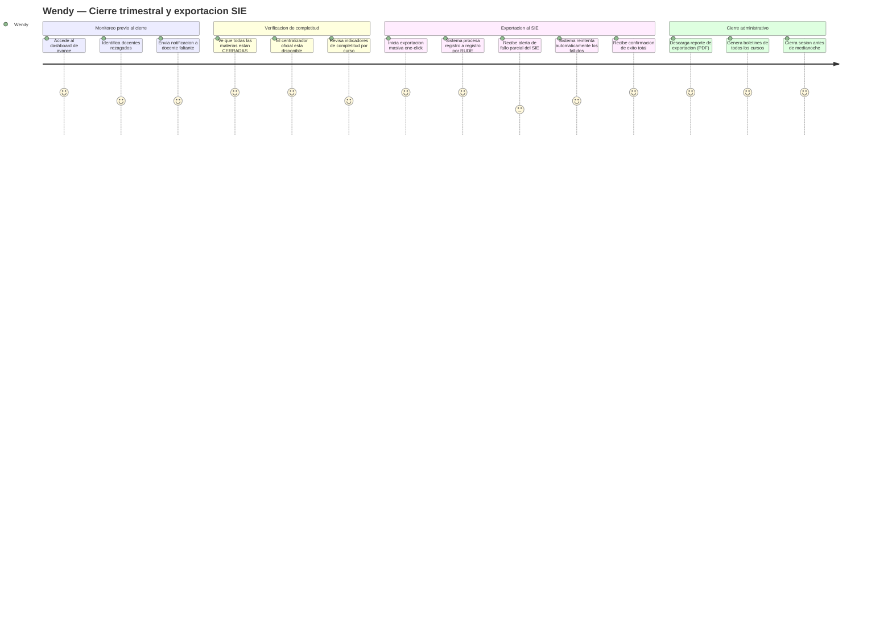
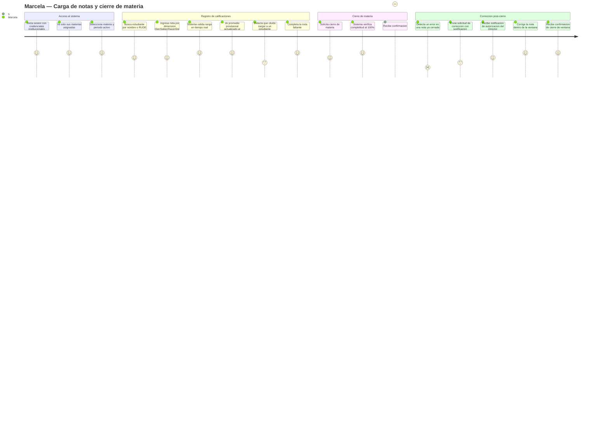
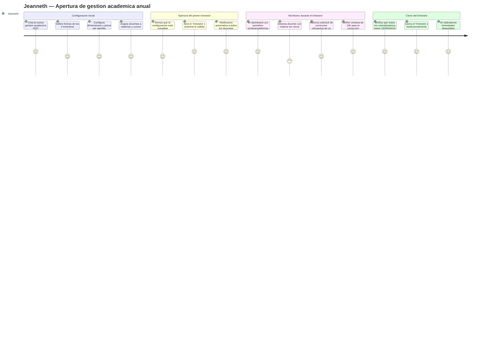

> COPIA CONGELADA - release/2.0.0
>
> Este archivo es un snapshot inmutable de docs/prd/PRD_EduSync.md (version v1.0) congelado el 28/05/2026 por el contrato prompts/PR-VFINAL-001.md para la entrega del Modulo 4.
>
> **No editar este archivo.** Para cambios normativos:
> 1. Modifica el documento canonico (docs/prd/PRD_EduSync.md).
> 2. Regenera este alias mediante PR-VFINAL-001 o sync-doc-chain en su pasada de release.
>
> | Campo | Valor |
> |-------|-------|
> | Fuente canonica | docs/prd/PRD_EduSync.md |
> | Version congelada | v1.0 |
> | Fecha de freeze | 28/05/2026 |
> | Release | release/2.0.0 |
> | Prompt origen | prompts/PR-VFINAL-001.md |
> | Agente | docs-agent |
> | **Status** | **congelado** — baseline inmutable de M4 (`plantillas/plantillas3/MODELO_DOCUMENTAL_IMPLEMENTACION.md`). Continuación viva: `docs/product/PRD.md`. |

---
# Product Requirements Document (PRD) — EduSync


## 0. Metadatos

| Campo | Valor |
|-------|-------|
| **Producto** | EduSync |
| **Grupo** | G-EduSync |
| **Versión** | v1.0 |
| **Fecha** | 15/05/2026 |
| **Product Manager / Autor** | Rodrigo Aspeti — Dev Lead / PM EduSync |
| **Revisores** | Docente + Tech Lead + QA |
| **Estado** | En revisión |
| **BRD de referencia** | `docs/BRD_EduSync_V2.md` (v2.0) |
| **MRD de referencia** | `docs/MRD-EduSync.md` (v1.0) |
| **Insumos M2 (UI/UX)** | Sistema de diseño Atomic Design + Design Tokens · WCAG 2.2 AA · Semáforos visuales de reprobación · Wireframes de carga de notas y dashboard director |
| **Fase Spec Kit cubierta** | Specify ✅ / Plan ⬜ / Tasks ⬜ / Implement ⬜ |
| **Prompts utilizados** | `PR-ARCH-001`, `PR-BRD-002`, `PR-DIAG-001`, `PR-DIAG-002` (ver `docs/PROMPT_MAPPING.md`) |

---

## 0.1 Constitution — Principios no negociables del producto

> Invariantes a nivel de producto que toda decisión posterior debe respetar. Aplican como guardrails en los prompts del FSD y como criterios de auditoría en revisiones.

- **Principio 1 — Zero-Training:** Todo flujo crítico del producto (carga de notas, cierre de materia, exportación SIE) debe poder completarse en ≤ 3 pasos sin capacitación formal previa.
- **Principio 2 — Identidad por RUDE:** Ningún dato de ningún estudiante puede ser referenciado, almacenado, exportado ni visualizado usando nombre, apellido o posición de lista. El código RUDE es la única clave de identidad.
- **Principio 3 — Inmutabilidad post-cierre:** Ningún registro cerrado puede ser alterado sin autorización jerárquica explícita del Director con ventana temporal definida. Todo cambio genera entrada inmutable en `audit_log`.
- **Principio 4 — Sin datos sensibles en logs:** Ningún PII (RUDE, nombre de estudiante, calificación individual) puede aparecer en logs de aplicación, trazas de error o sistemas de telemetría.
- **Principio 5 — Aislamiento multitenant total:** Ninguna consulta, endpoint ni exportación puede acceder a datos de un tenant diferente al del usuario autenticado. No existe excepción ni bypass administrativo sin registro en `audit_log`.

---

## 1. Resumen del producto

EduSync es una plataforma SaaS B2B multitenant que elimina la "triple digitación manual" en unidades educativas bolivianas: el proceso en el que los docentes ingresan notas en Excel, la secretaría las consolida copiando y pegando, y finalmente las transcribe nota por nota al sistema estatal SIE, en jornadas que se extienden hasta las 4:00 AM bajo riesgo de sanciones económicas de hasta cinco días de sueldo.

El producto descentraliza el ingreso de calificaciones por rol (RBAC): cada docente registra solo su materia con validación en tiempo real, la secretaría monitoriza el avance y exporta masivamente al SIE con un clic, y el Director administra la gestión académica anual con parámetros configurables y dashboards en tiempo real. Todo el ciclo queda sellado en un log de auditoría inalterable, convirtiendo a EduSync en la fuente única de verdad académica ante inspecciones ministeriales.

Los tres actores primarios son: **Docente** (carga de notas, asistencia, solicitud de correcciones), **Secretaría** (nóminas, exportación SIE, boletines) y **Director** (administración de gestión académica, parámetros, autorizaciones retroactivas, indicadores institucionales).

---

## 2. Objetivos del producto

| ID | Objetivo del producto | BRD vinculado | Métrica | Meta |
|----|------------------------|----------------|---------|------|
| OP-01 | Reducir el ciclo de cierre operativo trimestral a menos de 10 minutos | BO-01 | Tiempo de sesión SIE (minutos) | < 10 min |
| OP-02 | Erradicar errores de integridad de datos en exportaciones al SIE | BO-02 | Tasa de error de mapeo RUDE ↔ nota | 0 % |
| OP-03 | Lograr adopción docente del 95 % en registro directo de notas sin capacitación | BO-03 | % docentes que cierran antes del plazo | ≥ 95 % |
| OP-04 | Garantizar trazabilidad legal del 100 % de modificaciones retroactivas | BO-04 | % correcciones con registro en audit_log | 100 % |
| OP-05 | Proveer visibilidad en tiempo real al Director sobre el avance de la carga | MRD-N-04 | % dashboards actualizados en < 5 s | 100 % |
| OP-06 | Mantener disponibilidad ≥ 99,5 % en ventanas de cierre trimestral | BO-05 | Uptime durante las 72 h de cierre | ≥ 99,5 % |

---

## 3. Alcance (*Scope*)

### 3.1 Dentro del alcance — Release v1.0 (MVP)

- **Módulo de Autenticación y RBAC:** Login con JWT, roles DIRECTOR / SECRETARÍA / DOCENTE, aislamiento por `tenant_id`.
- **Módulo de Gestión de Gestión Académica (Director):** Creación de la gestión anual, definición de calendario de 3 trimestres, configuración de parámetros académicos (dimensiones, pesos, reglas), asignación de docentes a materias, apertura/cierre secuencial de periodos.
- **Módulo de Registro de Calificaciones (Docente):** Ingreso de notas por dimensión activa, tipo REGULAR / AYUDA, validación en tiempo real de rangos paramétricos, gestión de número de evaluaciones por dimensión.
- **Módulo de Cierre Operativo:** Cierre atómico de materia con verificación de completitud al 100 %, transición irreversible a `SOLO_LECTURA`.
- **Módulo de Consolidación y Centralizadores:** Vista provisional en tiempo real (marcada `PROVISIONAL`), centralizador oficial post-cierre con criterio `floor`, promedio anual solo con 3 trimestres cerrados.
- **Módulo de Exportación al SIE:** Exportación masiva por RUDE, estado por estudiante persistido, reintentos idempotentes ante fallos parciales, reporte de resultado (enviados / fallidos / excluidos).
- **Módulo de Modificaciones Retroactivas:** Solicitud del Docente, autorización del Director con alcance (estudiante o curso) y ventana temporal 1–72 h, alerta 30 min antes de expiración, revocación automática.
- **Módulo de Gestión de Nóminas:** Altas, bajas y transferencias de estudiantes identificados por RUDE, sin reasignación de posiciones.
- **Módulo de Boletines:** Generación de PDF desde centralizador `CERRADO`, plantilla ministerial parametrizable.
- **Módulo de Control de Asistencia:** Registro por materia con rectificación en mismo día hábil.
- **Módulo de Reportería e Indicadores:** Dashboard Director con vistas trimestral y anual diferenciadas, indicador de cumplimiento de carga docente.
- **Log de Auditoría:** Registro inalterable append-only de toda operación de escritura.

### 3.2 Fuera del alcance — Backlog / Versiones futuras

- **Módulo de Comunicación con Padres:** Chat y notificaciones push a apoderados — complejidad alta, bajo impacto en el MVP de cierre administrativo.
- **Módulo de Finanzas / Gestión de Pagos:** Cobro de pensiones y tesorería — fuera del dominio académico del v1.
- **Módulo de Matrícula Digital:** Inscripción y asignación inicial de RUDE — se asume que el RUDE llega preregistrado.
- **Integración con sistemas de nómina de personal docente:** No crítico para el valor diferenciador del v1.
- **Aplicación móvil nativa (iOS/Android):** El v1 es web responsiva optimizada para móvil; app nativa en v2.
- **Módulo de Benchmark anónimo entre colegios:** Funcionalidad de upselling prevista para v2.

### 3.3 Roadmap de versiones (Delivery track)

| Versión | Contenido | Fecha objetivo |
|---------|-----------|----------------|
| **v1.0 MVP** | Módulos core: Auth, Gestión Académica, Registro de Notas, Cierre, Consolidación, SIE, Nóminas, Retroactivas, Boletines, Asistencia, Reportería básica | Q1 2027 (antes del 1er cierre trimestral) |
| **v1.1** | Reportería estadística avanzada (UC-10 completo), alertas automáticas de rezago docente, exportación PDF de reportes | Q2 2027 |
| **v1.2** | Módulo de Comunicación con Padres (notificaciones de boletín), benchmark anónimo entre colegios | Q3 2027 |
| **v2.0** | App móvil nativa, módulo de matrícula digital, integración con sistemas de finanzas institucionales | Q1 2028 |

### 3.4 Roadmap de validación (Discovery track)

| Sprint / Semana | Hipótesis a validar | Método | Criterio de éxito | Estado |
|-----------------|---------------------|--------|-------------------|--------|
| S1 (previo al desarrollo) | H1: El 80 % de docentes usa EduSync sin capacitación | Prueba de usabilidad con 5 docentes (30 min, sin asistencia) | ≥ 4/5 completan sin pedir ayuda | Abierta |
| S2 | H4: La secretaría exporta al SIE en < 10 min en el piloto real | Piloto cerrado 3er trimestre 2026 | 0 errores + < 10 min cronometrado | Abierta |
| S3 | H2: Director firma contrato tras ver demo de cierre | Seguimiento de demos (n=10) | ≥ 40 % conversión | Abierta |
| S4 | H5: Precio Bs 1.800/año aceptable en el 70 % del SAM | Encuesta con 20 directores | ≥ 70 % responde afirmativamente | Abierta |
| S5 | H3: Desfase de listas = causa raíz del 100 % de errores SIE | Análisis Excel reales de 2 instituciones | Confirmación en ≥ 2/2 archivos | **Validada** |
| S6 | H6: Resiliencia SIE es el 2do diferenciador más valorado | Encuesta de priorización con 15 secretarías | ≥ 60 % ubica en top-3 | Abierta |

> **Regla de oro:** ninguna *user story* `Must` entra al Delivery track sin hipótesis validada en el Discovery track.

---

## 4. Personas y user journeys

### 4.1 Personas (resumen — extendidas en `docs/MRD-EduSync.md §4`)

- **Wendy** (Secretaría): necesita exportar al SIE sin trabajo nocturno, monitorizar avance docente en tiempo real y generar boletines sin re-digitación.
- **Marcela** (Docente): necesita registrar sus notas en < 3 clics, recibir feedback inmediato de errores y poder solicitar correcciones con trazabilidad.
- **Jeanneth** (Director): necesita visibilidad institucional en tiempo real, control jerárquico de correcciones retroactivas e indicadores listos para auditorías.

### 4.2 User journeys principales

#### Journey 1 — Wendy (Secretaría): Cierre del trimestre y exportación al SIE



#### Journey 2 — Marcela (Docente): Registro de notas y cierre de materia



#### Journey 3 — Jeanneth (Director): Apertura del año académico



---

## 5. User stories y criterios de aceptación

> **17 historias** priorizadas organizadas en 6 épicas. Formato INVEST. Criterios Gherkin en subsecciones detalladas.

---

### 5.1 Épica E1 — Autenticación y Control de Acceso (RBAC)

| ID | Historia | Prioridad | Valor (1–10) | Esfuerzo (1–10) | Criterios |
|----|----------|-----------|--------------|-----------------|-----------|
| PRD-US-001 | Como usuario de la institución, quiero iniciar sesión con mis credenciales para acceder únicamente a las funciones de mi rol | Must | 10 | 4 | §5.1.1 |
| PRD-US-002 | Como Docente, quiero ver solo las materias y cursos que me fueron asignados para evitar acceder a datos de otros docentes | Must | 10 | 3 | §5.1.2 |

#### 5.1.1 Criterios PRD-US-001

```gherkin
Escenario: Login exitoso con credenciales válidas
  Dado un usuario registrado con rol DOCENTE en el tenant "Colegio Abaroa"
  Cuando ingresa su usuario y contraseña correctos
  Entonces el sistema genera un JWT válido con claims {tenant_id, user_id, rol}
    Y redirige al dashboard correspondiente a su rol
    Y la sesión expira en 8 horas de inactividad

Escenario: Intento de acceso a recurso de otro rol
  Dado un usuario autenticado con rol DOCENTE
  Cuando intenta acceder a la URL del panel de administración del Director
  Entonces el sistema responde HTTP 403
    Y registra el intento en audit_log con campo "accion: RBAC_VIOLATION"
```

#### 5.1.2 Criterios PRD-US-002

```gherkin
Escenario: Docente ve solo sus materias asignadas
  Dado un Docente autenticado asignado a "Matemáticas 2A" y "Matemáticas 3B"
  Cuando accede al listado de materias
  Entonces ve exactamente "Matemáticas 2A" y "Matemáticas 3B"
    Y no ve ninguna materia de otros docentes del mismo colegio

Escenario: Docente intenta guardar nota en materia no asignada (API)
  Dado un Docente autenticado
  Cuando envía POST /calificaciones con {materia_id: [no asignada]}
  Entonces el sistema responde HTTP 403
    Y no persiste ningún dato
```

---

### 5.2 Épica E2 — Administración de Gestión Académica (Director)

| ID | Historia | Prioridad | Valor | Esfuerzo | Criterios |
|----|----------|-----------|-------|----------|-----------|
| PRD-US-003 | Como Director, quiero crear la gestión académica anual con un calendario de 3 trimestres para definir el año escolar antes de que los docentes comiencen a cargar notas | Must | 10 | 6 | §5.2.1 |
| PRD-US-004 | Como Director, quiero configurar los parámetros académicos de cada periodo (dimensiones activas, pesos, reglas de combinación) para que el motor de consolidación aplique las reglas correctas del Ministerio | Must | 9 | 5 | §5.2.2 |
| PRD-US-005 | Como Director, quiero asignar docentes a materias y cursos para que el RBAC restrinja correctamente el acceso de cada docente a sus propios datos | Must | 9 | 4 | §5.2.3 |
| PRD-US-006 | Como Director, quiero abrir el Trimestre 2 solo después de cerrar completamente el Trimestre 1 para garantizar la secuencialidad obligatoria del año escolar | Must | 9 | 3 | §5.2.4 |

#### 5.2.1 Criterios PRD-US-003

```gherkin
Escenario: Director crea gestión académica anual exitosamente
  Dado un Director autenticado con gestión académica 2026 ya cerrada
  Cuando crea la gestión 2027 con fechas de inicio y fin para T1, T2 y T3
  Entonces el sistema guarda la gestión en estado CONFIGURANDO
    Y los 3 periodos quedan en estado PENDIENTE (no abiertos)
    Y la gestión queda disponible para continuar la configuración de parámetros

Escenario: Intento de crear gestión con gestión activa preexistente
  Dado que existe una gestión 2026 en estado ACTIVO con periodos abiertos
  Cuando el Director intenta crear la gestión 2027
  Entonces el sistema bloquea la creación con error E_GESTION_ACTIVA
    Y muestra un mensaje: "Cierre la gestión activa antes de crear una nueva"
```

#### 5.2.2 Criterios PRD-US-004

```gherkin
Escenario: Director configura parámetros del Trimestre 1
  Dado un Director en la pantalla de configuración del Trimestre 1
  Cuando define dimensiones [Ser:5pts, Saber:45pts, Hacer:40pts, Decidir:5pts],
    regla de combinación PROMEDIO_SIMPLE, floor como criterio de truncado,
    umbral de reprobación < 51 pts
  Y confirma la configuración
  Entonces el sistema guarda los parámetros con scope {tenant_id, periodo_id}
    Y los parámetros quedan disponibles para UC-01 (validación de rangos)
    Y los parámetros no pueden modificarse una vez que el periodo esté ABIERTO

Escenario: Intento de modificar parámetros con periodo ABIERTO
  Dado que el Trimestre 1 está en estado ABIERTO
  Cuando el Director intenta modificar el peso de la dimensión Saber
  Entonces el sistema rechaza la operación con error E_PARAMETRO_INMUTABLE
```

#### 5.2.3 Criterios PRD-US-005

```gherkin
Escenario: Director asigna docente a materia
  Dado el Director en la pantalla de asignaciones
  Cuando asigna al usuario "Marcela López" a "Matemáticas" del curso "2do A"
    para el año académico 2027
  Entonces Marcela puede ver y registrar notas en "Matemáticas 2do A"
    Y no puede ver materias de otros cursos ni materias de otros docentes

Escenario: Intento de abrir periodo sin materias asignadas
  Dado que la materia "Biología 3ro B" no tiene docente asignado
  Cuando el Director intenta abrir el Trimestre 1
  Entonces el sistema bloquea la apertura con error E_MATERIA_SIN_DOCENTE
    Y lista las materias sin cobertura
```

#### 5.2.4 Criterios PRD-US-006

```gherkin
Escenario: Apertura secuencial válida del Trimestre 2
  Dado que el Trimestre 1 está en estado CERRADO (todos los centralizadores cerrados)
  Cuando el Director solicita abrir el Trimestre 2
  Entonces el sistema transiciona el Trimestre 2 a estado ABIERTO
    Y notifica a todos los docentes del colegio

Escenario: Intento de apertura no secuencial
  Dado que el Trimestre 1 está en estado ABIERTO
  Cuando el Director intenta abrir el Trimestre 2
  Entonces el sistema responde con error E_TRIMESTRE_PREVIO_ABIERTO
    Y el Trimestre 2 permanece en estado PENDIENTE
```

---

### 5.3 Épica E3 — Registro de Calificaciones (Docente)

| ID | Historia | Prioridad | Valor | Esfuerzo | Criterios |
|----|----------|-----------|-------|----------|-----------|
| PRD-US-007 | Como Docente, quiero ingresar calificaciones por dimensión (Ser/Saber/Hacer/Decidir) con validación automática de rangos para no poder guardar valores inválidos accidentalmente | Must | 10 | 6 | §5.3.1 |
| PRD-US-008 | Como Docente, quiero gestionar la cantidad de evaluaciones que realizo en cada dimensión para que el motor calcule el promedio sobre mis evaluaciones reales, no sobre un número fijo | Must | 8 | 5 | §5.3.2 |
| PRD-US-009 | Como Docente, quiero ver el promedio provisional actualizado en tiempo real mientras cargo notas para tener visibilidad inmediata del estado de cada estudiante | Should | 7 | 4 | §5.3.3 |

#### 5.3.1 Criterios PRD-US-007

```gherkin
Escenario: Docente guarda nota válida en dimensión Saber
  Dado un Docente autenticado con periodo ABIERTO y dimensión Saber (peso: 45 pts)
  Cuando registra nota = 38 para el estudiante con RUDE "1234567" en evaluación 1 de Saber
  Entonces el sistema persiste el registro con {docente_id, materia_id, rude, dimension, tipo, valor, timestamp}
    Y crea entrada en audit_log
    Y muestra retroalimentación visual con el promedio provisional actualizado

Escenario: Docente intenta guardar nota fuera de rango
  Dado un Docente y dimensión Ser (peso: 5 pts)
  Cuando intenta guardar nota = 7 para un estudiante
  Entonces el sistema muestra error de validación en tiempo real antes de guardar
    Y no persiste ningún registro
    Y muestra el rango permitido: "0–5 pts"

Escenario: Docente intenta guardar nota con periodo CERRADO
  Dado que el Trimestre 1 está en estado CERRADO
  Cuando el Docente intenta guardar una nota
  Entonces el sistema responde HTTP 409 con error E_PERIODO_NO_MODIFICABLE
```

#### 5.3.2 Criterios PRD-US-008

```gherkin
Escenario: Docente agrega una segunda evaluación a la dimensión Saber
  Dado un Docente con 1 evaluación ya registrada en Saber (materia ABIERTA)
  Cuando agrega una segunda evaluación en Saber
  Entonces el sistema habilita el campo para "Saber Evaluación 2" para todos los estudiantes
    Y el motor calculará el promedio de Saber como PROMEDIO_SIMPLE(eval1, eval2)

Escenario: Docente intenta agregar evaluación con materia en estado SOLO_LECTURA
  Dado que la materia ya fue cerrada (estado SOLO_LECTURA)
  Cuando el Docente intenta agregar una nueva evaluación
  Entonces el sistema rechaza la acción con error E_MATERIA_CERRADA
    Y sugiere iniciar un flujo de corrección retroactiva (UC-05)
```

#### 5.3.3 Criterios PRD-US-009

```gherkin
Escenario: Promedio provisional se actualiza al guardar una nota
  Dado un Docente que acaba de guardar la nota de Saber evaluación 2 para "1234567"
  Cuando el registro es persistido
  Entonces la columna de promedio provisional del estudiante se actualiza en < 2 segundos
    Y la celda muestra la etiqueta "PROVISIONAL"
    Y si el promedio < 51, la celda se muestra en color rojo (semáforo)
```

---

### 5.4 Épica E4 — Cierre Operativo de Materia y Consolidación

| ID | Historia | Prioridad | Valor | Esfuerzo | Criterios |
|----|----------|-----------|-------|----------|-----------|
| PRD-US-010 | Como Docente, quiero cerrar mi materia cuando todos los estudiantes tienen todas sus evaluaciones completas, para que la secretaría sepa que mis datos están listos | Must | 9 | 4 | §5.4.1 |
| PRD-US-011 | Como Secretaría, quiero ver el centralizador oficial una vez que todas las materias de un curso están cerradas para tener los promedios finales calculados con el criterio floor correcto | Must | 10 | 7 | §5.4.2 |

#### 5.4.1 Criterios PRD-US-010

```gherkin
Escenario: Docente cierra materia con completitud al 100%
  Dado que todos los estudiantes de la nómina tienen notas en todas las evaluaciones declaradas
  Cuando el Docente solicita el cierre de la materia
  Entonces el sistema transiciona la materia a estado CERRADO
    Y la materia pasa a SOLO_LECTURA (irreversible sin autorización del Director)
    Y se notifica a la Secretaría en tiempo real
    Y si todas las materias del curso están cerradas, se dispara el cálculo del centralizador oficial

Escenario: Intento de cierre con evaluaciones incompletas
  Dado que el estudiante con RUDE "7654321" no tiene nota en Hacer evaluación 2
  Cuando el Docente intenta cerrar la materia
  Entonces el sistema rechaza el cierre con error E_EVALUACIONES_INCOMPLETAS
    Y lista los estudiantes y evaluaciones faltantes
    Y la materia permanece en estado ABIERTO
```

#### 5.4.2 Criterios PRD-US-011

```gherkin
Escenario: Centralizador oficial generado correctamente con floor
  Dado que todas las materias del curso "2do A" están en estado CERRADO
  Cuando el motor de consolidación procesa el centralizador
  Entonces el promedio de cada dimensión se calcula con PROMEDIO_SIMPLE sobre las N evaluaciones declaradas
    Y el resultado se trunca con floor (ej. 64.666 → 64, no 65)
    Y el centralizador se marca como OFICIAL e inmutable
    Y se habilita la generación de boletines para ese curso
    Y los promedios son reproducibles y trazables a las calificaciones de origen

Escenario: Indicadores anuales no disponibles con datos parciales
  Dado que el Trimestre 1 está CERRADO pero el Trimestre 2 está ABIERTO
  Cuando la Secretaría accede al centralizador anual
  Entonces el campo "Promedio Anual" muestra "EN CURSO — promedio anual no disponible"
    Y no se muestra ningún índice de reprobación anual
```

---

### 5.5 Épica E5 — Exportación al SIE y Resiliencia

| ID | Historia | Prioridad | Valor | Esfuerzo | Criterios |
|----|----------|-----------|-------|----------|-----------|
| PRD-US-012 | Como Secretaría, quiero exportar masivamente las calificaciones al SIE con un clic cuando todos los cursos están cerrados, para no tener que transcribir nota por nota | Must | 10 | 8 | §5.5.1 |
| PRD-US-013 | Como Secretaría, quiero que si el SIE falla a mitad de la exportación, el sistema retome automáticamente desde el último registro exitoso sin reiniciar todo, para no perder el trabajo hecho | Must | 10 | 7 | §5.5.2 |

#### 5.5.1 Criterios PRD-US-012

```gherkin
Escenario: Exportación masiva exitosa al SIE
  Dado que todos los centralizadores del periodo están en estado CERRADO
  Cuando la Secretaría inicia la exportación del Trimestre 1
  Entonces el sistema construye el payload en el formato SIE vigente
    Y vincula cada nota al RUDE del estudiante (nunca por nombre ni posición)
    Y excluye automáticamente registros con RUDE nulo (marcados como EXCLUIDOS_SIN_RUDE)
    Y transmite el payload al SIE
    Y presenta el reporte: registros enviados / fallidos / excluidos
    Y genera entrada en audit_log con actor, periodo y timestamp

Escenario: Intento de exportación con materias aún abiertas
  Dado que la materia "Historia 2do A" está en estado ABIERTO
  Cuando la Secretaría intenta iniciar la exportación
  Entonces el sistema bloquea la exportación con error E_MATERIAS_INCOMPLETAS
    Y lista las materias pendientes de cierre
```

#### 5.5.2 Criterios PRD-US-013

```gherkin
Escenario: Reanudación automática tras fallo parcial del SIE
  Dado que la exportación ha enviado 46 de 80 registros cuando el SIE responde error 503
  Cuando el sistema detecta el fallo
  Entonces persiste el estado FALLIDO para los registros 47–80
    Y no reenvía los 46 ya confirmados (idempotencia por rude+periodo_id)
    Y reintenta automáticamente los registros en estado FALLIDO cada 5 minutos
    Y muestra al usuario: "El SIE está saturado. Tus datos están seguros. Reintentando automáticamente."
    Y cuando todos los reintentos son exitosos, el estado cambia a EXPORTACIÓN_COMPLETA
```

---

### 5.6 Épica E6 — Modificaciones Retroactivas y Boletines

| ID | Historia | Prioridad | Valor | Esfuerzo | Criterios |
|----|----------|-----------|-------|----------|-----------|
| PRD-US-014 | Como Docente, quiero solicitar la corrección de una nota ya cerrada indicando el estudiante (por RUDE), la dimensión y la justificación, para que el Director pueda decidir si autoriza la corrección | Must | 9 | 5 | §5.6.1 |
| PRD-US-015 | Como Director, quiero autorizar una corrección retroactiva definiendo el alcance (un estudiante o todo el curso) y una ventana temporal de 1 a 72 horas, para controlar exactamente qué puede modificar el docente y por cuánto tiempo | Must | 10 | 6 | §5.6.2 |
| PRD-US-016 | Como Secretaría, quiero generar boletines académicos en PDF para todos los cursos de un trimestre con un clic, a partir del centralizador oficial cerrado | Should | 8 | 5 | §5.6.3 |
| PRD-US-017 | Como Docente, quiero recibir una alerta 30 minutos antes de que expire mi ventana de corrección para no perder la oportunidad de completar la modificación autorizada | Must | 8 | 3 | §5.6.4 |

#### 5.6.1 Criterios PRD-US-014

```gherkin
Escenario: Docente envía solicitud de corrección retroactiva
  Dado que la materia está en estado SOLO_LECTURA
  Cuando el Docente envía solicitud con {rude: "1234567", dimension: "Saber", evaluacion: 2, justificacion: "error tipográfico detectado"}
  Entonces la solicitud queda en estado PENDIENTE sin alterar el registro original
    Y el Director recibe notificación de la solicitud
    Y se crea entrada en audit_log con tipo SOLICITUD_CORRECCION

Escenario: Solicitud sin justificación
  Cuando el Docente intenta enviar solicitud sin texto en el campo justificación
  Entonces el sistema bloquea el envío con error E_JUSTIFICACION_REQUERIDA
```

#### 5.6.2 Criterios PRD-US-015

```gherkin
Escenario: Director aprueba corrección con ventana de 24 horas
  Dado que existe una solicitud PENDIENTE del Docente para el RUDE "1234567"
  Cuando el Director aprueba la solicitud con alcance "estudiante específico" y ventana de 24h
  Entonces el sistema registra la autorización con fecha/hora de expiración = ahora + 24h
    Y el Docente recibe notificación con el alcance y la fecha exacta de expiración
    Y el Docente puede modificar solo esa nota hasta la expiración
    Y al vencer la ventana, el sistema revoca automáticamente el permiso sin intervención manual
    Y genera 3 entradas en audit_log: (1) solicitud, (2) autorización, (3) cierre de ventana

Escenario: Intento de modificación fuera de la ventana expirada
  Dado que la ventana de corrección expiró hace 1 hora
  Cuando el Docente intenta guardar una nota dentro del alcance autorizado (ya expirado)
  Entonces el sistema rechaza con error E_VENTANA_EXPIRADA
    Y sugiere iniciar una nueva solicitud al Director

Escenario: Director intenta aprobar sin definir ventana temporal
  Cuando el Director intenta aprobar sin seleccionar duración de la ventana
  Entonces el sistema aplica automáticamente el valor por defecto de 24 horas
    Y muestra confirmación visible: "Ventana aplicada: 24 horas (valor por defecto)"
```

#### 5.6.3 Criterios PRD-US-016

```gherkin
Escenario: Generación de boletín PDF exitosa
  Dado que el centralizador del curso "3ro A" Trimestre 1 está en estado CERRADO
  Cuando la Secretaría solicita generar el boletín de "3ro A"
  Entonces el sistema genera el PDF usando la plantilla ministerial parametrizada
    Y el PDF refleja los datos inmutables del centralizador oficial
    Y la generación completa en < 5 segundos
    Y se crea entrada en audit_log con {actor, curso, periodo, timestamp}

Escenario: Intento de generar boletín con centralizador PROVISIONAL
  Dado que el centralizador del curso "2do B" está en estado PROVISIONAL
  Cuando la Secretaría intenta generar el boletín de "2do B"
  Entonces el sistema rechaza con error E_CENTRALIZADOR_NO_OFICIAL
```

#### 5.6.4 Criterios PRD-US-017

```gherkin
Escenario: Alerta enviada 30 minutos antes del vencimiento
  Dado que el Docente tiene una ventana de corrección que vence en 30 minutos
  Cuando el sistema evalúa las ventanas activas
  Entonces envía notificación in-app al Docente: "Tu ventana de corrección vence en 30 minutos"
    Y muestra el tiempo restante en la interfaz de edición
    Y el Docente puede completar las modificaciones antes del vencimiento
```

---

## 6. Priorización

### MoSCoW

| Must | Should | Could | Won't (v1) |
|------|--------|-------|------------|
| PRD-US-001..002 (Auth) | PRD-US-009 (Vista provisional) | Módulo de comunicación padres | App móvil nativa |
| PRD-US-003..006 (Gestión académica) | PRD-US-016 (Boletines) | Benchmark anónimo entre colegios | Finanzas |
| PRD-US-007..008 (Registro notas) | — | — | Matrícula digital |
| PRD-US-010..011 (Cierre + consolidación) | — | — | — |
| PRD-US-012..013 (Exportación SIE) | — | — | — |
| PRD-US-014..015 (Retroactivas) | — | — | — |
| PRD-US-017 (Alerta ventana) | — | — | — |

### Priorización RICE — Top 10 historias

| ID | Reach (usuarios/año) | Impact (0,25–3) | Confidence (%) | Effort (semanas-dev) | RICE Score |
|----|---------------------|-----------------|----------------|----------------------|------------|
| PRD-US-012 (Exportación SIE) | 800 inst × 1 secretaría | 3 | 95 % | 3 | **760** |
| PRD-US-011 (Centralizador oficial) | 800 inst × 2 usuarios | 3 | 90 % | 3 | **720** |
| PRD-US-007 (Registro de notas) | 800 inst × 10 docentes | 3 | 95 % | 3 | **760** |
| PRD-US-013 (Resiliencia SIE) | 800 inst × 1 secretaría | 3 | 85 % | 2 | **1 020** |
| PRD-US-015 (Autorización retroactiva) | 800 inst × 1 director | 2 | 90 % | 2 | **720** |
| PRD-US-003 (Crear gestión académica) | 800 inst × 1 director | 2 | 95 % | 2 | **760** |
| PRD-US-010 (Cierre de materia) | 800 inst × 10 docentes | 2 | 95 % | 2 | **760** |
| PRD-US-001 (Login RBAC) | 800 inst × 12 usuarios | 3 | 99 % | 2 | **1 426** |
| PRD-US-017 (Alerta ventana) | 800 inst × 10 docentes | 1 | 90 % | 1 | **720** |
| PRD-US-016 (Boletines PDF) | 800 inst × 1 secretaría | 2 | 85 % | 2 | **680** |

> **RICE más alto:** PRD-US-001 (Login RBAC) y PRD-US-013 (Resiliencia SIE) por su combinación de reach amplio, impacto alto y bajo esfuerzo relativo.

---

## 7. Requerimientos funcionales (alto nivel)

| ID | Requisito funcional | Historia(s) vinculada(s) | Prioridad |
|----|---------------------|--------------------------|-----------|
| PRD-REQ-001 | El sistema debe autenticar usuarios con JWT y aplicar RBAC por rol (DIRECTOR / SECRETARÍA / DOCENTE) con aislamiento por `tenant_id` | PRD-US-001, PRD-US-002 | Must |
| PRD-REQ-002 | El sistema debe permitir al Director crear la gestión académica anual con calendario de 3 periodos trimestrales | PRD-US-003 | Must |
| PRD-REQ-003 | El sistema debe guardar y aplicar parámetros académicos por periodo (dimensiones, pesos, reglas de combinación, umbral de reprobación) como configuración inmutable post-apertura | PRD-US-004 | Must |
| PRD-REQ-004 | El sistema debe permitir la asignación de docentes a materias y cursos como prerequisito del RBAC de ingreso de notas | PRD-US-005 | Must |
| PRD-REQ-005 | El sistema debe bloquear la apertura de un trimestre si el anterior no está completamente cerrado | PRD-US-006 | Must |
| PRD-REQ-006 | El sistema debe validar en tiempo real que toda calificación ingresada esté dentro del rango paramétrico de la dimensión activa, antes de persistir | PRD-US-007 | Must |
| PRD-REQ-007 | El sistema debe permitir al Docente gestionar el número de evaluaciones por dimensión (agregar/eliminar) mientras la materia esté en estado ABIERTO | PRD-US-008 | Must |
| PRD-REQ-008 | El sistema debe mostrar el promedio provisional del estudiante actualizado en tiempo real tras cada nota guardada, marcado como PROVISIONAL | PRD-US-009 | Should |
| PRD-REQ-009 | El sistema debe verificar que el 100 % de los estudiantes de la nómina tienen todas las evaluaciones declaradas antes de permitir el cierre de la materia | PRD-US-010 | Must |
| PRD-REQ-010 | El sistema debe calcular el centralizador oficial aplicando PROMEDIO_SIMPLE dentro de cada dimensión y truncado `floor` para todos los decimales | PRD-US-011 | Must |
| PRD-REQ-011 | El promedio anual y el índice de reprobación anual solo deben calcularse y mostrarse cuando los 3 trimestres están en estado CERRADO | PRD-US-011 | Must |
| PRD-REQ-012 | El sistema debe exportar masivamente al SIE vinculando cada calificación al RUDE del estudiante, en el formato ministerial vigente parametrizable sin redespliegue | PRD-US-012 | Must |
| PRD-REQ-013 | El sistema debe persistir el estado de exportación registro a registro y reanudar desde el último exitoso ante fallos parciales del SIE, sin duplicar registros ya enviados | PRD-US-013 | Must |
| PRD-REQ-014 | El sistema debe gestionar solicitudes de corrección retroactiva con estado PENDIENTE que no altera el registro original hasta la aprobación del Director | PRD-US-014 | Must |
| PRD-REQ-015 | El sistema debe implementar ventanas temporales de corrección retroactiva de 1–72 h con revocación automática al vencer, sin intervención manual | PRD-US-015 | Must |
| PRD-REQ-016 | El sistema debe generar boletines académicos en PDF usando la plantilla ministerial parametrizada, únicamente desde centralizadores en estado CERRADO | PRD-US-016 | Should |
| PRD-REQ-017 | El sistema debe enviar alerta in-app al Docente 30 minutos antes del vencimiento de su ventana de corrección | PRD-US-017 | Must |
| PRD-REQ-018 | El sistema debe registrar en `audit_log` toda operación de escritura con campos: actor, entidad_afectada, accion, valor_anterior, valor_nuevo, timestamp_utc | Todas las US | Must |
| PRD-REQ-019 | El sistema debe gestionar nóminas estudiantiles con alta, baja y transferencia identificando estudiantes exclusivamente por RUDE, sin reasignar posiciones de lista | MRD-N-02 | Must |
| PRD-REQ-020 | El sistema debe proveer al Director un dashboard con dos vistas diferenciadas: indicadores trimestrales (disponibles por trimestre) e indicadores anuales (solo con 3 trimestres cerrados) | OP-05 | Must |

---

## 8. Requerimientos no funcionales (alto nivel)

| ID | Categoría | Requerimiento | Métrica | Umbral |
|----|-----------|---------------|---------|--------|
| PRD-NFR-001 | **Rendimiento** | Tiempo de respuesta de la API en operaciones de carga de notas | p95 latencia | < 500 ms |
| PRD-NFR-002 | **Rendimiento** | Generación de centralizador oficial (por curso) | Tiempo de procesamiento | < 3 s por curso |
| PRD-NFR-003 | **Rendimiento** | Generación de boletín PDF | Tiempo por documento | < 5 s |
| PRD-NFR-004 | **Disponibilidad** | Uptime general del sistema | SLA mensual | ≥ 99,5 % |
| PRD-NFR-005 | **Disponibilidad** | Uptime durante ventanas de cierre trimestral (72 h previas al plazo SIE) | SLA en ventana crítica | ≥ 99,9 % |
| PRD-NFR-006 | **Seguridad** | Ningún PII (RUDE, nombre, nota individual) debe aparecer en logs de aplicación o trazas de error | Auditoría de logs | 0 ocurrencias |
| PRD-NFR-007 | **Seguridad** | Autenticación mediante JWT con expiración | Tiempo de sesión | 8 h de inactividad |
| PRD-NFR-008 | **Seguridad** | Cifrado de datos en tránsito | Protocolo | HTTPS/TLS 1.3 |
| PRD-NFR-009 | **Seguridad** | Aislamiento multitenant con RLS | Verificación en CI | 0 queries sin `tenant_id` |
| PRD-NFR-010 | **Usabilidad** | Flujo crítico completable sin capacitación formal | Prueba de usabilidad | ≥ 4/5 usuarios completan sin ayuda |
| PRD-NFR-011 | **Usabilidad** | Flujo crítico completable en ≤ 3 pasos | Conteo de acciones | ≤ 3 clics/pasos por tarea core |
| PRD-NFR-012 | **Accesibilidad** | Contraste de color y etiquetas ARIA | WCAG 2.2 AA | Nivel AA en todas las vistas |
| PRD-NFR-013 | **Mantenibilidad** | Actualización del formato SIE sin redespliegue | Tiempo de respuesta ante cambio ministerial | < 30 min mediante configuración en BD |
| PRD-NFR-014 | **Escalabilidad** | Soporte de N tenants adicionales sin cambio de código | Incorporación de nuevo colegio | < 5 min de configuración + onboarding |
| PRD-NFR-015 | **Auditabilidad** | Todo registro en `audit_log` debe ser inalterable (sin UPDATE ni DELETE) | Cobertura de audit_log | 100 % de operaciones de escritura |

---

## 9. Dependencias e integraciones

| Sistema | Tipo | Propósito | Riesgo |
|---------|------|-----------|--------|
| **SIE (Sistema de Información Educativa — Ministerio de Educación Bolivia)** | Consumo externo (HTTP) | Exportación masiva de calificaciones trimestrales en formato ministerial | **Crítico** — Alta tasa de fallos en horario pico; sin garantía de idempotencia; acceso en jornadas nocturnas. Mitigación: DA-05 (reintentos idempotentes por RUDE+periodo_id). |
| **PostgreSQL 15 (AWS RDS)** | Infraestructura propia | Base de datos principal multitenant con RLS | **Bajo** — Tecnología madura, gestionada por AWS. |
| **AWS SQS** (v1.1+) | Infraestructura propia (futura) | Cola de mensajes para consolidación asíncrona a escala. En v1.0 se usa Spring Events. | **Bajo** — No requerido en MVP; el diseño de dominio es agnóstico al mecanismo de mensajería (DA-04). |
| **Motor de PDF** (Apache PDFBox / iText) | Librería interna | Generación de boletines PDF con plantilla ministerial | **Bajo** — Librería estable. La plantilla es parametrizable sin redespliegue. |
| **Proveedor de email / notificaciones in-app** | Consumo externo | Alertas de vencimiento de ventana, notificaciones de autorización, alertas de cierre | **Medio** — Dependencia de SLA del proveedor. Se acepta degradación graceful (sin notificación no bloquea el flujo). |
| **Spring Security + JWT** | Framework interno | RBAC, autenticación, propagación de `tenant_id` en contexto de seguridad | **Bajo** — Tecnología estándar del stack (Java 21 + Spring Boot 3.3). |

---

## 10. Supuestos y restricciones

**Supuestos:**
- Cada estudiante tiene un código RUDE único y válido asignado por el Ministerio antes del inicio del año escolar.
- El Director de la institución tiene autoridad suficiente para aprobar la adopción del sistema sin validación de una instancia superior.
- Los colegios tienen acceso a internet suficiente para operar la plataforma web (no se requiere modo offline, solo tolerancia a conectividad intermitente).
- El formato de exportación SIE permanece estable durante el año escolar (con actualizaciones posibles entre gestiones).
- Los parámetros ministeriales (dimensiones, pesos) son aplicables de forma uniforme dentro de cada tenant para un periodo dado.

**Restricciones:**
- **Stack obligatorio:** Java 21 (LTS) · Spring Boot 3.3 · Spring Security (RBAC) · Spring Data JPA · PostgreSQL 15 · Angular 17 · AWS.
- **Equipo:** 1 desarrollador principal (Rodrigo Aspeti) asistido por agentes de IA. La arquitectura debe minimizar la complejidad operativa.
- **Normativa SIE:** el mapeo de datos es obligatorio por código RUDE; no existe alternativa aceptada por el Ministerio.
- **Inmutabilidad:** el modelo append-only en `audit_log` y en modificaciones retroactivas (UC-05) no puede relajarse por decisión de producto.
- **Plazo crítico:** el MVP debe estar listo antes del primer cierre trimestral del año escolar 2027 (estimado: marzo–abril 2027).
- **Presupuesto:** infraestructura cloud en nivel mínimo viable (RDS db.t3.medium + EC2 t3.small) hasta alcanzar 50 instituciones activas.

---

## 11. Experiencia de usuario

### 11.1 Trazabilidad con M2 (UI/UX)

> El trabajo de M2 (UI/UX) aterriza aquí como evidencia validada. El sistema de diseño con Atomic Design, Design Tokens y semáforos visuales de reprobación es la base del frontend Angular.

#### Use Cases del M2 ↔ User Stories del PRD

| Use Case M2 (UC-NN de arquitectura_funcional_EduSync.md) | User Story PRD | Estado de la traza |
|----------------------------------------------------------|----------------|--------------------|
| UC-01 · Registro descentralizado de calificaciones | PRD-US-007, PRD-US-008, PRD-US-009 | ✅ Cubierto |
| UC-02 · Cierre operativo de materia | PRD-US-010 | ✅ Cubierto |
| UC-03 · Consolidación algorítmica de centralizadores | PRD-US-011 | ✅ Cubierto |
| UC-04 · Exportación y sincronización masiva al SIE | PRD-US-012, PRD-US-013 | ✅ Cubierto |
| UC-05 · Autorización jerárquica de modificación retroactiva | PRD-US-014, PRD-US-015, PRD-US-017 | ✅ Cubierto |
| UC-06 · Gestión de nóminas estudiantiles | PRD-REQ-019 (requerimiento directo) | ⚠️ Parcial — US pendiente en backlog |
| UC-07 · Generación de boletines académicos | PRD-US-016 | ✅ Cubierto |
| UC-08 · Control de asistencia por materia | ⬜ En backlog v1.1 | ❌ Pendiente |
| UC-09 · Administración de periodos académicos | PRD-US-003, PRD-US-004, PRD-US-005, PRD-US-006 | ✅ Cubierto |
| UC-10 · Reportería estadística e indicadores | PRD-REQ-020 + OP-05 | ⚠️ Parcial — dashboard básico en v1.0, avanzado en v1.1 |

#### Wireframes / Mockups M2 ↔ Pantallas del PRD

| Wireframe / Artefacto M2 | Pantalla / flujo PRD | Estado |
|--------------------------|----------------------|--------|
| Sistema de diseño Atomic Design + Design Tokens | Componentes de la interfaz Angular de carga de notas | ✅ Validado |
| Semáforos visuales para notas de reprobación (rojo/amarillo/verde) | Vista provisional del centralizador (PRD-US-009) | ✅ Validado |
| WCAG 2.2 AA — contraste y etiquetas ARIA | PRD-NFR-012 (accesibilidad) | ✅ Validado |
| Flujo de carga de notas (wireframes del Docente) | PRD-US-007, PRD-US-008, §4.2 Journey 2 | ✅ Validado |
| Dashboard Director (wireframe de visibilidad institucional) | PRD-REQ-020, OP-05 | ⚠️ Parcial — requiere refinamiento para indicadores trimestrales vs. anuales |
| Flujo de exportación SIE one-click | PRD-US-012, PRD-US-013 | ✅ Validado |

### 11.2 Principios de diseño de interacción

- **Zero-Training:** Las pantallas críticas (carga de notas, cierre de materia, exportación SIE) deben completarse en ≤ 3 clics sin instrucción previa (PRD-NFR-011).
- **Feedback inmediato:** Toda operación de guardado muestra confirmación visual en < 500 ms (PRD-NFR-001). Los errores de validación aparecen antes del submit, no después.
- **Semáforos de estado:** Los estados de materias (ABIERTO/CERRADO/SOLO_LECTURA) y notas (verde/amarillo/rojo según umbral de reprobación) usan código de color consistente con el Design System M2.
- **Transparencia de estado:** El centralizador provisional siempre muestra la etiqueta `PROVISIONAL` en rojo hasta que se convierte en oficial. El campo de promedio anual muestra `EN CURSO` con 1 o 2 trimestres cerrados.

---

## 12. Métricas de éxito del producto

- **North Star Metric:** Tiempo del ciclo de cierre operativo trimestral (minutos). Meta: < 10 min. Medido desde el inicio de la sesión de exportación hasta la confirmación final del SIE.

| KPI | Definición | Meta | Horizonte |
|-----|-----------|------|-----------|
| **NSM — Ciclo de cierre** | Tiempo total sesión SIE (minutos) | < 10 min | 1er cierre trimestral post-lanzamiento |
| **KPI-02 — Error SIE** | % registros rechazados o duplicados en exportación | 0 % | 1er cierre trimestral |
| **KPI-03 — Revisiones manuales** | Ciclos de revisión manual por trimestre (secretaría) | 0 ciclos | Año escolar 1 |
| **KPI-04 — Adopción docente** | % docentes que cierran su materia antes del plazo sin recordatorio | ≥ 95 % | Año escolar 1 |
| **KPI-05 — Uptime en cierre** | Disponibilidad del sistema durante las 72 h de cierre | ≥ 99,9 % | Cada cierre trimestral |
| **KPI-06 — NPS institucional** | Net Promoter Score de directores y secretarías | ≥ 50 | 6 meses post-lanzamiento |
| **KPI-07 — Cobertura audit_log** | % operaciones de escritura con registro en audit_log | 100 % | Desde v1.0 |

---

## 13. Riesgos del producto

| ID | Riesgo | Prob. | Impacto | Mitigación |
|----|--------|-------|---------|------------|
| PR-01 | El servidor SIE falla durante el piloto de cierre trimestral, afectando la percepción de confiabilidad de EduSync | Alta | Crítico | Mensajes de estado claros en UI. Reintentos asíncronos invisibles para el usuario. Demo interna del flujo de resiliencia antes del piloto. |
| PR-02 | El Ministerio modifica el formato de exportación SIE antes del lanzamiento | Media | Alto | Arquitectura paramétrica (DA-02): el formato se actualiza en BD sin redespliegue en < 30 min. |
| PR-03 | El docente no adopta el sistema por falta de confianza o resistencia al cambio | Media | Alto | Diseño Zero-Training (≤ 3 clics). Piloto con Marcela como embajadora interna. Feedback visual inmediato elimina el miedo al error. |
| PR-04 | El equipo de 1 desarrollador no cumple el plazo del MVP (Q1 2027) | Media | Crítico | AI-SDLC agéntico con agentes especializados (dev-agent, qa-agent, docs-agent). Backlog priorizado con Must estricto. Scope del v1.0 es el mínimo diferenciador. |
| PR-05 | Alucinación de invariantes regulatorias en código generado por agentes de IA | Media | Crítico | Validación cruzada compliance-agent + domain-expert-agent antes de cada merge. Golden tests con casos reales de exportación SIE. Revisión humana obligatoria de outputs regulatorios. |
| PR-06 | Fuga de datos entre tenants por error en configuración RLS | Baja | Crítico | multitenant-audit-agent verifica política RLS en CI antes de cada despliegue. Sin excepciones al `tenant_id` obligatorio. |
| PR-07 | La ventana de corrección retroactiva expira sin que el docente haya completado las modificaciones, generando conflicto institucional | Media | Medio | Alerta in-app a 30 min del vencimiento (PRD-US-017). El docente puede iniciar nueva solicitud al Director. |

---

## 14. Trazabilidad

| PRD ID | BRD (v2.0) | MRD (v1.0) | UC / DA | FSD (próximo) |
|--------|------------|------------|---------|----------------|
| PRD-REQ-001 | BR-001 | MRD-N-03, MRD-N-10 | UC-01, DA-01 | FSD-UC-001 |
| PRD-REQ-002 | BR-006 | MRD-N-01 | UC-09 | FSD-UC-009 |
| PRD-REQ-003 | BR-007 | MRD-N-09 | UC-09, DA-02 | FSD-UC-009 |
| PRD-REQ-004 | BR-008 | MRD-N-03 | UC-01, UC-09 | FSD-UC-009 |
| PRD-REQ-005 | BR-006 | MRD-N-01 | UC-09 | FSD-UC-009 |
| PRD-REQ-006 | BR-002 | MRD-N-02 | UC-01, DA-02 | FSD-UC-001 |
| PRD-REQ-007 | BR-001 | MRD-N-03 | UC-01 | FSD-UC-001 |
| PRD-REQ-008 | BR-003 | MRD-N-04 | UC-03 | FSD-UC-003 |
| PRD-REQ-009 | BR-001 | MRD-N-01 | UC-02 | FSD-UC-002 |
| PRD-REQ-010 | BR-003 | MRD-N-01 | UC-03, DA-02 | FSD-UC-003 |
| PRD-REQ-011 | BR-010 | MRD-N-04 | UC-03, UC-10 | FSD-UC-003 |
| PRD-REQ-012 | BR-004 | MRD-N-01 | UC-04, DA-05 | FSD-UC-004 |
| PRD-REQ-013 | BR-004 | MRD-N-08 | UC-04, DA-05 | FSD-UC-004 |
| PRD-REQ-014 | BR-005, BR-009 | MRD-N-05 | UC-05, DA-03 | FSD-UC-005 |
| PRD-REQ-015 | BR-009 | MRD-N-05 | UC-05 | FSD-UC-005 |
| PRD-REQ-016 | BR-012 | MRD-N-06 | UC-07, UC-03 | FSD-UC-007 |
| PRD-REQ-017 | BR-009 | MRD-N-05 | UC-05 | FSD-UC-005 |
| PRD-REQ-018 | BR-011 | MRD-N-05 | DA-03 | FSD-AUD-001 |
| PRD-REQ-019 | BR-004 | MRD-N-02 | UC-06 | FSD-UC-006 |
| PRD-REQ-020 | BR-010 | MRD-N-04 | UC-10 | FSD-UC-010 |

---

## 15. Anexos

### 15.1 Diagramas de estado de referencia

| Artefacto | Ruta | Descripción |
|-----------|------|-------------|
| Diagrama de estados — Docente (carga de notas) | `docs/diagramas/estados.cargarnotas.mmd` | 18 estados que cubren los flujos normal, retroactivo y excepcional del Docente |
| Especificación — Docente | `docs/diagramas/estados_cargar_notas.md` | Catálogo de estados, tabla de transiciones, invariantes y errores |
| Diagrama de estados — Director (gestión académica) | `docs/diagramas/estados_administracion.mmd` | 23 estados del Director: creación, configuración, 3 trimestres, cierre anual |
| Especificación — Director | `docs/diagramas/estados_administracion.md` | Catálogo de estados por fase, tabla de transiciones, invariantes por fase |

### 15.2 Documentos padres

| Documento | Ruta | Relación |
|-----------|------|----------|
| BRD EduSync v2.0 | `docs/BRD_EduSync_V2.md` | 12 BR-NNN y 11 RB-NNN que originan los PRD-REQ-* |
| MRD EduSync v1.0 | `docs/MRD-EduSync.md` | 10 MRD-N-* que originan la priorización y los NFRs |
| Arquitectura funcional | `docs/arquitectura_funcional_EduSync.md` | 10 UCs y 5 DAs que definen las invariantes de los criterios de aceptación |
| PROMPT MAPPING | `docs/PROMPT_MAPPING.md` | Ecosistema de prompts: agentes, flujos de información y trazabilidad |

### 15.3 Supuestos marcados en este PRD

| # | Supuesto | Sección afectada | Cómo validar |
|---|----------|------------------|--------------|
| A1 | El RUDE está disponible para todos los estudiantes antes del inicio del año escolar | PRD-REQ-012, PRD-REQ-019 | Validar con secretaría del colegio piloto en onboarding |
| A2 | La plantilla ministerial de boletín es estable durante el año escolar | PRD-REQ-016 | Confirmar con Ministerio / Director del piloto |
| A3 | El precio Bs 1.800/año es aceptable para ≥ 70 % del SAM | §6 RICE, OP-06 | Encuesta con 20 directores (H5 del MRD) |
| A4 | Spring Events internos son suficientes para el volumen del v1.0 (colegios ≤ 1.000 estudiantes) | PRD-NFR-002, DA-04 | Pruebas de carga en piloto con datos reales |

---

## 16. Registro de cambios

| Versión | Fecha | Autor | Cambio |
|---------|-------|-------|--------|
| v1.0 | 15/05/2026 | Equipo G-EduSync — Rodrigo Aspeti | Creación inicial del PRD. Basado en BRD v2.0, MRD v1.0, arquitectura_funcional_EduSync.md (10 UCs, 5 DAs) y diagramas de estado del Docente (18 estados) y Director (23 estados). 17 user stories en 6 épicas, criterios Gherkin completos, 20 PRD-REQ-*, 15 NFRs, RICE top-10, 3 user journeys Mermaid, trazabilidad completa BRD→MRD→PRD→FSD. |

---

## Checklist de entrega

- [x] ≥ 15 user stories con INVEST y criterios Gherkin (17 historias en 6 épicas).
- [x] Priorización MoSCoW + RICE para top-10.
- [x] ≥ 2 user journeys en Mermaid (3 journeys: Wendy, Marcela, Jeanneth).
- [x] NFRs de alto nivel con umbrales (15 NFRs: rendimiento, disponibilidad, seguridad, usabilidad, escalabilidad).
- [x] Roadmap de versiones (v1.0 → v2.0 con fechas objetivo).
- [x] Roadmap de Discovery (6 hipótesis con método y criterio, H3 validada).
- [x] Trazabilidad BRD → MRD → PRD → FSD iniciada (tabla completa de 20 requerimientos).
- [x] Constitution declarada (5 principios no negociables).
- [x] Revisión documentada por pares (pendiente revisión QA y Tech Lead).
