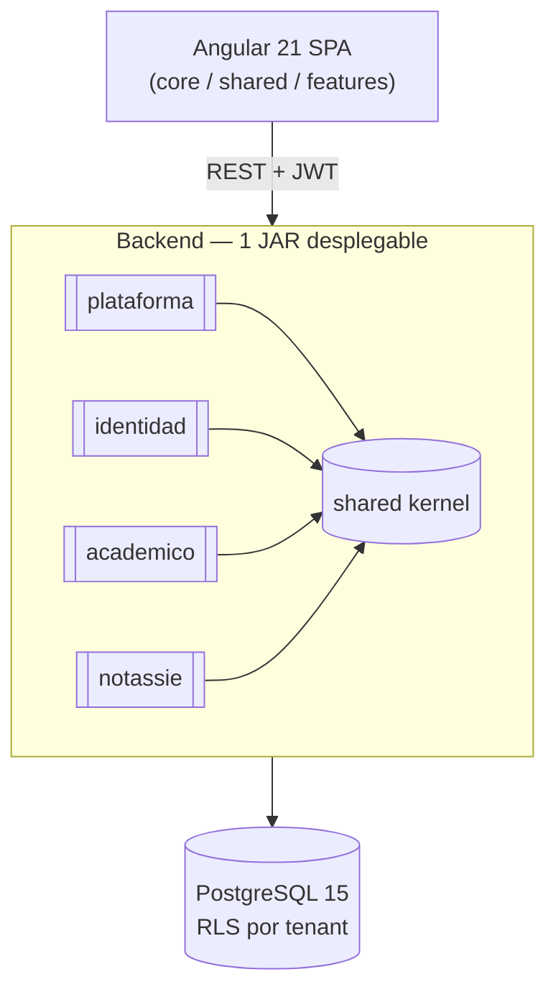

# Design Doc `DD-UC-001` — Bootstrap del proyecto EduSync

> **Qué es**: este documento no implementa un caso de uso funcional por sí solo; es el diseño **fundacional** que crea el esqueleto de código (`src/`) sobre el que se construirán los dos primeros features reales solicitados: alta de tenants (`FSD-UC-011`) y login (autenticación, parte de `FSD-UC-021`/RBAC). Sin este bootstrap no puede existir ningún `DD-UC-NNN` de código posterior.
>
> **Relación con otros documentos**: crea `ADR-0011` (monolito modular Spring Modulith + paquete base `com.edusync`), que a su vez se apoya en `ADR-0008` (stack), `ADR-0009` (modelo de dominio generalizado) y `ADR-0010` (multi-rol + `SysAdmin`). Alimenta el DTP (§A.1 changelog, §A.3 primer estado por FSD-UC) vía `@dtp-sync`.

## 1. Objetivo y contexto

- **Qué resuelve este feature**: crear la estructura inicial de repositorio (`backend/`, `frontend/`, `infra/`), el esqueleto Maven del backend (Java 25 LTS, Spring Boot 4.1.0, arquitectura hexagonal + monolito modular con Spring Modulith) y el esqueleto Angular 21 del frontend, dejando todo listo para implementar el primer *vertical slice* real (tenant + login) sin decisiones de estructura pendientes.
- **Caso(s) de uso del FSD que implementa**: no implementa directamente un flujo de negocio; es prerequisito de `FSD-UC-011` (Gestión de Tenants y Suscripciones, `docs/product/FSD.md#fsd-uc-011`) y de la parte de autenticación de `FSD-UC-021` (Gestión de Usuarios y Roles, `docs/product/FSD.md#fsd-uc-021`).
- **Alcance**:
  - **Dentro**: estructura de carpetas del repo; `pom.xml` raíz + módulo `backend`; dependencias base (Spring Boot 4.1.0, Spring Modulith, Spring Data JPA, Spring Security 7, PostgreSQL driver, Flyway); paquete base `com.edusync` con los 5 módulos vacíos (`plataforma`, `identidad`, `academico`, `notassie`, `shared`) y su `package-info.java`; clase `EduSyncApplication`; test `ModularityTests`; configuración de perfiles (`application.yml` dev/test); esqueleto Angular 21 (`ng new`, standalone components, routing base, módulos internos `core`/`shared`/`features`); `docker-compose.yml` para PostgreSQL 15 local; Flyway `V1__init.sql` vacío/baseline.
  - **Fuera** (se resuelve en Design Docs posteriores): lógica de dominio de `Tenant`/`Usuario` (eso es `DD-UC-002` en adelante), esquema JPA real de las entidades, JWT/RBAC concreto, RLS de PostgreSQL (`ADR-0001`, ya decidido pero no re-implementado aquí), CI/CD pipeline completo (solo se deja el `pom.xml`/`package.json` listos para que un pipeline los use).

## 2. Diseño (el "cómo") `[humano+máquina]`

- **Enfoque elegido**: monolito modular (un solo JAR desplegable) con Spring Modulith en modo *module-first* (`ADR-0011`), arquitectura hexagonal dentro de cada módulo (dominio puro sin anotaciones JPA/Spring, puertos `in`/`out`, adaptadores en `infrastructure/`), paquete base `com.edusync` (`ADR-0011`, reemplaza a `bo.edusync` de M4). Frontend: una sola aplicación Angular 21 (LTS) con módulos internos por feature (no Nx monorepo, no micro-frontends) — decisión de bajo riesgo para un equipo de 1 desarrollador, revisable sin costo alto si el frontend crece significativamente.
- **Componentes tocados** (capas hexagonales, todo nuevo — `src/` estaba vacío):

```
edusync/
├── backend/
│   ├── pom.xml                                  (Spring Boot 4.1.0 parent, Java 25)
│   └── src/
│       ├── main/java/com/edusync/
│       │   ├── EduSyncApplication.java
│       │   ├── plataforma/   (domain/ application/ infrastructure/)   — vacío, listo para DD-UC-002
│       │   ├── identidad/    (domain/ application/ infrastructure/)   — vacío, listo para DD-UC-003 (login)
│       │   ├── academico/    (domain/ application/ infrastructure/)   — vacío
│       │   ├── notassie/     (domain/ application/ infrastructure/)   — vacío (Perfil Bolivia SIE, preservado)
│       │   └── shared/       (tenant/ audit/ exception/)              — TenantContext placeholder, excepción base
│       ├── main/resources/
│       │   ├── application.yml, application-dev.yml, application-test.yml
│       │   └── db/migration/V1__init.sql        (Flyway baseline vacío)
│       └── test/java/com/edusync/
│           └── ModularityTests.java             (ApplicationModules.verify(), Spring Modulith)
├── frontend/
│   ├── package.json, angular.json               (Angular 21 LTS, standalone components)
│   └── src/app/
│       ├── core/      (interceptores HTTP, guards, TenantContext del cliente)
│       ├── shared/    (componentes UI comunes)
│       └── features/  (vacío, listo para el feature de login/tenant)
└── infra/
    └── docker-compose.yml                       (PostgreSQL 15 local para desarrollo)
```

- **Contratos y tipos**: en este DD no se definen DTOs/puertos de negocio (no hay lógica todavía); sí se fija el *contrato de estructura*: todo módulo nuevo de backend debe seguir el árbol `domain/`, `application/{port/in, port/out, service}/`, `infrastructure/{adapter/in/rest, adapter/out/persistence}/`; todo feature nuevo de frontend vive bajo `src/app/features/<feature>/`.
- **Diagrama**:



## 3. Alternativas consideradas

> Las alternativas de fondo (modularización interna y paquete base) se evaluaron y decidieron en `ADR-0011`, no se repiten aquí. Este DD añade dos decisiones de menor calado, de bajo riesgo y fácilmente revertibles, que no ameritan un ADR propio:

| Alternativa | Pros | Contras | ¿Elegida? |
|-------------|------|---------|-----------|
| A. Backend/frontend en repos separados | Ciclos de release independientes | Duplica CI/CD y coordinación de versiones para un equipo de 1 dev; sin beneficio real hoy | no |
| B. Monorepo con `backend/`, `frontend/`, `infra/` en un solo repositorio Git | Un solo PR puede tocar API + UI cuando cambian juntos; un solo pipeline de CI | Requiere convención de rutas clara (ya definida arriba) | **sí** |
| C. Frontend como monorepo Nx con múltiples aplicaciones/librerías | Preparado para escalar a varias apps (portal SysAdmin separado del portal de tenant, por ejemplo) | Sobre-ingeniería para el alcance actual (una sola SPA); curva de aprendizaje de Nx sin necesidad confirmada | no |
| D. Angular 21 como SPA única con módulos internos por feature (`core`/`shared`/`features/<feature>`) | Simplicidad; suficiente para el alcance actual; migración a Nx es posible después sin reescribir lógica de negocio si se mantiene la separación por feature desde el inicio | Si en el futuro se necesitan apps realmente independientes (ej. portal público de marketing separado del portal autenticado), requeriría extraer código | **sí** |

> Ninguna de estas decisiones es costosa de revertir (no hay código de negocio todavía); por eso no generan un ADR propio, a diferencia de la modularización del backend (`ADR-0011`), que sí lo amerita por su impacto en el diseño de todos los módulos futuros.

## 4. Impacto en las specs vivas `[máquina]`

| Artefacto vivo | Cambio | ¿Delta vs DTI vFinal? |
|----------------|--------|-----------------------|
| `docs/arquitectura_hexagonal_EduSync.md` | Actualizar §1 (estructura de paquetes) de `bo.edusync` a `com.edusync` + organización module-first (`ADR-0011`); mantener el resto del contenido (puertos IN/OUT, adaptadores, Aggregate Roots del Perfil Bolivia SIE) sin cambios de fondo | sí → `ADR-0011` |
| `docs/product/DTP.md` | §A.1 nueva fila (bootstrap del proyecto); §A.3 primer estado real para `FSD-UC-011`/`FSD-UC-021` (`en progreso`, Design Doc = este `DD-UC-001`); §A.4 primer eslabón de trazabilidad código↔DTP poblado | sí → `ADR-0011` |
| `docs/PROMPT_MAPPING.md` | Primera fila del área `IMPL` (`PR-IMPL-001`) | no (uso normal del área ya reservada en `v2.0`) |
| `docs/product/FSD.md`, `docs/product/PRD.md`, `docs/product/BRD.md` | Sin cambios — este DD no altera requisitos ni criterios de aceptación, solo crea la base de código | no |

> **Recordatorio (regla de oro)**: el baseline congelado de M4 (`docs/baseline/`) **no se toca**. Los cambios de esta sección viven en `docs/product/`, `docs/arquitectura_hexagonal_EduSync.md` (spec viva de arquitectura) y `docs/design/`.

## 5. Prompts usados `[máquina]`

| Prompt | Tarea | Artefacto generado |
|--------|-------|--------------------|
| `PR-IMPL-001` | Generación del esqueleto Maven (backend) + Angular 21 (frontend) + `infra/docker-compose.yml` según el árbol de la sección 2, incluido `ModularityTests` | `backend/pom.xml`, `backend/src/main/java/com/edusync/**` (paquetes vacíos + `EduSyncApplication`), `backend/src/test/java/com/edusync/ModularityTests.java`, `frontend/package.json`, `frontend/src/app/**` (core/shared/features vacíos), `infra/docker-compose.yml` |

> Cada prompt sigue [`PROMPT_TEMPLATE.md`](../../plantillas/plantillas1/PROMPT_TEMPLATE.md), vive en `docs/prompts/impl/PR-IMPL-NNN.md` (única área que se desvía del directorio raíz `prompts/`, siguiendo [`FEATURE_DESIGN_DOC_TEMPLATE.md`](../../plantillas/plantillas3/FEATURE_DESIGN_DOC_TEMPLATE.md) §5) y se referencia desde `docs/PROMPT_MAPPING.md`.

## 6. Plan de pruebas y evals

- **Unit**: ninguna todavía (no hay lógica de dominio en este DD).
- **Integration**: ninguna todavía.
- **E2E / Gherkin**: no aplica a este DD (no implementa criterios de aceptación funcionales).
- **Arquitectura** (específico de este DD): `ModularityTests` (`ApplicationModules.of(EduSyncApplication.class).verify()`) debe pasar en verde desde el primer commit — es la única prueba automatizada exigida por `ADR-0011` para esta etapa. El pipeline de CI debe ejecutar `mvn -q -DskipTests=false test` (backend) y `ng build` (frontend) como *smoke test* de que el esqueleto compila.

## 7. Definition of Done (checklist)

- [x] `fsd_uc` declarado y enlazado (`FSD-UC-011`, `FSD-UC-021`).
- [x] Diseño (§2) y alternativas (§3) documentados.
- [x] ADR creado/enlazado — `ADR-0011` (monolito modular + paquete base), además de `ADR-0008`/`ADR-0009`/`ADR-0010` como contexto heredado.
- [x] §4 Impacto en specs vivas registrado (sin tocar el baseline).
- [x] Prompt(s) versionado(s) en `docs/prompts/impl/` y en `PROMPT_MAPPING.md` — `PR-IMPL-001` creado y registrado; **pendiente de ejecutar** (generar el código real en `backend/`/`frontend/`/`infra/`).
- [ ] Tests/evals definidos y pasando — `ModularityTests` se define aquí pero requiere que `PR-IMPL-001` se ejecute primero.
- [ ] DTP actualizado (changelog + estado del FSD-UC) vía `dtp-sync` — pendiente, siguiente paso tras aprobar este documento.
- [ ] PR declara: prompts usados, archivos generados vs editados a mano — se declarará en el PR de código cuando se ejecute `PR-IMPL-001`.

## 8. Registro de cambios

| Versión | Fecha | Autor | Cambio |
|---------|-------|-------|--------|
| v1.0 | 14/07/2026 | Rodrigo Aspeti | Creación del Design Doc de bootstrap del proyecto (primer `DD-UC-NNN` de `release/3.0.0`); crea `ADR-0011` (monolito modular Spring Modulith + paquete base `com.edusync`); define el árbol de carpetas `backend/`/`frontend/`/`infra/` y el prompt `PR-IMPL-001` para materializarlo. Estado `aprobado` por decisión explícita del usuario (Alternativa B de `ADR-0011`, paquete `com.edusync`, frontend SPA única sin Nx). |
| v1.1 | 14/07/2026 | Rodrigo Aspeti | Corrección de ruta del prompt: `PR-IMPL-001` se referencia ahora en `docs/prompts/impl/` (no `prompts/`), siguiendo `FEATURE_DESIGN_DOC_TEMPLATE.md` §5 — única área que se desvía de la convención plana de M4. Sin cambios en el diseño (§1–§4) ni en el contenido del prompt. |
