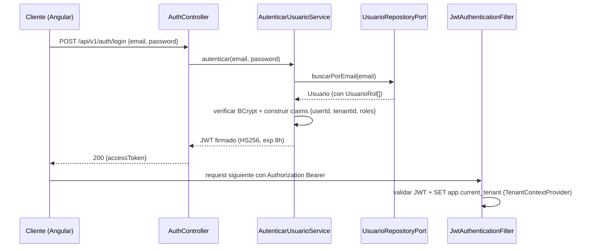

# Design Doc `DD-UC-002` — Identidad: modelo Usuario/UsuarioRol y autenticación

> **Qué es**: primer feature de negocio real sobre el esqueleto de `DD-UC-001`. Implementa el módulo `identidad` (dominio `Usuario`/`UsuarioRol`, login con JWT, seed del primer `SYSADMIN`) y activa por primera vez el `TenantContext` real (hasta ahora un placeholder), cerrando el gap dejado por `ADR-0001` (RLS) entre "decisión" e "implementación".
>
> **Relación con otros documentos**: consume `ADR-0010` (invariante multi-rol + `SYSADMIN` sin tenant) y `ADR-0011` (módulo `identidad`, puerto público `UsuarioCreacionPort` para que `plataforma` lo consuma en `DD-UC-003`). Es prerequisito de `DD-UC-003` (alta de tenants, `FSD-UC-011`), de `DD-UC-004` (UI login + consola SysAdmin) y de `DD-UC-005` (CRUD completo de usuarios, resto de `FSD-UC-021` — pendiente).
>
> **Nota de secuencia (decisión explícita del usuario, 14/07/2026)**: se evaluó invertir el orden respecto al comentario original de `DD-UC-001` §2 (que insinuaba `plataforma` → `DD-UC-002`, `identidad` → `DD-UC-003`). Se confirmó este orden (`identidad`/login primero) porque `FSD-UC-011` paso 3 (*"El SysAdmin crea el primer usuario `ADMIN` del tenant"*) y su propia precondición (*"sesión activa a nivel plataforma"*) dependen de que `identidad` ya exista; así, `DD-UC-003` puede consumir el puerto público `UsuarioCreacionPort` de este documento sin duplicar lógica ni violar los límites de módulo de `ADR-0011`.

## 1. Objetivo y contexto

- **Qué resuelve este feature**: permitir que un usuario (inicialmente solo el `SYSADMIN` seed) inicie sesión y obtenga un JWT válido con claims `{userId, tenantId, roles}`; propagar ese contexto a cada request (`SecurityContext` de Spring + `TenantContext` de dominio); dejar creado el modelo `Usuario`/`UsuarioRol` con su invariante de exclusión mutua.
- **Caso(s) de uso del FSD que implementa**: parte de `FSD-UC-021` (Gestión de Usuarios y Roles, `docs/product/FSD.md#4611-fsd-uc-021--gestión-de-usuarios-y-roles`) — específicamente la autenticación, no el CRUD administrativo completo (eso es `DD-UC-005`).
- **Alcance**:
  - **Dentro**: entidades de dominio `Usuario` (Aggregate Root) y `UsuarioRol`; invariante de agregado `tenant_id IS NULL ⟺ roles = {SYSADMIN}` validada en el constructor/factory (no solo en la capa REST); puerto de entrada `AutenticarUsuarioUseCase` (login); puerto de entrada `CrearUsuarioUseCase` (uso interno, sin endpoint REST propio todavía — lo expone `DD-UC-005`); puerto de salida `UsuarioRepositoryPort`; adaptador REST público `POST /api/v1/auth/login`; adaptador JPA (`usuario`, `usuario_rol`, Flyway `V2__identidad_usuario.sql`); `JwtAuthenticationFilter` + `JwtTokenProvider` (emisión/validación); implementación real de `TenantContextProvider` (`shared/tenant/`) que ejecuta `SET app.current_tenant` en la conexión JDBC activa según el claim del JWT; seed del primer `SYSADMIN` (migración Flyway o `ApplicationRunner` condicional, contraseña desde variable de entorno, nunca hardcodeada); puerto público `UsuarioCreacionPort` (Open Host Service, `ADR-0011`) para que otros módulos (`plataforma` en `DD-UC-003`) puedan crear usuarios sin importar clases internas de `identidad`.
  - **Fuera** (Design Docs posteriores): CRUD administrativo completo — alta desde el Admin, `PATCH /usuarios/{id}/roles`, activar/desactivar, restablecer contraseña (`DD-UC-005`); alta y gestión de `Tenant` (`DD-UC-003`); UI login + consola SysAdmin (`DD-UC-004`); refresh tokens / logout con blacklist (se evalúa solo si la expiración de 8 h de `PRD-NFR-007` resulta insuficiente en uso real); RLS real sobre tablas académicas tenant-scoped (`DD-UC-006`, `ADR-0001` ya decidido, pendiente de implementación).

## 2. Diseño (el "cómo") `[humano+máquina]`

- **Enfoque elegido**: JWT stateless (sin sesión en servidor), firmado con **HS256** y secreto simétrico en variable de entorno (`JWT_SECRET`), expiración 8 h (`PRD-NFR-007`). `Spring Security 7` con `SecurityFilterChain` propio (sin `spring-boot-starter-oauth2-resource-server`, innecesario para un único emisor/validador en el mismo monolito). El filtro puebla tanto el `SecurityContext` (autorización RBAC vía `@PreAuthorize`) como el `TenantContext` de dominio (usado por RLS y por lógica de aplicación).
- **Estrategia RLS para tablas plataforma-scoped (decisión explícita del usuario, 14/07/2026)**: las tablas sin `tenant_id` propio (`usuario` cuando su único rol es `SYSADMIN`; futura `tenant` en `DD-UC-003`) usan la política RLS `CREATE POLICY tenant_isolation ON usuario USING (tenant_id = current_setting('app.current_tenant', true)::uuid OR tenant_id IS NULL)` — extiende el patrón de `ADR-0001` con una cláusula `OR tenant_id IS NULL` en vez de introducir un rol de BD con `BYPASSRLS`. **Mitigación obligatoria**: como esta política amplía la visibilidad de las filas `SYSADMIN` a cualquier tenant autenticado (RLS por sí sola no las oculta de un Admin de tenant), `UsuarioRepositoryPort` **debe** filtrar explícitamente `WHERE tenant_id = :tenantActual` en toda consulta que no sea del propio flujo de login/`SYSADMIN`, sin depender solo de RLS para este caso particular. Decisión de bajo riesgo y revisable sin costo alto si en el futuro se detecta una fuga real (no amerita ADR propio — ver §3).
- **Componentes tocados**:

```
backend/src/main/java/com/edusync/
├── identidad/
│   ├── domain/
│   │   ├── Usuario.java                 (Aggregate Root; invariante tenant_id/roles en factory)
│   │   ├── UsuarioRol.java              (entidad de relación N:M)
│   │   └── Rol.java                     (enum SYSADMIN/ADMIN/SECRETARIA/ASESOR/PROFESOR)
│   ├── application/
│   │   ├── port/in/AutenticarUsuarioUseCase.java
│   │   ├── port/in/CrearUsuarioUseCase.java        (uso interno; sin endpoint REST en este DD)
│   │   ├── port/out/UsuarioRepositoryPort.java
│   │   └── service/AutenticarUsuarioService.java, CrearUsuarioService.java
│   └── infrastructure/
│       ├── adapter/in/rest/AuthController.java     (POST /api/v1/auth/login)
│       ├── adapter/in/rest/UsuarioCreacionPortImpl.java  (Open Host Service para otros módulos)
│       ├── adapter/out/persistence/{UsuarioJpaRepository, UsuarioJpaEntity, UsuarioRolJpaEntity}
│       └── security/{JwtAuthenticationFilter, JwtTokenProvider, SecurityConfig}
└── shared/tenant/
    └── TenantContextProvider.java        (implementación real; placeholder desde DD-UC-001)
```

- **Contratos**: `POST /api/v1/auth/login` → `{email, password}` → `200 {accessToken, expiresIn: 28800}` | `401 E_CREDENCIALES_INVALIDAS`. `UsuarioCreacionPort.crear(CrearUsuarioCommand)` → `UsuarioId` (puerto Java, no REST — consumido por `plataforma` en `DD-UC-003`).
- **Diagrama**:



## 3. Alternativas consideradas

| Alternativa | Pros | Contras | ¿Elegida? |
|-------------|------|---------|-----------|
| A. JWT firmado con HS256 (secreto simétrico) | Simple; suficiente porque emisor y validador son el mismo monolito | Rotación de secreto más manual que RS256 | **sí** |
| B. JWT firmado con RS256 (par de llaves) | Preparado para validar el token desde un servicio externo en el futuro (ej. gateway separado) | Complejidad de gestión de llaves sin necesidad confirmada hoy | no |
| C. Sesión server-side (`HttpSession` + Redis) | Revocación inmediata de sesión | Contradice el enfoque stateless ya implícito en `PRD-NFR-007`/`ADR-0008`; infraestructura adicional (Redis) sin justificación de tamaño de equipo | no |
| D. Política RLS `OR tenant_id IS NULL` sobre `usuario`/tablas plataforma-scoped, con filtro explícito adicional en `UsuarioRepositoryPort` | Cambio mínimo sobre `ADR-0001` (misma mecánica de política RLS, sin infraestructura nueva); no requiere un segundo rol/pool de conexión JDBC | Depende de que la capa de aplicación mantenga el filtro adicional disciplinadamente — RLS por sí sola no basta como única barrera para las filas `SYSADMIN` | **sí** |
| E. Rol de BD con `BYPASSRLS` para `identidad`/`plataforma` | Aislamiento más limpio a nivel de motor, sin depender de disciplina de capa de aplicación | Segunda fuente de conexión/rol JDBC a mantener; mayor complejidad operativa sin beneficio adicional confirmado hoy | no |

> Ninguna decisión de esta sección amerita un ADR propio: son de bajo riesgo y revisables sin costo alto si el uso real revela un problema (a diferencia de `ADR-0011`, que sí lo amerita por su impacto estructural en todos los módulos futuros). Si en el futuro se detecta una fuga real de datos `SYSADMIN` hacia tenants, la migración de alternativa D a E es un cambio de infraestructura acotado (nuevo rol de BD + `BYPASSRLS`), sin tocar el modelo de dominio.

## 4. Impacto en las specs vivas `[máquina]`

| Artefacto vivo | Cambio | ¿Delta vs DTI vFinal? |
|----------------|--------|-----------------------|
| `docs/arquitectura_hexagonal_EduSync.md` | Documentar el módulo `identidad` real (puertos/adaptadores) además de `notassie`; añadir `UsuarioCreacionPort` como ejemplo de Open Host Service entre módulos (`ADR-0011`) | no (extensión, no reemplaza Perfil Bolivia SIE) |
| `docs/product/DTP.md` | §A.1 nueva fila (login/identidad); §A.3 `FSD-UC-021` pasa de `pendiente` a `en progreso` (parcial: solo autenticación, CRUD completo queda en `DD-UC-005`) | no (uso normal de la capa viva, sin cambio de requisitos) |
| `docs/PROMPT_MAPPING.md` | Nueva fila `PR-IMPL-002` en área `IMPL` | no |
| `docs/adr/` | Sin ADR nuevo — las decisiones de §2/§3 (HS256, política RLS `OR tenant_id IS NULL`) quedan documentadas en este DD, no en un ADR dedicado (ver nota de §3) | no |

> **Recordatorio (regla de oro)**: el baseline congelado de M4 (`docs/baseline/`) **no se toca**. Los cambios de esta sección viven en `docs/product/`, `docs/arquitectura_hexagonal_EduSync.md` y `docs/design/`.

## 5. Prompts usados `[máquina]`

| Prompt | Tarea | Artefacto generado |
|--------|-------|---------------------|
| `PR-IMPL-002` | Generación del módulo `identidad` (dominio, aplicación, infraestructura), `JwtAuthenticationFilter`, seed `SYSADMIN`, `TenantContextProvider` real, migración `V2__identidad_usuario.sql` con política RLS `OR tenant_id IS NULL` | `backend/src/main/java/com/edusync/identidad/**`, `backend/src/main/java/com/edusync/shared/tenant/TenantContextProvider.java`, `backend/src/main/resources/db/migration/V2__identidad_usuario.sql` |

> Cada prompt sigue [`PROMPT_TEMPLATE.md`](../../plantillas/plantillas1/PROMPT_TEMPLATE.md), vive en `docs/prompts/impl/PR-IMPL-NNN.md` (única área que se desvía del directorio raíz `prompts/`, siguiendo [`FEATURE_DESIGN_DOC_TEMPLATE.md`](../../plantillas/plantillas3/FEATURE_DESIGN_DOC_TEMPLATE.md) §5) y se referencia desde `docs/PROMPT_MAPPING.md`.

## 6. Plan de pruebas y evals

- **Unit**: invariante `tenant_id IS NULL ⟺ roles = {SYSADMIN}` (casos límite: intento de `SYSADMIN` con rol de tenant → excepción de dominio); `JwtTokenProvider` (emisión/expiración/firma inválida); `UsuarioRepositoryPort` con el filtro explícito `tenant_id` sobre el escenario de la política RLS `OR tenant_id IS NULL` (verificar que un Admin de tenant nunca recibe filas `SYSADMIN` aunque la política RLS las deje pasar).
- **Integration**: `POST /api/v1/auth/login` caso feliz (SYSADMIN seed) y caso credenciales inválidas (`401 E_CREDENCIALES_INVALIDAS`); verificación de que `app.current_tenant` se fija correctamente tras un login con `tenant_id` no nulo (test con Testcontainers PostgreSQL 15); verificación explícita de la política RLS `tenant_isolation` sobre `usuario` (query cross-tenant debe devolver 0 filas de otro tenant, salvo las de `SYSADMIN` — que deben quedar bloqueadas por el filtro de aplicación, no solo por RLS).
- **E2E / Gherkin**: escenario "Login exitoso con credenciales válidas" (`docs/product/PRD.md` §5.1.1, `PRD-US-001`) adaptado al flujo genérico multi-rol.
- **Arquitectura**: `ModularityTests` (heredado de `DD-UC-001`) debe seguir en verde con el nuevo módulo `identidad` poblado; verificar que ningún otro módulo importa clases internas de `identidad.domain`/`identidad.application` (solo `UsuarioCreacionPort` vía `infrastructure.adapter.in`).

## 7. Definition of Done (checklist)

- [x] `fsd_uc` declarado y enlazado (`FSD-UC-021`, parcial — autenticación).
- [x] Diseño (§2) y alternativas (§3) documentados, incluida la decisión de RLS plataforma-scoped (alternativa D, con mitigación de filtro explícito).
- [x] Confirmación explícita del usuario: orden `identidad` (login) antes de `plataforma` (tenants); política RLS `OR tenant_id IS NULL` sin ADR dedicado propio (nota: el número `ADR-0012` quedó libre en esa decisión y se usó después para un tema distinto y transversal — ver última fila de esta tabla).
- [x] Prompt `PR-IMPL-002` creado en `docs/prompts/impl/` y registrado en `PROMPT_MAPPING.md` (v2.3).
- [x] Tests/evals definidos (§6) y pasando: 27 tests en verde (`AutenticarUsuarioServiceTest` 4, `CrearUsuarioServiceTest` 3, `AuthIntegrationTest` 4 con Testcontainers PostgreSQL 15, `UsuarioTest` 6, `JwtTokenProviderTest` 3, `ModularityTests` 7).
- [x] `ModularityTests` en verde (7/7) con el módulo `identidad` poblado — sin ciclos ni accesos ilegales entre módulos.
- [x] DTP actualizado (changelog + estado de `FSD-UC-021`) vía `dtp-sync` — ver `docs/product/DTP.md` v1.8.
- [x] PR de código declara: prompts usados (`PR-IMPL-002`, luego `ADR-0012` aplicado retroactivamente sobre el mismo módulo), archivos generados vs. editados a mano — ver `docs/prompts/impl/PR-IMPL-002.md` §1.4/§1.5 y este changelog.
- [x] **Delta transversal posterior** (`ADR-0012`, 19/07/2026): Lombok (allowlist en `domain/`), springdoc-openapi y Bean Validation aplicados retroactivamente sobre el código ya generado por `PR-IMPL-002` — `Usuario.java` (accessors JavaBean), `UsuarioJpaEntity`/`UsuarioRolJpaEntity` (Lombok sin restricción), `AutenticarUsuarioService`/`CrearUsuarioService` (`@RequiredArgsConstructor`), `LoginRequest` (`@NotBlank`/`@Email`), `AuthController` (`@Valid` + anotaciones Swagger), `shared.web.{GlobalExceptionHandler,OpenApiConfig,ErrorResponse}` (nuevos, transversales a todos los módulos). No es un delta de `FSD-UC-021` (sin cambio de requisitos ni de contrato REST observable) — documentado aquí porque es el primer módulo de código real al que se aplica.

## 8. Registro de cambios

| Versión | Fecha | Autor | Cambio |
|---------|-------|-------|--------|
| v1.0 | 14/07/2026 | Rodrigo Aspeti | Creación del segundo Design Doc de código (`DD-UC-002`), primer feature de negocio real: módulo `identidad` (`Usuario`/`UsuarioRol`, login JWT, seed `SYSADMIN`, `TenantContextProvider` real). Decisión explícita del usuario de invertir el orden sugerido en `DD-UC-001` (identidad/login antes que plataforma/tenants) y de resolver el aislamiento RLS de tablas plataforma-scoped con la alternativa D (política `OR tenant_id IS NULL` + filtro explícito en `UsuarioRepositoryPort`), sin crear un ADR dedicado propio en ese momento. Estado `aprobado`. |
| v1.1 | 19/07/2026 | Rodrigo Aspeti | Sincronización del DoD (§7) tras la ejecución real de `PR-IMPL-002` (27 tests en verde, incluye `ModularityTests` 7/7) y la aplicación retroactiva de `ADR-0012` (Lombok con *allowlist* en `domain/`, springdoc-openapi, Bean Validation) sobre este mismo módulo. Sin cambios en §1–§6 (diseño y alcance funcional no cambian). |
