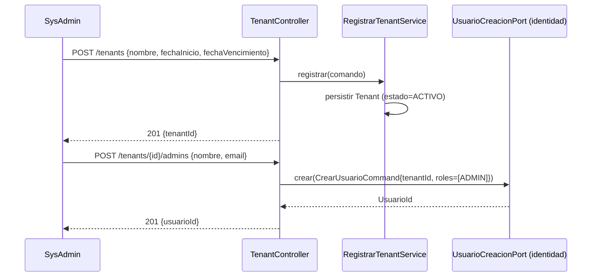

# Design Doc `DD-UC-003` — Plataforma: alta y gestión de Tenants y Suscripciones

> **Qué es**: primer feature completo de `FSD-UC-011` (Gestión de Tenants y Suscripciones). Implementa el módulo `plataforma` (`Tenant`, ciclo de suscripción, scheduler de vencimiento) y consume por primera vez el puerto público `UsuarioCreacionPort` de `identidad` (`DD-UC-002`) para crear el primer `ADMIN` de cada tenant, validando en la práctica el límite de módulo definido en `ADR-0011`.
>
> **Relación con otros documentos**: depende de `DD-UC-002` (login/`UsuarioCreacionPort` ya deben existir); es la implementación real que `DD-UC-001` §1 dejó pendiente para `FSD-UC-011`. Alimenta el DTP (§A.1, §A.3) vía `@dtp-sync`.

## 1. Objetivo y contexto

- **Qué resuelve este feature**: permitir que el `SYSADMIN` (seed creado en `DD-UC-002`) registre una nueva Unidad Educativa (`Tenant`), le asigne su primer `ADMIN`, y gestione su estado (`ACTIVO`/`SUSPENDIDO`/`VENCIDO`) a lo largo del ciclo de suscripción — incluida la transición automática a `VENCIDO` cuando la fecha de vencimiento pasa sin renovación.
- **Caso(s) de uso del FSD que implementa**: `FSD-UC-011` completo (`docs/product/FSD.md` §4.6.1).
- **Alcance**:
  - **Dentro**: entidad de dominio `Tenant` (Aggregate Root: `id`, `nombre`, `fechaInicioSuscripcion`, `fechaVencimientoSuscripcion`, `estado`); puertos de entrada `RegistrarTenantUseCase`, `CambiarEstadoTenantUseCase`; puerto de salida `TenantRepositoryPort`; adaptador REST `POST /api/v1/plataforma/tenants`, `POST /api/v1/plataforma/tenants/{id}/admins` (**dos llamadas separadas**, no combinadas — ver §3), `PATCH /api/v1/plataforma/tenants/{id}/estado`; scheduler diario (`@Scheduled` de Spring, dentro del mismo monolito) que marca `VENCIDO` a los tenants con `fechaVencimientoSuscripcion` pasada; Flyway `V3__plataforma_tenant.sql` (tabla `tenant`, sin política RLS propia — no tiene `tenant_id`, es la tabla que *define* los tenants); enforcement de `BR-014` (bloqueo de login de tenants `SUSPENDIDO`/`VENCIDO`) como una verificación adicional dentro de `AutenticarUsuarioService` (módulo `identidad`, `DD-UC-002`) que consulta `TenantConsultaPort` — **este es el primer caso real de comunicación bidireccional entre `identidad` y `plataforma`**, resuelto vía puertos públicos en ambos sentidos, nunca por imports directos (`ADR-0011`).
  - **Fuera** (Design Docs posteriores): resto de `FSD-UC-012`..`FSD-UC-020` (Gestión Escolar, periodos, secciones, evaluaciones, cursos, materias, estudiantes); CRUD administrativo completo de usuarios (`DD-UC-004`); diseño del tenant "demo" (primer `Tenant` del sistema, con fines de venta, mencionado en `docs/product/FSD.md` §4.6.1 nota `ADR-0010`) — **diferido por completo a un Design Doc posterior**; no bloquea este documento ni el modelo de `Tenant`/`Usuario` ya decidido (`ADR-0009`/`ADR-0010`); facturación/cobro real de la suscripción (fuera del alcance funcional actual, solo se registran fechas).

## 2. Diseño (el "cómo")

- **Enfoque elegido**: el módulo `plataforma` no importa clases de `identidad` ni viceversa; ambos exponen puertos públicos (Open Host Service, `ADR-0011`): `identidad` ya expone `UsuarioCreacionPort` (`DD-UC-002`); `plataforma` expone aquí `TenantConsultaPort` (para que `identidad` verifique el estado del tenant durante el login, `BR-014`).
- **Alta de tenant + admin en dos llamadas separadas** (confirmado explícitamente por el usuario, 14/07/2026): `POST /tenants` crea el `Tenant`; `POST /tenants/{id}/admins` crea su primer `ADMIN` en una llamada posterior, delegando a `UsuarioCreacionPort` de `identidad`. Esto replica exactamente el flujo de 3 pasos ya documentado en `FSD-UC-011` (§4.6.1, pasos 1 y 3) sin generar un delta que justificar. Ventajas frente a una única llamada combinada: permite tenants con más de un `ADMIN` sin duplicar rutas; separa la responsabilidad de dominio "existe un Tenant" (`plataforma`) de "existe un Usuario ADMIN en ese Tenant" (`identidad`); si la creación del admin falla tras crear el tenant, el estado intermedio ("tenant sin admin todavía") es válido y fácil de reintentar, en vez de forzar una transacción combinada entre dos módulos.
- **Tenant demo**: fuera de alcance de este DD (ver §1); `docs/product/FSD.md` §4.6.1 se corrige para referenciar el Design Doc real donde se resolverá (pendiente de crear, no `DD-UC-003`).
- **Scheduler de vencimiento**: `@Scheduled` de Spring dentro del mismo proceso del monolito (confirmado por el usuario). **Nota de revisión futura**: si en algún momento se despliegan 2+ réplicas del backend (`docs/baseline/DTI.md` §8 / `ADR-0006`, hoy 1 instancia ECS Fargate), este job debe protegerse con un mecanismo de bloqueo distribuido (ej. `ShedLock`) para evitar ejecuciones duplicadas; no se implementa ahora porque no hay evidencia de esa necesidad.
- **Componentes tocados**:

```
backend/src/main/java/com/edusync/
├── plataforma/
│   ├── domain/
│   │   ├── Tenant.java                  (Aggregate Root)
│   │   └── EstadoTenant.java             (enum ACTIVO/SUSPENDIDO/VENCIDO)
│   ├── application/
│   │   ├── port/in/{RegistrarTenantUseCase, CambiarEstadoTenantUseCase}.java
│   │   ├── port/out/TenantRepositoryPort.java
│   │   └── service/{RegistrarTenantService, CambiarEstadoTenantService, VencimientoSchedulerService}.java
│   └── infrastructure/
│       ├── adapter/in/rest/TenantController.java
│       ├── adapter/in/scheduler/VencimientoSchedulerJob.java   (@Scheduled diario)
│       ├── adapter/out/persistence/{TenantJpaRepository, TenantJpaEntity}
│       └── adapter/out/port/TenantConsultaPortImpl.java         (Open Host Service para identidad)
└── identidad/
    └── application/service/AutenticarUsuarioService.java        (modificado: consulta TenantConsultaPort, BR-014)
```

- **Diagrama**:



## 3. Alternativas consideradas

| Alternativa | Pros | Contras | ¿Elegida? |
|-------------|------|---------|-----------|
| A. Scheduler interno `@Scheduled` (Spring) | Sin infraestructura adicional; suficiente para un monolito con 1 instancia | No escala horizontalmente sin coordinación (ej. `ShedLock`) si se despliegan múltiples réplicas | **sí** |
| B. Job externo (cron de infraestructura llamando a un endpoint interno) | Desacoplado del ciclo de vida de la app | Complejidad operativa adicional sin necesidad confirmada hoy | no |
| C. Alta de tenant + admin en dos llamadas REST separadas | Coincide con el flujo ya documentado en `FSD-UC-011`; soporta múltiples admins sin duplicar rutas; estado intermedio "tenant sin admin" es válido y fácil de reintentar | Dos *round-trips* HTTP en vez de uno; el frontend debe encadenar ambas llamadas | **sí** |
| D. Alta de tenant + admin combinada en una sola llamada REST | Un solo *round-trip*; garantiza que nunca exista un tenant sin admin | Requeriría actualizar `FSD-UC-011` (delta adicional); acopla temporalmente `plataforma` e `identidad` dentro de un mismo request/transacción | no |

> Ninguna decisión de esta sección amerita un ADR propio (bajo riesgo, revisables sin costo alto): la alternativa A es revisable a `ShedLock` sin cambiar el modelo de dominio; la alternativa C es revisable a D cambiando solo el controlador REST y el flujo del FSD, sin tocar `Tenant`/`Usuario`.

## 4. Impacto en las specs vivas

| Artefacto vivo | Cambio | ¿Delta vs DTI vFinal? |
|----------------|--------|-----------------------|
| `docs/product/FSD.md` | Corregir §4.6.1 nota `ADR-0010`: la referencia al Design Doc donde se resolverá el diseño del tenant demo deja de decir `"DD-UC-011"` (numeración inexistente/confusa con el ID de `FSD-UC-011`) y pasa a decir explícitamente que queda pendiente de un Design Doc de seguimiento aún sin crear, distinto de `DD-UC-003` | no (corrección de referencia, no de requisito) |
| `docs/product/DTP.md` | §A.1 nueva fila; §A.3 `FSD-UC-011` pasa de `en progreso` (Design Doc `DD-UC-001`, solo bootstrap) a `en progreso` con Design Doc real `DD-UC-003` | no |
| `docs/PROMPT_MAPPING.md` | Nueva fila `PR-IMPL-003` en área `IMPL` | no |
| `docs/arquitectura_hexagonal_EduSync.md` | Documentar el módulo `plataforma` real (puertos/adaptadores) y el patrón de comunicación bidireccional `plataforma`↔`identidad` vía puertos públicos | no (extensión) |

> **Recordatorio (regla de oro)**: el baseline congelado de M4 (`docs/baseline/`) **no se toca**.

## 5. Prompts usados

| Prompt | Tarea | Artefacto generado |
|--------|-------|---------------------|
| `PR-IMPL-003` | Generación del módulo `plataforma` (`Tenant`, scheduler de vencimiento, `TenantConsultaPort`) y modificación de `AutenticarUsuarioService` (módulo `identidad`) para aplicar `BR-014` | `backend/src/main/java/com/edusync/plataforma/**`, cambios en `identidad/application/service/AutenticarUsuarioService.java`, `V3__plataforma_tenant.sql` |

> Cada prompt sigue [`PROMPT_TEMPLATE.md`](../../plantillas/plantillas1/PROMPT_TEMPLATE.md), vive en `docs/prompts/impl/PR-IMPL-NNN.md` y se referencia desde `docs/PROMPT_MAPPING.md`.

## 6. Plan de pruebas y evals

- **Unit**: transición de estado `Tenant` (`ACTIVO`→`VENCIDO` solo si `fechaVencimientoSuscripcion` pasó, no antes); rechazo de login para tenant `SUSPENDIDO`/`VENCIDO` (`BR-014`, `E_TENANT_NO_ACTIVO`).
- **Integration**: `POST /tenants` + `POST /tenants/{id}/admins` de punta a punta (crea tenant y su primer Admin vía `UsuarioCreacionPort`, verificando que el `Usuario` resultante tiene `tenant_id` no nulo y rol `ADMIN`); scheduler marca `VENCIDO` correctamente (test con reloj simulado, `Clock` inyectado); verificación de que los datos académicos de un tenant `SUSPENDIDO` permanecen intactos (no se eliminan, `BR-014`).
- **E2E / Gherkin**: escenario "Bloqueo de acceso por tenant vencido" (`docs/product/FSD.md` §4.6.1).
- **Arquitectura**: `ModularityTests` verifica que `plataforma`↔`identidad` solo se comunican vía `UsuarioCreacionPort`/`TenantConsultaPort`, nunca por import directo entre `domain`/`application` de ambos módulos.

## 7. Definition of Done (checklist)

- [x] Decisiones confirmadas por el usuario (14/07/2026): tenant demo diferido a un Design Doc posterior (no bloqueante); scheduler `@Scheduled` de Spring; alta de tenant + admin en dos llamadas REST separadas (sin cambios sobre el flujo ya documentado en `FSD-UC-011`); corrección de la referencia ambigua en `FSD.md` §4.6.1.
- [x] Diseño (§2) y alternativas (§3) documentados.
- [x] §4 Impacto en specs vivas registrado (sin tocar el baseline).
- [ ] Prompt `PR-IMPL-003` creado en `docs/prompts/impl/` y registrado en `PROMPT_MAPPING.md` — **siguiente paso inmediato tras este documento**.
- [ ] Tests/evals definidos (§6) y pasando — requieren que `PR-IMPL-003` se ejecute primero.
- [ ] `ModularityTests` en verde con la comunicación bidireccional `plataforma`↔`identidad`.
- [ ] DTP actualizado vía `dtp-sync`.

## 8. Registro de cambios

| Versión | Fecha | Autor | Cambio |
|---------|-------|-------|--------|
| v1.0 | 14/07/2026 | Rodrigo Aspeti | Creación del tercer Design Doc de código (`DD-UC-003`), primera implementación completa de `FSD-UC-011` (alta y gestión de Tenants): módulo `plataforma` (`Tenant`, scheduler de vencimiento, `TenantConsultaPort`) y primer caso de comunicación bidireccional entre módulos (`plataforma`↔`identidad`) vía puertos públicos (`ADR-0011`). Decisiones explícitas del usuario: tenant demo diferido a un Design Doc posterior; scheduler `@Scheduled` de Spring; alta de tenant + admin en dos llamadas REST separadas (consistente con `FSD-UC-011` ya documentado); corrección de la referencia ambigua `"DD-UC-011"` en `docs/product/FSD.md` §4.6.1. Estado `aprobado`. |
