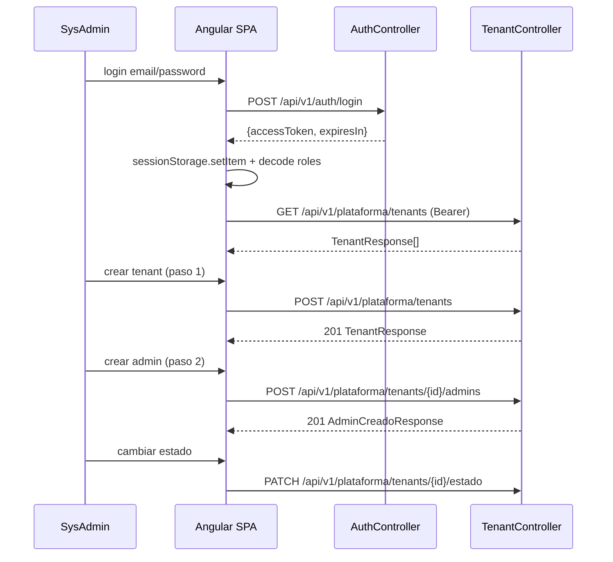

# Design Doc `DD-UC-004` — Frontend: autenticación y consola SysAdmin

> **Qué es**: primer *vertical slice* de UI sobre el esqueleto Angular 21 de `DD-UC-001`. Cierra el ciclo demo: login JWT → consola SysAdmin → alta de Tenant + primer `ADMIN` (dos pasos) → cambio de estado. Consume las APIs de `DD-UC-002`/`DD-UC-003` y añade el único hueco de backend necesario para la consola: `GET /api/v1/plataforma/tenants`.
>
> **Relación con otros documentos**: depende de `PR-IMPL-002` y `PR-IMPL-003` ya ejecutados. Reasigna el ID `DD-UC-004` (citado informalmente en `DD-UC-002` §1 como futuro CRUD de usuarios) a esta UI; el CRUD administrativo completo de usuarios (`FSD-UC-021` resto) queda como `DD-UC-005` futuro. Alimenta el DTP (§A.1, §A.3) vía `@dtp-sync`.

## 1. Objetivo y contexto

- **Qué resuelve este feature**: permitir al `SYSADMIN` seed iniciar sesión desde el navegador, listar y crear tenants, crear el primer `ADMIN` de cada tenant y cambiar su estado (`ACTIVO`/`SUSPENDIDO`/`VENCIDO`), con feedback de errores de negocio (`E_TENANT_NO_ACTIVO`, `E_SUSCRIPCION_INCOMPLETA`, credenciales inválidas, RBAC).
- **Caso(s) de uso del FSD que implementa**: `FSD-UC-021` parcial (solo login UI, `docs/product/FSD.md` §4.6.11) + `FSD-UC-011` UI del flujo SysAdmin (`docs/product/FSD.md` §4.6.1).
- **Alcance**:
  - **Dentro**:
    - `frontend/src/app/core/auth/`: `AuthService`, JWT en `sessionStorage`, interceptor Bearer, decode de claims (`roles`, `tenantId`) sin verificar firma en cliente, `authGuard`, `roleGuard`.
    - `frontend/src/app/features/auth/`: pantalla de login.
    - `frontend/src/app/features/plataforma/`: lista de tenants, alta de tenant, alta de admin (wizard de 2 pasos), cambio de estado.
    - Layout shell mínimo post-login (nav + router outlet).
    - Proxy de desarrollo Angular → backend local (`/api` → `http://localhost:8080`).
    - Redirect post-login: `SYSADMIN` → `/plataforma/tenants`; otros roles → `/home` (placeholder).
    - Delta backend mínimo: `GET /api/v1/plataforma/tenants` restringido a `SYSADMIN` (`@PreAuthorize`), devolviendo `List<TenantResponse>`.
  - **Fuera** (Design Docs posteriores): CRUD administrativo completo de usuarios (`DD-UC-005` / resto de `FSD-UC-021`); diseño del tenant "demo"; design system / branding pesado; portal Angular separado SysAdmin vs colegio (sigue SPA única de `DD-UC-001`); refresh tokens / logout con blacklist; home funcional para rol `ADMIN` de tenant (solo placeholder en este DD).

## 2. Diseño (el "cómo")

- **Enfoque elegido**: SPA Angular 21 standalone ya fijada en `DD-UC-001` / `ADR-0008`. Sesión JWT almacenada en `sessionStorage` (confirmado 19/07/2026): se limpia al cerrar la pestaña/ventana; suficiente para el MVP y preferible a `localStorage` frente a XSS persistente. Los claims del JWT (`roles`, `tenantId`) bastan para routing y guards en cliente; **no** se añade un endpoint `/me` en este slice. La autorización real sigue exclusivamente en el backend (`@PreAuthorize`, Spring Security).
- **Alta de tenant + admin**: wizard UI de dos pasos que invoca las mismas dos llamadas REST ya existentes (`POST /tenants` luego `POST /tenants/{id}/admins`), sin combinar endpoints (`DD-UC-003` §2/§3).
- **Lista de tenants**: requiere el nuevo `GET /api/v1/plataforma/tenants` (sin este endpoint la consola no puede listar lo creado).
- **Componentes tocados**:

```
frontend/src/app/
├── core/
│   ├── auth/
│   │   ├── auth.service.ts           # login, logout, sessionStorage, claims
│   │   ├── auth.interceptor.ts       # Authorization: Bearer
│   │   ├── auth.guard.ts             # ruta autenticada
│   │   ├── role.guard.ts             # ruta por rol (SYSADMIN)
│   │   └── jwt.util.ts               # decode payload (sin verificar firma)
│   └── api/
│       └── api-base.ts               # base URL / helpers HttpClient
├── shared/
│   └── layout/
│       └── shell.component.ts        # nav mínima + outlet
└── features/
    ├── auth/
    │   └── login/
    │       └── login.page.ts
    └── plataforma/
        ├── tenants-list.page.ts
        ├── tenant-create.page.ts           # paso 1: POST /tenants
        ├── tenant-admin-create.page.ts     # paso 2: POST /tenants/{id}/admins
        └── (cambio de estado inline o diálogo PATCH .../estado)

backend/ (delta mínimo sobre DD-UC-003):
└── plataforma/
    ├── application/port/in/ListarTenantsUseCase.java (+ servicio)
    ├── application/port/out/TenantRepositoryPort.java  # + listarTodos()
    └── infrastructure/adapter/in/rest/TenantController.java
        + GET /api/v1/plataforma/tenants → List<TenantResponse>
```

- **Contratos UI ↔ API**:

| Método | Ruta | Request | Response | Errores relevantes |
|--------|------|---------|----------|--------------------|
| `POST` | `/api/v1/auth/login` | `{email, password}` | `{accessToken, expiresIn}` | `401` credenciales; `403 E_TENANT_NO_ACTIVO` |
| `GET` | `/api/v1/plataforma/tenants` | — (Bearer SYSADMIN) | `TenantResponse[]` | `401`/`403` |
| `POST` | `/api/v1/plataforma/tenants` | `{nombre, fechaInicioSuscripcion, fechaVencimientoSuscripcion}` | `TenantResponse` `201` | `422 E_SUSCRIPCION_INCOMPLETA` |
| `POST` | `/api/v1/plataforma/tenants/{id}/admins` | `{nombreCompleto, email, password}` | `AdminCreadoResponse` `201` | `404`/`409` |
| `PATCH` | `/api/v1/plataforma/tenants/{id}/estado` | `{estado}` | `TenantResponse` | `404` |

- **Diagrama**:



## 3. Alternativas consideradas

| Alternativa | Pros | Contras | ¿Elegida? |
|-------------|------|---------|-----------|
| A. Un solo DD de UI (login + tenants) | Demo E2E rápido; `core/` compartido una sola vez | PR de implementación algo más grande | **sí** |
| B. Dos DD (login primero, tenants después) | PRs más chicos (&lt; 400 líneas) | Retrasa el flujo completo; duplica setup de `core/` | no |
| C. JWT en `sessionStorage` | Se limpia al cerrar pestaña; menos persistencia XSS que `localStorage` | No sobrevive a cerrar el navegador (aceptable para MVP) | **sí** |
| D. JWT en `localStorage` | Persiste entre sesiones del mismo origen | Más expuesto a XSS persistente | no |
| E. Endpoint `/me` para tipar sesión | Tipado claro sin decode en cliente | Round-trip extra; claims del JWT ya bastan | no |
| F. Sin `GET /tenants` (solo crear) | Menos código backend | Consola inutilizable (no se puede listar) | no |
| G. Portal Angular separado para SysAdmin | Aislamiento UX total | Sobre-ingeniería vs. SPA única ya decidida en `DD-UC-001` | no |

> Ninguna decisión de esta sección amerita un ADR propio (bajo riesgo, revisables sin costo alto): A↔B es división de PR; C↔D es almacenamiento de token; E/F/G son alcance de API/UI.

## 4. Impacto en las specs vivas

| Artefacto vivo | Cambio | ¿Delta vs DTI vFinal? |
|----------------|--------|-----------------------|
| `docs/product/FSD.md` §4.6.1 | Añadir al flujo principal el paso de lectura `GET /api/v1/plataforma/tenants` (lista para consola SysAdmin); no cambia reglas de negocio | no |
| `docs/design/DD-UC-002.md` | Nota de seguimiento: el CRUD administrativo de usuarios pasa de la mención informal `DD-UC-004` a `DD-UC-005` | no |
| `docs/product/DTP.md` | §A.1 nueva fila; §A.3 `FSD-UC-021`/`FSD-UC-011` anotan UI en progreso con `DD-UC-004` | no |
| `docs/PROMPT_MAPPING.md` | Nueva fila `PR-IMPL-004` en área `IMPL` | no |
| `AGENTS.md` | Árbol §3: `frontend/features` y `DD-UC-004`/`PR-IMPL-004` | no |

> **Recordatorio (regla de oro)**: el baseline congelado de M4 (`docs/baseline/`) **no se toca**.

## 5. Prompts usados

| Prompt | Tarea | Artefacto generado |
|--------|-------|---------------------|
| `PR-IMPL-004` | Generación de la UI Angular (auth + plataforma) y delta backend `GET /tenants` según §2 | `frontend/src/app/core/**`, `frontend/src/app/features/auth/**`, `frontend/src/app/features/plataforma/**`, cambios en `TenantController`/`TenantRepositoryPort` (+ tests) |

> Cada prompt sigue [`PROMPT_TEMPLATE.md`](../../plantillas/plantillas1/PROMPT_TEMPLATE.md), vive en `docs/prompts/impl/PR-IMPL-NNN.md` y se referencia desde `docs/PROMPT_MAPPING.md`.

## 6. Plan de pruebas y evals

- **Unit (frontend)**: `AuthService` (login/logout/`sessionStorage`); `authGuard`/`roleGuard` (redirigen si no hay token o falta `SYSADMIN`); mapeo de errores HTTP a mensajes UI (`E_TENANT_NO_ACTIVO`, `E_SUSCRIPCION_INCOMPLETA`).
- **Unit (backend)**: `ListarTenantsUseCase` / repositorio devuelve todos los tenants; vacío cuando no hay filas.
- **Integration**: `GET /api/v1/plataforma/tenants` con Testcontainers + JWT `SYSADMIN` → 200 lista; sin token → 401; con rol `ADMIN` → 403.
- **Smoke manual / E2E mínimo**: login seed SysAdmin → lista vacía o existente → crear tenant → crear admin → suspender tenant → login del admin bloqueado (`403 E_TENANT_NO_ACTIVO`).
- **Build**: `ng build` sin errores; `mvn test` verde (incluye `ModularityTests`).

## 7. Definition of Done (checklist)

- [x] Decisiones confirmadas por el usuario (19/07/2026): un solo DD de UI; incluir `GET /tenants`; JWT en `sessionStorage`.
- [x] Diseño (§2) y alternativas (§3) documentados.
- [x] Sin ADR nuevo (decisiones de bajo riesgo).
- [x] §4 Impacto en specs vivas registrado (sin tocar el baseline).
- [x] Prompt `PR-IMPL-004` creado en `docs/prompts/impl/` y registrado en `PROMPT_MAPPING.md`.
- [ ] Tests/evals definidos (§6) y pasando — requieren que `PR-IMPL-004` se ejecute primero.
- [ ] `ng build` + `mvn test` en verde tras la ejecución.
- [ ] DTP actualizado vía `dtp-sync` — fila de diseño registrada; faltará actualización post-ejecución.

## 8. Registro de cambios

| Versión | Fecha | Autor | Cambio |
|---------|-------|-------|--------|
| v1.0 | 19/07/2026 | Rodrigo Aspeti | Creación del cuarto Design Doc (`DD-UC-004`): primer slice de UI (login + consola SysAdmin). Decisiones explícitas del usuario: un solo DD; `GET /api/v1/plataforma/tenants`; JWT en `sessionStorage`. Reasigna el ID `DD-UC-004` (antes citado informalmente para CRUD usuarios en `DD-UC-002`) a esta UI; CRUD usuarios queda como `DD-UC-005`. Estado `aprobado`. |
