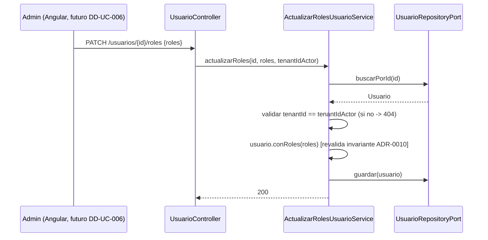

# Design Doc `DD-UC-005` — Identidad: CRUD administrativo de Usuarios y Roles

> **Qué es**: quinto Design Doc de código, backend-only. Cierra `FSD-UC-021` (Gestión de Usuarios y Roles) completando lo que `DD-UC-002` (login/JWT) y `DD-UC-004` (UI de login + consola SysAdmin) dejaron explícitamente pendiente: el CRUD administrativo — alta de usuarios de tenant, gestión de sus roles multi-valor, activación/desactivación y restablecimiento de contraseña.
>
> **Relación con otros documentos**: consume el modelo `Usuario`/`UsuarioRol`/`Rol` y el puerto `UsuarioRepositoryPort` ya creados en `DD-UC-002` (`ADR-0010`, `ADR-0011`, `ADR-0012`); no toca `plataforma` (la creación de usuarios `ADMIN` por el SysAdmin ya existe desde `DD-UC-003`, vía `UsuarioCreacionPort`). Deja explícitamente fuera la UI Angular de estas pantallas (futuro `DD-UC-006`, mismo patrón que `DD-UC-004` separó login/tenants de su backend) y la validación de `Curso`/`Paralelo` para el rol `ASESOR`, bloqueada por los 5 puntos pendientes de `ADR-0009` §3 (módulo `academico` inexistente).

## 1. Objetivo y contexto

- **Qué resuelve este feature**: permite que el `ADMIN` de un tenant administre los usuarios de su propia institución — alta con uno o más roles simultáneos (`ADR-0010`), modificación del conjunto de roles, activación/desactivación, y que cualquier usuario pueda iniciar y confirmar un restablecimiento de contraseña sin depender de intervención manual.
- **Caso(s) de uso del FSD que implementa**: `FSD-UC-021` (`docs/product/FSD.md` §4.6.11), resto no cubierto por `DD-UC-002`/`DD-UC-004` (autenticación).
- **Alcance**:
  - **Dentro**:
    - `POST /api/v1/usuarios` (alta, multi-rol), `GET /api/v1/usuarios` (listado scoped al tenant del Admin — no está en el flujo literal del FSD, se añade por la misma razón que `DD-UC-004` añadió `GET /tenants`: un CRUD sin lectura no es operable), `PATCH /api/v1/usuarios/{id}/roles`, `PATCH /api/v1/usuarios/{id}/estado`, `POST /api/v1/usuarios/{id}/restablecer-password` (inicia el flujo) y `POST /api/v1/auth/restablecer-password/confirmar` (público, cierra el flujo con el token).
    - Métodos inmutables nuevos en el aggregate `Usuario` (`conRoles`, `activar`, `desactivar`), reutilizando `Usuario.crear()` para revalidar la invariante permanente de `ADR-0010` en cada mutación.
    - Nuevo mini-agregado `PasswordResetToken` (token de un solo uso, con expiración) y su persistencia.
    - Puerto de notificación (`NotificacionPort`) con una implementación placeholder *log-only* — el proyecto no tiene todavía un proveedor de email decidido (no aparece en la tabla de stack de `AGENTS.md` §4).
  - **Fuera** (Design Docs / decisiones posteriores):
    - UI Angular de estas pantallas — `DD-UC-006` futuro.
    - Validación **A1** del FSD (`E_ASESOR_SIN_CURSO`, HTTP 422 si el rol `ASESOR` no tiene `Curso`/`Paralelo` asignado): el rol `ASESOR` **se puede asignar** en este DD (el modelo de roles ya lo soporta, `ADR-0010`), pero la validación de la referencia a `Curso`/`Paralelo` queda pendiente hasta que exista el módulo `academico` (`FSD-UC-012..020`, bloqueado por los 5 puntos de `ADR-0009` §3).
    - Envío real de email (AWS SES o equivalente) para el restablecimiento de contraseña — placeholder *log-only* hasta que se tome esa decisión de infraestructura.
    - Refresh tokens / logout con blacklist (ya diferido desde `DD-UC-002`).

## 2. Diseño (el "cómo") `[humano+máquina]`

- **Enfoque elegido**: `Usuario` permanece un POJO inmutable (constructor privado + factory), así que toda mutación (roles, estado) se modela como un método que construye y devuelve una **nueva** instancia, revalidando la invariante permanente `tenantId == null ⟺ roles == {SYSADMIN}` a través del mismo `Usuario.crear()` ya existente — nunca hay un setter directo, coherente con el diseño de `DD-UC-002`. El restablecimiento de contraseña se modela como un mini-agregado independiente (`PasswordResetToken`: `id`, `usuarioId`, `tokenHash`, `expiraEn`, `usado`) para no mezclar estado transitorio de seguridad con el aggregate `Usuario`.
- **Aislamiento de tenant (mismo patrón mitigador de `DD-UC-002` §2)**: la política RLS `OR tenant_id IS NULL` sobre `usuario` no basta por sí sola para que un Admin nunca vea usuarios de otro tenant (ni las filas `SYSADMIN`). Todo método nuevo de `UsuarioRepositoryPort` que lista o muta usuarios para un actor de tenant (`listarPorTenant`) filtra `tenant_id` explícitamente en la capa de aplicación. Cada servicio de mutación (`PATCH roles`, `PATCH estado`) valida que el usuario objetivo pertenece al `tenantId` del actor autenticado (`TenantContext`) **antes** de mutar; si no coincide, responde `404` (no `403`) para no confirmar la existencia de un recurso ajeno a otro tenant.
- **Componentes tocados**:

```
backend/src/main/java/com/edusync/identidad/
├── domain/
│   ├── Usuario.java                        (+ conRoles(Set<Rol>), activar(), desactivar())
│   ├── PasswordResetToken.java             (nuevo; mini-agregado, un solo uso)
│   └── TokenResetInvalidoException.java    (nuevo; mapea a 410 E_ENLACE_INVALIDO)
├── application/
│   ├── port/in/
│   │   ├── ListarUsuariosUseCase.java                    (nuevo)
│   │   ├── ActualizarRolesUsuarioUseCase.java             (nuevo)
│   │   ├── CambiarEstadoUsuarioUseCase.java               (nuevo)
│   │   ├── IniciarRestablecimientoPasswordUseCase.java    (nuevo)
│   │   └── ConfirmarRestablecimientoPasswordUseCase.java  (nuevo)
│   ├── port/out/
│   │   ├── UsuarioRepositoryPort.java       (+ listarPorTenant(UUID tenantId))
│   │   ├── PasswordResetTokenRepositoryPort.java  (nuevo)
│   │   └── NotificacionPort.java            (nuevo; placeholder)
│   └── service/
│       ├── ListarUsuariosService.java, ActualizarRolesUsuarioService.java
│       ├── CambiarEstadoUsuarioService.java
│       └── RestablecerPasswordService.java  (inicia + confirma)
└── infrastructure/
    ├── adapter/in/rest/
    │   ├── UsuarioController.java           (POST, GET, PATCH roles, PATCH estado, POST iniciar-reset)
    │   ├── PasswordResetController.java     (POST confirmar — público, sin auth)
    │   └── dto/{CrearUsuarioRequest,ActualizarRolesRequest,CambiarEstadoRequest,UsuarioResponse,ConfirmarResetRequest}.java
    ├── adapter/out/persistence/
    │   └── {PasswordResetTokenJpaEntity,PasswordResetTokenJpaRepository,PasswordResetTokenRepositoryAdapter}.java
    └── adapter/out/notification/
        └── LogNotificacionAdapter.java       (placeholder; loguea el evento y el usuarioId, NUNCA el token — AGENTS.md §7)

backend/src/main/resources/db/migration/
└── V4__identidad_password_reset_token.sql
```

- **Contratos** (todos bajo `/api/v1`, `@PreAuthorize("hasRole('ADMIN')")` salvo el de confirmación):
  - `POST /usuarios {nombreCompleto, email, passwordInicial, roles:[...], cursoAsignadoId?}` → `201 {id,...}` \| `422 E_ROL_INCOMPATIBLE` \| `422 E_ROLES_VACIO` \| `409 E_EMAIL_EN_USO`.
  - `GET /usuarios` → `200 [UsuarioResponse]` (scoped al `tenantId` del `TenantContext` del Admin autenticado).
  - `PATCH /usuarios/{id}/roles {roles:[...]}` → `200` \| `422 E_ROL_INCOMPATIBLE` \| `404` (no existe o es de otro tenant).
  - `PATCH /usuarios/{id}/estado {activo:boolean}` → `200` \| `404`.
  - `POST /usuarios/{id}/restablecer-password` → `202` (inicia; no devuelve el token, ver §3).
  - `POST /api/v1/auth/restablecer-password/confirmar {token, passwordNuevo}` → `200` \| `410 E_ENLACE_INVALIDO` (público).
- **Diagrama**:



## 3. Alternativas consideradas

| Alternativa | Pros | Contras | ¿Elegida? |
|-------------|------|---------|-----------|
| A. Notificación de reset *log-only* (placeholder `NotificacionPort`), delivery real diferido | Permite avanzar el modelo/token ahora sin bloquear en una decisión de proveedor de email no tomada | El flujo no es utilizable end-to-end en producción hasta implementar el adaptador real | **sí** |
| B. Bloquear `PRD-US-030` completo hasta tener SES decidido | Evita código "a medias" | Deja `FSD-UC-021` incompleto sin necesidad; el puerto ya aísla el cambio futuro a un solo adaptador | no |
| A. Permitir asignar `ASESOR` sin validar `Curso`/`Paralelo` (FK pendiente) | El modelo de roles (`ADR-0010`) ya acepta `ASESOR`; no hay razón para bloquear el rol completo por una validación que depende de un módulo distinto | La regla `E_ASESOR_SIN_CURSO` del FSD queda sin implementar hasta `academico` | **sí** |
| B. Prohibir el rol `ASESOR` en este DD hasta que exista `Curso` | Evita un estado "asesor sin curso" transitorio | Regresa el alcance ya aceptado de `BR-024`/`ADR-0010` sin necesidad | no |
| A. Filtro de tenant explícito en la capa de aplicación + RLS (mismo patrón `DD-UC-002` §2) | Defensa en profundidad; ya validado en producción por `DD-UC-002` | Depende de disciplina en cada servicio nuevo (mismo riesgo ya aceptado y documentado en `DD-UC-002`) | **sí** |
| B. Confiar únicamente en la política RLS | Menos código repetido | La política `OR tenant_id IS NULL` no oculta filas `SYSADMIN`; riesgo ya descartado en `DD-UC-002` | no |
| A. `404` (no `403`) cuando el usuario objetivo pertenece a otro tenant | No confirma la existencia de un recurso ajeno a un actor no autorizado (buena práctica OWASP) | Menos explícito para debugging | **sí** |
| B. `403 Forbidden` explícito | Más informativo en desarrollo | Filtra existencia de recursos entre tenants | no |

> Ninguna decisión de esta sección amerita un ADR propio: son de bajo riesgo y revisables sin costo alto (mismo criterio aplicado en `DD-UC-002`/`DD-UC-003`). Si se decide un proveedor de email real, la migración de `LogNotificacionAdapter` a un adaptador SES es un cambio de infraestructura acotado, sin tocar el dominio.

## 4. Impacto en las specs vivas `[máquina]`

| Artefacto vivo | Cambio | ¿Delta vs DTI vFinal? |
|----------------|--------|-----------------------|
| `docs/product/FSD.md` (`FSD-UC-021`) | Añadir `GET /usuarios` al flujo principal (mismo precedente que `GET /tenants` en `DD-UC-004`) + nota explícita de diferimiento de `E_ASESOR_SIN_CURSO` hasta `academico` | no (aditivo; no contradice `BR-024`) |
| `docs/product/DTP.md` | §A.1 nueva fila (este DD); §A.3 `FSD-UC-021` pasa de "en progreso" a "**completo**" — aplicado en `DTP` v1.12 | no |
| `docs/PROMPT_MAPPING.md` | Nueva fila `PR-IMPL-005` en área `IMPL` | no |
| `docs/adr/` | Sin ADR nuevo — decisiones de §2/§3 documentadas en este DD | no |

> **Recordatorio (regla de oro)**: el baseline congelado de M4 (`docs/baseline/`) **no se toca**. Los cambios de esta sección viven en `docs/product/` y `docs/design/`.

## 5. Prompts usados `[máquina]`

| Prompt | Tarea | Artefacto generado |
|--------|-------|---------------------|
| `PR-IMPL-005` | Generación del CRUD backend de Usuarios y Roles (roles, estado, restablecimiento de contraseña) | `backend/src/main/java/com/edusync/identidad/**` (delta), `backend/src/main/resources/db/migration/V4__identidad_password_reset_token.sql` |

> Sigue [`PROMPT_TEMPLATE.md`](../../plantillas/plantillas1/PROMPT_TEMPLATE.md), vive en `docs/prompts/impl/PR-IMPL-005.md` y se referencia desde `docs/PROMPT_MAPPING.md`.

## 6. Plan de pruebas y evals

- **Unit**: `Usuario.conRoles/activar/desactivar` (revalidan la invariante `ADR-0010`; casos límite: `roles` vacío tras `conRoles` → `InvarianteRolException`, intento de combinar `SYSADMIN` con `tenantId` no nulo → `InvarianteRolException`); `RestablecerPasswordService` (token expirado, token ya usado → `TokenResetInvalidoException`); filtro de tenant explícito en `ListarUsuariosService`/`ActualizarRolesUsuarioService` (un Admin nunca recibe ni puede mutar usuarios de otro tenant, incluidas las filas `SYSADMIN`).
- **Integration** (Testcontainers PostgreSQL 15): los 6 endpoints — caso feliz de cada uno; `A2` enlace inválido/expirado (`410 E_ENLACE_INVALIDO`); `A3` intento de `SYSADMIN` combinado (`422 E_ROL_INCOMPATIBLE`); `A4` `roles` vacío (`422 E_ROLES_VACIO`); aislamiento cross-tenant: Admin de tenant A intenta `PATCH` sobre usuario de tenant B → `404`. **`A1` (`E_ASESOR_SIN_CURSO`) queda explícitamente sin test — no implementado en este DD** (ver §1 alcance).
- **E2E / Gherkin**: deriva de `PRD-US-029`/`PRD-US-030` (`docs/product/PRD.md` §5.11.1/§5.11.2) y de los 2 escenarios Gherkin de `FSD-UC-021` (§4.6.11).
- **Arquitectura**: `ModularityTests` debe seguir en verde — todo el código nuevo vive dentro del módulo `identidad`, sin tocar límites de módulo.

## 7. Definition of Done (checklist)

- [x] `fsd_uc` declarado y enlazado (`FSD-UC-021`, resto del CRUD).
- [x] Diseño (§2) y alternativas (§3) documentados.
- [x] Sin ADR nuevo — decisiones de bajo riesgo documentadas inline (§3), mismo criterio que `DD-UC-002`/`DD-UC-003`.
- [x] §4 Impacto en specs vivas registrado (aplicación real pendiente de `dtp-sync` tras ejecutar el prompt).
- [x] Prompt `PR-IMPL-005` versionado en `docs/prompts/impl/` y registrado en `docs/PROMPT_MAPPING.md` (v2.10, **Ejecutado**).
- [x] Tests/evals (§6) definidos y **pasando**: `mvn test` → 72/72 verde (incluye `ModularityTests` 7/7; `UsuarioIntegrationTest` 3/3 con Testcontainers PostgreSQL 15 cubriendo aislamiento cross-tenant, A2/A4). `A1` (`E_ASESOR_SIN_CURSO`) sigue sin test, como estaba previsto (fuera de alcance).
- [x] `docs/product/DTP.md` actualizado vía `dtp-sync` — v1.11 → v1.12.
- [x] PR de código declara: prompt usado (`PR-IMPL-005`), archivos generados vs. editados a mano — ver §5 y changelog v1.1 de este documento.

## 8. Registro de cambios

| Versión | Fecha | Autor | Cambio |
|---------|-------|-------|--------|
| v1.0 | 04/08/2026 | Rodrigo Aspeti | Creación del quinto Design Doc de código (`DD-UC-005`): CRUD backend de Usuarios y Roles que completa `FSD-UC-021` (resto no cubierto por `DD-UC-002`/`DD-UC-004`). Decisiones explícitas: notificación de restablecimiento de contraseña *log-only* (sin proveedor de email decidido todavía); rol `ASESOR` asignable sin la validación de `Curso`/`Paralelo` (`E_ASESOR_SIN_CURSO` diferido, bloqueado por `ADR-0009` §3); filtro de tenant explícito en la capa de aplicación (mismo patrón `DD-UC-002` §2); `404` en vez de `403` para usuarios de otro tenant. UI Angular diferida a un futuro `DD-UC-006`. Estado `aprobado`; ejecución de `PR-IMPL-005` pendiente. |
| v1.1 | 04/08/2026 | Rodrigo Aspeti | **Ejecución real de `PR-IMPL-005`**: CRUD backend completo y funcional. Dos hallazgos documentados durante la ejecución, ninguno amerita ADR propio (mismo criterio que `DD-UC-002`/`DD-UC-003`): (1) **bug de merge JPA corregido** — `UsuarioRepositoryAdapter.guardar()` (existente desde `PR-IMPL-002`) siempre construía una entidad nueva con roles de UUID aleatorio; al ser el primer caso en que se invoca sobre un usuario ya persistido (`PATCH roles`/`estado`, restablecimiento de contraseña), el merge de Hibernate encolaba los INSERT de roles nuevos antes que los DELETE de los antiguos, violando `uq_usuario_rol` cuando el nuevo conjunto conservaba un rol ya existente; corregido reutilizando la entidad administrada (`findById` en la misma transacción) y mutando la colección de roles *in-place* (`UsuarioJpaEntity.reemplazarRoles`); (2) `password_reset_token` (`V4`) se diseñó **sin** `tenant_id` ni política RLS propia — mismo precedente que la tabla `tenant` (`V3`) y que el flujo de login (`V2`): la confirmación del restablecimiento es pública (sin JWT, sin tenant activo en la sesión), y una política RLS con `tenant_id` bloquearía la lectura del propio token en ese momento. **Gap de tooling detectado, fuera de alcance de este prompt**: `mvn checkstyle:check` falla con 1073 violaciones en todo el módulo backend (archivos previos a `PR-IMPL-005` incluidos) porque `pom.xml` usa el ruleset `sun_checks.xml` por defecto en vez de un ruleset acorde a Google Java Style (`AGENTS.md` §5); recomendado como tarea de seguimiento dedicada, no corregido aquí. Verificación: `mvn test` → 72/72 verde. DoD (§7) sincronizado. `docs/PROMPT_MAPPING.md` v2.9 → v2.10. `docs/product/DTP.md` v1.11 → v1.12. |
