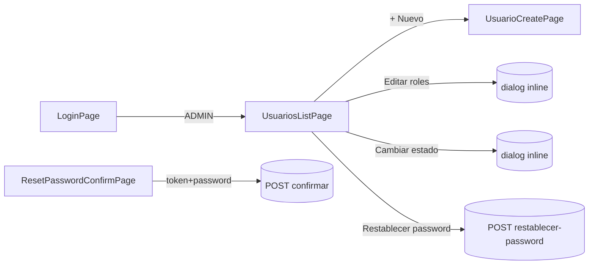

# Design Doc `DD-UC-006` — Frontend: consola de administración de Usuarios y Roles

> **Qué es**: sexto Design Doc de código, backend-only complementario en UI: cierra `FSD-UC-021` en la capa de presentación, consumiendo el CRUD backend ya implementado en `DD-UC-005`/`PR-IMPL-005` (sin delta de backend en este DD). Es a `DD-UC-005` lo que `DD-UC-004` fue a `DD-UC-002`/`DD-UC-003`: el *vertical slice* de UI de un feature backend ya cerrado.
>
> **Relación con otros documentos**: consume `UsuarioController`/`PasswordResetController` (`DD-UC-005`) y reutiliza el shell/`AuthService`/guards ya creados en `DD-UC-004`. No toca `plataforma` ni ningún módulo backend.

## 1. Objetivo y contexto

- **Qué resuelve este feature**: permite que el `ADMIN` de un tenant administre los usuarios de su institución desde el navegador — listar, crear con uno o más roles, editar roles, activar/desactivar, e iniciar un restablecimiento de contraseña; y que cualquier persona con un enlace de restablecimiento pueda completarlo desde una pantalla pública.
- **Caso(s) de uso del FSD que implementa**: `FSD-UC-021` (`docs/product/FSD.md` §4.6.11), cierre de la UI — el backend ya está completo desde `DD-UC-005`.
- **Alcance**:
  - **Dentro**:
    - `frontend/src/app/features/usuarios/`: lista (`GET /usuarios`), alta multi-rol (`POST /usuarios`), edición de roles (`PATCH /usuarios/{id}/roles`), cambio de estado (`PATCH /usuarios/{id}/estado`), botón "Restablecer contraseña" (`POST /usuarios/{id}/restablecer-password`).
    - `frontend/src/app/features/auth/reset-password-confirm/`: pantalla **pública** (sin sesión) para completar el restablecimiento, `POST /api/v1/auth/restablecer-password/confirmar`.
    - Ruta `/usuarios` protegida por `roleGuard` (`data: { role: 'ADMIN' }`), mismo patrón que `/plataforma/tenants` en `DD-UC-004`.
    - Ruta pública `/restablecer-password` (fuera del shell autenticado, sin guard).
    - Ajuste de `login.page.ts`: redirect post-login `ADMIN` → `/usuarios` (hoy cae en el placeholder `/home`).
  - **Fuera**:
    - Envío real de email — el backend (`DD-UC-005` §1) es *log-only*; el botón "Restablecer contraseña" muestra un mensaje transparente de esa limitación, **no** simula un envío que no ocurre.
    - Campo "curso/paralelo asignado" para el rol `ASESOR` en el formulario de alta/edición — el backend no valida esa referencia todavía (`DD-UC-005` §1, `E_ASESOR_SIN_CURSO` diferido); no se pide un dato que no tiene efecto real.
    - Cualquier pantalla de `SYSADMIN` (ya cubierta por `DD-UC-004`).
    - Delta de backend — ninguno; `DD-UC-005` ya expone todos los endpoints necesarios.

## 2. Diseño (el "cómo") `[humano+máquina]`

- **Enfoque elegido**: reutilizar exactamente el patrón ya validado en `features/plataforma/` (`DD-UC-004`): componentes Angular *standalone* con plantilla inline, `signal()` para estado local, `HttpClient` inyectado directamente en el componente (sin capa de servicio dedicada — consistente con la nota "UI funcional/admin, sin design system" de `PR-IMPL-004`), `ApiBase.BASE` para la URL raíz. Los roles de tenant (`ADMIN`/`SECRETARIA`/`ASESOR`/`PROFESOR`) se muestran como checkboxes fijos en el template — es un enum cerrado en el backend hoy, no amerita cargarlo desde una API. `SYSADMIN` **nunca** aparece como opción seleccionable (invariante `ADR-0010`; el backend ya lo rechaza, pero la UI tampoco debe ofrecerlo).
- **Componentes tocados**:

```
frontend/src/app/
├── app.routes.ts                              (+ /usuarios, + /restablecer-password público)
├── features/
│   ├── auth/
│   │   ├── login/login.page.ts                (redirect ADMIN → /usuarios)
│   │   └── reset-password-confirm/
│   │       └── reset-password-confirm.page.ts  (nuevo, público)
│   └── usuarios/
│       ├── usuario.model.ts                    (nuevo: UsuarioResponse)
│       ├── usuarios-list.page.ts               (nuevo: lista + dialogs roles/estado/reset)
│       └── usuario-create.page.ts              (nuevo: alta multi-rol)
```

- **Contratos consumidos** (ya existentes, sin cambios — `DD-UC-005`): `GET /usuarios`, `POST /usuarios`, `PATCH /usuarios/{id}/roles`, `PATCH /usuarios/{id}/estado`, `POST /usuarios/{id}/restablecer-password`, `POST /api/v1/auth/restablecer-password/confirmar`.
- **Diagrama**:



## 3. Alternativas consideradas

| Alternativa | Pros | Contras | ¿Elegida? |
|-------------|------|---------|-----------|
| A. Reutilizar el patrón sin design system de `features/plataforma/` (`DD-UC-004`) | Consistencia total con la UI ya construida; cero curva de aprendizaje nueva; apropiado para equipo de 1 | Estilos inline repetidos, sin componentes reutilizables | **sí** |
| B. Introducir Angular Material u otro design system | UI más pulida | Sobre-ingeniería para el alcance actual; ninguna pantalla previa lo usa | no |
| A. Checkboxes de rol fijos en el template (4 valores hardcodeados) | Simple; el enum `Rol` de tenant es cerrado hoy | Requiere tocar el template si se agrega un rol nuevo (bajo riesgo, poco frecuente) | **sí** |
| B. Catálogo de roles vía API | Desacoplado del enum backend | No existe tal endpoint; innecesario para 4 valores fijos | no |
| A. Mensaje transparente sobre el restablecimiento *log-only* ("notificación pendiente de implementación real") | Honesto con el usuario/QA; no oculta el gap ya documentado en `DD-UC-005` §1 | Peor experiencia de usuario percibida hasta que exista delivery real | **sí** |
| B. Simular un mensaje de "correo enviado" | Mejor percepción inmediata | Engañoso: no se envía nada; contradice AGENTS.md (no ocultar limitaciones reales) | no |

> Ninguna decisión amerita ADR — son de bajo riesgo y consistentes con decisiones ya tomadas en `DD-UC-004`/`DD-UC-005`.

## 4. Impacto en las specs vivas `[máquina]`

| Artefacto vivo | Cambio | ¿Delta vs DTI vFinal? |
|----------------|--------|-----------------------|
| `docs/product/DTP.md` | §A.1 nueva fila; §A.3 `FSD-UC-021` pasa de "completo (backend)" a "**completo**" (backend + UI) — aplicado en `DTP` v1.13 | no |
| `docs/PROMPT_MAPPING.md` | Nueva fila `PR-IMPL-006` en área `IMPL` | no |
| `docs/product/FSD.md` | Sin cambio de flujo/reglas — la UI consume contratos ya documentados en v2.5 | no |
| `docs/adr/` | Sin ADR nuevo | no |

## 5. Prompts usados `[máquina]`

| Prompt | Tarea | Artefacto generado |
|--------|-------|---------------------|
| `PR-IMPL-006` | Generación de la consola Angular de Usuarios y Roles + pantalla pública de confirmación de restablecimiento | `frontend/src/app/features/usuarios/**`, `frontend/src/app/features/auth/reset-password-confirm/**`, delta en `app.routes.ts`/`login.page.ts` |

> Sigue [`PROMPT_TEMPLATE.md`](../../plantillas/plantillas1/PROMPT_TEMPLATE.md), vive en `docs/prompts/impl/PR-IMPL-006.md` y se referencia desde `docs/PROMPT_MAPPING.md`.

## 6. Plan de pruebas y evals

- **Manual / E2E** (mismo alcance que `DD-UC-004`, sin specs de componente Angular nuevas — este proyecto no las usa para features de UI, solo para `core/auth`): login como Admin → `/usuarios` → crear usuario multi-rol → editar roles → cambiar estado → iniciar restablecimiento → completar desde `/restablecer-password` con el token (obtenido manualmente del log de `LogNotificacionAdapter` en este MVP) → login con la nueva contraseña.
- **Casos borde manuales**: token expirado/usado en `/restablecer-password` → mensaje "enlace inválido o expirado" (`410 E_ENLACE_INVALIDO`); intento de editar roles de un usuario ya desactivado; lista vacía (tenant sin usuarios además del Admin sembrado).
- **Arquitectura**: `ng build` sin errores (único gate automatizado de frontend en este proyecto, igual que `DD-UC-004`).

## 7. Definition of Done (checklist)

- [x] `fsd_uc` declarado y enlazado (`FSD-UC-021`, cierre de UI).
- [x] Diseño (§2) y alternativas (§3) documentados.
- [x] Sin ADR nuevo.
- [x] §4 Impacto en specs vivas registrado y aplicado (`DTP` v1.13 vía `dtp-sync`).
- [x] Prompt `PR-IMPL-006` versionado en `docs/prompts/impl/` y registrado en `docs/PROMPT_MAPPING.md` (v2.12, **Ejecutado**).
- [x] `ng build` en verde (lazy chunks `usuarios-list-page`, `usuario-create-page`, `reset-password-confirm-page`). `ng test` no ejecutable en este entorno (Vitest sin paquete de browser instalado) — mismo alcance que `DD-UC-004`, no es un gate automatizado de este proyecto.
- [x] `docs/product/DTP.md` actualizado vía `dtp-sync` — v1.12 → v1.13.
- [x] PR de código declara: prompt usado (`PR-IMPL-006`), archivos generados vs. editados a mano — ver §5 y changelog v1.1 de este documento.

## 8. Registro de cambios

| Versión | Fecha | Autor | Cambio |
|---------|-------|-------|--------|
| v1.0 | 04/08/2026 | Rodrigo Aspeti | Creación del sexto Design Doc de código (`DD-UC-006`): consola Angular de administración de Usuarios y Roles (lista, alta multi-rol, edición de roles, cambio de estado, restablecimiento de contraseña) y pantalla pública de confirmación, cerrando `FSD-UC-021` en la capa de presentación sin tocar backend (`DD-UC-005` ya expone todos los contratos). Decisiones explícitas: reutilizar el patrón sin design system de `features/plataforma/`; roles como checkboxes fijos (sin `SYSADMIN` seleccionable); mensaje transparente sobre la limitación *log-only* del restablecimiento, sin simular un envío de correo que no ocurre; sin campo de curso/paralelo para `ASESOR` (el backend no lo valida todavía). Estado `aprobado`; ejecución de `PR-IMPL-006` pendiente. |
| v1.1 | 04/08/2026 | Rodrigo Aspeti | **Ejecución real de `PR-IMPL-006`**: consola Angular completa y funcional. Delta menor no listado explícitamente en §2 original, agregado durante la ejecución por necesidad de alcanzabilidad (una pantalla sin entrada de navegación no está realmente entregada): `shared/layout/shell.component.ts` gana los enlaces "Tenants"/"Usuarios" condicionados a `auth.hasRole('SYSADMIN')`/`auth.hasRole('ADMIN')` (antes "Tenants" era incondicional); `login.page.ts` redirige `ADMIN` → `/usuarios`. Verificación: `ng build` en verde, 3 lazy chunks nuevos (`usuarios-list-page`, `usuario-create-page`, `reset-password-confirm-page`); `ng test` no ejecutable en este entorno (Vitest sin paquete de browser), documentado como limitación de entorno, no como test omitido. Sin delta de backend (confirmado por `git status`). DoD (§7) sincronizado. `docs/PROMPT_MAPPING.md` v2.11 → v2.12. `docs/product/DTP.md` v1.12 → v1.13. |
