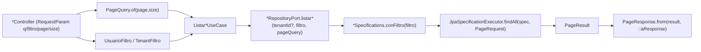

# Design Doc `DD-UC-007` — Filtros y paginación reutilizables en los listados GetAll

> **Qué es**: séptimo Design Doc de código, transversal (no es un feature de negocio nuevo): añade filtros y paginación a los dos listados `GetAll` ya implementados (`GET /api/v1/usuarios` de `DD-UC-005`/`DD-UC-006` y `GET /api/v1/plataforma/tenants` de `DD-UC-003`/`DD-UC-004`), e introduce en `shared` un patrón reutilizable (`PageQuery`/`PageResult`/`PageResponse`) que cualquier listado futuro (profesores, estudiantes, cursos, etc.) puede adoptar sin reinventar el contrato HTTP.
>
> **Relación con otros documentos**: modifica `UsuarioController`/`TenantController` (contratos de `DD-UC-005`/`DD-UC-004`) y sus adaptadores JPA; consume `shared` (módulo `OPEN`, `ADR-0011`) para las primitivas de paginación. No introduce ningún módulo ni Aggregate Root nuevo.

## 1. Objetivo y contexto

- **Qué resuelve este feature**: los dos únicos listados `GetAll` del backend (`usuarios`, `tenants`) devolvían la colección completa sin límite, sin forma de buscar por texto ni de filtrar por atributos. Esto no escala (un tenant con cientos de usuarios) y no permite a la UI ofrecer búsqueda. Este DD añade paginación (`page`/`size`) y filtros específicos a ambos endpoints, con un contrato HTTP común (`PageResponse<T>`) para que los próximos listados (`profesores`, `estudiantes`, `cursos`, etc., cuando existan) reutilicen el mismo patrón sin diseñarlo de nuevo.
- **Caso(s) de uso del FSD que implementa**: `FSD-UC-011` (`docs/product/FSD.md`, Gestión de Tenants) y `FSD-UC-021` (Usuarios y Roles) — ambos ya **completos**; este DD es una mejora no funcional sobre sus listados `GetAll`, no agrega un flujo nuevo al Gherkin de ninguno de los dos.
- **Alcance**:
  - **Dentro**:
    - `shared.PageQuery`/`shared.PageResult<T>` (framework-free, capa de aplicación/puertos) y `shared.web.PageResponse<T>` (envelope REST), patrón reutilizable para cualquier `GetAll` futuro.
    - `GET /api/v1/usuarios`: query params opcionales `q` (busca en `nombreCompleto` **o** `email`, case-insensitive, `contains`), `activo` (boolean exacto), `rol` (exacto), `page`/`size`.
    - `GET /api/v1/plataforma/tenants`: query params opcionales `q` (busca en `nombre`, case-insensitive, `contains`), `estado` (exacto), `page`/`size`.
    - UI Angular de ambos listados (`usuarios-list.page.ts`, `tenants-list.page.ts`): caja de búsqueda + selects de filtro + controles de paginación (anterior/siguiente + contador).
  - **Fuera**:
    - Ordenamiento (`sort`) — no fue pedido; se puede añadir después sin romper el contrato (`PageQuery` es extensible).
    - Cualquier listado nuevo de `academico` (profesores, estudiantes, cursos) — el patrón queda documentado y listo para reutilizarse, pero no hay entidades esas todavía (bloqueado por `ADR-0009` §3).
    - Búsqueda full-text/fuzzy — el filtro `q` es `LIKE '%term%'` simple, suficiente para el volumen actual.

## 2. Diseño (el "cómo") `[humano+máquina]`

- **Enfoque elegido**: dos tipos framework-free en `shared` (módulo `OPEN`, visible a todos) separan la paginación en dos capas, mismo precedente que `RespuestaLlm` (dominio) vs. `ChatResponse` (REST) en `shared.ai`:
  - `shared.PageQuery(page, size)`: normaliza/clampa los query params crudos (`page` default 0, `size` default 20, máximo 100) — la usan los puertos de entrada/casos de uso, sin depender de Spring Data.
  - `shared.PageResult<T>(content, page, size, totalElements, totalPages)`: lo que devuelven los puertos de salida (`UsuarioRepositoryPort`/`TenantRepositoryPort`) y los casos de uso — framework-free, calcula `totalPages` con `Math.ceil`.
  - `shared.web.PageResponse<T>`: el DTO REST que ven los controladores (mismo shape, tipo distinto — convención de DTOs de API en `infrastructure/web/dto/` de `AGENTS.md` §5), con `PageResponse.from(PageResult<D>, Function<D,T>)` para mapear dominio → `*Response` sin boilerplate repetido en cada controller.
  - Los filtros (`UsuarioFiltro`, `TenantFiltro`) son records por módulo (no van en `shared`: son específicos del dominio de cada uno) con todos los campos nulos por defecto = sin filtro.
  - La traducción a SQL usa `Specification<T>`/`JpaSpecificationExecutor` de Spring Data JPA (primer uso en el proyecto) en vez de derived query methods, porque la combinación de filtros opcionales (0 a N predicados) no es expresable con un único método derivado. El filtro `rol` de usuarios hace `join` a la colección `roles` con `query.distinct(true)` para evitar duplicados por el `@OneToMany` `EAGER`.
  - **Compatibilidad**: sin query params, el comportamiento es equivalente al listado completo previo (`page=0, size=20` en vez de "todos" — un tenant/usuario con ≤20 filas no nota diferencia; con más de 20, ahora pagina en vez de devolver todo, cambio de contrato deliberado documentado en §4).
  - **Firma del controlador** (refinamiento v1.1, mismo turno de creación): en vez de 5 `@RequestParam` individuales por método `listar`, ambos controladores bindean `@ParameterObject UsuarioFiltro/TenantFiltro filtro` + `@ParameterObject shared.web.PaginacionParams paginacion` (springdoc-openapi, soportado nativamente por Spring MVC 7.x — constructor binding sobre records vía `@ModelAttribute` implícito). `PaginacionParams(Integer page, Integer size)` vive en `shared.web` junto a `PageResponse` (mismo criterio: tipo "de borde" reutilizable por cualquier futuro listado `GetAll`) y es deliberadamente distinto de `PageQuery` (que exige valores ya normalizados); la conversión sigue siendo explícita en el controlador (`PageQuery.of(paginacion.page(), paginacion.size())`). Los `@Schema(description=...)` de documentación se movieron a los propios componentes de `UsuarioFiltro`/`TenantFiltro` (metadata pura, sin comportamiento en runtime — mismo criterio que Lombok en `ADR-0012` — no acopla esos puertos de entrada a Spring MVC). El contrato HTTP (nombres y semántica de los query params) no cambia.
- **Componentes tocados**:

```
backend/src/main/java/com/edusync/
├── shared/
│   ├── PageQuery.java                              (nuevo)
│   ├── PageResult.java                             (nuevo)
│   └── web/
│       ├── PageResponse.java                       (nuevo)
│       └── PaginacionParams.java                   (nuevo, v1.1: binding @ParameterObject)
├── identidad/
│   ├── application/port/in/
│   │   ├── UsuarioFiltro.java                      (nuevo)
│   │   └── ListarUsuariosUseCase.java              (firma: + UsuarioFiltro, PageQuery; retorna PageResult<Usuario>)
│   ├── application/service/ListarUsuariosService.java (delta)
│   ├── application/port/out/UsuarioRepositoryPort.java (+ overload paginado; el no paginado se conserva para shared.ai)
│   └── infrastructure/adapter/out/persistence/
│       ├── UsuarioSpecifications.java              (nuevo, package-private)
│       ├── UsuarioJpaRepository.java               (+ JpaSpecificationExecutor)
│       └── UsuarioRepositoryAdapter.java           (+ overload paginado)
├── plataforma/
│   ├── application/port/in/
│   │   ├── TenantFiltro.java                       (nuevo)
│   │   └── ListarTenantsUseCase.java               (firma: + TenantFiltro, PageQuery; retorna PageResult<Tenant>)
│   ├── application/service/ListarTenantsService.java (delta)
│   ├── application/port/out/TenantRepositoryPort.java (firma de listarTodos cambia: + filtro/paginación)
│   └── infrastructure/adapter/out/persistence/
│       ├── TenantSpecifications.java               (nuevo, package-private)
│       ├── TenantJpaRepository.java                (+ JpaSpecificationExecutor)
│       └── TenantRepositoryAdapter.java            (delta)
└── {identidad,plataforma}/infrastructure/adapter/in/rest/{Usuario,Tenant}Controller.java (delta: query params + PageResponse)

frontend/src/app/
├── core/api/page-response.model.ts                 (nuevo, genérico)
├── features/usuarios/{usuario.model.ts,usuarios-list.page.ts} (delta: filtros + paginación)
└── features/plataforma/{tenant.model.ts,tenants-list.page.ts} (delta: filtros + paginación)
```

- **Contrato HTTP común** (patrón reutilizable):

```
GET /api/v1/<recurso>?q=<texto>&<filtroA>=<valor>&page=<n>&size=<n>

200 OK
{
  "content": [ /* *Response[] */ ],
  "page": 0,
  "size": 20,
  "totalElements": 42,
  "totalPages": 3
}
```

- **Diagrama**:



## 3. Alternativas consideradas

| Alternativa | Pros | Contras | ¿Elegida? |
|-------------|------|---------|-----------|
| A. `Specification`/`JpaSpecificationExecutor` para combinar filtros opcionales | Composición limpia de 0..N predicados; estándar de Spring Data JPA | Primer uso en el proyecto (curva de aprendizaje nula para 1 dev, pero nuevo patrón) | **sí** |
| B. Query methods derivados por combinación de filtros (`findByTenantIdAndActivoAndRolAndNombreContaining...`) | Sin dependencia de Criteria API | Explosión combinatoria de métodos (2^n variantes según filtros presentes/ausentes) | no |
| A. `PageResult<T>` (aplicación) distinto de `PageResponse<T>` (REST), ambos en `shared` | Respeta la regla de `AGENTS.md` §5 (DTOs de API en `infrastructure/web/dto/`, dominio no depende de tipos HTTP); mismo precedente que `RespuestaLlm`/`ChatResponse` | Dos tipos con el mismo shape (mínima duplicación) | **sí** |
| B. Un único tipo `PageResponse<T>` reutilizado también como retorno de los casos de uso | Menos código | Acopla la capa de aplicación a un tipo nombrado "REST"; viola la separación ya establecida en el proyecto | no |
| A. Sin parámetros = `page=0,size=20` (paginado por defecto, cambio de contrato) | Simple, un único código de listado; protege contra tenants grandes por defecto | Un cliente que asumía "siempre completo" y tiene >20 filas ahora ve solo la primera página | **sí** |
| B. Sin parámetros = comportamiento idéntico al anterior (todos los resultados, sin paginar) | Cero cambio de contrato para consumidores existentes | Contradice el objetivo mismo del feature (proteger contra colecciones grandes); el único consumidor hoy es la UI propia, ya actualizada en este mismo DD | no |

> Ninguna decisión amerita ADR nuevo: es una mejora de rendimiento/UX sobre contratos ya existentes, sin cambiar reglas de negocio, invariantes de dominio ni el modelo de datos (`AGENTS.md` §6).

## 4. Impacto en las specs vivas `[máquina]`

| Artefacto vivo | Cambio | ¿Delta vs DTI vFinal? |
|----------------|--------|-----------------------|
| `docs/product/DTP.md` | §A.1 nueva fila; §A.3 `FSD-UC-011`/`FSD-UC-021` anotan filtros/paginación en Notas — aplicado en `DTP` v1.14 | no |
| `docs/PROMPT_MAPPING.md` | Nueva fila `PR-IMPL-007` en área `IMPL` | no |
| `docs/product/FSD.md` | Sin cambio de reglas de negocio — es una mejora técnica de los endpoints `GetAll` ya documentados, no un flujo Gherkin nuevo | no |
| `docs/adr/` | Sin ADR nuevo | no |
| Contrato HTTP de `GET /usuarios` y `GET /plataforma/tenants` | **Rompe** el shape de la respuesta: de `T[]` a `{content, page, size, totalElements, totalPages}` | no (mejora de contrato ya documentada aquí, sin afectar reglas de negocio) |

## 5. Prompts usados `[máquina]`

| Prompt | Tarea | Artefacto generado |
|--------|-------|---------------------|
| `PR-IMPL-007` | Filtros y paginación reutilizables en `GET /usuarios` y `GET /plataforma/tenants` (backend + UI) | `shared.{PageQuery,PageResult,web.PageResponse}`, `identidad`/`plataforma` (filtros, specifications, controllers), `frontend/src/app/{core/api,features/usuarios,features/plataforma}` |

> Sigue [`PROMPT_TEMPLATE.md`](../../plantillas/plantillas1/PROMPT_TEMPLATE.md), vive en `docs/prompts/impl/PR-IMPL-007.md` y se referencia desde `docs/PROMPT_MAPPING.md`.

## 6. Plan de pruebas y evals

- **Backend (JUnit 5 + Testcontainers, mismo patrón que `UsuarioIntegrationTest`/`TenantIntegrationTest`)**: filtro `q` por email en usuarios (sin coincidir por nombre), filtro por `rol`, filtro por `estado` en tenants, paginación con `size=1` y verificación de `totalElements`/`totalPages`. Unit tests de `ListarUsuariosService`/`ListarTenantsService` (mocks) y de `PageQuery`/`PageResult`/`PageResponse` (clamping, cálculo de `totalPages`, mapeo).
- **Arquitectura**: `mvn test` en verde (incluye `ModularityTests`: `shared.PageQuery`/`PageResult`/`web.PageResponse` no introducen ciclos, ambos módulos siguen dependiendo solo de `shared`).
- **Frontend**: `ng build` sin errores; verificación manual de que los filtros/paginación no rompen los flujos ya cubiertos por `DD-UC-004`/`DD-UC-006` (crear, editar roles, cambiar estado).

## 7. Definition of Done (checklist)

- [x] `fsd_uc` declarado y enlazado (`FSD-UC-011`, `FSD-UC-021`, mejora no funcional sobre ambos).
- [x] Diseño (§2) y alternativas (§3) documentados.
- [x] Sin ADR nuevo.
- [x] §4 Impacto en specs vivas registrado.
- [x] Prompt `PR-IMPL-007` versionado en `docs/prompts/impl/` y registrado en `docs/PROMPT_MAPPING.md`.
- [x] `mvn test` en verde (98/98, incluye `ModularityTests` 7/7 y los tests nuevos de filtros/paginación).
- [x] `ng build` en verde.
- [x] `docs/product/DTP.md` actualizado vía `dtp-sync` — v1.13 → v1.14.

## 8. Registro de cambios

| Versión | Fecha | Autor | Cambio |
|---------|-------|-------|--------|
| v1.0 | 20/08/2026 | Rodrigo Aspeti | Creación y **ejecución en el mismo turno** del séptimo Design Doc de código (`DD-UC-007`): filtros y paginación reutilizables en los dos listados `GetAll` existentes (`GET /usuarios`, `GET /plataforma/tenants`), con patrón compartido `shared.{PageQuery,PageResult,web.PageResponse}` para listados futuros. Backend: `Specification`/`JpaSpecificationExecutor` (primer uso en el proyecto) para combinar filtros opcionales; `q` busca por `nombreCompleto`/`email` (usuarios) o `nombre` (tenants), case-insensitive; filtros exactos `activo`/`rol` (usuarios) y `estado` (tenants); `page`/`size` con defaults 0/20 y tope 100. Frontend: caja de búsqueda + selects + controles de paginación en ambas listas, sin librería de UI nueva (mismo patrón sin design system de `DD-UC-004`/`DD-UC-006`). Cambio de contrato deliberado: sin query params, la respuesta pasa de `T[]` a `{content,page,size,totalElements,totalPages}` (página 0, tamaño 20) — único consumidor hoy es la UI propia, actualizada en el mismo turno. Verificación: `mvn test` 98/98 verde (incluye `ModularityTests` 7/7); `ng build` verde. Sin ADR nuevo. |
| v1.1 | 20/08/2026 | Rodrigo Aspeti | **Refinamiento de la firma de los controladores** (mismo turno, a pedido explícito): `UsuarioController.listar`/`TenantController.listar` pasan de 5 `@RequestParam` individuales a 2 parámetros `@ParameterObject` (springdoc-openapi) — `UsuarioFiltro`/`TenantFiltro filtro` + nuevo `shared.web.PaginacionParams paginacion`. Sin cambio de contrato HTTP (mismos nombres/semántica de query params, verificado por los mismos tests de integración ya existentes, que ejercitan la URL real). Los `@Schema(description=...)` de documentación Swagger se trasladaron de los parámetros del método a los propios componentes de `UsuarioFiltro`/`TenantFiltro` (metadata pura sin comportamiento en runtime, mismo criterio que Lombok en `ADR-0012`). Verificación: `mvn test` 98/98 verde (mismo conteo, sin tests nuevos ni rotos). Sin ADR nuevo — refinamiento interno, no decisión arquitectónica. |
