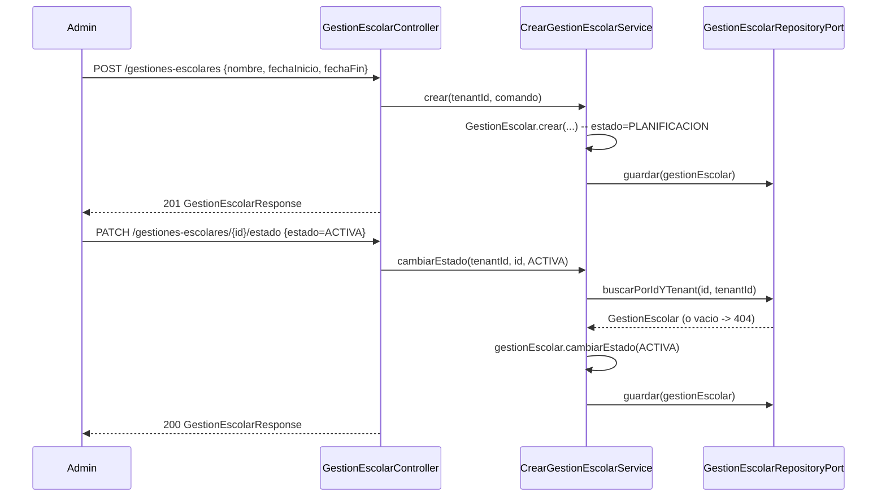

# Design Doc `DD-UC-008` — Académico: Gestión Escolar

> **Qué es**: octavo Design Doc de código y **primer feature de negocio real del módulo `academico`** (hasta ahora vacío, solo `package-info.java` desde `PR-IMPL-001`). Implementa `FSD-UC-012` (Gestión Escolar): el contenedor raíz por tenant del que dependen `PeriodoEvaluacion`, `Curso` e `Inscripcion` (`FSD-UC-013`..`FSD-UC-020`, todavía sin Design Doc propio).
>
> **Relación con otros documentos**: consume `TenantContextProvider`/RLS (`DD-UC-002`, `ADR-0001`) y el patrón de filtros/paginación (`shared.PageQuery`/`PageResult`/`web.PageResponse`, `DD-UC-007`); no depende de `identidad` más allá del contexto de tenant/rol ya existente. Es el primer Design Doc que ejerce el límite de módulo `academico` definido en `ADR-0011`. Alimenta el DTP (§A.1, §A.3) vía `@dtp-sync`.

## 1. Objetivo y contexto

- **Qué resuelve este feature**: permite que el `ADMIN` de un tenant cree una `GestionEscolar` (el "año lectivo" o ciclo escolar de su institución) con `nombre`, `fechaInicio`, `fechaFin`; la liste (con filtros y paginación); y la transicione entre `PLANIFICACION` → `ACTIVA` → `CERRADA` a lo largo del ciclo.
- **Caso(s) de uso del FSD que implementa**: `FSD-UC-012` (`docs/product/FSD.md` §4.6.2).
- **Alcance**:
  - **Dentro**:
    - Aggregate Root `GestionEscolar` (dominio puro, sin Spring/JPA) + enum `EstadoGestionEscolar` (`PLANIFICACION`/`ACTIVA`/`CERRADA`).
    - `POST /api/v1/gestiones-escolares` (alta), `GET /api/v1/gestiones-escolares` (listado scoped al tenant del Admin, con filtros `q`/`estado` y paginación — reutiliza `shared.PageQuery`/`PageResult`/`PageResponse` de `DD-UC-007`), `PATCH /api/v1/gestiones-escolares/{id}/estado` (transición de estado).
    - Flyway `V5__academico_gestion_escolar.sql`: tabla `gestion_escolar` con `tenant_id` y política RLS (`ADR-0001`), mismo patrón que `usuario`/`tenant`.
    - `@PreAuthorize("hasRole('ADMIN')")` en los tres endpoints; `tenantId` siempre desde `TenantContextProvider`, nunca del body/query (mismo invariante que `DD-UC-002`/`DD-UC-005`/`DD-UC-007`).
  - **Fuera** (Design Docs de seguimiento, todavía sin crear):
    - `FSD-UC-013` (Periodos de Evaluación) y `FSD-UC-014` (Secciones de Evaluación) — la precondición del FSD "una vez configurados sus periodos y secciones" (§4.6.2, paso 3) **no se valida como bloqueante** en este DD (ver §2/§3); se puede transicionar a `ACTIVA` sin periodos/secciones todavía. Se retoma cuando exista `FSD-UC-013`/`014`.
    - `FSD-UC-015`..`FSD-UC-020` (Evaluaciones, Cálculo de Notas, Cursos/Paralelos, Materias, Profesores, Estudiantes/Inscripciones) — todos referencian `GestionEscolar` como padre, pero se implementan en Design Docs posteriores.
    - UI Angular — Design Doc de seguimiento (mismo patrón backend-primero que separó `DD-UC-005` de `DD-UC-006`).
    - `audit_log` append-only para `GestionEscolar` — la gobernanza de auditoría/inmutabilidad de los módulos nuevos de `ADR-0009` sigue **pendiente de definición** (§3 punto 5 de ese ADR); este DD no la implementa, solo fija la postura mínima de aislamiento (§2).
    - Reconciliación con `GestionAcademica`/`ParametroAcademico` del Perfil Bolivia SIE (`ADR-0009` §3 punto 1) — no se toca; `academico` y `notassie` siguen siendo rutas de código separadas.

## 2. Diseño (el "cómo") `[humano+máquina]`

- **Enfoque elegido**: `GestionEscolar` es un Aggregate Root inmutable (constructor privado + factory `GestionEscolar.crear(...)`, mismo patrón que `Usuario`/`Tenant`), con Lombok bajo el *allowlist* de dominio (`ADR-0012`: `@Getter`/`@EqualsAndHashCode`/`@ToString`, nomenclatura JavaBean). La transición de estado se modela como un método de dominio `cambiarEstado(EstadoGestionEscolar nuevo)` que valida las transiciones permitidas y devuelve una nueva instancia (nunca un setter directo):
  - `PLANIFICACION` → `ACTIVA`
  - `ACTIVA` → `CERRADA`
  - `ACTIVA` → `PLANIFICACION` (reabrir planificación; se permite en este slice porque todavía no hay periodos/secciones que proteger — se reevaluará cuando existan)
  - `CERRADA` → *ninguna* (estado terminal en este slice; no hay reapertura de una gestión cerrada)
  - Cualquier otra transición → `EstadoGestionEscolarInvalidoException` (`422 E_ESTADO_INVALIDO`).
- **Precondición de periodos/secciones diferida (decisión explícita, mismo criterio que `E_ASESOR_SIN_CURSO` en `DD-UC-005`)**: el FSD (§4.6.2, paso 3) describe que el Admin activa la gestión "una vez configurados sus periodos y secciones", pero no la declara como una validación bloqueante del sistema (no hay un flujo alternativo/excepción `A2` en el FSD para esto, a diferencia de `A1 — Fechas inválidas`). Este DD no inventa esa validación: se puede transicionar a `ACTIVA` con 0 periodos configurados. Cuando exista `FSD-UC-013`, se revisará si el FSD se actualiza para exigirla explícitamente.
- **Aislamiento de tenant** (mismo patrón mitigador que `Usuario`/`Tenant`, `DD-UC-002`/`DD-UC-003`): RLS `FORCE` sobre `gestion_escolar` con `tenant_id` obligatorio (a diferencia de `usuario`, aquí no hay caso `SYSADMIN` con `tenant_id` nulo — toda `GestionEscolar` pertenece a un tenant). Además, filtro explícito por `tenantId` en la capa de aplicación (`GestionEscolarRepositoryPort`), sin depender solo de la política RLS. Acceso a una `GestionEscolar` de otro tenant → `404` (no `403`, mismo criterio que `DD-UC-005`).
- **Filtros y paginación**: reutiliza el patrón de `DD-UC-007` sin modificarlo — `GestionEscolarFiltro(q, estado)` (record de aplicación, análogo a `UsuarioFiltro`/`TenantFiltro`) + `GestionEscolarSpecifications` (Criteria API) + `JpaSpecificationExecutor`; `q` busca por `nombre` (case-insensitive, `contains`); `estado` es exact match. Sin ordenamiento (`sort`), igual que `DD-UC-007`.
- **Componentes tocados** (primer código real de `academico`):

```
backend/src/main/java/com/edusync/academico/
├── domain/
│   ├── GestionEscolar.java                          (Aggregate Root)
│   ├── EstadoGestionEscolar.java                    (enum)
│   ├── FechasInvalidasException.java                (422 E_FECHAS_INVALIDAS)
│   └── EstadoGestionEscolarInvalidoException.java   (422 E_ESTADO_INVALIDO)
├── application/
│   ├── port/in/
│   │   ├── CrearGestionEscolarUseCase.java
│   │   ├── ListarGestionesEscolaresUseCase.java
│   │   ├── CambiarEstadoGestionEscolarUseCase.java
│   │   └── GestionEscolarFiltro.java
│   ├── port/out/GestionEscolarRepositoryPort.java
│   └── service/
│       ├── CrearGestionEscolarService.java
│       ├── ListarGestionesEscolaresService.java
│       └── CambiarEstadoGestionEscolarService.java
└── infrastructure/
    ├── adapter/in/rest/
    │   ├── GestionEscolarController.java
    │   └── dto/{CrearGestionEscolarRequest,CambiarEstadoGestionEscolarRequest,GestionEscolarResponse}.java
    └── adapter/out/persistence/
        ├── GestionEscolarJpaEntity.java
        ├── GestionEscolarJpaRepository.java          (+ JpaSpecificationExecutor)
        ├── GestionEscolarSpecifications.java          (package-private)
        └── GestionEscolarRepositoryAdapter.java

backend/src/main/resources/db/migration/
└── V5__academico_gestion_escolar.sql
```

- **Contratos** (todos bajo `/api/v1`, `@PreAuthorize("hasRole('ADMIN')")`):
  - `POST /gestiones-escolares {nombre, fechaInicio, fechaFin}` → `201 GestionEscolarResponse` \| `422 E_FECHAS_INVALIDAS` (`fechaFin <= fechaInicio`).
  - `GET /gestiones-escolares?q=&estado=&page=&size=` → `200 PageResponse<GestionEscolarResponse>` (scoped al `tenantId` del Admin autenticado).
  - `PATCH /gestiones-escolares/{id}/estado {estado}` → `200 GestionEscolarResponse` \| `404` (no existe o es de otro tenant) \| `422 E_ESTADO_INVALIDO` (transición no permitida).
- **Diagrama**:



## 3. Alternativas consideradas

| Alternativa | Pros | Contras | ¿Elegida? |
|-------------|------|---------|-----------|
| A. Backend completo (crear + listar + `PATCH estado`), sin bloquear `ACTIVA` por falta de periodos/secciones | Cierra un ciclo de vida útil end-to-end del recurso raíz de `academico`; no inventa una validación que el FSD no exige explícitamente | La transición a `ACTIVA` puede ocurrir "vacía" (sin periodos) — aceptable porque el FSD no lo prohíbe y se puede endurecer después sin romper contrato | **sí** |
| B. Solo alta + listado, en `PLANIFICACION`; `PATCH estado` en un DD posterior | Alcance más chico | Deja el recurso sin ciclo de vida operable; el Admin no podría avanzar el año lectivo | no |
| C. Bloquear `ACTIVA` hasta que existan periodos y secciones (requeriría implementar `FSD-UC-013`/`014` en el mismo DD) | Fidelidad literal al paso 3 del FSD | Amplía el alcance a 3 `FSD-UC` en un solo Design Doc; el FSD no lo declara como excepción bloqueante (`A2`), solo como secuencia deseable | no |
| D. Incluir la UI Angular en este mismo DD | Un solo entregable | Rompe el patrón backend-primero usado en `DD-UC-005`→`DD-UC-006`; el usuario confirmó backend-only | no |
| E. Exigir `audit_log` append-only desde el primer registro de `GestionEscolar` | Gobernanza más fuerte desde el día 1 | La gobernanza de los módulos nuevos sigue pendiente de definición (`ADR-0009` §3 punto 5); implementarla aquí sin resolver ese punto sería inventar una decisión no confirmada | no |

> Ninguna decisión de esta sección amerita un ADR propio: la alternativa A es revisable a C sin cambiar el modelo de `GestionEscolar` (solo añade una validación adicional en el servicio de cambio de estado cuando exista `FSD-UC-013`/`014`); la postura de gobernanza (E, descartada) queda documentada como pendiente explícito, no como divergencia silenciosa, siguiendo la regla de oro de `plantillas/plantillas3/MODELO_DOCUMENTAL_IMPLEMENTACION.md`.

## 4. Impacto en las specs vivas `[máquina]`

| Artefacto vivo | Cambio | ¿Delta vs DTI vFinal? |
|----------------|--------|-----------------------|
| `docs/product/FSD.md` (`FSD-UC-012`) | Ninguno: el flujo principal §4.6.2 ya describe la secuencia deseable sin declararla como validación bloqueante; este DD no la contradice, solo no la implementa todavía | no |
| `docs/product/DTP.md` | §A.1 nueva fila (creación y ejecución de `DD-UC-008`/`PR-IMPL-008`); §A.3 `FSD-UC-012` pasa de `pendiente` a **completo (backend)**, UI pendiente; se desagrega de la fila consolidada `FSD-UC-012`..`FSD-UC-020` | no |
| `docs/PROMPT_MAPPING.md` | Nueva fila `PR-IMPL-008` (área `IMPL`), nodo `IMPL008` en el flowchart, fila en la tabla de trazabilidad | no |
| Baseline `docs/baseline/**` | **No se toca** (regla de oro del proyecto) | — |

> **Recordatorio (regla de oro)**: el baseline congelado de M4 (`docs/baseline/`) no se toca. Los cambios viven en `docs/product/`.

## 5. Prompts usados `[máquina]`

| Prompt | Tarea | Artefacto generado |
|--------|-------|--------------------|
| `PR-IMPL-008` | Código + tests + migración `V5` del módulo `academico` (`GestionEscolar`) | `backend/src/main/java/com/edusync/academico/**`, `backend/src/main/resources/db/migration/V5__academico_gestion_escolar.sql` |

> El prompt sigue `plantillas/PROMPT_TEMPLATE.md`, vive en `docs/prompts/impl/PR-IMPL-008.md` y se referencia desde `docs/PROMPT_MAPPING.md`.

## 6. Plan de pruebas y evals

- **Unit**: `GestionEscolar.crear()` — fechas válidas/`E_FECHAS_INVALIDAS`; `cambiarEstado()` — las 3 transiciones válidas y las inválidas (`E_ESTADO_INVALIDO`), incluida la ausencia de reapertura desde `CERRADA`.
- **Integration** (Testcontainers PostgreSQL 15, mismo patrón que `UsuarioIntegrationTest`/`TenantIntegrationTest`): `POST` caso feliz; `A1` fechas inválidas; `GET` con filtros `q`/`estado` y paginación; `PATCH estado` caso feliz y transición inválida; aislamiento cross-tenant (Admin de tenant A intenta `PATCH` sobre `GestionEscolar` de tenant B → `404`); `ModularityTests` sin ciclos nuevos (primer código real de `academico`, debe seguir sin depender de `identidad`/`plataforma` más allá de `shared`).
- **E2E / Gherkin** (deriva de `PRD-US-020`): Admin autenticado crea la Gestión Escolar "2027" con fechas de inicio/fin del año lectivo → el sistema la guarda en estado "Planificación".
- **Evals de IA**: no aplica (este feature no usa un agente/LLM en runtime).
- **Resultado real (20/08/2026)**: `mvn test` → **119/119** verde, incluye `GestionEscolarTest` (8), `CrearGestionEscolarServiceTest`/`CambiarEstadoGestionEscolarServiceTest`/`ListarGestionesEscolaresServiceTest` (7), `GestionEscolarIntegrationTest` (6, incluye cross-tenant 404) y `ModularityTests` (7/7, sin ciclos nuevos).

## 7. Definition of Done (checklist)

- [x] `fsd_uc` declarado y enlazado (`FSD-UC-012`).
- [x] Diseño (§2) y alternativas (§3) documentados.
- [x] Sin ADR nuevo (decisiones de bajo riesgo, revisables sin costo alto — ver nota al final de §3).
- [x] §4 Impacto en specs vivas registrado (sin tocar el baseline).
- [x] Prompt `PR-IMPL-008` versionado en `docs/prompts/impl/` y en `PROMPT_MAPPING.md` — **ejecutado** (20/08/2026).
- [x] Tests/evals definidos (§6) y **ejecutados**: `mvn test` → 119/119 verde (incluye `ModularityTests` 7/7).
- [x] DTP actualizado (changelog + estado del FSD-UC) vía `dtp-sync` — `FSD-UC-012` pasa a **completo (backend)**, UI pendiente.
- [ ] PR declara prompts usados y archivos generados vs editados a mano — **commit formal pendiente** (código ya generado y verificado en el árbol de trabajo).

## 8. Versionado

| Versión | Fecha | Autor | Cambio |
|---------|-------|-------|--------|
| v1.0 | 20/08/2026 | Rodrigo Aspeti | Creación del octavo Design Doc de código (`DD-UC-008`): primer feature de negocio real del módulo `academico` — `GestionEscolar` (alta, listado con filtros/paginación reutilizando `DD-UC-007`, ciclo de estado `PLANIFICACION`/`ACTIVA`/`CERRADA`). Decisiones explícitas del usuario (confirmadas vía preguntas estructuradas, 20/08/2026): (1) backend completo con `PATCH estado`, sin exigir periodos/secciones para activar; (2) backend-only, UI Angular en un DD de seguimiento; (3) sin `audit_log` todavía, misma postura de aislamiento que `Tenant`/`Usuario` (RLS + filtro explícito + RBAC), gobernanza formal diferida (`ADR-0009` §3 punto 5). Estado `aprobado`; ejecución de `PR-IMPL-008` pendiente. |
| v1.1 | 20/08/2026 | Rodrigo Aspeti | **Ejecución real de `PR-IMPL-008`**, en el mismo día que su diseño: código generado en `academico.{domain,application,infrastructure}` (`GestionEscolar` con factory `crear()` y `cambiarEstado()`, 3 puertos `in`, `GestionEscolarRepositoryPort`, 3 servicios, JPA/`Specifications`/`Controller`/DTOs), migración `V5__academico_gestion_escolar.sql`. 21 tests nuevos (8 dominio, 7 servicios con Mockito, 6 integración con Testcontainers, incluida la verificación de aislamiento cross-tenant `404`). Verificación: `mvn test` → **119/119** verde (incluye `ModularityTests` 7/7). `FSD-UC-012` pasa a **completo (backend)**; UI Angular queda pendiente para un Design Doc de seguimiento. DoD 100% salvo el commit formal en Git. Estado `ejecutado`. |
