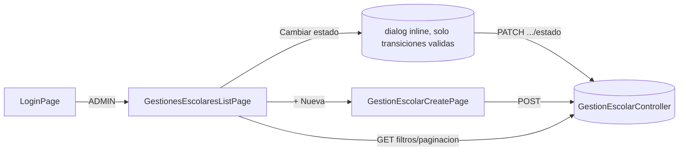

# Design Doc `DD-UC-009` — Frontend: consola de Gestión Escolar

> **Qué es**: noveno Design Doc de código, backend-only complementario en UI: cierra `FSD-UC-012` en la capa de presentación, consumiendo el backend ya implementado en `DD-UC-008`/`PR-IMPL-008` (sin delta de backend en este DD). Es a `DD-UC-008` lo que `DD-UC-006` fue a `DD-UC-005`: el *vertical slice* de UI de un feature backend ya cerrado. Es además el **primer *vertical slice* de UI del módulo `academico`** (hasta ahora el módulo solo tenía backend).
>
> **Relación con otros documentos**: consume `GestionEscolarController` (`DD-UC-008`) y reutiliza el shell/`AuthService`/`roleGuard` ya creados en `DD-UC-004`, más el patrón de filtros/paginación de `DD-UC-007` (`PageResponse<T>`, ya consumido en `features/plataforma/` y `features/usuarios/`). No toca `identidad` ni `plataforma`.

## 1. Objetivo y contexto

- **Qué resuelve este feature**: permite que el `ADMIN` de un tenant administre sus Gestiones Escolares desde el navegador — listar (con filtros y paginación), crear una nueva, y avanzar su ciclo de vida (`PLANIFICACION` → `ACTIVA` → `CERRADA`, con reapertura `ACTIVA` → `PLANIFICACION`).
- **Caso(s) de uso del FSD que implementa**: `FSD-UC-012` (`docs/product/FSD.md` §4.6.2), cierre de la UI — el backend ya está completo desde `DD-UC-008`.
- **Alcance**:
  - **Dentro**:
    - `frontend/src/app/features/academico/`: lista (`GET /gestiones-escolares` con `q`/`estado`/`page`/`size`), alta (`POST /gestiones-escolares`), cambio de estado (`PATCH /gestiones-escolares/{id}/estado`) restringido a las transiciones válidas del estado actual.
    - Ruta `/academico/gestiones-escolares` y `/academico/gestiones-escolares/nuevo`, protegidas por `roleGuard` (`data: { role: 'ADMIN' }`), mismo patrón que `/usuarios` (`DD-UC-006`).
    - Enlace de navegación "Gestión Escolar" en `shell.component.ts`, condicional a `auth.hasRole('ADMIN')` (junto al ya existente "Usuarios").
  - **Fuera**:
    - Cualquier pantalla de `PeriodoEvaluacion`/`SeccionEvaluacion`/`Curso`/`Materia`/`Estudiante`/`Inscripcion` (`FSD-UC-013`..`FSD-UC-020`) — sin `DD-UC-NNN` propio todavía, bloqueados por `ADR-0009` §3 puntos 2-4.
    - Cualquier indicación visual de la precondición diferida "periodos/secciones configurados antes de `ACTIVA`" (`DD-UC-008` §2) — el backend no la valida, y la UI tampoco debe insinuar un requisito que no existe.
    - Delta de backend — ninguno; `DD-UC-008` ya expone los tres endpoints necesarios.

## 2. Diseño (el "cómo") `[humano+máquina]`

- **Enfoque elegido**: reutilizar el mismo patrón sin design system de `features/plataforma/` (`DD-UC-004`, `DD-UC-007`) — componentes Angular *standalone* con plantilla inline, `signal()` para estado local, `HttpClient` inyectado directamente, `ApiBase.BASE`. La lista replica el patrón de `tenants-list.page.ts` (caja de búsqueda `q`, `<select>` de filtro por estado, paginación con `PageResponse<T>`) porque `GestionEscolar` tiene la misma forma que `Tenant`: un enum de estado + `q` + paginación.
- **Transiciones de estado restringidas client-side (diferencia deliberada respecto al diálogo de `Tenant`)**: `TenantsListPage.cambiarEstado()` muestra las 3 opciones de `EstadoTenant` porque *cualquier* transición es válida para un `Tenant`. `GestionEscolar` **no** tiene esa propiedad — `GestionEscolar.cambiarEstado()` (dominio) solo permite `PLANIFICACION→ACTIVA`, `ACTIVA→CERRADA`, `ACTIVA→PLANIFICACION`, y ninguna desde `CERRADA`. La UI calcula `transicionesValidas(estadoActual)` y solo ofrece esas opciones en el diálogo (oculta el botón "Cambiar estado" por completo si `estadoActual === 'CERRADA'`), evitando una llamada al backend que se sabe de antemano que devolverá `422 E_ESTADO_INVALIDO`.
- **Componentes tocados** (primer código real de UI para `academico`):

```
frontend/src/app/
├── app.routes.ts                                        (+ /academico/gestiones-escolares[, /nuevo])
├── shared/layout/shell.component.ts                      (+ enlace "Gestión Escolar", rol ADMIN)
└── features/
    └── academico/
        ├── gestion-escolar.model.ts                      (nuevo: GestionEscolarResponse, GestionEscolarFiltro)
        ├── gestiones-escolares-list.page.ts               (nuevo: lista + filtros + paginación + dialog de estado)
        └── gestion-escolar-create.page.ts                 (nuevo: alta — nombre, fechaInicio, fechaFin)
```

- **Contratos consumidos** (ya existentes, sin cambios — `DD-UC-008`): `GET /gestiones-escolares?q=&estado=&page=&size=`, `POST /gestiones-escolares`, `PATCH /gestiones-escolares/{id}/estado`.
- **Diagrama**:



## 3. Alternativas consideradas

| Alternativa | Pros | Contras | ¿Elegida? |
|-------------|------|---------|-----------|
| A. Reutilizar el patrón sin design system de `features/plataforma/` (lista + create + dialog inline) | Consistencia total con la UI ya construida; cero curva de aprendizaje nueva | Estilos inline repetidos, sin componentes reutilizables | **sí** |
| B. Introducir un design system (Angular Material u otro) | UI más pulida | Sobre-ingeniería para el alcance actual; ninguna pantalla previa lo usa | no |
| A. Diálogo de cambio de estado muestra solo las transiciones válidas del estado actual (calculadas client-side) | Mejor UX; evita una llamada que se sabe inválida; refleja fielmente la máquina de estados del dominio | Duplica en el frontend el conocimiento de las transiciones válidas (ya expresadas en `GestionEscolar.cambiarEstado()`); si el dominio cambia, hay que actualizar ambos lados | **sí** |
| B. Mostrar los 3 estados siempre (mismo patrón que el diálogo de `Tenant`) y dejar que el backend rechace con `422` | Más simple, un solo diálogo genérico reutilizable | `Tenant` no tiene restricciones de transición — replicar ese patrón aquí ofrecería opciones que el dominio siempre rechazaría, mala UX sin beneficio | no |
| A. Ruta con prefijo de módulo: `/academico/gestiones-escolares` | Consistente con `/plataforma/tenants`; deja espacio de nav para futuros `FSD-UC-013`..`020` (periodos, secciones, cursos) bajo el mismo prefijo | Inconsistente con `/usuarios` (sin prefijo `identidad`) | **sí** |
| B. Ruta plana: `/gestiones-escolares` | Consistente con `/usuarios` | No deja un lugar natural de agrupación para los `FSD-UC` futuros del mismo módulo | no |

> Ninguna decisión amerita ADR — son de bajo riesgo y consistentes con decisiones ya tomadas en `DD-UC-004`/`DD-UC-006`/`DD-UC-007`.

## 4. Impacto en las specs vivas `[máquina]`

| Artefacto vivo | Cambio | ¿Delta vs DTI vFinal? |
|----------------|--------|-----------------------|
| `docs/product/DTP.md` | §A.1 nueva fila (creación y ejecución de `DD-UC-009`/`PR-IMPL-009`); §A.3 `FSD-UC-012` pasa a **completo** (backend + UI) | no |
| `docs/PROMPT_MAPPING.md` | Nueva fila `PR-IMPL-009` en área `IMPL` | no |
| `docs/product/FSD.md` | Sin cambio de flujo/reglas — la UI consume contratos ya documentados en `FSD-UC-012` (§4.6.2) | no |
| `docs/adr/` | Sin ADR nuevo | no |

## 5. Prompts usados `[máquina]`

| Prompt | Tarea | Artefacto generado |
|--------|-------|---------------------|
| `PR-IMPL-009` | Generación de la consola Angular de Gestión Escolar | `frontend/src/app/features/academico/**`, delta en `app.routes.ts`/`shell.component.ts` |

> Sigue [`PROMPT_TEMPLATE.md`](../../plantillas/plantillas1/PROMPT_TEMPLATE.md), vive en `docs/prompts/impl/PR-IMPL-009.md` y se referencia desde `docs/PROMPT_MAPPING.md`.

## 6. Plan de pruebas y evals

- **Manual / E2E** (mismo alcance que `DD-UC-006`, sin specs de componente Angular nuevas): login como Admin → `/academico/gestiones-escolares` → crear una Gestión Escolar ("2027", fechas válidas) → verla en `PLANIFICACION` → filtrar por `q`/`estado` → paginar → cambiar a `ACTIVA` → cambiar a `CERRADA` → verificar que el botón "Cambiar estado" desaparece (sin transiciones válidas desde `CERRADA`).
- **Casos borde manuales**: alta con `fechaFin` anterior a `fechaInicio` → mensaje de error mapeado desde `422 E_FECHAS_INVALIDAS`; lista vacía (tenant sin gestiones); reapertura `ACTIVA` → `PLANIFICACION` visible en el diálogo.
- **Arquitectura**: `ng build` sin errores (único gate automatizado de frontend en este proyecto, igual que `DD-UC-004`/`DD-UC-006`/`DD-UC-007`).

### Resultado real (20/08/2026)

- `ng build` → **verde**, sin errores. 2 lazy chunks nuevos: `gestiones-escolares-list-page` (8.68 kB), `gestion-escolar-create-page` (3.41 kB).
- `ng test` no ejecutable en este entorno (Vitest sin paquete de browser instalado) — misma limitación de entorno documentada en `DD-UC-004`/`DD-UC-006`/`DD-UC-007`, no un test omitido.

## 7. Definition of Done (checklist)

- [x] `fsd_uc` declarado y enlazado (`FSD-UC-012`, cierre de UI).
- [x] Diseño (§2) y alternativas (§3) documentados.
- [x] Sin ADR nuevo.
- [x] §4 Impacto en specs vivas registrado y aplicado (`DTP` v1.18 vía `dtp-sync`).
- [x] Prompt `PR-IMPL-009` versionado en `docs/prompts/impl/` y registrado en `docs/PROMPT_MAPPING.md` (v2.16, **Ejecutado**).
- [x] `ng build` en verde (lazy chunks `gestiones-escolares-list-page`, `gestion-escolar-create-page`). `ng test` no ejecutable en este entorno (Vitest sin paquete de browser instalado) — no es un gate automatizado de este proyecto.
- [x] `docs/product/DTP.md` actualizado vía `dtp-sync`.
- [x] PR de código declara: prompt usado (`PR-IMPL-009`), archivos generados vs. editados a mano — ver §5 y changelog v1.1 de este documento.

## 8. Registro de cambios

| Versión | Fecha | Autor | Cambio |
|---------|-------|-------|--------|
| v1.0 | 20/08/2026 | Rodrigo Aspeti | Creación del noveno Design Doc de código (`DD-UC-009`): consola Angular de Gestión Escolar (lista con filtros/paginación, alta, cambio de estado restringido a transiciones válidas), cerrando `FSD-UC-012` en la capa de presentación sin tocar backend (`DD-UC-008` ya expone todos los contratos). Primer *vertical slice* de UI del módulo `academico`. Decisiones explícitas: reutilizar el patrón sin design system de `features/plataforma/`; diálogo de cambio de estado calcula client-side las transiciones válidas del estado actual (a diferencia del diálogo de `Tenant`, que muestra las 3 siempre); ruta con prefijo de módulo `/academico/gestiones-escolares`. Estado `aprobado`; ejecución de `PR-IMPL-009` pendiente. |
| v1.1 | 20/08/2026 | Rodrigo Aspeti | **Ejecución real de `PR-IMPL-009`**: consola Angular completa y funcional — `features/academico/gestion-escolar.model.ts` (`GestionEscolarResponse`, `GestionEscolarFiltro`), `gestiones-escolares-list.page.ts` (lista con filtros `q`/`estado`, paginación, diálogo de cambio de estado con `transicionesValidas(estadoActual)` — oculta el botón "Cambiar estado" sobre `CERRADA`), `gestion-escolar-create.page.ts` (alta con mapeo de `422 E_FECHAS_INVALIDAS`). Delta agregado durante la ejecución, consistente con §2: `app.routes.ts` gana `/academico/gestiones-escolares[, /nuevo]` (`roleGuard` `ADMIN`); `shell.component.ts` gana el enlace "Gestión Escolar" junto a "Usuarios" (mismo condicional `auth.hasRole('ADMIN')`). Sin delta de backend (confirmado por `git status`). Verificación: `ng build` en verde, 2 lazy chunks nuevos (`gestiones-escolares-list-page`, `gestion-escolar-create-page`); `ng test` no ejecutable en este entorno (Vitest sin paquete de browser), misma limitación documentada en DDs previos. DoD (§7) sincronizado. `docs/PROMPT_MAPPING.md` v2.16 (sin cambio de número de contratos, actualización de estado). `docs/product/DTP.md` v1.17 → v1.18. `FSD-UC-012` cierra su implementación **completa** (backend + UI). |
