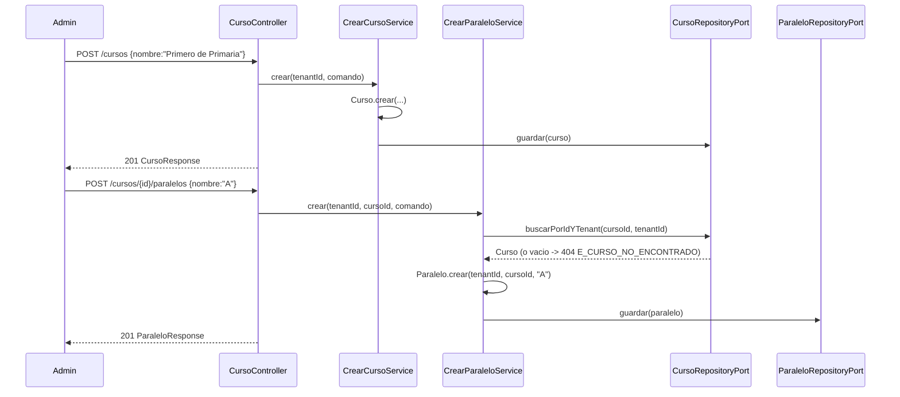

# Design Doc `DD-UC-010` — Académico: Cursos y Paralelos

> **Qué es**: décimo Design Doc de código y **segundo feature de negocio real del módulo `academico`**, después de `GestionEscolar` (`DD-UC-008`/`DD-UC-009`). Implementa `FSD-UC-017` (Gestión de Cursos y Paralelos): las entidades de las que dependerán `Materia` (`FSD-UC-018`), `Inscripcion` (`FSD-UC-020`) y la asignación de `Usuario` con rol `ASESOR` a un curso (`FSD-UC-021`, A1 diferido).
>
> **Relación con otros documentos**: consume `TenantContextProvider`/RLS (`DD-UC-002`, `ADR-0001`) y el patrón de filtros/paginación (`shared.PageQuery`/`PageResult`/`web.PageResponse`, `DD-UC-007`); reutiliza el `ErrorResponse` de `academico.infrastructure.adapter.in.rest` introducido en `DD-UC-008`. No depende de `GestionEscolar` (`Curso` es una entidad de catálogo del tenant, independiente del ciclo escolar). Alimenta el DTP (§A.1, §A.3) vía `@dtp-sync`.

## 1. Objetivo y contexto

- **Qué resuelve este feature**: permite que el `ADMIN` de un tenant cree un `Curso` (ej. "Primero de Primaria") y uno o más `Paralelo` dentro de él (ej. "A", "B"), y los liste. Es el primer eslabón de la cadena `Curso → Materia → Inscripcion` del modelo genérico configurable (`ADR-0009`).
- **Caso(s) de uso del FSD que implementa**: `FSD-UC-017` (`docs/product/FSD.md` §4.6.7).
- **Alcance**:
  - **Dentro**:
    - Aggregate `Curso` (dominio puro, sin Spring/JPA) — sin estado, sin ciclo de vida (a diferencia de `GestionEscolar`/`Tenant`).
    - Aggregate `Paralelo`, entidad independiente que referencia `cursoId` — no un objeto embebido dentro de `Curso` (ver §2/§3).
    - `POST /api/v1/cursos` (alta), `GET /api/v1/cursos` (listado scoped al tenant, con filtro `q` y paginación — reutiliza `shared.PageQuery`/`PageResult`/`PageResponse` de `DD-UC-007`).
    - `POST /api/v1/cursos/{id}/paralelos` (alta, repetible), `GET /api/v1/cursos/{id}/paralelos` (listado simple, sin paginación — cardinalidad acotada, ver §2).
    - Flyway `V6__academico_curso_paralelo.sql`: tablas `curso` y `paralelo`, ambas con `tenant_id` y política RLS (`ADR-0001`), mismo patrón que `gestion_escolar`.
    - `@PreAuthorize("hasRole('ADMIN')")` en los cuatro endpoints; `tenantId` siempre desde `TenantContextProvider`, nunca del body/query (mismo invariante que `DD-UC-002`/`DD-UC-005`/`DD-UC-007`/`DD-UC-008`).
  - **Fuera** (Design Docs de seguimiento, todavía sin crear):
    - `FSD-UC-018` (Materias) y `FSD-UC-020` (Estudiantes e Inscripciones) — ambos referencian `Curso`/`Paralelo` como padre, pero se implementan en Design Docs posteriores.
    - Activar la validación diferida `E_ASESOR_SIN_CURSO` de `FSD-UC-021` (`docs/product/FSD.md` §4.6.11, A1) en el módulo `identidad` — este DD hace que `Curso`/`Paralelo` existan por primera vez en código, lo que desbloquea *técnicamente* esa validación, pero conectar `identidad` con `academico` (nuevo puerto cruzado, mismo patrón que `identidad.TenantConsultaPort`) es una decisión de diseño propia que se aborda en un Design Doc de seguimiento dedicado, para no mezclar dos módulos en un mismo *vertical slice*.
    - Renombrar/editar/eliminar `Curso` o `Paralelo` una vez creados — solo alta y listado en este slice (no hay `PATCH`/`DELETE`), consistente con que el FSD (§4.6.7) solo declara los dos `POST`.
    - Validación de unicidad de `nombre` de `Paralelo` dentro de un mismo `Curso` (ej. impedir dos paralelos "A") — el FSD no la declara; no se inventa (ver §3).
    - UI Angular — Design Doc de seguimiento (mismo patrón backend-primero que separó `DD-UC-005`→`DD-UC-006` y `DD-UC-008`→`DD-UC-009`).
    - `audit_log` append-only — la gobernanza de auditoría/inmutabilidad de los módulos nuevos de `ADR-0009` sigue **pendiente de definición** (§3 punto 5 de ese ADR); este DD no la implementa, solo fija la postura mínima de aislamiento (§2), igual que `DD-UC-008`.

## 2. Diseño (el "cómo") `[humano+máquina]`

- **Enfoque elegido**: `Curso` y `Paralelo` son dos Aggregates independientes, cada uno con su propia identidad, repositorio y tabla — **no** un único agregado `Curso` con `Paralelo` como colección embebida. Ambos son inmutables (constructor privado + factory `crear(...)`, mismo patrón que `GestionEscolar`/`Tenant`/`Usuario`), con Lombok bajo el *allowlist* de dominio (`ADR-0012`: `@Getter`/`@EqualsAndHashCode`/`@ToString`, nomenclatura JavaBean). Ninguno de los dos tiene estado ni transiciones — a diferencia de `GestionEscolar`/`Tenant`, no hay un `cambiarEstado(...)`.
- **Por qué agregados separados (no `Curso` con `List<Paralelo>` embebido)**: `Materia`, `Inscripcion` y `Usuario.curso_asignado_id` referencian un `Paralelo`/`Curso` por su `id` directamente (ver `docs/product/FSD.md` §6.3.1/§6.3.2), sin necesidad de cargar el agregado `Curso` completo. Modelar `Paralelo` como entidad propia con su propio repositorio evita cargar y serializar la lista completa de paralelos cada vez que otro módulo solo necesita validar la existencia de uno. Es el mismo criterio que separa `GestionEscolar` de `PeriodoEvaluacion` en el diagrama ER (`CURSO ||--o{ PARALELO`, entidades hijas con FK, no un `List<>` embebido en el JSON del padre).
- **Validación de padre en la creación de `Paralelo`**: `POST /cursos/{id}/paralelos` verifica que el `Curso` exista y pertenezca al tenant del actor **antes** de crear el `Paralelo`; si no, `404 E_CURSO_NO_ENCONTRADO` (mismo criterio "404, no 403" que `DD-UC-005`/`DD-UC-008` para recursos de otro tenant).
- **Aislamiento de tenant** (mismo patrón que `GestionEscolar`, `DD-UC-008` §2): RLS `FORCE` sobre `curso` y `paralelo`, ambas con `tenant_id` obligatorio (sin caso `SYSADMIN`, análogo a `gestion_escolar`). **Decisión explícita**: aunque el diccionario de datos del FSD (`docs/product/FSD.md` §6.3.2) solo declara `curso_id` como FK de `Paralelo` (sin `tenant_id` propio, derivable por join contra `Curso`), este DD añade una columna `tenant_id` redundante en `paralelo` para mantener el mismo patrón de aislamiento defensivo usado en el resto del proyecto (RLS directa por tabla + filtro explícito en el adaptador, sin depender de un `JOIN` para el aislamiento). Es una decisión de bajo riesgo, reversible sin romper el contrato de API (columna técnica interna, no expuesta en `ParaleloResponse`).
- **Filtros y paginación de `Curso`**: reutiliza el patrón de `DD-UC-007` — `CursoFiltro(q)` (record de aplicación, análogo a `UsuarioFiltro`/`GestionEscolarFiltro`, aquí solo con `q` porque `Curso` no tiene estado) + `CursoSpecifications` (Criteria API) + `JpaSpecificationExecutor`; `q` busca por `nombre` (case-insensitive, `contains`).
- **Listado de `Paralelo` sin paginación**: `GET /cursos/{id}/paralelos` devuelve `List<ParaleloResponse>` simple (no `PageResponse`), porque la cardinalidad de paralelos por curso es baja y acotada en la práctica (normalmente A-Z); introducir paginación aquí sería sobre-ingeniería sin caso de uso real. Se revisará si un tenant real reporta más de una página de paralelos por curso.
- **Refinamiento respecto al plan original (ejecución, sin cambiar el contrato)**: los DTOs REST (`CrearCursoRequest`/`CrearParaleloRequest`/`CursoResponse`/`ParaleloResponse`) se crearon directamente en `academico.infrastructure.adapter.in.rest`, sin el subpaquete `dto/` esbozado en el árbol de §2 — sigue el precedente real de `CrearGestionEscolarRequest`/`GestionEscolarResponse` (`DD-UC-008`), que tampoco usan ese subpaquete.
- **Componentes tocados** (segundo feature real de `academico`):

```
backend/src/main/java/com/edusync/academico/
├── domain/
│   ├── Curso.java                                   (Aggregate, sin estado)
│   ├── CursoId.java
│   ├── Paralelo.java                                (Aggregate, referencia CursoId)
│   ├── ParaleloId.java
│   └── CursoNoEncontradoException.java              (404 E_CURSO_NO_ENCONTRADO)
├── application/
│   ├── port/in/
│   │   ├── CrearCursoUseCase.java
│   │   ├── ListarCursosUseCase.java
│   │   ├── CrearParaleloUseCase.java
│   │   ├── ListarParalelosUseCase.java
│   │   └── CursoFiltro.java
│   ├── port/out/
│   │   ├── CursoRepositoryPort.java
│   │   └── ParaleloRepositoryPort.java
│   └── service/
│       ├── CrearCursoService.java
│       ├── ListarCursosService.java
│       ├── CrearParaleloService.java                (valida Curso padre antes de crear)
│       └── ListarParalelosService.java
└── infrastructure/
    ├── adapter/in/rest/
    │   ├── CursoController.java
    │   └── {CrearCursoRequest,CrearParaleloRequest,CursoResponse,ParaleloResponse}.java
    └── adapter/out/persistence/
        ├── CursoJpaEntity.java / CursoJpaRepository.java (+ JpaSpecificationExecutor) / CursoSpecifications.java / CursoRepositoryAdapter.java
        └── ParaleloJpaEntity.java / ParaleloJpaRepository.java / ParaleloRepositoryAdapter.java

backend/src/main/resources/db/migration/
└── V6__academico_curso_paralelo.sql
```

- **Contratos** (todos bajo `/api/v1`, `@PreAuthorize("hasRole('ADMIN')")`):
  - `POST /cursos {nombre}` → `201 CursoResponse` \| `400` (validación Bean Validation, `nombre` en blanco).
  - `GET /cursos?q=&page=&size=` → `200 PageResponse<CursoResponse>` (scoped al `tenantId` del Admin autenticado).
  - `POST /cursos/{id}/paralelos {nombre}` → `201 ParaleloResponse` \| `404 E_CURSO_NO_ENCONTRADO` (no existe o es de otro tenant) \| `400` (validación).
  - `GET /cursos/{id}/paralelos` → `200 List<ParaleloResponse>` \| `404 E_CURSO_NO_ENCONTRADO`.
- **Diagrama**:



## 3. Alternativas consideradas

| Alternativa | Pros | Contras | ¿Elegida? |
|-------------|------|---------|-----------|
| A. `Curso` y `Paralelo` como Aggregates independientes, cada uno con su propio repositorio | `Materia`/`Inscripcion`/`Usuario.curso_asignado_id` pueden referenciar un `Paralelo` por id sin cargar el `Curso` completo; consistente con el diagrama ER del FSD (entidades hijas con FK, no colección embebida) | Dos repositorios en vez de uno; la creación de `Paralelo` requiere una consulta extra para validar el padre | **sí** |
| B. `Curso` como agregado único que embebe `List<Paralelo>` (patrón Order/OrderLines) | Un solo repositorio; invariantes del padre-hijo garantizadas en memoria | Cualquier consulta de un `Paralelo` por id (desde `Materia`/`Inscripcion` en DDs futuros) obligaría a cargar y recorrer todos los `Curso` del tenant, o duplicar un repositorio de solo lectura para `Paralelo` de todas formas | no |
| C. Añadir `PATCH`/`DELETE` de `Curso`/`Paralelo` en este mismo DD | Ciclo de vida CRUD completo desde el día 1 | El FSD (§4.6.7) solo declara los dos `POST`; renombrar/eliminar un `Curso` ya referenciado por `Materia`/`Inscripcion` (en DDs futuros) tiene implicaciones de integridad no resueltas todavía — se prefiere no inventarlas | no |
| D. Validar unicidad de `nombre` de `Paralelo` dentro de un `Curso` | Evita duplicados accidentales ("A" repetido) | El FSD no lo declara como regla de negocio ni excepción; se inventaría una validación no confirmada | no |
| E. Paginar `GET /cursos/{id}/paralelos` igual que `GET /cursos` | Consistencia total del patrón `DD-UC-007` | Sobre-ingeniería para una colección de cardinalidad baja y acotada en la práctica (paralelos por curso); se puede añadir después sin romper el contrato si un tenant real lo necesita | no |
| F. Resolver `E_ASESOR_SIN_CURSO` (`FSD-UC-021` A1) en este mismo DD, ahora que `Curso` existe | Cierra un gap documentado explícitamente en el FSD | Mezclaría dos módulos (`identidad` + `academico`) en un solo *vertical slice*; requiere diseñar un puerto cruzado nuevo (`identidad` → `academico`), decisión que merece su propio Design Doc | no |

> Ninguna decisión de esta sección amerita un ADR propio: la alternativa A es revisable a B sin romper el contrato de API (cambio interno de persistencia); la columna `tenant_id` redundante en `paralelo` (§2) es de bajo riesgo y reversible.

## 4. Impacto en las specs vivas `[máquina]`

| Artefacto vivo | Cambio | ¿Delta vs DTI vFinal? |
|----------------|--------|-----------------------|
| `docs/product/FSD.md` (`FSD-UC-017`) | Ninguno: el flujo principal §4.6.7 ya describe los dos `POST`; este DD añade `GET` de listado por inferencia práctica (mismo criterio que `DD-UC-008` con `GestionEscolar`), sin contradecir el FSD | no |
| `docs/product/DTP.md` | §A.1 nueva fila (creación y ejecución de `DD-UC-010`/`PR-IMPL-010`); §A.3 `FSD-UC-017` pasa de `pendiente` a **completo (backend)** | no |
| `docs/PROMPT_MAPPING.md` | Nueva fila `PR-IMPL-010` (área `IMPL`, **ejecutado**), nodo `IMPL010` en el flowchart, fila en la tabla de trazabilidad | no |
| Baseline `docs/baseline/**` | **No se toca** (regla de oro del proyecto) | — |

> **Recordatorio (regla de oro)**: el baseline congelado de M4 (`docs/baseline/`) no se toca. Los cambios viven en `docs/product/`.

## 5. Prompts usados `[máquina]`

| Prompt | Tarea | Artefacto generado |
|--------|-------|--------------------|
| `PR-IMPL-010` | Código + tests + migración `V6` del módulo `academico` (`Curso`/`Paralelo`) | `backend/src/main/java/com/edusync/academico/**`, `backend/src/main/resources/db/migration/V6__academico_curso_paralelo.sql` |

> El prompt sigue `plantillas/PROMPT_TEMPLATE.md`, vive en `docs/prompts/impl/PR-IMPL-010.md` y se referencia desde `docs/PROMPT_MAPPING.md`.

## 6. Plan de pruebas y evals

- **Unit**: `Curso.crear()` — nombre no nulo; `Paralelo.crear()` — nombre no nulo, `cursoId`/`tenantId` no nulos.
- **Integration** (Testcontainers PostgreSQL 15, mismo patrón que `GestionEscolarIntegrationTest`): `POST /cursos` caso feliz; `GET /cursos` con filtro `q` y paginación; `POST /cursos/{id}/paralelos` caso feliz; `POST` de paralelo sobre curso inexistente o de otro tenant → `404 E_CURSO_NO_ENCONTRADO`; `GET /cursos/{id}/paralelos` caso feliz; aislamiento cross-tenant en ambos listados; `ModularityTests` sin ciclos nuevos.
- **E2E / Gherkin** (deriva de `PRD-US-025`): Admin autenticado crea el curso "Primero de Primaria" y los paralelos "A" y "B" → el sistema los persiste y los lista, disponibles para asignación de `Materia`/`Inscripcion` en Design Docs futuros.
- **Evals de IA**: no aplica (este feature no usa un agente/LLM en runtime).

## 7. Definition of Done (checklist)

- [x] `fsd_uc` declarado y enlazado (`FSD-UC-017`).
- [x] Diseño (§2) y alternativas (§3) documentados.
- [x] Sin ADR nuevo (decisiones de bajo riesgo, revisables sin costo alto — ver nota al final de §3).
- [x] §4 Impacto en specs vivas registrado (sin tocar el baseline).
- [x] Prompt `PR-IMPL-010` versionado en `docs/prompts/impl/` y en `PROMPT_MAPPING.md` — **ejecutado**.
- [x] Tests/evals definidos (§6) y ejecutados: `mvn test` → **134/134** verde (incluye `ModularityTests` 7/7 y los 15 tests nuevos: 3 dominio, 7 servicios Mockito, 5 integración Testcontainers con `CursoIntegrationTest`).
- [x] DTP actualizado (changelog + estado del FSD-UC) vía `dtp-sync`.
- [x] PR declara prompts usados y archivos generados vs editados a mano (§5).

## 8. Versionado

| Versión | Fecha | Autor | Cambio |
|---------|-------|-------|--------|
| v1.0 | 20/08/2026 | Rodrigo Aspeti | Creación del décimo Design Doc de código (`DD-UC-010`): segundo feature de negocio real del módulo `academico` — `Curso` y `Paralelo` (alta y listado, sin ciclo de vida). Decisión de diseño explícita: `Curso` y `Paralelo` como Aggregates independientes con repositorios propios (no `Curso` con `List<Paralelo>` embebido), porque `Materia`/`Inscripcion`/`Usuario.curso_asignado_id` (Design Docs futuros) necesitan referenciar un `Paralelo` por id sin cargar el agregado padre completo; columna `tenant_id` redundante en `paralelo` para mantener el mismo patrón de aislamiento RLS defensivo del resto del proyecto, aunque el FSD solo declara `curso_id` en su diccionario de datos. Explícitamente fuera de alcance: `PATCH`/`DELETE`, validación de unicidad de nombre de paralelo, y la activación de `E_ASESOR_SIN_CURSO` en `identidad` (queda desbloqueada técnicamente pero se aborda en un DD de seguimiento dedicado). Estado `aprobado`; ejecución de `PR-IMPL-010` pendiente. |
| v1.1 | 20/08/2026 | Rodrigo Aspeti | **Ejecución de `PR-IMPL-010`**: `Curso`/`Paralelo` con código real (dominio sin Lombok de igualdad, solo `@Getter` — mismo criterio que `GestionEscolar`, más estricto que el *allowlist* completo de `ADR-0012`), `CursoController` (`POST/GET /cursos`, `POST/GET /cursos/{id}/paralelos`), `CursoSpecifications` (filtro `q`), `V6__academico_curso_paralelo.sql` (RLS `FORCE` en ambas tablas). Refinamiento respecto al plan original (§2): los DTOs REST se crearon directamente en `academico.infrastructure.adapter.in.rest`, sin el subpaquete `dto/` esbozado en el árbol original, replicando el precedente real de `DD-UC-008`. 15 tests nuevos (3 dominio, 7 servicios Mockito, 5 integración Testcontainers en `CursoIntegrationTest`, incluida validación del curso padre y aislamiento cross-tenant 404 en ambos recursos). `mvn test` → **134/134** verde (incluye `ModularityTests` 7/7). `FSD-UC-017` queda **completo (backend)**; UI Angular → futuro Design Doc (mismo patrón backend-primero de `DD-UC-008`→`DD-UC-009`). Estado `ejecutado`, DoD 100%. |
