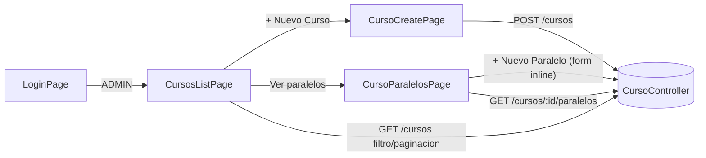

# Design Doc `DD-UC-011` — Frontend: consola de Cursos y Paralelos

> **Qué es**: undécimo Design Doc de código, backend-only complementario en UI: cierra `FSD-UC-017` en la capa de presentación, consumiendo el backend ya implementado en `DD-UC-010`/`PR-IMPL-010` (sin delta de backend en este DD). Es a `DD-UC-010` lo que `DD-UC-009` fue a `DD-UC-008`: el *vertical slice* de UI de un feature backend ya cerrado. Es el **segundo *vertical slice* de UI del módulo `academico`**, después de Gestión Escolar (`DD-UC-009`).
>
> **Relación con otros documentos**: consume `CursoController` (`DD-UC-010`) y reutiliza el shell/`AuthService`/`roleGuard` ya creados en `DD-UC-004`, el patrón de filtros/paginación de `DD-UC-007` (`PageResponse<T>`) y el patrón sin design system de `features/academico/` establecido en `DD-UC-009`. No toca `identidad` ni `plataforma`.

## 1. Objetivo y contexto

- **Qué resuelve este feature**: permite que el `ADMIN` de un tenant administre sus Cursos y Paralelos desde el navegador — listar Cursos (con filtro `q` y paginación), crear un nuevo Curso, y ver/crear los Paralelos de un Curso concreto (ej. "A", "B" dentro de "Primero de Primaria").
- **Caso(s) de uso del FSD que implementa**: `FSD-UC-017` (`docs/product/FSD.md` §4.6.7), cierre de la UI — el backend ya está completo desde `DD-UC-010`.
- **Alcance**:
  - **Dentro**:
    - `frontend/src/app/features/academico/`: lista de Cursos (`GET /cursos` con `q`/`page`/`size`), alta de Curso (`POST /cursos`), vista de Paralelos de un Curso (`GET /cursos/{id}/paralelos`, sin paginar) con alta inline de Paralelo (`POST /cursos/{id}/paralelos`).
    - Rutas `/academico/cursos`, `/academico/cursos/nuevo` y `/academico/cursos/:id/paralelos`, protegidas por `roleGuard` (`data: { role: 'ADMIN' }`), mismo patrón que `/academico/gestiones-escolares` (`DD-UC-009`).
    - Enlace de navegación "Cursos" en `shell.component.ts`, condicional a `auth.hasRole('ADMIN')` (junto a "Usuarios" y "Gestión Escolar").
  - **Fuera**:
    - Cualquier pantalla de `Materia`/`Profesor`/`Estudiante`/`Inscripcion` (`FSD-UC-018`..`FSD-UC-020`) — sin `DD-UC-NNN` propio todavía.
    - Edición o eliminación de `Curso`/`Paralelo` — el backend (`DD-UC-010`) solo expone alta y listado (sin `PATCH`/`DELETE`); la UI no debe insinuar una operación que el backend rechazaría con `404`/`405`.
    - Selección de `Curso`/`Paralelo` en el alta de `Usuario` con rol `ASESOR` (`FSD-UC-021` A1, `E_ASESOR_SIN_CURSO` diferido) — fuera de alcance de este DD, igual que en `DD-UC-010` §1.
    - Delta de backend — ninguno; `DD-UC-010` ya expone los cuatro endpoints necesarios.

## 2. Diseño (el "cómo") `[humano+máquina]`

- **Enfoque elegido**: reutilizar el mismo patrón sin design system de `features/academico/` (`DD-UC-009`) — componentes Angular *standalone* con plantilla inline, `signal()` para estado local, `HttpClient` inyectado directamente, `ApiBase.BASE`. La lista de Cursos replica el patrón de `gestiones-escolares-list.page.ts` (caja de búsqueda `q`, paginación con `PageResponse<T>`), pero sin `<select>` de estado porque `Curso` no tiene estado (`DD-UC-010` §2).
- **Vista de Paralelos como pantalla propia, no un acordeón en la lista de Cursos**: `GET /cursos/{id}/paralelos` es un endpoint aparte (sin paginar, `DD-UC-010` §2) — modelarlo como una ruta propia (`/academico/cursos/:id/paralelos`) en vez de expandir cada fila de la lista de Cursos evita cargar los Paralelos de *todos* los Cursos de la página a la vez y mantiene cada componente enfocado en un solo recurso, mismo criterio de separación que ya aplica el backend (`CursoController` con cuatro acciones independientes). Es la primera pantalla de "detalle" del proyecto (hasta ahora solo había lista + alta); se diseña con el mismo patrón sin design system, sin introducir un concepto de "detail shell" reutilizable todavía (no hay un segundo caso de uso que lo justifique).
- **Alta de Paralelo inline en la vista de detalle, no una ruta `/nuevo` separada**: a diferencia de `Curso` (que tiene su propia página `cursos/nuevo`, porque es la entidad raíz de la lista), un `Paralelo` siempre se crea en el contexto de un `Curso` ya visible en pantalla — un formulario corto (`nombre`) embebido arriba o debajo de la lista de Paralelos evita una navegación de ida y vuelta para una operación de un solo campo.
- **Sin `<select>` de filtro por estado en la lista de Cursos**: a diferencia de `GestionEscolar`/`Tenant`, `Curso` no tiene estado (`DD-UC-010` §2) — la caja de búsqueda `q` es el único filtro.
- **Componentes tocados** (segundo *vertical slice* de UI para `academico`):

```
frontend/src/app/
├── app.routes.ts                                    (+ /academico/cursos[, /nuevo, /:id/paralelos])
├── shared/layout/shell.component.ts                 (+ enlace "Cursos", rol ADMIN)
└── features/
    └── academico/
        ├── curso.model.ts                           (nuevo: CursoResponse, CursoFiltro, ParaleloResponse)
        ├── cursos-list.page.ts                       (nuevo: lista + filtro q + paginación + link a paralelos)
        ├── curso-create.page.ts                      (nuevo: alta de Curso — nombre)
        └── curso-paralelos.page.ts                   (nuevo: detalle de un Curso — lista de Paralelos + alta inline)
```

- **Contratos consumidos** (ya existentes, sin cambios — `DD-UC-010`): `GET /cursos?q=&page=&size=`, `POST /cursos`, `GET /cursos/{id}/paralelos`, `POST /cursos/{id}/paralelos`.
- **Diagrama**:



## 3. Alternativas consideradas

| Alternativa | Pros | Contras | ¿Elegida? |
|-------------|------|---------|-----------|
| A. Vista de Paralelos como pantalla/ruta propia (`/academico/cursos/:id/paralelos`) | Un solo `GET` por Curso visitado; refleja la separación de recursos del backend; componente enfocado | Un salto de navegación extra respecto a un acordeón en la lista | **sí** |
| B. Acordeón/expandible en `CursosListPage` que carga los Paralelos de cada Curso al expandir la fila | Todo en una sola pantalla | Requiere gestionar N llamadas `GET` independientes (una por fila expandida) y estado más complejo en un solo componente; sin caso de uso real que lo justifique todavía | no |
| A. Alta de Paralelo inline en `CursoParalelosPage` (formulario corto, sin ruta propia) | Evita navegación de ida y vuelta para un campo (`nombre`); consistente con la naturaleza de "hijo siempre visualizado en contexto del padre" | Menos consistente con el patrón "lista + ruta `/nuevo`" usado para `Curso`/`GestionEscolar`/`Tenant`/`Usuario` | **sí** |
| B. Ruta separada `/academico/cursos/:id/paralelos/nuevo` (mismo patrón que `Curso`) | Consistencia total de patrón con el resto del proyecto | Sobre-ingeniería para un formulario de un solo campo que siempre se usa en el contexto de la pantalla de detalle | no |
| A. Sin filtro de estado en `CursosListPage` (solo `q`) | Refleja fielmente que `Curso` no tiene estado (`DD-UC-010` §2); UI más simple | — | **sí** |
| B. Añadir un `<select>` deshabilitado o vacío "para consistencia visual" con `GestionEscolar`/`Tenant` | Look & feel uniforme entre listas | Elemento de UI sin función real, confuso para el usuario | no |

> Ninguna decisión amerita ADR — son de bajo riesgo y consistentes con decisiones ya tomadas en `DD-UC-004`/`DD-UC-007`/`DD-UC-009`.

> **Refinamiento encontrado durante la ejecución** (`PR-IMPL-011`, 21/08/2026): el backend (`DD-UC-010`) no expone `GET /cursos/{id}` (solo alta y listado paginado de Cursos, más alta/listado de sus Paralelos) — no hay forma de resolver el nombre del Curso a partir de solo su `id` en `CursoParalelosPage`. Solución adoptada, sin delta de backend: `CursosListPage` pasa `nombre` como *query param* al navegar (`[queryParams]="{ nombre: curso.nombre }"`); `CursoParalelosPage` lo lee de `ActivatedRoute.snapshot.queryParamMap` para el encabezado y usa "este Curso" como *fallback* si falta (navegación directa o recarga de página). La única validación real de existencia/pertenencia al tenant sigue siendo el `404 E_CURSO_NO_ENCONTRADO` de `GET /cursos/{id}/paralelos`.

## 4. Impacto en las specs vivas `[máquina]`

| Artefacto vivo | Cambio | ¿Delta vs DTI vFinal? |
|----------------|--------|-----------------------|
| `docs/product/DTP.md` | §A.1 nueva fila (ejecución de `DD-UC-011`/`PR-IMPL-011`); §A.3 `FSD-UC-017` pasa a **completo (backend + UI)** | no |
| `docs/PROMPT_MAPPING.md` | Nueva fila `PR-IMPL-011` en área `IMPL` | no |
| `docs/product/FSD.md` | Sin cambio de flujo/reglas — la UI consume contratos ya documentados en `FSD-UC-017` (§4.6.7) | no |
| `docs/adr/` | Sin ADR nuevo | no |

> **Recordatorio (regla de oro)**: el baseline congelado de M4 (`docs/baseline/`) no se toca. Los cambios viven en `docs/product/`.

## 5. Prompts usados `[máquina]`

| Prompt | Tarea | Artefacto generado |
|--------|-------|--------------------|
| `PR-IMPL-011` | Generación de la consola Angular de Cursos y Paralelos | `frontend/src/app/features/academico/**` (delta), `app.routes.ts`/`shell.component.ts` (delta) |

> El prompt sigue [`PROMPT_TEMPLATE.md`](../../plantillas/plantillas1/PROMPT_TEMPLATE.md), vive en `docs/prompts/impl/PR-IMPL-011.md` y se referencia desde `docs/PROMPT_MAPPING.md`.

## 6. Plan de pruebas y evals

- **Manual / E2E** (mismo alcance que `DD-UC-009`, sin specs de componente Angular nuevas): login como Admin → `/academico/cursos` → crear un Curso ("Primero de Primaria") → verlo en la lista → filtrar por `q` → paginar → entrar a "Ver paralelos" → crear los Paralelos "A" y "B" → verlos listados.
- **Casos borde manuales**: alta de Curso con `nombre` vacío → mensaje de error (validación 400); lista de Cursos vacía (tenant sin cursos); lista de Paralelos vacía (Curso recién creado, sin paralelos todavía); alta de Paralelo con `nombre` vacío → mensaje de error.
- **Arquitectura**: `ng build` sin errores (único gate automatizado de frontend en este proyecto, igual que `DD-UC-004`/`DD-UC-006`/`DD-UC-007`/`DD-UC-009`). **Verificado en la ejecución** (21/08/2026): `ng build` → verde, 3 lazy chunks nuevos (`cursos-list-page`, `curso-create-page`, `curso-paralelos-page`).

## 7. Definition of Done (checklist)

- [x] `fsd_uc` declarado y enlazado (`FSD-UC-017`, cierre de UI).
- [x] Diseño (§2) y alternativas (§3) documentados.
- [x] Sin ADR nuevo.
- [x] §4 Impacto en specs vivas registrado y aplicado vía `dtp-sync`.
- [x] Prompt `PR-IMPL-011` versionado en `docs/prompts/impl/` y registrado en `docs/PROMPT_MAPPING.md` — **ejecutado**.
- [x] `ng build` en verde (3 lazy chunks nuevos).
- [x] `docs/product/DTP.md` actualizado vía `dtp-sync`.
- [x] PR de código declara: prompt usado (`PR-IMPL-011`), archivos generados vs. editados a mano — pendiente del commit formal.

## 8. Registro de cambios

| Versión | Fecha | Autor | Cambio |
|---------|-------|-------|--------|
| v1.0 | 21/08/2026 | Rodrigo Aspeti | Creación del undécimo Design Doc de código (`DD-UC-011`): consola Angular de Cursos y Paralelos (lista de Cursos con filtro `q`/paginación, alta de Curso, vista de detalle con Paralelos de un Curso y alta inline de Paralelo), cerrando `FSD-UC-017` en la capa de presentación sin tocar backend (`DD-UC-010` ya expone todos los contratos). Segundo *vertical slice* de UI del módulo `academico`, después de Gestión Escolar (`DD-UC-009`). Decisiones explícitas: vista de Paralelos como pantalla/ruta propia (`/academico/cursos/:id/paralelos`), no un acordeón en la lista de Cursos; alta de Paralelo inline en esa misma pantalla, sin ruta `/nuevo` separada; sin `<select>` de filtro por estado en la lista de Cursos (`Curso` no tiene estado). Estado `aprobado`; ejecución de `PR-IMPL-011` pendiente. |
| v1.1 | 21/08/2026 | Rodrigo Aspeti | Ejecución real de `PR-IMPL-011`: `frontend/src/app/features/academico/{curso.model,cursos-list.page,curso-create.page,curso-paralelos.page}.ts` (nuevos), delta en `app.routes.ts` (`/academico/cursos[, /nuevo, /:id/paralelos]`) y `shell.component.ts` (enlace "Cursos"). **Refinamiento encontrado durante la ejecución** (documentado en §2): el backend no expone `GET /cursos/{id}`, por lo que el nombre del Curso se propaga como *query param* (`nombre`) desde `CursosListPage` hacia `CursoParalelosPage`, sin delta de backend; el `404 E_CURSO_NO_ENCONTRADO` de `GET /cursos/{id}/paralelos` sigue siendo la única validación real de existencia. `ng build` → verde (3 lazy chunks nuevos). `FSD-UC-017` cierra su implementación **completa** (backend + UI) — tercer `FSD-UC` en cerrar ambas capas, después de `FSD-UC-021` y `FSD-UC-012`. Estado `ejecutado`, DoD 100%. |
