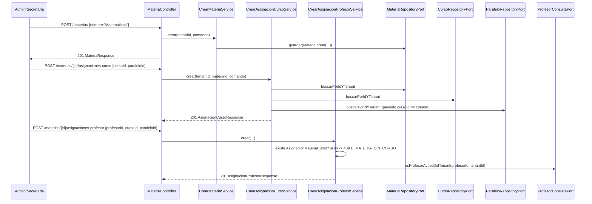
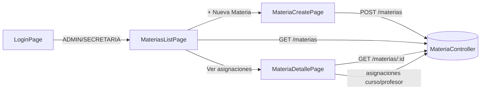

# Design Doc `DD-UC-012` — Académico: Materias (backend + UI)

> **Qué es**: duodécimo Design Doc de código y **tercer feature de negocio real del módulo `academico`**, después de `GestionEscolar` (`DD-UC-008`/`DD-UC-009`) y `Curso`/`Paralelo` (`DD-UC-010`/`DD-UC-011`). Implementa `FSD-UC-018` (Gestión de Materias) como **un solo *vertical slice* fullstack**: backend hexagonal + consola Angular en el mismo Design Doc y el mismo `PR-IMPL-012`. Es el primer feature de `academico` que no se parte en backend-primero + UI de seguimiento (decisión explícita del usuario, 21/08/2026).
>
> **Relación con otros documentos**: consume `Curso`/`Paralelo` (`DD-UC-010`), `TenantContextProvider`/RLS (`DD-UC-002`, `ADR-0001`) y el patrón de filtros/paginación (`shared.PageQuery`/`PageResult`/`web.PageResponse`, `DD-UC-007`). El `Profesor` no es entidad nueva: es `Usuario` con rol `PROFESOR` (`FSD-UC-021` / `DD-UC-005`). La consulta cruzada `academico` → `identidad` se resuelve con un Open Host Service (`ProfesorConsultaPort` declarado en `academico`, implementado en `identidad`), mismo criterio que `identidad.TenantConsultaPort` (`DD-UC-003`). Alimenta el DTP (§A.1, §A.3) vía `@dtp-sync`.

## 1. Objetivo y contexto

- **Qué resuelve este feature**: permite que el `ADMIN` (y la `SECRETARIA`) de un tenant cree una `Materia` (ej. "Matemáticas"), la asigne a un `Curso`/`Paralelo` ya existente y le asigne un `Profesor` (usuario con rol `PROFESOR`), tanto por API como desde el navegador. Es el eslabón `Curso → Materia → (Evaluacion)` del modelo genérico configurable (`ADR-0009`); prerequisito de `FSD-UC-015`.
- **Caso(s) de uso del FSD que implementa**: `FSD-UC-018` (`docs/product/FSD.md` §4.6.8).
- **Alcance**:
  - **Dentro**:
    - Aggregate `Materia` (dominio puro, sin Spring/JPA) — catálogo del tenant; nace solo con `nombre`, sin curso embebido.
    - Aggregates `AsignacionMateriaCurso` y `AsignacionMateriaProfesor`, independientes, cada uno con repositorio propio (no colecciones embebidas en `Materia`; ver §2/§3).
    - `POST/GET /api/v1/materias` (alta, listado scoped al tenant, filtro `q` + paginación — reutiliza `DD-UC-007`).
    - `GET /api/v1/materias/{id}` (detalle; evita el *workaround* de query param de `DD-UC-011`).
    - `POST/GET /api/v1/materias/{id}/asignaciones-curso` (`{cursoId, paraleloId}`; listado simple, sin paginar).
    - `POST/GET /api/v1/materias/{id}/asignaciones-profesor` (`{profesorId, cursoId, paraleloId}`; listado simple, sin paginar).
    - `GET /api/v1/materias/profesores-disponibles` — catálogo mínimo `{id, nombreCompleto}` de usuarios `PROFESOR` activos del tenant (necesario para el `<select>` de la UI; **no** es la consola de `FSD-UC-019`).
    - Puerto público `academico.ProfesorConsultaPort` (Open Host Service), implementado en `identidad.infrastructure`.
    - Delta RBAC de lectura en `CursoController`: `GET /cursos` y `GET /cursos/{id}/paralelos` también `SECRETARIA` (el formulario de asignación necesita esos listados; los `POST` de Curso/Paralelo siguen `ADMIN`).
    - Flyway `V7__academico_materia.sql`: tablas `materia`, `asignacion_materia_curso`, `asignacion_materia_profesor`, las tres con `tenant_id` + RLS `FORCE` (`ADR-0001`).
    - Consola Angular: lista, alta y detalle con asignaciones inline; rutas `/academico/materias[, /nuevo, /:id]`; `roleGuard` acepta `ADMIN` **o** `SECRETARIA`; enlace "Materias" en el shell.
  - **Fuera** (Design Docs de seguimiento, todavía sin crear):
    - `FSD-UC-019` (Gestión de Profesores) — alta de `PROFESOR` ya existe en `FSD-UC-021`; `GET /profesores/{id}/asignaciones` queda fuera.
    - `FSD-UC-015` (Evaluaciones) — `BR-022` ("0 evaluaciones sobre una Materia sin Profesor") se **prepara** aquí (queda el dato de asignación), no se enforcea hasta que existan evaluaciones.
    - `FSD-UC-020` (Estudiantes e Inscripciones).
    - `PATCH`/`DELETE` de `Materia` o de sus asignaciones — el FSD §4.6.8 declara los tres `POST`; no se inventa edición/borrado (mismo recorte que `DD-UC-010`).
    - Unicidad de `nombre` de Materia, ni de `(materia, paralelo)` en asignaciones — el FSD no las declara.
    - `E_ASESOR_SIN_CURSO` (`FSD-UC-021` A1) y `audit_log` formal (`ADR-0009` §3 punto 5).
    - Puntos 2–5 de `ADR-0009` §3 (periodos, redondeo, pesos, gobernanza) — este feature no los toca.

## 2. Diseño (el "cómo") `[humano+máquina]`

- **Enfoque fullstack en un solo DD**: a diferencia de `DD-UC-010`→`DD-UC-011`, backend y UI se diseñan y se ejecutarán juntos (`PR-IMPL-012`). Reduce el ciclo de "API sin pantalla" y evita el gap de `GET /{id}` que `DD-UC-011` tuvo que parchear con un query param.
- **Modelo: tres Aggregates independientes, no FKs embebidas en `Materia`**. El diccionario del FSD (`docs/product/FSD.md` §6.3.2) pone `curso_id`/`paralelo_id` **en** `Materia` y `profesor_id` nullable. El flujo REST de `FSD-UC-018` contradice eso: `POST /materias {nombre}` y luego `POST .../asignaciones-curso` / `POST .../asignaciones-profesor`. Se elige el **flujo REST** (una Materia catálogo, p. ej. "Matemáticas", asignable a varios paralelos y profesores). Es el mismo criterio que separó `Curso` de `Paralelo` en `DD-UC-010`.
- **`Profesor` no es tabla nueva**: `profesorId` es el `Usuario.id` de un usuario del tenant con rol `PROFESOR` (`FSD-UC-019` paso 1 ya cubierto por `FSD-UC-021`). Validación vía `ProfesorConsultaPort.esProfesorActivoDelTenant(usuarioId, tenantId)` **antes** de persistir `AsignacionMateriaProfesor`.
- **Open Host Service `ProfesorConsultaPort`** (evita ciclo Modulith):
  - La interfaz vive en la **raíz de `academico`** (consumidor), no en `identidad`, porque `ApplicationModules.verify()` rechaza ciclos y `academico` no debe importar `identidad`.
  - La implementación `identidad.infrastructure.adapter.out.port.ProfesorConsultaPortImpl` importa el tipo público de `academico` — añade la arista `identidad → academico` (hoy no existe; no genera ciclo: `academico` no importa `identidad`).
  - Es el espejo del refinamiento de `TenantConsultaPort` (`DD-UC-003`: el puerto vive en el consumidor).
  - Contrato mínimo (sin PII extra): `esProfesorActivoDelTenant(UUID, UUID) → boolean`; `listarActivosDelTenant(UUID) → List<ProfesorResumen>` record `{id, nombreCompleto}` declarado junto al puerto. **No** se loguea `nombreCompleto` (`AGENTS.md` §7).
- **A1 `E_MATERIA_SIN_CURSO` (409)**: `POST .../asignaciones-profesor` exige que ya exista una `AsignacionMateriaCurso` para el mismo `(materiaId, cursoId, paraleloId)` del tenant. Si no → `MateriaSinCursoException`.
- **Validación de padre**:
  - Asignación curso: `Curso` y `Paralelo` existen, pertenecen al tenant, y el `Paralelo.cursoId` coincide con el `cursoId` del body. Si el curso no existe / otro tenant → `404 E_CURSO_NO_ENCONTRADO` (reutiliza la excepción de `DD-UC-010`). Si el paralelo no existe, es de otro tenant o no pertenece a ese curso → `404 E_PARALELO_NO_ENCONTRADO` (nueva).
  - Asignación profesor: además, `ProfesorConsultaPort.esProfesorActivoDelTenant` → si no → `404 E_PROFESOR_NO_ENCONTRADO`.
  - Toda operación sobre `{id}` de Materia: `404 E_MATERIA_NO_ENCONTRADA` si no existe o es de otro tenant (criterio "404, no 403", `DD-UC-005`/`DD-UC-008`/`DD-UC-010`).
- **Aislamiento de tenant**: RLS `FORCE` + `tenant_id NOT NULL` en las tres tablas (sin excepción `OR tenant_id IS NULL`). `tenantId` **nunca** del body/query: siempre `TenantContextProvider`.
- **RBAC**: actores del FSD = Admin / Secretaria.
  - `MateriaController`: `@PreAuthorize("hasAnyRole('ADMIN','SECRETARIA')")` en todos los endpoints de este DD.
  - Delta en `CursoController`: solo los **GET** (`/cursos`, `/cursos/{id}/paralelos`) pasan a `hasAnyRole('ADMIN','SECRETARIA')`; los POST siguen `ADMIN`.
  - UI: `roleGuard` se amplía de forma **compatible** — acepta `data.role: string` (rutas existentes) **o** `data.roles: string[]` (Materias). Rutas `/academico/materias/**` usan `roles: ['ADMIN','SECRETARIA']`. El shell muestra "Materias" si `hasRole('ADMIN') || hasRole('SECRETARIA')`.
- **GET de detalle de Materia**: `GET /materias/{id}` → `200 MateriaResponse` \| `404 E_MATERIA_NO_ENCONTRADA`. Primera vez que un listado de `academico` expone GET por id; la UI de detalle **no** depende de query params.
- **Listados de asignaciones sin paginar**: cardinalidad acotada por materia (mismo criterio que `GET /cursos/{id}/paralelos`).
- **DTOs REST** directamente en `academico.infrastructure.adapter.in.rest` (sin subpaquete `dto/`), precedente real de `DD-UC-008`/`DD-UC-010`. Dominio con Lombok solo `@Getter` (mismo criterio que `GestionEscolar`/`Curso`).
- **Componentes tocados**:

```
backend/src/main/java/com/edusync/academico/
├── ProfesorConsultaPort.java                        (nuevo: Open Host Service, raiz del modulo)
├── ProfesorResumen.java                             (record {id, nombreCompleto})
├── domain/
│   ├── Materia.java / MateriaId.java
│   ├── AsignacionMateriaCurso.java / AsignacionMateriaCursoId.java
│   ├── AsignacionMateriaProfesor.java / AsignacionMateriaProfesorId.java
│   ├── MateriaNoEncontradaException.java            (404 E_MATERIA_NO_ENCONTRADA)
│   ├── MateriaSinCursoException.java                (409 E_MATERIA_SIN_CURSO)
│   ├── ParaleloNoEncontradoException.java           (404 E_PARALELO_NO_ENCONTRADO)
│   └── ProfesorNoEncontradoException.java           (404 E_PROFESOR_NO_ENCONTRADO)
├── application/
│   ├── port/in/   (CrearMateria, ListarMaterias, ObtenerMateria,
│   │               Crear/Listar AsignacionCurso, Crear/Listar AsignacionProfesor,
│   │               ListarProfesoresDisponibles, MateriaFiltro)
│   ├── port/out/  (MateriaRepositoryPort, AsignacionMateriaCursoRepositoryPort,
│   │               AsignacionMateriaProfesorRepositoryPort)
│   └── service/   (un servicio por use case; CrearAsignacion* validan padres)
└── infrastructure/
    ├── adapter/in/rest/MateriaController.java + DTOs
    └── adapter/out/persistence/  (JpaEntity/Repository/Adapter + MateriaSpecifications)

backend/src/main/java/com/edusync/identidad/infrastructure/adapter/out/port/
└── ProfesorConsultaPortImpl.java                    (nuevo; implementa academico.ProfesorConsultaPort)

backend/src/main/resources/db/migration/
└── V7__academico_materia.sql

frontend/src/app/
├── core/auth/role.guard.ts                          (delta: data.roles[])
├── app.routes.ts                                    (+ /academico/materias[, /nuevo, /:id])
├── shared/layout/shell.component.ts                 (+ enlace "Materias")
└── features/academico/
    ├── materia.model.ts
    ├── materias-list.page.ts
    ├── materia-create.page.ts
    └── materia-detalle.page.ts                      (asignaciones curso + profesor, alta inline)
```

- **Contratos** (todos bajo `/api/v1`, `ADMIN` + `SECRETARIA` salvo nota):

  | Método | Ruta | Respuesta feliz | Errores |
  |--------|------|-----------------|---------|
  | `POST` | `/materias` `{nombre}` | `201 MateriaResponse` | `400` validación |
  | `GET` | `/materias?q=&page=&size=` | `200 PageResponse<MateriaResponse>` | — |
  | `GET` | `/materias/{id}` | `200 MateriaResponse` | `404 E_MATERIA_NO_ENCONTRADA` |
  | `GET` | `/materias/profesores-disponibles` | `200 List<ProfesorResumenResponse>` | — |
  | `POST` | `/materias/{id}/asignaciones-curso` `{cursoId, paraleloId}` | `201 AsignacionCursoResponse` | `404` materia/curso/paralelo |
  | `GET` | `/materias/{id}/asignaciones-curso` | `200 List<AsignacionCursoResponse>` | `404` materia |
  | `POST` | `/materias/{id}/asignaciones-profesor` `{profesorId, cursoId, paraleloId}` | `201 AsignacionProfesorResponse` | `404` materia/curso/paralelo/profesor; **`409 E_MATERIA_SIN_CURSO`** |
  | `GET` | `/materias/{id}/asignaciones-profesor` | `200 List<AsignacionProfesorResponse>` | `404` materia |

- **UI**:
  - Lista: caja `q` + paginación (`PageResponse<T>`), sin `<select>` de estado (`Materia` no tiene estado). Cada fila enlaza al detalle.
  - Alta: formulario `nombre` → `POST /materias` → navega a la lista o al detalle.
  - Detalle (`/academico/materias/:id`): encabezado con el nombre de `GET /materias/{id}`; bloque 1 — asignaciones curso/paralelo (`GET` + form inline con `<select>` de Cursos y, al elegir, Paralelos); bloque 2 — asignaciones profesor (`GET` + form inline: profesor del catálogo, curso/paralelo **solo entre los ya asignados** para no ofrecer combinaciones que dispararían `409`).
  - Mapeo de errores: `409 E_MATERIA_SIN_CURSO` y `404` visibles, no silenciados.

- **Diagrama**:





## 3. Alternativas consideradas

| Alternativa | Pros | Contras | ¿Elegida? |
|-------------|------|---------|-----------|
| A. Un solo DD fullstack (backend + UI) | Cierra `FSD-UC-018` en un ciclo; incluye `GET /{id}` desde el día 1 (evita el query param de `DD-UC-011`) | Prompt más grande que `PR-IMPL-010` o `PR-IMPL-011` por separado | **sí** (pedido explícito del usuario) |
| B. Backend-primero + UI de seguimiento (`DD-UC-012` + `DD-UC-013`) | Consistente con `010`→`011` | El usuario pidió que vayan de la mano | no |
| A. `Materia` + `AsignacionMateriaCurso` + `AsignacionMateriaProfesor` como Aggregates independientes | Una materia catálogo asignable a N paralelos; alinea el modelo al flujo REST del FSD; FKs baratas para `FSD-UC-015` | Tres repositorios en vez de uno; el diccionario §6.3.2 queda como simplificación 1:1, no como DDL | **sí** |
| B. FKs `curso_id`/`paralelo_id`/`profesor_id` embebidas en `Materia` (diccionario FSD) | Un solo agregado; coincide literal con §6.3.2 | Contradice `POST /materias {nombre}` y los recursos `/asignaciones-*`; una materia no podría vivir en dos paralelos | no |
| A. `ProfesorConsultaPort` en la raíz de `academico`, implementado por `identidad` | Cero imports `academico` → `identidad`; `ModularityTests` en verde; mismo patrón que `TenantConsultaPort` | Nueva arista `identidad → academico` | **sí** |
| B. `academico` importa `identidad` directamente | Menos tipos | `ApplicationModules.verify()` rechaza el acoplamiento; `E_CICLO_MODULO` | no |
| C. Reusar `GET /usuarios?rol=PROFESOR` desde la UI | Cero puerto nuevo | `UsuarioController` es `ADMIN`-only; `SECRETARIA` no podría cargar el `<select>`; mezclaría consola de usuarios con materias | no |
| A. Alta + listado + asignaciones, sin `PATCH`/`DELETE` | Fiel al flujo del FSD; mismo recorte que `Curso`/`Paralelo` | BR-022 habla de "CRUD"; edición/borrado queda para un DD futuro | **sí** |
| B. CRUD completo de Materia en este slice | Cierra la palabra "CRUD" de BR-022 | Renombrar/borrar una materia ya referenciada por asignaciones (y mañana por evaluaciones) tiene implicaciones de integridad no resueltas | no |
| A. `GET /profesores/{id}/asignaciones` (`FSD-UC-019`) en este mismo DD | Cierra la consulta inversa | Mezclaría dos FSD-UC; la UI de Materias no la necesita | no |
| A. RBAC `ADMIN` + `SECRETARIA` (API Materias + GET de Cursos + UI) | Fiel a los actores de `FSD-UC-018` | Delta menor en `CursoController` (GET) y en `roleGuard` | **sí** |
| B. Solo `ADMIN`, como `GestionEscolar`/`Curso` | Cero delta de RBAC previo | Deja fuera a un actor que el FSD nombra | no |

> Ninguna decisión amerita ADR propio: el modelo de tres Aggregates es revisable sin romper el contrato de API (cambio interno de persistencia); el Open Host Service replica un patrón ya aceptado (`DD-UC-003`); el fullstack en un DD es organización de trabajo, no arquitectura.

## 4. Impacto en las specs vivas `[máquina]`

| Artefacto vivo | Cambio | ¿Delta vs DTI vFinal? |
|----------------|--------|-----------------------|
| `docs/product/FSD.md` (`FSD-UC-018`) | Tras ejecutar: documentar los `GET` de listado/detalle/asignaciones y `GET /materias/profesores-disponibles` (inferencia práctica, mismo criterio que `FSD-UC-017` v2.6); A1 `E_MATERIA_SIN_CURSO` ya está. En este turno de **diseño** no se edita el FSD | no |
| `docs/product/PRD.md` (`PRD-US-026`) | Ninguno: el Gherkin §5.10.2 ya cubre "asigna materia a curso/paralelo y a un profesor" | no |
| `docs/product/DTP.md` | §A.1 nueva fila; §A.3 `FSD-UC-018` pasa de la fila consolidada `pendiente` a **diseño aprobado, ejecución pendiente** | no |
| `docs/PROMPT_MAPPING.md` | Nueva fila `PR-IMPL-012` (área `IMPL`, **Aprobado (prompt)**) | no |
| Baseline `docs/baseline/**` | **No se toca** | — |

> **Recordatorio (regla de oro)**: el baseline congelado de M4 (`docs/baseline/`) no se toca. Los cambios viven en `docs/product/`.

## 5. Prompts usados `[máquina]`

| Prompt | Tarea | Artefacto generado |
|--------|-------|--------------------|
| `PR-IMPL-012` | Código backend + UI + tests + migración `V7` de Materias y asignaciones | `backend/src/main/java/com/edusync/academico/**` (delta), `identidad/.../ProfesorConsultaPortImpl.java`, `V7__academico_materia.sql`, `frontend/src/app/features/academico/materia*.ts`, delta `role.guard.ts`/`app.routes.ts`/`shell.component.ts` |

> El prompt sigue `plantillas/PROMPT_TEMPLATE.md`, vive en `docs/prompts/impl/PR-IMPL-012.md` y se referencia desde `docs/PROMPT_MAPPING.md`.

## 6. Plan de pruebas y evals

- **Unit (dominio)**: `Materia.crear()` — nombre no nulo; factories de ambas asignaciones — ids/tenant no nulos.
- **Unit (servicios, Mockito)**: alta de materia; asignación curso con padre inválido → 404; asignación profesor sin asignación curso previa → 409 `E_MATERIA_SIN_CURSO`; profesor que no es `PROFESOR` → 404; aislamiento por tenant.
- **Integration** (Testcontainers PostgreSQL 15, patrón `CursoIntegrationTest`): `POST/GET /materias` con `q`/paginación; `GET /materias/{id}`; `POST/GET` asignaciones-curso; `POST` asignacion-profesor caso feliz y A1 409; `GET /materias/profesores-disponibles`; cross-tenant → 404; `ModularityTests` 7/7 (arista nueva `identidad → academico`, **sin ciclo**).
- **Frontend**: `ng build` verde. `roleGuard` con `data.roles` (caso `SECRETARIA` entra, `PROFESOR` redirige a `/home`); tests existentes de `data.role` siguen verdes.
- **E2E / Gherkin** (`PRD-US-026`): Admin autenticado crea "Matemáticas", la asigna a "Primero de Primaria" / "A" y al profesor "Marcela López" → el sistema persiste materia + ambas asignaciones.
- **Evals de IA**: no aplica.

## 7. Definition of Done (checklist)

- [x] `fsd_uc` declarado y enlazado (`FSD-UC-018`).
- [x] Diseño (§2) y alternativas (§3) documentados.
- [x] Sin ADR nuevo (decisiones de bajo riesgo — ver nota al final de §3).
- [x] §4 Impacto en specs vivas registrado (sin tocar el baseline).
- [x] Prompt `PR-IMPL-012` versionado en `docs/prompts/impl/` y en `PROMPT_MAPPING.md` — **ejecutado**.
- [x] Tests/evals definidos (§6) y pasando (`mvn test` 154/154 + `ng build`).
- [x] DTP actualizado (changelog + estado del FSD-UC) vía `dtp-sync` (estado: ejecutado, `FSD-UC-018` completo backend+UI).
- [ ] PR declara prompts usados y archivos generados vs editados a mano — pendiente del commit de código.

## 8. Versionado

| Versión | Fecha | Autor | Cambio |
|---------|-------|-------|--------|
| v1.0 | 21/08/2026 | Rodrigo Aspeti | Creación del duodécimo Design Doc (`DD-UC-012`): primer *vertical slice* fullstack de `academico` (backend + UI en el mismo DD) para `FSD-UC-018`. Tres Aggregates independientes (`Materia`, `AsignacionMateriaCurso`, `AsignacionMateriaProfesor`); `ProfesorConsultaPort` en `academico` implementado por `identidad`; A1 `409 E_MATERIA_SIN_CURSO`; `GET /materias/{id}` desde el día 1; RBAC `ADMIN`+`SECRETARIA`; consola Angular lista/alta/detalle con asignaciones inline. Estado `aprobado`; ejecución de `PR-IMPL-012` pendiente. |
| v1.1 | 21/08/2026 | Rodrigo Aspeti | Ejecución real de `PR-IMPL-012`: backend (`Materia` + asignaciones, `ProfesorConsultaPort`/`ProfesorConsultaPortImpl`, `V7__academico_materia.sql`, delta GET Cursos para `SECRETARIA`) y UI (`materias-list`/`materia-create`/`materia-detalle`, `roleGuard` `data.roles`). `mvn test` 154/154 (incluye `ModularityTests` 7/7); `ng build` verde (3 lazy chunks: `materias-list-page`, `materia-create-page`, `materia-detalle-page`). `FSD-UC-018` cierra implementación **completa** (backend + UI) — cuarto `FSD-UC` en cerrar ambas capas. Estado `ejecutado`, DoD 100%. |
