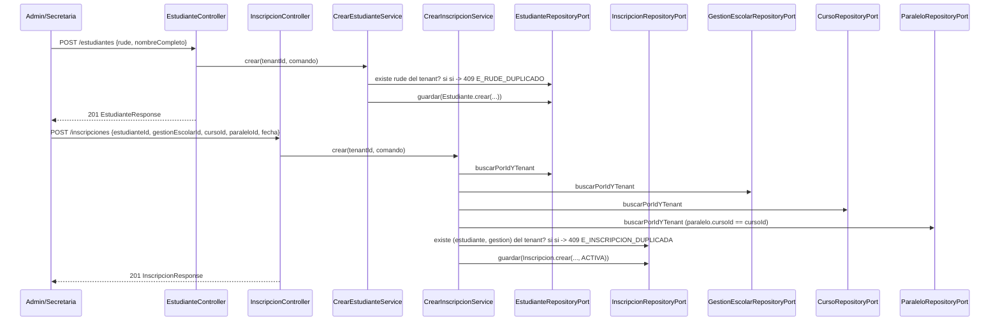
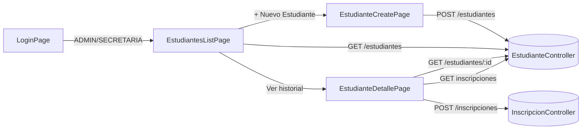

# Design Doc `DD-UC-013` — Académico: Estudiantes e Inscripciones (backend + UI)

> **Qué es**: decimotercer Design Doc de código y **cuarto feature de negocio real del módulo `academico`**, después de `GestionEscolar` (`DD-UC-008`/`009`), `Curso`/`Paralelo` (`DD-UC-010`/`011`) y `Materia` (`DD-UC-012`). Implementa `FSD-UC-020` (Gestión de Estudiantes e Inscripciones) como **un solo *vertical slice* fullstack**: backend hexagonal + consola Angular en el mismo Design Doc y el mismo `PR-IMPL-013`. Segundo fullstack de `academico`, mismo patrón que `DD-UC-012`.
>
> **Relación con otros documentos**: consume `GestionEscolar` (`DD-UC-008`), `Curso`/`Paralelo` (`DD-UC-010`), `TenantContextProvider`/RLS (`DD-UC-002`, `ADR-0001`) y el patrón de filtros/paginación (`shared.PageQuery`/`PageResult`/`web.PageResponse`, `DD-UC-007`). `Estudiante` e `Inscripcion` son Aggregates independientes (`BR-023`). No depende de `Materia` ni de `FSD-UC-019`. Alimenta el DTP (§A.1, §A.3) vía `@dtp-sync`. Prerequisito de datos de `FSD-UC-001` (registro de calificaciones).

## 1. Objetivo y contexto

- **Qué resuelve este feature**: permite que la `SECRETARIA` (y el `ADMIN`) de un tenant registre un `Estudiante` **sin** atarlo a un curso, y después cree una `Inscripcion` a una `GestionEscolar` + `Curso` + `Paralelo` ya existentes. El historial académico se reconstruye listando todas las inscripciones del estudiante. Es el eslabón `GestionEscolar`/`Curso` → `Estudiante`/`Inscripcion` → (calificaciones) del modelo genérico (`ADR-0009`).
- **Caso(s) de uso del FSD que implementa**: `FSD-UC-020` (`docs/product/FSD.md` §4.6.10).
- **Alcance**:
  - **Dentro**:
    - Aggregate `Estudiante` (dominio puro) — identidad del tenant, independiente de la matrícula. Factory `crear()`. Campos: `id`, `tenantId`, `rude`, `nombreCompleto`, `estado` (`ACTIVO`/`INACTIVO`), `datosPersonales` opcional.
    - Aggregate `Inscripcion` — vínculo a `{estudianteId, gestionEscolarId, cursoId, paraleloId, fechaInscripcion}`; nace siempre con `estado = ACTIVA`.
    - `POST/GET /api/v1/estudiantes` (alta, listado scoped al tenant, filtro `q`/`estado` + paginación — reutiliza `DD-UC-007`).
    - `GET /api/v1/estudiantes/{id}` (detalle; evita el *workaround* de query param de `DD-UC-011`).
    - `GET /api/v1/estudiantes/{id}/inscripciones` (historial, lista simple sin paginar — Gherkin de `FSD-UC-020` / `PRD-US-028`).
    - `POST /api/v1/inscripciones` `{estudianteId, gestionEscolarId, cursoId, paraleloId, fechaInscripcion}` — A1 `409 E_INSCRIPCION_DUPLICADA`.
    - Flyway `V8__academico_estudiante_inscripcion.sql`: tablas `estudiante` e `inscripcion`, ambas con `tenant_id` + RLS `FORCE` (`ADR-0001`). Unique `(tenant_id, rude)` y `(tenant_id, estudiante_id, gestion_escolar_id)`.
    - Delta RBAC de lectura: `GET /gestiones-escolares` también `SECRETARIA` (el formulario de inscripción necesita el catálogo; `POST`/`PATCH` de Gestión Escolar siguen `ADMIN`). Los GET de Cursos/Paralelos ya admiten `SECRETARIA` (`DD-UC-012`).
    - Consola Angular: lista, alta y detalle con inscripciones inline; rutas `/academico/estudiantes[, /nuevo, /:id]`; `roleGuard` `data.roles: ['ADMIN','SECRETARIA']` (ya aditivo desde `DD-UC-012`); enlace "Estudiantes" en el shell.
  - **Fuera** (Design Docs de seguimiento, todavía sin crear):
    - `PATCH`/`DELETE` de `Estudiante` o `Inscripcion` (baja `RETIRADA`/`TRANSFERIDA`, cambio `INACTIVO`) — el FSD §4.6.10 declara los dos `POST` y A1; no se inventa edición/borrado (mismo recorte que `DD-UC-010`/`012`). El diccionario §6.3.2 lista esos estados para un slice futuro.
    - Unicidad de `nombreCompleto`. Validación de dígito verificador / formato ministerial del RUDE. Editor JSON de `datosPersonales` en la UI (el API los acepta; el formulario de alta no los pide).
    - `FSD-UC-019` (`GET /profesores/{id}/asignaciones`), `FSD-UC-001` (calificaciones), `FSD-UC-006` (nóminas Bolivia).
    - `E_ASESOR_SIN_CURSO` (`FSD-UC-021` A1) y `audit_log` formal (`ADR-0009` §3 punto 5).
    - Puntos 1–5 de `ADR-0009` §3 (reconciliación `GestionAcademica` vs `GestionEscolar`, periodos, redondeo, pesos, gobernanza) — este feature **no** los resuelve. Incluir `rude` en `Estudiante` **no** es esa reconciliación: aplica `BR-004`/`RB-01` ya vigentes sobre la entidad genérica para no crear estudiantes inexportables al SIE.

## 2. Diseño (el "cómo") `[humano+máquina]`

- **Enfoque fullstack en un solo DD**: mismo criterio que `DD-UC-012`. Incluye `GET /estudiantes/{id}` desde el día 1.
- **Modelo: dos Aggregates independientes, no `List<Inscripcion>` embebida en `Estudiante`**. `BR-023` y el FSD §4.6.10 separan identidad de matrícula. Una inscripción referencia `GestionEscolar`/`Curso`/`Paralelo` por id (mismo criterio que separó `Curso` de `Paralelo` en `DD-UC-010`).
- **`rude` obligatorio, único por tenant**. El POST de `FSD-UC-020` omite `rude` (diccionario genérico §6.3.2); el diccionario Bolivia §6.2 lo declara `VARCHAR(20)` NOT NULL único por tenant. Se elige **incluirlo ahora** porque `AGENTS.md` §6 / `BR-004` / `RB-01` prohíben identificar estudiantes por nombre. Sin RUDE, `FSD-UC-001`/`004` no tienen clave de exportación. No se loguea el valor (`AGENTS.md` §7). Conflicto de unicidad → `409 E_RUDE_DUPLICADO` (mensaje **sin** interpolar el código).
- **`estado` de Estudiante**: enum de dominio `EstadoEstudiante { ACTIVO, INACTIVO }` (diccionario genérico §6.3.2). `crear()` usa el valor del comando; si viene nulo → `ACTIVO`. No se implementan `RETIRADO`/`TRANSFERIDO` del perfil Bolivia (§6.2) en este slice.
- **`datosPersonales`**: JSONB opcional en persistencia (diccionario §6.3.2). En dominio: `Map<String, String>` inmutable (sin Jackson en `domain/`). El request REST los acepta; la UI de alta **no** muestra un editor JSON (queda vacío/`null`).
- **`Inscripcion` nace `ACTIVA`**: el body de `POST /inscripciones` **no** trae `estado` (FSD paso 3: "el sistema crea con `estado = ACTIVA`"). Enum de dominio `EstadoInscripcion { ACTIVA, RETIRADA, TRANSFERIDA }` existe para no pintar un string, pero este slice solo persiste `ACTIVA`.
- **A1 `E_INSCRIPCION_DUPLICADA` (409)**: unicidad `(tenantId, estudianteId, gestionEscolarId)` — "el mismo estudiante en la misma Gestión Escolar", literal del FSD. No se permite una segunda inscripción del mismo estudiante en la misma gestión aunque cambie de curso/paralelo (eso sería transferencia, slice futuro).
- **Validación de padres** (antes de persistir la inscripción):
  - `Estudiante` existe y es del tenant → si no, `404 E_ESTUDIANTE_NO_ENCONTRADO`.
  - `GestionEscolar` existe y es del tenant → reutiliza `404 E_GESTION_ESCOLAR_NO_ENCONTRADA` (`DD-UC-008`).
  - `Curso` y `Paralelo` existen, son del tenant, y `Paralelo.cursoId` coincide con el `cursoId` del body → `404 E_CURSO_NO_ENCONTRADO` / `404 E_PARALELO_NO_ENCONTRADO` (reutiliza `DD-UC-010`/`012`).
  - Cross-tenant → **404, no 403** (mismo criterio `DD-UC-005`/`008`/`010`/`012`).
- **Aislamiento de tenant**: RLS `FORCE` + `tenant_id NOT NULL` en ambas tablas (sin excepción `OR tenant_id IS NULL`). `inscripcion.tenant_id` es redundante (derivable por join), igual que `paralelo.tenant_id` en `DD-UC-010`. `tenantId` **nunca** del body/query: siempre `TenantContextProvider`.
- **RBAC**: actor principal del FSD = Secretaria. Se añade `ADMIN` (dueño del tenant), mismo criterio que Materias.
  - `EstudianteController` / `InscripcionController`: `@PreAuthorize("hasAnyRole('ADMIN','SECRETARIA')")`.
  - Delta en `GestionEscolarController`: solo el **GET** de listado pasa a `hasAnyRole('ADMIN','SECRETARIA')`; `POST` y `PATCH .../estado` siguen `ADMIN`.
  - UI: rutas `/academico/estudiantes/**` con `data.roles: ['ADMIN','SECRETARIA']`. Shell: "Estudiantes" si `hasRole('ADMIN') || hasRole('SECRETARIA')`.
- **Filtros de listado**: `EstudianteFiltro(q, estado)` + `EstudianteSpecifications`. `q` busca `nombreCompleto` (contains, case-insensitive) **o** `rude` exacto (case-insensitive). **No** se loguea `q` ni `rude`.
- **Listado de inscripciones sin paginar**: cardinalidad acotada por estudiante y por gestiones escolares del tenant (mismo criterio que `GET /cursos/{id}/paralelos`).
- **DTOs REST** directamente en `academico.infrastructure.adapter.in.rest` (sin subpaquete `dto/`). Dominio con Lombok solo `@Getter`.
- **Componentes tocados**:

```
backend/src/main/java/com/edusync/academico/
├── domain/
│   ├── Estudiante.java / EstudianteId.java
│   ├── EstadoEstudiante.java                        (ACTIVO, INACTIVO)
│   ├── Inscripcion.java / InscripcionId.java
│   ├── EstadoInscripcion.java                       (ACTIVA, RETIRADA, TRANSFERIDA)
│   ├── EstudianteNoEncontradoException.java         (404 E_ESTUDIANTE_NO_ENCONTRADO)
│   ├── RudeDuplicadoException.java                  (409 E_RUDE_DUPLICADO; mensaje sin el valor)
│   └── InscripcionDuplicadaException.java           (409 E_INSCRIPCION_DUPLICADA)
├── application/
│   ├── port/in/   (CrearEstudiante, ListarEstudiantes, ObtenerEstudiante,
│   │               ListarInscripcionesEstudiante, CrearInscripcion, EstudianteFiltro)
│   ├── port/out/  (EstudianteRepositoryPort, InscripcionRepositoryPort)
│   └── service/   (un servicio por use case; CrearInscripcion valida padres + A1)
└── infrastructure/
    ├── adapter/in/rest/EstudianteController.java + InscripcionController.java + DTOs
    └── adapter/out/persistence/  (JpaEntity/Repository/Adapter + EstudianteSpecifications)

backend/src/main/resources/db/migration/
└── V8__academico_estudiante_inscripcion.sql

frontend/src/app/
├── app.routes.ts                                    (+ /academico/estudiantes[, /nuevo, /:id])
├── shared/layout/shell.component.ts                 (+ enlace "Estudiantes")
└── features/academico/
    ├── estudiante.model.ts
    ├── estudiantes-list.page.ts
    ├── estudiante-create.page.ts
    └── estudiante-detalle.page.ts                   (historial + alta inline de Inscripcion)
```

- **Contratos** (todos bajo `/api/v1`, `ADMIN` + `SECRETARIA`):

  | Método | Ruta | Respuesta feliz | Errores |
  |--------|------|-----------------|---------|
  | `POST` | `/estudiantes` `{rude, nombreCompleto, estado?, datosPersonales?}` | `201 EstudianteResponse` | `400` validación; **`409 E_RUDE_DUPLICADO`** |
  | `GET` | `/estudiantes?q=&estado=&page=&size=` | `200 PageResponse<EstudianteResponse>` | — |
  | `GET` | `/estudiantes/{id}` | `200 EstudianteResponse` | `404 E_ESTUDIANTE_NO_ENCONTRADO` |
  | `GET` | `/estudiantes/{id}/inscripciones` | `200 List<InscripcionResponse>` | `404` estudiante |
  | `POST` | `/inscripciones` `{estudianteId, gestionEscolarId, cursoId, paraleloId, fechaInscripcion}` | `201 InscripcionResponse` | `404` estudiante/gestión/curso/paralelo; **`409 E_INSCRIPCION_DUPLICADA`** |

  `EstudianteResponse`: `{id, rude, nombreCompleto, estado, datosPersonales}`. `InscripcionResponse`: `{id, estudianteId, gestionEscolarId, cursoId, paraleloId, fechaInscripcion, estado}`.

- **UI**:
  - Lista: caja `q` + `<select>` estado (`ACTIVO`/`INACTIVO`) + paginación. Cada fila enlaza al detalle.
  - Alta: `rude`, `nombreCompleto`, estado (default `ACTIVO`). Sin editor de `datosPersonales`. `POST /estudiantes` → navega al detalle.
  - Detalle (`/academico/estudiantes/:id`): encabezado con `GET /estudiantes/{id}` (nombre + RUDE); bloque inscripciones (`GET` + form inline: `<select>` de gestiones, cursos y, al elegir curso, paralelos; `fechaInscripcion` tipo date). El form llama `POST /inscripciones` con el `estudianteId` de la ruta.
  - Mapeo de errores: `409 E_RUDE_DUPLICADO` / `409 E_INSCRIPCION_DUPLICADA` y `404` visibles, no silenciados.

- **Diagrama**:





## 3. Alternativas consideradas

| Alternativa | Pros | Contras | ¿Elegida? |
|-------------|------|---------|-----------|
| A. Un solo DD fullstack (backend + UI) | Cierra `FSD-UC-020` en un ciclo; `GET /{id}` desde el día 1 | Prompt más grande que un backend-only | **sí** (mismo patrón que `DD-UC-012`; el usuario pidió continuar implementaciones con este flujo) |
| B. Backend-primero + UI de seguimiento | Consistente con `008`→`009` / `010`→`011` | Alarga el ciclo; `DD-UC-012` ya abandonó ese recorte para `academico` | no |
| A. `Estudiante` + `Inscripcion` como Aggregates independientes | Fiel a `BR-023`; historial consultable sin embeber colecciones; FKs baratas para `FSD-UC-001` | Dos repositorios | **sí** |
| B. `Inscripcion` embebida en `Estudiante` | Un solo agregado | Cargar todas las gestiones para validar un curso; contradice el POST top-level `/inscripciones` | no |
| A. `rude` obligatorio y único por tenant ahora | Cumple `BR-004`/`RB-01`; desbloquea exportación SIE futura; el diccionario Bolivia §6.2 ya lo exige | El POST literal de `FSD-UC-020` no lo nombra; el diccionario genérico §6.3.2 lo omite | **sí** (invariante ya aceptada; no es el punto 1 de `ADR-0009` §3) |
| B. Omitir `rude` hasta reconciliar modelos | Literal al POST genérico | Estudiantes inexportables; habría que migrar la tabla después | no |
| C. `rude` opcional/nullable | Compromiso documental | Identidad nula incompatible con `RB-01` | no |
| A. Unicidad de inscripción = `(estudiante, gestionEscolar)` | Literal A1 del FSD | Un estudiante no puede estar en dos paralelos de la misma gestión (la transferencia es slice futuro) | **sí** |
| B. Unicidad = `(estudiante, gestion, curso, paralelo)` | Permite dos cursos el mismo año | Contradice el texto de A1 | no |
| A. Alta + listado + historial, sin `PATCH`/`DELETE` | Fiel al flujo del FSD; mismo recorte que Curso/Materia | BR-023/PRD hablan de "CRUD"; baja/`RETIRADA` queda para un DD futuro | **sí** |
| B. CRUD completo (estado RETIRADO/TRANSFERIDA) en este slice | Cierra la palabra "CRUD" | Implicaciones de nómina/historial no diseñadas (`FSD-UC-006`, `BR-012`) | no |
| A. RBAC `ADMIN` + `SECRETARIA` (API + GET Gestiones + UI) | Secretaria es el actor del FSD; Admin no queda bloqueado | Delta menor en `GestionEscolarController` (GET) | **sí** |
| B. Solo `SECRETARIA` | Más estrecho al actor principal | El Admin no podría operar el padrón de su tenant | no |
| A. `POST /inscripciones` top-level (FSD) + `GET` anidado en estudiante | Fiel al FSD; la UI de detalle tiene un GET natural | Dos controladores | **sí** |
| B. Anidar también el POST (`POST /estudiantes/{id}/inscripciones`) | Simétrico con Materias | Inventa una ruta que el FSD no declara | no |

> Ninguna decisión amerita ADR propio: `rude` aplica una invariante ya aceptada (`BR-004`), no reconcilia `GestionAcademica` vs `GestionEscolar`; dos Aggregates son revisables sin romper el contrato de API; el fullstack en un DD es organización de trabajo.

## 4. Impacto en las specs vivas `[máquina]`

| Artefacto vivo | Cambio | ¿Delta vs DTI vFinal? |
|----------------|--------|-----------------------|
| `docs/product/FSD.md` (`FSD-UC-020`) | Tras ejecutar (`v2.7`→`v2.8`): documentados `rude` en el POST, los `GET` de listado/detalle/historial, A2/A3 404 y `E_RUDE_DUPLICADO` | no |
| `docs/product/PRD.md` (`PRD-US-027`/`028`) | Ninguno: el Gherkin §5.10.3/5.10.4 ya cubre alta sin inscripción e inscripción con historial | no |
| `docs/product/DTP.md` | §A.1 fila de ejecución; §A.3 `FSD-UC-020` **completo** (backend + UI); v1.26→v1.27 | no |
| `docs/PROMPT_MAPPING.md` | Nueva fila `PR-IMPL-013` (área `IMPL`, **Aprobado (prompt)**) | no |
| Baseline `docs/baseline/**` | **No se toca** | — |

> **Recordatorio (regla de oro)**: el baseline congelado de M4 (`docs/baseline/`) no se toca. Los cambios viven en `docs/product/`.

## 5. Prompts usados `[máquina]`

| Prompt | Tarea | Artefacto generado |
|--------|-------|--------------------|
| `PR-IMPL-013` | Código backend + UI + tests + migración `V8` de Estudiantes e Inscripciones | `backend/src/main/java/com/edusync/academico/**` (delta), `V8__academico_estudiante_inscripcion.sql`, `frontend/src/app/features/academico/estudiante*.ts`, delta `app.routes.ts`/`shell.component.ts`, delta GET `GestionEscolarController` |

> El prompt sigue `plantillas/PROMPT_TEMPLATE.md`, vive en `docs/prompts/impl/PR-IMPL-013.md` y se referencia desde `docs/PROMPT_MAPPING.md`.

## 6. Plan de pruebas y evals

- **Unit (dominio)**: `Estudiante.crear()` — `rude`/`nombreCompleto` no nulos; estado default `ACTIVO`; `Inscripcion.crear()` — ids/fecha no nulos, estado `ACTIVA`.
- **Unit (servicios, Mockito)**: alta de estudiante; rude duplicado → 409; inscripción con padre inválido → 404; segunda inscripción misma gestión → 409 `E_INSCRIPCION_DUPLICADA`; aislamiento por tenant.
- **Integration** (Testcontainers PostgreSQL 15, patrón `MateriaIntegrationTest`): `POST/GET /estudiantes` con `q`/estado/paginación; `GET /estudiantes/{id}`; `GET` historial; `POST /inscripciones` caso feliz y A1 409; cross-tenant → 404; `ModularityTests` 7/7 (sin arista nueva de módulos: todo vive en `academico`).
- **Frontend**: `ng build` verde. `SECRETARIA` entra a `/academico/estudiantes`; `PROFESOR` redirige a `/home`.
- **E2E / Gherkin** (`PRD-US-027`/`028` + FSD-UC-020): Secretaria registra "Ana Pérez" con RUDE sin inscripción; la inscribe en gestión "2026" curso/paralelo; crea una segunda inscripción en gestión "2027"; ambas permanecen consultables en el detalle.
- **Evals de IA**: no aplica.
- **PII**: ningún test ni log de aplicación (INFO+) imprime `rude`, `nombreCompleto` ni `datosPersonales`.

## 7. Definition of Done (checklist)

- [x] `fsd_uc` declarado y enlazado (`FSD-UC-020`).
- [x] Diseño (§2) y alternativas (§3) documentados.
- [x] Sin ADR nuevo (decisiones de bajo riesgo — ver nota al final de §3).
- [x] §4 Impacto en specs vivas registrado (sin tocar el baseline).
- [x] Prompt `PR-IMPL-013` versionado en `docs/prompts/impl/` y en `PROMPT_MAPPING.md` — **ejecutado**.
- [x] Tests/evals definidos (§6) y pasando — `mvn test` **173/173** (incluye `ModularityTests` 7/7); `ng build` verde (3 lazy chunks: `estudiantes-list-page`, `estudiante-create-page`, `estudiante-detalle-page`).
- [x] DTP actualizado vía `dtp-sync` tras la ejecución de código (`docs/product/DTP.md` v1.27).
- [ ] PR declara prompts usados y archivos generados vs editados a mano — pendiente del commit de código.

## 8. Versionado

| Versión | Fecha | Autor | Cambio |
|---------|-------|-------|--------|
| v1.0 | 21/08/2026 | Rodrigo Aspeti | Creación del decimotercer Design Doc (`DD-UC-013`): *vertical slice* fullstack de `academico` (backend + UI en el mismo DD) para `FSD-UC-020`. Dos Aggregates independientes (`Estudiante`, `Inscripcion`); `rude` obligatorio único por tenant (`BR-004`); A1 `409 E_INSCRIPCION_DUPLICADA`; `GET /estudiantes/{id}` desde el día 1; RBAC `ADMIN`+`SECRETARIA`; delta GET de Gestiones Escolares para `SECRETARIA`; consola Angular lista/alta/detalle con inscripciones inline. Estado `aprobado`; ejecución de `PR-IMPL-013` pendiente. |
| v1.1 | 21/08/2026 | Rodrigo Aspeti | **Ejecución de `PR-IMPL-013`**: DoD 100% (tests + `dtp-sync`). Estado `ejecutado`. `FSD-UC-020` completo backend+UI. `mvn test` 173/173; `ng build` verde. |
