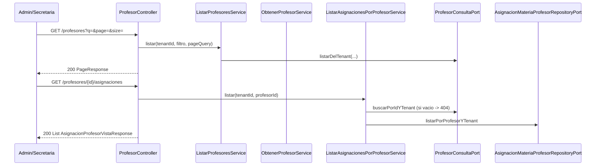
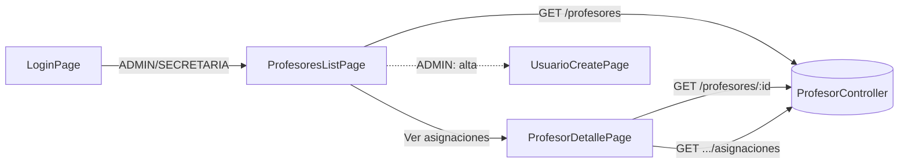

# Design Doc `DD-UC-014` — Académico: Profesores (backend + UI)

> **Qué es**: decimocuarto Design Doc de código y **quinto feature de negocio real del módulo `academico`**, después de `GestionEscolar` (`DD-UC-008`/`009`), `Curso`/`Paralelo` (`DD-UC-010`/`011`), `Materia` (`DD-UC-012`) y `Estudiante`/`Inscripcion` (`DD-UC-013`). Implementa `FSD-UC-019` (Gestión de Profesores) como **un solo *vertical slice* fullstack**: backend hexagonal + consola Angular en el mismo Design Doc y el mismo `PR-IMPL-014`. Tercer fullstack de `academico`.
>
> **Relación con otros documentos**: el **alta** del `Profesor` ya está cerrada (`POST /api/v1/usuarios` con `rol = PROFESOR`, `FSD-UC-021` / `DD-UC-005`/`006`). Las **asignaciones** ya se originan en `FSD-UC-018` (`POST /materias/{id}/asignaciones-profesor`, `DD-UC-012`). Este DD cierra la **consulta inversa** que el FSD declara como paso 2: `GET /profesores/{id}/asignaciones`. Reutiliza el Open Host Service `academico.ProfesorConsultaPort` (`DD-UC-012`) y el patrón de filtros/paginación (`DD-UC-007`). Alimenta el DTP (§A.1, §A.3) vía `@dtp-sync`.

## 1. Objetivo y contexto

- **Qué resuelve este feature**: permite que el `ADMIN` y la `SECRETARIA` de un tenant listen a los usuarios con rol `PROFESOR` y consulten, para cada uno, las `Materia`/`Curso`/`Paralelo` asignadas (originadas en `FSD-UC-018`). No crea una entidad `Profesor` nueva: es un perfil de `Usuario` (`FSD-UC-019` paso 1 ya cubierto). Es el eslabón de lectura `Usuario(PROFESOR) → AsignacionMateriaProfesor` que `FSD-UC-015` (evaluaciones) y la consola del docente necesitarán más adelante.
- **Caso(s) de uso del FSD que implementa**: `FSD-UC-019` (`docs/product/FSD.md` §4.6.9).
- **Alcance**:
  - **Dentro**:
    - Extensión de `ProfesorConsultaPort` (sigue en la raíz de `academico`, implementado en `identidad`): `buscarPorIdYTenant` (incluye inactivos con rol `PROFESOR`) y `listarDelTenant` paginado/filtrable. `esProfesorActivoDelTenant` y `listarActivosDelTenant` **no se rompen** (siguen alimentando el `<select>` de Materias).
    - `GET /api/v1/profesores` (lista scoped al tenant, filtro `q`/`activo` + paginación — reutiliza `DD-UC-007`). Inferido por la misma razón práctica que `GET /estudiantes` en `DD-UC-013`: el FSD no declara el listado, pero la UI y `SECRETARIA` no pueden usar `GET /usuarios` (`UsuarioController` es `ADMIN`-only).
    - `GET /api/v1/profesores/{id}` (detalle `{id, nombreCompleto, activo}`).
    - `GET /api/v1/profesores/{id}/asignaciones` — el contrato canónico del FSD. Lista simple, sin paginar. Respuesta enriquecida con nombres de Materia/Curso/Paralelo (evita N+1 desde la UI).
    - Puerto `AsignacionMateriaProfesorRepositoryPort.listarPorProfesorYTenant` (hoy solo existe `listarPorMateriaYTenant`).
    - Consola Angular: lista + detalle de solo lectura; rutas `/academico/profesores[, /:id]`; `roleGuard` `data.roles: ['ADMIN','SECRETARIA']`; enlace "Profesores" en el shell. El `ADMIN` ve un enlace a `/usuarios/nuevo` para el alta (no hay `POST /profesores`).
  - **Fuera** (Design Docs de seguimiento, todavía sin crear):
    - Tabla o Aggregate `Profesor` propio — contradice el FSD ("perfil dentro de `Usuario`").
    - `POST /profesores` o duplicar el alta de `FSD-UC-021`.
    - Alta/edición/borrado de asignaciones desde esta consola — el origen de escritura sigue siendo `FSD-UC-018`.
    - `PATCH`/`DELETE` de `Usuario` (ya existe en `FSD-UC-021` para `ADMIN`; no se reexpone aquí).
    - `FSD-UC-015` (Evaluaciones) — `BR-022` se **consulta** aquí (queda visible si un profesor tiene materia asignada), no se enforcea hasta que existan evaluaciones.
    - `E_ASESOR_SIN_CURSO` (`FSD-UC-021` A1) y `audit_log` formal (`ADR-0009` §3 punto 5).
    - Puntos 1–5 de `ADR-0009` §3 — este feature no los toca. No hay migración Flyway (no hay tabla nueva).

## 2. Diseño (el "cómo") `[humano+máquina]`

- **Enfoque fullstack en un solo DD**: mismo criterio que `DD-UC-012`/`013`. Incluye `GET /profesores/{id}` desde el día 1 (evita el query param de `DD-UC-011`).
- **`Profesor` no es tabla nueva**. `profesorId` sigue siendo `Usuario.id` de un usuario del tenant con rol `PROFESOR` (`ADR-0010`). Toda lectura de identidad pasa por `ProfesorConsultaPort`; `academico` **no** importa `identidad`.
- **Extensión del Open Host Service** (sin arista nueva de módulos: `identidad → academico` ya existe desde `DD-UC-012`):
  - `Optional<ProfesorResumen> buscarPorIdYTenant(UUID usuarioId, UUID tenantId)` — `true` si el usuario existe, pertenece al tenant y **tiene** el rol `PROFESOR`, esté activo o no. Si no → vacío → `404 E_PROFESOR_NO_ENCONTRADO`. El criterio "404, no 403" de `DD-UC-005`/`008`/`010`/`012` aplica igual para otro tenant o para un usuario sin rol `PROFESOR`.
  - `PageResult<ProfesorResumen> listarDelTenant(UUID tenantId, String q, Boolean activo, PageQuery pageQuery)` — delega a `UsuarioRepositoryPort.listarPorTenant(tenantId, UsuarioFiltro(q, activo, Rol.PROFESOR), pageQuery)` en `ProfesorConsultaPortImpl`. Reusa paginación/filtros ya existentes; **no** elimina `listarPorTenant(UUID)` ni `listarActivosDelTenant`. **Refinamiento de ejecución (Modulith):** el puerto público toma `q`/`activo` primitivos, no `ProfesorFiltro` de `application.port.in`, para que `identidad` no importe un paquete interno de `academico`. El filtro REST sigue en `application.port.in` y `ListarProfesoresService` traduce los campos.
  - `ProfesorResumen` gana el campo `activo` (`record {id, nombreCompleto, activo}`). El DTO REST de `GET /materias/profesores-disponibles` **sigue** exponiendo solo `{id, nombreCompleto}` (el `<select>` de Materias no necesita `activo`; esos usuarios ya están filtrados a activos).
- **Profesor inactivo y asignaciones históricas**: `GET /profesores/{id}/asignaciones` **sí** responde 200 si el usuario tiene rol `PROFESOR` aunque `activo = false` (el historial de carga docente no desaparece al desactivar la cuenta). La **escritura** de una asignación nueva sigue exigiendo `esProfesorActivoDelTenant` (`DD-UC-012`, sin cambio).
- **Listado de asignaciones sin paginar**: cardinalidad acotada por profesor (mismo criterio que `GET /cursos/{id}/paralelos` y `GET /estudiantes/{id}/inscripciones`).
- **Respuesta enriquecida**: `AsignacionProfesorVistaResponse {id, materiaId, materiaNombre, cursoId, cursoNombre, paraleloId, paraleloNombre}`. El servicio de listado carga las asignaciones por `profesorId`+`tenantId` y resuelve nombres vía `MateriaRepositoryPort` / `CursoRepositoryPort` / `ParaleloRepositoryPort` (todo dentro de `academico`). Si una referencia huérfana apareciera, se omite el nombre (`null`) — no hay `DELETE` de Materia/Curso en slices previos, así que el caso es defensivo.
- **Sin migración Flyway**: las filas viven en `asignacion_materia_profesor` (`V7`) y `usuario` (`V2`). RLS `FORCE` ya cubre ambas.
- **RBAC**: actores del FSD = Admin / Secretaria.
  - `ProfesorController`: `@PreAuthorize("hasAnyRole('ADMIN','SECRETARIA')")` en los tres GET.
  - No hay delta en `UsuarioController` (el alta sigue `ADMIN`-only).
  - UI: rutas `/academico/profesores/**` con `data.roles: ['ADMIN','SECRETARIA']`. Shell: "Profesores" si `hasRole('ADMIN') || hasRole('SECRETARIA')`. **No** reescribir `role.guard.ts`.
- **Filtros de listado**: `ProfesorFiltro(q, activo)` en `academico.application.port.in`. `q` se traduce al `q` de `UsuarioFiltro` (nombreCompleto **o** email, case-insensitive — no se reimplementa Specification en `academico`). **No** se loguea `q` ni `nombreCompleto` (`AGENTS.md` §7).
- **DTOs REST** directamente en `academico.infrastructure.adapter.in.rest` (sin subpaquete `dto/`).
- **Componentes tocados**:

```
backend/src/main/java/com/edusync/academico/
├── ProfesorConsultaPort.java                        (delta: buscarPorIdYTenant + listarDelTenant)
├── ProfesorResumen.java                             (delta: +activo)
├── application/
│   ├── port/in/   (ListarProfesoresUseCase, ObtenerProfesorUseCase,
│   │               ListarAsignacionesPorProfesorUseCase, ProfesorFiltro)
│   ├── port/out/  (AsignacionMateriaProfesorRepositoryPort + listarPorProfesorYTenant)
│   └── service/   (un servicio por use case)
└── infrastructure/
    ├── adapter/in/rest/ProfesorController.java + ProfesorResponse
    │                    + AsignacionProfesorVistaResponse
    └── adapter/out/persistence/AsignacionMateriaProfesorJpaRepository
                               (+ findByProfesorIdAndTenantId)

backend/src/main/java/com/edusync/identidad/infrastructure/adapter/out/port/
└── ProfesorConsultaPortImpl.java                    (delta: dos métodos nuevos)

frontend/src/app/
├── app.routes.ts                                    (+ /academico/profesores[, /:id])
├── shared/layout/shell.component.ts                 (+ enlace "Profesores")
└── features/academico/
    ├── profesor.model.ts
    ├── profesores-list.page.ts
    └── profesor-detalle.page.ts                     (asignaciones de solo lectura)
```

- **Contratos** (todos bajo `/api/v1`, `ADMIN` + `SECRETARIA`):

  | Método | Ruta | Respuesta feliz | Errores |
  |--------|------|-----------------|---------|
  | `GET` | `/profesores?q=&activo=&page=&size=` | `200 PageResponse<ProfesorResponse>` | — |
  | `GET` | `/profesores/{id}` | `200 ProfesorResponse` | `404 E_PROFESOR_NO_ENCONTRADO` |
  | `GET` | `/profesores/{id}/asignaciones` | `200 List<AsignacionProfesorVistaResponse>` | `404 E_PROFESOR_NO_ENCONTRADO` |

  El alta permanece en `POST /api/v1/usuarios` (`FSD-UC-021`, `ADMIN`). `GET /materias/profesores-disponibles` no se mueve ni se depreca.

- **UI**:
  - Lista: caja `q` + `<select>` `activo` (todos / activos / inactivos) + paginación. Cada fila enlaza al detalle.
  - Sin página `/nuevo`. El `ADMIN` ve un párrafo con enlace a `/usuarios/nuevo` ("El alta de un profesor se hace creando un usuario con rol PROFESOR"). `SECRETARIA` no ve ese enlace (`hasRole('ADMIN')`).
  - Detalle (`/academico/profesores/:id`): encabezado con `GET /profesores/{id}` (nombre + badge activo/inactivo); tabla de asignaciones (`GET .../asignaciones`) de **solo lectura** (materia, curso, paralelo). Sin formulario inline de alta.
  - `404` visible, no silenciado.

- **Diagrama**:





## 3. Alternativas consideradas

| Alternativa | Pros | Contras | ¿Elegida? |
|-------------|------|---------|-----------|
| A. Un solo DD fullstack (backend + UI) | Cierra `FSD-UC-019` en un ciclo; incluye `GET /{id}` desde el día 1 | Prompt más chico que `013` (solo lectura + extensión de puerto) | **sí** (mismo patrón `012`/`013`) |
| B. Backend-primero + UI de seguimiento | Consistente con `008`→`009` | El usuario pidió fullstack en los slices recientes de `academico` | no |
| A. Sin entidad `Profesor`; perfil de `Usuario` vía `ProfesorConsultaPort` | Fiel al FSD paso 1; cero tabla nueva; `ModularityTests` sin ciclo | La lista vive en `academico` aunque los datos estén en `identidad` | **sí** |
| B. Tabla `profesor` 1:1 con `usuario` | CRUD "de profesores" más literal de `PRD-REQ-029` | Duplica identidad; contradice el FSD ("perfil dentro de `Usuario`"); migración + sync | no |
| C. Reusar `GET /usuarios?rol=PROFESOR` desde la UI | Cero endpoint nuevo | `UsuarioController` es `ADMIN`-only; `SECRETARIA` no podría listar; mezcla consolas | no |
| A. `GET /profesores` + `GET /{id}` inferidos además del GET de asignaciones | UI usable; `SECRETARIA` cubierto; mismo criterio que `GET /estudiantes` | El FSD solo declara el GET de asignaciones | **sí** |
| B. Solo `GET /profesores/{id}/asignaciones` | Literal al FSD | La UI no tiene listado ni título; `SECRETARIA` no tiene catálogo | no |
| A. Asignaciones de solo lectura en esta consola | Una sola fuente de escritura (`FSD-UC-018`); evita dos UIs que POST-ean lo mismo | El "CRUD" de `PRD-REQ-029` queda partido (alta en Usuarios, asignación en Materias, consulta aquí) | **sí** |
| B. POST de asignaciones también desde `/profesores/{id}` | Simetría con el detalle de Materias | Duplica `CrearAsignacionProfesorService` y A1 `E_MATERIA_SIN_CURSO` en otra pantalla; el FSD no lo pide | no |
| A. Inactivo: 200 en GET asignaciones | El historial docente no desaparece al desactivar la cuenta | `esProfesorActivoDelTenant` ya no aplica a la lectura | **sí** |
| B. Inactivo: 404 | Simetría con el `<select>` de Materias | Pierde trazabilidad de carga ya asignada | no |
| A. Sin Flyway / sin ADR nuevo | No hay tabla ni decisión irreversible | — | **sí** |

> Las elecciones son de bajo riesgo (lectura sobre datos ya persistidos, extensión de un puerto existente). **No ameritan `ADR-0013`**. `ADR-0009` §3 puntos 1–5 siguen pendientes y **fuera** de este slice.

## 4. Impacto en las specs vivas `[máquina]`

> Qué se actualiza al **ejecutar** este feature. Lo consume `@dtp-sync`. En este turno (diseño) ya se registra el DD y el prompt; el FSD se anota en ejecución.

| Artefacto vivo | Cambio | ¿Delta vs DTI vFinal? |
|----------------|--------|-----------------------|
| `docs/product/FSD.md` (`FSD-UC-019`) | Documentados `GET /profesores` (`q`/`activo` + paginación), `GET /profesores/{id}`, A1 `404 E_PROFESOR_NO_ENCONTRADO`; alta sigue en `FSD-UC-021`; escrituras de asignación en `FSD-UC-018`. FSD v2.8→v2.9 | no |
| `docs/product/PRD.md` (`PRD-REQ-029`) | Sin cambio de requisito; el Gherkin de `PRD-US-026` ya está cubierto por `FSD-UC-018` (asignar). Este DD cubre la consulta inversa | no |
| `docs/product/DTP.md` | §A.1 fila de ejecución; §A.3 `FSD-UC-019` **completo** (backend + UI); v1.28→v1.29 | no |
| `docs/PROMPT_MAPPING.md` | Fila `PR-IMPL-014` (área `IMPL`, **Ejecutado**) | no |
| Baseline `docs/baseline/**` | **No se toca** | — |

> **Recordatorio (regla de oro)**: el baseline congelado de M4 (`docs/baseline/`) no se toca. Los cambios viven en `docs/product/`.

## 5. Prompts usados `[máquina]`

| Prompt | Tarea | Artefacto generado |
|--------|-------|--------------------|
| `PR-IMPL-014` | Código backend + UI + tests de Profesores (consulta inversa de asignaciones; sin migración) | `backend/src/main/java/com/edusync/academico/**` (delta), `identidad/.../ProfesorConsultaPortImpl.java` (delta), `frontend/src/app/features/academico/profesor*.ts`, delta `app.routes.ts`/`shell.component.ts` |

> El prompt sigue `plantillas/PROMPT_TEMPLATE.md`, vive en `docs/prompts/impl/PR-IMPL-014.md` y se referencia desde `docs/PROMPT_MAPPING.md`.

## 6. Plan de pruebas y evals

- **Unit (servicios, Mockito)**: listar profesores delega al puerto; `GET /{id}` vacío → 404; listar asignaciones verifica al profesor **antes** de consultar el repositorio; profesor inactivo con rol → 200; usuario sin rol `PROFESOR` → 404; aislamiento por tenant.
- **Integration** (Testcontainers PostgreSQL 15, patrón `MateriaIntegrationTest`): dado un `PROFESOR` y una `AsignacionMateriaProfesor` del tenant, `GET /profesores/{id}/asignaciones` devuelve la fila con nombres; `GET /profesores` filtra `q`/`activo` y pagina; cross-tenant → 404; `GET /materias/profesores-disponibles` **sigue** devolviendo `{id, nombreCompleto}` (no se rompe el contrato de `DD-UC-012`); `ModularityTests` 7/7 (sin arista nueva: la arista `identidad → academico` ya existe).
- **Frontend**: `ng build` verde. `SECRETARIA` entra a `/academico/profesores`; `PROFESOR` redirige a `/home`. El enlace de alta a Usuarios solo es visible para `ADMIN`.
- **E2E / Gherkin** (consulta inversa de `PRD-US-026` / `FSD-UC-019`):

```gherkin
Escenario: Secretaria consulta las asignaciones vigentes de un profesor
  Dado el profesor "Marcela López" con la materia "Matemáticas" asignada a "Primero de Primaria" paralelo "A"
  Cuando la Secretaria abre el detalle de ese profesor
  Entonces ve la asignación Materia/Curso/Paralelo
    Y no puede crear una asignación nueva desde esa pantalla
```

- **Evals de IA**: no aplica.
- **PII**: ningún test ni log de aplicación (INFO+) imprime `nombreCompleto` ni email.

## 7. Definition of Done (checklist)

- [x] `fsd_uc` declarado y enlazado (`FSD-UC-019`).
- [x] Diseño (§2) y alternativas (§3) documentados.
- [x] Sin ADR nuevo (decisiones de bajo riesgo — ver nota al final de §3).
- [x] §4 Impacto en specs vivas registrado (sin tocar el baseline).
- [x] Prompt `PR-IMPL-014` versionado en `docs/prompts/impl/` y en `PROMPT_MAPPING.md` — **ejecutado**.
- [x] Tests/evals definidos (§6) y pasando — `mvn test` **184/184** (incluye `ModularityTests` 7/7); `ng build` verde (2 lazy chunks: `profesores-list-page`, `profesor-detalle-page`).
- [x] DTP actualizado vía `dtp-sync` tras la ejecución de código (`docs/product/DTP.md` v1.29).
- [ ] PR declara prompts usados y archivos generados vs editados a mano — pendiente del commit de código.

## 8. Versionado

| Versión | Fecha | Autor | Cambio |
|---------|-------|-------|--------|
| v1.0 | 21/08/2026 | Rodrigo Aspeti | Creación del decimocuarto Design Doc (`DD-UC-014`): *vertical slice* fullstack de `academico` (backend + UI en el mismo DD) para `FSD-UC-019`. Sin entidad `Profesor` nueva; extensión de `ProfesorConsultaPort`; `GET /profesores` + `GET /{id}` + `GET /{id}/asignaciones`; consola Angular lista/detalle de solo lectura; alta permanece en `FSD-UC-021`; escrituras de asignación permanecen en `FSD-UC-018`. Estado `aprobado`; ejecución de `PR-IMPL-014` pendiente. |
| v1.1 | 21/08/2026 | Rodrigo Aspeti | **Ejecución de `PR-IMPL-014`**: DoD 100% (tests + `dtp-sync`). Estado `ejecutado`. `FSD-UC-019` completo backend+UI. `mvn test` 184/184; `ng build` verde. Refinamiento Modulith: `listarDelTenant` toma `q`/`activo` primitivos. |
