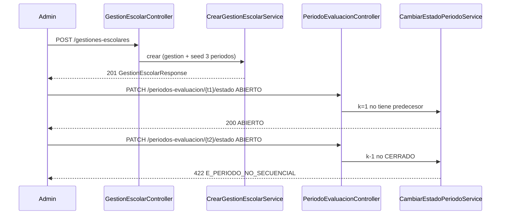
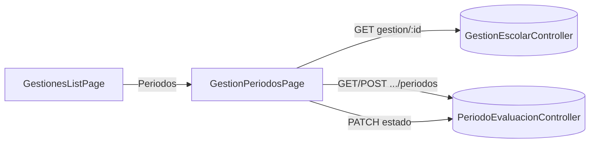

# Design Doc `DD-UC-015` — Académico: Periodos de Evaluación (backend + UI)

> **Qué es**: decimoquinto Design Doc de código y **sexto feature de negocio real del módulo `academico`**, después de `GestionEscolar`, `Curso`/`Paralelo`, `Materia`, `Estudiante`/`Inscripcion` y Profesores. Implementa `FSD-UC-013` (Configuración de Periodos de Evaluación) como **un solo *vertical slice* fullstack**: backend hexagonal + consola Angular. Aplica `ADR-0013` (apertura secuencial, seed de 3 periodos al crear la gestión). Cuarto fullstack de `academico`.
>
> **Relación con otros documentos**: consume `GestionEscolar` (`DD-UC-008`/`009`) y el patrón de detalle anidado de `Curso`/`Paralelo` (`DD-UC-010`/`011`). El seed de **secciones** (Ser/Saber/Hacer/AE) queda en `FSD-UC-014` (Design Doc de seguimiento). Alimenta el DTP vía `@dtp-sync` tras ejecutar `PR-IMPL-015`.

## 1. Objetivo y contexto

- **Qué resuelve este feature**: el `ADMIN` configura los N `PeriodoEvaluacion` de una `GestionEscolar` (nombre, fechas, orden), abre y cierra en secuencia (`PENDIENTE` → `ABIERTO` → `CERRADO`), y al crear una gestión nueva el sistema siembra 3 trimestres. Es el prerrequisito de `FSD-UC-015` (evaluaciones viven en un periodo) y de `FSD-UC-016` (promedio de gestión `/ N`).
- **Caso(s) de uso del FSD que implementa**: `FSD-UC-013` (`docs/product/FSD.md` §4.6.3). Delta de `FSD-UC-012`: `POST /gestiones-escolares` siembra los 3 periodos (`ADR-0013`; las 4 secciones siguen diferidas a `FSD-UC-014`).
- **Alcance**:
  - **Dentro**:
    - Aggregate `PeriodoEvaluacion` independiente (no embebido en `GestionEscolar`), con `orden` 1-based. Mismo criterio que `Paralelo` vs `Curso`: `Evaluacion` referenciará el periodo por id.
    - Seed al crear gestión: 3 periodos `Trimestre 1`..`3`, `PENDIENTE`, fechas contiguas que cubren `[fechaInicio, fechaFin]` de la gestión.
    - `GET /gestiones-escolares/{id}` (faltaba; evita el query param de `DD-UC-011`).
    - `POST/GET /gestiones-escolares/{id}/periodos` (alta; listado simple ordenado por `orden`, sin paginar).
    - `PATCH /periodos-evaluacion/{id}` (nombre/fechas) y `DELETE` — solo si **ningún** periodo de la gestión está `ABIERTO` (y `DELETE` deja N ≥ 1).
    - `PATCH /periodos-evaluacion/{id}/estado` `{estado: ABIERTO|CERRADO}` con apertura secuencial (`422 E_PERIODO_NO_SECUENCIAL`).
    - Overlap de fechas → `422 E_PERIODOS_SOLAPADOS`. `fechaFin` no posterior a `fechaInicio` → `422 E_FECHAS_INVALIDAS`.
    - Flyway `V9__academico_periodo_evaluacion.sql` (`tenant_id` + RLS `FORCE`).
    - Consola: ruta `/academico/gestiones-escolares/:id/periodos` (detalle + alta inline + abrir/cerrar); enlace desde la lista de gestiones. RBAC escrituras `ADMIN`; GET también `SECRETARIA`.
  - **Fuera**:
    - `FSD-UC-014` (plantilla de secciones y su seed de 4).
    - `FSD-UC-015`/`016` (evaluaciones, cálculo).
    - Reabrir un periodo `CERRADO`; dos periodos `ABIERTO` a la vez.
    - Exigir periodos para pasar la gestión a `ACTIVA` (`DD-UC-008` lo dejó diferido; el seed cubre altas nuevas, no se cambia la máquina de `GestionEscolar` en este slice).
    - `audit_log` (`ADR-0009` §3 punto 5).
    - Backfill de gestiones ya persistidas sin periodos (el Admin las configura a mano con POST).

## 2. Diseño (el "cómo") `[humano+máquina]`

- **Enfoque fullstack en un solo DD**: mismo criterio que `DD-UC-012`..`014`. Incluye `GET /gestiones-escolares/{id}` desde el día 1.
- **`PeriodoEvaluacion` es Aggregate independiente** (factory `crear()`, Lombok solo `@Getter`). Campos: `id`, `tenantId`, `gestionEscolarId`, `nombre`, `fechaInicio`, `fechaFin`, `orden`, `estado`. Transiciones de dominio: `PENDIENTE → ABIERTO`, `ABIERTO → CERRADO`. La **secuencialidad**, el **solape** y la **inmutabilidad de N** se validan en servicios de aplicación que cargan todos los periodos de la gestión (invariante de conjunto, no de un solo AR).
- **Seed** (`CrearGestionEscolarService`, misma TX que el alta):
  1. Persiste la `GestionEscolar`.
  2. Parte `[fechaInicio, fechaFin]` en 3 tramos contiguos (el último termina en `fechaFin`; `fechaFin` de *k* es el día anterior a `fechaInicio` de *k+1`). Nombres `Trimestre 1`..`3`, `orden` 1..3, `PENDIENTE`.
  3. Gestiones **ya existentes** no se migran.
- **Inmutabilidad de N y de datos** (`ADR-0013` §3.1.4): si **algún** periodo está `ABIERTO` (aunque otros sigan `PENDIENTE` o ya `CERRADO`):
  - `POST` / `DELETE` / `PATCH` nombre-fechas → `422 E_PERIODOS_INMUTABLES`.
  - `PATCH .../estado` **sí** (para seguir la secuencia).
  - Mientras **todos** están `PENDIENTE`, el Admin puede añadir, borrar (N ≥ 1), renombrar y cambiar fechas. Tras `DELETE`, se recompacta `orden` a 1..N.
- **Apertura secuencial** (`BR-017`): el periodo de `orden = k` pasa a `ABIERTO` solo si `k = 1` o el de `orden = k−1` está `CERRADO`. Implica a lo sumo un `ABIERTO`. Cerrar no tiene predecesor.
- **Solape**: dos periodos de la misma gestión se solapan si los intervalos `[inicio, fin]` no son disjuntos (inclusivos).
- **Aislamiento**: `tenant_id` en la tabla (redundante por join, mismo patrón que `paralelo`). Filtro `buscarPorIdYTenant` / `listarPorGestionYTenant`. Cross-tenant o gestión inexistente → `404 E_GESTION_ESCOLAR_NO_ENCONTRADA` / `E_PERIODO_NO_ENCONTRADO` (no 403).
- **RBAC**:
  - `POST`/`PATCH`/`DELETE` de periodos y `PATCH estado`: `ADMIN`.
  - `GET` gestión por id y `GET` periodos: `ADMIN` + `SECRETARIA` (catálogo para slices posteriores).
  - `POST` de gestión y `PATCH` estado de gestión: sin cambio (`ADMIN`).
- **DTOs** en `adapter/in/rest` (sin subpaquete `dto/`). Periodos anidados: o bien en `GestionEscolarController` (`/{id}/periodos`) + `PeriodoEvaluacionController` (`/api/v1/periodos-evaluacion/{id}`), o un solo controller de periodos; preferir **dos** (espejo `CursoController` + rutas de paralelo vs recurso propio). Rutas canónicas del FSD: `POST /gestiones-escolares/{id}/periodos` y `PATCH /periodos-evaluacion/{id}/estado`.
- **UI**:
  - Lista de gestiones: acción "Periodos" → `/academico/gestiones-escolares/:id/periodos`.
  - Detalle: encabezado con `GET /gestiones-escolares/{id}`; tabla ordenada; badges de estado; "Abrir" / "Cerrar" según transiciones válidas (client-side, el backend es la autoridad); formulario inline de alta y borrar solo si todos `PENDIENTE`.
  - `404` visible. No hay ruta `/periodos/nuevo`.
  - Ruta con `data.roles: ['ADMIN']` para escrituras de la pantalla (igual que la consola de Gestiones hoy). `SECRETARIA` ya entra a Estudiantes; el GET de periodos queda listo para un slice posterior — **no** se abre esta pantalla a `SECRETARIA` en este DD (la consola de Gestiones es `ADMIN`-only). El backend GET sí admite `SECRETARIA`.
- **Componentes tocados**:

```
backend/src/main/java/com/edusync/academico/
├── domain/
│   ├── PeriodoEvaluacion.java
│   ├── PeriodoEvaluacionId.java
│   ├── EstadoPeriodoEvaluacion.java          (PENDIENTE, ABIERTO, CERRADO)
│   ├── PeriodoNoEncontradoException.java     (404 E_PERIODO_NO_ENCONTRADO)
│   ├── PeriodosSolapadosException.java       (422 E_PERIODOS_SOLAPADOS)
│   ├── PeriodoNoSecuencialException.java     (422 E_PERIODO_NO_SECUENCIAL)
│   ├── PeriodosInmutablesException.java      (422 E_PERIODOS_INMUTABLES)
│   └── PeriodoUnicoException.java            (422 E_PERIODO_UNICO)
├── application/  (Crear/Listar/Actualizar/Eliminar/CambiarEstado Periodo + ObtenerGestion)
└── infrastructure/adapter/in/rest/PeriodoEvaluacionController.java
                  + delta GestionEscolarController (GET /{id}, seed en crear)

backend/src/main/resources/db/migration/V9__academico_periodo_evaluacion.sql

frontend/src/app/features/academico/
├── periodo-evaluacion.model.ts
└── gestion-periodos.page.ts
+ delta gestiones-escolares-list.page.ts (enlace Periodos)
+ delta app.routes.ts
```

- **Contratos** (bajo `/api/v1`):

  | Método | Ruta | Auth | Feliz | Errores |
  |--------|------|------|-------|---------|
  | `GET` | `/gestiones-escolares/{id}` | ADMIN, SECRETARIA | `200 GestionEscolarResponse` | `404 E_GESTION_ESCOLAR_NO_ENCONTRADA` |
  | `GET` | `/gestiones-escolares/{id}/periodos` | ADMIN, SECRETARIA | `200 List<PeriodoEvaluacionResponse>` | `404` gestión |
  | `POST` | `/gestiones-escolares/{id}/periodos` `{nombre, fechaInicio, fechaFin}` | ADMIN | `201` | `404` gestión; `422 E_FECHAS_INVALIDAS` / `E_PERIODOS_SOLAPADOS` / `E_PERIODOS_INMUTABLES` |
  | `PATCH` | `/periodos-evaluacion/{id}` `{nombre?, fechaInicio?, fechaFin?}` | ADMIN | `200` | `404`; `422` fechas/solape/inmutables |
  | `DELETE` | `/periodos-evaluacion/{id}` | ADMIN | `204` | `404`; `422 E_PERIODOS_INMUTABLES` / `E_PERIODO_UNICO` |
  | `PATCH` | `/periodos-evaluacion/{id}/estado` `{estado}` | ADMIN | `200` | `404`; `422 E_PERIODO_NO_SECUENCIAL` / `E_ESTADO_INVALIDO` |

  `POST /gestiones-escolares` existente pasa a crear también los 3 periodos (misma 201; el body de respuesta de gestión **no** incluye la lista — el cliente llama a `GET .../periodos`).

- **Diagrama**:





## 3. Alternativas consideradas

| Alternativa | Pros | Contras | ¿Elegida? |
|-------------|------|---------|-----------|
| A. Un solo DD fullstack | Cierra `FSD-UC-013` en un ciclo; `GET /{id}` de gestión desde el día 1 | Prompt más grande que un backend-only | **sí** (patrón `012`..`014`) |
| B. Backend-primero + UI `DD-UC-016` | Como `008`→`009` | El usuario pidió fullstack en los slices recientes | no |
| A. Aggregate independiente con `orden` | `Evaluacion` referenciará el id; secuencialidad explícita | Un campo más que el FSD no nombra | **sí** |
| B. Periodos embebidos en `GestionEscolar` | Un solo save | Carga el AR padre; peor para `FSD-UC-015` | no |
| C. Orden solo por `fechaInicio` | Cero campo `orden` | Borrar/reordenar fechas rompe "periodo k"; el Gherkin habla de T1/T2 | no |
| A. Seed 3 al crear + POST/DELETE mientras todos `PENDIENTE` | Cumple seed y el Gherkin de 2 bimestres | Gestiones viejas sin seed | **sí** |
| B. Seed solo en UI (sugerencia) | Cero delta de `CrearGestionEscolarService` | Contradice `ADR-0013` ("seed on create, not UI-only") | no |
| A. Congelar N/datos cuando hay un `ABIERTO` | T2 no diverge de T1; `ADR-0013` | No se puede añadir un 4º trimestre a mitad de año | **sí** |
| B. Permitir POST de periodos `PENDIENTE` al final con T1 `ABIERTO` | Flexibilidad | Cambia N y el promedio `/ N` en caliente | no |
| A. GET `/gestiones-escolares/{id}` | Título real en el detalle; SECRETARIA | Pequeño delta sobre `DD-UC-008` | **sí** |
| B. Query param `nombre` como `DD-UC-011` | Cero GET nuevo | Ya se documentó como deuda | no |
| A. Sin ADR nuevo | `ADR-0013` ya cerró la decisión de dominio | — | **sí** |

> Decisiones de *cómo* sobre un ADR ya aceptado. **No ameritan `ADR-0014`**. Gobernanza (`audit_log`) sigue fuera (`ADR-0009` §3 punto 5).

## 4. Impacto en las specs vivas `[máquina]`

> Al **ejecutar** `PR-IMPL-015` (este turno).

| Artefacto vivo | Cambio | ¿Delta vs DTI vFinal? |
|----------------|--------|-----------------------|
| `docs/product/FSD.md` (`FSD-UC-013`) | v2.10→v2.11: `GET` gestión/`periodos`, `PATCH`/`DELETE`, A3 `E_PERIODOS_INMUTABLES`, A4 `E_PERIODO_UNICO` | no (el modelo ya está en `ADR-0013`) |
| `docs/product/PRD.md` (`PRD-REQ-023`) | Sin cambio de requisito | no |
| `docs/product/DTP.md` | v1.31→v1.32: §A.1 fila de ejecución; §A.3 `FSD-UC-013` **completo** (backend+UI) | no (el delta de modelo ya es `ADR-0013`) |
| `docs/PROMPT_MAPPING.md` | v2.31→v2.32: fila `PR-IMPL-015` **Ejecutado** | no |
| Baseline `docs/baseline/**` | **No se toca** | — |

## 5. Prompts usados `[máquina]`

| Prompt | Tarea | Artefacto generado |
|--------|-------|--------------------|
| `PR-IMPL-015` | Código backend + UI + tests + `V9` de Periodos de Evaluación (seed al crear gestión) | `backend/.../academico/**` (delta), `V9__academico_periodo_evaluacion.sql`, `frontend/.../gestion-periodos.page.ts` |

## 6. Plan de pruebas y evals

- **Unit (dominio)**: crear con fechas inválidas; transiciones `PENDIENTE→ABIERTO→CERRADO`; rechazo `CERRADO→ABIERTO`.
- **Unit (servicios, Mockito)**: seed crea 3 periodos; overlap; abrir k=2 con k=1 `ABIERTO` → `E_PERIODO_NO_SECUENCIAL`; abrir k=2 con k=1 `CERRADO` → ok; POST con un `ABIERTO` → `E_PERIODOS_INMUTABLES`; DELETE del último → `E_PERIODO_UNICO`; cross-tenant 404.
- **Integration** (Testcontainers, patrón `GestionEscolarIntegrationTest`): `POST` gestión → `GET .../periodos` tiene 3 filas; Gherkin bimestres (borrar T3, renombrar); secuencia T1 abrir / T2 abrir falla / T1 cerrar / T2 abrir; `ModularityTests` 7/7.
- **Frontend**: `ng build` verde. `ADMIN` abre Periodos; `PROFESOR` no entra a `/academico/gestiones-escolares/**`.
- **Gherkin** (FSD):

```gherkin
Escenario: Institución define 2 bimestres en lugar de 3 trimestres
  Dado una GestionEscolar en PLANIFICACION sin periodos ABIERTO
  Cuando el Admin deja solo "Bimestre 1" y "Bimestre 2"
  Entonces el sistema opera con N=2

Escenario: No se abre el periodo 2 si el 1 sigue abierto
  Dado Trimestre 1 ABIERTO
  Cuando el Admin intenta abrir Trimestre 2
  Entonces el sistema responde 422 E_PERIODO_NO_SECUENCIAL
```

- **Evals de IA**: no aplica.

## 7. Definition of Done (checklist)

- [x] `fsd_uc` declarado y enlazado (`FSD-UC-013`).
- [x] Diseño (§2) y alternativas (§3) documentados.
- [x] Sin ADR nuevo (`ADR-0013` ya cubre el modelo).
- [x] §4 Impacto en specs vivas registrado (sin tocar el baseline).
- [x] Prompt `PR-IMPL-015` versionado en `docs/prompts/impl/` y en `PROMPT_MAPPING.md` — **ejecutado**.
- [x] Tests/evals definidos (§6) y pasando (`mvn test` 200/200, `ModularityTests` 7/7, `ng build` verde).
- [x] DTP actualizado vía `dtp-sync` **tras** la ejecución de código.
- [ ] PR declara prompts usados y archivos generados vs editados a mano.

## 8. Versionado

| Versión | Fecha | Autor | Cambio |
|---------|-------|-------|--------|
| v1.0 | 21/08/2026 | Rodrigo Aspeti | Creación del decimoquinto Design Doc (`DD-UC-015`): *vertical slice* fullstack de `academico` para `FSD-UC-013`. Aggregate `PeriodoEvaluacion` independiente; seed 3 trimestres al crear gestión; apertura secuencial; freeze de N/datos con un periodo `ABIERTO`; consola detalle anidada. Estado `aprobado`; ejecución de `PR-IMPL-015` pendiente. |
| v1.1 | 21/08/2026 | Rodrigo Aspeti | Ejecución de `PR-IMPL-015`: código real backend+UI, `V9`, `mvn test` 200/200, `ng build` verde. DoD 100%. Estado `ejecutado`. |
