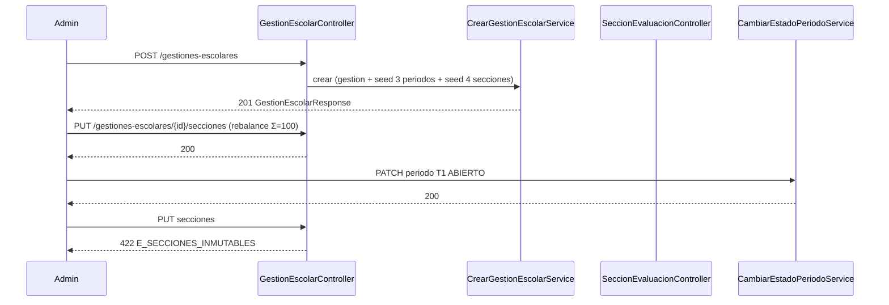
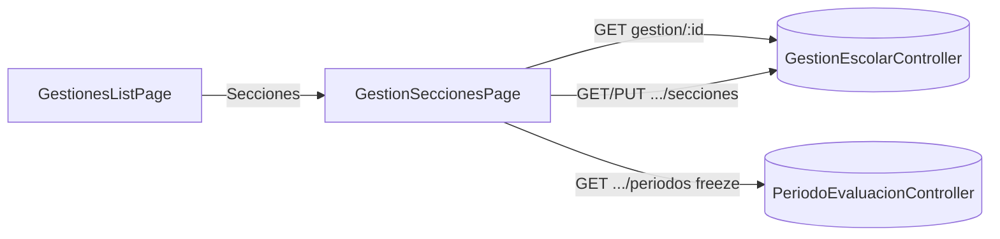

# Design Doc `DD-UC-016` — Académico: Secciones de Evaluación (backend + UI)

> **Qué es**: decimosexto Design Doc de código y **séptimo feature de negocio real del módulo `academico`**, después de Periodos (`DD-UC-015`). Implementa `FSD-UC-014` (Configuración de Secciones de Evaluación) como **un solo *vertical slice* fullstack**: backend hexagonal + consola Angular. Aplica `ADR-0013` (plantilla por gestión, seed Ser/Saber/Hacer/Autoevaluación, Σ `nota` = 100, freeze sticky). Quinto fullstack de `academico`.
>
> **Relación con otros documentos**: consume `GestionEscolar` (`DD-UC-008`/`009`) y Periodos (`DD-UC-015`) — el freeze se dispara cuando algún periodo deja de estar `PENDIENTE`. Las **evaluaciones** y el **motor de cálculo** quedan en `FSD-UC-015`/`016`. Alimenta el DTP vía `@dtp-sync` tras ejecutar `PR-IMPL-016`.

## 1. Objetivo y contexto

- **Qué resuelve este feature**: el `ADMIN` configura la plantilla de `SeccionEvaluacion` de una `GestionEscolar` (nombre, orden, `nota` en puntos). Al crear una gestión nueva el sistema siembra 4 secciones Bolivia (Ser 5 / Saber 45 / Hacer 40 / Autoevaluación 10). Esa plantilla es **la misma para todos los periodos**. Es el prerrequisito de `FSD-UC-015` (la evaluación vive en una sección y se califica en `[0, seccion.nota]`).
- **Caso(s) de uso del FSD que implementa**: `FSD-UC-014` (`docs/product/FSD.md` §4.6.4). Delta de `FSD-UC-012`: `POST /gestiones-escolares` siembra también las 4 secciones (`ADR-0013`; los 3 periodos ya los siembra `PR-IMPL-015`).
- **Alcance**:
  - **Dentro**:
    - Aggregate `SeccionEvaluacion` independiente (no embebido en `GestionEscolar` ni en `PeriodoEvaluacion`), con `orden` 1-based. Mismo criterio que `PeriodoEvaluacion`: `Evaluacion` referenciará la sección por id.
    - Seed al crear gestión (misma TX que el alta, junto al seed de 3 periodos ya existente): 4 filas con los defaults de `ADR-0013` §3.1.2.
    - `GET /gestiones-escolares/{id}/secciones` (lista ordenada por `orden`, sin paginar). `GET /gestiones-escolares/{id}` ya existe (`DD-UC-015`).
    - `PUT /gestiones-escolares/{id}/secciones` — **reemplazo atómico** de la plantilla (operación canónica de rebalanceo; Σ `nota` = 100, M ≥ 1).
    - `POST /gestiones-escolares/{id}/secciones` `{nombre, orden, nota}` y `PATCH /secciones-evaluacion/{id}` `{nombre?, nota?}` — compatibles con el FSD; tras la mutación la suma **debe** seguir = 100 (`422 E_SUMA_SECCIONES_INVALIDA` si no).
    - `nota ∈ (0, 100]` → si no, `422 E_PESO_INVALIDO`.
    - Freeze sticky (`ADR-0013` §3.1.5): si **algún** periodo de la gestión está `ABIERTO` **o** `CERRADO` (es decir, ya no todos `PENDIENTE`), POST/PUT/PATCH → `422 E_SECCIONES_INMUTABLES`. El freeze **no se levanta** al cerrar el periodo.
    - Delta en `CambiarEstadoPeriodoEvaluacionService`: no se abre el primer periodo si no hay secciones o Σ ≠ 100 (`422 E_SUMA_SECCIONES_INVALIDA`). Cubre gestiones creadas antes de este slice.
    - Flyway `V10__academico_seccion_evaluacion.sql` (`tenant_id` + RLS `FORCE`).
    - Consola: ruta `/academico/gestiones-escolares/:id/secciones` (tabla editable + guardar PUT); enlace "Secciones" en la lista de gestiones. RBAC escrituras `ADMIN`; GET también `SECRETARIA`.
  - **Fuera**:
    - `FSD-UC-015`/`016` (`Evaluacion`, promedio, `round`/`floor`).
    - Campo separado `peso_porcentual` (`ADR-0013`: `nota` **es** el peso).
    - `DELETE` item (un borrado suelto rompe Σ=100; se recorta la plantilla vía PUT).
    - Colgar secciones del periodo (`seccion.periodo_evaluacion_id`) — alternativa descartada en `ADR-0013`.
    - Backfill de gestiones ya persistidas sin secciones (el Admin las configura a mano con PUT; no pueden abrir un periodo hasta que Σ=100).
    - `audit_log` (`ADR-0009` §3 punto 5).

## 2. Diseño (el "cómo") `[humano+máquina]`

- **Enfoque fullstack en un solo DD**: mismo criterio que `DD-UC-012`..`015`.
- **`SeccionEvaluacion` es Aggregate independiente** (factory `crear()`, Lombok solo `@Getter`). Campos: `id`, `tenantId`, `gestionEscolarId`, `nombre`, `orden`, `nota` (`BigDecimal` escala 2). Sin máquina de estados. La **suma 100**, el **freeze** y la **unicidad de `orden`** se validan en servicios de aplicación que cargan todas las secciones (y, para el freeze, todos los periodos) de la gestión.
- **Por qué PUT atómico**: Σ `nota` = 100 es invariante de **conjunto**. Un `PATCH` aislado de `nota` (p. ej. Saber 45→40) dejaría suma 95 y haría el API inutilizable para rebalancear. El FSD nombra POST/PATCH item; el *cómo* añade `PUT` de plantilla como escritura canónica (la consola guarda la tabla de una vez). POST/PATCH item se implementan y rechazan si el resultado no suma 100 — sirven para cambios de `nombre` (PATCH) o para clientes que ya dejaron hueco en la suma (no es el camino de la UI).
- **Seed** (`CrearGestionEscolarService`, misma TX; ya siembra 3 periodos):

  | Orden | Nombre | `nota` |
  |-------|--------|--------|
  | 1 | Ser | 5 |
  | 2 | Saber | 45 |
  | 3 | Hacer | 40 |
  | 4 | Autoevaluación | 10 |

  Gestiones **ya existentes** no se migran.
- **Freeze sticky** (`ADR-0013` §3.1.5, más estricto que el FSD A3 que solo nombra un periodo `ABIERTO`): `existeAlgunPeriodoNoPendiente(gestion)` → escrituras de secciones `422 E_SECCIONES_INMUTABLES`. Mientras **todos** los periodos están `PENDIENTE`, el Admin puede PUT/POST/PATCH. Alinear el FSD A3 con este criterio al ejecutar `@dtp-sync`.
- **Apertura de periodo**: al pasar un periodo a `ABIERTO`, si la plantilla está vacía o Σ ≠ 100 → `422 E_SUMA_SECCIONES_INVALIDA` (no se abre). Tras una apertura exitosa el freeze queda permanente.
- **Aislamiento**: `tenant_id` en la tabla (redundante por join, mismo patrón que `periodo_evaluacion`). Filtro `buscarPorIdYTenant` / `listarPorGestionYTenant`. Cross-tenant o gestión inexistente → `404 E_GESTION_ESCOLAR_NO_ENCONTRADA` / `E_SECCION_NO_ENCONTRADA` (no 403).
- **RBAC**:
  - `PUT`/`POST`/`PATCH` de secciones: `ADMIN`.
  - `GET` secciones: `ADMIN` + `SECRETARIA` (catálogo para `FSD-UC-015`).
  - Pantalla Angular: `data.roles: ['ADMIN']` (igual que Periodos). El GET queda listo para SECRETARIA; **no** se abre esta pantalla a `SECRETARIA` en este DD.
- **DTOs** en `adapter/in/rest` (sin subpaquete `dto/`). Dos controllers (espejo Periodos): delta `GestionEscolarController` (`GET/PUT/POST /{id}/secciones`) + `SeccionEvaluacionController` (`PATCH /api/v1/secciones-evaluacion/{id}`).
- **UI**:
  - Lista de gestiones: acción "Secciones" → `/academico/gestiones-escolares/:id/secciones` (ruta **después** de `/nuevo`).
  - Detalle: encabezado con `GET /gestiones-escolares/{id}`; tabla ordenada (nombre + nota); suma en vivo; "Añadir fila" / quitar fila en cliente; **Guardar** envía PUT del array. Deshabilitar edición si hay freeze (consultar periodos de la gestión: si alguno no está `PENDIENTE`). `404` visible.
  - No hay ruta `/secciones/nuevo`.
- **Componentes tocados**:

```
backend/src/main/java/com/edusync/academico/
├── domain/
│   ├── SeccionEvaluacion.java
│   ├── SeccionEvaluacionId.java
│   ├── SeccionNoEncontradaException.java     (404 E_SECCION_NO_ENCONTRADA)
│   ├── PesoInvalidoException.java            (422 E_PESO_INVALIDO)
│   ├── SumaSeccionesInvalidaException.java   (422 E_SUMA_SECCIONES_INVALIDA)
│   └── SeccionesInmutablesException.java     (422 E_SECCIONES_INMUTABLES)
├── application/  (Reemplazar/Listar/Crear/Actualizar Seccion + política + delta seed + delta abrir periodo)
└── infrastructure/adapter/in/rest/SeccionEvaluacionController.java
                  + delta GestionEscolarController (GET/PUT/POST .../secciones)

backend/src/main/resources/db/migration/V10__academico_seccion_evaluacion.sql

frontend/src/app/features/academico/
├── seccion-evaluacion.model.ts
└── gestion-secciones.page.ts
+ delta gestiones-escolares-list.page.ts (enlace Secciones)
+ delta app.routes.ts
```

- **Contratos** (bajo `/api/v1`):

  | Método | Ruta | Auth | Feliz | Errores |
  |--------|------|------|-------|---------|
  | `GET` | `/gestiones-escolares/{id}/secciones` | ADMIN, SECRETARIA | `200 List<SeccionEvaluacionResponse>` | `404` gestión |
  | `PUT` | `/gestiones-escolares/{id}/secciones` `{secciones:[{nombre, nota}]}` | ADMIN | `200` lista | `404`; `422 E_PESO_INVALIDO` / `E_SUMA_SECCIONES_INVALIDA` / `E_SECCIONES_INMUTABLES` |
  | `POST` | `/gestiones-escolares/{id}/secciones` `{nombre, orden, nota}` | ADMIN | `201` | `404`; `422` peso/suma/inmutables |
  | `PATCH` | `/secciones-evaluacion/{id}` `{nombre?, nota?}` | ADMIN | `200` | `404`; `422` peso/suma/inmutables |

  `POST /gestiones-escolares` existente pasa a crear también las 4 secciones (misma 201; el body de gestión **no** embebe la lista — el cliente llama a `GET .../secciones`).

  PUT: `orden` se reasigna 1..M según el orden del array. M ≥ 1 (array vacío → `E_SUMA_SECCIONES_INVALIDA` o `422` de plantilla vacía; tratarlo como suma inválida). `nota` con escala 2; suma exacta `100.00` (`compareTo`).

- **Diagrama**:





## 3. Alternativas consideradas

| Alternativa | Pros | Contras | ¿Elegida? |
|-------------|------|---------|-----------|
| A. Un solo DD fullstack | Cierra `FSD-UC-014` en un ciclo | Prompt más grande que un backend-only | **sí** (patrón `012`..`015`) |
| B. Backend-primero + UI `DD-UC-017` | Como `008`→`009` | Los slices recientes son fullstack | no |
| A. Aggregate independiente a nivel gestión | `Evaluacion` referenciará el id; misma plantilla en T1/T2/T3 | — | **sí** (`ADR-0013`) |
| B. Secciones embebidas en `GestionEscolar` | Un solo save | Carga el AR padre; peor para `FSD-UC-015` | no |
| C. Una copia de secciones por periodo | Flexibilidad T1≠T2 | Contradice `ADR-0013` ("plantilla de la gestión") | no |
| A. PUT atómico + POST/PATCH item con Σ=100 | UI usable; FSD cubierto | POST item casi nunca suma 100 si el seed ya está cerrado | **sí** |
| B. Permitir Σ ≠ 100 hasta abrir el primer periodo | POST/PATCH item fáciles | Ventana de plantilla inválida; A2 del FSD es de escritura | no |
| A. Freeze sticky (ABIERTO o CERRADO) | Cumple `ADR-0013` §3.1.5 / `RB-06` genérico | Más estricto que el FSD A3 literal | **sí** (ADR manda; FSD se alinea en `dtp-sync`) |
| B. Freeze solo mientras hay un `ABIERTO` (como periodos) | Simetría con `E_PERIODOS_INMUTABLES` | Tras cerrar T1 se podrían cambiar pesos a mitad de gestión | no |
| A. Sin `DELETE` item | No hay mutación que rompa Σ a la fuerza | El FSD no lo pide | **sí** |
| A. Sin ADR nuevo | `ADR-0013` ya cerró la decisión de dominio | — | **sí** |

> Decisiones de *cómo* sobre un ADR ya aceptado. **No ameritan `ADR-0014`**. Gobernanza (`audit_log`) sigue fuera (`ADR-0009` §3 punto 5).

## 4. Impacto en las specs vivas `[máquina]`

> Al **diseñar** este DD (este turno): DTP + PROMPT_MAPPING + AGENTS. Al **ejecutar** `PR-IMPL-016`: FSD §4.6.4 (GET/PUT, freeze sticky, A3 alineado a ADR).

| Artefacto vivo | Cambio | ¿Delta vs DTI vFinal? |
|----------------|--------|-----------------------|
| `docs/product/FSD.md` (`FSD-UC-014`) | En ejecución: documentar GET/PUT, freeze sticky, seed en el POST de gestión | no (el modelo ya está en `ADR-0013`) |
| `docs/product/PRD.md` (`PRD-REQ-024`) | Sin cambio de requisito | no |
| `docs/product/DTP.md` | v1.32→v1.33: §A.1 fila de diseño; §A.3 `FSD-UC-014` **diseño aprobado, ejecución pendiente** | no |
| `docs/PROMPT_MAPPING.md` | v2.32→v2.33: fila `PR-IMPL-016` Aprobado (prompt) | no |
| Baseline `docs/baseline/**` | **No se toca** | — |

## 5. Prompts usados `[máquina]`

| Prompt | Tarea | Artefacto generado |
|--------|-------|--------------------|
| `PR-IMPL-016` | Código backend + UI + tests + `V10` de Secciones de Evaluación (seed al crear gestión) | `backend/.../academico/**` (delta), `V10__academico_seccion_evaluacion.sql`, `frontend/.../gestion-secciones.page.ts` |

## 6. Plan de pruebas y evals

- **Unit (dominio)**: crear con `nota` ≤ 0 o > 100 → `E_PESO_INVALIDO`; nombre en blanco; `nota` 45.00 válida.
- **Unit (servicios, Mockito)**: seed crea 4 secciones Σ=100; PUT rebalance 5/50/35/10 ok; PUT Σ=99 → `E_SUMA_SECCIONES_INVALIDA`; PUT array vacío rechazado; PATCH nota de una sola sección que rompe la suma → 422; freeze con T1 `ABIERTO` y con T1 `CERRADO` (sticky); cross-tenant 404; abrir T1 sin secciones → `E_SUMA_SECCIONES_INVALIDA`.
- **Integration** (Testcontainers, patrón `PeriodoEvaluacionIntegrationTest`): `POST` gestión → `GET .../secciones` tiene 4 filas Gherkin; PUT a 2 secciones 60+40; abrir T1 y PUT → `E_SECCIONES_INMUTABLES`; cerrar T1 y PUT → sigue 422; `ModularityTests` 7/7.
- **Frontend**: `ng build` verde. `ADMIN` abre Secciones; `PROFESOR` no entra a `/academico/gestiones-escolares/**`.
- **Gherkin** (FSD / PRD-US-022):

```gherkin
Escenario: Seed Ser 5 / Saber 45 / Hacer 40 / Autoevaluación 10
  Cuando el Admin crea una GestionEscolar
  Entonces existen 4 secciones cuya suma de nota es 100
    Y aplican a todos los periodos de esa gestión

Escenario: No se editan secciones con un periodo ABIERTO
  Dado Trimestre 1 ABIERTO
  Cuando el Admin intenta cambiar la nota de Saber de 45 a 40
  Entonces el sistema responde 422 E_SECCIONES_INMUTABLES
```

- **Evals de IA**: no aplica.

## 7. Definition of Done (checklist)

- [x] `fsd_uc` declarado y enlazado (`FSD-UC-014`).
- [x] Diseño (§2) y alternativas (§3) documentados.
- [x] Sin ADR nuevo (`ADR-0013` ya cubre el modelo).
- [x] §4 Impacto en specs vivas registrado (sin tocar el baseline).
- [x] Prompt `PR-IMPL-016` versionado en `docs/prompts/impl/` y en `PROMPT_MAPPING.md`.
- [x] Tests/evals definidos (§6) y pasando (`mvn test` 215/215, incluye `ModularityTests` 7/7; `ng build` verde).
- [x] DTP actualizado vía `dtp-sync` **tras** la ejecución de código.
- [ ] PR declara prompts usados y archivos generados vs editados a mano (commit formal pendiente).

## 8. Versionado

| Versión | Fecha | Autor | Cambio |
|---------|-------|-------|--------|
| v1.0 | 21/08/2026 | Rodrigo Aspeti | Creación del decimosexto Design Doc (`DD-UC-016`): *vertical slice* fullstack de `academico` para `FSD-UC-014`. Aggregate `SeccionEvaluacion` independiente a nivel de gestión; seed 4 secciones al crear gestión; PUT atómico (Σ=100); freeze sticky; consola detalle anidada. Estado `aprobado`; ejecución de `PR-IMPL-016` pendiente. |
| v1.1 | 21/08/2026 | Rodrigo Aspeti | Ejecución de `PR-IMPL-016`: DoD 100%. `mvn test` 215/215; `ng build` verde (lazy chunk `gestion-secciones-page`). Estado `ejecutado`. |
