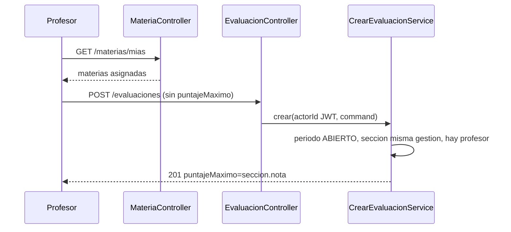
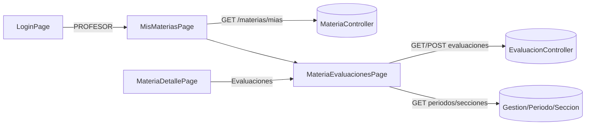

# Design Doc `DD-UC-017` — Académico: Evaluaciones (backend + UI)

> **Qué es**: decimoséptimo Design Doc de código y **octavo feature de negocio real del módulo `academico`**, después de Secciones (`DD-UC-016`). Implementa `FSD-UC-015` (Gestión de Evaluaciones) como **un solo *vertical slice* fullstack**: backend hexagonal + primera consola Angular del rol `PROFESOR`. Aplica `ADR-0013` §3.3: la evaluación vive en (`Materia` × `PeriodoEvaluacion` × `SeccionEvaluacion`); `puntajeMaximo` se deriva de `seccion.nota` (nunca lo envía el cliente). Sexto fullstack de `academico`.
>
> **Relación con otros documentos**: consume Materias y asignación a Profesor (`DD-UC-012`/`014`), Periodos (`DD-UC-015`) y Secciones (`DD-UC-016`). Las **calificaciones de estudiantes** y el **motor de cálculo** (`round` HALF_UP) quedan en `FSD-UC-016`. Alimenta el DTP vía `@dtp-sync` tras ejecutar `PR-IMPL-017`.

## 1. Objetivo y contexto

- **Qué resuelve este feature**: el `PROFESOR` (y el `ADMIN` como override operativo) crea 1..N `Evaluacion` en cada sección de una materia asignada, siempre en un periodo `ABIERTO`. El sistema fija `puntajeMaximo = seccion.nota` (si Saber = 45, todas las evals de Saber quedan en escala 0–45). Es el prerrequisito de `FSD-UC-016` (promedio de sección sobre evals **con nota**).
- **Caso(s) de uso del FSD que implementa**: `FSD-UC-015` (`docs/product/FSD.md` §4.6.5). `BR-019`, `BR-022`.
- **Alcance**:
  - **Dentro**:
    - Aggregate `Evaluacion` independiente (no embebido en `Materia` ni en `SeccionEvaluacion`). Mismo criterio que Periodos/Secciones: `Calificacion` (futuro `FSD-UC-016`) referenciará la evaluación por id.
    - `POST /api/v1/evaluaciones` `{nombre, materiaId, periodoEvaluacionId, seccionEvaluacionId, fecha, descripcion?}` — **sin** `puntajeMaximo` en el body. El sistema lo copia de `seccion.nota` al crear.
    - `GET /api/v1/materias/{materiaId}/evaluaciones?periodoId=` (lista, sin paginar; cardinalidad acotada por materia×periodo).
    - `GET /api/v1/evaluaciones/{id}` y `PATCH /api/v1/evaluaciones/{id}` `{nombre?, fecha?, descripcion?}`.
    - `PATCH /api/v1/evaluaciones/{id}/estado` `{estado: ANULADA}` (baja lógica; el diccionario FSD §6.3.2 ya declara `ACTIVA` / `ANULADA`). Sin `DELETE` físico.
    - `GET /api/v1/materias/mias` — materias asignadas al `usuarioId` del JWT (principal). Declarar **antes** de `GET /materias/{id}` para que `mias` no se parsee como UUID.
    - Validaciones de escritura: periodo `ABIERTO`; sección y periodo de la **misma** `GestionEscolar`; materia del tenant con **al menos un** profesor asignado (`409 E_MATERIA_SIN_PROFESOR`, `BR-022`); `PROFESOR` solo sobre materias donde él figura en `AsignacionMateriaProfesor` (si no → `404 E_MATERIA_NO_ENCONTRADA`, nunca 403).
    - `actorId` desde `SecurityContext` (`JWT sub` = `userId`); **nunca** del body.
    - Flyway `V11__academico_evaluacion.sql` (`tenant_id` + RLS `FORCE`).
    - Consola: `/academico/mis-materias` (`PROFESOR`) y `/academico/materias/:id/evaluaciones` (`ADMIN` + `PROFESOR`). Primera UI del rol `PROFESOR`. Redirect de login `PROFESOR` → `/academico/mis-materias`.
    - Deltas de lectura: `GET` de gestiones / periodos / secciones / `GET /materias/{id}` también `PROFESOR` (catálogos para armar el alta). Escrituras de esos recursos **no** cambian.
  - **Fuera**:
    - `FSD-UC-016` (motor de promedio, `round` HALF_UP, `floor()`).
    - Persistencia de **calificación de estudiante** (`Calificacion` / nota por `rude`). El A2 del FSD (`422 E_RANGO_INVALIDO` si la nota no está en `[0, seccion.nota]`) **se difiere** a ese slice: hoy no hay escritura de nota. Este DD demuestra la escala persistiendo `puntajeMaximo = seccion.nota`.
    - Catálogo `TipoEvaluacion` (`ADR-0013` §3.5).
    - `audit_log` (`ADR-0009` §3 punto 5).
    - Reabrir periodo `CERRADO`; alta de materia/profesor; `PATCH`/`DELETE` de secciones.

## 2. Diseño (el "cómo") `[humano+máquina]`

- **Enfoque fullstack en un solo DD**: mismo criterio que `DD-UC-012`..`016`.
- **`Evaluacion` es Aggregate independiente** (factory `crear()`, Lombok solo `@Getter`). Campos: `id`, `tenantId`, `materiaId`, `periodoEvaluacionId`, `seccionEvaluacionId`, `nombre` (max 100), `fecha` (`LocalDate`), `puntajeMaximo` (`BigDecimal` escala 2, copiado de `seccion.nota`, **inmutable** tras el alta), `descripcion` (opcional), `estado` (`ACTIVA` | `ANULADA`). Mutadores: `actualizarDatos(nombre, fecha, descripcion)` (solo `ACTIVA` y periodo `ABIERTO`, validado en aplicación) y `anular()`.
- **Por qué snapshot de `puntajeMaximo`**: las secciones ya están frozen al existir un periodo `ABIERTO` (`DD-UC-016`), así que `seccion.nota` no cambia. El snapshot igual deja la escala de la eval autonómica si en un futuro se relajara el freeze. El cliente **MUST NOT** enviar el campo (si llega, Bean Validation / ignoro explícito: el command no lo tiene).
- **`actorId`**: el filtro JWT ya pone `claims.userId()` como principal (`JwtAuthenticationFilter`). El adaptador REST lee `(UUID) authentication.getPrincipal()` y lo pasa al use case. `academico` **no** importa `identidad`.
- **A1 `E_MATERIA_SIN_PROFESOR`**: `listarPorMateriaYTenant` vacío → `409`, tanto para `ADMIN` como para `PROFESOR`. Cubre `BR-022` aunque el actor sea Admin.
- **Alcance del Profesor**: si el actor tiene rol `PROFESOR` y **no** `ADMIN`, debe aparecer en las asignaciones de esa materia. Si no → `404 E_MATERIA_NO_ENCONTRADA` (mismo criterio cross-tenant: no filtrar existencia). Un usuario multi-rol `ADMIN`+`PROFESOR` opera como Admin (override).
- **Periodo no `ABIERTO`**: `422 E_PERIODO_NO_ABIERTO` (código nuevo del modelo genérico; no reutilizar `E_PERIODO_NO_MODIFICABLE` del Perfil SIE). Aplica a POST, PATCH datos y anular. Las evals de un periodo ya `CERRADO` siguen visibles en GET.
- **Coherencia gestión**: `periodo.gestionEscolarId` debe igualar `seccion.gestionEscolarId`. Si no → `422 E_SECCION_NO_PERTENECE_A_GESTION`. Materia inexistente / otro tenant → `404 E_MATERIA_NO_ENCONTRADA`. Periodo/sección inexistentes → `404 E_PERIODO_NO_ENCONTRADO` / `E_SECCION_NO_ENCONTRADA` (ya existen).
- **Lista**: `GET /materias/{id}/evaluaciones` ordenada por `seccion.orden`, luego `fecha`, luego `nombre`. Query opcional `periodoId`. `PROFESOR` sin asignación → 404 de materia. Incluir `ANULADA` en la lista (la UI las marca; no se editan).
- **Aislamiento**: `tenant_id` en la tabla. Filtro `buscarPorIdYTenant`. Cross-tenant → `404 E_EVALUACION_NO_ENCONTRADA` (no 403).
- **RBAC**:
  - `POST` / `PATCH` datos / `PATCH estado`: `ADMIN` o `PROFESOR`.
  - `GET` evaluaciones y `GET /materias/mias`: `ADMIN`, `SECRETARIA` o `PROFESOR`. `GET /materias/mias` para Admin/Secretaria puede devolver vacío (no son el profesor del JWT) — no es el camino de su UI.
  - Deltas de catálogo (solo GET): gestiones listado/`/{id}`, periodos, secciones, `GET /materias/{id}` → añadir `PROFESOR`. **No** abrir escrituras de esos recursos al Profesor.
  - Pantallas Angular: `data.roles: ['PROFESOR']` en Mis materias; `data.roles: ['ADMIN','PROFESOR']` en evaluaciones. **No** reescribir `role.guard.ts` (ya acepta `data.roles`).
- **DTOs** en `adapter/in/rest` (sin subpaquete `dto/`). `EvaluacionController` (POST/GET/PATCH `/evaluaciones/**`) + delta `MateriaController` (`GET /mias`, `GET /{id}/evaluaciones`, ampliar GET `/{id}`).
- **UI**:
  - Shell: enlace "Mis materias" si `hasRole('PROFESOR')`.
  - Login: `PROFESOR` (sin ADMIN/SYSADMIN) → `/academico/mis-materias`.
  - `MisMateriasPage`: `GET /materias/mias` → tabla; clic → `/academico/materias/:id/evaluaciones`.
  - `MateriaEvaluacionesPage`: encabezado `GET /materias/{id}`; selector de `GestionEscolar` (`GET /gestiones-escolares`); al elegir, `GET .../periodos` y `GET .../secciones`; lista de evals del periodo seleccionado (preferir el `ABIERTO` si hay uno); alta inline `{nombre, seccionId, fecha, descripcion?}` solo si el periodo está `ABIERTO`; anular con confirmación. `puntajeMaximo` se muestra de solo lectura (viene del GET, no se edita).
  - `materia-detalle.page.ts`: enlace "Evaluaciones" para `ADMIN`.
  - Ruta `/academico/materias/:id/evaluaciones` **después** de `/nuevo` y de `/:id` detalle, para no capturar mal.
- **Componentes tocados**:

```
backend/src/main/java/com/edusync/academico/
├── domain/
│   ├── Evaluacion.java
│   ├── EvaluacionId.java
│   ├── EstadoEvaluacion.java            (ACTIVA, ANULADA)
│   ├── EvaluacionNoEncontradaException.java   (404 E_EVALUACION_NO_ENCONTRADA)
│   ├── MateriaSinProfesorException.java       (409 E_MATERIA_SIN_PROFESOR)
│   ├── PeriodoNoAbiertoException.java         (422 E_PERIODO_NO_ABIERTO)
│   └── SeccionNoPerteneceAGestionException.java (422 E_SECCION_NO_PERTENECE_A_GESTION)
├── application/  (Crear/Listar/Obtener/Actualizar/Anular + ListarMateriasAsignadas)
└── infrastructure/adapter/in/rest/EvaluacionController.java
                  + delta MateriaController (GET /mias, GET /{id}/evaluaciones, GET /{id} + PROFESOR)
                  + delta GET PROFESOR en GestionEscolarController / Periodo / Seccion

backend/src/main/resources/db/migration/V11__academico_evaluacion.sql

frontend/src/app/features/academico/
├── evaluacion.model.ts
├── mis-materias.page.ts
└── materia-evaluaciones.page.ts
+ delta materia-detalle.page.ts, app.routes.ts, shell.component.ts, login.page.ts
```

- **Contratos** (bajo `/api/v1`):

  | Método | Ruta | Auth | Feliz | Errores |
  |--------|------|------|-------|---------|
  | `POST` | `/evaluaciones` `{nombre, materiaId, periodoEvaluacionId, seccionEvaluacionId, fecha, descripcion?}` | ADMIN, PROFESOR | `201 EvaluacionResponse` (`puntajeMaximo` = `seccion.nota`, `estado=ACTIVA`) | `404` materia/periodo/sección; `409 E_MATERIA_SIN_PROFESOR`; `422 E_PERIODO_NO_ABIERTO` / `E_SECCION_NO_PERTENECE_A_GESTION` |
  | `GET` | `/materias/{materiaId}/evaluaciones?periodoId=` | ADMIN, SECRETARIA, PROFESOR | `200 List<EvaluacionResponse>` | `404` materia |
  | `GET` | `/evaluaciones/{id}` | ADMIN, SECRETARIA, PROFESOR | `200` | `404 E_EVALUACION_NO_ENCONTRADA` |
  | `PATCH` | `/evaluaciones/{id}` `{nombre?, fecha?, descripcion?}` | ADMIN, PROFESOR | `200` | `404`; `422 E_PERIODO_NO_ABIERTO` |
  | `PATCH` | `/evaluaciones/{id}/estado` `{estado: ANULADA}` | ADMIN, PROFESOR | `200` | `404`; `422` si periodo no `ABIERTO` o ya `ANULADA` |
  | `GET` | `/materias/mias` | ADMIN, SECRETARIA, PROFESOR | `200 List<MateriaResponse>` | — |

  HTTP 422 usa `HttpStatus.UNPROCESSABLE_CONTENT` (Spring Framework 7 / Boot 4.1).

- **Diagrama**:





## 3. Alternativas consideradas

| Alternativa | Pros | Contras | ¿Elegida? |
|-------------|------|---------|-----------|
| A. Un solo DD fullstack | Cierra `FSD-UC-015` en un ciclo; primera UI `PROFESOR` | Prompt más grande | **sí** (patrón `012`..`016`) |
| B. Backend-primero + UI `DD-UC-018` | Como `008`→`009` | Los slices recientes son fullstack | no |
| A. Aggregate independiente | `Calificacion` referenciará el id | — | **sí** |
| B. Evals embebidas en `Materia` | Un solo save | Carga el AR; peor para cálculo por periodo | no |
| A. Diferir `Calificacion` / A2 `E_RANGO_INVALIDO` | Mantiene el PR acotado; A2 no tiene API de nota en este FSD | El Gherkin PRD menciona "nota 46" | **sí** (A2 vive con la escritura de nota en `FSD-UC-016`) |
| B. Incluir notas de estudiantes aquí | Cierra el Gherkin de rango | Mezcla 015+016; PR > 400 líneas | no |
| A. `puntajeMaximo` solo servidor | Cumple `ADR-0013` §3.3.3 | El cliente no puede "partir" los 45 | **sí** |
| B. Permitir max distinto por eval | Flexibilidad | Viola BR-019 | no |
| A. Soft-delete `ANULADA` | Encaja el enum del FSD; no hay `DELETE` | Lista un poco más ruidosa | **sí** |
| B. `DELETE` físico | Simple | El FSD declara estado; futuras notas quedarían huérfanas | no |
| A. Primera consola `PROFESOR` (Mis materias) | El FSD nombra al Profesor como actor | Deltas GET de catálogos | **sí** |
| B. Solo UI Admin (como Periodos/Secciones) | Menos deltas RBAC | Contradice el actor del FSD | no |
| A. Sin ADR nuevo | `ADR-0013` ya cerró el modelo | — | **sí** |

> Decisiones de *cómo* sobre un ADR ya aceptado. **No ameritan `ADR-0014`**. Gobernanza (`audit_log`) sigue fuera (`ADR-0009` §3 punto 5).

## 4. Impacto en las specs vivas `[máquina]`

> Al **diseñar** este DD: DTP + PROMPT_MAPPING + AGENTS. Al **ejecutar** `PR-IMPL-017` (este turno): FSD §4.6.5 (GET lista, `puntajeMaximo` derivado, A1, periodo `ABIERTO`, A2 diferido a `FSD-UC-016`).

| Artefacto vivo | Cambio | ¿Delta vs DTI vFinal? |
|----------------|--------|-----------------------|
| `docs/product/FSD.md` (`FSD-UC-015`) | En ejecución: documentar GET/PATCH, `puntajeMaximo` derivado, A2 diferido a calificación de estudiante | no (el modelo ya está en `ADR-0013`) |
| `docs/product/PRD.md` (`PRD-REQ-025`) | Sin cambio de requisito | no |
| `docs/product/DTP.md` | v1.35→v1.36: §A.1 fila de ejecución; §A.3 `FSD-UC-015` **completo** (backend+UI) | no |
| `docs/PROMPT_MAPPING.md` | v2.35→v2.36: fila `PR-IMPL-017` Ejecutado | no |
| Baseline `docs/baseline/**` | **No se toca** | — |

## 5. Prompts usados `[máquina]`

| Prompt | Tarea | Artefacto generado |
|--------|-------|--------------------|
| `PR-IMPL-017` | Código backend + UI + tests + `V11` de Evaluaciones | `backend/.../academico/**` (delta), `V11__academico_evaluacion.sql`, `frontend/.../mis-materias.page.ts`, `materia-evaluaciones.page.ts` |

## 6. Plan de pruebas y evals

- **Unit (dominio)**: `crear` copia `puntajeMaximo`; nombre en blanco rechazado; `anular` desde `ACTIVA`; anular ya `ANULADA` rechazado.
- **Unit (servicios, Mockito)**: POST feliz con `puntajeMaximo=45` si Saber=45; body sin max; materia sin profesor → `E_MATERIA_SIN_PROFESOR`; periodo `PENDIENTE`/`CERRADO` → `E_PERIODO_NO_ABIERTO`; sección de otra gestión → `E_SECCION_NO_PERTENECE_A_GESTION`; `PROFESOR` no asignado → 404 materia; `ADMIN` en materia con profesor ok; cross-tenant 404.
- **Integration** (Testcontainers, patrón `SeccionEvaluacionIntegrationTest`): seed gestión + materia + asignación profesor; abrir T1; POST dos evals en Saber → ambas `puntajeMaximo=45.00`; POST con periodo PENDIENTE → 422; POST sin asignación → 409; `ModularityTests` 7/7.
- **Frontend**: `ng build` verde. `PROFESOR` entra a Mis materias; `ADMIN` llega desde detalle de materia. No reescribir `role.guard.ts`.
- **Gherkin** cubierto en este slice (escala; el rechazo de nota 46 espera `FSD-UC-016`):

```gherkin
Escenario: Evaluaciones de Saber siempre en escala 0–45
  Dado la sección Saber con nota=45
  Cuando el Profesor crea dos evaluaciones en Saber de su materia
  Entonces ambas tienen puntajeMaximo = 45
```

- **Evals de IA**: no aplica.

## 7. Definition of Done (checklist)

- [x] `fsd_uc` declarado y enlazado (`FSD-UC-015`).
- [x] Diseño (§2) y alternativas (§3) documentados.
- [x] Sin ADR nuevo (`ADR-0013` ya cubre el modelo).
- [x] §4 Impacto en specs vivas registrado (sin tocar el baseline).
- [x] Prompt `PR-IMPL-017` versionado en `docs/prompts/impl/` y en `PROMPT_MAPPING.md`.
- [x] Tests/evals definidos (§6) y pasando (`mvn test` 228/228, incluye `ModularityTests` 7/7; `ng build` verde).
- [x] DTP actualizado vía `dtp-sync` **tras** la ejecución de código.
- [ ] PR declara prompts usados y archivos generados vs editados a mano (commit formal pendiente).

## 8. Versionado

| Versión | Fecha | Autor | Cambio |
|---------|-------|-------|--------|
| v1.0 | 21/08/2026 | Rodrigo Aspeti | Creación del decimoséptimo Design Doc (`DD-UC-017`): *vertical slice* fullstack de `academico` para `FSD-UC-015`. Aggregate `Evaluacion` independiente; `puntajeMaximo` derivado; A1 `E_MATERIA_SIN_PROFESOR`; primera consola `PROFESOR`. Estado `aprobado`; ejecución de `PR-IMPL-017` pendiente. |
| v1.1 | 21/08/2026 | Rodrigo Aspeti | Ejecución de `PR-IMPL-017`: DoD 100%. `mvn test` 228/228; `ng build` verde. Estado `ejecutado`. |
