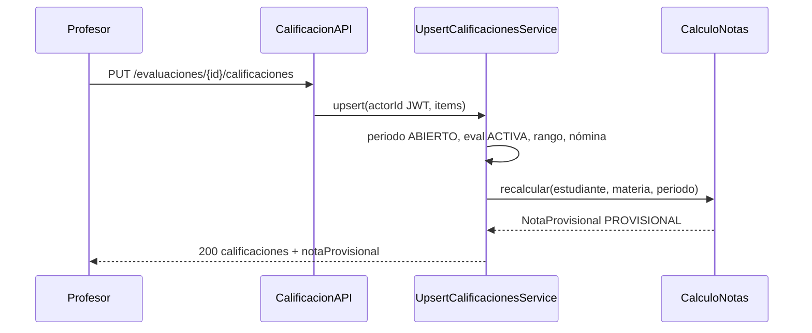
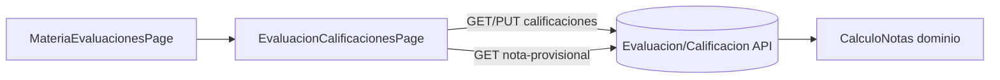

# Design Doc `DD-UC-018` — Académico: Calificaciones de evaluación y cálculo de notas (backend + UI)

> **Qué es**: decimoctavo Design Doc de código y **noveno feature de negocio real del módulo `academico`**, después de Evaluaciones (`DD-UC-017`). Implementa `FSD-UC-016` (Cálculo de Notas del modelo genérico) como **un solo *vertical slice* fullstack**: persistencia de `CalificacionEvaluacion` (cierra el A2 diferido de `DD-UC-017`), motor de dominio `round` HALF_UP (`ADR-0013` §3.4 / `BR-020`) y consola Angular de matriz de notas para el `PROFESOR`. Séptimo fullstack de `academico`.
>
> **Relación con otros documentos**: consume Evaluaciones (`DD-UC-017`), Secciones/Periodos (`DD-UC-015`/`016`), Materias + asignaciones curso/profesor (`DD-UC-012`), Estudiantes/Inscripciones (`DD-UC-013`). **No** toca el Perfil Bolivia SIE (`FSD-UC-001`/`003`, `floor()`, módulo `notassie`). Alimenta el DTP vía `@dtp-sync` tras ejecutar `PR-IMPL-018`.

## 1. Objetivo y contexto

- **Qué resuelve este feature**: el `PROFESOR` (y el `ADMIN` como override) carga la nota de cada estudiante inscrito en una `Evaluacion` `ACTIVA` de un periodo `ABIERTO`, en escala `[0, seccion.nota]` (= `evaluacion.puntajeMaximo`). En la misma transacción el motor de dominio recalcula la vista `PROVISIONAL` (nota de sección / periodo / gestión) con la fórmula de `ADR-0013` §3.4. Sin `floor()`.
- **Caso(s) de uso del FSD que implementa**: `FSD-UC-016` (`docs/product/FSD.md` §4.6.6). `BR-019`, `BR-020`. Cierra el A2 `422 E_RANGO_INVALIDO` diferido desde `FSD-UC-015`/`DD-UC-017`.
- **Alcance**:
  - **Dentro**:
    - Aggregate `CalificacionEvaluacion` independiente (nombre del diccionario FSD §6.3.2; **no** reutilizar el nombre `Calificacion` del Perfil SIE §6.2).
    - Motor puro de dominio `CalculoNotas` (sin Spring/JPA): `nota_seccion`, `nota_periodo`, `promedio_gestion` según `ADR-0013` §3.4.
    - `PUT /api/v1/evaluaciones/{id}/calificaciones` — upsert atómico por lote `{items:[{estudianteId, valor}]}` (matriz).
    - `GET /api/v1/evaluaciones/{id}/calificaciones` — nómina (inscritos del/los curso×paralelo de la materia en la gestión del periodo) + valor existente o `null`.
    - `GET /api/v1/materias/{materiaId}/estudiantes/{estudianteId}/nota-provisional?periodoId=` — vista `PROVISIONAL` (secciones, nota periodo, promedio gestión).
    - Validaciones de escritura: periodo `ABIERTO`; evaluación `ACTIVA`; `valor ∈ [0, puntajeMaximo]`; estudiante en la nómina; mismos criterios de alcance `PROFESOR`/`ADMIN` que `DD-UC-017`.
    - Flyway `V12__academico_calificacion_evaluacion.sql` (`tenant_id` + RLS `FORCE` + unique `(tenant_id, evaluacion_id, estudiante_id)`).
    - Delta `InscripcionRepositoryPort`: listar inscritos `ACTIVA` por gestión + pares (curso, paralelo) de las asignaciones de la materia.
    - UI: `/academico/materias/:id/evaluaciones/:evaluacionId/calificaciones` (matriz estudiante × celda de nota); enlace desde `MateriaEvaluacionesPage`; panel resumen `PROVISIONAL` al guardar / al elegir estudiante.
  - **Fuera**:
    - Perfil Bolivia SIE (`FSD-UC-001`/`003`/`004`/`005`/`009`), `floor()`, `notassie`, centralizador `OFICIAL`.
    - `TipoEvaluacion` (`ADR-0013` §3.5).
    - `audit_log` / gobernanza formal (`ADR-0009` §3 punto 5).
    - Persistencia de promedios derivados (tablas de `nota_seccion`/`nota_periodo`); se **calculan on-read / en la misma TX de respuesta**, no se materializan.
    - Append-only / `registro_padre_id` (eso es `FSD-UC-005` SIE). Aquí el upsert **sobrescribe** el `valor` de la misma fila (periodo `ABIERTO`).
    - Promedio entre materias / carga horaria (`ADR-0013` §3.5).
    - Reabrir periodo `CERRADO`; alta de evaluaciones/materias/inscripciones.

## 2. Diseño (el "cómo") `[humano+máquina]`

- **Enfoque fullstack en un solo DD**: mismo criterio que `DD-UC-012`..`017`. Decisiones explícitas del usuario (21/08/2026): (1) fullstack; (2) escritura de notas **y** motor; (3) UI matriz por evaluación.
- **`CalificacionEvaluacion` es Aggregate independiente** (factory `crear` / `conValor` / `reconstruir`, Lombok solo `@Getter`). Campos: `id`, `tenantId`, `evaluacionId`, `estudianteId`, `valor` (`BigDecimal` escala 2). Unicidad de negocio `(evaluacionId, estudianteId)` del tenant. Mutador: `actualizarValor(nuevo)` (revalida rango en dominio si se pasa el max; el max lo aporta la capa de aplicación desde `evaluacion.puntajeMaximo`).
- **Por qué no se llama `Calificacion`**: el diccionario genérico (§6.3.2) ya nombra `CalificacionEvaluacion`; `Calificacion` (§6.2) es el registro SIE por dimensión/`rude`. Evita colisión de nombres cuando se implemente `notassie`.
- **Motor `CalculoNotas` (dominio puro)**:

```text
nota_seccion     = round_2d_HALF_UP( (Σ valor) / n )   // n = evals ACTIVA con nota; escala [0, seccion.nota]
nota_periodo     = round_HALF_UP_entero( Σ nota_seccion_completa )
promedio_gestion = round_HALF_UP_entero( (Σ nota_periodo_o_cero) / N )
```

  - Solo entran evaluaciones `ACTIVA` (las `ANULADA` se ignoran aunque tengan filas de calificación).
  - `n = 0` → sección `INCOMPLETO` (no inventar 0 en el promedio de sección); **no** suma a `nota_periodo`.
  - Periodo sin ninguna sección completa → `nota_periodo` ausente; cuenta **0** en el promedio de gestión.
  - `N` = cantidad de `PeriodoEvaluacion` de la gestión. Promedio de gestión siempre visible con datos parciales, marcado `PROVISIONAL`.
  - **MUST NOT** usar `Math.floor` / `floor()` en este motor (golden `FloorTest` no es oracle aquí).
- **Cálculo en la misma TX de escritura**: tras el upsert, el use case invoca `CalculoNotas` y devuelve la vista provisional del estudiante afectado (mismo criterio que el disparador del FSD: “persistencia o actualización de una calificación”). No hay tabla de promedios.
- **Nómina (roster)**: unión de estudiantes con `Inscripcion` `ACTIVA` donde `gestionEscolarId = periodo.gestionEscolarId` y `(cursoId, paraleloId)` ∈ asignaciones curso de la materia. Si la materia no tiene asignación curso → `409 E_MATERIA_SIN_CURSO` (ya existe en `FSD-UC-018`). Estudiante fuera de nómina en un PUT → `422 E_ESTUDIANTE_NO_INSCRITO` (código nuevo).
- **A2 `E_RANGO_INVALIDO`**: `valor < 0` o `valor > evaluacion.puntajeMaximo` → `422` (mensaje sin interpolar PII; puede incluir el rango permitido).
- **Periodo / estado**: escrituras solo si periodo `ABIERTO` y evaluación `ACTIVA`. Si no → `422 E_PERIODO_NO_ABIERTO` / `422 E_EVALUACION_NO_ACTIVA`. GET de calificaciones y de nota provisional permitidos también en periodos `CERRADO`/`PENDIENTE` (solo lectura).
- **Alcance Profesor**: idéntico a `DD-UC-017` — `PROFESOR`-only debe figurar en `AsignacionMateriaProfesor`; si no → `404 E_MATERIA_NO_ENCONTRADA` / `404 E_EVALUACION_NO_ENCONTRADA`. `ADMIN`+`PROFESOR` opera como Admin.
- **`actorId`**: JWT principal; nunca del body. `tenantId`: `TenantContextProvider`.
- **Aislamiento**: `tenant_id` + filtro por tenant; cross-tenant → `404` (no 403).
- **RBAC**:
  - `PUT` calificaciones: `ADMIN` o `PROFESOR`.
  - `GET` calificaciones / nota provisional: `ADMIN`, `SECRETARIA` o `PROFESOR`.
- **UI**:
  - Desde `MateriaEvaluacionesPage`, cada fila `ACTIVA` con periodo `ABIERTO` enlaza a “Cargar notas”.
  - `EvaluacionCalificacionesPage`: encabezado (materia, evaluación, `puntajeMaximo`, periodo); tabla de inscritos (`nombreCompleto`, `rude` en UI — no en logs); input numérico por fila; botón “Guardar” → `PUT` lote; al éxito, refresca matriz y muestra resumen `PROVISIONAL` del estudiante editado (o un selector de estudiante para consultar `GET .../nota-provisional`).
  - Ruta `/academico/materias/:id/evaluaciones/:evaluacionId/calificaciones` con `data.roles: ['ADMIN','PROFESOR']`, **después** de las rutas de lista/detalle de evaluaciones.
  - No reescribir `role.guard.ts`.
- **Componentes tocados**:

```
backend/src/main/java/com/edusync/academico/
├── domain/
│   ├── CalificacionEvaluacion.java
│   ├── CalificacionEvaluacionId.java
│   ├── CalculoNotas.java                 (puro: inputs → NotaProvisional)
│   ├── NotaProvisional.java             (VO: secciones, notaPeriodo?, promedioGestion, estado=PROVISIONAL)
│   ├── EstadoSeccionNota.java           (COMPLETO | INCOMPLETO)
│   ├── RangoCalificacionInvalidoException.java   (422 E_RANGO_INVALIDO)
│   ├── EstudianteNoInscritoException.java        (422 E_ESTUDIANTE_NO_INSCRITO)
│   └── EvaluacionNoActivaException.java          (422 E_EVALUACION_NO_ACTIVA)
├── application/  (Upsert/Listar calificaciones + ObtenerNotaProvisional)
└── infrastructure/adapter/in/rest/
    ├── CalificacionEvaluacionController.java   (o delta EvaluacionController)
    └── delta MateriaController (GET nota-provisional)
+ delta InscripcionRepositoryPort / adapter
+ V12__academico_calificacion_evaluacion.sql

frontend/src/app/features/academico/
├── calificacion-evaluacion.model.ts
└── evaluacion-calificaciones.page.ts
+ delta materia-evaluaciones.page.ts, app.routes.ts
```

- **Contratos** (bajo `/api/v1`):

  | Método | Ruta | Auth | Feliz | Errores |
  |--------|------|------|-------|---------|
  | `PUT` | `/evaluaciones/{id}/calificaciones` `{items:[{estudianteId, valor}]}` | ADMIN, PROFESOR | `200` lista resultante + opcional `notaProvisional` del primer estudiante tocado (o map por id) | `404` eval; `422` rango / no inscrito / periodo / no activa; `409` materia sin curso |
  | `GET` | `/evaluaciones/{id}/calificaciones` | ADMIN, SECRETARIA, PROFESOR | `200 [{estudianteId, nombreCompleto, rude, valor?}]` | `404` |
  | `GET` | `/materias/{materiaId}/estudiantes/{estudianteId}/nota-provisional?periodoId=` | ADMIN, SECRETARIA, PROFESOR | `200 NotaProvisionalResponse` | `404` materia/estudiante |

  HTTP 422 usa `HttpStatus.UNPROCESSABLE_CONTENT` (Spring Framework 7 / Boot 4.1).

- **Diagrama**:





## 3. Alternativas consideradas

| Alternativa | Pros | Contras | ¿Elegida? |
|-------------|------|---------|-----------|
| A. Un solo DD fullstack | Cierra `FSD-UC-016` en un ciclo; cierra A2 de 015 | Prompt grande | **sí** (pedido 1A) |
| B. Backend-primero + UI `DD-UC-019` | PRs más chicos | Rompe el ritmo 012–017 | no |
| A. Escritura + motor en el mismo slice | El FSD dispara el cálculo al persistir; sin notas el motor no tiene sentido | PR > 400 líneas neto posible | **sí** (pedido 2A) |
| B. Solo motor / solo notas | Acota | Deja `FSD-UC-016` incompleto | no |
| A. Matriz por evaluación (nómina × celda) | UX natural del Profesor; un PUT por lote | Hay que resolver roster multi-curso | **sí** (pedido 3A) |
| B. Formulario uno-a-uno | Más simple | Peor UX; más round-trips | no |
| A. Nombre `CalificacionEvaluacion` | Coincide FSD §6.3.2; no choca con SIE | Nombre largo | **sí** |
| B. Nombre `Calificacion` | Corto | Colisión con §6.2 / `notassie` | no |
| A. Promedios on-read (sin tabla derivada) | Simple; siempre coherente con notas | Costo CPU en lecturas (aceptable en v1) | **sí** |
| B. Materializar `nota_seccion`/`nota_periodo` | Lecturas baratas | Sync/invalidación; fuera de `BR-020` mínimo | no |
| A. Upsert sobrescribe en periodo `ABIERTO` | Encaja el genérico abierto | No es append-only SIE | **sí** (append-only = `FSD-UC-005`) |
| B. Append-only desde el día 1 | Alinea con SIE | Complejidad y UI de historial sin requisito genérico | no |
| A. Sin ADR nuevo | `ADR-0013` ya cerró la fórmula | — | **sí** |

> Decisiones de *cómo* sobre un ADR ya aceptado. **No ameritan `ADR-0014`**. Gobernanza (`audit_log`) sigue fuera (`ADR-0009` §3 punto 5).

## 4. Impacto en las specs vivas `[máquina]`

> Al **diseñar** este DD: DTP + PROMPT_MAPPING. Al **ejecutar** `PR-IMPL-018`: FSD §4.6.6 (endpoints, A2 cerrado, implementación).

| Artefacto vivo | Cambio | ¿Delta vs DTI vFinal? |
|----------------|--------|-----------------------|
| `docs/product/FSD.md` (`FSD-UC-016`) | v2.13→v2.14: PUT/GET calificaciones, GET nota-provisional, A2 cerrado, implementación | no (`ADR-0013` ya fija el modelo) |
| `docs/product/PRD.md` (`PRD-REQ-026`) | Sin cambio de requisito | no |
| `docs/product/DTP.md` | v1.37→v1.38 (ejecución): §A.1 fila; §A.3 `FSD-UC-016` **completo** | no |
| `docs/PROMPT_MAPPING.md` | v2.37→v2.38: fila `PR-IMPL-018` Ejecutado | no |
| Baseline `docs/baseline/**` | **No se toca** | — |

## 5. Prompts usados `[máquina]`

| Prompt | Tarea | Artefacto generado |
|--------|-------|--------------------|
| `PR-IMPL-018` | Código backend + UI + tests + `V12` de calificaciones y cálculo | `backend/.../academico/**` (delta), `V12__academico_calificacion_evaluacion.sql`, `frontend/.../evaluacion-calificaciones.page.ts` |

## 6. Plan de pruebas y evals

- **Unit (dominio `CalculoNotas`)**: ejemplo canónico `ADR-0013` — Saber 35 y 40 → `37.50`; Ser=5, Hacer=40, AE=10 → periodo `93`; N=3 solo T1 → gestión `31` `PROVISIONAL`. Sección sin notas → `INCOMPLETO` (omitida del Σ periodo). Evals `ANULADA` no cuentan en `n`. **No** usar `floor` (92.5 → 93, no 92).
- **Unit (dominio `CalificacionEvaluacion`)**: crear con valor en rango; rechazar fuera de rango si el max se valida en dominio vía factory helper; actualizar valor.
- **Unit (servicios, Mockito)**: PUT feliz; `E_RANGO_INVALIDO` (46 con max 45); estudiante no inscrito; periodo no `ABIERTO`; eval `ANULADA`; `PROFESOR` no asignado → 404; materia sin curso → 409.
- **Integration** (Testcontainers): seed gestión+periodos+secciones+materia+asignaciones+inscripciones+evals; abrir T1; PUT dos notas Saber; GET nota-provisional = canónico; cross-tenant 404; `ModularityTests` 7/7.
- **Frontend**: `ng build` verde. Matriz carga nómina; guarda lote; muestra `PROVISIONAL`.
- **Gherkin** (FSD / PRD):

```gherkin
Escenario: Nota de periodo como suma de promedios de sección en escala propia
  Dado secciones Ser=5, Saber=45, Hacer=40, Autoevaluación=10
  Y en Saber dos evaluaciones en escala 0–45 con notas 35 y 40
  Cuando el motor recalcula
  Entonces nota_seccion(Saber) = 37.50
  Y con Ser=5, Hacer=40, AE=10
  Entonces nota_periodo = 93
  Y con N=3 y solo ese periodo
  Entonces promedio_gestion = 31 marcado PROVISIONAL

Escenario: Valor fuera de rango
  Dado una evaluación de Saber con puntajeMaximo=45
  Cuando el Profesor intenta guardar valor=46
  Entonces HTTP 422 E_RANGO_INVALIDO
```

- **Evals de IA**: no aplica.

## 7. Definition of Done (checklist)

- [x] `fsd_uc` declarado y enlazado (`FSD-UC-016`).
- [x] Diseño (§2) y alternativas (§3) documentados.
- [x] Sin ADR nuevo (`ADR-0013` ya cubre el modelo).
- [x] §4 Impacto en specs vivas registrado (sin tocar el baseline).
- [x] Prompt `PR-IMPL-018` versionado en `docs/prompts/impl/` y en `PROMPT_MAPPING.md`.
- [x] Tests/evals definidos (§6) y pasando (`mvn test` 235/235, incluye `ModularityTests` 7/7; `ng build` verde).
- [x] DTP actualizado vía `dtp-sync` **tras** la ejecución de código.
- [ ] PR declara prompts usados y archivos generados vs editados a mano (commit formal pendiente).

## 8. Versionado

| Versión | Fecha | Autor | Cambio |
|---------|-------|-------|--------|
| v1.0 | 21/08/2026 | Rodrigo Aspeti | Creación del decimoctavo Design Doc (`DD-UC-018`): *vertical slice* fullstack de `academico` para `FSD-UC-016`. Aggregate `CalificacionEvaluacion`; motor `CalculoNotas` (`round` HALF_UP, sin `floor`); matriz UI por evaluación; upsert por lote; promedios on-read `PROVISIONAL`. Decisiones usuario: 1A fullstack, 2A notas+motor, 3A matriz. Estado `aprobado`; ejecución de `PR-IMPL-018` pendiente. |
| v1.1 | 21/08/2026 | Rodrigo Aspeti | Ejecución de `PR-IMPL-018`: DoD 100%. `mvn test` 235/235; `ng build` verde. Estado `ejecutado`. |
