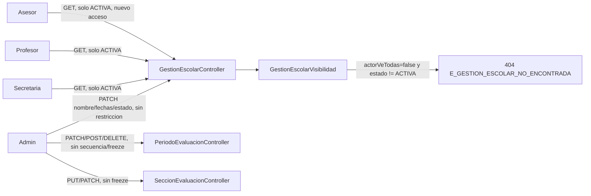

# Design Doc `DD-UC-019` — Académico: edición sin restricción de Periodos/Secciones por ADMIN y visibilidad de Gestión Escolar por rol

> **Qué es**: decimonoveno Design Doc de código, **primer feature de negocio sobre `academico` que no agrega un aggregate nuevo**, sino que relaja invariantes de flujo/edición ya implementadas (`DD-UC-015`/`DD-UC-016`) y añade una regla de visibilidad transversal por rol sobre `GestionEscolar`/`PeriodoEvaluacion`/`SeccionEvaluacion`. Crea `ADR-0014` (relaja `ADR-0013` §3.1.4/3.1.5/§3.2.2, sin superseder el resto).
>
> **Relación con otros documentos**: modifica el comportamiento de `DD-UC-008` (`GestionEscolar`), `DD-UC-015` (`PeriodoEvaluacion`) y `DD-UC-016` (`SeccionEvaluacion`). No toca `DD-UC-017`/`DD-UC-018` (Evaluaciones/Calificaciones) ni el Perfil Bolivia SIE. Alimenta el DTP vía `@dtp-sync` tras ejecutar `PR-IMPL-019`.

## 1. Objetivo y contexto

- **Qué resuelve este feature**: el negocio reportó dos necesidades reales sobre la consola de Gestión Escolar ya implementada:
  1. El `ADMIN` (Director) necesita poder editar nombre/fechas/estado de una `GestionEscolar`, `PeriodoEvaluacion` o `SeccionEvaluacion` **en cualquier momento**, sin las restricciones de secuencialidad/freeze introducidas en `DD-UC-015`/`DD-UC-016`.
  2. El resto de roles de tenant (`SECRETARIA`, `PROFESOR`, `ASESOR`) solo deben **ver** la gestión "actual" (`estado = ACTIVA`), no el histórico completo. `ASESOR` no tenía acceso alguno a este recurso antes.
- **Caso(s) de uso del FSD que implementa**: `FSD-UC-012` (Gestión Escolar), `FSD-UC-013` (Periodos de Evaluación), `FSD-UC-014` (Secciones de Evaluación) — modifica sus reglas de edición y añade una regla de visibilidad, sin cambiar su alcance funcional de fondo.
- **Alcance**:
  - **Dentro**:
    - `GestionEscolar`: mutabilidad de `nombre`/`fechaInicio`/`fechaFin` (`actualizarDatos()`), nuevo `PATCH /gestiones-escolares/{id}`; `cambiarEstado()` sin máquina de estados (cualquier transición desde cualquier estado).
    - `PeriodoEvaluacion.cambiarEstado()` sin secuencialidad (`E_PERIODO_NO_SECUENCIAL` eliminado); `Crear`/`Actualizar`/`Eliminar` sin freeze (`E_PERIODOS_INMUTABLES` eliminado).
    - `SeccionEvaluacion`: `Crear`/`Actualizar`/`Reemplazar` sin freeze sticky (`E_SECCIONES_INMUTABLES` eliminado).
    - Invariantes de integridad conservadas: suma de secciones = 100 (`E_SUMA_SECCIONES_INVALIDA`), no solape de fechas (`E_PERIODOS_SOLAPADOS`), al menos 1 periodo (`E_PERIODO_UNICO`).
    - `GestionEscolarVisibilidad` (helper de aplicación): `SECRETARIA`/`PROFESOR`/`ASESOR` solo ven `estado = ACTIVA`; `404` (no `403`) en detalle/sub-recursos si la gestión visible no es `ACTIVA`; filtro de listado forzado a `ACTIVA` para esos roles.
    - `ASESOR` gana acceso de lectura a `GET /gestiones-escolares`, `GET /{id}`, `GET /{id}/periodos`, `GET /{id}/secciones`.
    - `ADR-0014` (relaja `ADR-0013` §3.1.4/3.1.5/§3.2.2).
    - Frontend: rutas de Gestión Escolar abiertas a `SECRETARIA`/`PROFESOR`/`ASESOR` (solo lectura); enlace de nav "Gestión Escolar" visible para esos roles; UI de escritura (alta/edición/cambio de estado) oculta para no-`ADMIN`; nuevos diálogos de edición de nombre/fechas para `GestionEscolar` y `PeriodoEvaluacion`.
  - **Fuera**:
    - Cualquier cambio al motor de cálculo (`ADR-0013` §3.4, `CalculoNotas`, `DD-UC-018`) — sin tocar.
    - Recálculo retroactivo automático de notas `PROVISIONAL` si el `ADMIN` reabre un periodo o cambia secciones después de calificar (riesgo documentado en `ADR-0014` §4.2, no resuelto aquí).
    - Gobernanza (`audit_log`, `ADR-0009` §3 punto 5) — sigue pendiente.
    - Reordenar el campo `orden` de periodos/secciones vía drag&drop — no pedido.

## 2. Diseño (el "cómo") `[humano+máquina]`

- **Decisiones explícitas del usuario** (12/09/2026, vía preguntas estructuradas): (1) "gestión actual" = `estado == ACTIVA` exclusivamente (no combinado con periodo `ABIERTO`); (2) sí, el `ADMIN` puede bypasear las reglas de `ADR-0013` §3.1.4/3.1.5/§3.2.2; (3) sí, se necesita un nuevo `PATCH` para nombre/fechas de `GestionEscolar` (no existía).
- **Por qué eliminar en vez de relajar condicionalmente**: los tres flujos de escritura afectados ya eran exclusivamente `ADMIN` desde su implementación original (`DD-UC-015`/`016`). No hay ningún otro rol al que aplicarle la restricción — mantenerla solo añadía friction al único actor autorizado a decidir. Ver `ADR-0014` §3 para el análisis completo de alternativas.
- **Qué se conserva y por qué**: la suma de secciones = 100, el no-solape de fechas y el mínimo de 1 periodo **no** son restricciones de flujo/edición — son invariantes de **integridad del motor de cálculo** (`ADR-0013` §3.4): si se permitiera abrir un periodo con secciones que no sumen 100, o crear periodos con fechas solapadas, el cálculo de `nota_periodo`/`promedio_gestion` quedaría indefinido o ambiguo. Por eso se mantienen aunque el resto de restricciones se elimine.
- **`GestionEscolarVisibilidad`** (nueva clase package-private en `application/service/`, mismo patrón que `PeriodoEvaluacionPolitica`/`SeccionEvaluacionPolitica`):
  - `exigirVisible(GestionEscolar, boolean actorVeTodas)`: si `!actorVeTodas && estado != ACTIVA` → `GestionEscolarNoEncontradaException` (404, reutiliza la excepción existente — mismo patrón 404-no-403 que el aislamiento cross-tenant).
  - `filtroEfectivo(GestionEscolarFiltro, boolean actorVeTodas)`: si `!actorVeTodas`, ignora el `estado` solicitado y lo fuerza a `ACTIVA`.
- **Propagación de `actorVeTodas`**: se pasa como parámetro adicional (no se infiere del `SecurityContext` dentro del servicio, para mantener el dominio/aplicación libre de dependencias de Spring Security) desde el controlador (`ActorSeguridad.esAdmin(authentication)`, mismo helper ya usado por `EvaluacionController`) hacia las 4 interfaces de lectura: `ListarGestionesEscolaresUseCase`, `ObtenerGestionEscolarUseCase`, `ListarPeriodosEvaluacionUseCase`, `ListarSeccionesEvaluacionUseCase`.
- **`GestionEscolar.actualizarDatos(nombre, fechaInicio, fechaFin)`**: campos `null` conservan el valor actual (mismo patrón que `ActualizarPeriodoEvaluacionCommand` ya existente). Valida `fechaFin.isAfter(fechaInicio)` tras aplicar los defaults → `FechasInvalidasException` si no.
- **`cambiarEstado()` sin validación** en `GestionEscolar` y `PeriodoEvaluacion`: ambos pasan de un `switch` que lanzaba una excepción de transición inválida a una asignación directa (`Objects.requireNonNull` + `this.estado = nuevoEstado`). Las 5 excepciones de dominio correspondientes (`EstadoGestionEscolarInvalidoException`, `EstadoPeriodoEvaluacionInvalidoException`, `PeriodosInmutablesException`, `SeccionesInmutablesException`, `PeriodoNoSecuencialException`) se eliminan del código — no quedan referenciadas en ningún lugar.
- **RBAC**:
  - Lectura (`GET`): `ADMIN`, `SECRETARIA`, `PROFESOR`, `ASESOR` (los 4 sub-recursos de `GestionEscolarController`).
  - Escritura (`POST`/`PATCH`/`PUT`/`DELETE` de gestión/periodos/secciones): exclusivamente `ADMIN` (sin cambio respecto a `DD-UC-015`/`016`).
- **UI**:
  - `GestionesEscolaresListPage`: computed `esAdmin` desde `AuthService.hasRole('ADMIN')`. No-admin: sin botón "+ Nueva Gestión", sin filtro de `estado` (siempre se fuerza `ACTIVA` en el backend), sin columna de acciones de escritura, mensaje explicativo "Solo se muestra la gestión escolar actual". Admin: botón "Editar" nuevo (diálogo de nombre/fechas, `PATCH /{id}`) junto al ya existente "Cambiar estado" — este último ahora ofrece las 3 opciones de estado minus la actual (sin filtrar por transición válida, ya que cualquiera lo es).
  - `GestionPeriodosPage`: no-admin ve la tabla sin columna "Acciones" y sin el formulario "Nuevo periodo". Admin: nuevo botón "Editar" por fila (diálogo nombre/fechas, `PATCH /periodos-evaluacion/{id}`, endpoint ya existente desde `DD-UC-015` pero sin UI hasta ahora); "Abrir"/"Cerrar" ya no dependen de `puedeAbrir()`/`todosPendiente()` (se muestran según el estado actual del propio periodo); "Eliminar" siempre visible para admin (el servidor sigue rechazando con `E_PERIODO_UNICO` si es el último).
  - `GestionSeccionesPage`: no-admin ve la tabla de solo lectura (inputs `disabled`, sin botones "Añadir fila"/"Quitar"/"Guardar plantilla"); admin edita sin la antigua gating por `congelada()` (eliminada junto con el fetch de periodos que la calculaba).
  - Rutas (`app.routes.ts`): las 3 rutas de Gestión Escolar (lista, `:id/periodos`, `:id/secciones`) cambian `data: { role: 'ADMIN' }` → `data: { roles: ['ADMIN','SECRETARIA','PROFESOR','ASESOR'] }`. La ruta `/nuevo` sigue exclusiva de `ADMIN`.
  - `shell.component.ts`: el enlace "Gestión Escolar" se separa del bloque `ADMIN`-only y pasa a un condicional propio (`ADMIN` ∨ `SECRETARIA` ∨ `PROFESOR` ∨ `ASESOR`).
- **Componentes tocados**:

```
backend/src/main/java/com/edusync/academico/
├── domain/
│   ├── GestionEscolar.java                          (mutable nombre/fechas, actualizarDatos(), cambiarEstado() sin validación)
│   ├── PeriodoEvaluacion.java                       (cambiarEstado() sin validación)
│   ├── EstadoGestionEscolarInvalidoException.java   (eliminado)
│   ├── EstadoPeriodoEvaluacionInvalidoException.java (eliminado)
│   ├── PeriodosInmutablesException.java             (eliminado)
│   ├── SeccionesInmutablesException.java            (eliminado)
│   └── PeriodoNoSecuencialException.java            (eliminado)
├── application/
│   ├── port/in/
│   │   ├── ActualizarGestionEscolarUseCase.java     (nuevo)
│   │   ├── ActualizarGestionEscolarCommand.java     (nuevo)
│   │   ├── ObtenerGestionEscolarUseCase.java        (+actorVeTodas)
│   │   ├── ListarGestionesEscolaresUseCase.java     (+actorVeTodas)
│   │   ├── ListarPeriodosEvaluacionUseCase.java     (+actorVeTodas)
│   │   └── ListarSeccionesEvaluacionUseCase.java    (+actorVeTodas)
│   └── service/
│       ├── ActualizarGestionEscolarService.java     (nuevo)
│       ├── GestionEscolarVisibilidad.java           (nuevo)
│       ├── ObtenerGestionEscolarService.java        (delta)
│       ├── ListarGestionesEscolaresService.java     (delta)
│       ├── ListarPeriodosEvaluacionService.java     (delta)
│       ├── ListarSeccionesEvaluacionService.java    (delta)
│       ├── PeriodoEvaluacionPolitica.java           (reducida a exigirSinSolape)
│       ├── SeccionEvaluacionPolitica.java           (reducida a exigirSumaCien)
│       ├── Crear/Actualizar/EliminarPeriodoEvaluacionService.java (delta, sin freeze)
│       ├── CambiarEstadoPeriodoEvaluacionService.java (delta, sin secuencialidad)
│       └── Crear/Actualizar/ReemplazarSeccionesEvaluacionService.java (delta, sin freeze)
└── infrastructure/adapter/in/rest/
    ├── GestionEscolarController.java     (nuevo PATCH /{id}, +ASESOR en GET, Authentication en listar/obtener/periodos/secciones)
    ├── ActualizarGestionEscolarRequest.java (nuevo DTO)
    ├── PeriodoEvaluacionController.java   (limpieza de códigos muertos)
    └── SeccionEvaluacionController.java   (limpieza de códigos muertos)

frontend/src/app/
├── app.routes.ts                                  (delta: roles ampliados)
├── shared/layout/shell.component.ts               (delta: enlace Gestión Escolar)
└── features/academico/
    ├── gestiones-escolares-list.page.ts   (delta: esAdmin, diálogo Editar)
    ├── gestion-periodos.page.ts           (delta: esAdmin, diálogo Editar, sin gating)
    └── gestion-secciones.page.ts          (delta: esAdmin, sin congelada())
```

- **Contratos** (bajo `/api/v1`, delta sobre `DD-UC-015`/`016`):

  | Método | Ruta | Auth | Cambio |
  |--------|------|------|--------|
  | `PATCH` | `/gestiones-escolares/{id}` | ADMIN | **Nuevo**. `{nombre?, fechaInicio?, fechaFin?}` → `200 GestionEscolarResponse` / `404` / `422 E_FECHAS_INVALIDAS` |
  | `PATCH` | `/gestiones-escolares/{id}/estado` | ADMIN | Sin `422` (cualquier transición válida) |
  | `GET` | `/gestiones-escolares` | ADMIN, SECRETARIA, PROFESOR, **ASESOR** | No-admin: `estado` ignorado, forzado a `ACTIVA` |
  | `GET` | `/gestiones-escolares/{id}` | ADMIN, SECRETARIA, PROFESOR, **ASESOR** | No-admin + no `ACTIVA` → `404` |
  | `GET` | `/gestiones-escolares/{id}/periodos` | ADMIN, SECRETARIA, PROFESOR, **ASESOR** | idem |
  | `GET` | `/gestiones-escolares/{id}/secciones` | ADMIN, SECRETARIA, PROFESOR, **ASESOR** | idem |
  | `PATCH` | `/periodos-evaluacion/{id}/estado` | ADMIN | Sin `422 E_PERIODO_NO_SECUENCIAL` |
  | `POST` | `/gestiones-escolares/{id}/periodos` | ADMIN | Sin `422 E_PERIODOS_INMUTABLES` |
  | `PUT` | `/gestiones-escolares/{id}/secciones` | ADMIN | Sin `422 E_SECCIONES_INMUTABLES` |
  | `PATCH` | `/secciones-evaluacion/{id}` | ADMIN | Sin `422 E_SECCIONES_INMUTABLES` |

  HTTP 422 usa `HttpStatus.UNPROCESSABLE_CONTENT` (Spring Framework 7 / Boot 4.1).

- **Diagrama**:



## 3. Alternativas consideradas

Ver `ADR-0014` §2 (análisis completo de alternativas A/B/C).

| Alternativa | Pros | Contras | ¿Elegida? |
|-------------|------|---------|-----------|
| A. Endpoint de "reapertura" separado, reglas intactas | No reabre `ADR-0013` | No resuelve el pedido; multiplica casos especiales | no |
| B. Eliminar la máquina de estados/freeze/secuencialidad; conservar invariantes de integridad; añadir visibilidad `ACTIVA`-only | Resuelve el pedido exacto; endpoints ya `ADMIN`-only | Pierde el "snapshot congelado" (riesgo documentado, mitigado por RBAC) | **sí** |
| C. Freeze condicional por rol | — | Vacía: ya no hay a quién aplicarle la restricción | no |

## 4. Impacto en las specs vivas `[máquina]`

> Al **diseñar** este DD: DTP + PROMPT_MAPPING + `ADR-0014`. Al **ejecutar** `PR-IMPL-019`: FSD §4.6.2/§4.6.3/§4.6.4 (reglas de edición y visibilidad actualizadas).

| Artefacto vivo | Cambio | ¿Delta vs DTI vFinal? |
|----------------|--------|-----------------------|
| `docs/adr/0014-*.md` | Nuevo — relaja `ADR-0013` §3.1.4/3.1.5/§3.2.2 | no (extensión de la capa viva) |
| `docs/product/FSD.md` (`FSD-UC-012`/`013`/`014`) | Reglas de edición sin restricción + visibilidad `ACTIVA`-only documentadas | no |
| `docs/product/DTP.md` | Nueva fila §A.1; `ADR-0014` en §A.2 | no |
| `docs/PROMPT_MAPPING.md` | Fila `PR-IMPL-019` | no |
| Baseline `docs/baseline/**` | **No se toca** | — |

## 5. Prompts usados `[máquina]`

| Prompt | Tarea | Artefacto generado |
|--------|-------|--------------------|
| `PR-IMPL-019` | Código backend (dominio + aplicación + REST) + tests + frontend (rutas/UI) para la relajación de reglas y la visibilidad por rol | `backend/.../academico/**` (delta), `frontend/.../academico/**` (delta) |

## 6. Plan de pruebas y evals

- **Unit (dominio)**: `GestionEscolar` acepta cualquier transición incluida desde `CERRADA`; `actualizarDatos()` con campos parciales/completos, rechaza `fechaFin` no posterior; `PeriodoEvaluacion` acepta reabrir un `CERRADO`.
- **Unit (aplicación, Mockito)**: crear/abrir periodo con hermano `ABIERTO` ya no lanza excepción; `PUT`/`PATCH` de secciones con periodo `ABIERTO`/`CERRADO` ya no lanza excepción; suma ≠ 100 y solape siguen rechazando; `ListarGestionesEscolaresService` fuerza `estado=ACTIVA` cuando `actorVeTodas=false`.
- **Integration** (Testcontainers): apertura no secuencial de dos periodos consecutivos con éxito; alta de periodo con un hermano `ABIERTO` en `201`; PUT de secciones con periodo `ABIERTO`/`CERRADO` en `200`; transición directa `PLANIFICACION`→`CERRADA` en `200`; `ModularityTests` 7/7.
- **Frontend**: `ng build` verde; rutas de Gestión Escolar accesibles para los 4 roles; UI de escritura oculta para no-admin.
- **Gherkin** (FSD / PRD):

```gherkin
Escenario: El Admin reabre un periodo cerrado sin restricción de secuencia
  Dado un periodo T1 CERRADO y un periodo T2 PENDIENTE
  Cuando el Admin cambia el estado de T1 a ABIERTO
  Entonces la operación se acepta con HTTP 200

Escenario: Secretaria solo ve la gestión activa
  Dado una gestión "2026" en estado CERRADA y una gestión "2027" en estado ACTIVA
  Cuando la Secretaria lista las gestiones escolares
  Entonces solo aparece "2027"

Escenario: Profesor intenta ver el detalle de una gestión no activa
  Dado una gestión "2026" en estado PLANIFICACION
  Cuando el Profesor solicita el detalle de "2026"
  Entonces la respuesta es HTTP 404
```

- **Evals de IA**: no aplica.

## 7. Definition of Done (checklist)

- [x] `fsd_uc` declarado y enlazado (`FSD-UC-012`, `FSD-UC-013`, `FSD-UC-014`).
- [x] Diseño (§2) y alternativas (§3) documentados; `ADR-0014` creado.
- [x] §4 Impacto en specs vivas registrado (sin tocar el baseline).
- [x] Prompt `PR-IMPL-019` versionado en `docs/prompts/impl/` y en `PROMPT_MAPPING.md`.
- [x] Tests/evals definidos (§6) y pasando (`mvn test` 238/238, incluye `ModularityTests` 7/7; `ng build` verde).
- [x] DTP actualizado vía `dtp-sync` (`docs/product/DTP.md` v1.38→v1.39: §A.1 nueva fila, §A.2 delta 7 `ADR-0014`, §A.3 `FSD-UC-012`/`013`/`014` actualizados, §A.4 nuevo párrafo de trazabilidad; `docs/product/FSD.md` v2.14→v2.15: §4.6.2/§4.6.3/§4.6.4, BR-017/BR-018; `docs/PROMPT_MAPPING.md` v2.38→v2.39).
- [ ] PR declara prompts usados y archivos generados vs editados a mano (commit formal pendiente).

## 8. Versionado

| Versión | Fecha | Autor | Cambio |
|---------|-------|-------|--------|
| v1.0 | 12/09/2026 | Rodrigo Aspeti | Creación y ejecución en el mismo turno del decimonoveno Design Doc (`DD-UC-019`): elimina la máquina de estados/freeze/secuencialidad de `GestionEscolar`/`PeriodoEvaluacion`/`SeccionEvaluacion` (crea `ADR-0014`, relaja `ADR-0013` §3.1.4/3.1.5/§3.2.2), conservando las invariantes de integridad del motor de cálculo; añade visibilidad `ACTIVA`-only de `GestionEscolar` para `SECRETARIA`/`PROFESOR`/`ASESOR` (`ASESOR` gana acceso de lectura nuevo). `mvn test` 238/238; `ng build` verde. Estado `ejecutado`. |
