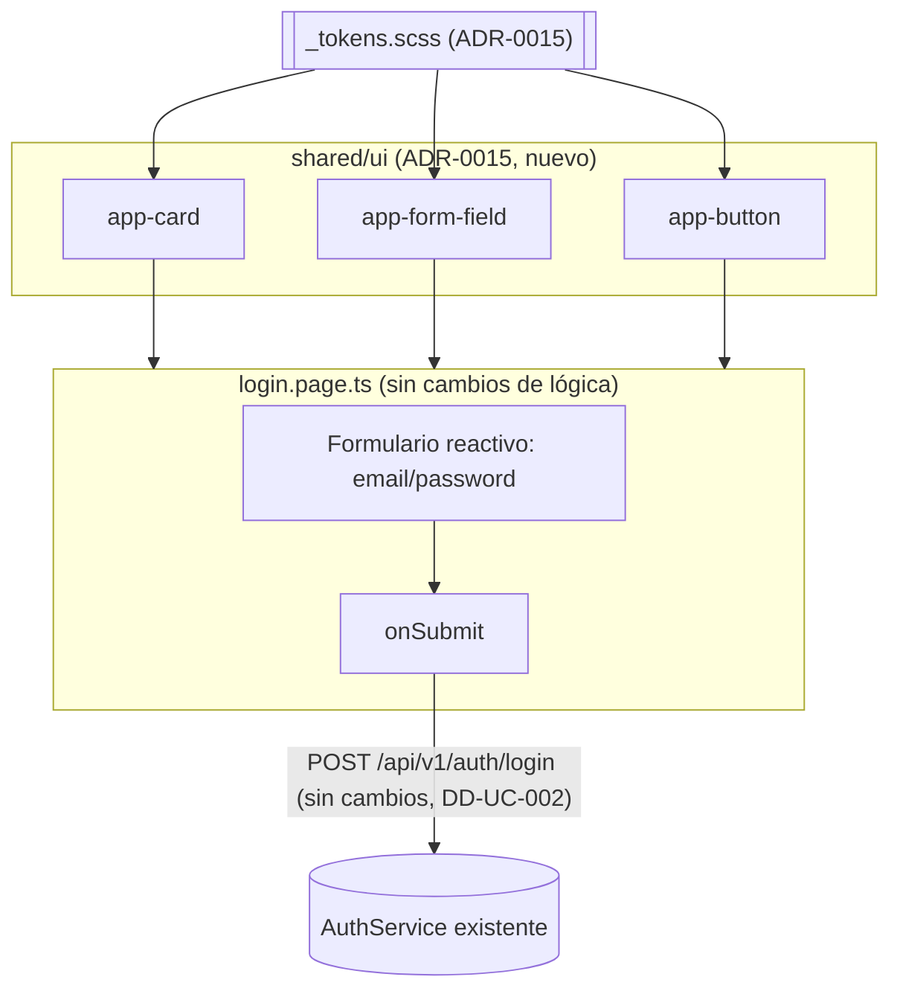

# Design Doc `DD-UC-020` — Rediseño visual del login

> **Qué es**: mejora **no funcional** sobre una pantalla ya implementada (`DD-UC-004`, "frontend login + consola SysAdmin", ejecutado 19/07/2026). No cambia el flujo de autenticación, los contratos REST ni el RBAC — solo su presentación visual, adoptando por primera vez el Design System propio decidido en `ADR-0015`. Es a `DD-UC-004` lo que `DD-UC-007` fue a `DD-UC-005`/`006`: una mejora transversal sobre un `FSD-UC` ya completo, que no cambia su estado.
>
> **Relación con otros documentos**: crea/consume `ADR-0015` (Design System visual EduSync, tokens + componentes compartidos). Modifica exclusivamente `frontend/src/app/features/auth/login.page.ts` (y sus estilos); no toca `core/auth/` (`AuthService`, interceptor, guards) ni ningún endpoint de `identidad`. Es el primer consumidor real de `ADR-0015` y sienta el precedente que reutilizarán los Design Docs de mejora visual siguientes sobre el resto de la consola.

## 1. Objetivo y contexto

- **Qué resuelve este feature**: la pantalla de login actual (`DD-UC-004`) se construyó "sin sistema de diseño" (decisión explícita heredada en `DD-UC-006` §2) — formulario simple sin marca, sin tarjeta, sin tipografía/paleta propias. El prototipo Figma ("Prototipo Administrativo", nodo `399:20447`, "Iniciar Sesión") define una versión con identidad de marca (`EduSync` + "Portal Académico"), tarjeta centrada con acento decorativo, microetiquetas de formulario y jerarquía tipográfica clara. Este Design Doc lleva esa pantalla exacta a producción, sin tocar la lógica de autenticación ya construida y probada.
- **Caso(s) de uso del FSD que implementa**: `FSD-UC-021` (Gestión de Usuarios y Roles, `docs/product/FSD.md#4611-fsd-uc-021---gestión-de-usuarios-y-roles`) — específicamente la superficie de login de `PRD-REQ-001`, ya completa en backend y UI desde `DD-UC-004`. Este DD no reabre `FSD-UC-021`; es una mejora de presentación sobre una capa ya cerrada, mismo precedente que `DD-UC-007` sobre `FSD-UC-011`/`FSD-UC-021`.
- **Alcance**:
  - **Dentro**: maquetación y estilos nuevos de `login.page.ts`/`.html`/`.scss` según el Figma: encabezado de marca fuera de la tarjeta (`EduSync` + "PORTAL ACADÉMICO"), tarjeta blanca centrada con acento decorativo tonal, heading "Bienvenido de nuevo" + subtítulo, campos "Correo electrónico"/"Contraseña" con microetiqueta en mayúsculas e ícono, botón primario de ancho completo "Iniciar Sesión", pie de página institucional (`EduSync Academic.` + enlaces Privacidad/Términos/Soporte/Contacto, estáticos). Primer uso real de los tokens/componentes de `ADR-0015` (`shared/ui/`: card, form-field, button).
  - **Fuera**:
    - Cualquier cambio a `AuthService`, al interceptor JWT, a los guards de rol o al contrato `POST /api/v1/auth/login` — permanecen exactamente como en `DD-UC-004`.
    - **Enlace "¿Olvidaste tu contraseña?"**: el Figma lo muestra, pero hoy no existe un flujo de restablecimiento **autoiniciado por email** — `FSD-UC-021` solo define `POST /usuarios/{id}/restablecer-password` disparado por el `ADMIN` (`DD-UC-005`), no una solicitud pública por email. Este DD renderiza el enlace (fidelidad visual al Figma) pero lo deja deshabilitado/informativo ("Contacta a tu administrador para restablecer tu contraseña"); habilitarlo de verdad requiere un `FSD-UC` nuevo (flujo público de "olvidé mi contraseña" por email), fuera de alcance aquí.
    - **"¿Nuevo en la plataforma? Solicitar acceso institucional"**: el Figma lo muestra bajo la tarjeta; hoy no existe autoregistro de instituciones (los `Tenant` los da de alta el `SysAdmin`, `FSD-UC-011`). Se renderiza como texto estático con un `mailto:`/enlace de contacto, sin formulario ni backend nuevo.
    - Migración visual de cualquier otra pantalla (consola SysAdmin, Usuarios, Académico) — cada una es un Design Doc de UI propio y posterior (ver `ADR-0015` §4.2).
    - Modo oscuro / temas — el Figma revisado no lo define; no se inventa.

## 2. Diseño (el "cómo") `[humano+máquina]`

- **Enfoque elegido**: reescritura del template/estilos de `LoginPageComponent` (Angular 21, *standalone*, reactive forms — sin cambiar su lógica de envío) consumiendo por primera vez los tokens y componentes compartidos de `ADR-0015`. Sin librería de terceros (Alternativa C de `ADR-0015`).
- **Componentes tocados**:

```
frontend/src/
├── styles/
│   └── _tokens.scss                          (NUEVO — ADR-0015: color, tipografía, espaciado, radios, sombra, extraídos del Figma)
└── app/
    ├── shared/
    │   └── ui/                               (NUEVO — ADR-0015, primer set mínimo)
    │       ├── card/card.component.ts        (tarjeta blanca con sombra + acento decorativo opcional)
    │       ├── form-field/form-field.component.ts   (label mayúscula + input + ícono a la derecha)
    │       └── button/button.component.ts    (variantes primary/secondary, ancho completo opcional)
    └── features/auth/
        ├── login.page.ts                     (DELTA — usa Card/FormField/Button de shared/ui/; sin cambios en el submit/AuthService)
        ├── login.page.html                   (DELTA — nueva maqueta: header de marca, card, heading, form, footer)
        └── login.page.scss                   (DELTA — reemplaza estilos ad-hoc por tokens de ADR-0015)
```

  Sin cambios en `core/auth/` (`AuthService`, `auth.interceptor.ts`, `role.guard.ts`) ni en ningún archivo de `backend/`.

- **Contratos y tipos**: sin cambios. `POST /api/v1/auth/login` (`{email, password}` → `{token}`, `DD-UC-002`) permanece idéntico; este DD es puramente de presentación.
- **Detalle visual (fidelidad al Figma, nodo `399:20447`)**:
  - Encabezado de marca (fuera de la tarjeta, alineado a la izquierda del contenedor): wordmark `EduSync` + microetiqueta `PORTAL ACADÉMICO` debajo.
  - Tarjeta (`app-card`) centrada, ancho máximo ~448px, fondo blanco, sombra suave, esquina superior derecha con acento decorativo tonal (`rounded-rectangle`, semi-transparente, recortado por el borde de la tarjeta — puramente estético, `aria-hidden`).
  - Heading `Bienvenido de nuevo` (h1) + párrafo `Ingresa tus credenciales institucionales para acceder a tu panel académico.`
  - Campo `Correo electrónico`: microetiqueta `CORREO ELECTRÓNICO` en mayúsculas, input con placeholder de ejemplo institucional, ícono `@` a la derecha (decorativo, no interactivo).
  - Campo `Contraseña`: microetiqueta `CONTRASEÑA`, input `type="password"`, ícono de candado a la derecha (decorativo).
  - Botón primario `app-button` variante `primary`, ancho completo, texto `Iniciar Sesión`, azul marino (token `--color-primary`).
  - Enlace secundario centrado `¿Olvidaste tu contraseña?` — ver §1 "Fuera de alcance" (informativo, no funcional en este DD).
  - Bajo la tarjeta: texto `¿Nuevo en la plataforma?` + enlace `Solicitar acceso institucional` (estático, ver §1).
  - Pie de página fijo: `EduSync Academic.` + enlaces `Privacidad · Términos · Soporte · Contacto` (estáticos, sin rutas nuevas) + copyright.
- **Diagrama**:



## 3. Alternativas consideradas

> La decisión de fondo (tokens propios vs. librería de terceros) se evaluó en `ADR-0015`, no se repite aquí. Este DD añade una única decisión de alcance, de bajo riesgo:

| Alternativa | Pros | Contras | ¿Elegida? |
|-------------|------|---------|-----------|
| A. Implementar también "¿Olvidaste tu contraseña?" como flujo funcional completo (nuevo `FSD-UC` de reset por email) en este mismo DD | Fidelidad funcional total al Figma | Mezcla una mejora visual (bajo riesgo) con una feature nueva de backend (envío de email, tokens públicos, `FSD-UC` sin definir todavía) en un mismo DD; viola el principio de "un DD, un *vertical slice*" | no |
| B. Renderizar el login exactamente como en A, pero dejando el enlace de "olvidé mi contraseña" y "solicitar acceso" como elementos visuales informativos/deshabilitados, documentando la brecha funcional explícitamente | Cumple el pedido real ("mejorar la UI según el Figma") sin inventar alcance de backend no pedido ni definido; deja un gap claro y trazable para un `FSD-UC` futuro | El login no queda 100 % funcional según lo que el Figma insinúa visualmente | **sí** |

## 4. Impacto en las specs vivas `[máquina]`

| Artefacto vivo | Cambio | ¿Delta vs DTI vFinal? |
|----------------|--------|-----------------------|
| `docs/adr/0015-*.md` | Nuevo — adopción de Design System visual propio (tokens + `shared/ui/`), sin librería de terceros | no (decisión de presentación, no de arquitectura de dominio) |
| `docs/product/FSD.md` (`FSD-UC-021`) | Sin cambio de flujo/criterios — la superficie de login sigue siendo la misma; se podría anotar en una nota de implementación que la UI fue re-diseñada (`DD-UC-020`), sin alterar el texto normativo | no |
| `docs/product/DTP.md` | Nueva fila §A.1 (este Design Doc); `ADR-0015` en §A.2 como decisión no-delta; `FSD-UC-021` permanece **completo**, gana `DD-UC-020` en su lista de Design Docs (mismo patrón que `DD-UC-007`/`019` sobre UCs ya cerrados) | no |
| `docs/PROMPT_MAPPING.md` | Sin fila nueva todavía — se añade cuando se cree `PR-IMPL-020` (ver §5) | no |
| Baseline `docs/baseline/**` | **No se toca** | — |

> **Recordatorio (regla de oro)**: el baseline congelado de M4 (`docs/baseline/`) no se toca. Los cambios de esta sección viven en `docs/product/`, `docs/adr/` y `docs/design/`.

## 5. Prompts usados `[máquina]`

| Prompt | Tarea | Artefacto generado |
|--------|-------|--------------------|
| `PR-IMPL-020` | Implementación Angular de `_tokens.scss`, `shared/ui/{card,form-field,button}` y el rediseño de `login.page.ts/html/scss` según §2 | `frontend/src/styles/_tokens.scss`, `frontend/src/app/shared/ui/**`, `frontend/src/app/features/auth/login.page.*` (delta) |

> Prompt versionado en [`docs/prompts/impl/PR-IMPL-020.md`](../prompts/impl/PR-IMPL-020.md), estado **Ejecutado** (v0.2): `_tokens.scss`, `shared/ui/{card,form-field,button}` y `login.page.ts` generados. Verificación de `ng build` realizada con un *workspace* Angular 21.2.23 aislado (mismas versiones de `package.json`, `AuthService` real sin editar) mientras `device_bash` en la máquina del usuario sigue bloqueado — ver §8 v0.3.

## 6. Plan de pruebas y evals

- **Unit**: sin cambios en `AuthService`/lógica de envío — no requiere tests nuevos de dominio/aplicación (no se tocan). Si `shared/ui/` components tienen lógica propia (ej. `form-field` con estado de error), tests de componente Angular (`@angular/testing`) mínimos por componente nuevo.
- **Integration**: ninguna — no hay contrato REST nuevo ni modificado.
- **E2E / Gherkin**: no aplica — este DD no cambia criterios de aceptación funcionales de `FSD-UC-021`; los Gherkin de login siguen siendo los de `DD-UC-002`/`004`, verificados por el flujo de autenticación existente (sin cambios).
- **Verificación visual** (específica de este DD, ver `ADR-0015` §7): comparación manual pantalla-a-pantalla contra el Figma (nodo `399:20447`) tras `PR-IMPL-020`; `ng build` en verde (único gate automatizado, `CLAUDE.md` "Guardrails no negociables" punto 4).
- **Evals de IA**: no aplica.

## 7. Definition of Done (checklist)

- [x] `fsd_uc` declarado y enlazado (`FSD-UC-021`).
- [x] Diseño (§2) y alternativas (§3) documentados.
- [x] ADR creado/enlazado — `ADR-0015` (adopción de Design System visual propio).
- [x] §4 Impacto en specs vivas registrado (sin tocar el baseline).
- [x] Prompt(s) versionado(s) en `docs/prompts/impl/` y en `PROMPT_MAPPING.md` — `PR-IMPL-020` **ejecutado** (v0.2).
- [x] Tests/evals definidos y pasando — sin unit tests nuevos (no hay lógica de dominio nueva, ver §6); gate de `ng build` verificado en un *workspace* Angular 21.2.23 aislado (mismas versiones, `AuthService` real). `ng build` real sobre el repo del usuario pendiente por el bloqueo de `device_bash` (ver §8 v0.3).
- [x] DTP actualizado (changelog + estado del FSD-UC) vía `dtp-sync` — `docs/product/DTP.md` v1.39 → v1.40.
- [ ] PR declara: prompts usados, archivos generados vs editados a mano — pendiente de commit formal (no solicitado en este turno).

## 8. Registro de cambios

| Versión | Fecha | Autor | Cambio |
|---------|-------|-------|--------|
| v0.1 | 13/09/2026 | Rodrigo Aspeti | Creación del Design Doc (`DD-UC-020`, estado `borrador`): rediseño visual del login según el prototipo Figma "Prototipo Administrativo" (nodo `399:20447`). Crea `ADR-0015` (adopción de Design System visual propio: tokens + `shared/ui/`, sin librería de terceros). Documenta explícitamente fuera de alcance el flujo funcional de "olvidé mi contraseña" (autoiniciado por email) y el autoregistro de instituciones ("solicitar acceso institucional"), ambos insinuados visualmente por el Figma pero sin `FSD-UC` que los respalde hoy. |
| v0.2 | 13/09/2026 | Rodrigo Aspeti | Estado `borrador` → **aprobado**. Creado `PR-IMPL-020` (estado Aprobado (prompt), ejecución pendiente) y registrado en `docs/PROMPT_MAPPING.md` (índice, flowchart, matriz `dev-agent`, contrato inline, trazabilidad, historial `v2.40`). §5 y checklist §7 actualizados. Pendiente: ejecución real de `PR-IMPL-020` (código Angular) y `dtp-sync` posterior. |
| v0.3 | 13/09/2026 | Rodrigo Aspeti | Creado y registrado `PR-ADR-008` (formaliza `ADR-0015` en `docs/PROMPT_MAPPING.md`, cierra la simetría de registro con `PR-ADR-006`/`007`; historial `v2.41`). **Ejecutado `PR-IMPL-020`** (v0.2): `frontend/src/styles/_tokens.scss` (nuevo), `frontend/src/app/shared/ui/{card,form-field,button}` (nuevos), `login.page.ts` reescrito — `FormGroup`/`onSubmit()`/`AuthService.login()` y el contrato `POST /api/v1/auth/login` sin cambios. Verificación: `device_bash` en la máquina del usuario sigue bloqueado (incidente de montaje de Windows del 8/09/2026); se validó con un *workspace* Angular 21.2.23 aislado (mismas versiones de `package.json`, `AuthService`/`jwt.util.ts` reales sin editar, `strictTemplates` activo) — build verde, sin errores. `ng build` real sobre el repo del usuario queda pendiente de confirmación. `docs/product/DTP.md` sincronizado (`dtp-sync`, v1.39 → v1.40). Checklist §7 actualizado. |
