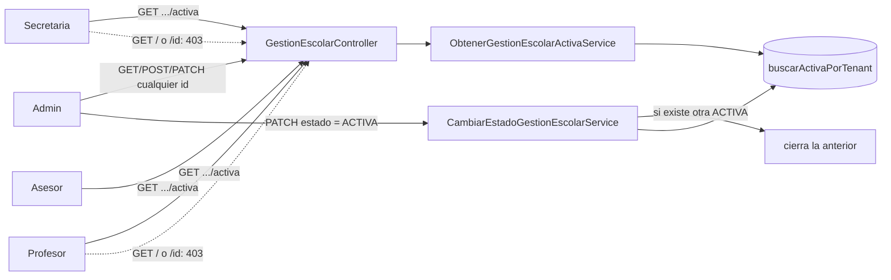

# Design Doc `DD-UC-021` — Académico: invariante de unicidad de Gestión Escolar ACTIVA y acceso implícito por rol

> **Qué es**: vigésimo primer Design Doc de código, **corrección de una regla de visibilidad recién introducida** (`DD-UC-019`/`ADR-0014` §3.3): `SECRETARIA`/`PROFESOR`/`ASESOR` seguían pudiendo listar y ver por id la `GestionEscolar` (aunque acotado a `ACTIVA`); el negocio aclaró que no deben tener ninguna superficie propia de Gestión Escolar. Introduce además una invariante de dominio que no existía: como máximo una `GestionEscolar` `ACTIVA` por tenant. Crea `ADR-0016` (reemplaza `ADR-0014` §3.3, no reabre el resto de `ADR-0014`/`ADR-0013`).
>
> **Relación con otros documentos**: revierte parcialmente `DD-UC-019` (acceso de lectura por rol sobre `GestionEscolar`/`PeriodoEvaluacion`/`SeccionEvaluacion`); consume `DD-UC-008` (`GestionEscolar`), `DD-UC-015` (`PeriodoEvaluacion`), `DD-UC-016` (`SeccionEvaluacion`), `DD-UC-017` (Evaluaciones — consumidor de "la gestión actual"), `DD-UC-013` (Inscripciones — consumidor de "la gestión actual"). No toca `DD-UC-018` (Calificaciones/`CalculoNotas`) ni el Perfil Bolivia SIE.

## 1. Objetivo y contexto

- **Qué resuelve este feature**: probando el flujo real de `PROFESOR` sobre `DD-UC-019` ya ejecutado, el negocio reportó (verbatim, 13/09/2026): *"el profesor no puede modificar ni ver la gestión escolar, tampoco seleccionar la gestión escolar al momento de ingresar a los cursos, es por eso que solo puede haber una gestión escolar activa y todos los datos se muestran de esa gestión escolar, no de otra"*. Esto reveló dos problemas concretos:
  1. `DD-UC-019` dejó a `PROFESOR`/`SECRETARIA`/`ASESOR` con acceso de **lectura** a listar/ver Gestión Escolar (acotado a `ACTIVA`) — el negocio quiere **cero** superficie propia de este recurso para esos roles.
  2. El backend nunca garantizaba que hubiera como máximo una `GestionEscolar` `ACTIVA` por tenant. Sin esa garantía, "la gestión actual" que debían consumir `materia-evaluaciones.page.ts` (evaluaciones de una materia, `PROFESOR`) y `estudiante-detalle.page.ts` (inscripción de un estudiante, `SECRETARIA`) era ambigua — y, de hecho, ambas pantallas todavía llamaban a `GET /gestiones-escolares` (ahora exclusivo `ADMIN` desde este mismo DD) para poblar un selector manual, lo que las habría roto en producción para `PROFESOR`/`SECRETARIA`.
- **Caso(s) de uso del FSD que implementa**: `FSD-UC-012` (Gestión Escolar), `FSD-UC-013` (Periodos de Evaluación), `FSD-UC-014` (Secciones de Evaluación) — endurece su regla de visibilidad. `FSD-UC-015` (Evaluaciones) — corrige el consumo implícito de "la gestión actual" desde la pantalla de `PROFESOR`, sin cambiar su alcance funcional de fondo.
- **Alcance**:
  - **Dentro**:
    - Invariante de dominio (aplicación): como máximo una `GestionEscolar.ACTIVA` por tenant; auto-cierre de la anterior al activar una nueva, en la misma transacción (`CambiarEstadoGestionEscolarService`).
    - Nuevo puerto/servicio `ObtenerGestionEscolarActivaUseCase`/`Service`: resuelve la única gestión `ACTIVA` del tenant (`404 E_GESTION_ESCOLAR_NO_ENCONTRADA` si ninguna lo está).
    - Nuevos endpoints `GET /gestiones-escolares/activa[, /periodos, /secciones]`, accesibles a `ADMIN`/`SECRETARIA`/`PROFESOR`/`ASESOR`.
    - `GET /gestiones-escolares`, `GET /{id}`, `GET /{id}/periodos`, `GET /{id}/secciones` pasan a ser **exclusivos `ADMIN`** (`403` para el resto de roles) — revierte el `hasAnyRole('ADMIN','SECRETARIA','PROFESOR','ASESOR')` de `DD-UC-019`.
    - Eliminación de `GestionEscolarVisibilidad` y del parámetro `actorVeTodas` en `ListarGestionesEscolaresUseCase`/`ObtenerGestionEscolarUseCase`/`ListarPeriodosEvaluacionUseCase`/`ListarSeccionesEvaluacionUseCase` — ya no hace falta, esos casos de uso son exclusivamente `ADMIN`.
    - Frontend: `app.routes.ts` (rutas de Gestión Escolar vuelven a `role: 'ADMIN'`), `shell.component.ts` (enlace "Gestión Escolar" vuelve a ser exclusivo `ADMIN`), `materia-evaluaciones.page.ts` (elimina el selector de gestión para `PROFESOR`, resuelve `.../activa` implícitamente, autoselecciona el periodo `ABIERTO` único o muestra un selector de periodo si no hay exactamente uno), `estudiante-detalle.page.ts` (elimina el selector de gestión para `SECRETARIA` al inscribir, resuelve `.../activa` implícitamente).
    - `ADR-0016` (reemplaza `ADR-0014` §3.3).
  - **Fuera**:
    - Cualquier cambio al motor de cálculo (`ADR-0013` §3.4, `CalculoNotas`, `DD-UC-018`).
    - Reabrir la edición sin restricción de `ADR-0014` §3.1/§3.2 (nombre/fechas/estado por `ADMIN`) — sin cambio.
    - Gobernanza (`audit_log`, `ADR-0009` §3 punto 5) — sigue pendiente.
    - Permitir explícitamente dos `GestionEscolar` `ACTIVA` en paralelo — descartado (`ADR-0016` §2, Alternativa B).
    - Vista de "histórico" de gestiones cerradas para roles no administrativos — no pedida; `ADR-0016` §6 la deja como plan B futuro si se necesita.

## 2. Diseño (el "cómo") `[humano+máquina]`

- **Decisiones explícitas del usuario** (13/09/2026, vía preguntas estructuradas):
  1. `conflicto_activa` = `auto_cerrar` — al activar una segunda gestión mientras otra está `ACTIVA`, la primera se cierra automáticamente (no un error `409`).
  2. `acceso_secretaria_asesor` = `todos` — la revocación de acceso directo a Gestión Escolar aplica también a `SECRETARIA`/`ASESOR`, no solo a `PROFESOR`.
  3. `periodo_default_profesor` = `abierto_o_selector_periodo` — dentro de la gestión activa, autoseleccionar el periodo `ABIERTO` si existe exactamente uno; en cualquier otro caso, mostrar solo un selector de periodo (nunca de gestión).
- **Invariante de unicidad** (`GestionEscolarRepositoryPort.buscarActivaPorTenant`, nueva query JPA `findFirstByTenantIdAndEstado`): `CambiarEstadoGestionEscolarService.cambiarEstado()` — si `nuevoEstado == ACTIVA`, busca la otra gestión `ACTIVA` del tenant (si no es la misma `id`) y la cierra (`CERRADA`) antes de aplicar la transición solicitada, en la misma transacción `@Transactional`. Reactivar la misma gestión no se cierra a sí misma. Transicionar a `PLANIFICACION`/`CERRADA` no dispara la búsqueda.
- **`ObtenerGestionEscolarActivaUseCase`/`Service`**: puerto de entrada nuevo, análogo a `ObtenerGestionEscolarUseCase` pero sin `id` (lo resuelve server-side) y sin el parámetro `actorVeTodas` (siempre resuelve `ACTIVA`, cualquiera que sea el rol que lo invoque). `404 E_GESTION_ESCOLAR_NO_ENCONTRADA` si `buscarActivaPorTenant` devuelve vacío.
- **Por qué revertir en vez de mantener `DD-UC-019` y solo ajustar**: la regla de negocio real ("el profesor no puede ver la gestión escolar") es incompatible con cualquier acceso de lectura directo por id/lista — no es un ajuste del filtro, es la eliminación completa de esa superficie para esos roles. Mantener `GestionEscolarVisibilidad` con `actorVeTodas` ya no tenía sentido una vez que los 4 casos de uso de lectura que la usaban pasan a ser exclusivamente `ADMIN` — se eliminó en vez de dejarla como código muerto.
- **RBAC** (delta sobre `DD-UC-019`):
  - `GET /gestiones-escolares[, /{id}, /{id}/periodos, /{id}/secciones]`: `ADMIN` únicamente (antes: +`SECRETARIA`/`PROFESOR`/`ASESOR`).
  - `GET /gestiones-escolares/activa[, /periodos, /secciones]` (nuevo): `ADMIN`, `SECRETARIA`, `PROFESOR`, `ASESOR`.
  - Escritura (`POST`/`PATCH`/`PUT`/`DELETE`): sin cambio, exclusivamente `ADMIN` (`ADR-0014` §3.1).
- **UI — `materia-evaluaciones.page.ts`** (`ADMIN`+`PROFESOR`, ruta compartida): `esAdmin()` decide la rama.
  - `ADMIN`: sin cambio — selector manual de "Gestión escolar" (`GET /gestiones-escolares`) + selector de "Periodo" (`GET /gestiones-escolares/{id}/periodos`), autoselecciona el primer `ABIERTO` o el primero de la lista.
  - `PROFESOR`: sin selector de gestión. `ngOnInit` llama `GET /gestiones-escolares/activa`; si `404`, muestra "No hay una gestión escolar activa en este momento. Contacta al administrador." y no carga nada más. Si `200`, carga periodos/secciones vía `GET /gestiones-escolares/activa/periodos[,/secciones]` y aplica la regla de periodo por defecto: si hay exactamente un `ABIERTO`, se autoselecciona y se muestra como texto "Periodo actual: `<nombre>` (ABIERTO)" sin selector; si no, se muestra un `<select>` de periodo (sin selector de gestión, nunca).
- **UI — `estudiante-detalle.page.ts`** (`ADMIN`+`SECRETARIA`, ruta compartida): `esAdmin()` decide la rama del formulario "Nueva inscripción".
  - `ADMIN`: sin cambio — selector manual de "Gestión escolar" (`GET /gestiones-escolares`).
  - `SECRETARIA`: sin selector. `cargarCatalogos()` llama `GET /gestiones-escolares/activa`; si `200`, fija `gestionSeleccionadaId` a esa gestión y muestra "Gestión escolar actual: `<nombre>`" como texto; si `404`, oculta el formulario completo con el mensaje "No hay una gestión escolar activa en este momento. Contacta al administrador para inscribir estudiantes." (no se puede inscribir sin gestión activa).
  - La tabla de historial de inscripciones (`nombreGestion(gestionId)`) sigue funcionando para la gestión activa; para inscripciones de gestiones ya `CERRADA` que `SECRETARIA` no puede resolver por nombre, se muestra el id crudo como fallback — trade-off aceptado, no bloqueante (no hay endpoint de "histórico" para este rol, `ADR-0016` §1 Fuera de alcance).
- **Componentes tocados**:

```
backend/src/main/java/com/edusync/academico/
├── application/
│   ├── port/out/GestionEscolarRepositoryPort.java        (+buscarActivaPorTenant)
│   ├── port/in/
│   │   ├── ObtenerGestionEscolarActivaUseCase.java       (nuevo)
│   │   ├── ObtenerGestionEscolarUseCase.java             (-actorVeTodas)
│   │   ├── ListarGestionesEscolaresUseCase.java          (-actorVeTodas)
│   │   ├── ListarPeriodosEvaluacionUseCase.java          (-actorVeTodas)
│   │   └── ListarSeccionesEvaluacionUseCase.java         (-actorVeTodas)
│   └── service/
│       ├── ObtenerGestionEscolarActivaService.java       (nuevo)
│       ├── CambiarEstadoGestionEscolarService.java       (+auto-cierre)
│       ├── ObtenerGestionEscolarService.java             (delta, sin GestionEscolarVisibilidad)
│       ├── ListarGestionesEscolaresService.java          (delta)
│       ├── ListarPeriodosEvaluacionService.java          (delta)
│       ├── ListarSeccionesEvaluacionService.java         (delta)
│       └── GestionEscolarVisibilidad.java                (eliminado)
└── infrastructure/adapter/
    ├── in/rest/GestionEscolarController.java              (GET .../activa nuevos; GET/{id}/... vuelven a ADMIN-only)
    └── out/persistence/
        ├── GestionEscolarJpaRepository.java               (+findFirstByTenantIdAndEstado)
        └── GestionEscolarRepositoryAdapter.java            (+buscarActivaPorTenant)

frontend/src/app/
├── app.routes.ts                                          (delta: roles revertidos a ADMIN-only)
├── shared/layout/shell.component.ts                        (delta: enlace Gestión Escolar vuelve a ADMIN-only)
└── features/academico/
    ├── materia-evaluaciones.page.ts   (delta: sin selector de gestión para PROFESOR, .../activa, periodo por defecto)
    └── estudiante-detalle.page.ts     (delta: sin selector de gestión para SECRETARIA, .../activa)
```

- **Contratos** (bajo `/api/v1`, delta sobre `DD-UC-019`):

  | Método | Ruta | Auth | Cambio |
  |--------|------|------|--------|
  | `GET` | `/gestiones-escolares/activa` | ADMIN, SECRETARIA, PROFESOR, ASESOR | **Nuevo**. Resuelve la única `ACTIVA` del tenant → `200 GestionEscolarResponse` / `404 E_GESTION_ESCOLAR_NO_ENCONTRADA` |
  | `GET` | `/gestiones-escolares/activa/periodos` | ADMIN, SECRETARIA, PROFESOR, ASESOR | **Nuevo**. Periodos de la gestión `ACTIVA` (sin paginar) |
  | `GET` | `/gestiones-escolares/activa/secciones` | ADMIN, SECRETARIA, PROFESOR, ASESOR | **Nuevo**. Secciones de la gestión `ACTIVA` (sin paginar) |
  | `GET` | `/gestiones-escolares` | **ADMIN** (antes +SECRETARIA/PROFESOR/ASESOR) | No-admin: `403` (antes `200` forzado a `ACTIVA`) |
  | `GET` | `/gestiones-escolares/{id}` | **ADMIN** | No-admin: `403` (antes `404` si no `ACTIVA`) |
  | `GET` | `/gestiones-escolares/{id}/periodos` | **ADMIN** | idem |
  | `GET` | `/gestiones-escolares/{id}/secciones` | **ADMIN** | idem |
  | `PATCH` | `/gestiones-escolares/{id}/estado` | ADMIN | Al activar, auto-cierra cualquier otra `ACTIVA` del tenant (nuevo efecto colateral, misma transacción) |

  HTTP 422/404/403 sin cambio de convención (`HttpStatus.UNPROCESSABLE_CONTENT`, patrón 404-no-403 cross-tenant intacto).

- **Diagrama**:



## 3. Alternativas consideradas

Ver `ADR-0016` §2 (análisis completo de alternativas A/B/C).

| Alternativa | Pros | Contras | ¿Elegida? |
|-------------|------|---------|-----------|
| A. Mantener `DD-UC-019`/`ADR-0014` §3.3 sin cambios | Ya implementado | No resuelve el pedido: `PROFESOR` sigue teniendo una superficie de Gestión Escolar | no |
| B. Permitir múltiples `ACTIVA` simultáneas, resolver "la actual" con un criterio de desempate | Sin invariante nueva | Ambigüedad de negocio real; complica el criterio sin necesidad | no |
| C. Invariante de unicidad (auto-cierre) + revocación total de lectura directa + endpoint `.../activa` | Resuelve el pedido exacto; "la gestión actual" queda inequívoca por construcción | `ADMIN` pierde la posibilidad de dos `ACTIVA` en paralelo (no pedida hoy) | **sí** |

## 4. Impacto en las specs vivas `[máquina]`

> Al **diseñar** este DD: DTP + PROMPT_MAPPING + `ADR-0016`. Al **ejecutar** `PR-IMPL-021`: código real backend+frontend, `mvn test`/`ng build` verificados.

| Artefacto vivo | Cambio | ¿Delta vs DTI vFinal? |
|----------------|--------|-----------------------|
| `docs/adr/0016-*.md` | Nuevo — reemplaza `ADR-0014` §3.3 (visibilidad `ACTIVA`-only de solo lectura → acceso implícito exclusivo, sin lectura directa) | no (extensión de la capa viva) |
| `docs/adr/0014-*.md` | §9 Historial: nota de redirección (sin reescritura retroactiva de §3.3) | no |
| `docs/product/FSD.md` (`FSD-UC-012`/`013`/`014`/`015`) | Regla de visibilidad endurecida (sin acceso de lectura directo para no-`ADMIN`); nota de consumo implícito en `FSD-UC-015` | no |
| `docs/product/DTP.md` | Nueva fila §A.1; `ADR-0016` en §A.2 | no |
| `docs/PROMPT_MAPPING.md` | Filas `PR-IMPL-021`, `PR-ADR-009` | no |
| Baseline `docs/baseline/**` | **No se toca** | — |

## 5. Prompts usados `[máquina]`

| Prompt | Tarea | Artefacto generado |
|--------|-------|--------------------|
| `PR-IMPL-021` | Código backend (invariante de unicidad + endpoint `.../activa` + revocación RBAC) + tests + frontend (`materia-evaluaciones.page.ts`/`estudiante-detalle.page.ts` sin selector de gestión para no-`ADMIN`) | `backend/.../academico/**` (delta), `frontend/.../academico/**` (delta) |
| `PR-ADR-009` | Formalización de `ADR-0016` en `docs/PROMPT_MAPPING.md` | `docs/PROMPT_MAPPING.md`, `prompts/PR-ADR-009.md` |

> Prompts versionados en [`docs/prompts/impl/PR-IMPL-021.md`](../prompts/impl/PR-IMPL-021.md) y [`prompts/PR-ADR-009.md`](../../prompts/PR-ADR-009.md), ambos estado **Ejecutado/Aprobado**.

## 6. Plan de pruebas y evals

- **Unit (aplicación, Mockito)**: `CambiarEstadoGestionEscolarServiceTest` — activar una gestión cierra automáticamente la otra `ACTIVA` del tenant; reactivar la misma gestión no se cierra a sí misma; transicionar a un estado distinto de `ACTIVA` no dispara la búsqueda. `ObtenerGestionEscolarActivaServiceTest` (nuevo) — devuelve la única `ACTIVA`; lanza `GestionEscolarNoEncontradaException` si ninguna lo está. `ListarGestionesEscolaresServiceTest` — delega filtro/paginación sin modificarlos (ya no hay rol que fuerce `ACTIVA` aquí).
- **Integration (Testcontainers)**: `GestionEscolarIntegrationTest` — `activarSegundaGestionCierraAutomaticamenteLaPrimeraDelTenant` (auto-cierre end-to-end); `profesorNoListaNiEligeYSoloVeLaGestionActivaViaEndpointActiva` (`403` en lista/detalle, `404` en `.../activa` sin gestión activa, `200` con la gestión correcta y sus 3 periodos seed una vez activada).
- **E2E / Gherkin**: no aplica — sin cambio de criterios de aceptación funcionales más allá de la regla de visibilidad, ya cubierta por los tests de integración.
- **Evals de IA**: no aplica.

## 7. Definition of Done (checklist)

- [x] `fsd_uc` declarado y enlazado (`FSD-UC-012`/`013`/`014`/`015`).
- [x] Diseño (§2) y alternativas (§3) documentados.
- [x] ADR creado/enlazado — `ADR-0016` (invariante de unicidad + acceso implícito por rol, reemplaza `ADR-0014` §3.3).
- [x] §4 Impacto en specs vivas registrado (sin tocar el baseline).
- [x] Prompt(s) versionado(s) en `docs/prompts/impl/` y en `PROMPT_MAPPING.md` — `PR-IMPL-021` **ejecutado**; `PR-ADR-009` **aprobado**.
- [x] Tests/evals definidos y pasando — `mvn test` verde (incluye `ModularityTests` y los nuevos tests de unicidad/`.../activa`); `ng build` verde.
- [x] DTP actualizado (changelog + estado del FSD-UC) vía `dtp-sync`.
- [ ] PR declara: prompts usados, archivos generados vs editados a mano — pendiente de commit formal (no solicitado en este turno).

## 8. Registro de cambios

| Versión | Fecha | Autor | Cambio |
|---------|-------|-------|--------|
| v0.1 | 13/09/2026 | Rodrigo Aspeti | Creación y ejecución del Design Doc en el mismo turno: invariante de unicidad de `GestionEscolar.ACTIVA` por tenant (auto-cierre); revocación total del acceso de lectura directo a Gestión Escolar para `SECRETARIA`/`PROFESOR`/`ASESOR` (reemplaza la visibilidad `ACTIVA`-only de solo lectura de `DD-UC-019`/`ADR-0014` §3.3); nuevos endpoints `GET .../activa[, /periodos, /secciones]`; corrección de `materia-evaluaciones.page.ts`/`estudiante-detalle.page.ts` (ya no llaman a `GET /gestiones-escolares`, ahora `403` para esos roles); resolución automática de periodo `ABIERTO` único para `PROFESOR`. Crea `ADR-0016`. `mvn test` verde (backend, con Testcontainers/Docker real); `ng build` verde. Estado: **ejecutado**. |
