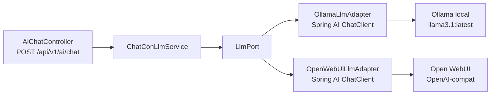

# Design Doc `DD-UC-022` — Spring AI detrás de `LlmPort`

> **Qué es**: refactor **técnico** del spike LLM ya existente (`com.edusync.shared.ai`). No hay un `FSD-UC` de producto para el chat: la trazabilidad es `NFR-007` (cero PII/RUDE/notas en logs) + DTI §9 (capa de IA, espejo vivo en DTP §B) + `AGENTS.md` §7. Mismo patrón que `DD-UC-007`/`DD-UC-020`: mejora sobre una superficie ya cerrada, no un caso de uso nuevo.
>
> **Relación con otros documentos**: crea/consume `ADR-0017` (Alternativa C). No toca `DD-UC-021` (gestión ACTIVA) ni el frontend. `PR-IMPL-021` / `PR-ADR-009` quedan reservados por `DD-UC-021` (ADR-0016); este slice usa `PR-IMPL-022` / `PR-ADR-010`.

## 1. Objetivo y contexto

- **Qué resuelve este feature**: los adaptadores `OllamaLlmAdapter` y `OpenWebUiLlmAdapter` hablan HTTP/JSON a mano (`RestClient` + records). Se reemplaza ese I/O por Spring AI (`ChatClient` / ChatModel) **sin** cambiar el puerto `LlmPort`, el caso de uso `ChatConLlmService` ni `POST /api/v1/ai/chat`.
- **Caso(s) de uso del FSD que implementa**: no hay `FSD-UC` de chat. Trazabilidad normativa: `NFR-007` (`docs/product/FSD.md`, cero PII en logs). El DTI congelado §9 (“sin IA en runtime”) se declara **delta** en DTP §A.2 vía `ADR-0017` — no se edita `docs/baseline/**`.
- **Alcance**:
  - **Dentro**: `pom.xml` (BOM + starter(s) de Spring AI, versión **solo** tras verificar Boot 4.1.0 / Jakarta EE 11 / Java 25); reescritura de los dos adaptadores `LlmPort`; ajuste de `AiConfig` si los `RestClient` ad-hoc dejan de hacer falta; conservar `edusync.ai.*` y env (`OLLAMA_BASE_URL`, `OPEN_WEBUI_API_KEY`, etc.); HTTP/1.1 si Open WebUI/uvicorn sigue exigirlo; tests de adaptador + `mvn test` (incluye `ModularityTests` 7/7).
  - **Fuera**:
    - Cambiar `LlmPort.completar(String)` o meter `org.springframework.ai` en `domain/`/`application/`.
    - Nuevos endpoints, UI de chat, tool calling de producto, cambio de proveedor default (sigue Ollama `llama3.1:latest`).
    - Streaming SSE, memoria de conversación persistida, o un segundo LLM en cloud.
    - Materializar `PR-IMPL-021` (pertenece a `DD-UC-021`).

## 2. Diseño (el "cómo") `[humano+máquina]`

- **Enfoque elegido**: Alternativa C de `ADR-0017`. Spring AI vive solo en `infrastructure`. Cada adaptador implementa `LlmPort` traduciendo `completar(prompt)` → `ChatClient.prompt(...).call()` (o equivalente del starter) → `RespuestaLlm(texto, modelo)`. Fallos de red / cuerpo vacío → `LlmNoDisponibleException` (502), igual que hoy.
- **Componentes tocados**:

```
backend/
├── pom.xml                                              (DELTA — spring-ai-bom + starter Ollama;
│                                                         starter OpenAI-compatible si Open WebUI
│                                                         lo necesita; versión tras verificar BOM)
└── src/main/java/com/edusync/shared/ai/
    ├── domain/                                          (NO TOCAR)
    ├── application/                                     (NO TOCAR — LlmPort, ChatConLlmService)
    └── infrastructure/
        ├── config/AiProperties.java                     (conservar prefijo edusync.ai.*)
        ├── config/AiConfig.java                         (DELTA — beans ChatClient/ChatModel;
        │                                                 HTTP/1.1 si el starter no lo da)
        ├── adapter/out/ollama/OllamaLlmAdapter.java     (DELTA — Spring AI, no POST /api/generate)
        ├── adapter/out/openwebui/OpenWebUiLlmAdapter.java (DELTA — Spring AI OpenAI-compat)
        └── adapter/in/rest/AiChatController.java        (NO TOCAR contrato)
```

- **Contratos y tipos**:
  - Puerto: `LlmPort.completar(String) → RespuestaLlm` — **idéntico**.
  - REST: `POST /api/v1/ai/chat` `{prompt}` → `{texto, modelo}`; `POST /api/v1/ai/consultar-usuario` sin cambio de firma.
  - Propiedades: `edusync.ai.enabled|provider|ollama.{base-url,model,timeout-seconds}|open-webui.{base-url,api-key,model,timeout-seconds}`. Si Spring AI exige `spring.ai.ollama.*`, mapear desde `AiProperties` en `AiConfig`; no pedir al operador un rename de env.
  - Sin Flyway, sin eventos de dominio, sin frontend.
- **Gate de BOM**: primer paso de `PR-IMPL-022`. Si no hay BOM compatible con Boot 4.1.0, **STOP** y escalar (`E_BOM_INCOMPATIBLE`). No pinnear un BOM de Spring Boot 3 “por aproximación”.
- **Diagrama**:



  `domain/` y `application/` no ven los nodos Spring AI.

## 3. Alternativas consideradas

> La decisión de dependencia se formalizó en `ADR-0017`. Este DD no la reabre.

| Alternativa | Pros | Contras | ¿Elegida? |
|-------------|------|---------|-----------|
| A. Dejar `RestClient` + JSON | Cero riesgo de BOM | El ADR ya la descartó como dirección | no |
| B. Exponer `ChatClient` en el caso de uso | Menos código de adaptador | Rompe hexagonal | no |
| C. Spring AI solo en adaptadores | Conserva puerto y contrato | Gate de BOM en la ejecución | **sí** (`ADR-0017`) |

## 4. Impacto en las specs vivas `[máquina]`

| Artefacto vivo | Cambio | ¿Delta vs DTI vFinal? |
|----------------|--------|-----------------------|
| `docs/adr/0017-*.md` | Nuevo — Spring AI detrás de `LlmPort` | **sí** → DTI §9 “sin IA en runtime” |
| `docs/product/FSD.md` | Sin cambio de flujo; NFR-007 sigue vigente | no |
| `docs/product/PRD.md` | Sin US nueva | no |
| `docs/product/DTP.md` | §A.1 fila; §A.2 delta 8; §B §9 + ADRs + PROMPT_MAPPING | **sí** → `ADR-0017` |
| `docs/PROMPT_MAPPING.md` | `PR-IMPL-022` + `PR-ADR-010` | no |
| `AGENTS.md` | Fila de stack Spring AI (versión a fijar en la ejecución) | no (espejo del ADR, no del DTI) |
| Baseline `docs/baseline/**` | **No se toca** | — |

## 5. Prompts usados `[máquina]`

| Prompt | Tarea | Artefacto generado |
|--------|-------|--------------------|
| `PR-ADR-010` | Formalizar `ADR-0017` en el catálogo (simetría `PR-ADR-008`→`0015`) | `docs/adr/0017-*.md`, `prompts/PR-ADR-010.md` |
| `PR-IMPL-022` | Verificar BOM + reescribir adaptadores + tests; **no ejecutar en este turno** | `backend/pom.xml`, `shared.ai.infrastructure/**` |

> `PR-IMPL-022` vive en [`docs/prompts/impl/PR-IMPL-022.md`](../prompts/impl/PR-IMPL-022.md), estado **Ejecutado**.

## 6. Plan de pruebas y evals

- **Unit**: `ChatConLlmServiceTest` intacto (mock de `LlmPort`). Tests nuevos de adaptador con `ChatClient` mockeado: happy path → `RespuestaLlm`; error de proveedor → `LlmNoDisponibleException`; respuesta vacía → misma excepción. Assert de que el logger no recibe el prompt.
- **Integration**: no exigir Ollama real en CI (el spike actual tampoco lo hace en el test de servicio). Si se añade un test `@SpringBootTest` con WireMock/Testcontainers, que no envíe PII.
- **Modularity**: `ApplicationModules.verify()` 7/7 — `shared` OPEN, sin aristas nuevas ilegales.
- **E2E / Gherkin**: no aplica (sin FSD-UC de chat).
- **Evals de IA**: no aplica a este refactor de cliente.

## 7. Definition of Done (checklist)

- [x] Trazabilidad declarada (`NFR-007` + DTI §9 / DTP; sin inventar un FSD-UC).
- [x] Diseño (§2) y alternativas (§3) documentados.
- [x] ADR creado/enlazado — `ADR-0017`.
- [x] §4 Impacto en specs vivas (sin tocar baseline).
- [x] Prompt versionado — `PR-IMPL-022` **Aprobado (prompt)**; `PR-ADR-010` **Aprobado**.
- [x] Tests/evals en verde — `PR-IMPL-022` **ejecutado**; `mvn test` **250/250** (incluye `ModularityTests` 7/7).
- [x] DTP actualizado (`v1.42`).
- [ ] PR/commit — no solicitado.

## 8. Registro de cambios

| Versión | Fecha | Autor | Cambio |
|---------|-------|-------|--------|
| v0.1 | 13/09/2026 | Rodrigo Aspeti | Creación y aprobación del Design Doc (`DD-UC-022`): refactor del cliente LLM a Spring AI detrás de `LlmPort` (`ADR-0017` Alternativa C). Prompt `PR-IMPL-022` aprobado, ejecución de código pendiente. `PR-IMPL-021` no se usa (reservado por `DD-UC-021`). |
| v0.2 | 13/09/2026 | Rodrigo Aspeti | DoD de tests: `PR-IMPL-022` ejecutado. BOM Spring AI **2.0.0**. `mvn test` 250/250. |
