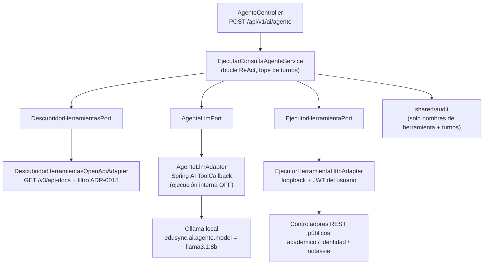

# Design Doc `DD-UC-023` — Agente de tool calling multipaso sobre `shared.ai`

> **Qué es**: diseño del feature nuevo que trae a Java el mecanismo ya probado en `EduSync_LLM/edusync-agente-llm` (Python): un agente que decide, turno a turno, qué endpoint de solo lectura de EduSync invocar para responder una pregunta en lenguaje natural. No hay un `FSD-UC` de producto para esto (es infraestructura/NFR, igual que `DD-UC-022`): la trazabilidad normativa es `NFR-007` (cero PII/RUDE/notas en logs) + `AGENTS.md` §7-§8.1.
>
> **Relación con otros documentos**: implementa `ADR-0018` (Alternativa C). No reabre `ADR-0017` ni toca `LlmPort` / `ChatConLlmService` / `POST /api/v1/ai/chat` (`DD-UC-022`). Es un *vertical slice* nuevo y aditivo dentro de `shared.ai`.

## 1. Objetivo y contexto

- **Qué resuelve este feature**: hoy `shared.ai` solo redacta texto (`LlmPort.completar`) o extrae una intención fija (`ExtraerConsultaUsuarioService`); nunca decide qué dato traer. Este feature agrega un endpoint nuevo, `POST /api/v1/ai/agente`, que deja que el modelo encadene llamadas de solo lectura contra el propio backend (bucle ReAct, tope de turnos) y arma la respuesta final siempre por código, con la misma trazabilidad turno-a-turno que ya reporta el agente Python de referencia.
- **Caso(s) de uso del FSD que implementa**: no hay `FSD-UC` de agente. Trazabilidad normativa: `NFR-007` (`docs/product/FSD.md`, cero PII en logs, extendida por `ADR-0018` a argumentos/resultados de herramientas). Delta declarado sobre el DTI congelado §9 ("sin IA en runtime") vía `ADR-0018` — no se edita `docs/baseline/**`.
- **Alcance**:
  - **Dentro**: descubrimiento dinámico de herramientas desde `GET /v3/api-docs` con el filtro de `ADR-0018` §3; bucle ReAct controlado por código de aplicación (ejecución interna de Spring AI **desactivada**); ejecución de cada herramienta por HTTP loopback contra los controladores REST ya públicos, propagando el JWT del usuario autenticado; endpoint nuevo `POST /api/v1/ai/agente`; propiedades nuevas `edusync.ai.agente.*` (incluye `model`, default `llama3.1:8b`); tests de la nueva cadena; test de regresión del filtro de seguridad del catálogo.
  - **Fuera**: camino `KEYWORD` y resolutores compuestos de Python (deuda técnica declarada en `ADR-0018` §3); servidor/cliente MCP; cualquier herramienta de escritura; cambios a `LlmPort`, `ChatConLlmService`, `AiChatController`, `POST /api/v1/ai/chat`, `POST /api/v1/ai/consultar-usuario`; cambio del modelo/proveedor del chat v0 (`edusync.ai.ollama.model` / `edusync.ai.open-webui.model` siguen en `latest`).

## 2. Diseño (el "cómo") `[humano+máquina]`

- **Enfoque elegido**: Alternativa C de `ADR-0018`. Un puerto de entrada nuevo (`EjecutarConsultaAgenteUseCase`) orquesta un bucle ReAct: en cada turno arma la lista de herramientas disponibles (`ToolCallback` construidos dinámicamente desde el catálogo descubierto), llama al modelo del agente vía `AgenteLlmPort` (puerto de salida nuevo, no `LlmPort`) pidiéndole la siguiente acción, y si el modelo elige una herramienta, la ejecuta por HTTP loopback con el JWT del usuario (`EjecutorHerramientaPort`) y alimenta el resultado como observación del siguiente turno. Se detiene cuando el modelo responde sin más llamadas a herramientas o al llegar al tope de turnos (`edusync.ai.agente.max-turnos`, default `6`, mismo valor que Python). La respuesta final siempre la redacta el código a partir de las observaciones acumuladas, nunca el modelo directamente sobre datos crudos sin pasar por el contrato `RespuestaAgente`.
- **Componentes tocados** (todo nuevo y aditivo; nada de lo listado como "NO TOCAR" se modifica):

```
backend/src/main/java/com/edusync/shared/ai/
├── domain/                                                  (NUEVO)
│   ├── HerramientaLlm.java              — nombre, descripción, parámetros, método/path HTTP
│   ├── ParametroHerramienta.java        — nombre, tipo, requerido, ubicación (path/query/body)
│   ├── LlamadaHerramienta.java          — nombre herramienta + argumentos resueltos por el modelo
│   ├── MensajeAgente.java               — turno de la conversación interna (rol, contenido, llamada)
│   ├── RespuestaAgente.java             — respuesta, herramientasUsadas, turnos, camino, fuente
│   ├── LimiteTurnosAlcanzadoException.java
│   └── HerramientaNoDisponibleException.java
├── application/
│   ├── port/in/
│   │   └── EjecutarConsultaAgenteUseCase.java               (NUEVO)
│   ├── port/out/
│   │   ├── AgenteLlmPort.java            — decide próxima acción dado historial + catálogo (NUEVO)
│   │   ├── DescubridorHerramientasPort.java                  (NUEVO)
│   │   └── EjecutorHerramientaPort.java  — ejecuta una LlamadaHerramienta con el JWT del usuario (NUEVO)
│   ├── service/
│   │   └── EjecutarConsultaAgenteService.java                (NUEVO — el bucle ReAct)
│   ├── port/in/{ChatConLlmUseCase, ...}.java                 (NO TOCAR)
│   ├── port/out/{LlmPort, BuscarUsuarioPorNombrePort}.java   (NO TOCAR)
│   └── service/{ChatConLlmService, ...}.java                 (NO TOCAR)
└── infrastructure/
    ├── config/
    │   ├── AiProperties.java             — DELTA: bloque agente{model,max-turnos,habilitado}
    │   └── AiConfig.java                 — DELTA: bean ChatModel/ChatClient del agente (provider
    │                                       ollama, modelo edusync.ai.agente.model, ejecución interna
    │                                       de tools DESACTIVADA); bean RestClient loopback
    ├── adapter/out/
    │   ├── agente/AgenteLlmAdapter.java              — implementa AgenteLlmPort vía Spring AI
    │   │                                                ToolCallback (sin auto-ejecución)
    │   ├── descubrimiento/
    │   │   └── DescubridorHerramientasOpenApiAdapter.java — lee /v3/api-docs, aplica el filtro de
    │   │                                                     ADR-0018 §3 (idéntico al de
    │   │                                                     DescubridorTools de Python)
    │   └── ejecucion/
    │       └── EjecutorHerramientaHttpAdapter.java   — loopback http://localhost:<puerto> +
    │                                                    Authorization: Bearer <jwt del usuario>
    └── adapter/in/rest/
        ├── AgenteController.java         — POST /api/v1/ai/agente (NUEVO)
        ├── AgenteRequest.java / AgenteResponse.java          (NUEVO, DTOs REST)
        └── AiChatController.java                             (NO TOCAR)
```

- **Contratos y tipos**:
  - Puerto de entrada: `EjecutarConsultaAgenteUseCase.consultar(String pregunta, String jwtUsuario) → RespuestaAgente`.
  - Puertos de salida nuevos: `AgenteLlmPort.decidirSiguientePaso(List<MensajeAgente>, List<HerramientaLlm>) → LlamadaHerramienta | RespuestaFinal`; `DescubridorHerramientasPort.descubrir() → List<HerramientaLlm>` (cacheable — el catálogo no cambia entre requests salvo redeploy); `EjecutorHerramientaPort.ejecutar(LlamadaHerramienta, String jwt) → String` (JSON de resultado o `{"error": ...}`, nunca lanza).
  - REST: `POST /api/v1/ai/agente` (JWT obligatorio vía el filtro de seguridad ya existente de `identidad`), body `{"pregunta": "..."}` → `200 {"respuesta", "herramientasUsadas": [...], "turnos": N, "camino": "AGENTE", "fuente": "..."}`; mismos códigos de error de familia que el resto de `shared.ai` (`401` sin JWT, `502`/`503` si el proveedor LLM no responde, `429` si se agota el tope de turnos sin resolución — mapea a `LimiteTurnosAlcanzadoException`).
  - Propiedades nuevas bajo `edusync.ai.agente.*`: `model` (default `llama3.1:8b`, **sin** `latest`), `max-turnos` (default `6`), `habilitado` (default `true`, espejo de `edusync.ai.enabled`). No se renombra ni se reutiliza `edusync.ai.ollama.model`.
  - Sin Flyway, sin eventos de dominio nuevos, sin cambios de frontend en este slice (el frontend consume el endpoint nuevo como *follow-up*, fuera de este DD).
- **Regla de auditoría de argumentos/resultados**: `EjecutorHerramientaHttpAdapter` nunca loguea el cuerpo de la respuesta HTTP de la herramienta ejecutada a nivel INFO+; solo `DEBUG` con el nombre de la herramienta y el código de estado. `EjecutarConsultaAgenteService` es el único punto que arma el log de auditoría hacia `shared/audit` (`ADR-0003`), con `herramientasUsadas` (solo nombres) y `turnos`, nunca con los argumentos ni con las respuestas crudas.
- **Diagrama**:



  `domain/` y `application/` de este slice no ven `org.springframework.ai`; solo `AgenteLlmAdapter` (infra) lo importa, igual que `ADR-0017` ya exige para `LlmPort`.

## 3. Alternativas consideradas

> La decisión de dirección (bucle manual + puerto nuevo + JWT propagado) se formalizó en `ADR-0018`. Este DD no la reabre; solo detalla el "cómo" de la Alternativa C elegida.

| Alternativa | Pros | Contras | ¿Elegida? |
|-------------|------|---------|-----------|
| A. No implementar en Java | Cero riesgo | No cumple el objetivo | no |
| B. Ejecución interna de Spring AI | Menos código | Pierde `camino`/`turnos`/`herramientasUsadas` exactos | no |
| C. Bucle manual + `ToolCallback` dinámicos + loopback HTTP + JWT del usuario | Paridad de auditoría con Python; respeta RBAC real | Más código; duplica el filtro de seguridad en dos lenguajes | **sí** (`ADR-0018`) |
| D. Un puerto de aplicación por endpoint | Sin salto HTTP | 23 puertos a mano, no escala | no |

## 4. Impacto en las specs vivas `[máquina]`

| Artefacto vivo | Cambio | ¿Delta vs DTI vFinal? |
|----------------|--------|-----------------------|
| `docs/adr/0018-*.md` | Nuevo — agente de tool calling detrás de `AgenteLlmPort` | **sí** → DTI §9 "sin IA en runtime" (mismo delta que abrió `ADR-0017`, ahora ampliado) |
| `docs/product/FSD.md` | Sin cambio de flujo de producto; `NFR-007` sigue vigente, ahora también cubre argumentos/resultados de herramientas | no |
| `docs/product/PRD.md` | Sin US nueva (feature de infraestructura/NFR, igual que `DD-UC-022`) | no |
| `docs/product/DTP.md` | §A.1 fila nueva (agente); §A.2 delta adicional; §B §9 + ADRs + `PROMPT_MAPPING` | **sí** → `ADR-0018` |
| `docs/PROMPT_MAPPING.md` | `PR-IMPL-023` | no |
| `AGENTS.md` §8.1 | Fila nueva de agente (`ollama-agent` pasa a describir también el camino de tool calling; revisar sincronía con `.claude/agents/ollama-agent.md` y `.claude/skills/ollama-edusync/SKILL.md`, señalada como desincronizada desde `ADR-0017` — **follow-up**, no bloquea este DD) | no (espejo del ADR) |
| Baseline `docs/baseline/**` | **No se toca** | — |

> **Recordatorio (regla de oro)**: el baseline congelado de M4 no se toca. Los cambios viven en `docs/product/`.

## 5. Prompts usados `[máquina]`

| Prompt | Tarea | Artefacto generado |
|--------|-------|--------------------|
| `PR-IMPL-023` | Implementar el bucle ReAct, los tres puertos nuevos, el descubridor OpenAPI, el ejecutor loopback con propagación de JWT, `AgenteController` y tests; **no ejecutar en este turno** | `backend/src/main/java/com/edusync/shared/ai/{domain,application,infrastructure}/**` (solo archivos nuevos), `backend/pom.xml` (sin dependencias nuevas — Spring AI ya está desde `ADR-0017`) |

> `PR-IMPL-023` vive en [`docs/prompts/impl/PR-IMPL-023.md`](../prompts/impl/PR-IMPL-023.md), estado **Borrador — pendiente de aprobación humana**.

## 6. Plan de pruebas y evals

- **Unit**: `EjecutarConsultaAgenteServiceTest` con `AgenteLlmPort`/`DescubridorHerramientasPort`/`EjecutorHerramientaPort` mockeados — camino feliz (una herramienta, respuesta final), camino sin herramientas (respuesta directa), tope de turnos alcanzado (`LimiteTurnosAlcanzadoException`), herramienta que el modelo inventa (no está en el catálogo → `HerramientaNoDisponibleException`, no se ejecuta nada).
- **Unit del descubridor**: `DescubridorHerramientasOpenApiAdapterTest` — dado un `openapi.json` de fixture con endpoints de `/auth/**`, `/plataforma/**`, `/ai/**` y de escritura, ninguno aparece en el catálogo resultante; los de lectura bajo `/api/v1/**` con verbo de consulta sí aparecen.
- **Test de regresión de seguridad** (obligatorio, corre en cada build): recorre el catálogo real descubierto contra el `openapi.json` vigente del propio backend y falla si algún `HerramientaLlm` apunta a un path excluido o a un método de escritura sin palabra de consulta — es la mitigación declarada en `ADR-0018` §4.2 contra la divergencia Python/Java.
- **Integration**: `EjecutorHerramientaHttpAdapterTest` contra un `MockRestServiceServer`/`WireMock` local, verificando que el header `Authorization: Bearer <jwt>` propagado es el del usuario que llamó al agente (no una cuenta técnica) y que un error HTTP se traduce a `{"error": ...}` sin excepción.
- **Modularity**: `ApplicationModules.verify()` 7/7 — sin aristas nuevas hacia `academico`/`identidad`/`notassie` (el acceso es siempre por HTTP público, no por import de paquete).
- **E2E / Gherkin**: no aplica (sin `FSD-UC` de producto).
- **Evals de IA**: dataset mínimo de 4 preguntas de referencia (las ya documentadas por `edusync-agente-llm` en `INFORME_EDUSYNC_AGENTE_LLM.md`) corridas contra el agente Java, comparando `camino`/herramienta elegida como validación manual de paridad (`ADR-0018` §7).

## 7. Definition of Done (checklist)

- [ ] Trazabilidad declarada (`NFR-007`; sin inventar un `FSD-UC`).
- [ ] Diseño (§2) y alternativas (§3) documentados.
- [ ] ADR creado/enlazado — `ADR-0018`.
- [ ] §4 Impacto en specs vivas registrado (sin tocar el baseline).
- [ ] Prompt versionado en `docs/prompts/impl/PR-IMPL-023.md` y en `docs/PROMPT_MAPPING.md`.
- [ ] Tests/evals definidos y pasando (incluye test de regresión de seguridad del catálogo).
- [ ] DTP actualizado (changelog + estado) vía `dtp-sync`.
- [ ] PR declara: prompts usados, archivos generados vs editados a mano.

## 8. Registro de cambios

| Versión | Fecha | Autor | Cambio |
|---------|-------|-------|--------|
| v0.1 | 13/09/2026 | Rodrigo Aspeti | Creación del Design Doc (`DD-UC-023`): agente de tool calling multipaso sobre Spring AI, detrás de `AgenteLlmPort` (`ADR-0018` Alternativa C). Prompt `PR-IMPL-023` en borrador; ejecución de código pendiente de aprobación humana. |
