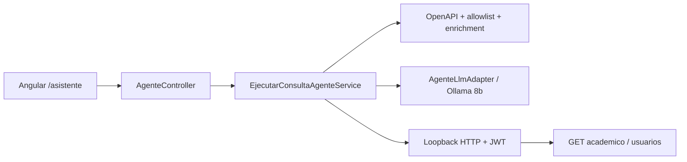

# Design Doc `DD-UC-024` — Asistente de IA fullstack con tool calling (Ollama)

> **Qué es**: cierra el feature de producto “asistente de consulta”: UI Angular + curado del descubridor OpenAPI para que el modelo consulte el **sistema académico** (gestiones, cursos, materias, estudiantes, profesores, periodos, usuarios), no solo el extractor `POST /api/v1/ai/consultar-usuario`.
>
> **Relación**: implementa `ADR-0018` (Alternativa C, híbrido descubridor+allowlist). No reabre `LlmPort` ni `POST /api/v1/ai/chat` (`DD-UC-022`). Complementa `DD-UC-023` (bucle ReAct backend).

## 1. Objetivo y contexto

- **Qué resuelve**: el usuario autenticado pregunta en lenguaje natural y recibe datos de su tenant vía tools de solo lectura. El contrato de producto es `POST /api/v1/ai/agente`. `consultar-usuario` queda como spike legado, fuera de la UI.
- **Trazabilidad**: `NFR-007` (`docs/product/FSD.md`) + `ADR-0018`. No hay `FSD-UC` de producto dedicado.
- **Alcance**:
  - **Dentro**: allowlist + enrichment del descubridor; system prompt de dominio completo; modelo `llama3.1:8b`; `AiProperties.agente`; `ErrorResponse` en el agente; consola `/asistente` (ADMIN/SECRETARIA/PROFESOR).
  - **Fuera (en este slice)**: MCP, tools de escritura, streaming, memoria, camino KEYWORD de Python, calificaciones individuales / `nota-provisional` (NFR-007).
  - **Seguimiento**: esas deudas de producto se cierran en `DD-UC-025` / `ADR-0019` (catálogo, KEYWORD, formatter, writes con confirmación, Open WebUI, historial, traza). RAG sigue diferido.

## 2. Diseño (el "cómo")

- **Enfoque**: descubridor OpenAPI **curado** (no catálogo 1:1 de todos los GET, ni tools 100 % a mano). Allowlist de prefijos académicos + identidad; exclusión de auth/plataforma/ai/calificaciones; descripciones enriquecidas para el LLM; ejecución loopback con JWT del usuario.
- **Por qué no tools independientes**: no escala (cada endpoint nuevo = código); duplica el REST. Por qué no descubridor crudo: `llama3.1:8b` se pierde con ruido y summaries pobres (“Listar”) y tiende a “solo usuarios”.
- **Componentes**:
  - Backend: `DescubridorHerramientasOpenApiAdapter`, `DescripcionHerramientaAgente`, `AgenteLlmAdapter` (system prompt), `EjecutarConsultaAgenteService` (flag `habilitado`), `AgenteController`, `AiProperties.Agente`.
  - Frontend: `features/asistente/` (`asistente-chat.page`, service, model); ruta `/asistente`; enlace en `shell`.
- **Contrato**:

```http
POST /api/v1/ai/agente
Authorization: Bearer <JWT>
{ "pregunta": "..." }

→ 200 { "respuesta", "herramientasUsadas", "turnos", "camino", "fuente" }
→ 401 / 429 E_LIMITE_TURNOS / 502 E_LLM_NO_DISPONIBLE|E_HERRAMIENTA_NO_DISPONIBLE / 503 E_AI_DESHABILITADO
```



## 3. Alternativas consideradas

| Alternativa | Pros | Contras | ¿Elegida? |
|-------------|------|---------|-----------|
| A. UI sobre chat v0 (sin tools) | Rápido | No consulta el sistema | no |
| B. Tools `@Tool` fijos a mano | Descriptions perfectas | No escala | no (solo complemento futuro) |
| C. Descubridor OpenAPI crudo | Cubre todo GET | Ruido; PII; el modelo se pierde | no |
| D. Descubridor + allowlist + enrichment | Cobertura de sistema + control | Hay que mantener la allowlist | **sí** |
| E. Agente Python externo | Ya existía | Dos runtimes; cuenta admin fija | no |

## 4. Impacto en las specs vivas

| Artefacto vivo | Cambio | ¿Delta vs DTI vFinal? |
|----------------|--------|-----------------------|
| `docs/adr/0018-*.md` | Estado Aceptada; nota de curado DD-UC-024 | **sí** → DTI §9 |
| `docs/product/FSD.md` | Sin FSD-UC nuevo; NFR-007 sigue | no |
| `docs/product/DTP.md` | §A.1, §A.2 delta 9, §B §9 | **sí** → `ADR-0018` |
| `docs/PROMPT_MAPPING.md` | `PR-IMPL-023`/`024` | no |
| Baseline `docs/baseline/**` | **No se toca** | — |

## 5. Prompts usados

| Prompt | Tarea | Artefacto generado |
|--------|-------|--------------------|
| `PR-IMPL-023` | Backend ReAct + descubridor (cierre/curado) | `shared.ai/**` |
| `PR-IMPL-024` | Consola Angular `/asistente` | `frontend/src/app/features/asistente/**` |

## 6. Plan de pruebas y evals

- Unit descubridor: allowlist admite estudiantes/cursos; rechaza notassie, calificaciones, auth, plataforma, ai, PUT.
- Unit servicio: flag `agente.habilitado=false` → `AiDeshabilitadoException`.
- `mvn test` (suite completa) + `ng build`.
- Smoke manual: pregunta “¿cuántos cursos hay?” debe usar tools de cursos, no `consultar-usuario`.

## 7. Definition of Done

- [x] Trazabilidad `NFR-007` + `ADR-0018`.
- [x] Allowlist + enrichment; system prompt de sistema.
- [x] UI `/asistente` sobre `/ai/agente`.
- [x] Modelo agente `llama3.1:8b`.
- [x] `mvn test` (`com.edusync.shared.ai.**`) y `ng build` verificados en este turno.
- [x] Baseline intacto.

## 8. Registro de cambios

| Versión | Fecha | Autor | Cambio |
|---------|-------|-------|--------|
| v0.1 | 26/09/2026 | Rodrigo Aspeti | Creación e implementación: curado del descubridor + consola Angular. |
| v0.2 | 26/09/2026 | Rodrigo Aspeti | Nota de seguimiento: evolución de producto en `DD-UC-025` (no se reabre este slice). |
