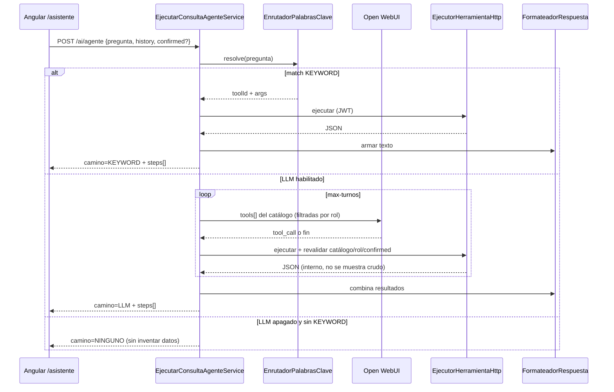

# Design Doc `DD-UC-025` — Evolución del asistente (catálogo, KEYWORD, formatter, writes, Open WebUI, sin RAG)

> **Qué es**: documento de **cambios a realizar** sobre el asistente ya implementado (`DD-UC-023`/`024`, `ADR-0018`). El producto ahora exige: catálogo de tools, camino `KEYWORD`, respuesta redactada por código, escrituras con confirmación del usuario, LLM vía Open WebUI, historial en request + `sessionStorage`, y traza `camino` + tools + agente + `steps[]` + tablas.
>
> **Relación**: no reabre `LlmPort` ni `POST /api/v1/ai/chat`. Extiende `POST /api/v1/ai/agente` y `/asistente`. Crea `ADR-0019` (no supersede completo de `ADR-0018`: se conserva JWT del usuario + loopback HTTP + bucle ReAct controlado). **RAG queda fuera** (slice futuro).

## 0. Matriz: hoy vs. objetivo

| Capacidad | Hoy (`DD-UC-023`/`024`) | Objetivo de este DD | ¿Este slice? |
|-----------|-------------------------|---------------------|--------------|
| Catálogo de tools | OpenAPI dinámico + allowlist | Catálogo **tipado** (`TOOL-CATALOG.md`) como fuente de verdad | **sí** |
| Camino `KEYWORD` | No existe (`camino=AGENTE` siempre) | Match de frases → tool **sin LLM** | **sí** |
| Quién redacta | El modelo escribe el texto final | **Código** (`AgenteResponseFormatter`); el LLM solo elige tools | **sí** |
| Escritura | Prohibida | `write` con preview + `confirmed=true` del usuario | **sí** (oleada 1) |
| RAG normativo | No | Diferido | **no** |
| LLM del agente | Ollama directo (`AgenteAiConfig`) | **Open WebUI** (API OpenAI-compatible, HTTP/1.1) | **sí** |
| Memoria | Un `pregunta` suelto | `history[]` en el request + `sessionStorage` en UI | **sí** |
| Traza | `herramientasUsadas`, `turnos`, `camino=AGENTE` | `KEYWORD` / `LLM` / `NINGUNO` + `agente` + `steps[]` + tablas fuente | **sí** |
| Copilotos por pantalla | No | Fuera (sigue un solo `/asistente`, `agente=general`) | **no** |
| MCP | No | Fuera | **no** |

## 1. Objetivo y contexto

- **Qué resuelve**: el asistente actual consulta el sistema, pero (1) no tiene un catálogo gobernable, (2) gasta turnos de modelo en preguntas triviales, (3) deja que el LLM narre datos de dominio (riesgo de alucinación), (4) no puede mutar estado ni con confirmación, (5) habla Ollama directo en vez del proxy institucional Open WebUI, (6) no conserva conversación, (7) la traza no distingue caminos ni tablas.
- **Trazabilidad**: `NFR-007` + `ADR-0018` (se conserva) + **`ADR-0019`** (este delta). Sin `FSD-UC` de producto dedicado — igual que `DD-UC-022`/`023`/`024`.
- **Alcance**:
  - **Dentro**: catálogo + router KEYWORD + formateador + protocolo `write` + Open WebUI en el camino agente + historial + contrato de traza; UI `/asistente`; tests.
  - **Fuera**: RAG / embeddings / FTS; copilotos embebidos (`phases`/`users`/`evidence`); MCP; calificaciones individuales / `nota-provisional` / `notassie`; `POST /api/v1/ai/chat`; `consultar-usuario`; persistencia de chats en BD; streaming SSE.

## 2. Diseño (el "cómo")

### 2.1 Enfoque

Orquestación en `shared.ai` + hexágono/Modulith:

| Capacidad | Implementación en EduSync |
|-----------|---------------------------|
| Catálogo tipado | `docs/design/assistant/TOOL-CATALOG.md` + `CatalogoHerramientasAgente` (registro en código alineado 1:1 al markdown) |
| Camino KEYWORD | `EnrutadorPalabrasClaveAgente` |
| Texto de producto | `FormateadorRespuestaAgente` — **única** fuente del texto que ve el usuario |
| Ejecución de tools | Se **conserva** loopback HTTP + JWT (`EjecutorHerramientaHttpAdapter`) para no violar Modulith (`ADR-0011`/`0018`); no hay use cases in-process desde el asistente |
| Tools `write` + `confirmed` | Mismo protocolo; executor revalida rol y `confirmed` |
| Open WebUI | `AgenteAiConfig` deja de construir `OllamaChatModel`; usa el cliente OpenAI-compatible de `AiConfig` (HTTP/1.1, API key solo en backend) |
| `history` + sessionStorage | Body `history[]`; UI `sessionStorage` clave `edusync.asistente.conversacion` |
| `steps[]` + tablas | Campo `steps` + `tablasFuente` por tool en el catálogo |

El descubridor OpenAPI **deja de ser el catálogo que ve el LLM**. Puede quedar como **linter** (test: cada tool `read`/`write` del catálogo existe en `/v3/api-docs` con el método/path declarados). No se envían al modelo GET crudos ni summaries pobres.

### 2.2 Flujo de un mensaje



**Regla anti-alucinación:** el LLM **nunca** redacta el `respuesta` que ve el usuario. Tras 0..N tools, Java formatea. Si el modelo devuelve prosa, se ignora como texto de producto (puede usarse solo como señal de “fin de encadenamiento”).

### 2.3 Contrato API (delta)

`POST /api/v1/ai/agente` se **extiende** (mismo path; no se crea otro endpoint):

```http
POST /api/v1/ai/agente
Authorization: Bearer <JWT>
```

Request:

```json
{
  "pregunta": "¿Cuántos cursos hay?",
  "history": [
    { "role": "user", "content": "Hola" },
    { "role": "assistant", "content": "…" }
  ],
  "confirmed": false
}
```

| Campo | Regla |
|-------|--------|
| `pregunta` | Obligatoria, máx. 4000 caracteres (baja de 8000; alineado a defensa de entrada) |
| `history` | Opcional; máx. 30 ítems; roles `user`/`assistant`; se descartan `system`/`tool` del cliente |
| `confirmed` | Opcional; solo aplica a tools `write` en curso de confirmación |

Response 200:

```json
{
  "respuesta": "Hay 12 cursos en el tenant.",
  "camino": "KEYWORD",
  "agente": "general",
  "fuente": "llama3.1:8b",
  "turnos": 0,
  "herramientasUsadas": ["list_cursos"],
  "steps": [
    {
      "paso": 1,
      "toolId": "list_cursos",
      "tablasFuente": ["curso"],
      "exito": true
    }
  ],
  "confirmacionRequerida": false
}
```

| `camino` | Cuándo |
|----------|--------|
| `KEYWORD` | Hit del router; `turnos=0` |
| `LLM` | El modelo eligió ≥1 tool (o encadenó) |
| `NINGUNO` | IA apagada y sin match KEYWORD, o pregunta fuera de dominio |

`fuente` en `KEYWORD`/`NINGUNO` puede ser `"catalogo"` / `"ninguno"` (no el tag del modelo).

Errores existentes se conservan (`E_LIMITE_TURNOS`, `E_LLM_NO_DISPONIBLE`, `E_HERRAMIENTA_NO_DISPONIBLE`, `E_AI_DESHABILITADO`). Nuevos:

| HTTP | Código | Causa |
|------|--------|--------|
| 400 | `E_AGENTE_ENTRADA_INVALIDA` | Historial/pregunta inválidos |
| 409 | `E_CONFIRMACION_REQUERIDA` | Solo si se prefiere error en vez de 200 con `confirmacionRequerida` — **no**: se usa 200 + preview |

### 2.4 Catálogo (fuente de verdad)

Archivo vivo: [`docs/design/assistant/TOOL-CATALOG.md`](assistant/TOOL-CATALOG.md).

Cada tool declara: `toolId`, side-effect (`read`/`write`), roles, método+path REST, tablas fuente, frases KEYWORD, schema de args.

**Prohibido siempre** (no entra al catálogo): `/auth/**`, `/plataforma/**`, `/ai/**`, `/calificaciones`, `/nota-provisional`, `notassie`, reset de password, cualquier `DELETE` de usuarios.

### 2.5 Camino KEYWORD

- Normalizar: minúsculas, sin tildes opcionales, recorte.
- Primera coincidencia gana (lista ordenada en el catálogo).
- Si `edusync.ai.agente.llm-habilitado=false`, solo existe KEYWORD (demo nivel 1).
- No extrae UUIDs inventados: si la frase necesita un id y no está en `history`/pregunta como UUID real, no hay match → cae a LLM o `NINGUNO`.

### 2.6 Escritura con confirmación

1. Usuario (o LLM) dispara tool `write` con `confirmed=false` (default).
2. Executor **no** llama al REST de mutación; devuelve `{ confirmationRequired, action, preview }`.
3. Formatter muestra preview en español + “Escribí *confirmo* o pulsá Confirmar”.
4. Siguiente request con **mismos args** + `confirmed=true` (UI botón o texto “confirmo” que el router/LLM mapea) → se ejecuta el POST/PATCH loopback con JWT.
5. Sin `confirmed=true` no hay side-effect. Calificaciones siguen fuera.

Oleada 1 (`write`): `create_curso`, `create_paralelo`, `create_materia`, `create_estudiante`, `create_inscripcion`, `cambiar_estado_gestion`. Roles = los del REST actual (`ADMIN` / `SECRETARIA` según endpoint).

### 2.7 Open WebUI

- El **agente** deja de usar `OllamaApi` en `AgenteAiConfig`.
- Bean `agenteChatClient`: mismo patrón que `openWebUiChatClient` (`OpenAiChatModel`, `edusync.ai.open-webui.base-url` + API key, modelo `edusync.ai.agente.model`, timeout del agente).
- Chat v0 (`ADR-0017`) **no se toca**: sigue `edusync.ai.provider` ollama|open-webui.
- Operación: Open WebUI debe exponer el tag fijado (`llama3.1:8b`, nunca `latest`).
- Flag: `edusync.ai.agente.llm-habilitado` (default `true`).

### 2.8 Historial

| Capa | Qué guarda |
|------|------------|
| Request | `history[]` de la sesión actual (el backend es stateless) |
| UI | `sessionStorage['edusync.asistente.conversacion']` — `{ mensajes[], ultimaTraza }` |
| BD | Nada |

Al recargar la pestaña se recupera; al cerrar el tab se pierde. “Limpiar” borra la clave. El JWT ya vive en `sessionStorage` (login); no mezclar claves.

### 2.9 Componentes a tocar

**Backend (`shared.ai`)**

| Nuevo / delta | Rol |
|---------------|-----|
| `CatalogoHerramientasAgente` | Registry tipado (reemplaza al OpenAPI como input del LLM) |
| `EnrutadorPalabrasClaveAgente` | Camino KEYWORD |
| `FormateadorRespuestaAgente` | Texto de producto |
| `EjecutarConsultaAgenteService` | Orquesta KEYWORD → LLM loop → NINGUNO; acumula `steps` |
| `AgenteAiConfig` | Open WebUI |
| `AgenteRequest` / `AgenteResponse` / `RespuestaAgente` | `history`, `confirmed`, `camino` enum, `agente`, `steps`, `confirmacionRequerida` |
| `DescubridorHerramientasOpenApiAdapter` | Solo test de alineación catálogo↔OpenAPI; deja de alimentar el bucle |

**Frontend**

| Delta | Rol |
|-------|-----|
| `asistente.model.ts` | Nuevo contrato |
| `asistente.service.ts` | Envía `history` + `confirmed` |
| `asistente-chat.page.ts` | Hilo, badge de camino, `steps`/tablas, Confirmar/Cancelar, persistencia sessionStorage |

### 2.10 Configuración nueva

| Propiedad | Default | Uso |
|-----------|---------|-----|
| `edusync.ai.agente.llm-habilitado` | `true` | `false` = solo KEYWORD |
| `edusync.ai.agente.max-turnos` | `6` | Se conserva |
| `edusync.ai.agente.model` | `llama3.1:8b` | Tag servido **por Open WebUI** |
| `edusync.ai.open-webui.*` | (existente) | Base URL + API key del agente |

`.env.example`: documentar que el agente exige Open WebUI (no Ollama directo).

## 3. Alternativas consideradas

| Alternativa | Pros | Contras | ¿Elegida? |
|-------------|------|---------|-----------|
| A. Dejar OpenAPI como catálogo + enrichment | Menos código | Sin gobernanza de frases/tablas; KEYWORD no encaja | no |
| B. Catálogo tipado + loopback HTTP (este DD) | Gobernable; Modulith intacto | Hay que mantener el markdown y el registry | **sí** |
| C. Catálogo + use cases in-process | Menos HTTP | 1 puerto por tool; viola el criterio de `ADR-0018` D | no |
| D. Seguir dejando que el LLM redacte | Menos formatter | Alucinación sobre datos reales | no |
| E. RAG en este slice | Respuestas con corpus normativo | Fuera de alcance explícito | no (futuro) |
| F. Ollama directo para el agente | Ya está | Contradice el pedido de Open WebUI | no |

## 4. Impacto en las specs vivas

| Artefacto vivo | Cambio | ¿Delta vs DTI vFinal? |
|----------------|--------|-----------------------|
| `docs/adr/0019-*.md` | Nueva decisión (catálogo, KEYWORD, formatter, writes, Open WebUI, traza) | **sí** → DTI §9 |
| `docs/adr/0018-*.md` | Nota: deuda KEYWORD/writes **cerrada por 0019**; loopback+JWT siguen | sí (nota, no supersede) |
| `docs/product/DTP.md` | §A.1, §A.2, §B §9 tras implementar | **sí** |
| `docs/product/FSD.md` | Sin FSD-UC nuevo; NFR-007 se extiende a `steps` (sin PII) | no |
| `docs/PROMPT_MAPPING.md` | `PR-IMPL-025` | no |
| `docs/design/DD-UC-024.md` | Puntero a este DD | no |
| Baseline `docs/baseline/**` | **No se toca** | — |

## 5. Prompts usados

| Prompt | Tarea | Artefacto |
|--------|-------|-----------|
| `PR-IMPL-025` | Código fullstack del delta | `shared.ai/**` + `features/asistente/**` |

Estado: **Aprobado (prompt)** — no ejecutado hasta que el humano pida implementar.

## 6. Plan de pruebas y evals

- **Unit KEYWORD**: “lista los cursos” → `list_cursos`, `camino=KEYWORD`, `turnos=0`; sinónimos no listados → no match.
- **Unit formatter**: JSON de listado → texto en español; nunca concatena el JSON crudo como respuesta de producto.
- **Unit write**: `confirmed=false` no llama REST; `true` sí (mock del ejecutor).
- **Unit LLM off**: sin KEYWORD → `camino=NINGUNO`.
- **Unit catálogo**: ninguna tool apunta a calificaciones/auth/plataforma/ai.
- **Integration OpenAPI linter**: path/método de cada tool existe en api-docs (WireMock o springdoc de test).
- **UI**: recargar pestaña restaura hilo; Limpiar lo borra; Confirmar envía `confirmed=true`.
- **NFR-007**: logs sin RUDE, notas, JWT, preview con PII a nivel INFO.
- **Eval manual**: (1) frase KEYWORD, (2) sinónimo → LLM, (3) create curso con preview+confirmo, (4) pregunta de presupuesto 2027 → `NINGUNO`.

## 7. Definition of Done

- [x] Trazabilidad `NFR-007` + `ADR-0019` documentada.
- [x] `TOOL-CATALOG.md` v1 publicado.
- [x] Código oleada KEYWORD (`§8` pasos 1–4): catálogo tipado + router + formatter + orquestador `KEYWORD` → `LLM` → `NINGUNO` + traza `camino`/`steps`/`agente`.
- [x] Writes KEYWORD con confirmación (`create_curso`, `create_materia`). Paralelo/estudiante/inscripción/estado de gestión siguen fuera (UUID/RUDE).
- [ ] `AgenteAiConfig` → Open WebUI (`§8` paso 5).
- [ ] Historial en request + `sessionStorage` (`§8` paso 7).
- [x] UI `/asistente`: chips de frases KEYWORD, badge de `camino` y `steps`/tablas (sin sessionStorage todavía).
- [x] `mvn test` (`shared.ai`) y `ng build` verdes.
- [x] `dtp-sync` tras implementar.
- [x] Baseline intacto.
- [x] RAG explícitamente fuera.

## 8. Orden de implementación recomendado

1. Contrato DTO + `camino` enum + `steps` (backend) sin romper tests viejos.
2. Catálogo + linter OpenAPI.
3. KEYWORD + formatter (LLM puede seguir apagado en tests).
4. Orquestador: KEYWORD → loop LLM → formatter (el modelo deja de ser autor del `respuesta`).
5. `AgenteAiConfig` → Open WebUI.
6. Writes + UI Confirmar.
7. Historial request + sessionStorage + traza en UI.

## 9. Registro de cambios

| Versión | Fecha | Autor | Cambio |
|---------|-------|-------|--------|
| v0.1 | 26/09/2026 | Rodrigo Aspeti | Borrador/aprobación de diseño: delta v1.1 del asistente. RAG diferido. |
| v0.2 | 26/09/2026 | Rodrigo Aspeti | Oleada KEYWORD ejecutada (`PR-IMPL-025` parcial): catálogo de lecturas, router, formatter, traza y chips en `/asistente`. Writes, Open WebUI del agente e historial siguen pendientes. |
| v0.3 | 26/09/2026 | Rodrigo Aspeti | Oleada A: KEYWORD sin UUID — gestión activa, periodos/secciones de la activa, mis materias. Evaluaciones globales siguen fuera (no hay GET de colección). |
| v0.4 | 26/09/2026 | Rodrigo Aspeti | Oleada C: escrituras KEYWORD `create_curso`/`create_materia` con preview y botón Confirmar. |
| v0.5 | 26/09/2026 | Rodrigo Aspeti | Se eliminan referencias a un producto externo; el diseño queda descrito solo en términos de EduSync. |
