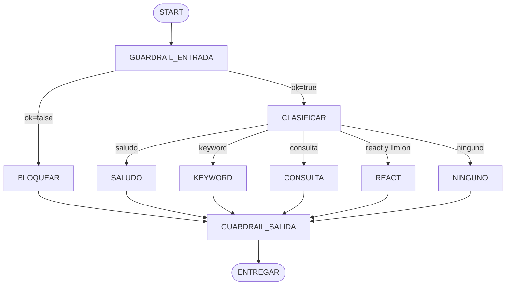

# Design Doc `DD-UC-027` — Grafo de producción del asistente (oleada 1)

> **Qué es**: cómo EduSync absorbe los **patrones** del Lab 6 (LangGraph Nivel 5) **sin** adoptar LangGraph. Envuelve KEYWORD / CONSULTA / ReAct (`DD-UC-025`/`026`) con nodos y aristas Java, guardrails de entrada/salida y temperatura 0.

## 1. Objetivo y contexto

- **Qué resuelve**: el agente de producción no puede mandar inyección/PII a Ollama ni entregar fugas; el ruteo debe ser un grafo auditable, no un `if` opaco.
- **Trazabilidad**: `NFR-007`, `ADR-0021`. Lab de referencia: `plantillas/Labs/Lab6`.
- **Dentro (oleada 1, este PR-IMPL):** guardrail entrada, clasificar (Java), saludo, bloquear, reutilizar KEYWORD/CONSULTA/ReAct, guardrail salida, `camino` `BLOQUEADO`/`SALUDO`, `steps[]` con nodos, temperatura 0, tests, badge UI.
- **Fuera (oleadas 2+):** RAG/embeddings/Chroma, caché semántico, SqliteSaver/`thread_id` persistente, fallback de modelo, nodo ESCALAR, Open WebUI en `AgenteAiConfig` (deuda `DD-UC-025`).

## 2. Diseño

### 2.1 Grafo (oleada 1)

Equivalencia Lab 6:

| Lab 6 | EduSync oleada 1 |
|-------|------------------|
| `clasificar` (LLM) | `CLASIFICAR` Java: saludo regex + `EnrutadorPalabrasClaveAgente` + `AnalizadorIntencionConsultaAcademica` |
| `recuperar` / RAG | diferido |
| `responder` | KEYWORD / CONSULTA / ReAct / SALUDO (ya existentes + respuesta fija) |
| `guardar_turno` / SqliteSaver | `sessionStorage` (ya en `DD-UC-026`); checkpoint BD diferido |
| `escalar` | diferido |
| `guardar_cache` | diferido |
| guardrails entrada/salida | `GuardrailEntradaAgente` / `GuardrailSalidaAgente` |

### 2.2 Guardrail de entrada

Decision record (no excepción): `{ ok, preguntaLimpia, hallazgos[], motivo }`.

- **Bloquear:** frases de inyección (lista corta, case-insensitive, NFD); patrón de tarjeta.
- **Enmascarar y seguir:** correo, teléfono BO (`[67]\d{7}`), RUDE (`\d{12}`). Reemplazo por `[CORREO]` / `[TELEFONO]` / `[RUDE]`.
- **Logs:** solo nombres de hallazgo (`inyeccion`, `rude`), nunca el match.

### 2.3 Guardrail de salida

- Vacío → mensaje seguro.
- Fuga tarjeta / CI / RUDE en el texto → redactar y marcar `exito=false` en el paso `guardrail_salida`.
- System-prompt leak (`system prompt`, `instrucciones del sistema`) → sustituir por mensaje fijo.
- `requiereCita = false` hasta oleada RAG.

### 2.4 Componentes

| Capa | Tipo |
|------|------|
| `shared.ai.domain` | `ResultadoGuardrailEntrada`, `ResultadoGuardrailSalida`; constantes `CAMINO_BLOQUEADO`, `CAMINO_SALUDO` |
| `shared.ai.application` | `GuardrailEntradaAgente`, `GuardrailSalidaAgente`, `RutasGrafoAsistente` |
| `EjecutarConsultaAgenteService` | envuelve el `consultar()` actual: entrada → clasificar → caminos existentes → salida |
| `AgenteAiConfig` + YAML | `temperature: 0` |
| UI | badge de camino `BLOQUEADO` / `SALUDO` |

`steps[]`: primer paso `guardrail_entrada`; último `guardrail_salida`; intermedios conservan `toolId` de tools (KEYWORD/CONSULTA/ReAct).

### 2.5 Contratos REST

Sin endpoints nuevos. Delta de `camino` en `AgenteResponse`: `BLOQUEADO` | `SALUDO` además de `KEYWORD` | `CONSULTA` | `LLM` | `NINGUNO`.

### 2.6 Temperatura

`edusync.ai.agente.temperature` (default `0`) → `OllamaChatOptions.builder().temperature(...)`. Chat v0 (`AiConfig`) no se toca en este slice.

## 3. Plan de implementación (oleadas)

| Oleada | Alcance | Prompt |
|--------|---------|--------|
| **1 (este DD)** | Guardrails + grafo de rutas + saludo + temperatura 0 | `PR-IMPL-027` |
| **2** | RAG léxico sobre procesos EduSync | `DD-UC-028` / `PR-IMPL-028` |
| 3 | Caché semántico + fallback de modelo + ESCALAR | DD futuro |
| 4 | Checkpoint persistente `thread_id` (si producto lo pide; hoy sessionStorage) | DD futuro |

## 4. Impacto en specs vivas

- `docs/product/DTP.md`: fila §A.1 + delta §A.2 (`ADR-0021` vs DTI §9: sin LangGraph).
- `docs/product/FSD.md` / BRD / PRD: sin cambio de UC (NFR-007 ya cubre PII).
- `docs/PROMPT_MAPPING.md`: `PR-IMPL-027`.

## 5. Riesgos

| Riesgo | Mitigación |
|--------|------------|
| Falsos positivos de inyección | Lista corta de frases; no clasificador ML |
| RUDE de 12 dígitos vs otros números | Solo `\b\d{12}\b`; umbral 51 no matchea |
| Tests KEYWORD asumen `steps.size()==1` | Actualizar a «contiene tool + nodos de guardrail» |

## 6. DoD oleada 1

- [x] ADR-0021 aceptada (no LangGraph).
- [x] `BLOQUEADO` sin llamar LLM/tools.
- [x] `SALUDO` sin LLM.
- [x] KEYWORD/CONSULTA inalterados en semántica.
- [x] Temperatura 0 en agente.
- [x] `mvn test` + `ng build` verde.

## 7. Fuera de alcance

LangGraph, Chroma, SqliteSaver, Open WebUI del agente, Playbooks nuevos, SQL generado, edición de `docs/baseline/**`.
