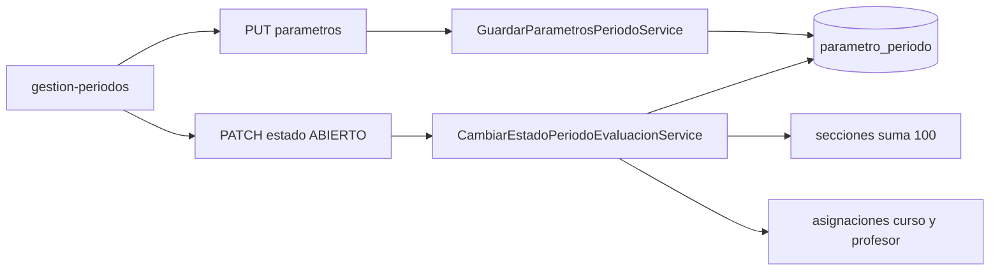

# Design Doc `DD-UC-029` — Parámetros del periodo y cobertura al abrir

> **Qué es**: el delta que le queda a `FSD-UC-009` (Administración de periodos académicos institucionales) sobre el modelo genérico ya implementado. No crea una `GestionAcademica` paralela ni restaura la apertura secuencial.
>
> **Relación**: `ADR-0013` decidió un solo motor (Bolivia = defaults, no una ruta `notassie`). `FSD-UC-012`/`013`/`014`/`018` ya cubren alta de gestión, seed de 3 periodos, fechas, plantilla de secciones y asignación docente. `ADR-0014` eliminó la apertura secuencial (`BR-006`/`RB-05`) y el freeze de nombres, fechas y secciones. Este DD materializa lo que esas decisiones no cubrieron: parámetros por periodo (`ADR-0002`, `BR-007`) y el rechazo `E_MATERIA_SIN_DOCENTE` al abrir.

## 1. Objetivo y contexto

- **Qué resuelve**: el `ADMIN` (equivalente vigente de `DIRECTOR`, §0.1 del FSD) configura, por cada `PeriodoEvaluacion` en `PENDIENTE`, el rango y la regla de cada sección de la gestión, y el sistema rechaza pasar ese periodo a `ABIERTO` si faltan parámetros o si alguna materia con curso asignado no tiene profesor.
- **Caso de uso**: `FSD-UC-009` — [`docs/product/FSD.md` §4.5](../product/FSD.md).
- **Dentro**:
  - Aggregate `ParametroPeriodo`, uno por (`PeriodoEvaluacion`, `SeccionEvaluacion`).
  - `GET`/`PUT /api/v1/periodos-evaluacion/{id}/parametros` (reemplazo atómico del conjunto).
  - Al `PATCH .../estado` hacia `ABIERTO`: `422 E_PARAMETROS_INCOMPLETOS` y `409 E_MATERIA_SIN_DOCENTE`, además del `E_SUMA_SECCIONES_INVALIDA` que ya exige `CambiarEstadoPeriodoEvaluacionService`.
  - Inmutabilidad de esos parámetros mientras el periodo no está `PENDIENTE` (`BR-007` / `ADR-0002`).
  - Panel en la pantalla existente de periodos (`gestion-periodos.page.ts`).
  - Flyway `V13__academico_parametro_periodo.sql` (`tenant_id` + RLS `FORCE`).
- **Fuera** (ya decidido o bloqueado por un caso de uso que no existe):
  - Restaurar `E_PERIODO_NO_SECUENCIAL`, `E_TRIMESTRE_PREVIO_ABIERTO` o el freeze de periodos/secciones. `ADR-0014` los eliminó; reabrirlos exige un ADR nuevo.
  - Entidades `GestionAcademica` / `Periodo` en `notassie`, ni `POST /api/v1/gestiones` ni `POST /api/v1/periodos/{id}/apertura`. Las rutas vivas son las de `FSD-UC-012`/`013`.
  - Enum fijo `SER/SABER/HACER/DECIDIR/AUTOEVALUACION` y `peso_max` duplicado. El peso es `SeccionEvaluacion.nota` (`ADR-0013`).
  - `floor()`, `SUMA` y `MEJOR_N`. El motor vigente es promedio simple + `round` HALF_UP (`FSD-UC-016`). Este slice solo acepta `PROMEDIO_SIMPLE`.
  - Cierre condicionado a centralizadores (`E_CENTRALIZADORES_INCOMPLETOS`): no hay centralizador hasta `FSD-UC-003`. El cierre sigue siendo el `PATCH` de estado de `ADR-0014`.
  - Notificación a docentes (paso 11 del FSD). No hay puerto de notificación.
  - `audit_log` (`ADR-0009` §3 punto 5, sigue pendiente).
  - Cambiar `CalculoNotas` para leer estos rangos. `FSD-UC-001` los consumirá; este DD solo los persiste y los exige al abrir.

## 2. Diseño (el "cómo") `[humano+máquina]`

### 2.1 Qué ya está hecho y qué añade este slice

| Paso de `FSD-UC-009` | Realización viva | Este DD |
|----------------------|------------------|---------|
| Crear gestión y 3 periodos `PENDIENTE` | `POST /gestiones-escolares` + seed (`DD-UC-008`/`015`) | no se toca |
| Fechas de cada periodo | `PATCH /periodos-evaluacion/{id}` | no se toca |
| Asignar docentes | `AsignacionMateriaProfesor` (`DD-UC-012`) | se consulta al abrir |
| Abrir el periodo | `PATCH /periodos-evaluacion/{id}/estado` | se añaden dos validaciones |
| Apertura secuencial (`RB-05`, `BR-006`) | eliminada (`ADR-0014`) | no se restaura |
| Parámetros del periodo | no existe | `ParametroPeriodo` |
| Cierre si centralizadores `CERRADO` | no existe el agregado | diferido a `FSD-UC-003` |

### 2.2 Aggregate

`ParametroPeriodo` es independiente (mismo criterio que `PeriodoEvaluacion`: Lombok solo `@Getter`, factory `crear()`, `reconstruir()`). Campos: `id`, `tenantId`, `periodoEvaluacionId`, `seccionEvaluacionId`, `rangoMin`, `rangoMax`, `reglaCombinacion`.

Invariantes del aggregate (sin I/O):

- `rangoMin >= 0`, `rangoMax > rangoMin`, escala con 2 decimales `HALF_UP`.
- `reglaCombinacion` solo `PROMEDIO_SIMPLE`. Cualquier otro valor → `E_REGLA_NO_SOPORTADA` en el servicio, antes de construir el aggregate.

La unicidad `(tenant_id, periodo_id, seccion_id)` la garantiza el índice único de `V13` y el reemplazo atómico del servicio.

### 2.3 Reemplazo atómico

`PUT /api/v1/periodos-evaluacion/{id}/parametros` con `{ parametros: [{ seccionEvaluacionId, rangoMin, rangoMax, reglaCombinacion }] }`.

En una transacción, `GuardarParametrosPeriodoService`:

1. Carga el periodo del tenant. Si no existe → `404 E_PERIODO_NO_ENCONTRADO`.
2. Si `estado != PENDIENTE` → `422 E_PARAMETROS_INMUTABLES` (`BR-007`). Volver el periodo a `PENDIENTE` (transición que `ADR-0014` ya permite) vuelve a habilitar el `PUT`. `ABIERTO` y `CERRADO` no se editan.
3. Carga las secciones de la gestión del periodo. El conjunto de `seccionEvaluacionId` del body debe ser exactamente ese conjunto. Falta alguna → `422 E_PARAMETROS_INCOMPLETOS`. Sobra alguna o es de otra gestión/tenant → `404 E_SECCION_NO_ENCONTRADA`.
4. `rangoMax` no puede superar `seccion.nota` → `422 E_RANGO_INVALIDO`.
5. Borra los parámetros previos de ese periodo y persiste el conjunto nuevo.

`GET` del mismo path devuelve la lista (vacía si nunca se guardó). No hay alta fila a fila.

### 2.4 Apertura

`CambiarEstadoPeriodoEvaluacionService`, solo cuando `nuevoEstado == ABIERTO`, después de la suma 100 que ya existe:

1. **Parámetros completos.** Hay una fila de `ParametroPeriodo` por cada sección vigente de la gestión, y ninguna fila apunta a una sección que ya no existe. Si no → `422 E_PARAMETROS_INCOMPLETOS`.
2. **Cobertura docente.** Se listan las `AsignacionMateriaCurso` del tenant. El conjunto de `materiaId` de esas filas debe estar cubierto por al menos una `AsignacionMateriaProfesor` del mismo tenant. Si alguna materia con curso no tiene profesor → `409 E_MATERIA_SIN_DOCENTE`. Si no hay ninguna asignación a curso, la cobertura no bloquea (no hay materia "del periodo" que cubrir).

Los puertos actuales listan por materia. Este slice añade `listarPorTenant` en `AsignacionMateriaCursoRepositoryPort` y `AsignacionMateriaProfesorRepositoryPort` para no hacer N+1. La comparación vive en el servicio de aplicación, no en SQL ad-hoc del controlador.

Pasar a `CERRADO` o a `PENDIENTE` no exige parámetros ni cobertura. `ADR-0014` sigue permitiendo cualquier transición.

Editar la plantilla de secciones con un periodo ya `ABIERTO` sigue permitido (`ADR-0014`). Esos parámetros no se reescriben. El desalineamiento es el mismo riesgo que `ADR-0014` ya aceptó sobre notas ya cargadas; `FSD-UC-001` deberá leer el snapshot del periodo, no recalcular el rango desde la plantilla viva.

### 2.5 Aislamiento y RBAC

- `tenant_id NOT NULL` + RLS `FORCE`, filtro explícito por tenant. Otro tenant → `404`, no `403`.
- `PUT`: `ADMIN`.
- `GET`: la misma visibilidad que `GET` de periodos (`ADMIN`; `SECRETARIA`/`PROFESOR`/`ASESOR` solo si la gestión está `ACTIVA`).

### 2.6 UI

Sin ruta nueva. En `/academico/gestiones-escolares/:id/periodos`, cada fila gana un bloque "Parámetros": una fila por sección vigente (`GET /secciones` de la gestión), con `rangoMin` / `rangoMax` y regla fija `PROMEDIO_SIMPLE`. Guardar llama al `PUT`. Si el periodo no está `PENDIENTE`, los campos quedan de solo lectura. El botón Abrir muestra el cuerpo de `E_PARAMETROS_INCOMPLETOS` o `E_MATERIA_SIN_DOCENTE` sin interpolar datos de personas.

### 2.7 Esquema

`parametro_periodo`: `id`, `tenant_id`, `periodo_evaluacion_id`, `seccion_evaluacion_id`, `rango_min`, `rango_max`, `regla_combinacion`, unique `(tenant_id, periodo_evaluacion_id, seccion_evaluacion_id)`, FKs a periodo y sección, RLS `FORCE`.

## 3. Alternativas consideradas

| Alternativa | Pros | Contras | ¿Elegida? |
|-------------|------|---------|-----------|
| A. Agregados `GestionAcademica`/`Periodo`/`ParametroAcademico` en `notassie`, con el flujo literal del §4.5 (3 trimestres, apertura secuencial, enum de dimensiones) | Copia fiel del FSD clásico | Contradice `ADR-0013` (un solo motor) y `ADR-0014` (sin secuencialidad ni freeze). Duplica gestión, periodos y pesos | no |
| B. No hacer nada: dar `FSD-UC-009` por cubierto por `FSD-UC-013` | Cero código | Deja sin tabla el `ADR-0002` y sin las excepciones `E_PARAMETROS_INCOMPLETOS` / `E_MATERIA_SIN_DOCENTE` que el FSD todavía exige | no |
| C. Delta sobre `PeriodoEvaluacion`: parámetros por sección del periodo, inmutables fuera de `PENDIENTE`, más cobertura docente al abrir. Sin secuencialidad, sin `floor()`, sin centralizadores | Respeta `ADR-0013` y `ADR-0014`. Desbloquea `FSD-UC-001` con rangos persistidos | El cierre por centralizador y la notificación quedan fuera. `SUMA`/`MEJOR_N` no se aceptan | **sí** |

No hay ADR nuevo: no se revierte `ADR-0014` y la parametrización por periodo ya está decidida en `ADR-0002`. La reconciliación explícita es esta: `BR-007` congela **estos** parámetros mientras el periodo no está `PENDIENTE`; no congela nombres, fechas ni la plantilla de secciones.

## 4. Impacto en las specs vivas `[máquina]`

| Artefacto vivo | Cambio al implementar | ¿Delta vs DTI vFinal? |
|----------------|----------------------|------------------------|
| `docs/product/FSD.md` §4.5 | Nota de realización: rutas vivas de `FSD-UC-012`/`013`; `BR-006`/`RB-05` siguen sustituidos por `ADR-0014`; este DD cubre parámetros y cobertura. No reescribir el flujo clásico del baseline | no (el delta de secuencialidad ya está en `ADR-0014`) |
| `docs/product/PRD.md` | Sin US nueva. Anotar que `PRD-REQ-005` (apertura secuencial) queda en la lectura de `ADR-0014` | no |
| `docs/product/DTP.md` | Fila §A.1; §A.3 `FSD-UC-009` pasa de `pendiente` a `en progreso` con `DD-UC-029`. Al ejecutar, `PR/commit` y tests | no (no contradice un párrafo del DTI que este slice no toque; `ADR-0002` ya era la decisión) |
| `docs/PROMPT_MAPPING.md` | `PR-IMPL-029` | no |

El baseline `docs/baseline/**` no se toca.

## 5. Prompts usados `[máquina]`

| Prompt | Tarea | Artefacto generado |
|--------|-------|--------------------|
| `PR-IMPL-029` | Código hexagonal + `V13` + panel de parámetros + tests. No ejecutar hasta aprobación humana de este borrador | `backend/.../academico/**`, `frontend/.../gestion-periodos.page.ts` |

## 6. Plan de pruebas y evals

- **Unit (dominio)**: `rangoMax <= rangoMin` rechazado; `rangoMin` negativo rechazado; `PROMEDIO_SIMPLE` aceptado.
- **Unit (aplicación, Mockito)**: `PUT` con periodo `ABIERTO` → `E_PARAMETROS_INMUTABLES`; conjunto de secciones distinto al de la gestión → `E_PARAMETROS_INCOMPLETOS`; `rangoMax` mayor que `seccion.nota` → `E_RANGO_INVALIDO`; abrir sin parámetros → `E_PARAMETROS_INCOMPLETOS`; materia con curso y sin profesor → `E_MATERIA_SIN_DOCENTE`; materia sin curso no bloquea; abrir con parámetros completos y cobertura pasa; cerrar no exige parámetros.
- **Integration (Testcontainers)**: `PUT` + `GET` aislados por tenant (`404` cross-tenant); unique de BD; `PATCH` a `ABIERTO` en los dos rechazos y en el caso feliz. RLS `FORCE` en `parametro_periodo`.
- **E2E / Gherkin**: el escenario de apertura secuencial del §4.5 **no** se automatiza (lo anuló `ADR-0014`). El escenario de este DD es: periodo `PENDIENTE`, parámetros completos, toda materia con curso tiene profesor → `ABIERTO` y un `PUT` posterior responde `422 E_PARAMETROS_INMUTABLES`.
- **Evals de IA**: no aplica.

## 7. Definition of Done (checklist)

- [x] `fsd_uc` declarado y enlazado (`FSD-UC-009`).
- [x] Diseño (§2) y alternativas (§3) documentados.
- [x] Sin ADR nuevo: la decisión significativa ya está en `ADR-0002`, `ADR-0013` y `ADR-0014`.
- [x] §4 Impacto en specs vivas registrado (sin tocar el baseline).
- [x] Prompt versionado en `docs/prompts/impl/PR-IMPL-029.md` y en `PROMPT_MAPPING.md` (ejecutado 29/09/2026).
- [x] Tests definidos y pasando (`ng build` verde; tests de este slice en verde dentro de `mvn test`. Tres fallos preexistentes en `shared.ai`, ajenos a este DD).
- [x] DTP actualizado al estado del delta ejecutado (`v1.52`).
- [ ] PR de código declara prompts usados y archivos generados vs editados a mano.
