# EduSync — Especificación de Estados: Administración de Gestión Académica (Director)

<!-- Metadatos del documento -->
| Campo | Valor |
|---|---|
| **Documento** | `estados_administracion.md` |
| **Diagrama fuente** | `docs/diagramas/estados_administracion.mmd` |
| **Versión** | v0.1 |
| **Fecha** | 14/05/2026 |
| **Autores** | Equipo G013 |
| **Actor principal** | Director |
| **Casos de uso cubiertos** | UC-05 · UC-07 · UC-09 · UC-10 · DA-01 · DA-02 |
| **Fuente arquitectónica** | `docs/arquitectura_funcional_EduSync.md` |
| **Estado del documento** | Borrador |

---

## 1. Propósito

Este documento especifica formalmente todos los **estados posibles** que atraviesa el Director durante el ciclo completo de administración académica en EduSync: desde la creación de una nueva gestión hasta su cierre oficial, incluyendo la configuración del calendario por trimestres, la parametrización académica, la habilitación de docentes y la gestión de los tres periodos trimestrales.

El objetivo es proveer una referencia unívoca para el equipo de desarrollo, QA y arquitectura, garantizando que el workflow del Director sea trazable, auditable y alineado con las invariantes de negocio documentadas en UC-09 y DA-02.

---

## 2. Decisiones de diseño asumidas

Tres ambigüedades funcionales fueron resueltas contra la arquitectura documentada antes de modelar los estados.

| # | Concepto | Decisión tomada | Fuente |
|---|---|---|---|
| D1 | "Habilitación de permisos" | Cubre dos sub-acciones: (a) asignación de roles al personal (DOCENTE, SECRETARIA, DIRECTOR) y (b) mapeo docente→materia/curso para el año. Ambas son prerequisito de UC-01. | UC-01 Invariantes |
| D2 | Configuración de trimestres | Las **fechas** de los 3 trimestres se pueden definir al inicio de la gestión. La **apertura** de cada trimestre es secuencial: T2 no puede abrirse sin que T1 esté completamente cerrado. | UC-09 Invariantes |
| D3 | Parámetros académicos | Los parámetros (dimensiones, pesos, reglas) tienen alcance `tenant + periodo`. Cada trimestre puede tener configuración propia. Son **inmutables** una vez abierto el periodo. | DA-02 |
| D4 | Modificaciones retroactivas | El Director puede autorizar (UC-05) correcciones de notas en cualquier trimestre ya cerrado, incluso mientras otro está activo. Esta es una acción paralela dentro de cada estado de trimestre activo. | UC-05 |

---

## 3. Diagrama de estados

```mermaid
stateDiagram-v2

    [*] --> VerificandoContextoInicial : Director accede al\nmódulo de administración

    state VerificandoContextoInicial {
        [*] --> ComprobandoGestionActiva
        ComprobandoGestionActiva --> SinGestionActiva : No existe gestión\nabierta para este tenant
        ComprobandoGestionActiva --> GestionYaActiva  : Ya existe una gestión\nactiva sin cerrar
    }

    VerificandoContextoInicial --> BloqueadoGestionActiva : Gestión previa\nsin cerrar detectada
    VerificandoContextoInicial --> InicioNuevaGestion      : Sin gestión activa —\nprocede la creación

    BloqueadoGestionActiva : Bloqueado — Gestión Previa Activa\n──────────────────\nNo se puede crear una nueva gestión\nmientras exista una en curso.\nEl Director debe cerrar la anterior.
    BloqueadoGestionActiva --> [*] : Fin del intento

    state InicioNuevaGestion {
        [*] --> IngresandoDatosGestion
        IngresandoDatosGestion --> ValidandoDatosGestion  : Director completa nombre,\naño lectivo y datos\ninstitucionales
        ValidandoDatosGestion  --> ErrorDatosGestion      : Año duplicado o\ndatos incompletos
        ValidandoDatosGestion  --> GestionRegistrada      : Datos válidos
        ErrorDatosGestion      --> IngresandoDatosGestion : Director corrige
    }

    InicioNuevaGestion --> GestionEnBorrador : Gestión académica\ncreada — sin periodos

    GestionEnBorrador --> GestionDescartada : Director cancela\nantes de configurar
    GestionDescartada --> [*] : Gestión eliminada

    GestionEnBorrador --> ConfigurandoCalendario : Director define el\ncalendario académico anual

    state ConfigurandoCalendario {
        [*] --> DefinidendoFechasT1
        DefinidendoFechasT1  --> DefinidendoFechasT2 : Rango T1 ingresado
        DefinidendoFechasT2  --> DefinidendoFechasT3 : Rango T2 ingresado
        DefinidendoFechasT3  --> ValidandoCalendario : Rango T3 ingresado
        ValidandoCalendario  --> ConflictoCalendario : Solapamiento entre\nperiodos o fechas inválidas
        ValidandoCalendario  --> CalendarioAceptado  : Sin conflictos ✓
        ConflictoCalendario  --> DefinidendoFechasT1 : Director corrige
    }

    ConfigurandoCalendario --> CalendarioConfirmado : Calendario T1·T2·T3\nguardado

    CalendarioConfirmado --> ConfigurandoParametros : Director fija\nparámetros académicos

    state ConfigurandoParametros {
        [*] --> ParametrosT1
        ParametrosT1 --> ParametrosT2           : Parámetros T1\ncompletos
        ParametrosT2 --> ParametrosT3           : Parámetros T2\ncompletos
        ParametrosT3 --> ValidandoParametros    : Parámetros T3\ncompletos
        ValidandoParametros --> ParametrosInvalidos : Peso ≠ 100 pts\no campo vacío
        ValidandoParametros --> ParametrosAceptados : Configuración\nconsistente ✓
        ParametrosInvalidos --> ParametrosT1    : Director corrige
    }

    ConfigurandoParametros --> ParametrosPublicados : Parámetros fijados\ne inmutables

    ParametrosPublicados --> HabilitandoAccesos : Director configura\naccesos y asignaciones

    state HabilitandoAccesos {
        [*] --> AsignandoRolesPersonal
        AsignandoRolesPersonal --> AsignandoDocentesMaterias : Roles configurados
        AsignandoDocentesMaterias --> VerificandoCobertura   : Asignaciones ingresadas
        VerificandoCobertura --> CoberturaIncompleta         : Materia sin docente
        VerificandoCobertura --> CoberturaCompleta           : Cobertura total ✓
        CoberturaIncompleta --> AsignandoDocentesMaterias    : Director completa
    }

    HabilitandoAccesos --> GestionListaParaApertura : Accesos habilitados\nDocentes notificados

    state GestionandoT1 {
        [*] --> T1_PeriodoAbierto
        T1_PeriodoAbierto --> T1_MonitoreandoCarga
        T1_MonitoreandoCarga --> T1_AutorizandoModif     : Docente solicita\ncorrección retroactiva
        T1_AutorizandoModif --> T1_DecisionDirectorModif
        T1_DecisionDirectorModif --> T1_MonitoreandoCarga : Solicitud resuelta
        T1_MonitoreandoCarga --> T1_SolicitandoCierre    : Director inicia cierre
        T1_SolicitandoCierre --> T1_VerificandoCentraliz
        T1_VerificandoCentraliz --> T1_CursosPendientes  : Cursos con materias\naún ABIERTAS
        T1_VerificandoCentraliz --> T1_CerradoConfirmado : Todos los centraliz.\ncerrados ✓
        T1_CursosPendientes --> T1_MonitoreandoCarga     : Notifica a docentes
    }

    GestionListaParaApertura --> GestionandoT1 : Director abre\nel 1er Trimestre
    GestionandoT1 --> T1_Cerrado : Trimestre 1 cerrado\nReportes T1 disponibles

    state GestionandoT2 {
        [*] --> T2_PeriodoAbierto
        T2_PeriodoAbierto --> T2_MonitoreandoCarga
        T2_MonitoreandoCarga --> T2_AutorizandoModif
        T2_AutorizandoModif --> T2_DecisionDirectorModif
        T2_DecisionDirectorModif --> T2_MonitoreandoCarga : Solicitud resuelta
        T2_MonitoreandoCarga --> T2_SolicitandoCierre    : Director inicia cierre
        T2_SolicitandoCierre --> T2_VerificandoCentraliz
        T2_VerificandoCentraliz --> T2_CursosPendientes
        T2_VerificandoCentraliz --> T2_CerradoConfirmado : Todos los centraliz.\ncerrados ✓
        T2_CursosPendientes --> T2_MonitoreandoCarga
    }

    T1_Cerrado --> GestionandoT2 : Director abre\nel 2do Trimestre
    GestionandoT2 --> T2_Cerrado : Trimestre 2 cerrado\nReportes T2 disponibles

    state GestionandoT3 {
        [*] --> T3_PeriodoAbierto
        T3_PeriodoAbierto --> T3_MonitoreandoCarga
        T3_MonitoreandoCarga --> T3_AutorizandoModif
        T3_AutorizandoModif --> T3_DecisionDirectorModif
        T3_DecisionDirectorModif --> T3_MonitoreandoCarga : Solicitud resuelta
        T3_MonitoreandoCarga --> T3_SolicitandoCierre    : Director inicia cierre
        T3_SolicitandoCierre --> T3_VerificandoCentraliz
        T3_VerificandoCentraliz --> T3_CursosPendientes
        T3_VerificandoCentraliz --> T3_CerradoConfirmado : Todos los centraliz.\ncerrados ✓
        T3_CursosPendientes --> T3_MonitoreandoCarga
    }

    T2_Cerrado --> GestionandoT3 : Director abre\nel 3er Trimestre
    GestionandoT3 --> T3_Cerrado : Trimestre 3 cerrado\nPromedio anual calculado

    state CerrandoGestion {
        [*] --> VerificandoCierreTotal
        VerificandoCierreTotal --> TrimestresSinCerrar   : Algún trimestre\nno cerrado
        VerificandoCierreTotal --> GenerandoResumenAnual : Los 3 trimestres\ncerrados ✓
        GenerandoResumenAnual --> CierreConfirmado       : Indicadores anuales\ngenerados
        TrimestresSinCerrar --> VerificandoCierreTotal   : Director cierra\nlos pendientes
    }

    T3_Cerrado --> CerrandoGestion : Director inicia el\ncierre formal anual
    CerrandoGestion --> GestionCerrada : Gestión cerrada\noficialmente

    GestionCerrada : Gestión Académica Cerrada\n──────────────────\nTodos los trimestres CERRADOS ✓\nDashboard anual disponible ✓\nBoletines finales habilitados ✓\nExportación SIE habilitada ✓

    GestionCerrada --> [*] : Nueva gestión puede iniciarse

    GestionandoT1 --> AjustandoAsignaciones : Docente reasignado\ndurante T1
    GestionandoT2 --> AjustandoAsignaciones : Docente reasignado\ndurante T2
    AjustandoAsignaciones --> GestionandoT1 : Completado en T1
    AjustandoAsignaciones --> GestionandoT2 : Completado en T2
```



---

## 4. Catálogo de estados

### 4.1 Verificación y creación de la gestión

| ID | Estado | Descripción | Actor | Terminal |
|---|---|---|---|---|
| `E-01` | `VerificandoContextoInicial` | Sistema comprueba si existe una gestión activa sin cerrar para el tenant. Subestados: `ComprobandoGestionActiva`. | Sistema | No |
| `E-02` | `BloqueadoGestionActiva` | El tenant ya tiene una gestión abierta. No se puede crear una nueva hasta cerrar la anterior (UC-09). | Director / Sistema | Sí |
| `E-03` | `InicioNuevaGestion` | Director ingresa nombre y año lectivo. El sistema valida duplicados y datos requeridos. | Director | No |
| `E-04` | `GestionEnBorrador` | Gestión académica registrada pero sin fechas, parámetros ni asignaciones. El Director puede cancelarla en este punto. | Director | No |
| `E-05` | `GestionDescartada` | El Director canceló antes de configurar. Sin impacto operativo para docentes ni secretaría. | Director | Sí |

### 4.2 Configuración del calendario académico

| ID | Estado | Descripción | Actor | Terminal |
|---|---|---|---|---|
| `E-06` | `ConfigurandoCalendario` | Director define las fechas de inicio y fin de cada trimestre. El sistema valida secuencia y ausencia de solapamientos. | Director | No |
| `E-07` | `CalendarioConfirmado` | Las 3 fechas trimestrales son válidas, sin solapamientos ni brechas inválidas. Guardadas pero la apertura sigue siendo manual y secuencial. | Sistema | No |

### 4.3 Configuración de parámetros académicos

| ID | Estado | Descripción | Actor | Terminal |
|---|---|---|---|---|
| `E-08` | `ConfigurandoParametros` | Director fija dimensiones activas, pesos por dimensión, reglas de combinación de evaluaciones, umbral de reprobación y escala SIE para cada trimestre. | Director | No |
| `E-09` | `ParametrosPublicados` | Parámetros almacenados por `tenant + periodo`. Son **inmutables** una vez abierto el periodo. Disponibles para UC-01. | Sistema | No |

### 4.4 Habilitación de accesos y asignaciones

| ID | Estado | Descripción | Actor | Terminal |
|---|---|---|---|---|
| `E-10` | `HabilitandoAccesos` | Director asigna roles al personal (DOCENTE, SECRETARIA) y mapea cada docente a sus materias y cursos para el año. | Director | No |
| `E-11` | `GestionListaParaApertura` | Todos los prerequisitos cumplidos. El sistema está listo para que el Director abra el 1er Trimestre. | Sistema | No |

### 4.5 Gestión de trimestres (aplica a T1, T2 y T3)

| ID | Subestado | Descripción | Actor | Terminal |
|---|---|---|---|---|
| `E-12` | `Tx_PeriodoAbierto` | Periodo declarado ABIERTO. Docentes reciben notificación y pueden comenzar la carga de notas. | Director / Sistema | No |
| `E-13` | `Tx_MonitoreandoCarga` | El Director visualiza el avance de carga por curso y materia (% completado). Puede ver el centralizador provisional (UC-03). | Director | No |
| `E-14` | `Tx_AutorizandoModif` | Un docente envió una solicitud de modificación retroactiva (UC-05). El Director la revisa. | Docente / Director | No |
| `E-15` | `Tx_DecisionDirectorModif` | El Director aprueba (con alcance y ventana 1 h–72 h) o rechaza la solicitud con observación. | Director | No |
| `E-16` | `Tx_SolicitandoCierre` | El Director solicita el cierre del trimestre. El sistema lanza la verificación de centralizers. | Director | No |
| `E-17` | `Tx_VerificandoCentraliz` | Sistema verifica que el 100 % de los cursos del periodo tengan sus centralizadores en estado `CERRADO`. | Sistema | No |
| `E-18` | `Tx_CursosPendientes` | Algún curso tiene materias aún `ABIERTAS`. El cierre es bloqueado. El Director debe notificar a los docentes rezagados. | Sistema / Director | No |
| `E-19` | `Tx_CerradoConfirmado` | 100 % de centralizadores cerrados. El periodo transiciona a `CERRADO`. Reportes e indicadores del trimestre disponibles. | Sistema | No |
| `E-20` | `Tx_Cerrado` | Trimestre oficialmente cerrado. Boletines habilitados. Solo modificaciones vía UC-05. | Sistema | No* |

> *`Tx_Cerrado` puede tener actividad retroactiva si el Director autoriza ventanas UC-05.

### 4.6 Cierre de la gestión académica

| ID | Estado | Descripción | Actor | Terminal |
|---|---|---|---|---|
| `E-21` | `CerrandoGestion` | Director inicia el cierre formal anual. Sistema verifica que los 3 trimestres estén cerrados y genera indicadores anuales. | Director / Sistema | No |
| `E-22` | `GestionCerrada` | Año académico oficialmente cerrado. Promedio anual calculado e inmutable. Dashboard anual disponible. Nueva gestión puede iniciarse. | Sistema | Sí |

### 4.7 Caso excepcional

| ID | Estado | Descripción | Actor | Terminal |
|---|---|---|---|---|
| `E-23` | `AjustandoAsignaciones` | Un docente es dado de baja o reasignado durante un trimestre activo. Las notas previas del docente saliente quedan en `audit_log` (inmutables). El nuevo docente hereda nómina y notas en solo lectura. | Director / Sistema | No |

---

## 5. Tabla de transiciones

### 5.1 Creación y configuración de la gestión

| # | Estado origen | Evento | Estado destino | Actor |
|---|---|---|---|---|
| T-01 | `[Inicio]` | Director accede al módulo de administración | `VerificandoContextoInicial` | Director |
| T-02 | `VerificandoContextoInicial` | Existe gestión activa sin cerrar | `BloqueadoGestionActiva` | Sistema |
| T-03 | `VerificandoContextoInicial` | Sin gestión activa en el tenant | `InicioNuevaGestion` | Sistema |
| T-04 | `BloqueadoGestionActiva` | Sin acción posible | `[Fin]` | — |
| T-05 | `InicioNuevaGestion` | Datos válidos y sin duplicados | `GestionEnBorrador` | Sistema |
| T-06 | `GestionEnBorrador` | Director cancela antes de configurar | `GestionDescartada` | Director |
| T-07 | `GestionDescartada` | Gestión eliminada | `[Fin]` | — |
| T-08 | `GestionEnBorrador` | Director inicia configuración del calendario | `ConfigurandoCalendario` | Director |
| T-09 | `ConfigurandoCalendario` | Fechas T1, T2, T3 válidas y sin conflictos | `CalendarioConfirmado` | Sistema |
| T-10 | `CalendarioConfirmado` | Director inicia configuración de parámetros | `ConfigurandoParametros` | Director |
| T-11 | `ConfigurandoParametros` | Todos los parámetros de T1, T2 y T3 consistentes | `ParametrosPublicados` | Sistema |
| T-12 | `ParametrosPublicados` | Director inicia habilitación de accesos | `HabilitandoAccesos` | Director |
| T-13 | `HabilitandoAccesos` | Toda materia tiene docente asignado | `GestionListaParaApertura` | Sistema |

### 5.2 Gestión de trimestres (patrón común a T1, T2 y T3)

| # | Estado origen | Evento | Estado destino | Actor |
|---|---|---|---|---|
| T-14 | `GestionListaParaApertura` | Director abre el 1er Trimestre | `GestionandoT1` | Director |
| T-15 | `Tx_PeriodoAbierto` | Docentes notificados — carga iniciada | `Tx_MonitoreandoCarga` | Sistema |
| T-16 | `Tx_MonitoreandoCarga` | Docente solicita corrección retroactiva | `Tx_AutorizandoModif` | Docente |
| T-17 | `Tx_AutorizandoModif` | Director revisa la solicitud | `Tx_DecisionDirectorModif` | Director |
| T-18 | `Tx_DecisionDirectorModif` | Director resuelve (aprueba o rechaza) | `Tx_MonitoreandoCarga` | Director |
| T-19 | `Tx_MonitoreandoCarga` | Director solicita el cierre del trimestre | `Tx_SolicitandoCierre` | Director |
| T-20 | `Tx_SolicitandoCierre` | Sistema lanza verificación de centralizers | `Tx_VerificandoCentraliz` | Sistema |
| T-21 | `Tx_VerificandoCentraliz` | Algún curso tiene materias ABIERTAS | `Tx_CursosPendientes` | Sistema |
| T-22 | `Tx_VerificandoCentraliz` | Todos los centralizadores en estado CERRADO | `Tx_CerradoConfirmado` | Sistema |
| T-23 | `Tx_CursosPendientes` | Director notifica a docentes rezagados | `Tx_MonitoreandoCarga` | Director |
| T-24 | `GestionandoT1` | Trimestre 1 cerrado oficialmente | `T1_Cerrado` | Sistema |
| T-25 | `T1_Cerrado` | Director abre el 2do Trimestre | `GestionandoT2` | Director |
| T-26 | `GestionandoT2` | Trimestre 2 cerrado oficialmente | `T2_Cerrado` | Sistema |
| T-27 | `T2_Cerrado` | Director abre el 3er Trimestre | `GestionandoT3` | Director |
| T-28 | `GestionandoT3` | Trimestre 3 cerrado oficialmente | `T3_Cerrado` | Sistema |

### 5.3 Cierre de la gestión académica

| # | Estado origen | Evento | Estado destino | Actor |
|---|---|---|---|---|
| T-29 | `T3_Cerrado` | Director inicia cierre formal anual | `CerrandoGestion` | Director |
| T-30 | `CerrandoGestion` | Los 3 trimestres cerrados, indicadores generados | `GestionCerrada` | Sistema |
| T-31 | `GestionCerrada` | Año académico finalizado | `[Fin]` | — |

### 5.4 Caso excepcional: reasignación docente

| # | Estado origen | Evento | Estado destino | Actor |
|---|---|---|---|---|
| T-32 | `GestionandoT1` / `GestionandoT2` | Docente dado de baja o reasignado | `AjustandoAsignaciones` | Director |
| T-33 | `AjustandoAsignaciones` | Reasignación completada | `GestionandoT1` / `GestionandoT2` | Director / Sistema |

---

## 6. Invariantes de negocio por fase

| Fase / Estado | Invariante clave | Fuente |
|---|---|---|
| `VerificandoContextoInicial` | Solo se puede crear una gestión si no existe ninguna activa para el tenant. El aislamiento multitenant es absoluto: cada tenant gestiona su propio ciclo anual. | DA-01 / UC-09 |
| `ConfigurandoCalendario` | Las fechas de T1, T2, T3 deben ser secuenciales y sin solapamiento. T2 no puede iniciar antes de que termine T1. | UC-09 |
| `ParametrosPublicados` | Los parámetros se fijan al momento de publicarse y son **inmutables durante la vigencia del periodo**. Ningún cambio ministerial en el parámetro afecta un periodo ya abierto; aplica solo al siguiente. | DA-02 / UC-09 |
| `HabilitandoAccesos` | Toda materia/curso debe tener al menos un docente asignado antes de abrir el periodo. Sin asignación, el docente no puede escribir notas (RBAC estricto — UC-01). | UC-01 / DA-01 |
| `GestionandoT2` / `GestionandoT3` | No se puede abrir T2 sin que T1 esté en estado `CERRADO`. No se puede abrir T3 sin que T2 esté en estado `CERRADO`. Esta secuencialidad es obligatoria y no admite excepciones. | UC-09 Invariantes |
| `Tx_VerificandoCentraliz` | El cierre institucional del trimestre requiere que **el 100 %** de los cursos incluidos en el periodo tengan sus centralizadores en estado `CERRADO`. No existe cierre parcial de trimestre. | UC-09 / UC-03 |
| `CerrandoGestion` | El cierre anual solo está disponible cuando los 3 trimestres están en estado `CERRADO`. El promedio anual se calcula en ese momento y es inmutable (UC-03). | UC-03 / UC-10 |
| `AjustandoAsignaciones` | Las notas registradas por el docente saliente son inmutables (audit_log). El docente nuevo hereda la nómina en modo lectura. | DA-03 / UC-05 |

---

## 7. Secuencia anual del Director (resumen ejecutivo)

```
NUEVA GESTIÓN
│
├─ [Fase 1] Crear Gestión Académica
│    └─ Nombre + año lectivo validados
│
├─ [Fase 2] Configurar Calendario
│    └─ Fechas T1 · T2 · T3 — secuenciales, sin solapamiento
│
├─ [Fase 3] Configurar Parámetros Académicos
│    └─ Dimensiones · Pesos · Reglas por trimestre (inmutables post-apertura)
│
├─ [Fase 4] Habilitar Accesos
│    └─ Roles del personal + mapeo docente→materia/curso
│
├─ [Fase 5] TRIMESTRE 1
│    ├─ Abrir T1 → Monitorear carga → [UC-05 si hay retroactivas]
│    └─ Cerrar T1 (100% centraliz. CERRADOS) → Reportes T1 disponibles
│
├─ [Fase 6] TRIMESTRE 2
│    ├─ Abrir T2 → Monitorear carga → [UC-05 si hay retroactivas]
│    └─ Cerrar T2 → Reportes T2 disponibles
│
├─ [Fase 7] TRIMESTRE 3
│    ├─ Abrir T3 → Monitorear carga → [UC-05 si hay retroactivas]
│    └─ Cerrar T3 → Promedio anual calculado
│
└─ [Fase 8] Cerrar Gestión Académica
     └─ Dashboard anual · Boletines finales · Exportación SIE
```

---

## 8. Errores y bloqueos manejados

| Código / Condición | Estado que lo genera | Causa | Acción del sistema |
|---|---|---|---|
| `GESTION_YA_ACTIVA` | `VerificandoContextoInicial` | Ya existe una gestión abierta para el tenant | Bloquear la creación, mostrar la gestión activa al Director |
| `FECHA_SOLAPADA` | `ConfigurandoCalendario` | Las fechas de dos trimestres se superponen | Rechazar el calendario, mostrar el conflicto específico |
| `PESO_INCONSISTENTE` | `ConfigurandoParametros` | La suma de pesos de las dimensiones no coincide con el total esperado | Rechazar los parámetros, indicar la diferencia |
| `COBERTURA_DOCENTE_INCOMPLETA` | `HabilitandoAccesos` | Alguna materia/curso no tiene docente asignado | Listar materias sin cobertura, bloquear la habilitación |
| `TRIMESTRE_PREVIO_NO_CERRADO` | Apertura de T2 / T3 | T1 o T2 aún no cerrados | Bloquear la apertura, mostrar el estado del trimestre bloqueante |
| `CENTRALIZADORES_PENDIENTES` | `Tx_VerificandoCentraliz` | Algún curso tiene materias en estado `ABIERTO` | Listar los cursos/materias pendientes, bloquear el cierre institucional |

---

## 9. Relación con casos de uso

| Estado(s) | Caso de uso | Descripción |
|---|---|---|
| `E-07` a `E-09`, `E-11` | UC-09 · Administración de periodos | Apertura, configuración de parámetros y cierre institucional |
| `E-12` a `E-19` | UC-01 · Registro de calificaciones | Los docentes operan dentro de los trimestres abiertos por el Director |
| `E-13` | UC-03 · Consolidación | Vista provisional disponible durante el monitoreo del trimestre |
| `E-14`, `E-15` | UC-05 · Modificación retroactiva | El Director autoriza ventanas de corrección post-cierre |
| `E-20`, `E-22` | UC-07 · Boletines | Habilitados automáticamente al cerrar cada trimestre y la gestión |
| `E-20`, `E-22` | UC-04 · Exportación SIE | Disponible al cerrar la gestión completa |
| `E-22` | UC-10 · Reportería estadística | Dashboard anual disponible solo tras los 3 trimestres cerrados |

---

## 10. Consideraciones de escalabilidad

- **Gestión de sustituciones docentes:** El estado `AjustandoAsignaciones` puede extenderse para cubrir T3 cuando se requiera; hoy solo cubre T1 y T2 como casos más frecuentes.
- **Parámetros por nivel educativo:** Si en el futuro cada nivel (primaria, secundaria) requiere parámetros distintos, la fase de configuración puede expandirse añadiendo un nivel de selección antes de `ConfigurandoParametros`, sin romper el grafo.
- **Periodos cuatrimestrales o bimestrales:** El patrón `GestionandoTx` es replicable para cualquier número de periodos; solo cambia la cantidad de instancias de ese estado compuesto.
- **Apertura anticipada de parámetros:** Si se desea que los parámetros se puedan revisar después de publicados (antes de abrir el periodo), se puede añadir un estado `ParametrosEnRevision` entre `ParametrosPublicados` y `GestionListaParaApertura`.

---

## 11. Historial de versiones

| Versión | Fecha | Autor | Cambios |
|---|---|---|---|
| v0.1 | 14/05/2026 | Equipo G013 | Versión inicial — 23 estados, 33 transiciones, 8 fases, 1 caso excepcional |
