# EduSync — Especificación de Estados: Proceso de Carga de Notas (Docente)

<!-- Metadatos del documento -->
| Campo | Valor |
|---|---|
| **Documento** | `estados_cargarnotas.md` |
| **Diagrama fuente** | `docs/diagramas/estados.cargarnotas.mmd` |
| **Versión** | v0.1 |
| **Fecha** | 14/05/2026 |
| **Autores** | Equipo G013 |
| **Casos de uso cubiertos** | UC-01 · UC-02 · UC-03 · UC-05 · UC-09 |
| **Fuente arquitectónica** | `docs/arquitectura_funcional_EduSync.md` |
| **Estado del documento** | Borrador |

---

## 1. Propósito

Este documento especifica formalmente todos los **estados posibles** que atraviesa un docente durante el proceso de carga de notas en el sistema EduSync, incluyendo los flujos normales, las validaciones automáticas, los bloqueos por periodo, y el flujo de modificación retroactiva autorizada por el Director.

El objetivo es proveer una referencia unívoca para el equipo de desarrollo, QA y arquitectura, garantizando que el comportamiento del sistema sea trazable, predecible y alineado con las invariantes de negocio documentadas.

---

## 2. Decisiones de diseño asumidas

Antes de modelar los estados se resolvieron tres ambigüedades funcionales contra la arquitectura documentada.

| # | Concepto solicitado | Decisión tomada | Fuente |
|---|---|---|---|
| D1 | "Borrador" | No existe un estado de borrador separado. UC-01 persiste cada nota **inmediatamente** al ingresarla. Lo que se llama borrador equivale a `notas auto-guardadas con periodo ABIERTO` — modelado como estado `BorradorActivo`. | UC-01 Salidas |
| D2 | "Envío para revisión / Aprobación final" | En el flujo normal el docente cierra la materia **directamente** sin revisión previa de Secretaría ni del Director (UC-02). El único flujo de aprobación jerárquica es el de modificaciones retroactivas (UC-05). | UC-02 Invariantes |
| D3 | "Publicación de notas" | La publicación es un proceso **automático** del motor: cuando el 100 % de materias del curso están `CERRADAS`, UC-03 genera el centralizador oficial y habilita boletines. No existe un actor que publique manualmente. | UC-03 Salidas |

---

## 3. Diagrama de estados

```mermaid
stateDiagram-v2

    [*] --> VerificandoAcceso : Docente accede\nal módulo de notas

    state VerificandoAcceso {
        [*] --> ComprobandoRBAC
        ComprobandoRBAC --> ComprobandoPeriodo : RBAC válido\n(rol DOCENTE asignado)
        ComprobandoRBAC --> SinRBAC            : Sin materia\nasignada al docente
        ComprobandoPeriodo --> AccesoOtorgado  : Periodo en estado ABIERTO
        ComprobandoPeriodo --> PeriodoBloqueado : Periodo CERRADO\no SOLO_LECTURA
    }

    VerificandoAcceso --> NoHabilitado        : Sin RBAC o periodo\nno disponible
    VerificandoAcceso --> HabilitadoParaCarga : Acceso otorgado

    NoHabilitado : No Habilitado\n──────────────────\nRequiere intervención\nadministrativa o\napertura de periodo
    NoHabilitado --> [*] : Fin del intento\n(sin acción posible)

    HabilitadoParaCarga : Habilitado para Carga\n──────────────────\nRBAC ✓  Periodo ABIERTO ✓\nSin evaluaciones registradas
    HabilitadoParaCarga --> BorradorActivo : Docente inicia\nel ingreso de notas

    state BorradorActivo {
        [*] --> IngresandoEvaluacion
        IngresandoEvaluacion --> ValidacionEnTiempoReal : Docente envía\nuna nota

        state ValidacionEnTiempoReal {
            [*] --> Analizando
            Analizando --> DentroDeRango : Valor ≤ rango\nparamétrico del periodo
            Analizando --> FueraDeRango  : Valor excede\nlímite normativo
            FueraDeRango --> Analizando  : Docente corrige\nel valor ingresado
        }

        ValidacionEnTiempoReal --> EvaluacionGuardada     : Nota válida →\npersistida + audit_log
        ValidacionEnTiempoReal --> IngresandoEvaluacion   : Error de validación\nnota NO persistida
        EvaluacionGuardada --> VistaProvisionaActualizada  : Motor UC-03 recalcula\npromedios provisionales
        VistaProvisionaActualizada --> IngresandoEvaluacion      : Quedan evaluaciones\npendientes
        VistaProvisionaActualizada --> TodasEvaluacionesLlenas   : 100% evaluaciones\npara todos los estudiantes
        IngresandoEvaluacion --> AgregarEvaluacionEnDimension    : Docente declara\nnueva evaluación\nen una dimensión
        AgregarEvaluacionEnDimension --> IngresandoEvaluacion    : Nueva evaluación\ndisponible para carga
    }

    BorradorActivo --> EvaluacionesCompletas : Todas las evaluaciones\ndeclaradas completadas

    EvaluacionesCompletas : Notas Completas\n──────────────────\nTodas las evaluaciones de\ntodas las dimensiones para\ntodos los estudiantes ✓
    EvaluacionesCompletas --> BorradorActivo    : Docente agrega\nuna nueva evaluación\na alguna dimensión
    EvaluacionesCompletas --> SolicitandoCierre : Docente pulsa\n"Cerrar Materia"

    SolicitandoCierre --> VerificandoCompletitud : Sistema lanza\nverificación final

    state VerificandoCompletitud {
        [*] --> AuditandoRegistros
        AuditandoRegistros --> TodoCompleto     : Sin huecos\ndetectados
        AuditandoRegistros --> HuecosDetectados : Al menos 1 evaluación\nsin nota
    }

    VerificandoCompletitud --> CompletitudFallida : Huecos detectados\n(cierre bloqueado)
    VerificandoCompletitud --> MateriaCerrada     : Verificación exitosa\n→ transición a SOLO_LECTURA

    CompletitudFallida : Completitud Fallida\n──────────────────\nSistema lista estudiantes\ny evaluaciones faltantes
    CompletitudFallida --> BorradorActivo : Docente completa\nlos registros faltantes

    MateriaCerrada : Materia Cerrada\n──────────────────\nEstado: SOLO_LECTURA\nInmutable sin autorización\nNotificación → Secretaría ✓
    MateriaCerrada --> ContribuyendoAlCentralizador : Sistema UC-03 verifica\nsi 100% materias cerradas

    state ContribuyendoAlCentralizador {
        [*] --> VerificandoOtrasMaterias
        VerificandoOtrasMaterias --> CentralizadorProvisional : Otras materias\naún ABIERTAS
        VerificandoOtrasMaterias --> CentralizadorOficial     : Todas las materias\ndel curso CERRADAS
        CentralizadorProvisional --> [*] : Centralizador marcado\ncomo PROVISIONAL
        CentralizadorOficial     --> [*] : Centralizador OFICIAL\ngenerado → boletines\nhabilitados (UC-07)
    }

    MateriaCerrada --> PeriodoCerradoInstitucional    : Director cierra\nel periodo institucional\n(UC-09)
    MateriaCerrada --> SolicitudRetroactivaEnviada    : Docente detecta error\ny solicita corrección

    PeriodoCerradoInstitucional : Periodo Cerrado Institucionalmente\n──────────────────\nTodo el periodo en SOLO_LECTURA\nExportación SIE habilitada (UC-04)\nBoletines disponibles (UC-07)
    PeriodoCerradoInstitucional --> [*] : Gestión finalizada\npara este trimestre

    SolicitudRetroactivaEnviada : Solicitud Retroactiva Enviada\n──────────────────\nEstado: PENDIENTE\nRegistro original intacto\nEsperando decisión del Director
    SolicitudRetroactivaEnviada --> EsperandoDecisionDirector : Notificación\nenviada al Director

    state EsperandoDecisionDirector {
        [*] --> RevisionPorDirector
        RevisionPorDirector --> Aprobada  : Director aprueba +\ndefine alcance y ventana\n(1 h – 72 h; default: 24 h)
        RevisionPorDirector --> Rechazada : Director rechaza\ncon observación
    }

    EsperandoDecisionDirector --> SolicitudRechazada       : Director rechaza
    EsperandoDecisionDirector --> VentanaRetroactivaActiva : Director aprueba\n→ ventana activada

    SolicitudRechazada : Solicitud Rechazada\n──────────────────\nMateria permanece SOLO_LECTURA\nDocente recibe observación\ndel Director
    SolicitudRechazada --> SolicitudRetroactivaEnviada : Docente reformula\nla solicitud

    VentanaRetroactivaActiva : Ventana Retroactiva Activa\n──────────────────\nPermiso temporal de escritura\nAlcance: estudiante o curso\nTemporizador en cuenta regresiva\nValidaciones UC-01 activas
    VentanaRetroactivaActiva --> ModificandoNotaRetroactiva  : Docente corrige\nnota dentro del alcance
    VentanaRetroactivaActiva --> AlertaProximoVencimiento    : Faltan ≤ 30 minutos\npara el vencimiento
    VentanaRetroactivaActiva --> VentanaExpirada             : Tiempo agotado\n(revocación automática)
    VentanaRetroactivaActiva --> MateriaCerrada              : Docente finaliza\nantes del vencimiento

    ModificandoNotaRetroactiva : Modificando Nota Retroactiva\n──────────────────\nNuevo registro versionado\n(append-only, original intacto)\nCentralizador provisional\nrecalculado automáticamente
    ModificandoNotaRetroactiva --> VentanaRetroactivaActiva : Cambio guardado\n(puede continuar)

    AlertaProximoVencimiento : Alerta: Próximo Vencimiento\n──────────────────\nNotificación automática al docente\n"30 min para el cierre de ventana"
    AlertaProximoVencimiento --> ModificandoNotaRetroactiva : Docente continúa\nantes de que venza
    AlertaProximoVencimiento --> VentanaExpirada            : Tiempo agotado\nsin acción

    VentanaExpirada : Ventana Expirada\n──────────────────\nPermiso revocado automáticamente\nResumen → audit_log\nMateria vuelve a SOLO_LECTURA
    VentanaExpirada --> MateriaCerrada              : Sistema bloquea el acceso
    VentanaExpirada --> SolicitudRetroactivaEnviada : Docente necesita\nmás tiempo → nueva solicitud

    BorradorActivo --> PeriodoCerradoInesperadamente : Administrador cierra\nel periodo mientras\nel docente cargaba notas

    PeriodoCerradoInesperadamente : Periodo Cerrado Inesperadamente\n──────────────────\nError PERIODO_NO_MODIFICABLE\nNotas en curso NO persistidas\nDocente notificado
    PeriodoCerradoInesperadamente --> SolicitudRetroactivaEnviada : Docente solicita\napertura de ventana\nal Director
    PeriodoCerradoInesperadamente --> [*] : Sin autorización\nno puede continuar
```

---

## 4. Catálogo de estados

### 4.1 Flujo de habilitación inicial

| ID Estado | Nombre | Descripción | Actor responsable | Estado terminal |
|---|---|---|---|---|
| `E-01` | `VerificandoAcceso` | Sistema evalúa RBAC del docente y el estado del periodo activo. Subestados: `ComprobandoRBAC` → `ComprobandoPeriodo`. | Sistema | No |
| `E-02` | `NoHabilitado` | El docente no tiene materia asignada (sin RBAC) o el periodo no está `ABIERTO`. Requiere intervención de administrador o reapertura de periodo. | Administrador / Director | Sí |
| `E-03` | `HabilitadoParaCarga` | RBAC válido y periodo `ABIERTO` confirmados. Sin evaluaciones registradas aún. | Sistema | No |

### 4.2 Flujo normal de carga

| ID Estado | Nombre | Descripción | Actor responsable | Estado terminal |
|---|---|---|---|---|
| `E-04` | `BorradorActivo` | Notas siendo ingresadas y auto-guardadas. El motor UC-03 actualiza la vista provisional con cada nota persistida. Subestado de validación en tiempo real incluido. | Docente / Sistema | No |
| `E-05` | `EvaluacionesCompletas` | Todas las evaluaciones declaradas por el docente están cubiertas para todos los estudiantes de la nómina. El docente puede cerrar la materia. | Docente / Sistema | No |
| `E-06` | `SolicitandoCierre` | El docente solicita el cierre operativo de la materia. El sistema lanza la verificación de completitud de forma atómica. | Docente | No |
| `E-07` | `VerificandoCompletitud` | El sistema audita que no existan huecos en ninguna evaluación declarada para ningún estudiante activo. | Sistema | No |
| `E-08` | `CompletitudFallida` | La verificación encontró al menos una evaluación sin nota. El cierre es bloqueado. El sistema reporta la lista de registros faltantes. | Sistema | No |
| `E-09` | `MateriaCerrada` | La materia transicionó a `SOLO_LECTURA` de forma irreversible. Notificación enviada a Secretaría. Se dispara UC-03 para actualizar el centralizador. | Sistema | No* |
| `E-10` | `PeriodoCerradoInstitucional` | El Director cierra el periodo institucional (UC-09). Todo el periodo queda en `SOLO_LECTURA`. SIE y boletines habilitados. | Director / Sistema | Sí |

> *`MateriaCerrada` puede retomar actividad solo a través del flujo retroactivo (UC-05).

### 4.3 Flujo retroactivo (UC-05)

| ID Estado | Nombre | Descripción | Actor responsable | Estado terminal |
|---|---|---|---|---|
| `E-11` | `SolicitudRetroactivaEnviada` | El docente detecta un error post-cierre y envía una solicitud con justificación escrita. El registro original permanece intacto. | Docente | No |
| `E-12` | `EsperandoDecisionDirector` | La solicitud está en estado `PENDIENTE`. El Director puede aprobar (definiendo alcance y ventana 1 h–72 h) o rechazar con observación. | Director | No |
| `E-13` | `SolicitudRechazada` | El Director rechazó la solicitud. La materia permanece en `SOLO_LECTURA`. El docente puede reformular con nueva justificación. | Director | No |
| `E-14` | `VentanaRetroactivaActiva` | Permiso temporal de escritura activo. Alcance: estudiante específico (RUDE) o curso completo, según lo definido por el Director. Validaciones UC-01 permanecen activas. | Sistema / Docente | No |
| `E-15` | `ModificandoNotaRetroactiva` | El docente realiza correcciones dentro del alcance autorizado. Cada cambio genera un nuevo registro versionado (`append-only`). El centralizador provisional se recalcula automáticamente. | Docente / Sistema | No |
| `E-16` | `AlertaProximoVencimiento` | Notificación automática enviada al docente cuando restan ≤ 30 minutos para el vencimiento de la ventana. | Sistema | No |
| `E-17` | `VentanaExpirada` | La ventana expiró automáticamente. El permiso de escritura es revocado sin intervención manual. El sistema registra en `audit_log` los cambios realizados y los que quedaron pendientes. | Sistema | No |

### 4.4 Caso excepcional

| ID Estado | Nombre | Descripción | Actor responsable | Estado terminal |
|---|---|---|---|---|
| `E-18` | `PeriodoCerradoInesperadamente` | El administrador cierra el periodo mientras el docente tenía sesión activa de carga. Error `PERIODO_NO_MODIFICABLE`. Las notas en curso no son persistidas. La sesión queda bloqueada para escritura. | Sistema / Administrador | No |

---

## 5. Tabla de transiciones

### 5.1 Flujo normal

| # | Estado origen | Evento disparador | Estado destino | Actor |
|---|---|---|---|---|
| T-01 | `[Inicio]` | Docente accede al módulo de notas | `VerificandoAcceso` | Docente |
| T-02 | `VerificandoAcceso` | Sin RBAC asignado o periodo no ABIERTO | `NoHabilitado` | Sistema |
| T-03 | `VerificandoAcceso` | RBAC válido + periodo ABIERTO | `HabilitadoParaCarga` | Sistema |
| T-04 | `NoHabilitado` | Fin del intento (sin acción posible) | `[Fin]` | — |
| T-05 | `HabilitadoParaCarga` | Docente inicia el ingreso de notas | `BorradorActivo` | Docente |
| T-06 | `BorradorActivo` | 100 % de evaluaciones declaradas completadas | `EvaluacionesCompletas` | Sistema |
| T-07 | `EvaluacionesCompletas` | Docente agrega una nueva evaluación a una dimensión | `BorradorActivo` | Docente |
| T-08 | `EvaluacionesCompletas` | Docente pulsa "Cerrar Materia" | `SolicitandoCierre` | Docente |
| T-09 | `SolicitandoCierre` | Sistema lanza verificación final | `VerificandoCompletitud` | Sistema |
| T-10 | `VerificandoCompletitud` | Huecos detectados — cierre bloqueado | `CompletitudFallida` | Sistema |
| T-11 | `VerificandoCompletitud` | Sin huecos — verificación exitosa | `MateriaCerrada` | Sistema |
| T-12 | `CompletitudFallida` | Docente completa los registros faltantes | `BorradorActivo` | Docente |
| T-13 | `MateriaCerrada` | Director cierra el periodo institucional (UC-09) | `PeriodoCerradoInstitucional` | Director |
| T-14 | `PeriodoCerradoInstitucional` | Gestión finalizada para el trimestre | `[Fin]` | — |

### 5.2 Flujo retroactivo (UC-05)

| # | Estado origen | Evento disparador | Estado destino | Actor |
|---|---|---|---|---|
| T-15 | `MateriaCerrada` | Docente detecta error y solicita corrección | `SolicitudRetroactivaEnviada` | Docente |
| T-16 | `SolicitudRetroactivaEnviada` | Notificación enviada al Director | `EsperandoDecisionDirector` | Sistema |
| T-17 | `EsperandoDecisionDirector` | Director rechaza con observación | `SolicitudRechazada` | Director |
| T-18 | `EsperandoDecisionDirector` | Director aprueba + define ventana (1 h–72 h) | `VentanaRetroactivaActiva` | Director |
| T-19 | `SolicitudRechazada` | Docente reformula la solicitud | `SolicitudRetroactivaEnviada` | Docente |
| T-20 | `VentanaRetroactivaActiva` | Docente corrige nota dentro del alcance | `ModificandoNotaRetroactiva` | Docente |
| T-21 | `ModificandoNotaRetroactiva` | Cambio guardado (append-only) | `VentanaRetroactivaActiva` | Sistema |
| T-22 | `VentanaRetroactivaActiva` | Restan ≤ 30 minutos para el vencimiento | `AlertaProximoVencimiento` | Sistema |
| T-23 | `AlertaProximoVencimiento` | Docente continúa corrigiendo antes de que venza | `ModificandoNotaRetroactiva` | Docente |
| T-24 | `AlertaProximoVencimiento` | Tiempo agotado sin acción del docente | `VentanaExpirada` | Sistema |
| T-25 | `VentanaRetroactivaActiva` | Tiempo agotado — revocación automática | `VentanaExpirada` | Sistema |
| T-26 | `VentanaRetroactivaActiva` | Docente finaliza antes del vencimiento | `MateriaCerrada` | Docente |
| T-27 | `VentanaExpirada` | Sistema bloquea acceso y cierra audit_log | `MateriaCerrada` | Sistema |
| T-28 | `VentanaExpirada` | Docente necesita más tiempo → nueva solicitud | `SolicitudRetroactivaEnviada` | Docente |

### 5.3 Caso excepcional

| # | Estado origen | Evento disparador | Estado destino | Actor |
|---|---|---|---|---|
| T-29 | `BorradorActivo` | Administrador cierra el periodo durante la sesión activa del docente | `PeriodoCerradoInesperadamente` | Administrador |
| T-30 | `PeriodoCerradoInesperadamente` | Docente solicita ventana al Director | `SolicitudRetroactivaEnviada` | Docente |
| T-31 | `PeriodoCerradoInesperadamente` | Sin autorización disponible | `[Fin]` | — |

---

## 6. Invariantes de negocio por estado

| Estado | Invariante clave | Fuente |
|---|---|---|
| `BorradorActivo` | Cada nota se persiste inmediatamente; nunca existe un "borrador no guardado". El rango de valores es paramétrico por tenant y periodo. | UC-01 |
| `BorradorActivo` | El docente no puede crear ni eliminar dimensiones. Solo puede agregar o quitar evaluaciones dentro de una dimensión activa. | UC-01 / DA-02 |
| `MateriaCerrada` | La transición a `SOLO_LECTURA` es **atómica e irreversible** sin intervención del Director (UC-05). No existe cierre parcial. | UC-02 |
| `VentanaRetroactivaActiva` | El alcance (estudiante o curso) lo define el Director; el docente no puede ampliar el alcance recibido. | UC-05 |
| `VentanaRetroactivaActiva` | Toda autorización tiene fecha y hora de expiración. No existe autorización de duración indefinida. | UC-05 |
| `ModificandoNotaRetroactiva` | El registro original nunca se sobreescribe. Toda corrección genera un nuevo registro versionado (`append-only`). | UC-05 / DA-03 |
| `VentanaExpirada` | La revocación es automática. No requiere intervención del Director ni de la Secretaría. | UC-05 |
| `ContribuyendoAlCentralizador` | El centralizador `PROVISIONAL` solo se usa para vista previa. No es válido para boletines ni exportación al SIE. | UC-03 |

---

## 7. Errores y excepciones manejados

| Código de error | Estado que lo genera | Causa | Acción del sistema |
|---|---|---|---|
| `PERIODO_NO_MODIFICABLE` | `PeriodoCerradoInesperadamente` | Administrador cierra el periodo durante sesión activa | Bloquear escritura, notificar al docente, no persistir notas en curso |
| `NOTA_FUERA_DE_RANGO` | `BorradorActivo` → `ValidacionEnTiempoReal` | Valor ingresado supera el rango paramétrico de la dimensión | Rechazar la nota, mostrar error visual, no persistir |
| `CIERRE_BLOQUEADO_INCOMPLETO` | `CompletitudFallida` | Al menos un estudiante sin nota en una evaluación declarada | Listar registros faltantes, bloquear el cierre |
| `VENTANA_EXPIRADA` | `VentanaExpirada` | Tiempo de la ventana retroactiva agotado | Revocar permiso, registrar en audit_log, notificar al docente |
| `ALCANCE_EXCEDIDO` | `VentanaRetroactivaActiva` | Docente intenta modificar fuera del alcance autorizado | Rechazar la operación, registrar intento en audit_log |

---

## 8. Relación con casos de uso

| Estado(s) | Caso de uso | Descripción |
|---|---|---|
| `E-03`, `E-04`, `E-05` | UC-01 · Registro de calificaciones | Ingreso, validación y persistencia de notas por dimensión |
| `E-06`, `E-07`, `E-08`, `E-09` | UC-02 · Cierre operativo de materia | Solicitud y verificación atómica del cierre |
| `E-04`, `E-09` → `ContribuyendoAlCentralizador` | UC-03 · Consolidación algorítmica | Vista provisional en tiempo real y centralizador oficial |
| `E-10` | UC-04 · Exportación al SIE | Habilitada solo tras cierre institucional total |
| `E-11` a `E-17` | UC-05 · Modificación retroactiva con ventana temporal | Flujo completo de solicitud, aprobación y ejecución |
| `E-01` a `E-03` | UC-09 · Administración de periodos | Apertura del periodo que habilita el acceso del docente |

---

## 9. Consideraciones de escalabilidad

- **Nuevos roles de revisión:** Si en el futuro se incorpora un paso de revisión por Secretaría antes del cierre, se puede insertar un estado `PendienteRevisionSecretaria` entre `EvaluacionesCompletas` y `SolicitandoCierre` sin romper el resto del grafo.
- **Múltiples ventanas retroactivas simultáneas:** El modelo ya soporta solicitudes independientes por materia. Si un docente tiene varias materias, cada una gestiona su propia ventana de forma aislada.
- **Tipos de nota adicionales:** Si se incorporan nuevos tipos (ej. `RECUPERACION`, `EXTRAORDINARIO`), solo afecta los subestados de `BorradorActivo` → `ValidacionEnTiempoReal`, sin alterar el grafo principal.
- **Notificaciones externas:** Los eventos de transición (`MateriaCerrada`, `VentanaExpirada`) son candidatos naturales para publicar en una cola de eventos (Spring Events / SQS), permitiendo desacoplar las notificaciones del flujo de estado.

---

## 10. Historial de versiones

| Versión | Fecha | Autor | Cambios |
|---|---|---|---|
| v0.1 | 14/05/2026 | Equipo G013 | Versión inicial — 18 estados, 31 transiciones, 3 flujos |
