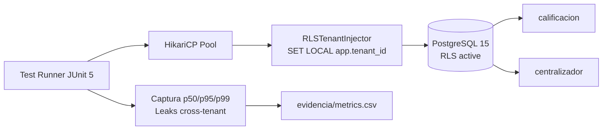

# Prueba de Concepto (POC) — POC-01

> **Estado**: Propuesta · **Resultado**: Pendiente de ejecución
> Documento base: `plantillas/POC_TEMPLATE.md`
> Trazabilidad: `docs/DTI.md §12.1` · `docs/adr/0001-multitenancy-rls-postgresql.md` · `AGENTS.md §1`

---

## POC-01: Multitenancy con PostgreSQL 15 Row-Level Security

### 0. Metadatos

| Campo | Valor |
|-------|-------|
| ID | `POC-01` |
| Título | Multitenancy con PostgreSQL 15 Row-Level Security |
| Grupo | `G-EduSync` |
| Responsable(s) | Rodrigo Aspeti |
| Fecha de inicio | Pendiente |
| Fecha objetivo de cierre | Pendiente (cronograma de 3 dias segun `docs/DTI.md §12.1`) |
| Estado | Propuesta |
| ADR relacionado | `ADR-0001` (Multitenancy mediante Row-Level Security en PostgreSQL 15) |

### 1. Riesgo que mitiga

Fuga de datos entre tenants (unidades educativas) cuando dos colegios distintos comparten la misma instancia RDS. El riesgo concreto es que un docente, secretaria o director de un colegio A pueda leer o modificar registros del colegio B bajo condiciones de:

- Alta concurrencia con multiples sesiones JPA por tenant.
- Queries complejas con `JOIN` entre tablas con `tenant_id`.
- Olvido humano de aplicar la politica RLS en una tabla nueva.

El impacto es legal (Ley boliviana de proteccion de datos) y de negocio (perdida de confianza institucional). Ver `ADR-0001 §1 Contexto`.

### 2. Hipótesis

> *Creemos que aplicar `SET LOCAL app.tenant_id = :id` antes de cada transaccion JPA, combinado con una politica `RLS` activa en cada tabla sensible, garantiza aislamiento total entre tenants con overhead de latencia p95 < 5 ms respecto al baseline sin RLS.*

### 3. Criterio de éxito medible (SMART)

- **Aislamiento (obligatorio)**: 0 registros de un tenant ajeno en 1000 requests concurrentes mezclados de 2 tenants distintos.
- **Latencia (obligatorio)**: p95 de operaciones INSERT/SELECT sobre `calificacion` y `centralizador` < 505 ms.
- **Test golden (obligatorio)**: `MultitenantTest.no_cross_tenant_data` pasa al 100 % (1000/1000).
- **Umbral de fracaso (obligatorio)**: si se detecta >= 1 leak cross-tenant o p95 >= 600 ms → POC fallida y se invalida `ADR-0001`.

### 4. Alcance reducido (time-boxed)

- **Funcionalidades incluidas**:
  - 2 tablas: `calificacion` y `centralizador` con columna `tenant_id NOT NULL`.
  - 2 tenants sinteticos (UUIDs fijos para reproducibilidad).
  - PostgreSQL 15 real via Docker / Testcontainers.
  - Politica RLS `tenant_isolation` por tabla.
  - Inyeccion de `tenant_id` en cada TX simulando `RLSTenantInjector` (StatementInspector Hibernate o interceptor JDBC).
  - 1000 requests mixtos INSERT/SELECT entre los 2 tenants (200 hilos).
- **Funcionalidades excluidas**:
  - Frontend Angular 17.
  - Autenticacion JWT real (NFR-008).
  - Cifrado PII con AWS KMS (NFR-007 — fuera de scope; ver POC futura).
  - Despliegue en AWS ECS Fargate.
  - Las otras 12 tablas del modelo (solo se prueba el patron en 2 tablas representativas).
- **Duración máxima**: 3 dias. Si se excede, se cierra y se documenta lo aprendido en §11.

### 5. Diseño de la prueba

#### 5.1 Stack usado

| Componente | Tecnología | Versión |
|------------|------------|---------|
| Lenguaje | Java | 21 |
| Framework | Spring Boot | 3.3.x |
| ORM | Spring Data JPA + Hibernate | 6.x |
| Base de datos | PostgreSQL | 15 |
| Contenedor BD | Docker / Testcontainers | 1.19.x |
| Test runner | JUnit | 5 |

#### 5.2 Arquitectura de la POC

#### 5.3 Datos de prueba

- **Origen**: sinteticos generados en el setup del test.
- **Volumen**: 1000 requests = 500 INSERTs + 500 SELECTs, repartidos 50/50 entre 2 tenants.
- **Tenants**: `TENANT_A = 11111111-1111-1111-1111-111111111111`, `TENANT_B = 22222222-2222-2222-2222-222222222222`.
- **Sesgos conocidos**: no se prueban 10+ tenants concurrentes; no se prueba con > 100 GB de datos.

#### 5.4 Procedimiento experimental

1. Levantar contenedor PostgreSQL 15 vía Testcontainers.
2. Aplicar migracion Flyway `V001__schema.sql` con 2 tablas + politicas RLS.
3. Configurar HikariCP pool con `connectionInitSql = SET app.tenant_id TO 'unset'`.
4. Generar 200 hilos concurrentes via `ExecutorService`; cada hilo envia INSERT/SELECT mezclados.
5. Cada operacion ejecuta `SET LOCAL app.tenant_id = ?` y mide `System.nanoTime()` antes/despues.
6. Al terminar, ejecutar consulta `SELECT COUNT(*) FROM calificacion` desde la sesion del Tenant A esperando 0 filas de Tenant B (verificacion de leak).
7. Calcular p50/p95/p99 y exportar a CSV.
8. Repetir el experimento 3 veces para estabilizar resultados.

### 6. Entorno

- **Ejecución**: local con Docker Desktop.
- **Recursos minimos**: 4 CPU, 8 GB RAM, 5 GB disco.
- **Instancia AWS**: N/A (POC local).
- **Costo estimado**: 0 USD (solo recursos locales).

### 7. Herramientas de medición

- JUnit 5 para orquestar el test.
- Testcontainers para PostgreSQL 15 reproducible.
- `System.nanoTime()` para latencia por operacion.
- HdrHistogram (opcional) para percentiles precisos.
- Exportador CSV propio para `evidencia/metrics.csv`.
- `psql` para inspeccion ad-hoc del estado RLS de cada tabla.

### 8. Plan de ejecución

| Día | Actividad | Responsable |
|-----|-----------|-------------|
| 1 | Setup proyecto Maven, Docker PostgreSQL 15, migracion Flyway con RLS | Rodrigo Aspeti |
| 2 | Implementar `RLSTenantInjector` + test concurrente `MultitenantTest` | Rodrigo Aspeti |
| 3 | Ejecutar 3 corridas, capturar metricas, llenar `§9` y `§10` de este README | Rodrigo Aspeti |

### 9. Resultados

> Completar **al finalizar** la POC. Hoy: Pendiente de ejecución.

#### 9.1 Tabla de métricas

| Métrica | Valor obtenido | Umbral éxito | Veredicto |
|---------|----------------|--------------|-----------|
| Leaks cross-tenant en 1000 requests | Pendiente | = 0 | Pendiente |
| p95 INSERT/SELECT | Pendiente | < 505 ms | Pendiente |
| p99 INSERT/SELECT | Pendiente | informativo | Pendiente |
| `MultitenantTest.no_cross_tenant_data` pasa | Pendiente | 100 % (1000/1000) | Pendiente |

#### 9.2 Gráficos / capturas

- Pendiente. Ver `evidencia/` cuando este disponible.

### 10. Conclusiones y veredicto

> Pendiente de ejecución. No completar antes de tener métricas reales.

### 11. Aprendizajes (lessons learned)

> Pendiente de ejecución.

### 12. Riesgos remanentes

- Esta POC no prueba > 2 tenants simultaneos.
- No prueba escala de 100+ GB ni 200+ tenants activos (umbral del Plan B en `ADR-0001 §6`).
- No prueba interaccion con cifrado KMS (NFR-007); puede agregar overhead adicional.
- No prueba threads asincronos de consolidacion donde el `tenant_id` debe propagarse manualmente (`ADR-0001 §4.2`).

### 13. Referencias

- `docs/DTI.md §12.1` — definicion original de la POC.
- `docs/adr/0001-multitenancy-rls-postgresql.md` — decision aceptada.
- `docs/arquitectura_funcional_EduSync.md` DA-01.
- `AGENTS.md §6` — golden tests obligatorios (`MultitenantTest`).
- PostgreSQL 15 Row Security Policies: https://www.postgresql.org/docs/15/ddl-rowsecurity.html
- Hibernate StatementInspector: https://docs.jboss.org/hibernate/orm/6.4/userguide/html_single/Hibernate_User_Guide.html

### 14. Historial

| Versión | Fecha | Autor | Cambio |
|---------|-------|-------|--------|
| 0.1 | 28/05/2026 | Rodrigo Aspeti | creacion del documento base (secciones 0-8) |

---

## Checklist de cierre de POC

- [x] Hipótesis y criterio de éxito declarados antes de ejecutar.
- [x] Alcance time-boxed respetado (3 dias).
- [ ] Resultados numéricos con evidencia en `evidencia/`.
- [ ] Veredicto explícito (✅ / ⚠️ / ❌).
- [ ] Aprendizajes capturados.
- [ ] ADR-0001 actualizado si la POC cambia la decision.
