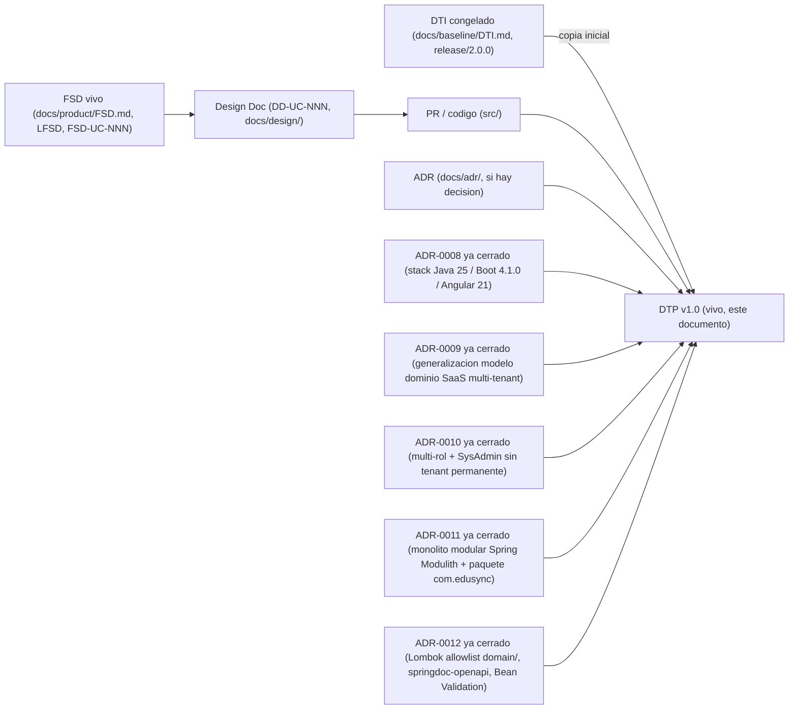

# Documento Técnico del Producto (DTP) — EduSync

> **Qué es**: el DTP es la **continuación viva del DTI**. Donde el DTI fue *"el plano"* (foto técnica congelada al cierre de M4, `release/2.0.0`, ver `docs/baseline/DTI.md`), el DTP es *"el DTI que compila"*: el **contrato técnico vigente** del producto mientras se implementa. Consolida la entrega final (documentación + software).
>
> **Regla de oro** (heredada del modelo documental de M4, ver [`plantillas/plantillas3/MODELO_DOCUMENTAL_IMPLEMENTACION.md`](../../plantillas/plantillas3/MODELO_DOCUMENTAL_IMPLEMENTACION.md)): **cero divergencia silenciosa**. Si el código necesita contradecir una decisión del DTI vFinal, primero se actualiza el ADR + este DTP + la spec viva; **nunca al revés**.
>
> **Qué NO es**: este DTP **no reescribe** el baseline congelado (`BRD/MRD/PRD/FSD clásico + DTI` en `docs/baseline/`, recuperable por el tag `release/2.0.0`). El baseline es el registro histórico evaluado de M4 y permanece intacto (ver `.cursor/rules/baseline-congelado.mdc` y `CODEOWNERS`).
>
> ⚠️ **Punto de partida (`v1.0`)**: esta primera versión del DTP es un **placeholder inicial**. `release/3.0.0` todavía no ha arrancado (`src/` está vacío en `AGENTS.md` §3): no existe ningún `DD-UC-NNN` ni `PR-IMPL-NNN` todavía. §A.1–A.4 no tienen filas reales más allá del delta de stack de `ADR-0008`, y §B marca `no` (sin cambios) en casi todas las secciones porque nada se ha implementado aún. Este documento se puebla incrementalmente con cada design doc y cada PR de implementación, vía el skill `@dtp-sync`.

## Cómo se origina

1. Se copia el **DTI vFinal / congelado** (`docs/baseline/DTI.md`, tag `release/2.0.0`) como punto de partida conceptual del DTP (`status: vivo`).
2. A partir de aquí, **todo cambio técnico** entra por el flujo de control de cambios (ver §A).
3. El baseline de M4 queda inmutable en `docs/baseline/` + tag `release/2.0.0`.

---

## A. Control de cambios (núcleo del DTP) `[humano+máquina]`

> Esta sección es lo que distingue al DTP del DTI. Todo cambio técnico durante la implementación se registra aquí.

### A.1 Changelog de implementación

| Fecha | Cambio | Disparador (FSD-UC / DD / hallazgo) | ADR | PR / commit | Autor |
|-------|--------|-------------------------------------|-----|-------------|-------|
| 28/05/2026 | Apertura de la capa viva (`docs/product/`) y creación de este DTP v1.0 como punto de partida | Cierre de M4 → transición a `release/3.0.0` (`plantillas/plantillas3/MODELO_DOCUMENTAL_IMPLEMENTACION.md`) | — | `pendiente de commit formal` | Rodrigo Aspeti |
| 28/05/2026 | Fijación del stack vivo: Java 21/Boot 3.3/Angular 17 (baseline) → Java 25 LTS/Spring Boot 4.1.0/Angular 21 LTS (vivo) | Apertura de `release/3.0.0` sobre `src/` vacío (greenfield, sin costo de migración) | `ADR-0008` | `pendiente de commit formal` | Rodrigo Aspeti |
| 12/07/2026 | Generalización del modelo de dominio a plataforma SaaS multi-tenant configurable: nuevo rol `SysAdmin` + entidad `Tenant` con suscripción; módulos configurables `GestionEscolar`/`PeriodoEvaluacion`/`SeccionEvaluacion`/`TipoEvaluacion`/`Evaluacion`/`Curso`/`Paralelo`/`Materia`/`Estudiante`/`Inscripcion`/`Usuario` añadidos como extensión aditiva sobre el Perfil Bolivia SIE (sin modificarlo) | Nuevo diseño funcional recibido para `release/3.0.0` (roles SaaS, periodos y secciones de evaluación configurables, estructura académica genérica) | `ADR-0009` | `pendiente de commit formal` | Rodrigo Aspeti |
| 14/07/2026 | Refinamiento del modelo de roles: `Usuario.rol` (valor único, `ADR-0009`) reemplazado por relación N:M `UsuarioRol` (multi-rol); invariante permanente `tenant_id IS NULL ⟺ roles = {SYSADMIN}` (no transitoria de *bootstrap*) | Clarificación de negocio recibida durante el diseño del login y del alta de tenants (multi-rol operativo + alcance del rol SysAdmin) | `ADR-0010` | `pendiente de commit formal` | Rodrigo Aspeti |
| 14/07/2026 | Primer Design Doc (`DD-UC-001`, bootstrap del proyecto) y primer prompt de implementación (`PR-IMPL-001`): monolito modular con Spring Modulith (module-first, 5 módulos: `plataforma`/`identidad`/`academico`/`notassie`/`shared`) y renombrado del paquete base `bo.edusync` → `com.edusync` | Inicio de la implementación de código para los features "alta de tenants" y "login" (`FSD-UC-011`/`FSD-UC-021`), sobre `src/` vacío | `ADR-0011` | `pendiente de commit formal` (ejecución de `PR-IMPL-001` aún no realizada) | Rodrigo Aspeti |
| 18/07/2026 | **Ejecución de `PR-IMPL-001`**: esqueleto real generado — `backend/pom.xml` (Spring Boot 4.1.0 parent, Java 25, `spring-modulith-bom` 2.1.0), `EduSyncApplication`, los 5 módulos vacíos (`plataforma`/`identidad`/`academico`/`notassie`/`shared`, cada uno con `domain`/`application`/`infrastructure` + `package-info.java`), `shared.tenant.TenantContext` (placeholder) y `shared.exception.DomainException` (excepción base), `ModularityTests` (JUnit 5 + `spring-modulith-starter-test`), `application*.yml` + `V1__init.sql` (Flyway baseline vacío); `frontend/` Angular 21 standalone (`ng new`) con `core`/`shared`/`features` vacíos; `infra/docker-compose.yml` (PostgreSQL 15) | Ejecución del prompt aprobado en `docs/design/DD-UC-001.md §5` | — (ejecución de una decisión ya formalizada en `ADR-0011`; sin delta nuevo) | `mvn test` → `ModularityTests`: 7/7 en verde (`ApplicationModules.verify()` sin ciclos ni accesos ilegales); `ng build` → bundle generado sin errores. `pendiente de commit formal` (commit real aún no creado en este turno) | Rodrigo Aspeti |
| 14/07/2026 | Segundo Design Doc (`DD-UC-002`, módulo `identidad`) y segundo prompt de implementación (`PR-IMPL-002`): dominio `Usuario`/`UsuarioRol`, login JWT, seed del primer `SYSADMIN`, implementación real de `TenantContextProvider` (cierra el placeholder de `ADR-0001`) y puerto público `UsuarioCreacionPort`. Decisión explícita del usuario: `identidad`/login se implementa antes que `plataforma`/tenants (invierte el orden insinuado en `DD-UC-001` §2), y el aislamiento RLS de tablas plataforma-scoped se resuelve con la política `OR tenant_id IS NULL` (sin `ADR-0012` dedicado) | Continuación de la implementación de código para "login" (`FSD-UC-021`, parcial); prerequisito de `FSD-UC-011` (alta de tenants, `DD-UC-003`) | — (decisiones documentadas en `DD-UC-002` §2/§3, no ameritan ADR propio) | `pendiente de commit formal` (ejecución de `PR-IMPL-002` aún no realizada) | Rodrigo Aspeti |
| 14/07/2026 | Tercer Design Doc (`DD-UC-003`, módulo `plataforma`) y tercer prompt de implementación (`PR-IMPL-003`): dominio `Tenant`, ciclo de suscripción, scheduler de vencimiento (`@Scheduled`), puerto público `TenantConsultaPort` y primer caso real de comunicación bidireccional `plataforma`↔`identidad` (enforcement de `BR-014` en `AutenticarUsuarioService`). Decisiones explícitas del usuario: tenant demo diferido a un Design Doc de seguimiento aún sin crear; scheduler `@Scheduled` interno (sin `ShedLock` por ahora); alta de tenant + admin en dos llamadas REST separadas, consistente con `FSD-UC-011` ya documentado | Continuación de la implementación de código para "alta de tenants" (`FSD-UC-011`, completo); consume `UsuarioCreacionPort` de `identidad` (`DD-UC-002`) | — (decisiones documentadas en `DD-UC-003` §2/§3, no ameritan ADR propio) | `pendiente de commit formal` (ejecución de `PR-IMPL-003` aún no realizada) | Rodrigo Aspeti |
| 18–19/07/2026 | **Ejecución de `PR-IMPL-002`** (módulo `identidad` completo): dominio `Usuario`/`UsuarioRol`/`Rol` con invariante permanente validada en `Usuario.crear()`; login `POST /api/v1/auth/login` (JWT HS256, 8 h); `TenantContextProvider`/`TenantAwareDataSource` reales (cierran el placeholder de `ADR-0001`); migración `V2__identidad_usuario.sql` (política RLS `OR tenant_id IS NULL`); seed `SysAdminSeeder`; puerto público `UsuarioCreacionPort`. Corrección técnica durante la ejecución: `spring-boot-starter-flyway` explícito (Spring Boot 4.x separó la autoconfiguración de Flyway de `spring-boot-autoconfigure`) y renombrado de artefactos Testcontainers 2.x (`testcontainers-junit-jupiter`/`testcontainers-postgresql`). **Herramientas de productividad backend** (`ADR-0012`, aplicadas sobre este mismo módulo): Lombok 1.18.46 (sin restricción en `infrastructure`/`application`; en `domain/` bajo *allowlist* — `Usuario.getId()`/`getTenantId()`/etc. reemplazan los accessors fluidos manuales, `getRoles()` se mantiene manual por transformar el tipo del campo), springdoc-openapi 3.0.3 (`/v3/api-docs`, `/swagger-ui.html`, Bearer `SecurityScheme` en `shared.web.OpenApiConfig`) y `spring-boot-starter-validation` (`@NotBlank`/`@Email` en `LoginRequest` + `shared.web.GlobalExceptionHandler` transversal). Requirió actualizar `pom.xml` con `annotationProcessorPaths` explícito para Lombok (la detección implícita vía classpath no bastó bajo Java 25/Maven 3.9). Verificación: `mvn test` → 27/27 tests en verde (incluye `ModularityTests` 7/7); smoke test manual de `/v3/api-docs` (expone `/api/v1/auth/login` + `bearerAuth`), `/swagger-ui/index.html` (200 OK) y validación 400 con formato `{codigo, mensaje}` | Ejecución de los prompts aprobados en `docs/design/DD-UC-002.md §5` (identidad) y `docs/adr/0012-*.md` (herramientas transversales) | `ADR-0012` (Lombok/springdoc-openapi/Bean Validation; `ADR-0001`/`0008`/`0010`/`0011` ya cerrados, sin cambios) | `mvn test`: 27/27 verde; smoke test manual de Swagger UI/OpenAPI en verde. `pendiente de commit formal` | Rodrigo Aspeti |
| 19/07/2026 | **Ejecución de `PR-IMPL-003`** (módulo `plataforma` completo, `FSD-UC-011` cierra su implementación): dominio `Tenant` (Aggregate Root con mutabilidad controlada de `estado`, único caso del backend donde un AR no es 100 % inmutable — justificado en su Javadoc, `BR-013`/`BR-014`) + `EstadoTenant`; casos de uso `RegistrarTenantUseCase`/`CambiarEstadoTenantUseCase`/`CrearAdminTenantUseCase` (delega a `UsuarioCreacionPort` de `identidad`)/`VencimientoSchedulerService` (con `Clock` inyectado vía `shared.time.ClockConfig`, testeable); `TenantController` con `POST /tenants`, `POST /tenants/{id}/admins`, `PATCH /tenants/{id}/estado`, los tres restringidos a `SYSADMIN` (`@PreAuthorize`, `@EnableMethodSecurity` habilitado en `SecurityConfig`); `VencimientoSchedulerJob` (`@Scheduled` diario, `@EnableScheduling` en `EduSyncApplication`); migración `V3__plataforma_tenant.sql` (tabla `tenant`, sin política RLS propia). Enforcement de `BR-014` en `identidad`: nuevo puerto público `identidad.TenantConsultaPort` + `identidad.domain.TenantNoActivoException`, consultado por `AutenticarUsuarioService` tras validar credenciales (evita fuga de información); `AuthController` mapea la excepción a HTTP 403 `E_TENANT_NO_ACTIVO`. **Refinamiento de diseño respecto a `DD-UC-003` §2** (documentado en el Javadoc del puerto, sin ADR dedicado): `TenantConsultaPort` se declaró en la raíz de `identidad` y no de `plataforma` como sugería el Design Doc, porque Spring Modulith rechaza ciclos de dependencia entre módulos (`plataforma` ya depende de `identidad` vía `UsuarioCreacionPort`); la implementación real (`TenantConsultaPortImpl`) vive en `plataforma.infrastructure.adapter.out.port` — funcionalmente idéntico (Open Host Service, consulta sincrónica), solo cambia qué módulo "hospeda" la interfaz. Corrección técnica encontrada durante la ejecución: `HttpStatus.UNPROCESSABLE_ENTITY` fue renombrado a `HttpStatus.UNPROCESSABLE_CONTENT` en Spring Framework 7.x (Spring Boot 4.1) — actualizado en `TenantController` y `TenantIntegrationTest`. Verificación: `mvn test` (clean) → 45/45 tests en verde (incluye `ModularityTests` 7/7 confirmando cero ciclos con la nueva comunicación bidireccional `plataforma`↔`identidad`); `TenantIntegrationTest` (Testcontainers) cubre de punta a punta alta tenant+admin en dos llamadas, bloqueo de login por `BR-014`, RBAC `SYSADMIN` y `E_SUSCRIPCION_INCOMPLETA` (422) | Ejecución del prompt aprobado en `docs/design/DD-UC-003.md §5` / `docs/prompts/impl/PR-IMPL-003.md` | — (refinamiento de diseño de bajo riesgo documentado inline, no amerita ADR propio, mismo criterio que `DD-UC-002`/`DD-UC-003` §2-§3 previos) | `mvn test` (clean): 45/45 verde. `pendiente de commit formal` | Rodrigo Aspeti |
| 19/07/2026 | Cuarto Design Doc (`DD-UC-004`) y cuarto prompt (`PR-IMPL-004`): primer *vertical slice* de UI Angular (login + consola SysAdmin) y delta backend `GET /api/v1/plataforma/tenants`. Decisiones explícitas del usuario: un solo DD de UI; JWT en `sessionStorage`; incluir lista de tenants. Reasigna el ID `DD-UC-004` (antes citado informalmente en `DD-UC-002` para CRUD usuarios) a esta UI; CRUD usuarios queda como `DD-UC-005` | Continuación de implementación hacia demo E2E login→tenants (`FSD-UC-021` UI parcial + `FSD-UC-011` UI) | — (sin ADR nuevo) | `pendiente de commit formal` (diseño aprobado; ejecución registrada en fila siguiente) | Rodrigo Aspeti |
| 19/07/2026 | **Ejecución de `PR-IMPL-004`** (UI Angular + delta `GET /tenants`): `frontend/src/app/core/auth` (`AuthService` con JWT en `sessionStorage`, interceptor Bearer, `authGuard`/`roleGuard`, `jwt.util`); `features/auth/login`; `features/plataforma` (lista, alta tenant, alta admin en dos pasos, cambio de estado); shell mínimo + `proxy.conf.json` (`/api` → `localhost:8080`); rutas `/login` pública y `/plataforma/**` restringidas a `SYSADMIN`. Delta backend: `ListarTenantsUseCase`/`ListarTenantsService` + `TenantRepositoryPort.listarTodos()` + `GET` en `TenantController` (`@PreAuthorize("hasRole('SYSADMIN')")`). Corrección técnica durante la ejecución: `SecurityConfig` desactiva Basic Auth/form login in-memory de Boot, registra `UserDetailsService` vacío y `HttpStatusEntryPoint(UNAUTHORIZED)`, y deja `/error` público — sin ello `TestRestTemplate` enviaba Basic Auth automático y las peticiones "sin token" recibían 403 en lugar de 401. Verificación: `mvn test` → **50/50** verdes (incluye `ModularityTests` 7/7; `ListarTenantsServiceTest` 2 + 3 tests de integración GET); `ng build` sin errores (lazy chunks login/tenants/shell) | Ejecución del prompt aprobado en `docs/design/DD-UC-004.md §5` / `docs/prompts/impl/PR-IMPL-004.md` | — (sin ADR nuevo; ajuste de `SecurityConfig` es corrección de contrato REST, documentada inline) | `mvn test`: 50/50 verde; `ng build` verde. `pendiente de commit formal` | Rodrigo Aspeti |
| 04/08/2026 | Quinto Design Doc (`DD-UC-005`) y quinto prompt de implementación (`PR-IMPL-005`), diseñados y ejecutados en el mismo turno: CRUD backend administrativo de Usuarios y Roles que completa `FSD-UC-021` — alta multi-rol, `PATCH /usuarios/{id}/roles`, `PATCH /usuarios/{id}/estado`, restablecimiento de contraseña con token de un solo uso (`PasswordResetToken`, hash SHA-256, sin persistir el valor en claro). Decisiones explícitas del usuario: notificación de reset *log-only* (sin proveedor de email decidido); rol `ASESOR` asignable sin la validación `E_ASESOR_SIN_CURSO` (diferida, bloqueada por `ADR-0009` §3, módulo `academico` inexistente); filtro de tenant explícito en la capa de aplicación (mismo patrón `DD-UC-002` §2), con `404` (no `403`) para usuarios de otro tenant; migración `V4__identidad_password_reset_token.sql` sin `tenant_id`/RLS propios (mismo precedente que `tenant` en `V3` y que el flujo de login en `V2`: la confirmación es pública, sin tenant activo en la sesión); UI Angular diferida a un futuro `DD-UC-006`. **Bug corregido durante la ejecución** (expuesto por ser el primer caso de `UsuarioRepositoryPort.guardar()` sobre un usuario ya persistido): `UsuarioRepositoryAdapter.guardar()` construía siempre una entidad JPA nueva con roles de UUID aleatorio, y el merge de Hibernate de una colección `@OneToMany(orphanRemoval=true)` reemplazada encolaba los INSERT antes que los DELETE, violando `uq_usuario_rol` cuando el nuevo conjunto conservaba un rol ya existente (p. ej. `PATCH estado` sin cambiar roles); corregido reutilizando la entidad administrada y mutando la colección de roles *in-place* (`UsuarioJpaEntity.reemplazarRoles`). **Gap de tooling detectado, fuera de alcance**: `mvn checkstyle:check` falla con 1073 violaciones en todo el backend (archivos previos incluidos) porque `pom.xml` usa el ruleset `sun_checks.xml` por defecto en vez de uno acorde a Google Java Style (`AGENTS.md` §5); el linter nunca estuvo realmente en verde en este proyecto; recomendado como tarea de seguimiento dedicada | Cierre de `FSD-UC-021` (CRUD administrativo, resto no cubierto por `DD-UC-002`/`DD-UC-004`) | — (decisiones documentadas en `DD-UC-005` §2/§3, no ameritan ADR propio, mismo criterio que `DD-UC-002`/`DD-UC-003`) | `mvn test`: **72/72** verde (incluye `ModularityTests` 7/7; `UsuarioIntegrationTest` 3/3 con Testcontainers PostgreSQL 15) | Rodrigo Aspeti |
| 04/08/2026 | Sexto Design Doc (`DD-UC-006`) y sexto prompt de implementación (`PR-IMPL-006`), diseñados y ejecutados en el mismo turno: consola Angular de administración de Usuarios y Roles que cierra `FSD-UC-021` en la capa de presentación — lista (`GET /usuarios`), alta multi-rol, edición de roles (dialog con checkboxes), cambio de estado, botón de restablecimiento de contraseña (con mensaje transparente sobre la limitación *log-only* del backend, sin simular un envío de correo que no ocurre), y pantalla pública `/restablecer-password` para completar el flujo. **Sin delta de backend** (`DD-UC-005` ya expone todos los contratos consumidos). Decisiones explícitas del usuario: reutilizar el patrón sin design system de `features/plataforma/` (`DD-UC-004`); roles de tenant como checkboxes fijos, `SYSADMIN` nunca seleccionable (`ADR-0010`); sin campo de curso/paralelo para `ASESOR` (el backend no lo valida todavía, `DD-UC-005` §1). Delta menor agregado durante la ejecución, no listado en el diseño original: `shell.component.ts` gana enlaces de navegación condicionales por rol (`SYSADMIN`→Tenants, `ADMIN`→Usuarios, antes "Tenants" era incondicional); `login.page.ts` redirige `ADMIN` → `/usuarios` (antes caía en el placeholder `/home`) | Cierre de `FSD-UC-021` en UI (backend ya completo desde `DD-UC-005`) | — (decisiones documentadas en `DD-UC-006` §2/§3, no ameritan ADR propio) | `ng build`: verde (3 lazy chunks nuevos: `usuarios-list-page`, `usuario-create-page`, `reset-password-confirm-page`); `ng test` no ejecutable en este entorno (Vitest sin paquete de browser instalado, limitación de entorno documentada, no test omitido). `pendiente de commit formal` | Rodrigo Aspeti |
| 20/08/2026 | Séptimo Design Doc (`DD-UC-007`) y séptimo prompt de implementación (`PR-IMPL-007`), diseñados y ejecutados en el mismo turno: filtros y paginación reutilizables en los dos listados `GetAll` existentes — `GET /usuarios` (`q` sobre `nombreCompleto` **o** `email`, case-insensitive; `activo`; `rol`) y `GET /plataforma/tenants` (`q` sobre `nombre`; `estado`), ambos con `page`/`size` (default `0`/`20`, máximo `100`). Patrón reutilizable creado desde cero para futuros listados: `shared.PageQuery`/`shared.PageResult<T>` (framework-free, capa `application`/`domain`) + `shared.web.PageResponse<T>` (DTO REST, con `PageResponse.from(PageResult, mapper)`); primer uso de `Specification`/`JpaSpecificationExecutor` en el proyecto (`UsuarioSpecifications`, `TenantSpecifications`) para combinar filtros opcionales sin condicionales anidados en los repositorios. Invariante preservada explícitamente: `UsuarioRepositoryPort.listarPorTenant(UUID)` (sin paginar) se conserva intacto porque lo consume `shared.ai.BuscarUsuarioPorNombrePortImpl`; `tenantId` del filtro de usuarios nunca viene de un query param del cliente, siempre de `TenantContextProvider`. UI Angular de ambas listas actualizada con caja de búsqueda, selects de filtro y controles de paginación, reutilizando el patrón sin design system existente | Mejora no funcional sobre los dos `GetAll` de `FSD-UC-011` y `FSD-UC-021` (ambos ya completos backend+UI); necesidad operativa de localizar usuarios/tenants sin descargar la lista completa | — (decisiones documentadas en `DD-UC-007` §2/§3, no ameritan ADR propio; `ADR-0008`/`ADR-0011` ya cerrados, sin cambios) | `mvn test`: **98/98** verde (incluye `ModularityTests` 7/7 y nuevos tests de filtro/paginación en `UsuarioIntegrationTest`/`TenantIntegrationTest`); `ng build` verde. `pendiente de commit formal` | Rodrigo Aspeti |
| 20/08/2026 | Octavo Design Doc (`DD-UC-008`) y octavo prompt de implementación (`PR-IMPL-008`), diseñados y ejecutados en el mismo turno: **primer feature de negocio real del módulo `academico`** (hasta ahora vacío, solo `package-info.java`). `GestionEscolar` (Aggregate Root, mismo patrón inmutable-con-estado-mutable que `Tenant`) con `POST /gestiones-escolares`, `GET /gestiones-escolares` (filtros `q`/`estado` + paginación, reutilizando el patrón de `DD-UC-007` sin modificarlo) y `PATCH /gestiones-escolares/{id}/estado` (ciclo `PLANIFICACION`→`ACTIVA`→`CERRADA`, con reapertura `ACTIVA`→`PLANIFICACION` permitida en este slice, modelado con un `switch` exhaustivo sobre el estado actual en `GestionEscolar.cambiarEstado()`); migración `V5__academico_gestion_escolar.sql` (tabla `gestion_escolar` con `tenant_id` obligatorio y política RLS `FORCE`, sin el caso especial `OR tenant_id IS NULL` de `usuario`). Decisiones explícitas del usuario (confirmadas vía preguntas estructuradas): (1) backend completo con `PATCH estado`, **sin** exigir periodos/secciones configurados para activar — el FSD (§4.6.2 paso 3) describe la secuencia deseable pero no la declara como validación bloqueante (no hay excepción `A2` para esto, a diferencia de `A1 — Fechas inválidas`); (2) backend-only, UI Angular diferida a un Design Doc de seguimiento (mismo patrón `DD-UC-005`→`DD-UC-006`); (3) sin `audit_log` todavía — misma postura mínima de aislamiento que `Tenant`/`Usuario` (RLS `FORCE` + filtro explícito por `tenant_id` en la capa de aplicación + RBAC `ADMIN`), la gobernanza formal de los módulos nuevos sigue **pendiente de definición** (`ADR-0009` §3 punto 5). Verificación: `mvn test` → **119/119** verde (incluye `ModularityTests` 7/7, confirmando que `academico` sigue sin depender de `identidad`/`plataforma` más allá de `shared`; 21 tests nuevos: 8 de dominio, 7 de servicios con Mockito, 6 de integración con Testcontainers cubriendo alta, listado con filtros/paginación, ciclo de estado y aislamiento cross-tenant 404) | Cierre de `FSD-UC-012` (Gestión Escolar) en backend, primer caso de uso del módulo `academico` en pasar de `pendiente` a `en progreso` (backend completo, UI pendiente) | — (decisiones documentadas en `DD-UC-008` §2/§3, no ameritan ADR propio, mismo criterio que `DD-UC-002`/`DD-UC-003`/`DD-UC-005`/`DD-UC-007`; `ADR-0001`/`0008`/`0009`/`0011`/`0012` ya cerrados, sin cambios) | `mvn test`: **119/119** verde (incluye `ModularityTests` 7/7). `pendiente de commit formal` | Rodrigo Aspeti |
| 20/08/2026 | Noveno Design Doc (`DD-UC-009`) y noveno prompt de implementación (`PR-IMPL-009`), diseñados y ejecutados en el mismo turno: primer *vertical slice* de UI del módulo `academico` — consola Angular de Gestión Escolar (lista con filtros `q`/`estado` y paginación reutilizando `DD-UC-007`, alta, cambio de estado), cerrando `FSD-UC-012` en la capa de presentación sin tocar backend (`DD-UC-008` ya expone todos los contratos). Decisión de diseño explícita: el diálogo de cambio de estado calcula client-side las transiciones válidas del estado actual (`transicionesValidas(estadoActual)`), a diferencia del diálogo genérico de `Tenant` (`DD-UC-004`) que ofrece los 3 estados siempre porque cualquier transición es válida para un `Tenant`; ruta con prefijo de módulo `/academico/gestiones-escolares` (deja espacio de nav para `FSD-UC-013`..`020` futuros). Delta menor agregado durante la ejecución, no listado explícitamente en el diseño original: `shell.component.ts` gana el enlace "Gestión Escolar" junto a "Usuarios" (mismo condicional `hasRole('ADMIN')`) | Cierre de `FSD-UC-012` en UI (backend ya completo desde `DD-UC-008`) | — (decisiones documentadas en `DD-UC-009` §2/§3, no ameritan ADR propio, mismo criterio que `DD-UC-002`/`DD-UC-003`/`DD-UC-005`/`DD-UC-007`/`DD-UC-008`; `ADR-0008`/`ADR-0009` ya cerrados, sin cambios) | `ng build`: verde (2 lazy chunks nuevos: `gestiones-escolares-list-page`, `gestion-escolar-create-page`); `ng test` no ejecutable en este entorno (Vitest sin paquete de browser, limitación de entorno documentada). `pendiente de commit formal` | Rodrigo Aspeti |
| 20/08/2026 | Décimo Design Doc (`DD-UC-010`) y décimo prompt de implementación (`PR-IMPL-010`), diseñados y ejecutados en el mismo turno: segundo feature de negocio real del módulo `academico` — `Curso` y `Paralelo` (alta y listado, sin ciclo de vida), `POST/GET /cursos` (filtro `q` + paginación, reutilizando `DD-UC-007`) y `POST/GET /cursos/{id}/paralelos` (listado simple sin paginar, cardinalidad acotada, valida el `Curso` padre antes de crear/listar). Decisión de diseño explícita: `Curso` y `Paralelo` como Aggregates independientes con repositorios propios (no `Curso` con `List<Paralelo>` embebido), porque `Materia`/`Inscripcion`/`Usuario.curso_asignado_id` (Design Docs futuros) necesitan referenciar un `Paralelo` por id sin cargar el agregado padre completo; columna `tenant_id` redundante en `paralelo` para el mismo patrón de aislamiento RLS defensivo del resto del proyecto, aunque el FSD solo declara `curso_id` en su diccionario de datos. Explícitamente fuera de alcance: `PATCH`/`DELETE`, unicidad de nombre de paralelo, y la activación de `E_ASESOR_SIN_CURSO` en `identidad` (queda desbloqueada técnicamente pero se aborda en un DD de seguimiento dedicado). Verificación: `mvn test` → **134/134** verde (incluye `ModularityTests` 7/7; 15 tests nuevos: 3 de dominio, 7 de servicios con Mockito, 5 de integración con Testcontainers cubriendo alta/listado con filtro y paginación, validación del curso padre y aislamiento cross-tenant 404 en ambos recursos) | Cierre de `FSD-UC-017` (Cursos y Paralelos) en backend, segundo caso de uso del módulo `academico` en llegar a **completo (backend)** después de `GestionEscolar` (`FSD-UC-012`) | — (decisiones documentadas en `DD-UC-010` §2/§3, no ameritan ADR propio, mismo criterio que `DD-UC-008`; `ADR-0001`/`0008`/`0009`/`0011`/`0012` ya cerrados, sin cambios) | `mvn test`: **134/134** verde (incluye `ModularityTests` 7/7). `pendiente de commit formal` | Rodrigo Aspeti |
| 21/08/2026 | Undécimo Design Doc (`DD-UC-011`) y undécimo prompt de implementación (`PR-IMPL-011`), diseñados y ejecutados en turnos consecutivos del mismo día — **ejecutado**: segundo *vertical slice* de UI del módulo `academico`, después de Gestión Escolar (`DD-UC-009`) — consola Angular de Cursos y Paralelos (lista de Cursos con filtro `q`/paginación reutilizando `DD-UC-007`, alta de Curso, vista de detalle con los Paralelos de un Curso y alta inline de Paralelo), cerrando `FSD-UC-017` en la capa de presentación sin tocar backend (`DD-UC-010` ya expone todos los contratos). Decisiones explícitas de diseño: la vista de Paralelos es una pantalla/ruta propia (`/academico/cursos/:id/paralelos`), no un acordeón en la lista de Cursos, para evitar cargar los Paralelos de todos los Cursos de la página a la vez; el alta de Paralelo es un formulario inline en esa misma pantalla, sin ruta `/nuevo` separada, porque un `Paralelo` siempre se crea en el contexto de un `Curso` ya visible; sin `<select>` de filtro por estado en la lista de Cursos (`Curso` no tiene estado, `DD-UC-010` §2). Explícitamente fuera de alcance: edición/eliminación de `Curso`/`Paralelo` (el backend no expone `PATCH`/`DELETE`), pantallas de `FSD-UC-018`..`020`, selección de `Curso`/`Paralelo` para `Usuario` `ASESOR`. **Ejecución real** (mismo día): `frontend/src/app/features/academico/{curso.model,cursos-list.page,curso-create.page,curso-paralelos.page}.ts` generados, delta en `app.routes.ts`/`shell.component.ts`; refinamiento encontrado durante la ejecución (documentado en `DD-UC-011` §2/§8) — el backend no expone `GET /cursos/{id}`, el nombre del Curso se propaga como *query param* desde la lista hacia el detalle, sin delta de backend | Cierre de `FSD-UC-017` (Cursos y Paralelos) en UI, tercer `FSD-UC` en cerrar ambas capas (backend + UI), después de `FSD-UC-021` y `FSD-UC-012` | — (decisiones documentadas en `DD-UC-011` §2/§3, no ameritan ADR propio, mismo criterio que `DD-UC-009`; `ADR-0008`/`0009` ya cerrados, sin cambios) | `ng build`: **verde** (3 lazy chunks nuevos: `cursos-list-page`, `curso-create-page`, `curso-paralelos-page`). `pendiente de commit formal` | Rodrigo Aspeti |
| 21/08/2026 | Duodécimo Design Doc (`DD-UC-012`) y duodécimo prompt de implementación (`PR-IMPL-012`) — **diseño aprobado, ejecución pendiente**: primer *vertical slice* fullstack del módulo `academico` (backend + UI en el mismo DD, pedido explícito del usuario) — `Materia` + `AsignacionMateriaCurso` + `AsignacionMateriaProfesor` (tres Aggregates independientes, no FKs embebidas en `Materia`), `POST/GET /materias` (filtro `q` + paginación + `GET /{id}`), `POST/GET .../asignaciones-curso` y `.../asignaciones-profesor` (A1 `409 E_MATERIA_SIN_CURSO`), `GET /materias/profesores-disponibles`, puerto `academico.ProfesorConsultaPort` implementado por `identidad` (Open Host Service, espejo de `TenantConsultaPort`), consola Angular lista/alta/detalle con asignaciones inline, RBAC `ADMIN`+`SECRETARIA`. Explícitamente fuera de alcance: `PATCH`/`DELETE`, `FSD-UC-019` (`GET /profesores/{id}/asignaciones`), `FSD-UC-015`/`020`, `audit_log` (`ADR-0009` §3 punto 5) | Diseño de `FSD-UC-018` (Gestión de Materias) fullstack; código real todavía no generado | — (decisiones documentadas en `DD-UC-012` §2/§3, no ameritan ADR propio; `ADR-0001`/`0008`/`0009`/`0011`/`0012` ya cerrados, sin cambios) | `pendiente de ejecución de PR-IMPL-012` | Rodrigo Aspeti |
| 21/08/2026 | **Ejecución de `PR-IMPL-012`**: código real de Materias — tres Aggregates (`Materia`, `AsignacionMateriaCurso`, `AsignacionMateriaProfesor`), `ProfesorConsultaPort` en la raíz de `academico` + `ProfesorConsultaPortImpl` en `identidad` (arista `identidad → academico`, sin ciclo), `MateriaController` (`ADMIN`+`SECRETARIA`), delta GET de `CursoController` para `SECRETARIA`, `V7__academico_materia.sql` (RLS `FORCE` en las tres tablas), consola Angular lista/alta/detalle con asignaciones inline, `roleGuard` aditivo `data.roles`. Verificación: `mvn test` → **154/154** verde (incluye `ModularityTests` 7/7); `ng build` verde (3 lazy chunks: `materias-list-page`, `materia-create-page`, `materia-detalle-page`) | Cierre de `FSD-UC-018` (Gestión de Materias) **completo** (backend + UI) — cuarto `FSD-UC` en cerrar ambas capas, después de `FSD-UC-021`/`012`/`017` | — (sin ADR nuevo) | `mvn test`: **154/154** verde; `ng build` verde. `pendiente de commit formal` | Rodrigo Aspeti |
| 21/08/2026 | Decimotercer Design Doc (`DD-UC-013`) y decimotercer prompt de implementación (`PR-IMPL-013`) — **diseño aprobado, ejecución pendiente**: segundo *vertical slice* fullstack del módulo `academico` — `Estudiante` + `Inscripcion` (dos Aggregates independientes, `BR-023`), `POST/GET /estudiantes` (filtro `q`/`estado` + paginación + `GET /{id}`), `GET /estudiantes/{id}/inscripciones`, `POST /inscripciones` (A1 `409 E_INSCRIPCION_DUPLICADA`), `rude` obligatorio único por tenant (`BR-004`), consola Angular lista/alta/detalle con inscripciones inline, RBAC `ADMIN`+`SECRETARIA`, delta GET de `GestionEscolarController` para `SECRETARIA`. Explícitamente fuera de alcance: `PATCH`/`DELETE`, `FSD-UC-019`, `FSD-UC-001`, `audit_log` (`ADR-0009` §3 punto 5) | Diseño de `FSD-UC-020` (Estudiantes e Inscripciones) fullstack; código real todavía no generado | — (decisiones documentadas en `DD-UC-013` §2/§3, no ameritan ADR propio; `rude` aplica `BR-004` ya vigente, no reconcilia `ADR-0009` §3 punto 1) | `pendiente de ejecución de PR-IMPL-013` | Rodrigo Aspeti |
| 21/08/2026 | **Ejecución de `PR-IMPL-013`**: código real de Estudiantes e Inscripciones — dos Aggregates (`Estudiante`, `Inscripcion`), `EstudianteController`/`InscripcionController` (`ADMIN`+`SECRETARIA`), delta GET de `GestionEscolarController` para `SECRETARIA`, `V8__academico_estudiante_inscripcion.sql` (RLS `FORCE`, unique RUDE y unique inscripción por gestión), consola Angular lista/alta/detalle con inscripciones inline. Verificación: `mvn test` → **173/173** verde (incluye `ModularityTests` 7/7); `ng build` verde (3 lazy chunks: `estudiantes-list-page`, `estudiante-create-page`, `estudiante-detalle-page`) | Cierre de `FSD-UC-020` (Estudiantes e Inscripciones) **completo** (backend + UI) — quinto `FSD-UC` en cerrar ambas capas, después de `FSD-UC-021`/`012`/`017`/`018` | — (sin ADR nuevo) | `mvn test`: **173/173** verde; `ng build` verde. `pendiente de commit formal` | Rodrigo Aspeti |
| 21/08/2026 | Decimocuarto Design Doc (`DD-UC-014`) y decimocuarto prompt de implementación (`PR-IMPL-014`) — **diseño aprobado, ejecución pendiente**: tercer *vertical slice* fullstack del módulo `academico` — consola de Profesores (consulta inversa de `AsignacionMateriaProfesor`). Sin entidad/tabla `Profesor` (perfil de `Usuario` con rol `PROFESOR`); extensión de `ProfesorConsultaPort` (`buscarPorIdYTenant`, `listarDelTenant`); `GET /profesores` (`q`/`activo` + paginación), `GET /profesores/{id}`, `GET /profesores/{id}/asignaciones` (A1 `404 E_PROFESOR_NO_ENCONTRADO`); consola Angular lista/detalle de solo lectura; RBAC `ADMIN`+`SECRETARIA`. El alta permanece en `FSD-UC-021`; las escrituras de asignación permanecen en `FSD-UC-018`. Explícitamente fuera de alcance: `POST /profesores`, `PATCH`/`DELETE`, alta de asignaciones en esta consola, Flyway, `FSD-UC-015`/`001`, `audit_log` (`ADR-0009` §3 punto 5) | Diseño de `FSD-UC-019` (Gestión de Profesores) fullstack; código real todavía no generado | — (decisiones documentadas en `DD-UC-014` §2/§3, no ameritan ADR propio; reusa `ProfesorConsultaPort` de `DD-UC-012`) | `pendiente de ejecución de PR-IMPL-014` | Rodrigo Aspeti |
| 21/08/2026 | **Ejecución de `PR-IMPL-014`**: código real de Profesores — extensión de `ProfesorConsultaPort` (`buscarPorIdYTenant`, `listarDelTenant` con `q`/`activo` primitivos por Modulith), `ProfesorResumen` + `activo`, `ProfesorController` (`GET /profesores`, `GET /{id}`, `GET /{id}/asignaciones` enriquecido), `listarPorProfesorYTenant`, consola Angular lista/detalle de solo lectura (enlace de alta a Usuarios solo `ADMIN`). Sin Flyway ni tabla `Profesor`. Verificación: `mvn test` → **184/184** verde (incluye `ModularityTests` 7/7); `ng build` verde (2 lazy chunks: `profesores-list-page`, `profesor-detalle-page`) | Cierre de `FSD-UC-019` (Gestión de Profesores) **completo** (backend + UI) — sexto `FSD-UC` en cerrar ambas capas, después de `FSD-UC-021`/`012`/`017`/`018`/`020` | — (sin ADR nuevo) | `mvn test`: **184/184** verde; `ng build` verde. `pendiente de commit formal` | Rodrigo Aspeti |

### A.2 Deltas respecto al DTI vFinal

> Diferencias **deliberadas** entre lo diseñado en M4 y lo construido. Cada delta significativo exige un ADR.

| # | Sección del DTI afectada | Qué decía el DTI vFinal | Qué dice ahora el DTP | Motivo | ADR |
|---|--------------------------|-------------------------|-----------------------|--------|-----|
| 1 | `§4 Stack tecnológico` (`docs/baseline/DTI.md`, también reflejado en `AGENTS.md` §4) | Java 21 (LTS) / Spring Boot 3.3 / Angular 17 | Java 25 (LTS) / Spring Boot 4.1.0 (Spring Framework 7.0.8) / Angular 21 (LTS) | `src/` está vacío al cerrar M4 (greenfield): se adopta el stack más reciente estable disponible sin costo de migración, priorizando AOT Cache de Boot 4 sobre Java 25 y la ventana LTS de Angular 21 | `ADR-0008` |
| 2 | `§4 Modelo de dominio` (`docs/baseline/DTI.md`) | Modelo de dominio específico de Bolivia: tenant = colegio individual (sin capa SaaS), 3 roles (`DIRECTOR`/`SECRETARÍA`/`DOCENTE`), 3 periodos trimestrales fijos, dimensiones pedagógicas fijas (Ser/Saber/Hacer/Decidir/Autoevaluación), truncado `floor()` único, identidad exclusiva por RUDE | Se añade, como extensión aditiva (sin reemplazar lo anterior): capa de plataforma SaaS (`SysAdmin`, `Tenant` con suscripción), roles ampliados (`ADMIN`=`DIRECTOR`, `PROFESOR`=`DOCENTE`, + `SECRETARIA`, `ASESOR` nuevo), `GestionEscolar` con N periodos configurables, `SeccionEvaluacion`/`TipoEvaluacion` configurables, `Curso`/`Paralelo`/`Materia`/`Estudiante`/`Inscripcion`/`Usuario` genéricos | Nuevo diseño funcional recibido para `release/3.0.0`: EduSync se generaliza a plataforma SaaS multi-tenant configurable, sin perder el Perfil Bolivia SIE (que sigue soportado sin cambios) | `ADR-0009` |
| 3 | `BR-024` (`docs/product/BRD.md`, introducida por `ADR-0009`) | `Usuario.rol`: atributo ENUM de valor único ("exactamente un rol vigente") | `UsuarioRol`: relación N:M ("uno o más roles simultáneos"), con invariante permanente `Usuario.tenant_id IS NULL ⟺ roles = {SYSADMIN}` | Clarificación de negocio: una misma persona puede cubrir más de una función en su institución (multi-rol); el alcance de `tenant_id` nulo para `SYSADMIN` se confirma permanente, no transitorio de *bootstrap* | `ADR-0010` |
| 4 | `§5 Arquitectura hexagonal del core` (`docs/arquitectura_hexagonal_EduSync.md`) | Paquete base `bo.edusync`, organización paquete-por-capa (`domain`/`application`/`infrastructure` en la raíz) | Paquete base `com.edusync`, organización monolito modular *module-first* con Spring Modulith (5 módulos: `plataforma`/`identidad`/`academico`/`notassie`/`shared`), cada uno con su propia sub-estructura hexagonal | Inicio de la implementación de código (`DD-UC-001`, bootstrap): la generalización de `ADR-0009` hace inconsistente mantener un paquete con prefijo de país en el código de plataforma SaaS; Spring Modulith permite verificar límites de módulo en cada build | `ADR-0011` |
| 5 | `AGENTS.md §5` (regla de dominio: `domain/` sin imports de terceros) | Regla leída de forma literal como prohibición total de imports en `domain/` | Distinción explícita entre frameworks con comportamiento/ciclo de vida en runtime (Spring, JPA, AWS — prohibidos) y procesadores de anotaciones sin huella en runtime (Lombok, permitido en `domain/` bajo *allowlist* estrecho: `@Getter`/`@EqualsAndHashCode`/`@ToString` con nomenclatura JavaBean estándar; nunca `@Data`/`@Setter`/`@Builder` público) | Reducir el boilerplate de accessors en Aggregate Roots (`Usuario`, y los que vendrán en `plataforma`/`academico`) sin habilitar mutación no controlada; se añaden también springdoc-openapi (documentación viva de la API) y Bean Validation (validación declarativa de DTOs de entrada), sin restricción fuera de `domain/` | `ADR-0012` |

> **Pendiente de definición (`ADR-0009` §3, ver también `docs/product/FSD.md` §4.6/§5.1/§6.3):** (1) reconciliación entre `GestionAcademica`/`ParametroAcademico` (Perfil Bolivia) y `GestionEscolar`/`PeriodoEvaluacion`/`SeccionEvaluacion` (genérico); (2) generalización de secuencialidad de apertura y de promedio final a N periodos; (3) criterio de redondeo del cálculo de notas genérico; (4) validación de suma de pesos porcentuales de secciones; (5) gobernanza (auditoría/inmutabilidad) de los módulos nuevos. Ninguno debe implementarse en código sin un Design Doc o ADR de seguimiento que lo resuelva.
>
> **Pendiente de definición (`ADR-0010` §3, no bloqueante):** (1) el diseño detallado del tenant "demo" (primer tenant del sistema, funcionalidad de producto real para ventas) — no afecta el modelo de `Usuario`/`Rol`/`tenant_id`, se resuelve en el Design Doc de `FSD-UC-011`; (2) posible combinación futura `SYSADMIN` + rol de tenant (requeriría separar identidad de membresía en `usuario_tenant_rol`) — sin necesidad de negocio confirmada, no se construye ahora.

### A.3 Estado de implementación por FSD-UC

| FSD-UC | Design Doc | Estado | Release | Tests/Evals | Notas |
|--------|------------|--------|---------|-------------|-------|
| `FSD-UC-001` (Registro de calificaciones) | — | pendiente | `release/3.0.0` | — | Sin `DD-UC-NNN` creado todavía; usar `@feature-design-doc` para iniciar |
| `FSD-UC-003` (Consolidación de centralizadores) | — | pendiente | `release/3.0.0` | — | Ídem |
| `FSD-UC-004` (Exportación SIE) | — | pendiente | `release/3.0.0` | — | Ídem |
| `FSD-UC-005` (Modificación retroactiva) | — | pendiente | `release/3.0.0` | — | Ídem |
| `FSD-UC-009` (Administración de periodos) | — | pendiente | `release/3.0.0` | — | Ídem |
| `FSD-UC-011` (Gestión de Tenants y Suscripciones) | `DD-UC-003` + `DD-UC-004` (UI) + `DD-UC-007` (filtros/paginación) | **completo** (API + UI consola SysAdmin, con filtros/paginación) | `release/3.0.0` | 98/98 tests backend verde (incluye `ModularityTests` 7/7); `ng build` verde | **`PR-IMPL-003` ejecutado** (API). **`PR-IMPL-004` ejecutado** (19/07/2026): consola SysAdmin Angular + `GET /tenants`. **`PR-IMPL-007` ejecutado** (20/08/2026): `GET /tenants` gana filtros (`q`/`estado`) y paginación (`page`/`size`) + UI. Diseño del tenant "demo" sigue diferido |
| `FSD-UC-012` (Gestión Escolar) | `DD-UC-008` (backend) + `DD-UC-009` (UI) | **completo** (backend + UI, con filtros/paginación) | `release/3.0.0` | 119/119 tests backend verde (incluye `ModularityTests` 7/7; 21 tests nuevos: dominio, servicios, integración con Testcontainers); `ng build` verde | Primer feature de negocio real del módulo `academico`. **`PR-IMPL-008` ejecutado** (20/08/2026): `GestionEscolar` (alta, listado con filtros/paginación reutilizando `DD-UC-007`, ciclo de estado `PLANIFICACION`/`ACTIVA`/`CERRADA`, aislamiento cross-tenant 404). La precondición de periodos/secciones para `ACTIVA` (FSD §4.6.2 paso 3) queda diferida (no es excepción bloqueante en el FSD). **`PR-IMPL-009` ejecutado** (20/08/2026): consola Angular (lista con filtros/paginación, alta, diálogo de cambio de estado con transiciones válidas calculadas client-side). `FSD-UC-012` cierra su implementación completa (backend y UI) |
| `FSD-UC-013`..`FSD-UC-016` (Periodos/Secciones/Evaluaciones configurables, Cálculo de Notas) | — | pendiente | `release/3.0.0` | — | Sin `DD-UC-NNN` todavía. Puntos 2-5 de `ADR-0009` §3 siguen pendientes de definición antes de iniciar diseño de `FSD-UC-013` (secuencialidad de periodos) y `FSD-UC-016` (redondeo del cálculo de notas) |
| `FSD-UC-019` (Gestión de Profesores) | `DD-UC-014` (backend + UI fullstack) | **completo** (backend + UI) | `release/3.0.0` | mvn test 184/184 verde (incluye `ModularityTests` 7/7); `ng build` verde (2 lazy chunks) | Quinto feature de negocio real del módulo `academico`. Tercer *vertical slice* fullstack. **`PR-IMPL-014` ejecutado** (21/08/2026): sin entidad/tabla `Profesor`; extensión de `ProfesorConsultaPort`; `GET /profesores` + `GET /{id}` + `GET /{id}/asignaciones`; consola Angular de solo lectura; RBAC `ADMIN`+`SECRETARIA`. Alta en `FSD-UC-021`; escrituras en `FSD-UC-018`. Sexto `FSD-UC` en cerrar ambas capas |
| `FSD-UC-017` (Cursos y Paralelos) | `DD-UC-010` (backend) + `DD-UC-011` (UI) | **completo (backend + UI)** | `release/3.0.0` | mvn test 134/134 verde (backend); `ng build` verde (UI, 3 lazy chunks nuevos) | Segundo feature de negocio real del módulo `academico`, después de `GestionEscolar` (`DD-UC-008`/`DD-UC-009`). Sin dependencia de `ADR-0009` §3 puntos 2-5 (a diferencia de `FSD-UC-013`/`016`): `Curso`/`Paralelo` no tienen estado ni cálculo de notas. **`DD-UC-011` ejecutado** (21/08/2026): consola Angular (lista de Cursos, alta, detalle con Paralelos) — tercer `FSD-UC` en cerrar backend + UI, después de `FSD-UC-021`/`FSD-UC-012` |
| `FSD-UC-018` (Gestión de Materias) | `DD-UC-012` (backend + UI fullstack) | **completo** (backend + UI) | `release/3.0.0` | mvn test 154/154 verde (incluye `ModularityTests` 7/7); `ng build` verde (3 lazy chunks) | Tercer feature de negocio real del módulo `academico`. Primer *vertical slice* fullstack. **`PR-IMPL-012` ejecutado** (21/08/2026): tres Aggregates independientes; `ProfesorConsultaPort` en `academico` implementado por `identidad`; A1 `409 E_MATERIA_SIN_CURSO`; GET por id; RBAC `ADMIN`+`SECRETARIA`. Consume `Curso`/`Paralelo` (`DD-UC-010`) y `Usuario` `PROFESOR` (`DD-UC-005`). Cuarto `FSD-UC` en cerrar ambas capas |
| `FSD-UC-020` (Estudiantes e Inscripciones) | `DD-UC-013` (backend + UI fullstack) | **completo** (backend + UI) | `release/3.0.0` | mvn test 173/173 verde (incluye `ModularityTests` 7/7); `ng build` verde (3 lazy chunks) | Cuarto feature de negocio real del módulo `academico`. Segundo *vertical slice* fullstack. **`PR-IMPL-013` ejecutado** (21/08/2026): dos Aggregates independientes; `rude` obligatorio único por tenant (`BR-004`); A1 `409 E_INSCRIPCION_DUPLICADA`; GET por id; RBAC `ADMIN`+`SECRETARIA`. Consume `GestionEscolar` (`DD-UC-008`) y `Curso`/`Paralelo` (`DD-UC-010`). Quinto `FSD-UC` en cerrar ambas capas |
| `FSD-UC-021` (Usuarios y Roles / login) | `DD-UC-002` + `DD-UC-004` (UI login) + `DD-UC-005` (CRUD backend) + `DD-UC-006` (UI CRUD) + `DD-UC-007` (filtros/paginación) | **completo** (backend + UI, con filtros/paginación) | `release/3.0.0` | 98/98 tests backend verde (incluye `ModularityTests` 7/7, `UsuarioIntegrationTest` con filtro/paginación); `ng build` verde | **`PR-IMPL-002` + `PR-IMPL-004` + `PR-IMPL-005` + `PR-IMPL-006` + `PR-IMPL-007` ejecutados**: login JWT API + pantalla Angular + CRUD administrativo backend (roles, estado, restablecimiento de contraseña) + consola Angular de administración de usuarios + filtros/paginación (`q` por nombre o email, `activo`, `rol`, `page`/`size`) en backend y UI. `FSD-UC-021` cierra su implementación completa (backend y UI) |

### A.4 Trazabilidad código ↔ DTP

> Cadena completa por feature. Debe poder reconstruirse para cualquier línea del producto.

`BRD/MRD (baseline)` → `PRD/FSD vivo (FSD-UC-NNN)` → `Design Doc (DD-UC-NNN)` → `Prompt (PR-IMPL-NNN)` → `PR/commit` → `Tests/Evals` → `ADR (si aplica)` → **DTP**.

Estado actual: la cadena existe completa hasta `Design Doc` para `FSD-UC-011`/`FSD-UC-021` → `docs/product/FSD.md` → `docs/design/{DD-UC-001,DD-UC-002,DD-UC-003,DD-UC-004,DD-UC-005,DD-UC-006,DD-UC-007}.md` → `docs/prompts/impl/{PR-IMPL-001,PR-IMPL-002,PR-IMPL-003,PR-IMPL-004,PR-IMPL-005,PR-IMPL-006,PR-IMPL-007}.md` (registrados en `docs/PROMPT_MAPPING.md` v2.14) → `ADR-0011`/`ADR-0010`/`ADR-0009`/`ADR-0001`/`ADR-0008`/`ADR-0012`. **`PR-IMPL-001`..`PR-IMPL-007` ya se ejecutaron**: bootstrap (`backend/`/`frontend/`/`infra/`); módulo `identidad` (login JWT + CRUD de Usuarios y Roles); módulo `plataforma` (`Tenant` + `TenantConsultaPort`/`BR-014`); UI Angular login + consola SysAdmin + delta `GET /tenants` (19/07/2026); CRUD backend de Usuarios y Roles (04/08/2026); consola Angular de administración de Usuarios y Roles, sin delta de backend (04/08/2026); filtros y paginación reutilizables (`shared.{PageQuery,PageResult,web.PageResponse}`) en ambos `GetAll` + UI (20/08/2026). `Tests/Evals` = **98/98** tests backend verdes (incluye `ModularityTests` 7/7), `ng build` sin errores. `FSD-UC-021` es el primer `FSD-UC` en cerrar backend **y** UI. Solo el eslabón `PR/commit` (commit real en Git de `PR-IMPL-006`/`PR-IMPL-007`) sigue **pendiente** (`PR-IMPL-001`..`005` ya están commiteados, ver `git log`).

`FSD-UC-012` (Gestión Escolar) es el **primer eslabón real del módulo `academico`**: `docs/product/FSD.md` → `docs/design/DD-UC-008.md` → `docs/prompts/impl/PR-IMPL-008.md` (registrado en `docs/PROMPT_MAPPING.md` v2.15) → `ADR-0001`/`ADR-0008`/`ADR-0009`/`ADR-0011`/`ADR-0012` (sin ADR nuevo) → `Tests/Evals` = **119/119** tests backend verdes (incluye `ModularityTests` 7/7). **`PR-IMPL-008` ya se ejecutó** (20/08/2026): `academico.domain.GestionEscolar` (Aggregate Root), `application`/`infrastructure` completos, `V5__academico_gestion_escolar.sql`. La cadena de UI continúa con `docs/design/DD-UC-009.md` → `docs/prompts/impl/PR-IMPL-009.md` (registrado en `docs/PROMPT_MAPPING.md` v2.17) → `Tests/Evals` = `ng build` verde. **`PR-IMPL-009` ya se ejecutó** (20/08/2026): `features/academico/{gestion-escolar.model,gestiones-escolares-list.page,gestion-escolar-create.page}.ts`, sin delta de backend. `FSD-UC-012` es el **segundo `FSD-UC` en cerrar backend y UI completos** (después de `FSD-UC-021`). Solo el eslabón `PR/commit` (commit real en Git) sigue **pendiente** para ambos prompts.

`FSD-UC-017` (Cursos y Paralelos) es el **segundo eslabón real del módulo `academico`**: `docs/product/FSD.md` (v2.6) → `docs/design/DD-UC-010.md` → `docs/prompts/impl/PR-IMPL-010.md` (registrado en `docs/PROMPT_MAPPING.md` v2.19) → `ADR-0001`/`ADR-0008`/`ADR-0009`/`ADR-0011`/`ADR-0012` (sin ADR nuevo) → `Tests/Evals` (`mvn test` 134/134 verde, incluye `ModularityTests` 7/7). La cadena existe completa hasta `Tests/Evals`; solo el eslabón `PR/commit` (commit real en Git) queda **pendiente**. La cadena de UI continúa con `docs/design/DD-UC-011.md` → `docs/prompts/impl/PR-IMPL-011.md` (registrado en `docs/PROMPT_MAPPING.md` v2.22) → `Tests/Evals` = `ng build` **verde** (3 lazy chunks nuevos). `FSD-UC-017` cierra su cadena hasta `Tests/Evals` tanto en backend como en UI; solo el commit real en Git queda pendiente en ambos.

`FSD-UC-018` (Gestión de Materias) es el **tercer eslabón real del módulo `academico`** y el primero fullstack: `docs/product/FSD.md` (v2.7) → `docs/design/DD-UC-012.md` → `docs/prompts/impl/PR-IMPL-012.md` (registrado en `docs/PROMPT_MAPPING.md` v2.25) → `ADR-0001`/`ADR-0008`/`ADR-0009`/`ADR-0011`/`ADR-0012` (sin ADR nuevo) → `Tests/Evals` (`mvn test` 154/154 verde, incluye `ModularityTests` 7/7; `ng build` verde). **`PR-IMPL-012` ya se ejecutó** (21/08/2026). `FSD-UC-018` es el **cuarto `FSD-UC` en cerrar backend y UI**. Solo el eslabón `PR/commit` (commit real en Git) queda **pendiente**.

`FSD-UC-020` (Estudiantes e Inscripciones) es el **cuarto eslabón real del módulo `academico`** y el segundo fullstack: `docs/product/FSD.md` (v2.8) → `docs/design/DD-UC-013.md` → `docs/prompts/impl/PR-IMPL-013.md` (registrado en `docs/PROMPT_MAPPING.md` v2.27) → `ADR-0001`/`ADR-0008`/`ADR-0009`/`ADR-0011`/`ADR-0012` (sin ADR nuevo) → `Tests/Evals` (`mvn test` 173/173 verde, incluye `ModularityTests` 7/7; `ng build` verde). **`PR-IMPL-013` ya se ejecutó** (21/08/2026). `FSD-UC-020` es el **quinto `FSD-UC` en cerrar backend y UI**. Solo el eslabón `PR/commit` (commit real en Git) queda **pendiente**.

`FSD-UC-019` (Gestión de Profesores) es el **quinto eslabón real del módulo `academico`** y el tercero fullstack: `docs/product/FSD.md` (v2.9) → `docs/design/DD-UC-014.md` → `docs/prompts/impl/PR-IMPL-014.md` (registrado en `docs/PROMPT_MAPPING.md` v2.29) → `ADR-0001`/`ADR-0008`/`ADR-0009`/`ADR-0010`/`ADR-0011`/`ADR-0012` (sin ADR nuevo) → `Tests/Evals` (`mvn test` 184/184 verde, incluye `ModularityTests` 7/7; `ng build` verde). **`PR-IMPL-014` ya se ejecutó** (21/08/2026). `FSD-UC-019` es el **sexto `FSD-UC` en cerrar backend y UI**. Solo el eslabón `PR/commit` (commit real en Git) queda **pendiente**. El resto de `FSD-UC-013`..`FSD-UC-016` permanece sin `DD-UC-NNN` propio.

---

## B. Contenido técnico vigente `[humano+máquina]`

> El DTP mantiene **al día** las mismas secciones que el DTI (no se duplica la plantilla: se reusa la estructura de [`DOCUMENTO_TECNICO_INICIAL_TEMPLATE.md`](../../plantillas/DOCUMENTO_TECNICO_INICIAL_TEMPLATE.md)). Para cada sección, si **no cambió** respecto al DTI vFinal, basta referenciarla; si **cambió**, se reescribe aquí y se registra el delta en §A.2.

| Sección (espejo del DTI) | ¿Cambió vs DTI vFinal? | Dónde está la versión vigente |
|--------------------------|------------------------|-------------------------------|
| §1 Visión del producto | no | `docs/baseline/DTI.md` §1 |
| §2 Contexto del sistema (C4 N1) | no | `docs/baseline/DTI.md` §2 / `docs/diagrams/c4_level1.mmd` |
| §3 Arquitectura de alto nivel (C4 N2/N3) | no | `docs/baseline/DTI.md` §3 / `docs/diagrams/c4_level2.mmd`, `c4_level3_*.mmd` |
| §3.5 Contenedores agénticos | no | `docs/baseline/DTI.md` §3.5 |
| §4 Modelo de dominio | **sí** (extensión aditiva) | Este DTP §A.2 (filas 2 y 3) + `ADR-0009`/`ADR-0010` — capa SaaS, módulos configurables y modelo multi-rol (`UsuarioRol`) añadidos sobre `docs/baseline/DTI.md` §4, que sigue vigente para el Perfil Bolivia SIE |
| §4 Stack tecnológico | **sí** | Este DTP §A.2 (fila 1) + `ADR-0008` — Java 25 LTS / Spring Boot 4.1.0 / Angular 21 LTS |
| §5 Arquitectura hexagonal del core | **sí** | Este DTP §A.2 (fila 4) + `ADR-0011` — `docs/arquitectura_hexagonal_EduSync.md` en actualización: paquete `com.edusync` (reemplaza `bo.edusync`) + organización monolito modular *module-first* (Spring Modulith, 5 módulos) |
| §6 Distribuida (si aplica) | no | `docs/baseline/DTI.md` §6 (Seams, sin activar — `ADR-0007` Strangler Fig sigue *gated*) |
| §7 Asíncrona / event-driven | no | `docs/baseline/DTI.md` §7 (Spring Events; migración a SQS FIFO prevista en `ADR-0004`, no ejecutada aún) |
| §8 Despliegue cloud | no | `docs/baseline/DTI.md` §8 / `docs/diagrams/deployment_aws.mmd` (imagen Docker deberá basarse en OpenJDK 25 al implementarse, ver `ADR-0008` §5) |
| §9 Capa de IA / agentes | no | `docs/baseline/DTI.md` §9 |
| §10 Prompt mapping | sí (crece con `PR-IMPL-*`) | `docs/PROMPT_MAPPING.md` v2.29 (área `IMPL`, filas `PR-IMPL-001`..`014`; `PR-IMPL-001`..`014` **ejecutados**) |
| §11 NFRs | no | `docs/baseline/DTI.md` §11 |
| §12 POCs | no | `docs/baseline/DTI.md` §12 / `docs/pocs/POC-01-rls-multitenancy/`, `docs/pocs/POC-02-circuit-breaker-sie/` (ejecución con evidencia real sigue pendiente) |
| §13–§16 Seguridad / Observabilidad / DevOps / Antipatrones | no | `docs/baseline/DTI.md` §13–§16 |
| §21 ADRs | sí (crece) | `docs/adr/` — 11 ADRs vigentes (`0001`–`0006`, `0008`, `0009`, `0010`, `0011`, `0012`) |
| §22–§23 Auditoría IA / Evals | no todavía | `docs/baseline/DTI.md` §22–§23 |

> **Solo escribir aquí las secciones que cambiaron.** Las que no cambiaron se mantienen por referencia al DTI vFinal, preservando un único punto de verdad por release.

---

## Checklist del DTP (entrega de implementación)

- [x] Frontmatter con `baseline_ref` (`docs/baseline/DTI.md` + tag `release/2.0.0`) y `status: vivo`.
- [x] §A.1 Changelog de implementación poblado y al día (incluye **ejecución de `PR-IMPL-007`..`PR-IMPL-014`**: Profesores fullstack `FSD-UC-019` **completo**, `mvn test` 184/184 + `ng build` verde).
- [x] §A.2 Deltas vs DTI vFinal, **cada uno con ADR** (5 deltas → `ADR-0008`..`ADR-0012`). `DD-UC-002`/`003`/`004`/`005`/`006`/`007`/`008`/`009`/`010`/`011`/`012`/`013`/`014` no añaden delta nuevo propio (decisiones de bajo riesgo en el Design Doc; sin ADR dedicado).
- [x] §A.3 Estado por FSD-UC: `FSD-UC-011` **completo**; `FSD-UC-021` **completo**; `FSD-UC-012` **completo**; `FSD-UC-017` **completo (backend + UI)**; `FSD-UC-018` **completo (backend + UI)**; `FSD-UC-020` **completo (backend + UI)**; `FSD-UC-019` **completo (backend + UI)** (`DD-UC-014`/`PR-IMPL-014` ejecutados); `mvn test` → 184/184 verde + `ng build` verde; el resto `pendiente`.
- [ ] §A.4 Trazabilidad: `PR-IMPL-001`..`PR-IMPL-014` **ejecutados y verificados**. Solo falta el eslabón `PR/commit` de `PR-IMPL-006`..`PR-IMPL-014` (commit real en Git; `PR-IMPL-001`..`005` ya commiteados).
- [x] §B: solo secciones cambiadas reescritas (stack + modelo de dominio + arquitectura hexagonal + prompt mapping + ADRs); el resto referencia al DTI vFinal.
- [x] `docs/PROMPT_MAPPING.md` — filas `PR-IMPL-001`..`014` (v2.29); las catorce **ejecutadas**; todas materializadas en `docs/prompts/impl/`.
- [x] `AGENTS.md` sincronizado (v0.40, ejecución de `DD-UC-014`/`PR-IMPL-014`).
- [x] Baseline congelado (`docs/baseline/`) **intacto** (sin commits que lo modifiquen; protegido por `CODEOWNERS` y `.cursor/rules/baseline-congelado.mdc`).

## Registro de cambios

| Versión | Fecha | Autor | Cambio |
|---------|-------|-------|--------|
| v1.0 | 28/05/2026 | Rodrigo Aspeti | Creación del DTP como punto de partida de la capa viva (`release/3.0.0`), a partir de `plantillas/plantillas3/DTP_TEMPLATE.md`; registra el delta de stack `ADR-0008` (Java 25 LTS + Spring Boot 4.1.0 + Angular 21 LTS); §A.3 lista los 5 FSD-UC del baseline como `pendiente`; sin `DD-UC-NNN` ni `PR-IMPL-NNN` todavía. |
| v1.1 | 12/07/2026 | Rodrigo Aspeti | Registra el delta de generalización del modelo de dominio `ADR-0009` (§A.2 fila 2): plataforma SaaS multi-tenant configurable añadida como extensión aditiva sobre el Perfil Bolivia SIE, alineada con `docs/product/BRD.md` v3.0, `PRD.md` v2.0 y `FSD.md` v2.0. §A.3 añade `FSD-UC-011`..`FSD-UC-021` como `pendiente`. §B actualiza §4 Modelo de dominio (extensión aditiva) y el conteo de ADRs vigentes (9). Deja registrados 5 puntos pendientes de definición (ver `ADR-0009` §3) que deben resolverse antes de implementar código sobre los módulos nuevos. |
| v1.2 | 14/07/2026 | Rodrigo Aspeti | Registra el delta de refinamiento del modelo de roles `ADR-0010` (§A.2 fila 3): `BR-024`/`FSD-UC-021` pasan de "un rol por usuario" a multi-rol (`UsuarioRol` N:M), con la invariante permanente `tenant_id IS NULL ⟺ roles = {SYSADMIN}`, alineado con `docs/product/BRD.md` v3.1, `PRD.md` v2.2 y `FSD.md` v2.2. §A.3 anota `FSD-UC-011`/`FSD-UC-021` como refinados por `ADR-0010`. §B actualiza el conteo de ADRs vigentes (8 → 9, incluye `0010`). Deja registrado como pendiente no bloqueante el diseño del tenant demo (ver `ADR-0010` §3), sin afectar el modelo de `Usuario`/`Rol` decidido. |
| v1.3 | 14/07/2026 | Rodrigo Aspeti | Registra el primer Design Doc de código (`DD-UC-001`, bootstrap del proyecto) y el delta de organización interna del backend `ADR-0011` (§A.2 fila 4): monolito modular con Spring Modulith (module-first, módulos `plataforma`/`identidad`/`academico`/`notassie`/`shared`) y renombrado del paquete base `bo.edusync` → `com.edusync`. §A.3 pasa `FSD-UC-011`/`FSD-UC-021` de `pendiente` a `en progreso` con `DD-UC-001` como Design Doc asociado; el resto de `FSD-UC-012`..`FSD-UC-020` se consolida en una sola fila (siguen `pendiente`). §A.4 registra el primer eslabón real de trazabilidad (FSD → Design Doc → Prompt → ADR), con el eslabón `PR/commit` aún pendiente (`PR-IMPL-001` no ejecutado todavía). §B actualiza el conteo de ADRs vigentes (9 → 10, incluye `0011`) y marca §5 Arquitectura hexagonal del core como cambiado. Primera fila del área `IMPL` en `docs/PROMPT_MAPPING.md` (v2.0 → v2.1): `PR-IMPL-001`. |
| v1.4 | 14/07/2026 | Rodrigo Aspeti | Corrección de ruta: `PR-IMPL-001` se mueve de `prompts/PR-IMPL-001.md` a `docs/prompts/impl/PR-IMPL-001.md`, siguiendo `FEATURE_DESIGN_DOC_TEMPLATE.md`/`MODELO_DOCUMENTAL_IMPLEMENTACION.md` (única área de prompts que se desvía de la convención plana de M4). §A.4 y §B actualizan la referencia de ruta; `docs/PROMPT_MAPPING.md` v2.1 → v2.2. Sin cambios en el contenido del prompt ni en el estado de `FSD-UC-011`/`FSD-UC-021`. |
| v1.5 | 14/07/2026 | Rodrigo Aspeti | Registra el segundo Design Doc de código (`DD-UC-002`, módulo `identidad`) y el segundo prompt de implementación (`PR-IMPL-002`): dominio `Usuario`/`UsuarioRol`, login JWT, seed del primer `SYSADMIN`, `TenantContextProvider` real (cierra el placeholder de `ADR-0001`) y puerto público `UsuarioCreacionPort`. §A.1 nueva fila. §A.3 pasa `FSD-UC-021` de Design Doc `DD-UC-001` a `DD-UC-002` (más preciso: el login vive en `identidad`, no en el bootstrap); anota que `FSD-UC-011` consumirá `UsuarioCreacionPort` en `DD-UC-003`. §A.4 amplía la cadena con `DD-UC-002`/`PR-IMPL-002`. §B actualiza §10 Prompt mapping a `docs/PROMPT_MAPPING.md` v2.3. Decisiones explícitas del usuario documentadas: orden `identidad` antes de `plataforma` (invierte el comentario original de `DD-UC-001` §2) y estrategia RLS `OR tenant_id IS NULL` para tablas plataforma-scoped, ambas sin ADR dedicado (no ameritan el nivel de riesgo/impacto estructural de `ADR-0011`). Sin cambios en el conteo de ADRs vigentes (10). |
| v1.6 | 14/07/2026 | Rodrigo Aspeti | Registra el tercer Design Doc de código (`DD-UC-003`, módulo `plataforma`) y el tercer prompt de implementación (`PR-IMPL-003`): dominio `Tenant`, ciclo de suscripción, scheduler de vencimiento `@Scheduled`, puerto público `TenantConsultaPort` y primer caso real de comunicación bidireccional `plataforma`↔`identidad` (enforcement de `BR-014`). §A.1 nueva fila. §A.3 pasa `FSD-UC-011` de Design Doc `DD-UC-001` (solo bootstrap) a `DD-UC-003` (implementación real y completa del caso de uso). §A.4 amplía la cadena con `DD-UC-003`/`PR-IMPL-003`. §B actualiza §10 Prompt mapping a `docs/PROMPT_MAPPING.md` v2.4. Decisiones explícitas del usuario documentadas: tenant demo diferido a un Design Doc de seguimiento aún sin crear; scheduler `@Scheduled` interno (sin `ShedLock`); alta de tenant + admin en dos llamadas REST separadas, sin ADR dedicado (no ameritan el nivel de riesgo/impacto estructural de `ADR-0011`). Se corrige también la referencia ambigua `"DD-UC-011"` en `docs/product/FSD.md` §4.6.1 (v2.2 → v2.3). Sin cambios en el conteo de ADRs vigentes (10). |
| v1.7 | 18/07/2026 | Rodrigo Aspeti | **Primera ejecución real de código**: `PR-IMPL-001` ejecutado sobre `docs/design/DD-UC-001.md`. Genera `backend/` (Maven, Spring Boot 4.1.0 parent, Java 25, `spring-modulith-bom` 2.1.0: `spring-boot-starter-web/data-jpa/security`, `postgresql`, `flyway-core`+`flyway-database-postgresql`), `EduSyncApplication`, los 5 módulos vacíos con `package-info.java` (`plataforma`/`identidad`/`academico`/`notassie` con `domain`/`application`/`infrastructure`; `shared` marcado `@ApplicationModule(type = OPEN)` con `tenant.TenantContext` placeholder y `exception.DomainException` base), `ModularityTests` (JUnit 5 + `spring-modulith-starter-test`), `application{,-dev,-test}.yml` + `V1__init.sql` (Flyway baseline vacío); `frontend/` (Angular 21.2.19 standalone via `ng new`, reestructurado con `core/`/`shared/`/`features/` documentados por `README.md`); `infra/docker-compose.yml` (PostgreSQL 15); `.gitignore` raíz. Verificación (todas en verde): `mvn test` → `ModularityTests` 7/7 (sin ciclos ni accesos ilegales entre módulos); `ng build` → bundle generado sin errores. §A.1 nueva fila. §A.3 añade el resultado de `ModularityTests` a `FSD-UC-011`/`FSD-UC-021` y aclara que la lógica de dominio real (`PR-IMPL-002`/`PR-IMPL-003`) sigue pendiente. §A.4 marca el eslabón `Tests/Evals` como cumplido para el bootstrap; `PR/commit` (commit real en Git) sigue pendiente. Sin ADR nuevo ni cambios en `docs/baseline/`. |
| v1.8 | 19/07/2026 | Rodrigo Aspeti | **Ejecución real de `PR-IMPL-002` + `ADR-0012`**: el módulo `identidad` (dominio `Usuario`/`UsuarioRol`, login JWT, `TenantContextProvider` real, seed `SYSADMIN`, `UsuarioCreacionPort`) queda con código real y funcional, no solo el paquete vacío de `PR-IMPL-001`. Sobre ese mismo código se aplica `docs/adr/0012-*.md` (Aceptada): Lombok 1.18.46 (sin restricción en `infrastructure`/`application`; en `domain/` bajo *allowlist* — `Usuario` pasa de accessors fluidos manuales a `@Getter` JavaBean estándar, `getRoles()` manual), springdoc-openapi 3.0.3 (`shared.web.OpenApiConfig`, Bearer `SecurityScheme`) y `spring-boot-starter-validation` (`LoginRequest` + `shared.web.GlobalExceptionHandler` transversal). Corrección técnica encontrada durante la ejecución de `PR-IMPL-002`: `spring-boot-starter-flyway` explícito y renombrado de artefactos Testcontainers 2.x. Corrección técnica encontrada al aplicar `ADR-0012`: `annotationProcessorPaths` explícito en `pom.xml` (la detección implícita de Lombok vía classpath no bastó bajo Java 25/Maven 3.9.16). §A.1 nueva fila. §A.2 nueva fila (delta 5, `ADR-0012`, transversal — no ligado a un único `FSD-UC`). §A.3 `FSD-UC-021` pasa de "ejecución de código de dominio pendiente" a 27/27 tests verdes (incluye `ModularityTests` 7/7) + smoke test manual de Swagger UI/OpenAPI. §A.4 actualiza la narrativa: `PR-IMPL-001` y `PR-IMPL-002` ya ejecutados, solo `PR-IMPL-003` y el commit real en Git quedan pendientes. §B actualiza el conteo de ADRs vigentes (10 → 11, incluye `0012`). `docs/design/DD-UC-002.md` v1.0 → v1.1 (DoD sincronizado). `AGENTS.md` v0.20 → v0.21 (§4 tabla de stack + §5 regla de dominio). |
| v1.9 | 19/07/2026 | Rodrigo Aspeti | **Ejecución real de `PR-IMPL-003`**: el módulo `plataforma` (dominio `Tenant` con ciclo de suscripción, casos de uso de alta/cambio de estado/alta de admin/scheduler de vencimiento, `TenantController` con RBAC `SYSADMIN`) queda con código real y funcional; `FSD-UC-011` cierra su implementación completa. Enforcement de `BR-014` en `identidad` vía el nuevo puerto público `identidad.TenantConsultaPort` (implementado en `plataforma.infrastructure`) y `identidad.domain.TenantNoActivoException`. **Refinamiento de diseño respecto a `DD-UC-003` §2** (documentado inline en el Javadoc del puerto, sin ADR dedicado, mismo criterio que los refinamientos de `DD-UC-002`): el puerto se declaró en la raíz de `identidad` y no de `plataforma`, para evitar un ciclo de módulos que `ApplicationModules.verify()` de Spring Modulith rechaza. Corrección técnica encontrada durante la ejecución: `HttpStatus.UNPROCESSABLE_ENTITY` renombrado a `HttpStatus.UNPROCESSABLE_CONTENT` en Spring Framework 7.x. §A.1 nueva fila. §A.2 sin cambios (sin ADR nuevo). §A.3 `FSD-UC-011` pasa de "en progreso, solo bootstrap" a **completo**, con 45/45 tests verdes. §A.4 actualiza la narrativa: `PR-IMPL-001`, `PR-IMPL-002` y `PR-IMPL-003` ya ejecutados; solo el commit real en Git queda pendiente. §B actualiza §10 Prompt mapping a `docs/PROMPT_MAPPING.md` v2.6. Sin cambios en el conteo de ADRs vigentes (11). `docs/design/DD-UC-003.md` v1.0 → v1.1 (DoD sincronizado). `docs/PROMPT_MAPPING.md` v2.5 → v2.6. `AGENTS.md` v0.21 → v0.22 (estado de módulo `plataforma` + `FSD-UC-011` completo). |
| v1.10 | 19/07/2026 | Rodrigo Aspeti | Cuarto Design Doc `DD-UC-004` + `PR-IMPL-004`: UI Angular (login + consola SysAdmin) y delta backend `GET /tenants`. Decisiones del usuario: un DD; `sessionStorage`; incluir lista. §A.1 nueva fila. §A.3 anota UI en progreso para `FSD-UC-011`/`FSD-UC-021`. §B → `PROMPT_MAPPING` v2.7 (41 contratos). `docs/product/FSD.md` v2.3→v2.4 (paso GET en flujo). CRUD usuarios reasignado a futuro `DD-UC-005`. Ejecución de `PR-IMPL-004` pendiente. |
| v1.11 | 19/07/2026 | Rodrigo Aspeti | **Ejecución real de `PR-IMPL-004`**: UI Angular (login + consola SysAdmin, JWT en `sessionStorage`) y delta backend `GET /api/v1/plataforma/tenants` (`ListarTenantsUseCase`). Corrección técnica: `SecurityConfig` (sin Basic Auth in-memory, entry point 401, `/error` público). §A.1 nueva fila. §A.3 `FSD-UC-011` pasa a **completo** (API+UI); `FSD-UC-021` login UI cerrado (CRUD sigue en `DD-UC-005`). §A.4 y §B → `PROMPT_MAPPING` v2.8. Verificación: `mvn test` 50/50; `ng build` verde. `docs/design/DD-UC-004.md` v1.0→v1.1. Sin ADR nuevo ni cambios en `docs/baseline/`. |
| v1.12 | 04/08/2026 | Rodrigo Aspeti | Quinto Design Doc (`DD-UC-005`) y **ejecución real de `PR-IMPL-005`** en el mismo turno: CRUD backend de Usuarios y Roles que cierra `FSD-UC-021` (alta multi-rol, `PATCH` roles/estado, restablecimiento de contraseña de un solo uso vía `PasswordResetToken`). Decisiones del usuario: notificación *log-only*; `ASESOR` sin validación `E_ASESOR_SIN_CURSO` (diferida, `ADR-0009` §3); filtro de tenant explícito (`404` no `403`, mismo patrón `DD-UC-002` §2); `V4__identidad_password_reset_token.sql` sin `tenant_id`/RLS (mismo precedente que `tenant`/login). Bug corregido durante la ejecución: `UsuarioRepositoryAdapter.guardar()` violaba `uq_usuario_rol` al hacer merge de una entidad detached con roles reemplazados (primer caso de actualización sobre un usuario ya persistido); corregido mutando la colección de roles *in-place* sobre la entidad administrada. Gap de tooling detectado y documentado (no corregido, fuera de alcance): `mvn checkstyle:check` usa el ruleset por defecto (`sun_checks.xml`), no uno acorde a Google Java Style, y falla con 1073 violaciones preexistentes en todo el backend. §A.1 nueva fila. §A.3 `FSD-UC-021` pasa a **completo** (backend; UI → futuro `DD-UC-006`). §A.4 y §B → `PROMPT_MAPPING` v2.10. Verificación: `mvn test` 72/72 (incluye `ModularityTests` 7/7, `UsuarioIntegrationTest` 3/3 con Testcontainers). `docs/design/DD-UC-005.md` v1.0→v1.1. Sin ADR nuevo ni cambios en `docs/baseline/`. |
| v1.13 | 04/08/2026 | Rodrigo Aspeti | Sexto Design Doc (`DD-UC-006`) y **ejecución real de `PR-IMPL-006`** en el mismo turno: consola Angular de administración de Usuarios y Roles que cierra `FSD-UC-021` en la capa de presentación (lista, alta multi-rol, edición de roles, cambio de estado, restablecimiento de contraseña con mensaje transparente sobre la limitación *log-only*, pantalla pública de confirmación) — **sin delta de backend**. Decisiones del usuario: reutilizar el patrón sin design system de `features/plataforma/`; roles como checkboxes fijos, `SYSADMIN` nunca seleccionable; sin campo de curso/paralelo para `ASESOR`. Delta menor agregado durante la ejecución: enlaces de nav condicionales por rol en `shell.component.ts`; redirect `ADMIN` → `/usuarios` en `login.page.ts`. §A.1 nueva fila. §A.3 `FSD-UC-021` pasa a **completo** (backend + UI) — primer `FSD-UC` en cerrar ambas capas. §A.4 y §B → `PROMPT_MAPPING` v2.12. Verificación: `ng build` verde (3 lazy chunks nuevos); `ng test` no ejecutable en este entorno (Vitest sin paquete de browser instalado). `docs/design/DD-UC-006.md` v1.0→v1.1. Sin ADR nuevo ni cambios en `docs/baseline/`. |
| v1.14 | 20/08/2026 | Rodrigo Aspeti | Séptimo Design Doc (`DD-UC-007`) y **ejecución real de `PR-IMPL-007`** en el mismo turno: filtros y paginación reutilizables en los dos listados `GetAll` existentes (`GET /usuarios`: `q` por nombre o email case-insensitive + `activo` + `rol`; `GET /plataforma/tenants`: `q` por nombre + `estado`; ambos con `page`/`size`, default `0`/`20`, máximo `100`). Nuevo patrón compartido `shared.{PageQuery,PageResult,web.PageResponse}` (framework-free en `application`/`domain`, DTO REST en `shared.web`) pensado explícitamente para reutilizarse en listados futuros; primer uso de `Specification`/`JpaSpecificationExecutor` del proyecto. Invariantes preservadas: `UsuarioRepositoryPort.listarPorTenant(UUID)` intacto (lo consume `shared.ai`); `tenantId` del filtro de usuarios siempre desde `TenantContextProvider`, nunca del cliente. UI Angular de ambas listas actualizada (caja de búsqueda, selects, paginador). §A.1 nueva fila. §A.3 `FSD-UC-011`/`FSD-UC-021` anotan filtros/paginación como parte de su implementación completa (ambos ya cerrados desde `v1.11`/`v1.13`, esto es una mejora no funcional sobre contratos ya completos, no un cambio de estado). §A.4 y §B → `PROMPT_MAPPING` v2.13. Verificación: `mvn test` **98/98** verde (incluye `ModularityTests` 7/7); `ng build` verde. `docs/design/DD-UC-007.md` v1.0. Sin ADR nuevo ni cambios en `docs/baseline/`. |
| v1.15 | 20/08/2026 | Rodrigo Aspeti | Octavo Design Doc (`DD-UC-008`) — **diseño aprobado, ejecución de `PR-IMPL-008` pendiente**: primer feature de negocio real del módulo `academico` (hasta ahora vacío desde `PR-IMPL-001`), `GestionEscolar` (Aggregate Root inmutable, mismo patrón que `Usuario`/`Tenant`) con alta, listado (filtros `q`/`estado` + paginación, reutilizando `DD-UC-007` sin modificarlo) y ciclo de estado `PLANIFICACION`/`ACTIVA`/`CERRADA` vía `PATCH .../estado`. Decisiones explícitas del usuario (confirmadas vía preguntas estructuradas): (1) backend completo con `PATCH estado`, sin exigir periodos/secciones para activar (el FSD §4.6.2 paso 3 no lo declara como excepción bloqueante); (2) backend-only, UI Angular diferida a un DD de seguimiento; (3) sin `audit_log` todavía, misma postura de aislamiento que `Tenant`/`Usuario` (RLS + filtro explícito + RBAC `ADMIN`), gobernanza formal diferida (`ADR-0009` §3 punto 5). §A.1 nueva fila. §A.2 sin cambios (sin ADR nuevo). §A.3 desagrega `FSD-UC-012` de la fila consolidada `FSD-UC-012..020`: pasa a `en progreso` (Design Doc + prompt aprobados); `FSD-UC-013..020` permanecen consolidados en `pendiente`. §A.4 registra el primer eslabón real de trazabilidad del módulo `academico` (FSD → Design Doc → Prompt), con `PR/commit` y `Tests/Evals` pendientes (ejecución de `PR-IMPL-008` no realizada todavía). §B → `PROMPT_MAPPING` v2.14 (45 contratos). Sin ADR nuevo ni cambios en `docs/baseline/`. `docs/design/DD-UC-008.md` v1.0; `docs/prompts/impl/PR-IMPL-008.md` v0.1 (estado "Aprobado (prompt)"). |
| v1.16 | 20/08/2026 | Rodrigo Aspeti | **Ejecución real de `PR-IMPL-008`** en el mismo día que su diseño: código real del módulo `academico` generado — `domain` (`GestionEscolar`, `EstadoGestionEscolar`, `GestionEscolarId`, 3 excepciones), `application` (puertos in/out, `GestionEscolarFiltro`, 3 servicios), `infrastructure` (`GestionEscolarJpaEntity`/`JpaRepository`/`Specifications`/`RepositoryAdapter`, `GestionEscolarController` con `POST`/`GET`/`PATCH .../estado`, DTOs, `@PreAuthorize("hasRole('ADMIN')")`), migración `V5__academico_gestion_escolar.sql` (tabla `gestion_escolar` con `tenant_id` obligatorio y RLS `FORCE`, sin excepción `SYSADMIN`). 21 tests nuevos: 8 de dominio (creación válida/inválida por fechas, transiciones de estado válidas/inválidas), 7 de servicios con Mockito, 6 de integración con Testcontainers (alta, listado filtrado/paginado, cambio de estado, aislamiento cross-tenant → 404). §A.1 fila de `v1.15` actualizada para reflejar la ejecución. §A.3 `FSD-UC-012` pasa de `en progreso` a **completo (backend)**, UI pendiente. §A.4 el eslabón `Tests/Evals` del módulo `academico` deja de estar `pendiente`. §B → `PROMPT_MAPPING` v2.15. Verificación: `mvn test` → **119/119** verde (incluye `ModularityTests` 7/7, confirmando que `academico` no introduce dependencias ilegales hacia `identidad`/`plataforma`). `docs/design/DD-UC-008.md` DoD 100%; `docs/prompts/impl/PR-IMPL-008.md` estado → "Ejecutado". Sin ADR nuevo ni cambios en `docs/baseline/`. Commit formal pendiente. |
| v1.17 | 20/08/2026 | Rodrigo Aspeti | Noveno Design Doc (`DD-UC-009`) — **diseño aprobado, ejecución de `PR-IMPL-009` pendiente**: primer *vertical slice* de UI del módulo `academico` — consola Angular de Gestión Escolar (lista con filtros `q`/`estado` y paginación reutilizando `DD-UC-007`, alta, cambio de estado), cerrando `FSD-UC-012` en la capa de presentación sin tocar backend (`DD-UC-008` ya expone todos los contratos). Decisión de diseño explícita: el diálogo de cambio de estado calcula client-side las transiciones válidas del estado actual, a diferencia del diálogo genérico de `Tenant` (`DD-UC-004`); ruta con prefijo de módulo `/academico/gestiones-escolares`. §A.1 nueva fila. §A.2 sin cambios (sin ADR nuevo). §A.3 `FSD-UC-012` gana `DD-UC-009` en la columna Design Doc; el estado permanece **completo (backend)**, UI pendiente, hasta ejecutar `PR-IMPL-009`. §A.4 registra la continuación de la cadena de UI para `academico`, con `PR/commit` y `Tests/Evals` pendientes. §B → `PROMPT_MAPPING` v2.16 (46 contratos). Sin ADR nuevo ni cambios en `docs/baseline/`. `docs/design/DD-UC-009.md` v1.0; `docs/prompts/impl/PR-IMPL-009.md` v0.1 (estado "Aprobado (prompt)"). |
| v1.18 | 20/08/2026 | Rodrigo Aspeti | **Ejecución real de `PR-IMPL-009`** en el mismo día que su diseño: consola Angular real generada — `features/academico/gestion-escolar.model.ts`, `gestiones-escolares-list.page.ts` (lista con filtros/paginación + diálogo de cambio de estado que calcula client-side `transicionesValidas(estadoActual)`, oculta el botón sobre `CERRADA`), `gestion-escolar-create.page.ts` (alta, mapeo de `422 E_FECHAS_INVALIDAS`); delta `app.routes.ts` (`/academico/gestiones-escolares[, /nuevo]`, `roleGuard` `ADMIN`) y `shell.component.ts` (enlace "Gestión Escolar"). Sin delta de backend. §A.1 fila de `v1.17` actualizada para reflejar la ejecución. §A.3 `FSD-UC-012` pasa de "completo (backend), UI pendiente" a **completo** (backend + UI) — segundo `FSD-UC` en cerrar ambas capas, después de `FSD-UC-021`. §A.4 el eslabón `Tests/Evals` de la UI de `academico` deja de estar `pendiente`. §B → `PROMPT_MAPPING` v2.17. Verificación: `ng build` → verde, 2 lazy chunks nuevos (`gestiones-escolares-list-page`, `gestion-escolar-create-page`); `ng test` no ejecutable en este entorno (Vitest sin paquete de browser, limitación de entorno ya documentada). `docs/design/DD-UC-009.md` DoD 100% (v1.0→v1.1); `docs/prompts/impl/PR-IMPL-009.md` estado → "Ejecutado" (v0.1→v0.2). Sin ADR nuevo ni cambios en `docs/baseline/`. Commit formal pendiente. |
| v1.19 | 20/08/2026 | Rodrigo Aspeti | Décimo Design Doc (`DD-UC-010`) — **diseño aprobado, ejecución de `PR-IMPL-010` pendiente**: segundo feature de negocio real del módulo `academico`, después de `GestionEscolar` — `Curso` y `Paralelo` (alta y listado, sin ciclo de vida), implementando `FSD-UC-017`. Decisión de diseño explícita: `Curso` y `Paralelo` como Aggregates independientes con repositorios propios (no `Curso` con `List<Paralelo>` embebido), porque `Materia`/`Inscripcion`/`Usuario.curso_asignado_id` (Design Docs futuros) necesitan referenciar un `Paralelo` por id sin cargar el agregado padre completo; columna `tenant_id` redundante en `paralelo` para mantener el mismo patrón de aislamiento RLS defensivo del resto del proyecto. Explícitamente fuera de alcance: `PATCH`/`DELETE` de `Curso`/`Paralelo`, unicidad de nombre de paralelo, y la activación de la validación diferida `E_ASESOR_SIN_CURSO` en `identidad` (`FSD-UC-021` A1) — queda desbloqueada técnicamente pero se aborda en un DD de seguimiento dedicado, para no mezclar dos módulos en un mismo *vertical slice*. §A.1 nueva fila. §A.2 sin cambios (sin ADR nuevo). §A.3 desagrega `FSD-UC-017` de la fila consolidada `FSD-UC-013`..`020`: pasa a **diseño aprobado, ejecución pendiente**; `FSD-UC-013`..`016`/`018`..`020` permanecen consolidados en `pendiente`. §A.4 registra el segundo eslabón real de trazabilidad del módulo `academico` (FSD → Design Doc → Prompt), con `PR/commit` y `Tests/Evals` pendientes (ejecución de `PR-IMPL-010` no realizada todavía). §B → `PROMPT_MAPPING` v2.18 (47 contratos). Sin ADR nuevo ni cambios en `docs/baseline/`. `docs/design/DD-UC-010.md` v1.0; `docs/prompts/impl/PR-IMPL-010.md` v0.1 (estado "Aprobado (prompt)"). |
| v1.20 | 20/08/2026 | Rodrigo Aspeti | **Ejecución real de `PR-IMPL-010`** en el mismo turno que su diseño: código real del módulo `academico` generado — `domain` (`Curso`/`Paralelo`, Aggregates sin estado, solo `@Getter` — más estricto que el *allowlist* completo de `ADR-0012`, mismo criterio que `GestionEscolar`; `CursoId`/`ParaleloId`; `CursoNoEncontradoException`), `application` (4 puertos in/out, `CursoFiltro`, 4 servicios transaccionales — `CrearParaleloService`/`ListarParalelosService` validan el `Curso` padre antes de operar), `infrastructure` (`CursoJpaEntity`/`ParaleloJpaEntity` + repositorios + `CursoSpecifications` + adaptadores, `CursoController` con `POST/GET /cursos` y `POST/GET /cursos/{id}/paralelos`, `@PreAuthorize("hasRole('ADMIN')")`, DTOs directamente en `adapter/in/rest` sin subpaquete `dto/` — refinamiento respecto al plan original de `DD-UC-010` §2, replica el precedente real de `DD-UC-008`), migración `V6__academico_curso_paralelo.sql` (dos tablas con `tenant_id NOT NULL` + RLS `FORCE` cada una). 15 tests nuevos: 3 de dominio, 7 de servicios con Mockito (incluye rechazo `E_CURSO_NO_ENCONTRADO`), 5 de integración con Testcontainers (`CursoIntegrationTest`: alta/listado con filtro `q` y paginación, alta/listado de paralelos, validación de padre inexistente, aislamiento cross-tenant → 404 en ambos recursos). §A.1 fila de `v1.19` actualizada para reflejar la ejecución. §A.3 `FSD-UC-017` pasa de "diseño aprobado, ejecución pendiente" a **completo (backend)**, UI Angular pendiente — segundo caso de uso real del módulo `academico` en completar su backend, después de `FSD-UC-012`. §A.4 el eslabón `Tests/Evals` de `Curso`/`Paralelo` deja de estar `pendiente`. §B → `PROMPT_MAPPING` v2.19. Verificación: `mvn test` → **134/134** verde (incluye `ModularityTests` 7/7, confirmando que `academico` sigue sin depender de `identidad`/`plataforma` fuera de `shared`). `docs/design/DD-UC-010.md` DoD 100% (v1.0→v1.1); `docs/prompts/impl/PR-IMPL-010.md` estado → "Ejecutado" (v0.1→v0.2). Sin ADR nuevo ni cambios en `docs/baseline/`. Commit formal pendiente. |
| v1.21 | 21/08/2026 | Rodrigo Aspeti | Undécimo Design Doc (`DD-UC-011`) — **diseño aprobado, ejecución de `PR-IMPL-011` pendiente**: segundo *vertical slice* de UI del módulo `academico`, después de Gestión Escolar (`DD-UC-009`) — consola Angular de Cursos y Paralelos (lista de Cursos con filtro `q`/paginación reutilizando `DD-UC-007`, alta de Curso, vista de detalle con los Paralelos de un Curso y alta inline de Paralelo), cerrando `FSD-UC-017` en la capa de presentación sin tocar backend (`DD-UC-010` ya expone todos los contratos). Decisiones explícitas de diseño: la vista de Paralelos es una pantalla/ruta propia (`/academico/cursos/:id/paralelos`), no un acordeón en la lista de Cursos; el alta de Paralelo es un formulario inline en esa misma pantalla, sin ruta `/nuevo` separada; sin `<select>` de filtro por estado en la lista de Cursos (`Curso` no tiene estado, `DD-UC-010` §2). §A.1 nueva fila. §A.2 sin cambios (sin ADR nuevo). §A.3 `FSD-UC-017` gana `DD-UC-011` en la columna Design Doc; el estado permanece **completo (backend)** + UI diseñada, ejecución pendiente. §A.4 registra la continuación de la cadena de UI para `FSD-UC-017`, con `PR/commit` y `Tests/Evals` pendientes. §B → `PROMPT_MAPPING` v2.20 (48 contratos). Sin ADR nuevo ni cambios en `docs/baseline/`. `docs/design/DD-UC-011.md` v1.0; `docs/prompts/impl/PR-IMPL-011.md` v0.1 (estado "Aprobado (prompt)"). |
| v1.22 | 21/08/2026 | Rodrigo Aspeti | **Ejecución real de `PR-IMPL-011`**, en el mismo turno posterior a su diseño: código Angular real generado — `curso.model.ts`, `cursos-list.page.ts` (lista con filtro `q`/paginación), `curso-create.page.ts` (alta), `curso-paralelos.page.ts` (detalle de un Curso con sus Paralelos y alta inline); delta en `app.routes.ts` (`/academico/cursos[, /nuevo, /:id/paralelos]`) y `shell.component.ts` (enlace "Cursos"). **Refinamiento encontrado durante la ejecución** (documentado en `DD-UC-011` §2/§8): el backend (`DD-UC-010`) no expone `GET /cursos/{id}`, por lo que el nombre del Curso se propaga como *query param* desde `CursosListPage` hacia `CursoParalelosPage`, sin delta de backend; el `404 E_CURSO_NO_ENCONTRADO` de `GET /cursos/{id}/paralelos` sigue siendo la única validación real de existencia/pertenencia al tenant. `ng build` → verde (3 lazy chunks nuevos: `cursos-list-page`, `curso-create-page`, `curso-paralelos-page`). §A.3 `FSD-UC-017` pasa a **completo (backend + UI)** — tercer `FSD-UC` en cerrar ambas capas, después de `FSD-UC-021` y `FSD-UC-012`. §A.4 el eslabón `Tests/Evals` de la UI deja de estar pendiente. `docs/PROMPT_MAPPING.md` v2.20→v2.21; `docs/design/DD-UC-011.md` v1.0→v1.1 (DoD 100%); `docs/prompts/impl/PR-IMPL-011.md` v0.1→v0.2 (estado "Ejecutado"). Sin ADR nuevo ni cambios en `docs/baseline/`. Commit formal pendiente. |
| v1.23 | 21/08/2026 | Rodrigo Aspeti | **Sincronización de cadena documental (`sync-doc-chain`)** tras el cierre de `FSD-UC-017`: `docs/product/FSD.md` v2.5→v2.6 documenta `GET /cursos`, `GET /cursos/{id}/paralelos`, A1 `E_CURSO_NO_ENCONTRADO` y la trazabilidad `DD-UC-010`/`DD-UC-011`. §B Prompt mapping v2.21→v2.23. Checklist `AGENTS.md` pasa a sincronizado (v0.34). Sin ADR nuevo, sin cambio de BR/NFR, sin tocar `docs/baseline/`. |
| v1.24 | 21/08/2026 | Rodrigo Aspeti | Duodécimo Design Doc (`DD-UC-012`) + `PR-IMPL-012` — **diseño aprobado, ejecución pendiente**: primer *vertical slice* fullstack de `academico` (`FSD-UC-018` Materias). Tres Aggregates independientes; `ProfesorConsultaPort` en `academico` implementado por `identidad`; A1 `409 E_MATERIA_SIN_CURSO`; `GET /materias/{id}`; RBAC `ADMIN`+`SECRETARIA`; consola Angular lista/alta/detalle. §A.1 nueva fila. §A.3 desagrega `FSD-UC-018` de la fila consolidada: pasa a **diseño aprobado, ejecución pendiente**; `FSD-UC-013`..`016`/`019`..`020` permanecen `pendiente`. §A.4 registra la cadena hasta Prompt. §B → `PROMPT_MAPPING` v2.24 (49 contratos). Sin ADR nuevo ni cambios en `docs/baseline/`. |
| v1.25 | 21/08/2026 | Rodrigo Aspeti | **Ejecución real de `PR-IMPL-012`**: código backend + UI de Materias. `mvn test` 154/154 (incluye `ModularityTests` 7/7); `ng build` verde. §A.3 `FSD-UC-018` pasa a **completo** (backend + UI) — cuarto `FSD-UC` en cerrar ambas capas. §A.4 el eslabón `Tests/Evals` deja de estar pendiente. §B → `PROMPT_MAPPING` v2.25. `docs/product/FSD.md` v2.6→v2.7. `docs/design/DD-UC-012.md` v1.0→v1.1 (DoD 100%). Sin ADR nuevo ni cambios en `docs/baseline/`. Commit formal pendiente. |
| v1.26 | 21/08/2026 | Rodrigo Aspeti | Decimotercer Design Doc (`DD-UC-013`) + `PR-IMPL-013` — **diseño aprobado, ejecución pendiente**: segundo *vertical slice* fullstack de `academico` (`FSD-UC-020` Estudiantes e Inscripciones). Dos Aggregates independientes; `rude` obligatorio único por tenant (`BR-004`); A1 `409 E_INSCRIPCION_DUPLICADA`; `GET /estudiantes/{id}`; RBAC `ADMIN`+`SECRETARIA`; consola Angular lista/alta/detalle. §A.1 nueva fila. §A.3 desagrega `FSD-UC-020` de la fila consolidada: pasa a **diseño aprobado, ejecución pendiente**; `FSD-UC-013`..`016`/`019` permanecen `pendiente`. §A.4 registra la cadena hasta Prompt. §B → `PROMPT_MAPPING` v2.26 (50 contratos). Sin ADR nuevo ni cambios en `docs/baseline/`. |
| v1.27 | 21/08/2026 | Rodrigo Aspeti | **Ejecución real de `PR-IMPL-013`**: código backend + UI de Estudiantes e Inscripciones. `mvn test` 173/173 (incluye `ModularityTests` 7/7); `ng build` verde. §A.3 `FSD-UC-020` pasa a **completo** (backend + UI) — quinto `FSD-UC` en cerrar ambas capas. §A.4 el eslabón `Tests/Evals` deja de estar pendiente. §B → `PROMPT_MAPPING` v2.27. `docs/product/FSD.md` v2.7→v2.8. `docs/design/DD-UC-013.md` v1.0→v1.1 (DoD 100%). Sin ADR nuevo ni cambios en `docs/baseline/`. Commit formal pendiente. |
| v1.28 | 21/08/2026 | Rodrigo Aspeti | Decimocuarto Design Doc (`DD-UC-014`) + `PR-IMPL-014` — **diseño aprobado, ejecución pendiente**: tercer *vertical slice* fullstack de `academico` (`FSD-UC-019` Profesores). Sin entidad/tabla `Profesor`; extensión de `ProfesorConsultaPort`; `GET /profesores` + `GET /{id}/asignaciones`; consola Angular lista/detalle de solo lectura. §A.1 nueva fila. §A.3 desagrega `FSD-UC-019` de la fila consolidada: pasa a **diseño aprobado, ejecución pendiente**; `FSD-UC-013`..`016` permanecen `pendiente`. §A.4 registra la cadena hasta Prompt. §B → `PROMPT_MAPPING` v2.28 (51 contratos). Sin ADR nuevo ni cambios en `docs/baseline/`. |
| v1.29 | 21/08/2026 | Rodrigo Aspeti | **Ejecución real de `PR-IMPL-014`**: código backend + UI de Profesores (consulta inversa). `mvn test` 184/184 (incluye `ModularityTests` 7/7); `ng build` verde. §A.3 `FSD-UC-019` pasa a **completo** (backend + UI) — sexto `FSD-UC` en cerrar ambas capas. §A.4 el eslabón `Tests/Evals` deja de estar pendiente. §B → `PROMPT_MAPPING` v2.29. `docs/product/FSD.md` v2.8→v2.9. `docs/design/DD-UC-014.md` v1.0→v1.1 (DoD 100%). Sin ADR nuevo ni cambios en `docs/baseline/`. Commit formal pendiente. |
