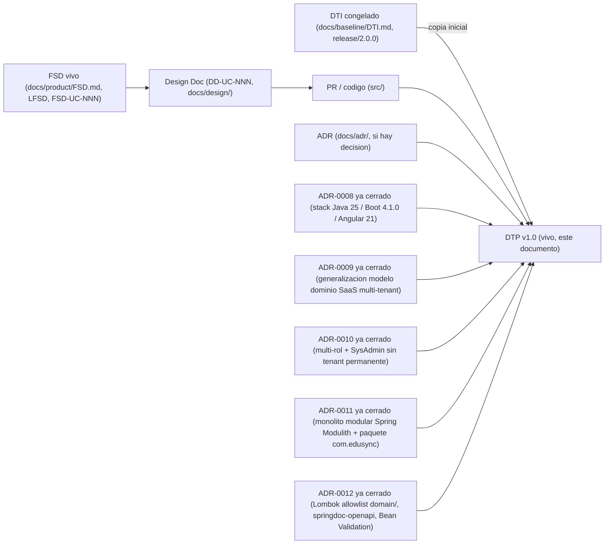

# Documento Técnico del Producto (DTP) — EduSync

> **Qué es**: el DTP es la **continuación viva del DTI**. Donde el DTI fue *"el plano"* (foto técnica congelada al cierre de M4, `release/2.0.0`, ver `docs/baseline/DTI.md`), el DTP es *"el DTI que compila"*: el **contrato técnico vigente** del producto mientras se implementa. Consolida la entrega final (documentación + software).
>
> **Regla de oro** (heredada del modelo documental de M4, ver [`plantillas/plantillas3/MODELO_DOCUMENTAL_IMPLEMENTACION.md`](../../plantillas/plantillas3/MODELO_DOCUMENTAL_IMPLEMENTACION.md)): **cero divergencia silenciosa**. Si el código necesita contradecir una decisión del DTI vFinal, primero se actualiza el ADR + este DTP + la spec viva; **nunca al revés**.
>
> **Qué NO es**: este DTP **no reescribe** el baseline congelado (`BRD/MRD/PRD/FSD clásico + DTI` en `docs/baseline/`, recuperable por el tag `release/2.0.0`). El baseline es el registro histórico evaluado de M4 y permanece intacto (ver `.cursor/rules/baseline-congelado.mdc` y `CODEOWNERS`).
>
> ⚠️ **Punto de partida (`v1.0`)**: esta primera versión del DTP es un **placeholder inicial**. `release/3.0.0` todavía no ha arrancado (`src/` está vacío en `AGENTS.md` §3): no existe ningún `DD-UC-NNN` ni `PR-IMPL-NNN` todavía. §A.1–A.4 no tienen filas reales más allá del delta de stack de `ADR-0008`, y §B marca `no` (sin cambios) en casi todas las secciones porque nada se ha implementado aún. Este documento se puebla incrementalmente con cada design doc y cada PR de implementación, vía el skill `@dtp-sync`.

## Cómo se origina

1. Se copia el **DTI vFinal / congelado** (`docs/baseline/DTI.md`, tag `release/2.0.0`) como punto de partida conceptual del DTP (`status: vivo`).
2. A partir de aquí, **todo cambio técnico** entra por el flujo de control de cambios (ver §A).
3. El baseline de M4 queda inmutable en `docs/baseline/` + tag `release/2.0.0`.

---

## A. Control de cambios (núcleo del DTP) `[humano+máquina]`

> Esta sección es lo que distingue al DTP del DTI. Todo cambio técnico durante la implementación se registra aquí.

### A.1 Changelog de implementación

| Fecha | Cambio | Disparador (FSD-UC / DD / hallazgo) | ADR | PR / commit | Autor |
|-------|--------|-------------------------------------|-----|-------------|-------|
| 28/05/2026 | Apertura de la capa viva (`docs/product/`) y creación de este DTP v1.0 como punto de partida | Cierre de M4 → transición a `release/3.0.0` (`plantillas/plantillas3/MODELO_DOCUMENTAL_IMPLEMENTACION.md`) | — | `pendiente de commit formal` | Rodrigo Aspeti |
| 28/05/2026 | Fijación del stack vivo: Java 21/Boot 3.3/Angular 17 (baseline) → Java 25 LTS/Spring Boot 4.1.0/Angular 21 LTS (vivo) | Apertura de `release/3.0.0` sobre `src/` vacío (greenfield, sin costo de migración) | `ADR-0008` | `pendiente de commit formal` | Rodrigo Aspeti |
| 12/07/2026 | Generalización del modelo de dominio a plataforma SaaS multi-tenant configurable: nuevo rol `SysAdmin` + entidad `Tenant` con suscripción; módulos configurables `GestionEscolar`/`PeriodoEvaluacion`/`SeccionEvaluacion`/`TipoEvaluacion`/`Evaluacion`/`Curso`/`Paralelo`/`Materia`/`Estudiante`/`Inscripcion`/`Usuario` añadidos como extensión aditiva sobre el Perfil Bolivia SIE (sin modificarlo) | Nuevo diseño funcional recibido para `release/3.0.0` (roles SaaS, periodos y secciones de evaluación configurables, estructura académica genérica) | `ADR-0009` | `pendiente de commit formal` | Rodrigo Aspeti |
| 14/07/2026 | Refinamiento del modelo de roles: `Usuario.rol` (valor único, `ADR-0009`) reemplazado por relación N:M `UsuarioRol` (multi-rol); invariante permanente `tenant_id IS NULL ⟺ roles = {SYSADMIN}` (no transitoria de *bootstrap*) | Clarificación de negocio recibida durante el diseño del login y del alta de tenants (multi-rol operativo + alcance del rol SysAdmin) | `ADR-0010` | `pendiente de commit formal` | Rodrigo Aspeti |
| 14/07/2026 | Primer Design Doc (`DD-UC-001`, bootstrap del proyecto) y primer prompt de implementación (`PR-IMPL-001`): monolito modular con Spring Modulith (module-first, 5 módulos: `plataforma`/`identidad`/`academico`/`notassie`/`shared`) y renombrado del paquete base `bo.edusync` → `com.edusync` | Inicio de la implementación de código para los features "alta de tenants" y "login" (`FSD-UC-011`/`FSD-UC-021`), sobre `src/` vacío | `ADR-0011` | `pendiente de commit formal` (ejecución de `PR-IMPL-001` aún no realizada) | Rodrigo Aspeti |
| 18/07/2026 | **Ejecución de `PR-IMPL-001`**: esqueleto real generado — `backend/pom.xml` (Spring Boot 4.1.0 parent, Java 25, `spring-modulith-bom` 2.1.0), `EduSyncApplication`, los 5 módulos vacíos (`plataforma`/`identidad`/`academico`/`notassie`/`shared`, cada uno con `domain`/`application`/`infrastructure` + `package-info.java`), `shared.tenant.TenantContext` (placeholder) y `shared.exception.DomainException` (excepción base), `ModularityTests` (JUnit 5 + `spring-modulith-starter-test`), `application*.yml` + `V1__init.sql` (Flyway baseline vacío); `frontend/` Angular 21 standalone (`ng new`) con `core`/`shared`/`features` vacíos; `infra/docker-compose.yml` (PostgreSQL 15) | Ejecución del prompt aprobado en `docs/design/DD-UC-001.md §5` | — (ejecución de una decisión ya formalizada en `ADR-0011`; sin delta nuevo) | `mvn test` → `ModularityTests`: 7/7 en verde (`ApplicationModules.verify()` sin ciclos ni accesos ilegales); `ng build` → bundle generado sin errores. `pendiente de commit formal` (commit real aún no creado en este turno) | Rodrigo Aspeti |
| 14/07/2026 | Segundo Design Doc (`DD-UC-002`, módulo `identidad`) y segundo prompt de implementación (`PR-IMPL-002`): dominio `Usuario`/`UsuarioRol`, login JWT, seed del primer `SYSADMIN`, implementación real de `TenantContextProvider` (cierra el placeholder de `ADR-0001`) y puerto público `UsuarioCreacionPort`. Decisión explícita del usuario: `identidad`/login se implementa antes que `plataforma`/tenants (invierte el orden insinuado en `DD-UC-001` §2), y el aislamiento RLS de tablas plataforma-scoped se resuelve con la política `OR tenant_id IS NULL` (sin `ADR-0012` dedicado) | Continuación de la implementación de código para "login" (`FSD-UC-021`, parcial); prerequisito de `FSD-UC-011` (alta de tenants, `DD-UC-003`) | — (decisiones documentadas en `DD-UC-002` §2/§3, no ameritan ADR propio) | `pendiente de commit formal` (ejecución de `PR-IMPL-002` aún no realizada) | Rodrigo Aspeti |
| 14/07/2026 | Tercer Design Doc (`DD-UC-003`, módulo `plataforma`) y tercer prompt de implementación (`PR-IMPL-003`): dominio `Tenant`, ciclo de suscripción, scheduler de vencimiento (`@Scheduled`), puerto público `TenantConsultaPort` y primer caso real de comunicación bidireccional `plataforma`↔`identidad` (enforcement de `BR-014` en `AutenticarUsuarioService`). Decisiones explícitas del usuario: tenant demo diferido a un Design Doc de seguimiento aún sin crear; scheduler `@Scheduled` interno (sin `ShedLock` por ahora); alta de tenant + admin en dos llamadas REST separadas, consistente con `FSD-UC-011` ya documentado | Continuación de la implementación de código para "alta de tenants" (`FSD-UC-011`, completo); consume `UsuarioCreacionPort` de `identidad` (`DD-UC-002`) | — (decisiones documentadas en `DD-UC-003` §2/§3, no ameritan ADR propio) | `pendiente de commit formal` (ejecución de `PR-IMPL-003` aún no realizada) | Rodrigo Aspeti |
| 18–19/07/2026 | **Ejecución de `PR-IMPL-002`** (módulo `identidad` completo): dominio `Usuario`/`UsuarioRol`/`Rol` con invariante permanente validada en `Usuario.crear()`; login `POST /api/v1/auth/login` (JWT HS256, 8 h); `TenantContextProvider`/`TenantAwareDataSource` reales (cierran el placeholder de `ADR-0001`); migración `V2__identidad_usuario.sql` (política RLS `OR tenant_id IS NULL`); seed `SysAdminSeeder`; puerto público `UsuarioCreacionPort`. Corrección técnica durante la ejecución: `spring-boot-starter-flyway` explícito (Spring Boot 4.x separó la autoconfiguración de Flyway de `spring-boot-autoconfigure`) y renombrado de artefactos Testcontainers 2.x (`testcontainers-junit-jupiter`/`testcontainers-postgresql`). **Herramientas de productividad backend** (`ADR-0012`, aplicadas sobre este mismo módulo): Lombok 1.18.46 (sin restricción en `infrastructure`/`application`; en `domain/` bajo *allowlist* — `Usuario.getId()`/`getTenantId()`/etc. reemplazan los accessors fluidos manuales, `getRoles()` se mantiene manual por transformar el tipo del campo), springdoc-openapi 3.0.3 (`/v3/api-docs`, `/swagger-ui.html`, Bearer `SecurityScheme` en `shared.web.OpenApiConfig`) y `spring-boot-starter-validation` (`@NotBlank`/`@Email` en `LoginRequest` + `shared.web.GlobalExceptionHandler` transversal). Requirió actualizar `pom.xml` con `annotationProcessorPaths` explícito para Lombok (la detección implícita vía classpath no bastó bajo Java 25/Maven 3.9). Verificación: `mvn test` → 27/27 tests en verde (incluye `ModularityTests` 7/7); smoke test manual de `/v3/api-docs` (expone `/api/v1/auth/login` + `bearerAuth`), `/swagger-ui/index.html` (200 OK) y validación 400 con formato `{codigo, mensaje}` | Ejecución de los prompts aprobados en `docs/design/DD-UC-002.md §5` (identidad) y `docs/adr/0012-*.md` (herramientas transversales) | `ADR-0012` (Lombok/springdoc-openapi/Bean Validation; `ADR-0001`/`0008`/`0010`/`0011` ya cerrados, sin cambios) | `mvn test`: 27/27 verde; smoke test manual de Swagger UI/OpenAPI en verde. `pendiente de commit formal` | Rodrigo Aspeti |
| 19/07/2026 | **Ejecución de `PR-IMPL-003`** (módulo `plataforma` completo, `FSD-UC-011` cierra su implementación): dominio `Tenant` (Aggregate Root con mutabilidad controlada de `estado`, único caso del backend donde un AR no es 100 % inmutable — justificado en su Javadoc, `BR-013`/`BR-014`) + `EstadoTenant`; casos de uso `RegistrarTenantUseCase`/`CambiarEstadoTenantUseCase`/`CrearAdminTenantUseCase` (delega a `UsuarioCreacionPort` de `identidad`)/`VencimientoSchedulerService` (con `Clock` inyectado vía `shared.time.ClockConfig`, testeable); `TenantController` con `POST /tenants`, `POST /tenants/{id}/admins`, `PATCH /tenants/{id}/estado`, los tres restringidos a `SYSADMIN` (`@PreAuthorize`, `@EnableMethodSecurity` habilitado en `SecurityConfig`); `VencimientoSchedulerJob` (`@Scheduled` diario, `@EnableScheduling` en `EduSyncApplication`); migración `V3__plataforma_tenant.sql` (tabla `tenant`, sin política RLS propia). Enforcement de `BR-014` en `identidad`: nuevo puerto público `identidad.TenantConsultaPort` + `identidad.domain.TenantNoActivoException`, consultado por `AutenticarUsuarioService` tras validar credenciales (evita fuga de información); `AuthController` mapea la excepción a HTTP 403 `E_TENANT_NO_ACTIVO`. **Refinamiento de diseño respecto a `DD-UC-003` §2** (documentado en el Javadoc del puerto, sin ADR dedicado): `TenantConsultaPort` se declaró en la raíz de `identidad` y no de `plataforma` como sugería el Design Doc, porque Spring Modulith rechaza ciclos de dependencia entre módulos (`plataforma` ya depende de `identidad` vía `UsuarioCreacionPort`); la implementación real (`TenantConsultaPortImpl`) vive en `plataforma.infrastructure.adapter.out.port` — funcionalmente idéntico (Open Host Service, consulta sincrónica), solo cambia qué módulo "hospeda" la interfaz. Corrección técnica encontrada durante la ejecución: `HttpStatus.UNPROCESSABLE_ENTITY` fue renombrado a `HttpStatus.UNPROCESSABLE_CONTENT` en Spring Framework 7.x (Spring Boot 4.1) — actualizado en `TenantController` y `TenantIntegrationTest`. Verificación: `mvn test` (clean) → 45/45 tests en verde (incluye `ModularityTests` 7/7 confirmando cero ciclos con la nueva comunicación bidireccional `plataforma`↔`identidad`); `TenantIntegrationTest` (Testcontainers) cubre de punta a punta alta tenant+admin en dos llamadas, bloqueo de login por `BR-014`, RBAC `SYSADMIN` y `E_SUSCRIPCION_INCOMPLETA` (422) | Ejecución del prompt aprobado en `docs/design/DD-UC-003.md §5` / `docs/prompts/impl/PR-IMPL-003.md` | — (refinamiento de diseño de bajo riesgo documentado inline, no amerita ADR propio, mismo criterio que `DD-UC-002`/`DD-UC-003` §2-§3 previos) | `mvn test` (clean): 45/45 verde. `pendiente de commit formal` | Rodrigo Aspeti |
| 19/07/2026 | Cuarto Design Doc (`DD-UC-004`) y cuarto prompt (`PR-IMPL-004`): primer *vertical slice* de UI Angular (login + consola SysAdmin) y delta backend `GET /api/v1/plataforma/tenants`. Decisiones explícitas del usuario: un solo DD de UI; JWT en `sessionStorage`; incluir lista de tenants. Reasigna el ID `DD-UC-004` (antes citado informalmente en `DD-UC-002` para CRUD usuarios) a esta UI; CRUD usuarios queda como `DD-UC-005` | Continuación de implementación hacia demo E2E login→tenants (`FSD-UC-021` UI parcial + `FSD-UC-011` UI) | — (sin ADR nuevo) | `pendiente de commit formal` (ejecución de `PR-IMPL-004` aún no realizada) | Rodrigo Aspeti |

### A.2 Deltas respecto al DTI vFinal

> Diferencias **deliberadas** entre lo diseñado en M4 y lo construido. Cada delta significativo exige un ADR.

| # | Sección del DTI afectada | Qué decía el DTI vFinal | Qué dice ahora el DTP | Motivo | ADR |
|---|--------------------------|-------------------------|-----------------------|--------|-----|
| 1 | `§4 Stack tecnológico` (`docs/baseline/DTI.md`, también reflejado en `AGENTS.md` §4) | Java 21 (LTS) / Spring Boot 3.3 / Angular 17 | Java 25 (LTS) / Spring Boot 4.1.0 (Spring Framework 7.0.8) / Angular 21 (LTS) | `src/` está vacío al cerrar M4 (greenfield): se adopta el stack más reciente estable disponible sin costo de migración, priorizando AOT Cache de Boot 4 sobre Java 25 y la ventana LTS de Angular 21 | `ADR-0008` |
| 2 | `§4 Modelo de dominio` (`docs/baseline/DTI.md`) | Modelo de dominio específico de Bolivia: tenant = colegio individual (sin capa SaaS), 3 roles (`DIRECTOR`/`SECRETARÍA`/`DOCENTE`), 3 periodos trimestrales fijos, dimensiones pedagógicas fijas (Ser/Saber/Hacer/Decidir/Autoevaluación), truncado `floor()` único, identidad exclusiva por RUDE | Se añade, como extensión aditiva (sin reemplazar lo anterior): capa de plataforma SaaS (`SysAdmin`, `Tenant` con suscripción), roles ampliados (`ADMIN`=`DIRECTOR`, `PROFESOR`=`DOCENTE`, + `SECRETARIA`, `ASESOR` nuevo), `GestionEscolar` con N periodos configurables, `SeccionEvaluacion`/`TipoEvaluacion` configurables, `Curso`/`Paralelo`/`Materia`/`Estudiante`/`Inscripcion`/`Usuario` genéricos | Nuevo diseño funcional recibido para `release/3.0.0`: EduSync se generaliza a plataforma SaaS multi-tenant configurable, sin perder el Perfil Bolivia SIE (que sigue soportado sin cambios) | `ADR-0009` |
| 3 | `BR-024` (`docs/product/BRD.md`, introducida por `ADR-0009`) | `Usuario.rol`: atributo ENUM de valor único ("exactamente un rol vigente") | `UsuarioRol`: relación N:M ("uno o más roles simultáneos"), con invariante permanente `Usuario.tenant_id IS NULL ⟺ roles = {SYSADMIN}` | Clarificación de negocio: una misma persona puede cubrir más de una función en su institución (multi-rol); el alcance de `tenant_id` nulo para `SYSADMIN` se confirma permanente, no transitorio de *bootstrap* | `ADR-0010` |
| 4 | `§5 Arquitectura hexagonal del core` (`docs/arquitectura_hexagonal_EduSync.md`) | Paquete base `bo.edusync`, organización paquete-por-capa (`domain`/`application`/`infrastructure` en la raíz) | Paquete base `com.edusync`, organización monolito modular *module-first* con Spring Modulith (5 módulos: `plataforma`/`identidad`/`academico`/`notassie`/`shared`), cada uno con su propia sub-estructura hexagonal | Inicio de la implementación de código (`DD-UC-001`, bootstrap): la generalización de `ADR-0009` hace inconsistente mantener un paquete con prefijo de país en el código de plataforma SaaS; Spring Modulith permite verificar límites de módulo en cada build | `ADR-0011` |
| 5 | `AGENTS.md §5` (regla de dominio: `domain/` sin imports de terceros) | Regla leída de forma literal como prohibición total de imports en `domain/` | Distinción explícita entre frameworks con comportamiento/ciclo de vida en runtime (Spring, JPA, AWS — prohibidos) y procesadores de anotaciones sin huella en runtime (Lombok, permitido en `domain/` bajo *allowlist* estrecho: `@Getter`/`@EqualsAndHashCode`/`@ToString` con nomenclatura JavaBean estándar; nunca `@Data`/`@Setter`/`@Builder` público) | Reducir el boilerplate de accessors en Aggregate Roots (`Usuario`, y los que vendrán en `plataforma`/`academico`) sin habilitar mutación no controlada; se añaden también springdoc-openapi (documentación viva de la API) y Bean Validation (validación declarativa de DTOs de entrada), sin restricción fuera de `domain/` | `ADR-0012` |

> **Pendiente de definición (`ADR-0009` §3, ver también `docs/product/FSD.md` §4.6/§5.1/§6.3):** (1) reconciliación entre `GestionAcademica`/`ParametroAcademico` (Perfil Bolivia) y `GestionEscolar`/`PeriodoEvaluacion`/`SeccionEvaluacion` (genérico); (2) generalización de secuencialidad de apertura y de promedio final a N periodos; (3) criterio de redondeo del cálculo de notas genérico; (4) validación de suma de pesos porcentuales de secciones; (5) gobernanza (auditoría/inmutabilidad) de los módulos nuevos. Ninguno debe implementarse en código sin un Design Doc o ADR de seguimiento que lo resuelva.
>
> **Pendiente de definición (`ADR-0010` §3, no bloqueante):** (1) el diseño detallado del tenant "demo" (primer tenant del sistema, funcionalidad de producto real para ventas) — no afecta el modelo de `Usuario`/`Rol`/`tenant_id`, se resuelve en el Design Doc de `FSD-UC-011`; (2) posible combinación futura `SYSADMIN` + rol de tenant (requeriría separar identidad de membresía en `usuario_tenant_rol`) — sin necesidad de negocio confirmada, no se construye ahora.

### A.3 Estado de implementación por FSD-UC

| FSD-UC | Design Doc | Estado | Release | Tests/Evals | Notas |
|--------|------------|--------|---------|-------------|-------|
| `FSD-UC-001` (Registro de calificaciones) | — | pendiente | `release/3.0.0` | — | Sin `DD-UC-NNN` creado todavía; usar `@feature-design-doc` para iniciar |
| `FSD-UC-003` (Consolidación de centralizadores) | — | pendiente | `release/3.0.0` | — | Ídem |
| `FSD-UC-004` (Exportación SIE) | — | pendiente | `release/3.0.0` | — | Ídem |
| `FSD-UC-005` (Modificación retroactiva) | — | pendiente | `release/3.0.0` | — | Ídem |
| `FSD-UC-009` (Administración de periodos) | — | pendiente | `release/3.0.0` | — | Ídem |
| `FSD-UC-011` (Gestión de Tenants y Suscripciones) | `DD-UC-003` + `DD-UC-004` (UI) | **completo** (API); UI en progreso | `release/3.0.0` | 45/45 tests verde (API); UI pendiente de `PR-IMPL-004` | **`PR-IMPL-003` ejecutado** (19/07/2026): módulo `plataforma` real. **`DD-UC-004`/`PR-IMPL-004` creados** (19/07/2026): UI consola SysAdmin + `GET /tenants` — ejecución pendiente. Diseño del tenant "demo" sigue diferido |
| `FSD-UC-012`..`FSD-UC-020` (Gestión Escolar, Periodos/Secciones/Evaluaciones configurables, Cálculo de Notas, Cursos/Paralelos, Materias, Profesores, Estudiantes/Inscripciones) | — | pendiente | `release/3.0.0` | — | Sin `DD-UC-NNN` todavía. 5 puntos pendientes de definición antes de iniciar diseño (ver `ADR-0009` §3) |
| `FSD-UC-021` (Usuarios y Roles / login) | `DD-UC-002` + `DD-UC-004` (UI login) | en progreso | `release/3.0.0` | 27/27 tests verde (API login); UI pendiente de `PR-IMPL-004` | **`PR-IMPL-002` ejecutado**. Login UI en `DD-UC-004` (aprobado, ejecución pendiente). CRUD administrativo completo queda en `DD-UC-005` |

### A.4 Trazabilidad código ↔ DTP

> Cadena completa por feature. Debe poder reconstruirse para cualquier línea del producto.

`BRD/MRD (baseline)` → `PRD/FSD vivo (FSD-UC-NNN)` → `Design Doc (DD-UC-NNN)` → `Prompt (PR-IMPL-NNN)` → `PR/commit` → `Tests/Evals` → `ADR (si aplica)` → **DTP**.

Estado actual: la cadena existe completa hasta `Design Doc` para `FSD-UC-011`/`FSD-UC-021` → `docs/product/FSD.md` → `docs/design/{DD-UC-001,DD-UC-002,DD-UC-003}.md` → `docs/prompts/impl/{PR-IMPL-001,PR-IMPL-002,PR-IMPL-003}.md` (registrados en `docs/PROMPT_MAPPING.md` v2.6) → `ADR-0011`/`ADR-0010`/`ADR-0009`/`ADR-0001`. **`PR-IMPL-001`, `PR-IMPL-002` y `PR-IMPL-003` ya se ejecutaron**: `backend/`, `frontend/` e `infra/docker-compose.yml` existen con el esqueleto de bootstrap (18/07/2026); el módulo `identidad` tiene lógica de dominio real y funcional — login JWT, `Usuario`/`UsuarioRol`, `TenantContextProvider` real (18–19/07/2026), con `ADR-0012` (Lombok/springdoc-openapi/Bean Validation) aplicado sobre el mismo código; el módulo `plataforma` tiene lógica de dominio real y funcional — `Tenant` con ciclo de suscripción, scheduler de vencimiento, `TenantConsultaPort` que cierra `BR-014` en `identidad` (19/07/2026). `Tests/Evals` = 45/45 tests verdes (incluye `ModularityTests` 7/7 confirmando cero ciclos de módulo), `ng build` sin errores; `src/` ya **no** está vacío. Solo el eslabón `PR/commit` (commit real en Git) sigue **pendiente**. El resto de `FSD-UC-NNN` permanece sin `DD-UC-NNN` propio.

---

## B. Contenido técnico vigente `[humano+máquina]`

> El DTP mantiene **al día** las mismas secciones que el DTI (no se duplica la plantilla: se reusa la estructura de [`DOCUMENTO_TECNICO_INICIAL_TEMPLATE.md`](../../plantillas/DOCUMENTO_TECNICO_INICIAL_TEMPLATE.md)). Para cada sección, si **no cambió** respecto al DTI vFinal, basta referenciarla; si **cambió**, se reescribe aquí y se registra el delta en §A.2.

| Sección (espejo del DTI) | ¿Cambió vs DTI vFinal? | Dónde está la versión vigente |
|--------------------------|------------------------|-------------------------------|
| §1 Visión del producto | no | `docs/baseline/DTI.md` §1 |
| §2 Contexto del sistema (C4 N1) | no | `docs/baseline/DTI.md` §2 / `docs/diagrams/c4_level1.mmd` |
| §3 Arquitectura de alto nivel (C4 N2/N3) | no | `docs/baseline/DTI.md` §3 / `docs/diagrams/c4_level2.mmd`, `c4_level3_*.mmd` |
| §3.5 Contenedores agénticos | no | `docs/baseline/DTI.md` §3.5 |
| §4 Modelo de dominio | **sí** (extensión aditiva) | Este DTP §A.2 (filas 2 y 3) + `ADR-0009`/`ADR-0010` — capa SaaS, módulos configurables y modelo multi-rol (`UsuarioRol`) añadidos sobre `docs/baseline/DTI.md` §4, que sigue vigente para el Perfil Bolivia SIE |
| §4 Stack tecnológico | **sí** | Este DTP §A.2 (fila 1) + `ADR-0008` — Java 25 LTS / Spring Boot 4.1.0 / Angular 21 LTS |
| §5 Arquitectura hexagonal del core | **sí** | Este DTP §A.2 (fila 4) + `ADR-0011` — `docs/arquitectura_hexagonal_EduSync.md` en actualización: paquete `com.edusync` (reemplaza `bo.edusync`) + organización monolito modular *module-first* (Spring Modulith, 5 módulos) |
| §6 Distribuida (si aplica) | no | `docs/baseline/DTI.md` §6 (Seams, sin activar — `ADR-0007` Strangler Fig sigue *gated*) |
| §7 Asíncrona / event-driven | no | `docs/baseline/DTI.md` §7 (Spring Events; migración a SQS FIFO prevista en `ADR-0004`, no ejecutada aún) |
| §8 Despliegue cloud | no | `docs/baseline/DTI.md` §8 / `docs/diagrams/deployment_aws.mmd` (imagen Docker deberá basarse en OpenJDK 25 al implementarse, ver `ADR-0008` §5) |
| §9 Capa de IA / agentes | no | `docs/baseline/DTI.md` §9 |
| §10 Prompt mapping | sí (crece con `PR-IMPL-*`) | `docs/PROMPT_MAPPING.md` v2.7 (área `IMPL`, filas `PR-IMPL-001`..`004`; 001–003 ejecutados, 004 aprobado pendiente de ejecución) |
| §11 NFRs | no | `docs/baseline/DTI.md` §11 |
| §12 POCs | no | `docs/baseline/DTI.md` §12 / `docs/pocs/POC-01-rls-multitenancy/`, `docs/pocs/POC-02-circuit-breaker-sie/` (ejecución con evidencia real sigue pendiente) |
| §13–§16 Seguridad / Observabilidad / DevOps / Antipatrones | no | `docs/baseline/DTI.md` §13–§16 |
| §21 ADRs | sí (crece) | `docs/adr/` — 11 ADRs vigentes (`0001`–`0006`, `0008`, `0009`, `0010`, `0011`, `0012`) |
| §22–§23 Auditoría IA / Evals | no todavía | `docs/baseline/DTI.md` §22–§23 |

> **Solo escribir aquí las secciones que cambiaron.** Las que no cambiaron se mantienen por referencia al DTI vFinal, preservando un único punto de verdad por release.

---

## Checklist del DTP (entrega de implementación)

- [x] Frontmatter con `baseline_ref` (`docs/baseline/DTI.md` + tag `release/2.0.0`) y `status: vivo`.
- [x] §A.1 Changelog de implementación poblado y al día (10 filas: apertura de capa viva + delta de stack + generalización del dominio + multi-rol + bootstrap `DD-UC-001`/`PR-IMPL-001` + módulo `identidad` `DD-UC-002`/`PR-IMPL-002` + módulo `plataforma` `DD-UC-003`/`PR-IMPL-003` + ejecución real de `PR-IMPL-001` + ejecución real de `PR-IMPL-002` con `ADR-0012` aplicado + **ejecución real de `PR-IMPL-003`**).
- [x] §A.2 Deltas vs DTI vFinal, **cada uno con ADR** (5 deltas → `ADR-0008` stack, `ADR-0009` generalización del modelo de dominio, `ADR-0010` multi-rol + `SysAdmin` sin tenant permanente, `ADR-0011` monolito modular + paquete `com.edusync`, `ADR-0012` Lombok con *allowlist* en `domain/`/springdoc-openapi/Bean Validation). `DD-UC-002` y `DD-UC-003` no añaden delta nuevo propio (sus decisiones de §2/§3 son de bajo riesgo, documentadas en el propio Design Doc, sin ADR dedicado).
- [x] §A.3 Estado por FSD-UC con su Design Doc (`FSD-UC-011` **completo** con `DD-UC-003`, 45/45 tests verdes; `FSD-UC-021` en `en progreso` con `DD-UC-002`, con lógica de dominio real y 27/27 tests verdes; el resto sigue `pendiente`, sin `DD-UC-NNN` aún).
- [x] §A.4 Trazabilidad código ↔ DTP reconstruible para cada feature — cadena completa hasta `Design Doc`/`Prompt`/`ADR`; `PR-IMPL-001`, `PR-IMPL-002` y `PR-IMPL-003` ya ejecutados y verificados (`ModularityTests` verde, `ng build` verde, 45/45 tests). Solo falta el eslabón `PR/commit` (commit real en Git).
- [x] §B: solo secciones cambiadas reescritas (stack + modelo de dominio + arquitectura hexagonal + prompt mapping + ADRs); el resto referencia al DTI vFinal.
- [x] `docs/PROMPT_MAPPING.md` ampliado con prompts de implementación (`PR-IMPL-*`) — filas `PR-IMPL-001`/`PR-IMPL-002`/`PR-IMPL-003` (v2.6), los tres **ejecutados**, materializados en `docs/prompts/impl/`.
- [x] `AGENTS.md` sincronizado (§4 tabla de stack + §5 regla de dominio, `ADR-0012`).
- [x] Baseline congelado (`docs/baseline/`) **intacto** (sin commits que lo modifiquen; protegido por `CODEOWNERS` y `.cursor/rules/baseline-congelado.mdc`).

## Registro de cambios

| Versión | Fecha | Autor | Cambio |
|---------|-------|-------|--------|
| v1.0 | 28/05/2026 | Rodrigo Aspeti | Creación del DTP como punto de partida de la capa viva (`release/3.0.0`), a partir de `plantillas/plantillas3/DTP_TEMPLATE.md`; registra el delta de stack `ADR-0008` (Java 25 LTS + Spring Boot 4.1.0 + Angular 21 LTS); §A.3 lista los 5 FSD-UC del baseline como `pendiente`; sin `DD-UC-NNN` ni `PR-IMPL-NNN` todavía. |
| v1.1 | 12/07/2026 | Rodrigo Aspeti | Registra el delta de generalización del modelo de dominio `ADR-0009` (§A.2 fila 2): plataforma SaaS multi-tenant configurable añadida como extensión aditiva sobre el Perfil Bolivia SIE, alineada con `docs/product/BRD.md` v3.0, `PRD.md` v2.0 y `FSD.md` v2.0. §A.3 añade `FSD-UC-011`..`FSD-UC-021` como `pendiente`. §B actualiza §4 Modelo de dominio (extensión aditiva) y el conteo de ADRs vigentes (9). Deja registrados 5 puntos pendientes de definición (ver `ADR-0009` §3) que deben resolverse antes de implementar código sobre los módulos nuevos. |
| v1.2 | 14/07/2026 | Rodrigo Aspeti | Registra el delta de refinamiento del modelo de roles `ADR-0010` (§A.2 fila 3): `BR-024`/`FSD-UC-021` pasan de "un rol por usuario" a multi-rol (`UsuarioRol` N:M), con la invariante permanente `tenant_id IS NULL ⟺ roles = {SYSADMIN}`, alineado con `docs/product/BRD.md` v3.1, `PRD.md` v2.2 y `FSD.md` v2.2. §A.3 anota `FSD-UC-011`/`FSD-UC-021` como refinados por `ADR-0010`. §B actualiza el conteo de ADRs vigentes (8 → 9, incluye `0010`). Deja registrado como pendiente no bloqueante el diseño del tenant demo (ver `ADR-0010` §3), sin afectar el modelo de `Usuario`/`Rol` decidido. |
| v1.3 | 14/07/2026 | Rodrigo Aspeti | Registra el primer Design Doc de código (`DD-UC-001`, bootstrap del proyecto) y el delta de organización interna del backend `ADR-0011` (§A.2 fila 4): monolito modular con Spring Modulith (module-first, módulos `plataforma`/`identidad`/`academico`/`notassie`/`shared`) y renombrado del paquete base `bo.edusync` → `com.edusync`. §A.3 pasa `FSD-UC-011`/`FSD-UC-021` de `pendiente` a `en progreso` con `DD-UC-001` como Design Doc asociado; el resto de `FSD-UC-012`..`FSD-UC-020` se consolida en una sola fila (siguen `pendiente`). §A.4 registra el primer eslabón real de trazabilidad (FSD → Design Doc → Prompt → ADR), con el eslabón `PR/commit` aún pendiente (`PR-IMPL-001` no ejecutado todavía). §B actualiza el conteo de ADRs vigentes (9 → 10, incluye `0011`) y marca §5 Arquitectura hexagonal del core como cambiado. Primera fila del área `IMPL` en `docs/PROMPT_MAPPING.md` (v2.0 → v2.1): `PR-IMPL-001`. |
| v1.4 | 14/07/2026 | Rodrigo Aspeti | Corrección de ruta: `PR-IMPL-001` se mueve de `prompts/PR-IMPL-001.md` a `docs/prompts/impl/PR-IMPL-001.md`, siguiendo `FEATURE_DESIGN_DOC_TEMPLATE.md`/`MODELO_DOCUMENTAL_IMPLEMENTACION.md` (única área de prompts que se desvía de la convención plana de M4). §A.4 y §B actualizan la referencia de ruta; `docs/PROMPT_MAPPING.md` v2.1 → v2.2. Sin cambios en el contenido del prompt ni en el estado de `FSD-UC-011`/`FSD-UC-021`. |
| v1.5 | 14/07/2026 | Rodrigo Aspeti | Registra el segundo Design Doc de código (`DD-UC-002`, módulo `identidad`) y el segundo prompt de implementación (`PR-IMPL-002`): dominio `Usuario`/`UsuarioRol`, login JWT, seed del primer `SYSADMIN`, `TenantContextProvider` real (cierra el placeholder de `ADR-0001`) y puerto público `UsuarioCreacionPort`. §A.1 nueva fila. §A.3 pasa `FSD-UC-021` de Design Doc `DD-UC-001` a `DD-UC-002` (más preciso: el login vive en `identidad`, no en el bootstrap); anota que `FSD-UC-011` consumirá `UsuarioCreacionPort` en `DD-UC-003`. §A.4 amplía la cadena con `DD-UC-002`/`PR-IMPL-002`. §B actualiza §10 Prompt mapping a `docs/PROMPT_MAPPING.md` v2.3. Decisiones explícitas del usuario documentadas: orden `identidad` antes de `plataforma` (invierte el comentario original de `DD-UC-001` §2) y estrategia RLS `OR tenant_id IS NULL` para tablas plataforma-scoped, ambas sin ADR dedicado (no ameritan el nivel de riesgo/impacto estructural de `ADR-0011`). Sin cambios en el conteo de ADRs vigentes (10). |
| v1.6 | 14/07/2026 | Rodrigo Aspeti | Registra el tercer Design Doc de código (`DD-UC-003`, módulo `plataforma`) y el tercer prompt de implementación (`PR-IMPL-003`): dominio `Tenant`, ciclo de suscripción, scheduler de vencimiento `@Scheduled`, puerto público `TenantConsultaPort` y primer caso real de comunicación bidireccional `plataforma`↔`identidad` (enforcement de `BR-014`). §A.1 nueva fila. §A.3 pasa `FSD-UC-011` de Design Doc `DD-UC-001` (solo bootstrap) a `DD-UC-003` (implementación real y completa del caso de uso). §A.4 amplía la cadena con `DD-UC-003`/`PR-IMPL-003`. §B actualiza §10 Prompt mapping a `docs/PROMPT_MAPPING.md` v2.4. Decisiones explícitas del usuario documentadas: tenant demo diferido a un Design Doc de seguimiento aún sin crear; scheduler `@Scheduled` interno (sin `ShedLock`); alta de tenant + admin en dos llamadas REST separadas, sin ADR dedicado (no ameritan el nivel de riesgo/impacto estructural de `ADR-0011`). Se corrige también la referencia ambigua `"DD-UC-011"` en `docs/product/FSD.md` §4.6.1 (v2.2 → v2.3). Sin cambios en el conteo de ADRs vigentes (10). |
| v1.7 | 18/07/2026 | Rodrigo Aspeti | **Primera ejecución real de código**: `PR-IMPL-001` ejecutado sobre `docs/design/DD-UC-001.md`. Genera `backend/` (Maven, Spring Boot 4.1.0 parent, Java 25, `spring-modulith-bom` 2.1.0: `spring-boot-starter-web/data-jpa/security`, `postgresql`, `flyway-core`+`flyway-database-postgresql`), `EduSyncApplication`, los 5 módulos vacíos con `package-info.java` (`plataforma`/`identidad`/`academico`/`notassie` con `domain`/`application`/`infrastructure`; `shared` marcado `@ApplicationModule(type = OPEN)` con `tenant.TenantContext` placeholder y `exception.DomainException` base), `ModularityTests` (JUnit 5 + `spring-modulith-starter-test`), `application{,-dev,-test}.yml` + `V1__init.sql` (Flyway baseline vacío); `frontend/` (Angular 21.2.19 standalone via `ng new`, reestructurado con `core/`/`shared/`/`features/` documentados por `README.md`); `infra/docker-compose.yml` (PostgreSQL 15); `.gitignore` raíz. Verificación (todas en verde): `mvn test` → `ModularityTests` 7/7 (sin ciclos ni accesos ilegales entre módulos); `ng build` → bundle generado sin errores. §A.1 nueva fila. §A.3 añade el resultado de `ModularityTests` a `FSD-UC-011`/`FSD-UC-021` y aclara que la lógica de dominio real (`PR-IMPL-002`/`PR-IMPL-003`) sigue pendiente. §A.4 marca el eslabón `Tests/Evals` como cumplido para el bootstrap; `PR/commit` (commit real en Git) sigue pendiente. Sin ADR nuevo ni cambios en `docs/baseline/`. |
| v1.8 | 19/07/2026 | Rodrigo Aspeti | **Ejecución real de `PR-IMPL-002` + `ADR-0012`**: el módulo `identidad` (dominio `Usuario`/`UsuarioRol`, login JWT, `TenantContextProvider` real, seed `SYSADMIN`, `UsuarioCreacionPort`) queda con código real y funcional, no solo el paquete vacío de `PR-IMPL-001`. Sobre ese mismo código se aplica `docs/adr/0012-*.md` (Aceptada): Lombok 1.18.46 (sin restricción en `infrastructure`/`application`; en `domain/` bajo *allowlist* — `Usuario` pasa de accessors fluidos manuales a `@Getter` JavaBean estándar, `getRoles()` manual), springdoc-openapi 3.0.3 (`shared.web.OpenApiConfig`, Bearer `SecurityScheme`) y `spring-boot-starter-validation` (`LoginRequest` + `shared.web.GlobalExceptionHandler` transversal). Corrección técnica encontrada durante la ejecución de `PR-IMPL-002`: `spring-boot-starter-flyway` explícito y renombrado de artefactos Testcontainers 2.x. Corrección técnica encontrada al aplicar `ADR-0012`: `annotationProcessorPaths` explícito en `pom.xml` (la detección implícita de Lombok vía classpath no bastó bajo Java 25/Maven 3.9.16). §A.1 nueva fila. §A.2 nueva fila (delta 5, `ADR-0012`, transversal — no ligado a un único `FSD-UC`). §A.3 `FSD-UC-021` pasa de "ejecución de código de dominio pendiente" a 27/27 tests verdes (incluye `ModularityTests` 7/7) + smoke test manual de Swagger UI/OpenAPI. §A.4 actualiza la narrativa: `PR-IMPL-001` y `PR-IMPL-002` ya ejecutados, solo `PR-IMPL-003` y el commit real en Git quedan pendientes. §B actualiza el conteo de ADRs vigentes (10 → 11, incluye `0012`). `docs/design/DD-UC-002.md` v1.0 → v1.1 (DoD sincronizado). `AGENTS.md` v0.20 → v0.21 (§4 tabla de stack + §5 regla de dominio). |
| v1.9 | 19/07/2026 | Rodrigo Aspeti | **Ejecución real de `PR-IMPL-003`**: el módulo `plataforma` (dominio `Tenant` con ciclo de suscripción, casos de uso de alta/cambio de estado/alta de admin/scheduler de vencimiento, `TenantController` con RBAC `SYSADMIN`) queda con código real y funcional; `FSD-UC-011` cierra su implementación completa. Enforcement de `BR-014` en `identidad` vía el nuevo puerto público `identidad.TenantConsultaPort` (implementado en `plataforma.infrastructure`) y `identidad.domain.TenantNoActivoException`. **Refinamiento de diseño respecto a `DD-UC-003` §2** (documentado inline en el Javadoc del puerto, sin ADR dedicado, mismo criterio que los refinamientos de `DD-UC-002`): el puerto se declaró en la raíz de `identidad` y no de `plataforma`, para evitar un ciclo de módulos que `ApplicationModules.verify()` de Spring Modulith rechaza. Corrección técnica encontrada durante la ejecución: `HttpStatus.UNPROCESSABLE_ENTITY` renombrado a `HttpStatus.UNPROCESSABLE_CONTENT` en Spring Framework 7.x. §A.1 nueva fila. §A.2 sin cambios (sin ADR nuevo). §A.3 `FSD-UC-011` pasa de "en progreso, solo bootstrap" a **completo**, con 45/45 tests verdes. §A.4 actualiza la narrativa: `PR-IMPL-001`, `PR-IMPL-002` y `PR-IMPL-003` ya ejecutados; solo el commit real en Git queda pendiente. §B actualiza §10 Prompt mapping a `docs/PROMPT_MAPPING.md` v2.6. Sin cambios en el conteo de ADRs vigentes (11). `docs/design/DD-UC-003.md` v1.0 → v1.1 (DoD sincronizado). `docs/PROMPT_MAPPING.md` v2.5 → v2.6. `AGENTS.md` v0.21 → v0.22 (estado de módulo `plataforma` + `FSD-UC-011` completo). |
| v1.10 | 19/07/2026 | Rodrigo Aspeti | Cuarto Design Doc `DD-UC-004` + `PR-IMPL-004`: UI Angular (login + consola SysAdmin) y delta backend `GET /tenants`. Decisiones del usuario: un DD; `sessionStorage`; incluir lista. §A.1 nueva fila. §A.3 anota UI en progreso para `FSD-UC-011`/`FSD-UC-021`. §B → `PROMPT_MAPPING` v2.7 (41 contratos). `docs/product/FSD.md` v2.3→v2.4 (paso GET en flujo). CRUD usuarios reasignado a futuro `DD-UC-005`. Ejecución de `PR-IMPL-004` pendiente. |
