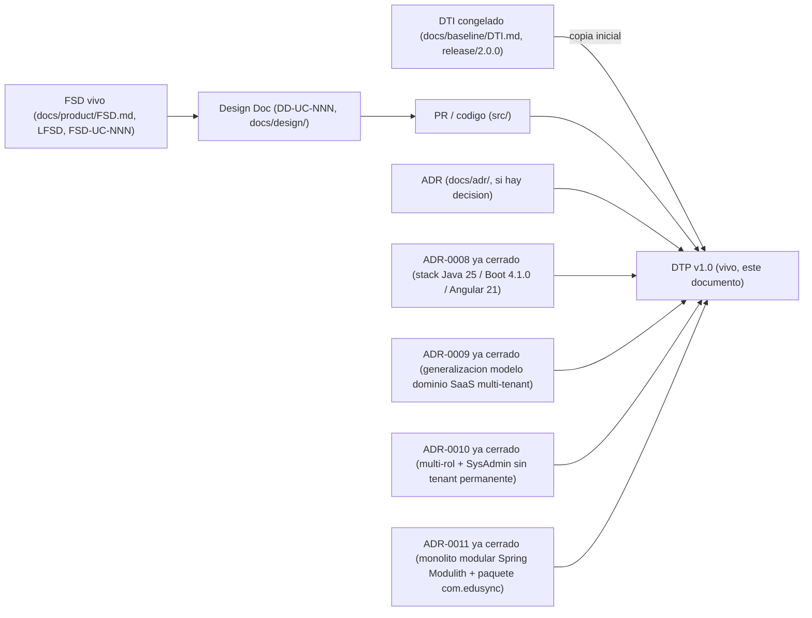

# Documento Técnico del Producto (DTP) — EduSync

> **Qué es**: el DTP es la **continuación viva del DTI**. Donde el DTI fue *"el plano"* (foto técnica congelada al cierre de M4, `release/2.0.0`, ver `docs/baseline/DTI.md`), el DTP es *"el DTI que compila"*: el **contrato técnico vigente** del producto mientras se implementa. Consolida la entrega final (documentación + software).
>
> **Regla de oro** (heredada del modelo documental de M4, ver [`plantillas/plantillas3/MODELO_DOCUMENTAL_IMPLEMENTACION.md`](../../plantillas/plantillas3/MODELO_DOCUMENTAL_IMPLEMENTACION.md)): **cero divergencia silenciosa**. Si el código necesita contradecir una decisión del DTI vFinal, primero se actualiza el ADR + este DTP + la spec viva; **nunca al revés**.
>
> **Qué NO es**: este DTP **no reescribe** el baseline congelado (`BRD/MRD/PRD/FSD clásico + DTI` en `docs/baseline/`, recuperable por el tag `release/2.0.0`). El baseline es el registro histórico evaluado de M4 y permanece intacto (ver `.cursor/rules/baseline-congelado.mdc` y `CODEOWNERS`).
>
> ⚠️ **Punto de partida (`v1.0`)**: esta primera versión del DTP es un **placeholder inicial**. `release/3.0.0` todavía no ha arrancado (`src/` está vacío en `AGENTS.md` §3): no existe ningún `DD-UC-NNN` ni `PR-IMPL-NNN` todavía. §A.1–A.4 no tienen filas reales más allá del delta de stack de `ADR-0008`, y §B marca `no` (sin cambios) en casi todas las secciones porque nada se ha implementado aún. Este documento se puebla incrementalmente con cada design doc y cada PR de implementación, vía el skill `@dtp-sync`.

## Cómo se origina

1. Se copia el **DTI vFinal / congelado** (`docs/baseline/DTI.md`, tag `release/2.0.0`) como punto de partida conceptual del DTP (`status: vivo`).
2. A partir de aquí, **todo cambio técnico** entra por el flujo de control de cambios (ver §A).
3. El baseline de M4 queda inmutable en `docs/baseline/` + tag `release/2.0.0`.

---

## A. Control de cambios (núcleo del DTP) `[humano+máquina]`

> Esta sección es lo que distingue al DTP del DTI. Todo cambio técnico durante la implementación se registra aquí.

### A.1 Changelog de implementación

| Fecha | Cambio | Disparador (FSD-UC / DD / hallazgo) | ADR | PR / commit | Autor |
|-------|--------|-------------------------------------|-----|-------------|-------|
| 28/05/2026 | Apertura de la capa viva (`docs/product/`) y creación de este DTP v1.0 como punto de partida | Cierre de M4 → transición a `release/3.0.0` (`plantillas/plantillas3/MODELO_DOCUMENTAL_IMPLEMENTACION.md`) | — | `pendiente de commit formal` | Rodrigo Aspeti |
| 28/05/2026 | Fijación del stack vivo: Java 21/Boot 3.3/Angular 17 (baseline) → Java 25 LTS/Spring Boot 4.1.0/Angular 21 LTS (vivo) | Apertura de `release/3.0.0` sobre `src/` vacío (greenfield, sin costo de migración) | `ADR-0008` | `pendiente de commit formal` | Rodrigo Aspeti |
| 12/07/2026 | Generalización del modelo de dominio a plataforma SaaS multi-tenant configurable: nuevo rol `SysAdmin` + entidad `Tenant` con suscripción; módulos configurables `GestionEscolar`/`PeriodoEvaluacion`/`SeccionEvaluacion`/`TipoEvaluacion`/`Evaluacion`/`Curso`/`Paralelo`/`Materia`/`Estudiante`/`Inscripcion`/`Usuario` añadidos como extensión aditiva sobre el Perfil Bolivia SIE (sin modificarlo) | Nuevo diseño funcional recibido para `release/3.0.0` (roles SaaS, periodos y secciones de evaluación configurables, estructura académica genérica) | `ADR-0009` | `pendiente de commit formal` | Rodrigo Aspeti |
| 14/07/2026 | Refinamiento del modelo de roles: `Usuario.rol` (valor único, `ADR-0009`) reemplazado por relación N:M `UsuarioRol` (multi-rol); invariante permanente `tenant_id IS NULL ⟺ roles = {SYSADMIN}` (no transitoria de *bootstrap*) | Clarificación de negocio recibida durante el diseño del login y del alta de tenants (multi-rol operativo + alcance del rol SysAdmin) | `ADR-0010` | `pendiente de commit formal` | Rodrigo Aspeti |
| 14/07/2026 | Primer Design Doc (`DD-UC-001`, bootstrap del proyecto) y primer prompt de implementación (`PR-IMPL-001`): monolito modular con Spring Modulith (module-first, 5 módulos: `plataforma`/`identidad`/`academico`/`notassie`/`shared`) y renombrado del paquete base `bo.edusync` → `com.edusync` | Inicio de la implementación de código para los features "alta de tenants" y "login" (`FSD-UC-011`/`FSD-UC-021`), sobre `src/` vacío | `ADR-0011` | `pendiente de commit formal` (ejecución de `PR-IMPL-001` aún no realizada) | Rodrigo Aspeti |
| 14/07/2026 | Segundo Design Doc (`DD-UC-002`, módulo `identidad`) y segundo prompt de implementación (`PR-IMPL-002`): dominio `Usuario`/`UsuarioRol`, login JWT, seed del primer `SYSADMIN`, implementación real de `TenantContextProvider` (cierra el placeholder de `ADR-0001`) y puerto público `UsuarioCreacionPort`. Decisión explícita del usuario: `identidad`/login se implementa antes que `plataforma`/tenants (invierte el orden insinuado en `DD-UC-001` §2), y el aislamiento RLS de tablas plataforma-scoped se resuelve con la política `OR tenant_id IS NULL` (sin `ADR-0012` dedicado) | Continuación de la implementación de código para "login" (`FSD-UC-021`, parcial); prerequisito de `FSD-UC-011` (alta de tenants, `DD-UC-003`) | — (decisiones documentadas en `DD-UC-002` §2/§3, no ameritan ADR propio) | `pendiente de commit formal` (ejecución de `PR-IMPL-002` aún no realizada) | Rodrigo Aspeti |

### A.2 Deltas respecto al DTI vFinal

> Diferencias **deliberadas** entre lo diseñado en M4 y lo construido. Cada delta significativo exige un ADR.

| # | Sección del DTI afectada | Qué decía el DTI vFinal | Qué dice ahora el DTP | Motivo | ADR |
|---|--------------------------|-------------------------|-----------------------|--------|-----|
| 1 | `§4 Stack tecnológico` (`docs/baseline/DTI.md`, también reflejado en `AGENTS.md` §4) | Java 21 (LTS) / Spring Boot 3.3 / Angular 17 | Java 25 (LTS) / Spring Boot 4.1.0 (Spring Framework 7.0.8) / Angular 21 (LTS) | `src/` está vacío al cerrar M4 (greenfield): se adopta el stack más reciente estable disponible sin costo de migración, priorizando AOT Cache de Boot 4 sobre Java 25 y la ventana LTS de Angular 21 | `ADR-0008` |
| 2 | `§4 Modelo de dominio` (`docs/baseline/DTI.md`) | Modelo de dominio específico de Bolivia: tenant = colegio individual (sin capa SaaS), 3 roles (`DIRECTOR`/`SECRETARÍA`/`DOCENTE`), 3 periodos trimestrales fijos, dimensiones pedagógicas fijas (Ser/Saber/Hacer/Decidir/Autoevaluación), truncado `floor()` único, identidad exclusiva por RUDE | Se añade, como extensión aditiva (sin reemplazar lo anterior): capa de plataforma SaaS (`SysAdmin`, `Tenant` con suscripción), roles ampliados (`ADMIN`=`DIRECTOR`, `PROFESOR`=`DOCENTE`, + `SECRETARIA`, `ASESOR` nuevo), `GestionEscolar` con N periodos configurables, `SeccionEvaluacion`/`TipoEvaluacion` configurables, `Curso`/`Paralelo`/`Materia`/`Estudiante`/`Inscripcion`/`Usuario` genéricos | Nuevo diseño funcional recibido para `release/3.0.0`: EduSync se generaliza a plataforma SaaS multi-tenant configurable, sin perder el Perfil Bolivia SIE (que sigue soportado sin cambios) | `ADR-0009` |
| 3 | `BR-024` (`docs/product/BRD.md`, introducida por `ADR-0009`) | `Usuario.rol`: atributo ENUM de valor único ("exactamente un rol vigente") | `UsuarioRol`: relación N:M ("uno o más roles simultáneos"), con invariante permanente `Usuario.tenant_id IS NULL ⟺ roles = {SYSADMIN}` | Clarificación de negocio: una misma persona puede cubrir más de una función en su institución (multi-rol); el alcance de `tenant_id` nulo para `SYSADMIN` se confirma permanente, no transitorio de *bootstrap* | `ADR-0010` |
| 4 | `§5 Arquitectura hexagonal del core` (`docs/arquitectura_hexagonal_EduSync.md`) | Paquete base `bo.edusync`, organización paquete-por-capa (`domain`/`application`/`infrastructure` en la raíz) | Paquete base `com.edusync`, organización monolito modular *module-first* con Spring Modulith (5 módulos: `plataforma`/`identidad`/`academico`/`notassie`/`shared`), cada uno con su propia sub-estructura hexagonal | Inicio de la implementación de código (`DD-UC-001`, bootstrap): la generalización de `ADR-0009` hace inconsistente mantener un paquete con prefijo de país en el código de plataforma SaaS; Spring Modulith permite verificar límites de módulo en cada build | `ADR-0011` |

> **Pendiente de definición (`ADR-0009` §3, ver también `docs/product/FSD.md` §4.6/§5.1/§6.3):** (1) reconciliación entre `GestionAcademica`/`ParametroAcademico` (Perfil Bolivia) y `GestionEscolar`/`PeriodoEvaluacion`/`SeccionEvaluacion` (genérico); (2) generalización de secuencialidad de apertura y de promedio final a N periodos; (3) criterio de redondeo del cálculo de notas genérico; (4) validación de suma de pesos porcentuales de secciones; (5) gobernanza (auditoría/inmutabilidad) de los módulos nuevos. Ninguno debe implementarse en código sin un Design Doc o ADR de seguimiento que lo resuelva.
>
> **Pendiente de definición (`ADR-0010` §3, no bloqueante):** (1) el diseño detallado del tenant "demo" (primer tenant del sistema, funcionalidad de producto real para ventas) — no afecta el modelo de `Usuario`/`Rol`/`tenant_id`, se resuelve en el Design Doc de `FSD-UC-011`; (2) posible combinación futura `SYSADMIN` + rol de tenant (requeriría separar identidad de membresía en `usuario_tenant_rol`) — sin necesidad de negocio confirmada, no se construye ahora.

### A.3 Estado de implementación por FSD-UC

| FSD-UC | Design Doc | Estado | Release | Tests/Evals | Notas |
|--------|------------|--------|---------|-------------|-------|
| `FSD-UC-001` (Registro de calificaciones) | — | pendiente | `release/3.0.0` | — | Sin `DD-UC-NNN` creado todavía; usar `@feature-design-doc` para iniciar |
| `FSD-UC-003` (Consolidación de centralizadores) | — | pendiente | `release/3.0.0` | — | Ídem |
| `FSD-UC-004` (Exportación SIE) | — | pendiente | `release/3.0.0` | — | Ídem |
| `FSD-UC-005` (Modificación retroactiva) | — | pendiente | `release/3.0.0` | — | Ídem |
| `FSD-UC-009` (Administración de periodos) | — | pendiente | `release/3.0.0` | — | Ídem |
| `FSD-UC-011` (Gestión de Tenants y Suscripciones) | `DD-UC-001` | en progreso | `release/3.0.0` | — | Bootstrap del proyecto (`DD-UC-001`, `ADR-0011`) creado y aprobado; `PR-IMPL-001` generado, ejecución de código pendiente. La lógica real de alta de tenant (`DD-UC-003`, prerequisito: `DD-UC-002` ya diseñado) consumirá el puerto público `UsuarioCreacionPort` del módulo `identidad` para crear el primer `ADMIN` del tenant |
| `FSD-UC-012`..`FSD-UC-020` (Gestión Escolar, Periodos/Secciones/Evaluaciones configurables, Cálculo de Notas, Cursos/Paralelos, Materias, Profesores, Estudiantes/Inscripciones) | — | pendiente | `release/3.0.0` | — | Sin `DD-UC-NNN` todavía. 5 puntos pendientes de definición antes de iniciar diseño (ver `ADR-0009` §3) |
| `FSD-UC-021` (Usuarios y Roles / login) | `DD-UC-002` | en progreso | `release/3.0.0` | — | `DD-UC-002` (módulo `identidad`: `Usuario`/`UsuarioRol`, login JWT, seed `SYSADMIN`, `TenantContextProvider` real) creado y aprobado; `PR-IMPL-002` generado, ejecución de código pendiente. Cubre solo la autenticación (parcial de `FSD-UC-021`); el CRUD administrativo completo (alta desde Admin, `PATCH roles`, activar/desactivar, restablecer contraseña) es `DD-UC-004`, todavía sin crear |

### A.4 Trazabilidad código ↔ DTP

> Cadena completa por feature. Debe poder reconstruirse para cualquier línea del producto.

`BRD/MRD (baseline)` → `PRD/FSD vivo (FSD-UC-NNN)` → `Design Doc (DD-UC-NNN)` → `Prompt (PR-IMPL-NNN)` → `PR/commit` → `Tests/Evals` → `ADR (si aplica)` → **DTP**.

Estado actual: la cadena existe completa hasta `Design Doc` para `FSD-UC-011`/`FSD-UC-021` → `docs/product/FSD.md` → `docs/design/{DD-UC-001,DD-UC-002}.md` → `docs/prompts/impl/{PR-IMPL-001,PR-IMPL-002}.md` (registrados en `docs/PROMPT_MAPPING.md` v2.3) → `ADR-0011`/`ADR-0010`/`ADR-0001`. El eslabón `PR/commit` y `Tests/Evals` sigue **pendiente** para ambos: ni `PR-IMPL-001` ni `PR-IMPL-002` se han ejecutado todavía, por lo que `src/` sigue vacío. El resto de `FSD-UC-NNN` permanece sin `DD-UC-NNN` propio.

---

## B. Contenido técnico vigente `[humano+máquina]`

> El DTP mantiene **al día** las mismas secciones que el DTI (no se duplica la plantilla: se reusa la estructura de [`DOCUMENTO_TECNICO_INICIAL_TEMPLATE.md`](../../plantillas/DOCUMENTO_TECNICO_INICIAL_TEMPLATE.md)). Para cada sección, si **no cambió** respecto al DTI vFinal, basta referenciarla; si **cambió**, se reescribe aquí y se registra el delta en §A.2.

| Sección (espejo del DTI) | ¿Cambió vs DTI vFinal? | Dónde está la versión vigente |
|--------------------------|------------------------|-------------------------------|
| §1 Visión del producto | no | `docs/baseline/DTI.md` §1 |
| §2 Contexto del sistema (C4 N1) | no | `docs/baseline/DTI.md` §2 / `docs/diagrams/c4_level1.mmd` |
| §3 Arquitectura de alto nivel (C4 N2/N3) | no | `docs/baseline/DTI.md` §3 / `docs/diagrams/c4_level2.mmd`, `c4_level3_*.mmd` |
| §3.5 Contenedores agénticos | no | `docs/baseline/DTI.md` §3.5 |
| §4 Modelo de dominio | **sí** (extensión aditiva) | Este DTP §A.2 (filas 2 y 3) + `ADR-0009`/`ADR-0010` — capa SaaS, módulos configurables y modelo multi-rol (`UsuarioRol`) añadidos sobre `docs/baseline/DTI.md` §4, que sigue vigente para el Perfil Bolivia SIE |
| §4 Stack tecnológico | **sí** | Este DTP §A.2 (fila 1) + `ADR-0008` — Java 25 LTS / Spring Boot 4.1.0 / Angular 21 LTS |
| §5 Arquitectura hexagonal del core | **sí** | Este DTP §A.2 (fila 4) + `ADR-0011` — `docs/arquitectura_hexagonal_EduSync.md` en actualización: paquete `com.edusync` (reemplaza `bo.edusync`) + organización monolito modular *module-first* (Spring Modulith, 5 módulos) |
| §6 Distribuida (si aplica) | no | `docs/baseline/DTI.md` §6 (Seams, sin activar — `ADR-0007` Strangler Fig sigue *gated*) |
| §7 Asíncrona / event-driven | no | `docs/baseline/DTI.md` §7 (Spring Events; migración a SQS FIFO prevista en `ADR-0004`, no ejecutada aún) |
| §8 Despliegue cloud | no | `docs/baseline/DTI.md` §8 / `docs/diagrams/deployment_aws.mmd` (imagen Docker deberá basarse en OpenJDK 25 al implementarse, ver `ADR-0008` §5) |
| §9 Capa de IA / agentes | no | `docs/baseline/DTI.md` §9 |
| §10 Prompt mapping | sí (crece con `PR-IMPL-*`) | `docs/PROMPT_MAPPING.md` v2.3 (área `IMPL`, filas `PR-IMPL-001`/`PR-IMPL-002`, ambas en `docs/prompts/impl/`) |
| §11 NFRs | no | `docs/baseline/DTI.md` §11 |
| §12 POCs | no | `docs/baseline/DTI.md` §12 / `docs/pocs/POC-01-rls-multitenancy/`, `docs/pocs/POC-02-circuit-breaker-sie/` (ejecución con evidencia real sigue pendiente) |
| §13–§16 Seguridad / Observabilidad / DevOps / Antipatrones | no | `docs/baseline/DTI.md` §13–§16 |
| §21 ADRs | sí (crece) | `docs/adr/` — 10 ADRs vigentes (`0001`–`0006`, `0008`, `0009`, `0010`, `0011`) |
| §22–§23 Auditoría IA / Evals | no todavía | `docs/baseline/DTI.md` §22–§23 |

> **Solo escribir aquí las secciones que cambiaron.** Las que no cambiaron se mantienen por referencia al DTI vFinal, preservando un único punto de verdad por release.

---

## Checklist del DTP (entrega de implementación)

- [x] Frontmatter con `baseline_ref` (`docs/baseline/DTI.md` + tag `release/2.0.0`) y `status: vivo`.
- [x] §A.1 Changelog de implementación poblado y al día (6 filas: apertura de capa viva + delta de stack + generalización del dominio + multi-rol + bootstrap `DD-UC-001`/`PR-IMPL-001` + módulo `identidad` `DD-UC-002`/`PR-IMPL-002`).
- [x] §A.2 Deltas vs DTI vFinal, **cada uno con ADR** (4 deltas → `ADR-0008` stack, `ADR-0009` generalización del modelo de dominio, `ADR-0010` multi-rol + `SysAdmin` sin tenant permanente, `ADR-0011` monolito modular + paquete `com.edusync`). `DD-UC-002` no añade delta nuevo (sus decisiones de §2/§3 son de bajo riesgo, documentadas en el propio Design Doc, sin ADR dedicado).
- [x] §A.3 Estado por FSD-UC con su Design Doc (`FSD-UC-011` en `en progreso` con `DD-UC-001`; `FSD-UC-021` en `en progreso` con `DD-UC-002`; el resto sigue `pendiente`, sin `DD-UC-NNN` aún).
- [ ] §A.4 Trazabilidad código ↔ DTP reconstruible para cada feature — **pendiente**: cadena completa hasta `Design Doc`/`Prompt`/`ADR`; falta el eslabón `PR/commit` (ejecución de `PR-IMPL-001` y `PR-IMPL-002`).
- [x] §B: solo secciones cambiadas reescritas (stack + modelo de dominio + arquitectura hexagonal + prompt mapping + ADRs); el resto referencia al DTI vFinal.
- [x] `docs/PROMPT_MAPPING.md` ampliado con prompts de implementación (`PR-IMPL-*`) — filas `PR-IMPL-001`/`PR-IMPL-002` (v2.3), ambos materializados en `docs/prompts/impl/`.
- [x] `AGENTS.md` sincronizado (pendiente de ejecutar en este mismo plan).
- [x] Baseline congelado (`docs/baseline/`) **intacto** (sin commits que lo modifiquen; protegido por `CODEOWNERS` y `.cursor/rules/baseline-congelado.mdc`).

## Registro de cambios

| Versión | Fecha | Autor | Cambio |
|---------|-------|-------|--------|
| v1.0 | 28/05/2026 | Rodrigo Aspeti | Creación del DTP como punto de partida de la capa viva (`release/3.0.0`), a partir de `plantillas/plantillas3/DTP_TEMPLATE.md`; registra el delta de stack `ADR-0008` (Java 25 LTS + Spring Boot 4.1.0 + Angular 21 LTS); §A.3 lista los 5 FSD-UC del baseline como `pendiente`; sin `DD-UC-NNN` ni `PR-IMPL-NNN` todavía. |
| v1.1 | 12/07/2026 | Rodrigo Aspeti | Registra el delta de generalización del modelo de dominio `ADR-0009` (§A.2 fila 2): plataforma SaaS multi-tenant configurable añadida como extensión aditiva sobre el Perfil Bolivia SIE, alineada con `docs/product/BRD.md` v3.0, `PRD.md` v2.0 y `FSD.md` v2.0. §A.3 añade `FSD-UC-011`..`FSD-UC-021` como `pendiente`. §B actualiza §4 Modelo de dominio (extensión aditiva) y el conteo de ADRs vigentes (9). Deja registrados 5 puntos pendientes de definición (ver `ADR-0009` §3) que deben resolverse antes de implementar código sobre los módulos nuevos. |
| v1.2 | 14/07/2026 | Rodrigo Aspeti | Registra el delta de refinamiento del modelo de roles `ADR-0010` (§A.2 fila 3): `BR-024`/`FSD-UC-021` pasan de "un rol por usuario" a multi-rol (`UsuarioRol` N:M), con la invariante permanente `tenant_id IS NULL ⟺ roles = {SYSADMIN}`, alineado con `docs/product/BRD.md` v3.1, `PRD.md` v2.2 y `FSD.md` v2.2. §A.3 anota `FSD-UC-011`/`FSD-UC-021` como refinados por `ADR-0010`. §B actualiza el conteo de ADRs vigentes (8 → 9, incluye `0010`). Deja registrado como pendiente no bloqueante el diseño del tenant demo (ver `ADR-0010` §3), sin afectar el modelo de `Usuario`/`Rol` decidido. |
| v1.3 | 14/07/2026 | Rodrigo Aspeti | Registra el primer Design Doc de código (`DD-UC-001`, bootstrap del proyecto) y el delta de organización interna del backend `ADR-0011` (§A.2 fila 4): monolito modular con Spring Modulith (module-first, módulos `plataforma`/`identidad`/`academico`/`notassie`/`shared`) y renombrado del paquete base `bo.edusync` → `com.edusync`. §A.3 pasa `FSD-UC-011`/`FSD-UC-021` de `pendiente` a `en progreso` con `DD-UC-001` como Design Doc asociado; el resto de `FSD-UC-012`..`FSD-UC-020` se consolida en una sola fila (siguen `pendiente`). §A.4 registra el primer eslabón real de trazabilidad (FSD → Design Doc → Prompt → ADR), con el eslabón `PR/commit` aún pendiente (`PR-IMPL-001` no ejecutado todavía). §B actualiza el conteo de ADRs vigentes (9 → 10, incluye `0011`) y marca §5 Arquitectura hexagonal del core como cambiado. Primera fila del área `IMPL` en `docs/PROMPT_MAPPING.md` (v2.0 → v2.1): `PR-IMPL-001`. |
| v1.4 | 14/07/2026 | Rodrigo Aspeti | Corrección de ruta: `PR-IMPL-001` se mueve de `prompts/PR-IMPL-001.md` a `docs/prompts/impl/PR-IMPL-001.md`, siguiendo `FEATURE_DESIGN_DOC_TEMPLATE.md`/`MODELO_DOCUMENTAL_IMPLEMENTACION.md` (única área de prompts que se desvía de la convención plana de M4). §A.4 y §B actualizan la referencia de ruta; `docs/PROMPT_MAPPING.md` v2.1 → v2.2. Sin cambios en el contenido del prompt ni en el estado de `FSD-UC-011`/`FSD-UC-021`. |
| v1.5 | 14/07/2026 | Rodrigo Aspeti | Registra el segundo Design Doc de código (`DD-UC-002`, módulo `identidad`) y el segundo prompt de implementación (`PR-IMPL-002`): dominio `Usuario`/`UsuarioRol`, login JWT, seed del primer `SYSADMIN`, `TenantContextProvider` real (cierra el placeholder de `ADR-0001`) y puerto público `UsuarioCreacionPort`. §A.1 nueva fila. §A.3 pasa `FSD-UC-021` de Design Doc `DD-UC-001` a `DD-UC-002` (más preciso: el login vive en `identidad`, no en el bootstrap); anota que `FSD-UC-011` consumirá `UsuarioCreacionPort` en `DD-UC-003`. §A.4 amplía la cadena con `DD-UC-002`/`PR-IMPL-002`. §B actualiza §10 Prompt mapping a `docs/PROMPT_MAPPING.md` v2.3. Decisiones explícitas del usuario documentadas: orden `identidad` antes de `plataforma` (invierte el comentario original de `DD-UC-001` §2) y estrategia RLS `OR tenant_id IS NULL` para tablas plataforma-scoped, ambas sin ADR dedicado (no ameritan el nivel de riesgo/impacto estructural de `ADR-0011`). Sin cambios en el conteo de ADRs vigentes (10). |
