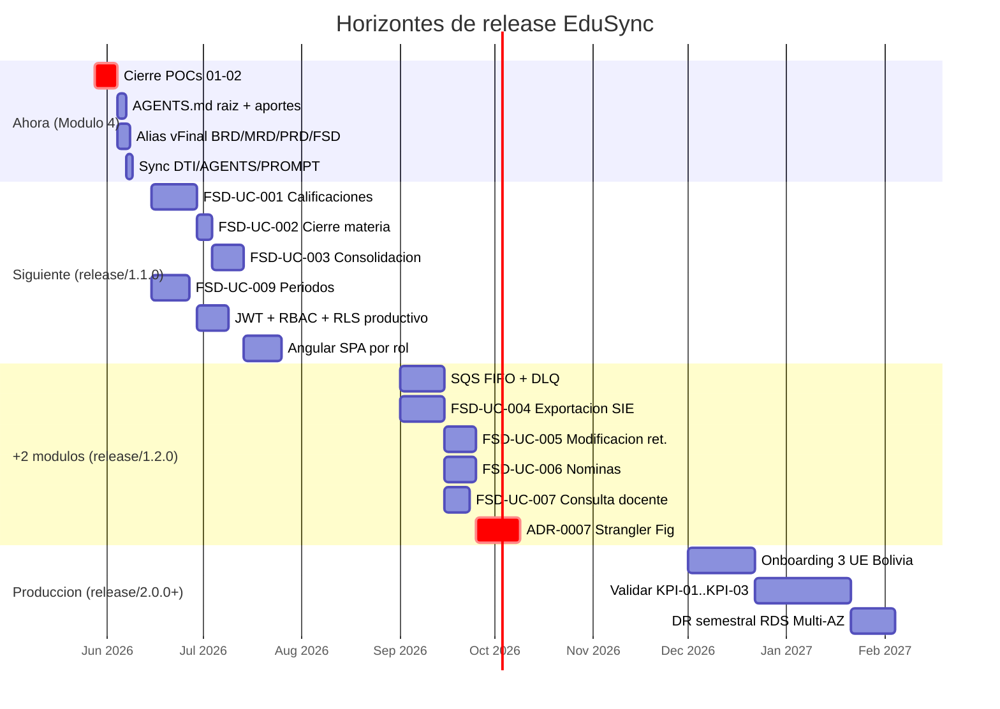

# Hoja de ruta tecnica de EduSync

> Fuente canonica del roadmap del producto.
> El bloque resumen de `docs/DTI.md §19` es un espejo de este archivo (no al reves).
> Generado por el contrato de prompt `prompts/PR-ROADMAP-001.md`.

## 0. Metadatos

| Campo | Valor |
|-------|-------|
| Version | v0.1 |
| Fecha | 28/05/2026 |
| Autor | Rodrigo Aspeti (G-EduSync) |
| Producto | EduSync — SaaS B2B multitenant para gestion academica boliviana |
| Stack autoritativo | Java 21 / Spring Boot 3.3 / PostgreSQL 15 RLS / Angular 17 / AWS ECS Fargate |
| Fuente canonica | este archivo (`docs/roadmap.md`) |
| Espejo resumen | `docs/DTI.md §19 Roadmap tecnico` |
| Releases en juego | `release/1.0.1` -> `release/1.1.0` -> `release/1.2.0` -> `release/2.0.0` |
| Trazabilidad | DTI v0.5; ADR-0001..0006; POC-01, POC-02; FSD-UC-001..010; BR-001..012; NFR-001..016; KPI-01..05 |
| Cumplimiento | Ley 070 Avelino Sinani · Ley 164 datos personales · formato SIE Ministerio de Educacion de Bolivia |

> **Nota de sincronizacion**: la entrega evaluable del Modulo 4 es la rama `release/2.0.0` (regla de la rubrica del Modulo 4). Mientras que en `docs/DTI.md` el `release_objetivo` del frontmatter todavia apunta a `release/1.0.1`, este roadmap declara explicitamente la promocion del ramal a `release/2.0.0` para la defensa, y deja el siguiente modulo encadenado a `release/1.1.0` para no perder la numeracion semver de los hitos de implementacion. La actualizacion del DTI corre por el skill `sync-doc-chain` en una tarea posterior.

### 0.1 Vista general de horizontes

> Las fechas del Gantt son indicativas; el orden y las dependencias son contractuales (las flechas `after` reflejan el grafo real de bloqueo).

---

## 1. Estado actual (cierre de Modulo 4)

A 28/05/2026, lo que vive en el repositorio y es auditable por la rubrica del Modulo 4:

- **Documentacion**: DTI v0.8 con 23 secciones pobladas; AGENTS.md v0.11; PROMPT_MAPPING.md v1.9 con 37 contratos; 10 diagramas Mermaid versionados en `docs/diagrams/`.
- **Decisiones**: 6 ADRs aprobados (`ADR-0001..ADR-0006`) cubriendo multitenancy, parametrizacion, audit log, asincronia, resiliencia SIE y cloud provider.
- **POCs**: 2 fichas definidas con criterio SMART (`POC-01 RLS multitenancy`, `POC-02 Circuit Breaker SIE`). **Resultado: Pendiente de ejecucion**. Sin metricas reales aun; cuando se ejecuten, alimentaran §6 de este roadmap.
- **Vista C4**: Nivel 1 + Nivel 2 + Nivel 3 (api-gateway, domain-layer, sie-adapter) + Deployment AWS.
- **Codigo**: no entregado todavia; el roadmap de implementacion arranca en el horizonte 3 (release/1.1.0).
- **Brechas identificadas para `release/2.0.0`** (ver §2): ejecución de POC-01/POC-02 con métricas reales, suite `tests/guardrails/`, consolidación de duplicado de diagrama y push final de la rama `release/2.0.0`. Ya están cerrados: `AGENTS.md` raíz, `docs/aportes/release-2.0.0.md` y aliases `vFinal` para BRD/MRD/PRD/FSD.

---

## 2. Horizonte Ahora — `release/2.0.0` (entrega de defensa final)

> **Ventana**: del 28/05/2026 (corte de la rama) al cierre del Modulo 4.
> **Objetivo**: cerrar el 100 % de los entregables que audita la rubrica del Modulo 4.

| Hito | Alcance (FSD-UC / ADR / POC) | Criterio de exito medible (NFR/BR/KPI) | Riesgo | Owner | Release tag |
|------|------------------------------|----------------------------------------|--------|-------|-------------|
| Cierre de POC-01 (RLS) con evidencia | `POC-01` + `ADR-0001` + `NFR-010` | `MultitenantTest` 1000/1000 pasa; 0 filas cross-tenant; p95 INSERT/SELECT < 505 ms (`NFR-001`) | Pendiente — POC sin ejecutar — **bloquea promocion a `release/1.1.0`** | Rodrigo Aspeti | `release/2.0.0` |
| Cierre de POC-02 (Circuit Breaker SIE) con evidencia | `POC-02` + `ADR-0005` + `NFR-011` + `NFR-012` | Circuit Breaker abre con 60 % failure rate; recuperacion < 15 min; 0 duplicados por `(rude, periodo_id)` | Pendiente — POC sin ejecutar — **bloquea promocion a `release/1.1.0`** | Rodrigo Aspeti | `release/2.0.0` |
| `AGENTS.md` raiz del repositorio | `AGENTS.md` + `AGENTS.md v0.11` | Archivo presente en la raiz y sincronizado; criterio 3 de la rubrica = Excelente | Cerrado en v0.9 | Rodrigo Aspeti | `release/2.0.0` |
| Alias `vFinal` para cadena documental | `docs/{brd,mrd,prd,fsd}/*_vFinal.md` + `PR-VFINAL-001` | 4 archivos existentes (BRD, MRD, PRD, FSD) con sufijo `_vFinal` y banner de freeze; literal de la rubrica | Cerrado por `PR-VFINAL-001`; re-ejecutar sólo si cambia un canónico | Rodrigo Aspeti | `release/2.0.0` |
| Aportes individuales por liberacion | `docs/aportes/release-2.0.0.md` + `PR-APORTES-001` | Archivo presente con `plantillas/APORTES_TEMPLATE.md`; 95 tareas auditables; factor 1.00 por n = 1 | Cerrado; falta sólo completar commit HEAD tras push | Rodrigo Aspeti | `release/2.0.0` |
| Suite `tests/guardrails/` activable | `BR-003`, `BR-005`, `BR-010`, `NFR-004`, `NFR-005`, `NFR-006`, `NFR-010` | 4 golden tests declarados (`FloorTest`, `SIEPayloadTest`, `VentanaTest`, `MultitenantTest`) con scaffolding listo aunque el codigo de produccion no exista | Sin scaffolding, el `qa-agent` no puede ejecutar la mantra de CI | Rodrigo Aspeti | `release/2.0.0` |
| Consolidacion de diagramas duplicados | `docs/diagrams/estados_cargar_notas.mmd` (canonico) | Eliminar `docs/diagrams/estados.cargarnotas.mmd` (duplicado de drift) | Diagrama duplicado contradice criterio 7 | Rodrigo Aspeti | `release/2.0.0` |
| Sincronizacion atomica final | `sync-doc-chain` corre tras cada artefacto de cierre | DTI v0.8; AGENTS.md v0.11; PROMPT_MAPPING.md v1.9 con `PR-ROADMAP-001`, `PR-APORTES-001` y `PR-VFINAL-001` | Sin sync, los criterios 1 y 3 caen a Aceptable | `docs-agent` | `release/2.0.0` |

---

## 3. Horizonte Siguiente — `release/1.1.0` (implementacion core hexagonal)

> **Ventana**: siguiente modulo de la maestria.
> **Objetivo**: producir el primer entregable de codigo funcional que materialice las decisiones arquitectonicas del DTI y valide los KPI del BRD en ambiente `stg`.

| Hito | Alcance (FSD-UC / ADR / POC) | Criterio de exito medible (NFR/BR/KPI) | Riesgo | Owner | Release tag |
|------|------------------------------|----------------------------------------|--------|-------|-------------|
| `FSD-UC-001` Registro de calificacion por dimension | `FSD-UC-001` + `ADR-0002` + `BR-002`, `BR-003` | p95 < 500 ms (`NFR-001`); validacion paramétrica en tiempo real; rango `[rango_min, rango_max]` del periodo | Saturacion del thread pool en pico trimestral | dev-agent | `release/1.1.0` |
| `FSD-UC-002` Cierre operativo de materia | `FSD-UC-002` + `ADR-0004` + `BR-008` | Respuesta inmediata al Docente (< 500 ms) sin esperar consolidacion; evento `MateriaCerradaEvent` publicado en `AFTER_COMMIT` | Centralizadores huerfanos > 1 % de cierres | dev-agent | `release/1.1.0` |
| `FSD-UC-003` Consolidacion algoritmica | `FSD-UC-003` + `ADR-0004` + `BR-003`, `BR-008`, `BR-011` | `FloorTest.floor_64_666_equals_64()` pasa en CI; centralizador disponible < 5 s post-cierre (`ConsolidacionAsincronaIT`) | Inconsistencia eventual visible al Director | dev-agent | `release/1.1.0` |
| `FSD-UC-004` Exportacion masiva al SIE por RUDE | `FSD-UC-004` + `ADR-0005` + `BR-004`, `BR-006` + `NFR-004`, `NFR-011` | `SIEPayloadTest.payload_uses_rude_only` pasa; tasa de exito >= 99 % por periodo; idempotencia por `(rude, periodo_id)` validada en `SIEIdempotencyTest` | Duplicados teoricos en edge case "SIE acepta + red cae" | dev-agent | `release/1.1.0` |
| `FSD-UC-005` Autorizacion jerarquica de modificacion retroactiva | `FSD-UC-005` + `ADR-0003` + `BR-005`, `BR-007` | `VentanaTest.correccion_retroactiva_genera_nuevo_registro_con_padre_id` pasa; ventana 1–72 h respetada; KPI-05 Director resuelve <= 4 h | Abuso de la ventana por Directores sin auditoria interna | dev-agent | `release/1.1.0` |
| `FSD-UC-009` Administracion de periodos academicos | `FSD-UC-009` + `ADR-0002` + `BR-006`, `BR-007` (`RB-05` apertura secuencial) | 100 % de aperturas no secuenciales bloqueadas con `E_TRIMESTRE_PREVIO_ABIERTO`; parametros inmutables post-apertura | Configuracion incorrecta de parametros por el Director | dev-agent | `release/1.1.0` |
| Multitenancy RLS productivo | `ADR-0001` + `POC-01` ejecutada | `MultitenantTest.no_cross_tenant_data` en CI bloqueante; politica RLS activa en cada tabla nueva via `RLSPolicyTest` | Bug en `RLSTenantInjector` expone datos | dev-agent + qa-agent | `release/1.1.0` |
| API Gateway JWT + RBAC | `NFR-003`, `NFR-008`, `NFR-009` | `JwtAuthFilter` valida RS256; expiracion <= 8 h; `@PreAuthorize` por rol `DIRECTOR/SECRETARIA/DOCENTE`; TLS 1.3 en ALB | Tokens largos o rotacion de claves fallida | dev-agent | `release/1.1.0` |
| Angular SPA por rol | `FSD-UC-001`, `FSD-UC-009`, `FSD-UC-010` (consulta) | 3 vistas por rol; CloudFront cache; latencia percibida desde Bolivia < 200 ms en assets estaticos | UX inconsistente entre roles | dev-agent | `release/1.1.0` |
| Cobertura `domain/` + `application/` | `NFR-013` | Jacoco >= 80 % en `bo.edusync.domain.*` y `bo.edusync.application.*` | Cobertura insuficiente en CI | qa-agent | `release/1.1.0` |
| Pipeline CI/CD a `stg` | `ADR-0006` + `NFR-014`, `NFR-015`, `NFR-016` | `mvn verify` + checkstyle + Jacoco; Terraform plan sin cambios destructivos; deploy a stg en merge a `develop` | Estado de Terraform corrupto | infra-agent | `release/1.1.0` |

---

## 4. Horizonte +2 modulos — `release/1.2.0` (event-driven productivo + microservicios)

> **Ventana**: dos modulos despues del actual.
> **Objetivo**: graduar la asincronia de Spring Events a SQS, formalizar el primer microservicio extraido por el seam `calificaciones <-> consolidacion` (DTI §6.2) y completar el pipeline CI/CD a produccion.

| Hito | Alcance (FSD-UC / ADR / POC) | Criterio de exito medible (NFR/BR/KPI) | Riesgo | Owner | Release tag |
|------|------------------------------|----------------------------------------|--------|-------|-------------|
| Migracion `Spring Events` -> `SQS FIFO` | `ADR-0004` (deuda controlada) + `ADR-0006` | `DomainEventPublisher` con implementacion SQS sin cambiar `bo.edusync.domain`; `MessageGroupId = periodoId`; DLQ activa | Mensajes perdidos en migracion | infra-agent + dev-agent | `release/1.2.0` |
| `SIERetryScheduler` productivo cada 5 min | `ADR-0005` + `FSD-UC-004` + `NFR-011`, `NFR-012` | Tasa exito SIE >= 99 % por periodo; alarma CloudWatch si fallos > 20 % en 5 min; scheduler observable en `/actuator/scheduledtasks` | Scheduler interfiere con picos de cierre | dev-agent | `release/1.2.0` |
| **ADR-0007 (Futuro)** Strangler Fig sobre seam `calificaciones <-> consolidacion` | `DTI §6.2 Seam 1` + `ADR-0004` + ADR-0007 propuesto | **Gated**: requiere POC-01 y POC-02 verdes en `release/1.1.0` + `> 50` tenants activos sostenidos + p95 cierre trimestral > 600 ms (umbral de dolor que justifique el costo) | Extraer microservicio prematuramente duplica costo operativo del equipo de uno | arch-agent | `release/1.2.0` |
| Pipeline CI/CD a `prd` con gate manual | `ADR-0006` + `NFR-002` | Deploy a prd solo desde tag `release/*`; rollback `aws ecs update-service` + `restore-db-instance-to-point-in-time` documentado | Despliegue manual fallido en pico | infra-agent | `release/1.2.0` |
| Particionado de `audit_log` por `tenant_id + año` | `ADR-0003` (consecuencia diferida) + `NFR-006` | `audit_log` particionada (Flyway v2+); cero `UPDATE/DELETE` validado por `AuditLogRuleTest`; volumen estimado < 10 MB/mes/tenant | Migracion sin downtime no validada | infra-agent | `release/1.2.0` |
| Cifrado PII end-to-end | `ADR-0006` + `NFR-007` | `KMSCipherTest` verifica `alias/edusync-pii-key`; RUDE/nombre/fecha_nacimiento cifrados en reposo; CloudTrail audita acceso a KMS | Performance impact > 5 % en p95 | sec-agent | `release/1.2.0` |
| `FSD-UC-004` Exportacion SIE productiva | `FSD-UC-004` + `ADR-0005` + `BR-004`, `BR-006` + `NFR-004`, `NFR-011`, `NFR-012` | Reanudacion del registro N+1 sin reenviar 1..N validada en `SIERetryIT` con WireMock; tasa de exito >= 99 % por periodo | Cambio de protocolo del SIE sin previo aviso | dev-agent | `release/1.2.0` |
| `FSD-UC-005` Modificacion retroactiva con ventana 1–72 h | `FSD-UC-005` + `ADR-0003` + `BR-005`, `BR-007` | `VentanaTest` en CI; `audit_log` con triple entrada (solicitud, resolucion, cierre de ventana); `KPI-05` <= 4 h Director | Abuso de ventana sin auditoria interna | dev-agent | `release/1.2.0` |
| `FSD-UC-006` Nominas (alta/baja/transferencia de estudiante) | `FSD-UC-006` + `ADR-0003` + `BR-005`, `BR-010` | Cada operacion genera entrada en `audit_log` con `actor_id`, `entidad_afectada`, `valor_anterior`, `valor_nuevo`; integridad referencial con `calificacion` preservada al transferir | Estudiantes huerfanos entre tenants ante transferencia inter-colegio | dev-agent | `release/1.2.0` |
| `FSD-UC-007` Consulta dimensiones activas por docente | `FSD-UC-007` + `ADR-0002` + `BR-002` | Endpoint `GET /dimensiones?periodo_id=&materia_id=` retorna `parametro_academico` vigente; p95 < 200 ms; cache por `(tenant_id, periodo_id)` invalidada al modificar parametro | Cache desactualizada tras cambio ministerial | dev-agent | `release/1.2.0` |

---

## 5. Horizonte Produccion — `release/2.0.0+` (Bolivia, primeras 3 UE)

> **Ventana**: lanzamiento productivo en colegios reales.
> **Objetivo**: validar los KPI del BRD con clientes reales en condiciones de cierre trimestral simultaneo.

| Hito | Alcance (FSD-UC / ADR / POC) | Criterio de exito medible (NFR/BR/KPI) | Riesgo | Owner | Release tag |
|------|------------------------------|----------------------------------------|--------|-------|-------------|
| Onboarding de las primeras 3 unidades educativas | Todos los `FSD-UC-001..010` + `ADR-0006` | 3 tenants activos en prd; tiempo de provisioning por tenant <= 1 dia | Inconsistencia de parametros entre colegios | product + dev-agent | `release/2.0.0` |
| Validar `KPI-01` con primer cierre trimestral piloto | `FSD-UC-004` + `ADR-0005` + `KPI-01` | Ciclo de sincronizacion SIE < 10 min (linea base > 15 horas); medido en telemetria | Falla del SIE el dia de cierre | product | `release/2.0.0` |
| Validar `KPI-02` integridad de datos | `FSD-UC-003`, `FSD-UC-004` + `BR-003`, `BR-008` + `KPI-02` | Tasa de error de integridad = 0 % por exportacion; reporte de auditoria SIE sin desfases ni decimales incorrectos | Cambio ministerial de formato sin previo aviso | qa-agent | `release/2.0.0` |
| Validar `KPI-03` revisiones manuales | `FSD-UC-001`, `FSD-UC-003` + `KPI-03` | 0 ciclos de revision manual por trimestre (linea base = 10) | Resistencia operativa de la Secretaria | product | `release/2.0.0` |
| Disponibilidad de cierre trimestral | `ADR-0006` + `NFR-002` + `BO-05` | Uptime >= 99.5 % en ventanas de cierre; CloudWatch Synthetic Canary cada 1 min sobre `/actuator/health` | Falla simultanea Multi-AZ | infra-agent | `release/2.0.0` |
| Disaster Recovery validado en `prd` | `ADR-0006` | RTO <= 4 h; RPO <= 1 h; simulacion semestral de failover RDS Multi-AZ documentada | Tiempo real de failover > 60 s | infra-agent | `release/2.0.0` |
| Presupuesto AWS bajo control | `ADR-0006` | Factura mensual <= 200 USD con 10–20 tenants activos; CloudWatch Billing Alarm en 80 % del presupuesto | Escalado automatico sin limite superior | infra-agent | `release/2.0.0` |

---

## 6. Lecciones del ciclo (Modulo 4)

> Trazadas a POCs y ADRs aprobados.
> Lecciones marcadas como **pendientes** se cerraran cuando las POCs se ejecuten y produzcan evidencia en `docs/pocs/POC-NN/evidencia/`.

| ID | Leccion | Fuente | Estado | Aplicacion en `release/1.1.0` |
|----|---------|--------|--------|--------------------------------|
| L-01 | **El aislamiento por `tenant_id` debe vivir en el motor de BD, no solo en la aplicacion**. RLS de PostgreSQL 15 es la red de seguridad cuando un bug de codigo silencia un filtro `WHERE tenant_id`. | `ADR-0001 §4`; POC-01 (**pendiente de ejecucion**) | Aceptada por decision; metricas pendientes | `RLSPolicyTest` obligatorio en CI antes de cada merge a `release/*` |
| L-02 | **Un SIE no idempotente requiere idempotencia compensatoria del cliente** via clave `(rude, periodo_id)` + circuit breaker + scheduler de reintentos. Sin esa combinacion, el KPI-01 (cierre < 10 min) es inalcanzable. | `ADR-0005 §4`; POC-02 (**pendiente de ejecucion**) | Aceptada por decision; metricas pendientes | Estado por registro en tabla `exportacion_sie_estado` + Resilience4j productivo |
| L-03 | **`audit_log` append-only debe ser una restriccion del motor**, no solo una buena practica. La regla `CREATE RULE no_update_audit_log AS ON UPDATE DO INSTEAD NOTHING` y `@Immutable` de Hibernate cierran el agujero a doble llave. | `ADR-0003 §4` | Aceptada y aplicable sin POC | DDL incluido en migracion `V003__audit.sql`; `AuditLogRuleTest` en CI |
| L-04 | **La consolidacion sincrona dentro de la transaccion del cierre rompe NFR-001 en picos trimestrales**. Spring Events `AFTER_COMMIT` es suficiente para v1.0 sin pagar el costo operativo de SQS, y mantiene el dominio agnostico al transporte. | `ADR-0004 §3`; DTI §17 trade-off DA-04 | Aceptada | `ConsolidacionAsincronaIT` con `Awaitility`; prohibido `Thread.sleep()` en tests |
| L-05 | **Parametrizar reglas normativas en BD (alcance `tenant + periodo`) evita un redespliegue cada vez que el Ministerio cambia el formato SIE o las dimensiones**. La tabla `parametro_academico` es inmutable post-apertura por `BR-007`. | `ADR-0002 §4`; BR-007 | Aceptada | UI de administracion del Director debe bloquear edicion en periodo `ABIERTO` |
| L-06 | **El stack familiar a `Spring Boot 3.3 + RDS PostgreSQL 15 con RLS nativo` reduce mas riesgo operativo que la portabilidad teorica de Kubernetes** para un equipo de uno. ECS Fargate elimina la gestion del plano de control. | `ADR-0006 §3` | Aceptada | Terraform 1.8 como unica fuente de verdad para infra; `terraform plan` bloquea PRs con cambios destructivos |
| L-07 | **`Math.floor()` debe quedar prohibido fuera de `ConsolidacionDomainService`** porque `64.666… -> 22` vs `23` ya ocurrio en Excel reales auditados. El `FloorTest` se ejecuta como golden test bloqueante. | `ADR-0002 §7`; DTI §16 antipatron `floor() fuera de dominio` | Aceptada | `FloorTest.floor_64_666_equals_64()` en CI; PR rechazado automaticamente si falla |
| L-08 | **El RUDE es la unica clave de identidad estudiantil en operaciones de escritura**; nombre, apellido y posicion de lista son inaceptables tanto como clave logica como en payload SIE. `SIEPayloadTest.payload_uses_rude_only` es un golden test bloqueante. | `ADR-0005 §7`; `NFR-004`; DTI §16 antipatron `PII en logs` | Aceptada | Adaptador `SIEHttpClientAdapter` construye payload solo con `rude + periodo_id + dimensiones agregadas`; PR con nombre/posicion rechazado |
| L-09 | **El factor de aporte individual `clamp(tareas_i / promedio, 0.5, 1.1)`** convierte la rubrica grupal en notas individuales con piso 0.5 y techo 1.1. Mantener `docs/aportes/release-2.0.0.md` actualizado es obligatorio para cada integrante; un integrante sin tabla recibe automaticamente factor 0.5. | rubrica del Modulo 4 §Ajuste por aporte individual; `plantillas/APORTES_TEMPLATE.md` | Aceptada | Cada release evaluable incluye `docs/aportes/release-<version>.md`; el docente aplica la formula al cerrar el modulo |

---

## 6.1 Definicion de Done por horizonte

| Horizonte | Definicion de Done (criterios objetivos) |
|-----------|------------------------------------------|
| **Ahora — `release/2.0.0`** | Todos los entregables de §2 marcados completos; `AGENTS.md` en raiz; `docs/aportes/release-2.0.0.md` poblado; alias `vFinal` de BRD/MRD/PRD/FSD; POC-01 y POC-02 con evidencia en `docs/pocs/POC-NN/evidencia/`; rama `release/2.0.0` pusheada y verificable por el docente. |
| **Siguiente — `release/1.1.0`** | `FSD-UC-001`, `FSD-UC-002`, `FSD-UC-003`, `FSD-UC-009` implementados con golden tests verdes; cobertura Jacoco >= 80 % en `domain/` + `application/`; pipeline CI/CD desplegando a `stg` en cada merge a `develop`; `MultitenantTest` y `RLSPolicyTest` bloqueantes en CI; tag `release/1.1.0` con changelog firmado. |
| **+2 modulos — `release/1.2.0`** | `FSD-UC-004`, `FSD-UC-005`, `FSD-UC-006`, `FSD-UC-007` implementados; `Spring Events` reemplazado por `SQS FIFO` sin tocar `bo.edusync.domain`; `audit_log` particionada; cifrado PII via KMS validado por `KMSCipherTest`; ADR-0007 cerrado como Propuesto o Rechazado. |
| **Produccion — `release/2.0.0+`** | 3 unidades educativas onboarding completo; `KPI-01 < 10 min` verificado en cierre trimestral piloto; `KPI-02 = 0 %` en exportacion SIE; uptime >= 99.5 % en ventana de cierre; DR Multi-AZ ejercitado semestralmente con RTO <= 4 h y RPO <= 1 h; factura AWS bajo `<= 200 USD/mes` con 10–20 tenants. |

---

## 7. Metricas de salud del producto

| KPI / NFR | Definicion | Linea base | Umbral objetivo | Horizonte de validacion | Mecanismo |
|-----------|------------|------------|------------------|--------------------------|-----------|
| `KPI-01` (BRD §8) | Time-on-task del ciclo de sincronizacion SIE en minutos | > 15 h (jornada de madrugada) | < 10 min | `release/2.0.0` — 1er cierre trimestral piloto | Telemetria del sistema (logs de sesion) |
| `KPI-02` (BRD §8) | Tasa de error de integridad en exportacion SIE | Alta (desfases + decimales) | 0 % | `release/2.0.0` — 1er cierre trimestral | Reportes de auditoria del motor de exportacion |
| `KPI-03` (BRD §8) | Ciclos de revision manual por trimestre (Secretaria) | 10 ciclos promedio | 0 ciclos | Año escolar 1 | Entrevistas UX con secretarias piloto |
| `KPI-04` (BRD §8) | % docentes que cierran su materia antes del plazo | Sin medicion | >= 95 % | Año escolar 1 | Dashboard de avance docente (UC-10) |
| `KPI-05` (BRD §8) | Tiempo respuesta Director ante UC-05 | Sin medicion | <= 4 h | Año escolar 1 | `audit_log` (timestamp solicitud -> resolucion) |
| `NFR-001` | p95 registro de calificacion | sin medicion | < 500 ms | `release/1.1.0` con k6 en stg | k6 en pipeline CI stg |
| `NFR-002` | Uptime mensual | sin medicion | >= 99.9 % | `release/2.0.0` | CloudWatch Alarms |
| `NFR-010` | Filas cross-tenant en cualquier endpoint | sin medicion | 0 filas | `release/1.1.0` | `MultitenantTest` CI |
| `NFR-011` | Idempotencia SIE por `rude + periodo_id` | sin medicion | 0 duplicados | `release/1.2.0` | `SIEIdempotencyTest` |
| `NFR-013` | Cobertura `domain/` + `application/` | sin medicion | >= 80 % | `release/1.1.0` | Jacoco `mvn jacoco:report` en CI |
| RPO | Recovery Point Objective ante desastre | sin medicion | <= 1 h | `release/2.0.0` | RDS Multi-AZ + snapshot policy |
| RTO | Recovery Time Objective ante desastre | sin medicion | <= 4 h | `release/2.0.0` | Simulacion semestral de failover |
| Error budget SIE | Margen mensual de errores tolerados | sin medicion | <= 1 % registros fallidos por mes | `release/2.0.0` | CloudWatch + reporte de exportacion |

---

## 8. Riesgos y mitigaciones (resumen alineado con DTI §18)

| Riesgo | Probabilidad | Impacto | Mitigacion | Horizonte donde se cierra |
|--------|--------------|---------|------------|----------------------------|
| Bug en `RLSTenantInjector` expone datos cross-tenant | Baja | Critico | `MultitenantTest` CI + code review estricto; POC-01 antes de promover | `release/1.1.0` (gated por POC-01 verde) |
| SIE ministerial cambia protocolo sin aviso | Media | Alto | Adaptador SIE aislado en `adapter/out/integration/sie/`; parametros en BD (`ADR-0002`) | Continuo en todos los horizontes |
| `floor()` aplicado fuera de `ConsolidacionDomainService` | Baja | Alto (error legal) | `FloorTest` CI bloqueante; regla en `AGENTS.md §6`; auditoria estatica | `release/1.1.0` |
| RDS Multi-AZ falla simultaneamente en ambas zonas | Muy baja | Critico | Warm Standby; RPO 1 h; RTO 4 h | `release/2.0.0` |
| Crecimiento de `audit_log` excede disco RDS | Media (largo plazo) | Medio | Particionado por `tenant_id + año` (Flyway v2+); archivado a S3 Glacier | `release/1.2.0` |
| POCs no se ejecutan antes del corte | Alta hoy | Alto | Skill `poc-runner-edusync` listo; ejecucion bloquea promocion a `release/1.1.0` | `release/2.0.0` |
| Factura AWS escala sin control | Media | Medio | CloudWatch Billing Alarm 80 %; presupuesto <= 200 USD/mes con 10–20 tenants | `release/2.0.0` |

---

## 9. Compromisos hacia el siguiente modulo (`release/1.1.0`)

Entregables minimos para promover de `release/2.0.0` a `release/1.1.0`:

1. **Ejecutar POC-01 y POC-02 con evidencia real** (`docs/pocs/POC-NN/evidencia/metrics.csv` + capturas) y actualizar §6 de este roadmap con metricas medidas. Sin POCs ejecutadas, L-01 y L-02 quedan pendientes y `ADR-0007` no avanza.
2. **Implementar `FSD-UC-001` + `FSD-UC-003` + `FSD-UC-009`** como la columna vertebral del dominio (calificacion -> consolidacion -> apertura/cierre de periodo) con los 4 golden tests (`FloorTest`, `VentanaTest`, `MultitenantTest`, `SIEPayloadTest`) verdes en CI bloqueante en `release/*`.
3. **Desplegar a `stg` por pipeline CI/CD reproducible**: imagen Docker en ECR + Terraform 1.8 aplicado sobre cuenta AWS de staging; Jacoco >= 80 % en `bo.edusync.domain.*` y `bo.edusync.application.*` (`NFR-013`).
4. **Activar JWT + RBAC con RLS productivo**: `JwtAuthFilter` + `RLSTenantInjector` + Secrets Manager para clave de firma RS256; `MultitenantTest` y `RLSPolicyTest` bloquean merge a `release/*`.
5. **Cerrar el ADR-0007 (Strangler Fig) como Propuesto o Rechazado** con los datos reales del piloto: si la latencia p95 de cierre trimestral supera 600 ms con > 50 tenants, queda Propuesto; si no, queda Rechazado por costo operativo.

---

## 10. Trazabilidad cruzada

| Fuente | Seccion del roadmap que la consume |
|--------|-----------------------------------|
| `docs/DTI.md §19` | Resumen embebido (espejo de este archivo) |
| `docs/DTI.md §12.1` POC-01 | §2 Hito "Cierre POC-01"; §6 L-01 |
| `docs/DTI.md §12.2` POC-02 | §2 Hito "Cierre POC-02"; §6 L-02 |
| `docs/DTI.md §6.2` Seams | §4 ADR-0007 Strangler Fig |
| `docs/DTI.md §11` NFRs | §3, §4, §5, §7 metricas de salud |
| `docs/DTI.md §16` Antipatrones | §6 L-07; §8 riesgos |
| `docs/DTI.md §17` Trade-offs | §6 L-04, L-05, L-06 |
| `docs/DTI.md §18` Riesgos | §8 (replica resumida) |
| `docs/brd/BRD_EduSync_v2.md §8` KPIs | §7 metricas de salud |
| `docs/adr/0001..0006-*.md` | §2 a §5 hitos por horizonte |
| `docs/fsd/FSD_EduSync.md §4` FSD-UC | §3 implementacion core |
| Rubrica del Modulo 4 | §2 (regla de entrega `release/2.0.0`, criterios 1–7) |

---

## 11. Registro de cambios

| Version | Fecha | Autor | Cambio |
|---------|-------|-------|--------|
| v0.1 | 28/05/2026 | Rodrigo Aspeti | Creacion desde `PR-ROADMAP-001`. Roadmap canonico con 4 horizontes, 7 lecciones (5 aceptadas + 2 pendientes por POC), metricas BRD/NFR/RPO/RTO, 7 riesgos y 5 compromisos hacia `release/1.1.0`. POC-01 y POC-02 marcadas explicitamente como "Pendiente de ejecucion" segun caso borde §6.2 del contrato. |
| v0.2 | 28/05/2026 | Rodrigo Aspeti | Sincronizacion de cierre documental tras `PR-APORTES-001` y `PR-VFINAL-001`: estado actual actualizado a DTI v0.8, AGENTS.md v0.11 y PROMPT_MAPPING.md v1.9; brechas cerradas para `AGENTS.md` raiz, aportes `release/2.0.0` y aliases `vFinal` BRD/MRD/PRD/FSD; §2 refleja que estos hitos ya estan completados y mantiene como pendientes POC-01/POC-02 con evidencia, guardrails, consolidacion de duplicado y push final de `release/2.0.0`. |

---

> **Cierre**: este documento es la fuente unica de la hoja de ruta. Cualquier modificacion debe propagarse al espejo embebido en `docs/DTI.md §19` mediante el skill `sync-doc-chain`. Para registrar la generacion en el catalogo de prompts, ejecutar el skill `update-prompt-mapping` con el contrato `PR-ROADMAP-001`.
