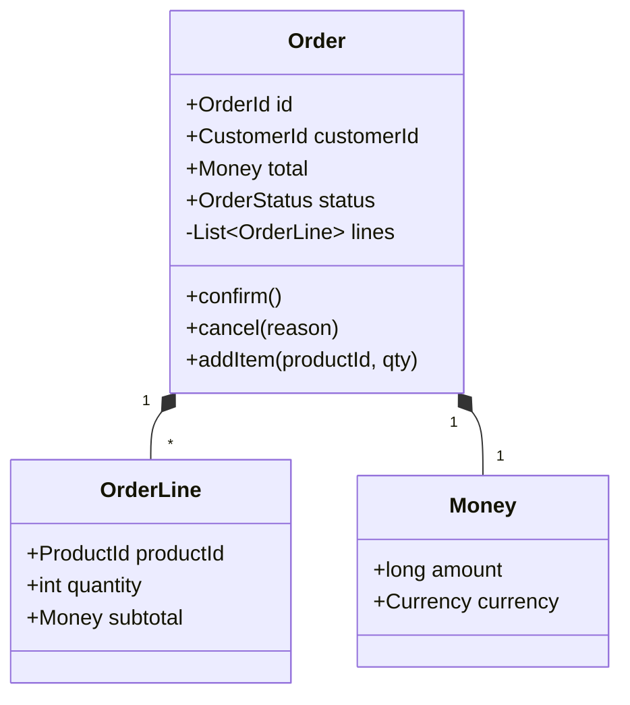

# Skill: ddd-aggregate-designer (Aggregate raíz + invariantes + Domain Events)

> Skill canónica del módulo 4. Para activarla en Claude Code o Claude Desktop,
> copia esta carpeta a `~/.claude/skills/ddd-aggregate-designer/` o a
> `.claude/skills/ddd-aggregate-designer/` en la raíz del repo del grupo.
> Literatura recomendada (opcional): Eric Evans *Domain-Driven Design*,
> Vaughn Vernon *Implementing Domain-Driven Design*, Martin Fowler
> *Anemic Domain Model* (2003).

## 1. Cuándo activarlo (triggers)

- DURANTE: diseño del modelo de dominio de un bounded context, redacción del DTI §6 (parte DDD), implementación inicial de la capa de dominio en código.
- ARRANCA cuando: el usuario invoca `"@ddd-aggregate-designer <NombreAggregate>"`, abre `src/domain/<entidad>/` o `docs/diagrams/aggregate_*.mmd`, o pide "diseña el Aggregate Order / Booking / Tramite".
- NO ACTIVAR cuando: el bounded context aún no está definido (correr antes el skill de descomposición); los UCs del FSD aún no están enumerados.

## 2. Entradas obligatorias

El usuario MUST proporcionar:

- **Nombre del Aggregate** propuesto (típicamente la entidad central del bounded context, ej. `Order`, `Booking`, `Tramite`).
- **Bounded context** al que pertenece.
- **Casos de uso del FSD que lo modifican** (mínimo 2; si solo 1 lo modifica, probablemente no necesita ser un Aggregate sino un Domain Service o Value Object).
- **Invariantes del dominio** que debe proteger (mínimo 3; ejemplos: "el total no puede ser negativo", "no se puede confirmar sin línea items", "un pedido cancelado no se puede modificar").
- **Política de consistencia inter-aggregate**: típicamente eventual via Domain Events.

Si falta cualquiera, responder: `"Necesito el nombre del Aggregate, su bounded context, los UCs que lo modifican y al menos 3 invariantes del dominio antes de modelarlo."`

## 3. Fuentes de verdad (orden de precedencia)

1. UCs del FSD del bounded context (postcondiciones que tocan el Aggregate).
2. Diccionario de tipos del FSD §6 (alinearse a tipos existentes: `Money`, `Address`, `Timestamp`, `UUID`).
3. NFRs relevantes (consistencia, auditoría regulatoria).
4. `AGENTS.md` del repo del producto (si existe; lenguaje, framework ORM, convenciones de naming).
5. Código existente del bounded context (no duplicar conceptos ya modelados).

## 4. Procedimiento

1. **Verificar inputs**. Si los UCs no están enumerados o no hay invariantes claras, STOP.
2. **Identificar el Aggregate Root**: la entidad con identidad estable y referenciada desde fuera del Aggregate. Toda interacción externa pasa por el Root; nadie afuera referencia entities internas directamente.
3. **Identificar las entities locales**: existen solo dentro del Aggregate, tienen identidad pero esa identidad solo es relevante dentro del Aggregate. Ej: `OrderLine` dentro de `Order`.
4. **Identificar los value objects**: inmutables, comparados por valor, sin identidad. Ej: `Money(amount, currency)`, `Address(street, city, zip)`, `EmailAddress`.
5. **Listar métodos del Root**, donde cada método:
   - Valida explícitamente las invariantes que protege.
   - Emite uno o más Domain Events si cambia estado relevante.
   - Es nombrado con verbo de negocio (`confirm()`, `cancel()`, `addItem(item)`) — NUNCA setters genéricos (`setStatus(s)`).
6. **Listar Domain Events publicados** por el Aggregate. Nombre en pasado: `OrderConfirmed`, `OrderCancelled`, `LineItemAdded`. Payload con identidad del Aggregate + delta del cambio.
7. **Aplicar las 3 reglas del Aggregate**:
   - **Regla 1: referencias solo al Root**. Otros Aggregates referencian a este por su `<Root>Id` (UUID), nunca por puntero a entities internas.
   - **Regla 2: 1 transacción = 1 Aggregate**. Una transacción DB modifica un solo Aggregate. Si necesitas modificar 2 → Saga eventual con Domain Events.
   - **Regla 3: consistencia inter-aggregate es eventual via Domain Events**. Otros bounded contexts reaccionan al evento, no leen el estado del Aggregate directamente.
8. **Verificar que NO sea Anemic Domain Model**:
   - Cero setters públicos (toda mutación pasa por un método de dominio).
   - Cero clase "Service" con todos los métodos y entity "DTO" con solo getters/setters.
   - Los métodos del Root contienen lógica de negocio, no solo asignan campos.
9. **Producir diagrama de clases Mermaid** + tabla de métodos + tabla de Domain Events.

## 5. Salida esperada

Tres artefactos:

- Diagrama Mermaid `classDiagram` que muestra el Root, sus entities locales y value objects:

- Tabla de métodos del Root con invariantes protegidas:

| Método | Invariantes que valida | Domain Event emitido | Precondición | Estado resultante |
|--------|------------------------|----------------------|--------------|-------------------|
| `confirm()` | INV-01 ≥ 1 línea ítem; INV-02 total > 0; INV-03 status == Draft | OrderConfirmed | status == Draft | status == Confirmed |
| `cancel(reason)` | INV-04 status ∈ {Draft, Confirmed} (no Delivered) | OrderCancelled | status ≠ Delivered | status == Cancelled |
| `addItem(productId, qty)` | INV-05 qty > 0; INV-06 status == Draft; INV-07 ítem único por productId | LineItemAdded | status == Draft | total += subtotal |

- Tabla de Domain Events publicados:

| Domain Event | Payload (campos narrow) | Cuándo se publica | Consumidores típicos (en otros bounded contexts) |
|--------------|--------------------------|--------------------|--------------------------------------------------|
| OrderConfirmed | orderId:UUID, customerId:UUID, total:Money, confirmedAt:Timestamp | Tras confirmar pedido válido | Kitchen, Billing, Notifications |
| OrderCancelled | orderId:UUID, reason:CancellationReason, cancelledAt:Timestamp | Tras cancelación | Notifications, Analytics |
| LineItemAdded | orderId:UUID, productId:UUID, quantity:int, subtotal:Money | Tras añadir ítem | (interno; típicamente no cross-context) |

## 6. Verificación (criterios de "bien hecho")

- El Root tiene identidad estable (UUID o tipo similar) y todos los demás Aggregates lo referencian por esa identidad, no por puntero.
- Cero setters públicos en el Root y entities locales (toda mutación pasa por un método con verbo de negocio).
- Cada método del Root tiene **al menos 1 invariante validada** explícitamente.
- Cada método que cambia estado relevante para otros bounded contexts **emite un Domain Event**.
- Los value objects son inmutables (sin setters, constructor toma todos los campos).
- Cero `JOIN` con tablas de otros Aggregates en la persistencia.
- Cada Domain Event tiene nombre en pasado (`OrderConfirmed`, NUNCA `ConfirmOrder` ni `OrderConfirmation`).
- El Aggregate cabe en una transacción de BD (no requiere transacciones distribuidas dentro de sí).

## 7. Anti-patrones específicos

- **Anemic Domain Model**: entity con solo getters/setters y un "ServiceClass" con toda la lógica. Mitigación: mover la lógica a métodos del Root con nombres de negocio.
- **Aggregate gigante**: el Root absorbe 5+ entities internas y los métodos son de 100+ líneas. Mitigación: si las entities internas son referenciadas desde fuera o cambian de manera independiente, son candidatas a Aggregate propio.
- **Referencia directa a entity interna**: otro Aggregate guarda un puntero a `Order.lines[0]`. Mitigación: solo referenciar el Root por su id; si necesitan información de la línea, leerla via API o evento.
- **Transacción que modifica 2 Aggregates**: `OrderService.confirmAndCharge()` toca Order y Payment en la misma TX. Mitigación: confirmar Order, emitir `OrderConfirmed`, Payment Aggregate reacciona en TX separada via Saga.
- **Setter público para "facilitar tests"**: rompe encapsulación del dominio. Mitigación: usar Builder de test, o constructor con todos los campos para casos de migración.
- **Domain Event con nombre genérico**: `OrderChanged`, `OrderEvent`. Mitigación: nombre específico `OrderConfirmed`, `OrderCancelled` por cada cambio relevante.
- **Aggregate sin invariantes claras**: el Root no protege nada, solo guarda datos. Mitigación: si no hay invariantes, probablemente es un DTO, no un Aggregate.

## 8. Mini ejemplo de invocación

> "Diseña el Aggregate `Order` del bounded context Order Taking. UCs que lo modifican: UC-01 Crear pedido, UC-02 Añadir ítem, UC-03 Confirmar pedido, UC-07 Cancelar pedido. Invariantes: (1) total no negativo; (2) cantidad por ítem > 0; (3) no se puede confirmar sin ítems; (4) un pedido confirmed/delivered no se puede modificar; (5) no se pueden duplicar líneas con el mismo productId. Usa el skill `ddd-aggregate-designer`."

## 9. Modos de fallo conocidos

- El usuario pide un Aggregate de 10+ entities → STOP, probablemente cruza varios bounded contexts; revisar la descomposición.
- El usuario pide setters públicos "porque su ORM no soporta otra cosa" → STOP, recomendar JPA/EF con field access en lugar de property access, o un mapper explícito.
- Los UCs no tocan un estado relevante para otro contexto (Domain Event no tiene a quién informar) → revisar si realmente necesita Domain Event o basta una operación interna.
- Las invariantes son débiles ("el campo no es null") → STOP, las invariantes deben venir del negocio (montos, secuencias de estado), no de la BD.

## 10. Registro de cambios

| Versión | Fecha       | Autor                  | Cambio          |
|---------|-------------|------------------------|-----------------|
| 0.1.0   | 21/05/2026  | M.Sc. Edson Terceros   | versión inicial; diseño de Aggregate DDD con invariantes y Domain Events |
