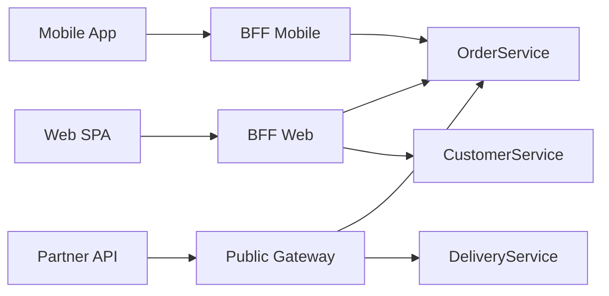

# Skill: external-api-designer (Gateway / BFF / GraphQL + ADR)

> Skill canónica del módulo 4. Para activarla en Claude Code o Claude Desktop,
> copia esta carpeta a `~/.claude/skills/external-api-designer/` o a
> `.claude/skills/external-api-designer/` en la raíz del repo del grupo.

## 1. Cuándo activarlo (triggers)

- DURANTE: diseño de la edge de la arquitectura, llenado del DTI §6 (sub-sección API externa), redacción del ADR de API externa, definición del contrato del API público.
- ARRANCA cuando: el usuario invoca `"@external-api-designer"`, abre `docs/adr/<n>-api-externa.md`, o pide "diseña la API externa / Gateway / BFF / GraphQL".
- NO ACTIVAR cuando: los microservicios internos aún no están identificados (correr antes `monolith-decomposition-architect`).

## 2. Entradas obligatorias

El usuario MUST proporcionar:

- **Tipos de cliente y volumen estimado**: web SPA, móvil iOS/Android, partner API, internal admin. Para cada uno: ratio aproximado del tráfico total, payload típico, latencia tolerable, autenticación requerida.
- **Microservicios internos y sus APIs**: lista de servicios candidatos a estar detrás del Gateway, con sus APIs (REST/gRPC) ya definidas.
- **Queries cross-servicio frecuentes**: ejemplos típicos ("dashboard que muestra orders + customer profile + last delivery", "página de detalle de pedido con info de courier y restaurante").
- **NFRs de la API externa**: p99 latency target, throughput pico, autenticación (OAuth2 / API key / mTLS), rate limit por cliente.

Si falta cualquiera, responder: `"Necesito tipos de cliente con volumen, microservicios internos, queries cross-servicio frecuentes y NFRs de la API externa antes de decidir Gateway / BFF / GraphQL."`

## 3. Fuentes de verdad (orden de precedencia)

1. NFRs del PRD (latencia p99, throughput, auth, rate limit).
2. Catálogo de microservicios del DTI §6.
3. Catálogo de eventos (si existen Domain/Integration Events).
4. ADRs vigentes (broker, stack, cloud).
5. `AGENTS.md` del repo del producto (si existe; lenguajes, frameworks).

## 4. Procedimiento

1. **Verificar inputs**. Si faltan tipos de cliente o NFRs, STOP.
2. **Listar tipos de cliente** y sus necesidades reales (payload, latency, auth, versionado, casos offline si móvil).
3. **Decidir Gateway único vs BFF por cliente**:
   - **Gateway único** gana cuando los clientes tienen necesidades muy similares (mismo payload, misma auth, misma latency). Menos código, menos despliegues.
   - **BFF por cliente** gana cuando los clientes divergen (móvil necesita payload compacto + offline cache; partner API necesita versioning estable + webhook callbacks; admin necesita endpoints batch). Más código pero cada BFF evoluciona independientemente.
4. **Decidir REST vs GraphQL**:
   - **REST + OpenAPI + SemVer** gana para APIs partner externas, caching CDN, ecosistema HTTP estándar, versionado mayor cuando hay breaking change (`v1` → `v2`).
   - **GraphQL** gana cuando hay over/under-fetching significativo (clientes pidiendo subconjuntos muy diferentes), schema único evolutivo (campos opcionales, deprecation graceful), y el cliente puede pagar el costo de queries arbitrarias.
   - **gRPC + Protocol Buffers**: solo para comunicación entre servicios internos o partners con SDK propietario; NO recomendable como API pública por la falta de soporte browser nativo.
5. **Definir responsabilidades del Gateway/BFF**:
   - **Routing**: ruta cliente → microservicio interno.
   - **API Composition**: agregar respuestas de N servicios en una sola respuesta al cliente (`GET /orders/{id}/full` consulta OrderService + CustomerService + DeliveryService).
   - **Auth**: validar JWT/OAuth2/API key; inyectar identidad en el header al servicio interno.
   - **Rate limiting**: token bucket por API key (típico 100 req/s por cliente).
   - **Caching**: respuestas idempotentes con `Cache-Control` headers (CDN para edge cache).
   - **Protocol translation**: cliente REST/JSON ↔ servicio interno gRPC/Protobuf o eventos async.
   - **Observabilidad**: trace ID propagado, métricas por endpoint.
6. **Para cada query cross-servicio, decidir**:
   - **API Composition** en el Gateway: el Gateway hace N llamadas en paralelo y agrega. Bueno para queries simples (≤ 3 servicios, latency suma tolerable).
   - **CQRS con read model**: un servicio dedicado mantiene un read model denormalizado actualizado por eventos. Bueno para queries complejas con muchos joins lógicos y alta frecuencia.
7. **Diseñar el shape del API público**: si REST, 5+ endpoints típicos con verbos correctos y status codes; si GraphQL, schema mínimo con types, queries, mutations, subscriptions opcionales.
8. **Producir ADR** con decisión justificada contra ≥ 3 dimensiones (clientes, queries cross-servicio, caching, versionado, ops).

## 5. Salida esperada

Tres artefactos:

- ADR de API externa (formato estándar ADR: Context, Decision, Options evaluadas contra dimensiones explícitas, Consequences positivas y negativas), con al menos 3 opciones evaluadas:

| Opción | Pros | Contras | Cuándo elegirla |
|--------|------|---------|-----------------|
| A. Gateway único REST | Simplicidad operativa, caching CDN, ecosistema maduro | Over/under-fetching, payload no optimizado por cliente | Clientes similares, partner público |
| B. BFF por cliente | Payload optimizado, evolución independiente, cierre por cliente | N despliegues, duplicación de lógica | Clientes muy distintos (móvil vs admin) |
| C. GraphQL Gateway | Schema único, evita over/under-fetching, ideal para clientes ricos | Caching más complejo, N+1 queries riesgo | Clientes ricos con necesidades dispares |

- Diagrama Mermaid de la edge:

- 5 endpoints REST o queries GraphQL de ejemplo con su método, path, payload esperado y código de status. Ejemplo REST:

| Verbo | Path | Auth | Rate limit | Cache | Composition |
|-------|------|------|------------|-------|-------------|
| GET | `/v1/orders/{id}/full` | OAuth2 | 100/s/key | 30 s | OrderService + CustomerService + DeliveryService |
| POST | `/v1/orders` | OAuth2 | 50/s/key | no | OrderService |
| GET | `/v1/restaurants?lat=&lng=` | API key | 200/s/key | 5 min CDN | RestaurantService |
| PATCH | `/v1/orders/{id}/cancel` | OAuth2 | 10/s/key | no | OrderService |
| GET | `/v1/me/recent-orders` | OAuth2 | 50/s/key | 1 min | CQRS read model |

## 6. Verificación (criterios de "bien hecho")

- El ADR evalúa **≥ 3 opciones** contra **≥ 3 dimensiones**.
- El ADR lista **consecuencias positivas Y negativas** explícitas.
- Cada query cross-servicio tiene decisión explícita: API Composition (con timeout y fallback) o CQRS (con freshness aceptable documentada).
- Cada endpoint público declara: auth, rate limit, política de cache.
- El versionado está declarado: SemVer en URL (`/v1`, `/v2`) para REST; o evolución de schema con deprecation para GraphQL.
- No se expone gRPC directamente al browser (solo internal o BFF intermediario).
- El Gateway tiene **timeout < SLA del cliente** (típico 3-5 s) y CB hacia los servicios internos.

## 7. Anti-patrones específicos

- **Gateway que contiene lógica de negocio**: el Gateway debe ser plumbing (routing, auth, rate limit), NO calcular precios ni validar reglas de dominio. Mitigación: mover la lógica al servicio dueño.
- **BFF que evoluciona en lockstep con el servicio**: pierde el sentido. Mitigación: el BFF debe poder cambiar formato del payload sin tocar el servicio interno.
- **GraphQL sin DataLoader (N+1 queries)**: cada campo dispara una consulta. Mitigación: batching con DataLoader o equivalente.
- **API Composition sin timeout/fallback**: 1 servicio lento → respuesta del Gateway que demora 30 s. Mitigación: timeout por sub-llamada + fallback (campo opcional en respuesta) + CB.
- **Cliente público hablando gRPC directo**: requiere lib gRPC, no funciona en browser. Mitigación: gRPC interno; REST/GraphQL externo.
- **No versionar nunca**: el primer breaking change rompe a todos los clientes. Mitigación: versionado mayor en URL desde el inicio (`/v1`).
- **Caching agresivo en endpoints que cambian con auth**: cache compartido devuelve datos de otro usuario. Mitigación: `Vary: Authorization` y cache privado.

## 8. Mini ejemplo de invocación

> "Diseña la API externa de mi producto FTGO. Clientes: (1) web SPA Next.js — 60 % del tráfico, payload mediano, OAuth2; (2) móvil iOS/Android — 35 %, payload compacto + offline cache, OAuth2; (3) partner restaurantes — 5 %, payload estable y versionado, API key. Microservicios internos: OrderService, RestaurantService, DeliveryService, BillingService. Queries cross-servicio frecuentes: detalle de pedido con courier + restaurante. NFRs: p99 latency 500 ms, throughput pico 500 req/s, rate limit por API key. Usa el skill `external-api-designer` y genera el ADR + diagrama + 5 endpoints."

## 9. Modos de fallo conocidos

- El usuario pide GraphQL "porque está de moda" sin over-fetching real → STOP, hacer la pregunta de over/under-fetching honestamente; en muchos casos REST + OpenAPI es suficiente.
- BFF por cliente con clientes casi idénticos → STOP, duplica trabajo sin ganancia; recomendar Gateway único con feature flags por cliente.
- API Composition con 5+ servicios secuenciales → STOP, latency se acumula; recomendar CQRS o reducir el alcance del endpoint.
- El usuario pide endpoint público sin auth ni rate limit → STOP, riesgo de abuso; mínimo API key + rate limit.

## 10. Registro de cambios

| Versión | Fecha       | Autor                  | Cambio          |
|---------|-------------|------------------------|-----------------|
| 0.1.0   | 21/05/2026  | M.Sc. Edson Terceros   | versión inicial; diseño de API externa con Gateway / BFF / GraphQL |
