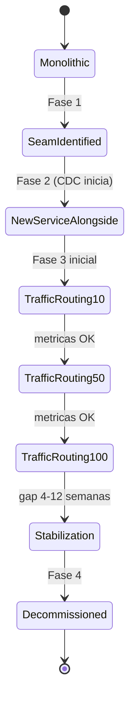

# Skill: strangler-fig-migrator (migración gradual monolito → microservicios)

> Skill canónica del módulo 4. Para activarla en Claude Code o Claude Desktop,
> copia esta carpeta a `~/.claude/skills/strangler-fig-migrator/` o a
> `.claude/skills/strangler-fig-migrator/` en la raíz del repo del grupo.
> Literatura recomendada (opcional): Martin Fowler "StranglerFigApplication"
> (2004); Eric Evans *Domain-Driven Design* (Anti-Corruption Layer).

## 1. Cuándo activarlo (triggers)

- DURANTE: definición del plan de migración cuando el árbol de decisión recomienda "romper después" o se elige "monolito modular + satélites", redacción del ADR de migración, planificación de roadmap multi-trimestre.
- ARRANCA cuando: el usuario invoca `"@strangler-fig-migrator"`, abre `docs/migration_plan.md`, o pide "plan de migración del monolito / estrangulación / Anti-Corruption Layer".
- NO ACTIVAR cuando: el árbol de decisión recomendó "no romper" (monolito modular es el destino final) o "romper ahora completo" (no es estrangulación, es big-bang); cuando no existe un monolito legacy (producto nuevo en greenfield).

## 2. Entradas obligatorias

El usuario MUST proporcionar:

- **Mapa funcional del monolito actual**: módulos / capacidades existentes con responsabilidades de alto nivel.
- **Seams identificados** (típicamente 3-7) con su descripción y bounded context tentativo.
- **Prioridad de negocio por seam**: alto / medio / bajo, basada en frecuencia de cambio, riesgo de downtime, valor de negocio del módulo.
- **Capacidad del equipo**: número de devs disponibles para migración, % de su tiempo dedicado a la migración (típicamente 20-40 % junto con feature work).
- **Tolerancia al riesgo**: ¿se puede hacer feature freeze en el monolito? ¿hay rollback rápido al monolito?
- **Restricciones**: tecnología cloud (AWS-only, etc.), lenguaje del monolito (Java legacy, .NET, Python).

Si falta cualquiera, responder: `"Necesito el mapa funcional del monolito, los seams identificados con prioridad y la capacidad del equipo antes de armar el plan de estrangulación."`

## 3. Fuentes de verdad (orden de precedencia)

1. Bounded contexts del producto (DTI §4-5).
2. Mapa del monolito actual y heat map de cambios.
3. NFRs del PRD (disponibilidad durante migración, latencia tolerable de la facade).
4. ADRs vigentes (cloud, broker, stack).
5. `AGENTS.md` del repo del producto (si existe; restricciones operativas).

## 4. Procedimiento

1. **Verificar inputs**. Si faltan seams o capacidad del equipo, STOP.
2. **Aplicar las 4 fases canónicas del Strangler Fig** por cada seam:
   - **Fase 1 — Identify seam**: aislar conceptualmente el módulo (interfaz pública del módulo dentro del monolito; nadie más toca su tablas).
   - **Fase 2 — Build new service alongside**: construir el nuevo microservicio en paralelo, con su propia BD; replicar lectura desde el monolito (CDC, query-based o Outbox).
   - **Fase 3 — Route traffic gradualmente**: usar feature flag o routing en API Gateway / proxy reverso para enviar X % del tráfico al nuevo servicio; doble escritura controlada o read-from-new + write-to-both temporalmente.
   - **Fase 4 — Decommission**: cuando el nuevo servicio sostiene 100 % del tráfico durante un periodo de estabilidad (típico 4-12 semanas), eliminar el módulo del monolito.
3. **Aplicar Anti-Corruption Layer** entre monolito y nuevo servicio:
   - Si los modelos del monolito y del nuevo servicio difieren (typical después de DDD strategic design), traducir en el límite.
   - La ACL es un adapter explícito (clase, función o proxy), NO un wrapper transparente; debe ser visible en el código.
   - Tipos del nuevo servicio NO contaminan tipos del monolito ni viceversa.
4. **Decidir el modo de routing** entre monolito y nuevo servicio:
   - **Proxy reverso** (NGINX, HAProxy, Envoy): match por path / header / cookie. Simple, sin código, granularidad limitada.
   - **API Gateway con feature flags**: routing dinámico por % de tráfico, por usuario, por geografía. Más control, requiere infra de feature flags (LaunchDarkly, AWS AppConfig, propia).
   - **Edge function** (Lambda@Edge, Cloudflare Worker): routing al borde, latencia mínima. Más complejo de operar.
   - **Strangler router en el monolito**: el monolito mismo decide y proxy. Útil cuando no hay reverse proxy disponible.
5. **Ordenar los seams** a estrangular. Criterios:
   - **Prioridad alta** primero: alto cambio + bajo riesgo de downtime + alto valor (típicamente capacidades evolutivas: catálogo, recomendaciones).
   - **Riesgo bajo** en seams iniciales: ganar experiencia antes de tocar billing / payments.
   - **Dependencias**: si seam A escribe en tablas que seam B consume, romper A primero para que B vea la API estable.
6. **Definir métricas de progreso** por fase:
   - % de tráfico migrado al nuevo servicio.
   - # de seams completados (en estado Decommissioned).
   - Latencia p99 comparativa (monolito vs nuevo).
   - Error rate comparativa.
   - Tiempo desde corte de tráfico hasta decomisión (gap de estabilidad).
7. **Estimar timeline** por seam: típicamente 1-3 meses por seam dependiendo de complejidad; los primeros 2 seams son los más lentos (curva de aprendizaje).
8. **Producir plan de migración por fases** + diagrama Mermaid de estados + tabla de seams en orden de prioridad.

## 5. Salida esperada

Tres artefactos:

- Plan de migración estructurado:

```markdown
## Plan de migración Strangler Fig — <producto>

### Seam 1: <Order Taking>
- **Fase 1 (semanas 1-2)**: aislar el módulo en el monolito; definir API interna pública.
- **Fase 2 (semanas 3-8)**: construir OrderService nuevo con BD propia; CDC desde tablas del monolito.
- **Fase 3 (semanas 9-12)**: routing 10 % → 50 % → 90 % → 100 %; doble escritura controlada.
- **Fase 4 (semanas 13-16)**: gap de estabilidad 4 semanas; decomisión.
- **Capacidad**: 2 devs × 40 % = 0.8 FTE durante 16 semanas.

### Seam 2: <Restaurant Catalog>
- ... análogo ...
```

- Diagrama Mermaid de estados de la migración:



- Tabla de seams a estrangular en orden con su rationale:

| Orden | Seam | Bounded context | Prioridad | Riesgo | Estimado | Modo routing | Métrica clave |
|-------|------|------------------|-----------|--------|----------|--------------|---------------|
| 1 | Restaurant Catalog | Restaurant Catalog | media | bajo | 12 sem | proxy reverso por path | latencia p99, error rate |
| 2 | Order Taking | Order Taking | alta | medio | 16 sem | API Gateway + feature flag | % migrado, doble-write divergencias |
| 3 | Delivery Tracking | Delivery | alta | medio | 12 sem | API Gateway | latencia p99 |
| 4 | Billing | Billing | alta | **alto** | 20 sem | doble escritura controlada + reconciliación nocturna | doble-write divergencia 0 % |

## 6. Verificación (criterios de "bien hecho")

- Cada seam tiene **las 4 fases** Strangler Fig planificadas con duración estimada.
- Cada seam tiene **Anti-Corruption Layer** declarada cuando los modelos difieren significativamente.
- El orden de seams justifica la elección (riesgo + prioridad + dependencias), no es arbitrario.
- Cada seam tiene **métrica de progreso** observable.
- El **modo de routing** está definido por seam (puede variar entre seams).
- Se contempla un **gap de estabilidad** (≥ 4 semanas) antes de decomisar.
- Se contempla **rollback rápido** al monolito durante la fase de routing.
- La capacidad del equipo es **realista** (no superpoblar al equipo entre features nuevos y migración).

## 7. Anti-patrones específicos

- **Big-bang sin estrangulación**: cortar el monolito de un día para otro. Mitigación: aplicar Strangler Fig con fases incrementales.
- **Estrangular sin Anti-Corruption Layer**: el nuevo servicio hereda el modelo del monolito. Mitigación: ACL explícita en el límite, traducción de modelos.
- **Doble escritura sin reconciliación**: el monolito y el nuevo servicio escriben en paralelo y divergen invisiblemente. Mitigación: job de reconciliación + alerta + dashboard de divergencia.
- **No decomisar nunca**: el monolito queda para siempre con código muerto. Mitigación: gap de estabilidad explícito y decomisión obligatoria en el plan.
- **Estrangular billing primero**: billing es high-risk; debería ser de los últimos. Mitigación: empezar con módulos de bajo riesgo y alto valor.
- **Routing solo por % aleatorio**: no se puede aislar usuarios afectados. Mitigación: routing por feature flag por usuario / geografía cuando es crítico.
- **Migración sin rollback rápido**: si el nuevo servicio falla, no se puede volver al monolito. Mitigación: feature flag con kill switch en < 5 min.
- **Asumir capacidad 100 % FTE**: el equipo también atiende features nuevos. Mitigación: planificar 20-40 % FTE realista; comunicar trade-off al PM.

## 8. Mini ejemplo de invocación

> "Tengo un monolito Java legacy con módulos: Order Taking, Restaurant Catalog, Delivery Tracking, Billing, Notifications, Analytics. Bounded contexts ya definidos en DTI §4. Seams candidatos: Order Taking (alta prioridad), Restaurant Catalog (media), Delivery Tracking (alta), Billing (alta pero alto riesgo). Equipo: 6 devs, 30 % dedicado a migración, 70 % a features. Tolerancia al riesgo: media (rollback al monolito posible con feature flag). AWS-only. Usa el skill `strangler-fig-migrator` y arma el plan de migración con orden + fases + métricas."

## 9. Modos de fallo conocidos

- El usuario quiere estrangular 5 seams en paralelo → STOP, recomendar máximo 2 seams concurrentes (carga cognitiva del equipo y riesgo de regresiones cruzadas).
- El usuario quiere decomisar inmediatamente después de routing al 100 % → STOP, recomendar gap de estabilidad ≥ 4 semanas; bugs raros aparecen en este intervalo.
- No existe feature flag infrastructure ni reverse proxy → STOP, listar opciones (LaunchDarkly, AWS AppConfig, AWS Application Load Balancer reglas, NGINX, propia) y pedir decisión antes de definir routing.
- El monolito es la BD compartida con otros sistemas externos (no microservicio-izable sin afectar otros sistemas) → STOP, escalar a un programa multi-equipo, no es un ejercicio de un grupo solo.

## 10. Registro de cambios

| Versión | Fecha       | Autor                  | Cambio          |
|---------|-------------|------------------------|-----------------|
| 0.1.0   | 21/05/2026  | M.Sc. Edson Terceros   | versión inicial; plan de migración Strangler Fig con ACL y métricas de progreso |
